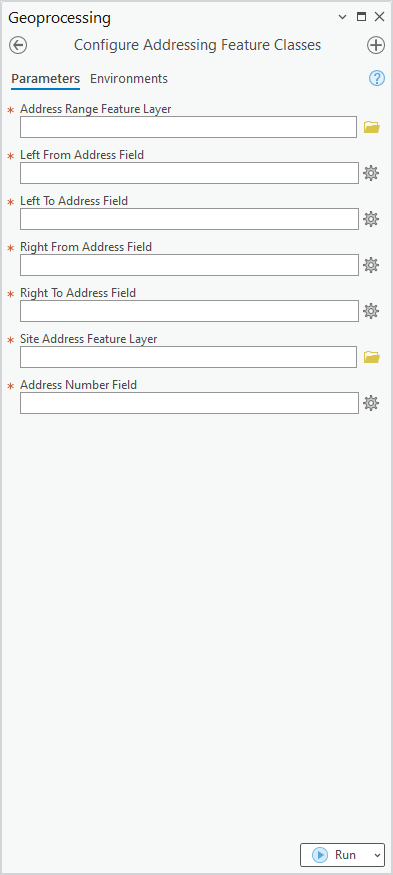

# Configure Addressing Feature Classes GP Tool Test Plan

|   |   |
| --- | --- |
| **Kind** | Test Plan · Pro |
| **Release** | — |
| **Product** | Roads & Highways · Pipeline Referencing · Utility Network |
| **Issue** | [ArcGISPro/ps-location-referencing#5572](https://devtopia.esri.com/ArcGISPro/ps-location-referencing/issues/5572) |
| **Source** | [5572-AddressingConfigGPTool_TestPlanV2.pptx](<https://esriis.sharepoint.com/sites/LocationReferencing/Shared%20Documents/General/Test%20Plans/5572-AddressingConfigGPTool_TestPlanV2.pptx>) |
| **Edited** | 2024-02-26 15:03 by Mac Christmas |
| **Extracted** | 2026-09-04 · lane `xmlstrip` |

<!-- metadata
```yaml
title: "Configure Addressing Feature Classes GP Tool Test Plan"
source_file: "5572-AddressingConfigGPTool_TestPlanV2.pptx"
source_url: "https://esriis.sharepoint.com/sites/LocationReferencing/Shared%20Documents/General/Test%20Plans/5572-AddressingConfigGPTool_TestPlanV2.pptx"
doc_id: 424
doc_kind: "Test Plan"
surface: "Pro"
doc_revision: "V2"
target_release: ""
pe: ""
dev: ""
author: "Mac Christmas"
last_edited_by: "Mac Christmas"
last_edited: "2024-02-26T15:03:57Z"
extracted: 2026-09-04
extraction_lane: xmlstrip
prompt_version: "v2.0.2"
keywords: ["addressing", "feature classes", "geoprocessing tool", "configuration", "address range", "site address point", "spatial reference", "field types"]
tools: ["Configure Addressing Feature Classes GP Tool", "Modify LRS", "Append Routes", "Overlay Events", "Remove LRS Entity"]
products: ["Roads & Highways", "Pipeline Referencing", "Utility Network"]
issues: ["ArcGISPro/ps-location-referencing#5572"]
related: [{"doc":427,"file":"configure-addressing-feature-classes-location-referencing__doc427.md","s":5.759},{"doc":450,"file":"configure-addressing-feature-classes__doc450.md","s":5.477},{"doc":249,"file":"configure-address-feature-classes-location-referencing__doc249.md","s":3.623},{"doc":429,"file":"overview-of-the-configuration-toolset__doc429.md","s":3.481},{"doc":190,"file":"lrs-addressing-and-utility-network-properties-user-story__doc190.md","s":3.457}]
```
-->

## Summary

Test plan for the Configure Addressing Feature Classes geoprocessing tool in the Location Referencing toolbox. It includes positive and negative test cases to validate tool functionality, metadata exposure, compatibility with Model Builder and Python, and proper handling of addressing feature classes and fields.

## Related documents

<!-- related:begin -->
- [Configure Addressing Feature Classes (Location Referencing)](<https://esriis.sharepoint.com/sites/lrsworkspace/LRS Doc Index/Other/configure-addressing-feature-classes-location-referencing__doc427.md>) — similar text 0.34 · 4 title words · 3 filename words · same surface <!-- rel:427 -->
- [Configure Addressing Feature Classes](<https://esriis.sharepoint.com/sites/lrsworkspace/LRS Doc Index/User Stories/configure-addressing-feature-classes__doc450.md>) — similar text 0.39 · 4 title words · 1 filename word · same surface <!-- rel:450 -->
- [Configure Address Feature Classes (Location Referencing)](<https://esriis.sharepoint.com/sites/lrsworkspace/LRS Doc Index/Other/configure-address-feature-classes-location-referencing__doc249.md>) — similar text 0.26 · 3 title words · same surface <!-- rel:249 -->
- [Overview of the Configuration Toolset](<https://esriis.sharepoint.com/sites/lrsworkspace/LRS Doc Index/Other/overview-of-the-configuration-toolset__doc429.md>) — similar text 0.24 · 3 filename words · same surface <!-- rel:429 -->
- [LRS Addressing and Utility Network Properties User Story](<https://esriis.sharepoint.com/sites/lrsworkspace/LRS Doc Index/User Stories/lrs-addressing-and-utility-network-properties-user-story__doc190.md>) — similar text 0.31 · 1 title word · 1 filename word · same surface <!-- rel:190 -->
<!-- related:end -->

<!-- docs:begin -->
## Esri documentation

[Create and modify an LRS](https://doc.esri.com/en/arcgis-pro/latest/help/production/location-referencing-pipelines/create-and-modify-an-lrs.html) · [View site address point properties](https://doc.esri.com/en/arcgis-pro/latest/help/production/roads-highways/view-site-address-point-properties.html) · [View utility network feature class properties](https://doc.esri.com/en/arcgis-pro/latest/help/production/location-referencing-pipelines/view-utility-network-feature-class-properties.html)

_No page matched:_ [Configure Addressing Feature Classes GP Tool](https://www.google.com/search?q=%22Configure%20Addressing%20Feature%20Classes%20GP%20Tool%22+site%3Adoc.esri.com) · [Append Routes](https://www.google.com/search?q=%22Append%20Routes%22+site%3Adoc.esri.com) · [Overlay Events](https://www.google.com/search?q=%22Overlay%20Events%22+site%3Adoc.esri.com) · [Remove LRS Entity](https://www.google.com/search?q=%22Remove%20LRS%20Entity%22+site%3Adoc.esri.com)
<!-- docs:end -->

---

## Slide 1


Configure Addressing Feature Classes GP Tool

| Notes |
| --- |
| Add GP tool for configuring an LRS and Addressing datasets together in the Configuration toolset in the LR toolbox Test with FGDB and EGDB (Traditional and Branch Versioning) Test with RH-AM dataset only Ensure tool UI is i18n and 508 compliant |

Devtopia Issue



## Slide 2

| Positive Tests: Other |
| --- |
| Arcpy.Describe shows metadata configuration info for the addressing layers LR Server REST endpoints expose metadata info for the addressing layers Tool works correctly in Model Builder when chained with other tools (will only work once code is checked in) Tool works correctly in stand-alone Python (will only work once code is checked in) Tool works correctly in ArcPy (will only work once code is checked in) Copy LRS dataset with addressing configured to another database, ensuring that all configurations are preserved Run Modify LRS against an LRS configured with addressing with all addressing layers present Run Append Routes against an LRS Network within an LRS configured with addressing. Append Route will automatically check the Consider existing centerlines option, but it can be unchecked Run Overlay Events/queryAttributeSet against an LRS Network within an LRS configured with addressing. When the Address Range feature class is the centerline, make sure it can be included as an input in Overlay Events/queryAttributeSet (this is similar to the check in a UNAPR dataset) Run Remove LRS Entity against an LRS configured with addressing. When choosing an addressing feature class to remove, both will be removed from the LRS after execution On the Location Referencing tab of the Properties for the Address Range feature layer, show addressing config fields |

| Positive Tests: GP Tool |
| --- |
| GP Tool is in the Configuration toolset with the Configure Utility Network Feature Class GP Tool (will only appear here after code is checked in) Address Range feature class/layer is the centerline or an LRS event that includes addressing info fields Left From, Left To, Right From, and Right To fields are Short or Long field types Site Address Point layer must be a point feature class Address Number field are Short, Long, or Text field types Address Range and Site Address layers are in the same feature dataset as the base LRS schema items Address Range and Site Address layers have the same spatial reference and tolerances as the base LRS schema items After running the GP Tool, run it again modifying some parameters Address Range and Site Address layers are empty Address Range and Site Address layers are populated with records |

## Slide 3

| Negative Tests: Error |
| --- |
| Run tool with FS layers as input Address Range feature class/layer is not the centerline or an LRS event that includes addressing info Address Range input is a table, point, or polygon layer Left From, Left To, Right From, and Right To fields are not are Short or Long field types (will only work once code is checked in, must be tested in Python) Site Address Point layer input is a table, line, or polygon layer Address Number field is not Short, Long, or Text field types (will only work once code is checked in, must be tested in Python) Address Range and Site Address layers are not in another feature dataset as the base LRS schema items Address Range and Site Address layers are in different a different database from the base LRS schema items Address Range and Site Address layers are in the same database as the base LRS schema items, but not in the feature dataset Address Range and Site Address layers do not have the same spatial reference and tolerances as the base LRS schema items Run Modify LRS against an LRS configured with addressing. The Address Range feature class is missing from the database Run Modify LRS against an LRS configured with addressing. The Site Address feature class is missing from the database Run Modify LRS against an LRS configured with addressing. Both the Address Range and Site Address feature classes are missing from the database Run Modify LRS against an LRS configured with addressing. The Address Range feature class is missing addressing fields Run Modify LRS against an LRS configured with addressing. The Site Address feature class is missing addressing fields Run Modify LRS against an LRS configured with addressing. The Address Range and Site Address feature classes are missing addressing fields |
