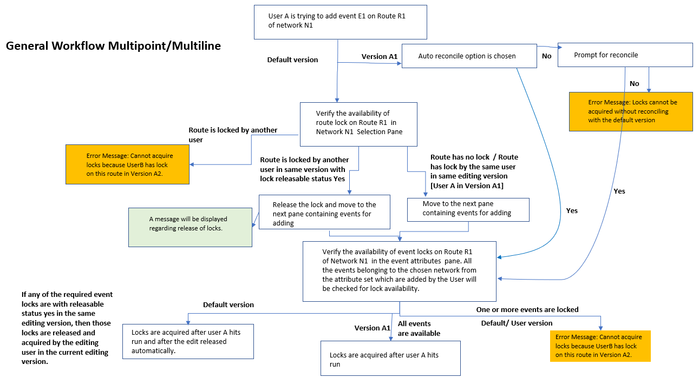
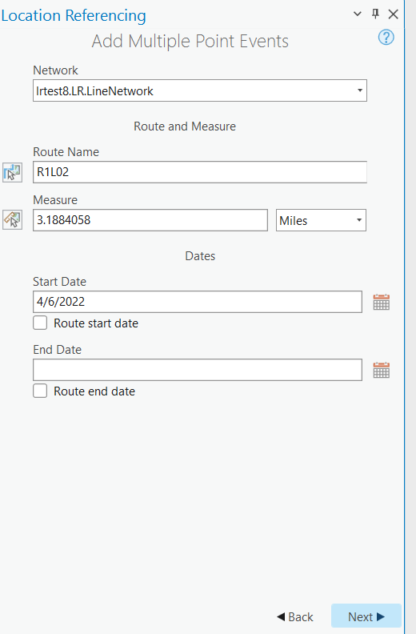

# Conflict Prevention for Event Editing in Pro – Add Multiple Point Events Tool Test Plan

| Field | Value |
| --- | --- |
| **Doc** | 667 · Test Plan · Pro |
| **Product** | — |
| **Release** | — |
| **Issues** | — |
| **Source** | [Conflict Prevention_Multiplepointtevents_Pro_TestPlan.docx](<https://esriis.sharepoint.com/sites/LocationReferencing/Shared%20Documents/General/Test%20Plans/Conflict%20Prevention_Multiplepointtevents_Pro_TestPlan.docx>) |
| **People** | author Lakshmi Ananthanarayanan · PE — · dev — |
| **Edited** | 2022-04-12 23:24 by Lakshmi Ananthanarayanan |
| **Extracted** | 2026-09-04 · lane xmlstrip · format 3.0 · prompt v2.0.2 |
| **Keywords** | conflict prevention · event editing · point event · event lock · branched version · line network · nonline network · versioning |
| **Tools** | Add Multiple Point Events |

## Summary

This test plan covers conflict prevention locking behavior for the Add Multiple Point Events tool in ArcGIS Pro. It includes test cases for branched version service data with conflict prevention enabled, testing on both line and nonline networks, and various user version scenarios. The plan verifies lock acquisition, lock transfer, error handling, and lock release under different conditions.

## Related documents

<!-- related:begin -->
- [Test Plan for Conflict Prevention for Add Multiple Line Events Tool in ArcGIS Pro](<https://esriis.sharepoint.com/sites/lrsworkspace/LRS Doc Index/Test Plans/for-conflict-prevention-for-add-multiple-line-events-tool.md>) — similar text 0.61 · 6 title words · 3 filename words · same kind/surface/folder <!-- rel:668 s=8.56 -->
- [Conflict Prevention for Event Editing in Pro – LR Event Tools](<https://esriis.sharepoint.com/sites/lrsworkspace/LRS Doc Index/Test Plans/conflict-prevention-for-event-editing-in-pro-lr-event-tools.md>) — similar text 0.39 · 5 title words · 3 filename words · same kind/surface/folder <!-- rel:666 s=7.57 -->
- [Conflict Prevention for Event Editing in Pro – Core Tools](<https://esriis.sharepoint.com/sites/lrsworkspace/LRS Doc Index/Test Plans/conflict-prevention-for-event-editing-in-pro-core-tools-v4.md>) — similar text 0.36 · 5 title words · 3 filename words · same kind/surface/folder <!-- rel:670 s=6.927 -->
- [Conflict Prevention for Event Editing in Pro – Core Tools](<https://esriis.sharepoint.com/sites/lrsworkspace/LRS Doc Index/Test Plans/conflict-prevention-for-event-editing-in-pro-core-tools-2022-04.md>) — similar text 0.37 · 5 title words · 3 filename words · same kind/surface/folder <!-- rel:671 s=6.594 -->
- [Conflict Prevention for Event Editing in Pro](<https://esriis.sharepoint.com/sites/lrsworkspace/LRS Doc Index/User Stories/conflict-prevention-for-event-editing-in-pro.md>) — similar text 0.19 · 5 title words · 3 filename words · same surface <!-- rel:683 s=5.201 -->
<!-- related:end -->

<!-- docs:begin -->
## Esri documentation

[Add multiple point events](https://doc.esri.com/en/arcgis-pro/latest/help/production/roads-highways/add-multiple-point-events.html) · [Conflict prevention](https://doc.esri.com/en/arcgis-pro/latest/help/production/location-referencing-pipelines/conflict-prevention.html) · [Event editing using the attribute table](https://doc.esri.com/en/arcgis-pro/latest/help/production/location-referencing-pipelines/event-editing-using-the-attribute-table.html)
<!-- docs:end -->

---

Conflict Prevention for Event Editing in Pro – Add Multiple point events Tool

For Add multiple point Event tool

- Test on branched version service data with conflict prevention enabled
- Test on nonline and line network
- Using point attribute sets – Allpointevents(default), AttributesetN1 (Containing E1, E2, E3), AttributesetN2_1 (containing only E1_N2)
- N1 – nonline network – three events E1, E2 and E3.
- N2 – line network – two events E1_N2 and E2_N2
- User A has versions Version A1 and VersionA2.
- User B has version Version B1.

In case of event lock, for nonline network event lock is applied for a route and for line network event lock is applied for a line (ie event is locked for all the routes in a line).
Verify both in default version and user version. (100% testing in user version, 10% in default)

  General Workflow for both multiline and multipoint events.  In case of line networks, line locks will be considered.

All the testcases mentioned in this test plan in the following pages are for acquiring conflict prevention locks after reconciling with default.

[figure: All the testcases mentioned in th · is test · plan · in the following pages · are for acquiring conflict prevention lock · s · after reconciling · with · default.]

| TC No | Test case | Locked by | Locked in | Expected result |
| --- | --- | --- | --- | --- |
| 1 | No route lock exists | None | None | Move to the next pane for acquiring event lock |
| 2 | Route locked by same user in the same editing version | User A | Version A 1 | Move to the next pane for acquiring event lock |
| 3 | Concurrent Route locked by another user in different version | User B | Version A 2 | Move to the next pane for acquiring event lock |
|  |  | Concurrent Route |  |  |
| 4 | Route of different network locked by the same user in different version | User A | Version B1 | Move to the next pane for acquiring event lock |
|  |  | Route of different network |  |  |
| 5 | Route locked by another user in same editing version and not edited in that version & version not in use. | User B | Version A1 | Release the route lock and move to the next pane for acquiring event lock |
| 6 | Route locked by current user in different version and not edited in that version | User A | Version A2 | Release the route lock and move to the next pane for acquiring event lock |
| 7 | Route locked by another user in same editing version and has edits in that version | User B | Version A 1 | Cannot release event lock. Show error message |
| 8 | Route locked by the current user in different version and has edits | User A | Version A 2 | Cannot release event lock. Show error message |
| 9 | Current u ser A chooses R1 from network N1 which has lock by user B in same version wit h releasable status . Now the lock gets released . User moves to the next pane gets back again and chooses a different route | User A | Version A1 | We are not acquiring any locks in this pane. We just verify and if required release locks. When the user switches the network, the entire pane will be emptied. Instead of a network if a user changes route, reverify for the availability of lock. |

[figure: Verifying the · availability of route lock in pane 2 where we choose the · route in the · network. · Verify by picking the route and manually entering the routeID. · Verify both with route name and routeID]

    In Pane 2, checking for route/line lock

| TC No . | Events Added | Test Case | Network1 |  |  | Result | Message |
| --- | --- | --- | --- | --- | --- | --- | --- |
|  |  |  | E1 | E2 | E3 |  |  |
| 10 a. | D efault attribute set - All point events are checked and edited in that selected Network | No lock exists |  |  |  | Event lock acquired for the events E1, E2 & E3 of the Network1 | Message for acquiring locks at the top of pane – for all events |
| 10b. |  | Event locked by another user in a same version with releasable status yes for event E2 |  | Lock transfer from User B to User A in User A . A 1 |  | Event lock acquired for the events E1, E2 & E3 of the Network1 | Message for acquiring locks at the top of pane – for all events |
| 10c. |  | Lock exists on one of the events - locked by different user in the same version | Locked by U ser B in A 1 |  |  | No Event lock acquired | Error message at the top of the pane : Cannot acquire locks because User B has the lock in version User A . A 1 + text file listing the locked events |
| 10d. |  | Events are locked by current editing user in the current editing version | UserA in A1 | UserA in A1 | UserA in A1 | Already Locked by user A . A 1 | No message |
| 10e |  | All the events are locked by the same user in different version | Locked by User A in Version User B . B1 | Locked by User A in Version User B . B1 | Locked by User A in Version User B . B1 | No Event lock acquired | Error message at the top of the pane : Cannot acquire locks because User A has the lock in version User B . B1 + text file listing the locked events |
| 10f. | D efault attribute set - Only one point event layer checked and edited in that selected network | No lock exists |  | X This event is available for locking but the user unchecks it in the attribute pane and this event is not added. | X This event is available for locking but the user unchecks it in the attribute pane and this event is not added. | Event lock acquired for the events E1, of the Network1 | Message for acquiring locks at the top of pane – for event E1 |
| 10g |  | Event E1 locked by another user in different version | Locked by User B in version B1 | X | x | No Event lock acquired | Error message at the top of the pane : Cannot acquire locks because User B has the lock in version User B . B1 |

Network1 is chosen in the second pane.  Current user is User A, adding point events E1, E2 &E3 for Network1 in the version A1.  UserA has two versions A1 and A2 and UserB has a version B1.   For both User A and User B use editor / GIS professional Privileges
Attribute set containing two networks point event is used for the following cases.  Current user is User A, adding point events E1, E2 &E3 for Network1 and E1_N2 and E2_N2 for Network2 in the version A1.  UserA has two versions A1 and A2 and UserB has a version B1.

| TC No | Event added | Test case |  | Network1 |  |  |  | Network2 |  | Result | Message |
| --- | --- | --- | --- | --- | --- | --- | --- | --- | --- | --- | --- |
|  |  |  |  | E1 | E2 | E3 |  | E 1_N2 | E 2 _N2 |  |  |
| 11a . | Point Events – Attribute set contains E1, E2 &E3 of Network1 and E1 _ N2 &E2 _ N2 of Network2 | No lock exists | Choosing Network1 |  |  |  |  |  |  | Event lock acquired for the events E1, E2 & E3 of the Network1 | Message for acquiring locks at the top of pane – for all events |
| 11b. |  |  | Choosing Network 2 |  |  |  |  |  |  | Event lock acquired for the event E1_N2 & E2_N2 of the Network2 | Message for acquiring locks at the top of pane |
| 11c. |  | Events in Network2 are locked by current editing user in the current editing version | Choosing Network1 |  |  |  |  | Locked by UserA in A 1 |  | Event lock acquired for the event E1, E2 , E3 of the Network1 | Message for acquiring locks at the top of pane |
| 11d. |  |  | Choosing Network 2 |  |  |  |  | User A in A 1 | User A in A 1 | Events E1_N2 a n d E2_N2 are already locked by User A in user A . A 1 | No new locks acquired . No message |
| 11e. |  | Event locked by another user in a same version with releasable status yes for event s E1, E2 & E3 of Network1 | Choosing Network1 | Lock transfer from User B to User A in User A . A 1 |  |  |  |  |  | Event lock acquired for the events E1, E2 & E3 of the Network1 | Message for acquiring locks at the top of pane – for all events |
| 11f. |  |  | Choosing Network2 |  |  |  |  |  |  | Event lock acquired for the event E1_N2 & E2_N2 of the Network2 | Message for acquiring locks at the top of pane |
| 11g |  | E1 of network1 is locked by another user in same version | Choosing Network1 |  | Locked by User B in version User A . A 1 |  |  |  |  | No Event lock acquired | Error message at the top of the pane : Cannot acquire locks because User B has the lock in version User A . A 1 |
| 11h |  |  | Choosing Network2 |  |  |  |  |  |  | Event lock acquired for the event E1_N2 & E2_N2 of the Network2 | Message for acquiring locks at the top of pane – for all events |
| 11i. |  | Events in Network2 are locked by another user in another version | Choosing Network1 |  |  |  |  | Locked by User B in version User B . B1 | Locked by User B in version User B . B1 | Event lock acquired for the events E1, E2 & E3 of the Network1 | Message for acquiring locks at the top of pane – for all events |
| 11j. |  |  | Choosing Network2 |  |  |  |  |  |  | No Event lock acquired | Error message at the top of the pane : Cannot acquire locks because User B has the lock in version User B . B1 |

| TC No | Event Added | Test case |  | Network1 |  |  |  | Network2 |  | Result | Message |
| --- | --- | --- | --- | --- | --- | --- | --- | --- | --- | --- | --- |
|  |  |  |  | E1 | E2 | E3 |  | E 1_N2 | E 2 _N2 |  |  |
| 12a. | Point Events – Attribute set contains E1, E2 &E3 of Network1 only | No lock exists | Choosing Network1 |  |  |  |  |  |  | Event lock acquired for the events E1, E2 & E3 of the Network1 | Message for acquiring locks at the top of pane – for all events |
| 12b. |  |  | Choosing Network 2 |  |  |  |  |  |  | No Event lock acquired | No attributes are selected . |
| 12c. |  | Events in Network2 are locked by current editing user in the current editing version | Choosing Network1 |  |  |  |  | Locked by user A in A 1 |  | Event lock acquired for the event E1, E2 , E3 of the Network1 | Message for acquiring locks at the top of pane |
| 12d. |  |  | Choosing Network 2 |  |  |  |  |  |  | No Event lock acquired | Error message "No attributes are selected." |
| 12e. |  | Event locked by another user in a same version with releasable status yes for event s E1_N2, E2 _N2 of Network2 | Choosing Network1 |  |  |  |  |  |  | Event lock acquired for the events E1, E2 & E3 of the Network1 | Message for acquiring locks at the top of pane – for all events |
| 12f. |  |  | Choosing Network2 |  |  |  |  | L ock transfer possible | Lock transfer possible | No Event lock acquired as the attribute set used does not contain events from Network 2 | Error message "No attributes are selected." |
| 12g |  | E 2 of network1 is locked by another user in same version | Choosing Network1 |  | Locked by User B in version User A . A 1 |  |  |  |  | No Event lock acquired | Error message at the top of the pane : Cannot acquire locks because User B has the lock in version User A . A 1 |
| 12h |  |  | Choosing Network2 |  |  |  |  |  |  | No Event lock acquired | Error message will say "No attributes are selected." |
| 12i. |  | Events in Network2 are locked by another user in another version | Choosing Network1 |  |  |  |  | Locked by User B in version User B . B1 | Locked by User B in version User B . B1 | Event lock acquired for the events E1, E2 & E3 of the Network1 | Message for acquiring locks at the top of pane – for all events |
| 12j. |  |  | Choosing Network2 |  |  |  |  |  |  | No Event lock acquired as the attribute set does not contain events from network2 | Error message "No attributes are selected." |

### Do only one or two test cases from 13 a – 13 j

| TC No | Event Added | Test case |  | Network1 |  |  | Network2 |  | Result | Message |
| --- | --- | --- | --- | --- | --- | --- | --- | --- | --- | --- |
|  |  |  |  | E1 | E2 | E3 | E 1_N2 | E 2 _N2 |  |  |
| 1 3 a. | Point Events – Attribute set contains E 1_ N 2 of Network2 only | No lock exists | Choosing Network1 |  |  |  |  |  | No Event lock acquired | Error message "No attributes are selected." . |
| 1 3 b. |  |  | Choosing Network 2 |  |  |  |  |  | Event lock acquired only for the event E1 _N2 of Network2 | Message for acquiring locks at the top of pane |
| 1 3 c. |  | Events in Network2 are locked by current editing user in the current editing version | Choosing Network1 |  |  |  | Locked by user A in A 1 |  | No Event lock acquired | Error message "No attributes are selected." |
| 1 3 d. |  |  | Choosing Network 2 |  |  |  | Locked by user A in A 1 |  | Events E1_N2 a n d E2_N2 are already locked by User 1 in user1.V1 . No new locks acquired | No message is displayed regarding locks user can add only event in E1_N1 |
| 1 3 e. |  | Event locked by another user in a same version with releasable status yes for event s E1_N2, E2 _N2 of Network2 | Choosing Network1 |  |  |  |  |  | No Event lock acquired | Error message "No attributes are selected." |
| 1 3 f. |  |  | Choosing Network2 |  |  |  | Lock transfer from User B to User A in User A . A 1 | Lock transfer possible | Lock acquired only for E1_N 2 by lock transfer | Message for acquiring locks at the top of pane |
| 1 3 g . |  | E 2 of network1 is locked by another user in same version | Choosing Network1 |  | Locked by User B in version User A . A 1 |  |  |  | No Event lock acquired | Error message "No attributes are selected." |
| 1 3 h . |  |  | Choosing Network2 |  |  |  |  |  | Lock acquired only for E1_N1 | Message for acquiring locks at the top of pane |
| 1 3 i. |  | Events in Network2 are locked by another user in another version | Choosing Network1 |  |  |  | Locked by User B in version User B . B1 |  | No Event lock acquired as the attribute set does not contain events from network2 | Error message "No attributes are selected." |
| 1 3 j. |  |  | Choosing Network2 |  |  |  |  |  | No Event lock acquired | Error message at the top of the pane : Cannot acquire locks because User B has the lock in version User B . B1 for the event E1_N2 |

### Other test cases:

1. Verify a test case with more events are locked thereby a list of locked events is generated. verify the list for its correctness.

1. Acquiring lock for a test case through REST and ensure the results are correct

1. Verify locks can be acquired using protected version

1. Verify locks can be acquired using private version

1. User B has event locks in the releasable status of Yes in a protected version UserB.P1. User A tries to the same event in the same version when the version is not in use by User B. Lock should not be transferred to User A.  Error message should be displayed saying User B has locked the event.

1. Verify the above test case in Private version.

1. Verify a portal user with data viewer role cannot acquire lock

1. Verify a portal user having no access to the service cannot acquire lock

1.                Do few test cases with the client dataset - which has number of events and with number of locks. Do cases targeting acquiring lock, failing to acquire lock and transfer of locks

1.  In the default version do a test case of acquiring lock and verify the locks are released automatically. Also test case of cancelling or undoing the event added in which case also locks are removed automatically.

