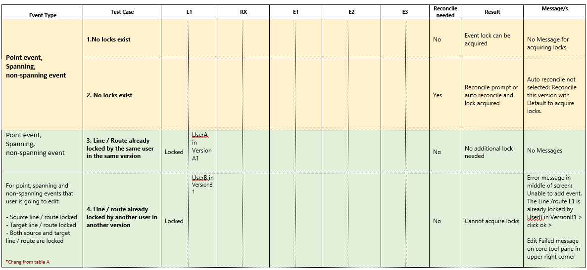

# Conflict Prevention for Event Editing in Pro – Core Tools

|   |   |
| --- | --- |
| **Kind** | Test Plan · Pro |
| **Release** | — |
| **Source** | [TestPlan_Conflict Prevention for Event Editing in Pro_Core_V4.docx](<https://esriis.sharepoint.com/sites/LocationReferencing/Shared%20Documents/General/Test%20Plans/TestPlan_Conflict%20Prevention%20for%20Event%20Editing%20in%20Pro_Core_V4.docx>) |
| **Edited** | 2022-04-06 21:41 by Johum Khushk |
| **Extracted** | 2026-09-04 · lane `xmlstrip` |

<!-- metadata
```yaml
title: "Conflict Prevention for Event Editing in Pro – Core Tools"
source_file: "TestPlan_Conflict Prevention for Event Editing in Pro_Core_V4.docx"
source_url: "https://esriis.sharepoint.com/sites/LocationReferencing/Shared%20Documents/General/Test%20Plans/TestPlan_Conflict%20Prevention%20for%20Event%20Editing%20in%20Pro_Core_V4.docx"
doc_id: 670
doc_kind: "Test Plan"
surface: "Pro"
doc_revision: "V4"
target_release: ""
pe: ""
dev: ""
author: "Rahul Rakshit"
last_edited_by: "Johum Khushk"
last_edited: "2022-04-06T21:41:00Z"
extracted: 2026-09-04
extraction_lane: xmlstrip
prompt_version: "v2.0.2"
keywords: ["conflict prevention", "event editing", "event lock", "route lock", "spanning event", "point event", "line event", "attribute table", "reconcile", "lock acquisition", "lock conflict", "core tools", "rest endpoint"]
tools: ["core editing tools", "Pro Attribute table", "Move & Edit vertices tools", "Merge and Append GP tool", "calculate field", "REST endpoint"]
products: []
issues: []
related: [{"doc":671,"file":"conflict-prevention-for-event-editing-in-pro-core-tools__doc671.md","s":12.02},{"doc":666,"file":"conflict-prevention-for-event-editing-in-pro-lr-event-tools__doc666.md","s":10.194},{"doc":683,"file":"conflict-prevention-for-event-editing-in-pro__doc683.md","s":6.946},{"doc":667,"file":"conflict-prevention-for-event-editing-in-pro-add-multiple-point-events-tool__doc667.md","s":6.927},{"doc":668,"file":"test-plan-for-conflict-prevention-for-add-multiple-line-events-tool-in-arcgis__doc668.md","s":5.9}]
```
-->

## Summary

This document details test cases for conflict prevention during event editing in ArcGIS Pro core tools. It covers scenarios for creating and editing point and line events on line and non-line networks, including lock acquisition, lock conflicts, reconcile prompts, and error handling. The document also includes tests for event editing via the attribute table and REST endpoint error responses related to locks.

## Related documents

<!-- related:begin -->
- [Conflict Prevention for Event Editing in Pro – Core Tools](<https://esriis.sharepoint.com/sites/lrsworkspace/LRS Doc Index/Test Plans/conflict-prevention-for-event-editing-in-pro-core-tools__doc671.md>) — similar text 0.96 · 6 title words · 6 filename words · same kind/surface/folder <!-- rel:671 -->
- [Conflict Prevention for Event Editing in Pro – LR Event Tools](<https://esriis.sharepoint.com/sites/lrsworkspace/LRS Doc Index/Test Plans/conflict-prevention-for-event-editing-in-pro-lr-event-tools__doc666.md>) — similar text 0.80 · 6 title words · 5 filename words · same kind/surface/folder <!-- rel:666 -->
- [Conflict Prevention for Event Editing in Pro](<https://esriis.sharepoint.com/sites/lrsworkspace/LRS Doc Index/User Stories/conflict-prevention-for-event-editing-in-pro__doc683.md>) — similar text 0.22 · 5 title words · 5 filename words · same surface <!-- rel:683 -->
- [Conflict Prevention for Event Editing in Pro – Add Multiple Point Events Tool Test Plan](<https://esriis.sharepoint.com/sites/lrsworkspace/LRS Doc Index/Test Plans/conflict-prevention-for-event-editing-in-pro-add-multiple-point-events-tool__doc667.md>) — similar text 0.36 · 5 title words · 3 filename words · same kind/surface/folder <!-- rel:667 -->
- [Test Plan for Conflict Prevention for Add Multiple Line Events Tool in ArcGIS Pro](<https://esriis.sharepoint.com/sites/lrsworkspace/LRS Doc Index/Test Plans/test-plan-for-conflict-prevention-for-add-multiple-line-events-tool-in-arcgis__doc668.md>) — similar text 0.31 · 3 title words · 3 filename words · same kind/surface/folder <!-- rel:668 -->
<!-- related:end -->

<!-- docs:begin -->
## Esri documentation

[Conflict prevention](https://doc.esri.com/en/arcgis-pro/latest/help/production/location-referencing-pipelines/conflict-prevention.html) · [Event editing using the attribute table](https://doc.esri.com/en/arcgis-pro/latest/help/production/location-referencing-pipelines/event-editing-using-the-attribute-table.html)

_No page matched:_ [core editing tools](https://www.google.com/search?q=%22core%20editing%20tools%22+site%3Adoc.esri.com) · [Pro Attribute table](https://www.google.com/search?q=%22Pro%20Attribute%20table%22+site%3Adoc.esri.com) · [Move & Edit vertices tools](https://www.google.com/search?q=%22Move%20%26%20Edit%20vertices%20tools%22+site%3Adoc.esri.com) · [Merge and Append GP tool](https://www.google.com/search?q=%22Merge%20and%20Append%20GP%20tool%22+site%3Adoc.esri.com) · [calculate field](https://www.google.com/search?q=%22calculate%20field%22+site%3Adoc.esri.com) · [REST endpoint](https://www.google.com/search?q=%22REST%20endpoint%22+site%3Adoc.esri.com)
<!-- docs:end -->

---

## 1: Conflict Prevention for Event Editing in Pro – Core Tools

Notes:

- Conflict prevention for event editing is applicable to following tools:
  - Creating new event via core editing tools
  - Creating new event via Pro Attribute table
  - Editing event via core editing tools
  - Editing event via Pro Attribute table
- Test on branched version service data with conflict prevention enabled
- Events spanning, Events not spanning, Point & Stationing Events registered to Line Network + Nonline Network
- Point and line attribute sets have at least three events
- N1: Line Network, N2: Non-Line Network
- User A has: VersionA1 & VersionA2   |   User B has: VersionB1
- In case of non-line network, only event belonging to a route will be locked. While, locking an event should lock the event layer for all the routes in a line (Line ID and line name in the locks table will be inserted when spanning event gets locked)
- (Where event is moved from one route / line to another) both source and target route/line id will be locked. If either of them couldn't be acquired, edit will fail.

[figure: User selects one LR event tools & tries to add an event on a route · Yes · User reconciles · Feature will be created · on map · Default version: Locks are released automatically · User version: Locks persist in locks table · Lock transfer by another use / lock got deleted / lock acquired by another user · F · ill in the attributes · in table / pane · Validate again if route / event lock is still present · Revert the edit on map · / table · M · essage · displayed: · lock not acquired · Route or Event lock is · present on · any layer · (another user / version) · No event lock needed · Route lock is · present on · any layer · (same user / version) · Acquire event lock for single event layer for that route, · no confirmation / indication for acquiring lock · No Route / event lock present · on any layer · Reconcile needed · User selects core tool & clicks on a route · to create a point / line event OR edit an existing event on map · Check for reconcile · if option isn’t selected · Auto reconcile · if option is selected · Prompt user to reconcile · Check if there is route or event lock present · on any · layer · Reconcile not needed · No · User creates a record in event table or tries to edit an existing record]

[figure: Conflict Prevention Workflow for Event · Creation / · Editing]

| [figure: A- Create · event · using core tools · - Core Create point, Create line · - Verify in both default and user version (100% testing in user version, 10% in default) · - All cases will be tested with · both · tools] Event Type | Test Case | L1 |  |  | RX |  |  | E1 |  |  | E2 |  | E3 |  | Reconcile needed |  | Result |  | Message/s |  |
| --- | --- | --- | --- | --- | --- | --- | --- | --- | --- | --- | --- | --- | --- | --- | --- | --- | --- | --- | --- | --- |
| Point event, Spanning, non- spanning event | 1.No locks exist |  |  |  |  |  |  |  |  |  |  |  |  |  | No | Event l ock can be acquired |  | No Message for acquiring locks. |  |  |
|  | 2 . No locks exist |  |  |  |  |  |  |  |  |  |  |  |  |  | Yes | Reconcile prompt or auto reconcile and lock acquired |  | Auto reconcile not selected: Reconcile this version with Default to acquire locks. |  |  |
| Point event, Spanning, non- spanning event | 3 . Line / Route already locked by the same user in the same version | Locked | UserA in VersionA1 |  |  |  |  |  |  |  |  |  |  |  | No | No additional lock needed |  | No Messages |  |  |
| Point event, non- spanning event , For spanning events that user is going to add: - From route locked - T o route locked - Both from / to routes are locked | 4 . Line / route already locked by another user in another version | Locked | UserB in VersionB1 |  |  |  |  |  |  |  |  |  |  |  | No | Cannot acquire locks |  | Error message in middle of screen: Unable to add event. The Line /route L1 is already locked by UserB in VersionB1 > click ok > Edit Failed message on core tool pane in upper right corner |  |  |
| Point event, non- spanning event , For spanning events that user is going to add: - From route locked - To route locked - Both from / to routes are locked | 4.1 Route locked by another user in the same version where the first user is trying for the edit | Locked | UserA in VersionB1 |  |  |  |  |  |  |  |  |  |  |  | No | Cannot acquire locks |  | Error message in middle of screen: Unable to add event. The Line /route L1 is already locked by User A in VersionB1 > click ok > Edit Failed message on core tool pane |  |  |
| Point event, Spanning, non- spanning event | 4 . 2 Line / route already locked by another user B in another version . Version not being used. User A transfers the lock and try to make an edit | Locked | UserB in VersionB1 |  |  |  |  |  |  |  |  |  |  |  | No | Locks can be acquired |  | No Message for acquiring locks. |  |  |
| Point event, Spanning, non- spanning event | 5 . Concurrent route on another network is locked by the same user in the same version – verify this case with another user |  |  | Locked |  | UserA in VersionA1 |  |  |  |  |  |  |  |  | No | Lock can be acquired |  | No Message for acquiring locks |  |  |
| Point event, non- spanning event , For spanning events that user is going to add: - From route locked - To route locked - Both from / to routes are locked | 6 . Same user has a line / route lock in another version | Locked | UserA in VersionA2 |  |  |  |  |  |  |  |  |  |  |  | No | Cannot acquire locks |  | Error message in middle of screen: Unable to add event. The Line/route L1 is already locked by UserA in VersionA2 > click ok > Edit Failed message on core tool pane in upper right corner |  |  |
| Point event, Spanning, non- spanning event | 7 . Another user has a lock (for that line / route ) on another event layer on the same route in another version | Locked | UserB in VersionB1 |  |  |  |  |  |  | Locked |  | UserB in VersionB1 |  |  | No | Lock /s can be acquired |  | No Message for acquiring locks |  |  |
|  | 7.1 Another user B has a lock (for that line / route ) on event layer on the same route in another version . Version not being used. User A transfers the lock and try to make an edit | Locked | UserB in VersionB1 |  |  |  |  |  |  | Locked |  | UserB in VersionB1 |  |  | No | Lock /s can be acquired |  | No Message for acquiring locks |  |  |
|  | 8. Same user has a lock (for that line / route ) on another event layer on the same route in another version | Locked | UserA in VersionA2 |  |  |  |  |  |  | Locked |  | UserA in VersionA2 |  |  | No | Lock /s can be acquired |  | No Message for acquiring locks |  |  |
| Point event, non- spanning event , For spanning events that user is going to add: - From route locked - To route locked - Both from / to routes are locked | 9. Event layer already locked (for that line /route ) by the same user in another version | Locked | UserA in Version A2 |  |  |  | Locked |  | UserA in Version A2 |  |  |  |  |  | No | Cannot acquire locks |  | Error message in middle of screen: Cannot acquire locks because UserA has the lock in version UserA.VersionA1 > click ok > Edit Failed message on core tool pane in upper right corner |  |  |
|  | 10. Event layer already locked (for that line / route ) by another user in another version | Locked | UserB in Version B1 |  |  |  | Locked |  | UserB in Version B1 |  |  |  |  |  | No | Cannot acquire locks |  | Error message in middle of screen: Cannot acquire locks because UserB has the lock in version UserB.VersionB1 Edit Failed message on core tool pane in upper right corner |  |  |
|  | 1 1. User has lock on all the event layers for that line /route in another version | Locked | UserA in VersionA2 |  |  |  | Locked |  | UserA in VersionA2 | Locked |  | UserA in VersionA2 |  |  | Yes | Reconcile but cannot acquire locks |  | Auto reconcile not selected: Reconcile this version with Default to acquire locks. Error message in middle of screen: Cannot acquire locks because UserA has the lock in version UserA.VersionA2 > click ok > Edit Failed message on core tool pane in upper right corner |  |  |
| Point event, non- spanning event , For spanning events that user is going to add: - From route locked - To route locked - Both from / to routes are locked | 1 2 . User has lock on some events, another user has lock on other events | Locked | UserB in VersionB1 |  |  |  | Locked |  | UserB in VersionB1 | Locked |  | UserA in VersionA1 |  |  | No | Cannot acquire locks |  | Error message in middle of screen: Cannot acquire locks because UserA has the lock in version UserA.VersionA1 +Text file enlisting all events that are locked by other user/s with the version/s info. Edit Failed message on core tool pane in upper right corner |  |  |
|  | 1 3 . User has lock on some events, another user has lock on other events . Try to edit all the events. | Locked | UserA in VersionA2 |  |  |  | Locked |  | UserA in VersionA2 | Locked |  | UserB in VersionB1 |  |  | No | Cannot acquire locks |  | Error message in middle of screen: Cannot acquire locks because UserA has the lock in version UserA.VersionA1 +Text file enlisting all events that are locked by other user/s with the version/s info. Edit Failed message on core tool pane in upper right corner |  |  |
|  | 14 . Same user has a route / line lock and a lock (for that line /route ) on another event layer in the same version | Locked | UserA in VersionA1 |  |  |  |  |  |  | Locked |  | UserA in VersionA1 |  |  | No | Lock can be acquired |  | No message for acquiring locks |  |  |
| Point event, Spanning, non- spanning event | 1 5 . Concurrent route on another network and another event of that route are locked by the same user in the same version |  |  | Locked |  | UserA in VersionA1 |  |  |  |  |  |  | Locked | UserA in VersionA1 | No | Lock can be acquired |  | No message for acquiring locks |  |  |
|  | 1 6 . Line /route and another event layer on that line / route are locked by the same user in the same version | Locked | UserA in VersionA1 |  |  |  | Locked |  | UserA in VersionA1 |  |  |  |  |  | No | Lock can be acquired |  | No message for acquiring locks |  |  |

| [figure: B · - · Edit · event · using core tools · - Move & Edit vertices tools · - Verify in both default and user version (100% testing in user version, 10% in default) · - All cases will be tested with both tools] Event | Test Case | L 2 | L1 |  |  | RX |  |  | E1 |  |  | E2 |  | E3 |  | Reconcile needed |  | Result |  | Message/s |  |
| --- | --- | --- | --- | --- | --- | --- | --- | --- | --- | --- | --- | --- | --- | --- | --- | --- | --- | --- | --- | --- | --- |
| Point event, Spanning, non- spanning event | 1.No locks exist |  |  |  |  |  |  |  |  |  |  |  |  |  |  | No | Event l ock can be acquired |  | No Message for acquiring locks. |  |  |
|  | 2 . No locks exist |  |  |  |  |  |  |  |  |  |  |  |  |  |  | Yes | Reconcile prompt or auto reconcile and lock acquired |  | Auto reconcile not selected: Reconcile this version with Default to acquire locks. |  |  |
| Point event, Spanning, non- spanning event | 3 . Line / Route already locked by the same user in the same version | Not Locked | Locked | UserA in VersionA1 |  |  |  |  |  |  |  |  |  |  |  | No | No additional lock needed |  | No Messages |  |  |
| For point, spanning and non-spanning events that user is going to edit: - Source line / route locked - Target line / route locked [figure: *Chang from table A] - Both source and target line / route are locked | 4 . Line / route already locked by another user in another version | Not Locked | Locked | UserB in VersionB1 |  |  |  |  |  |  |  |  |  |  |  | No | Cannot acquire locks |  | Error message in middle of screen: Unable to add event. The Line /route L1 is already locked by UserB in VersionB1 > click ok > Edit Failed message on core tool pane in upper right corner |  |  |
|  |  | Locked |  |  |  |  |  |  |  |  |  |  |  |  |  |  |  |  |  |  |  |
| For point, spanning and non-spanning events that user is going to edit: - Source line / route locked - Target line / route locked [figure: *Chang from table A] - Both source and target line / route are locked | 4. 1 Route locked by another user in the same version where the first user is trying for the edit | Not Locked | Locked | UserA in VersionB1 |  |  |  |  |  |  |  |  |  |  |  | No | Cannot acquire locks |  | Error message in middle of screen: Unable to add event. The Line /route L1 is already locked by UserA in VersionB1 > click ok > Edit Failed message on core tool pane |  |  |
|  |  | Locked |  |  |  |  |  |  |  |  |  |  |  |  |  |  |  |  |  |  |  |
| Point event, Spanning, non- spanning event | 4 . 2 Line / route already locked by another user B in another version . Version not being used. User A transfers the lock and try to make an edit | Not Locked | Locked | UserB in VersionB1 |  |  |  |  |  |  |  |  |  |  |  | No | Locks can be acquired |  | No Message for acquiring locks. |  |  |
| Point event, Spanning, non- spanning event | 5 . Concurrent route on another network is locked by the same user in the same version – verify this case with another user | Not Locked |  |  | Locked |  | UserA in VersionA1 |  |  |  |  |  |  |  |  | No | Lock can be acquired |  | No Message for acquiring locks |  |  |
| For point, spanning and non-spanning events that user is going to edit: - Source line / route locked - Target line / route locked [figure: *Chang from table A] - Both source and target line / route are locked | 6 . Same user has a line / route lock in another version | Not Locked | Locked | UserA in VersionA2 |  |  |  |  |  |  |  |  |  |  |  | No | Cannot acquire locks |  | Error message in middle of screen: Unable to add event. The Line/route L1 is already locked by UserA in VersionA2 > click ok > Edit Failed message on core tool pane in upper right corner |  |  |
|  |  | Locked |  |  |  |  |  |  |  |  |  |  |  |  |  |  |  |  |  |  |  |
| Point event, Spanning, non- spanning event | 7 . Another user has a lock (for that line / route ) on another event layer on the same route in another version | Not Locked | Locked | UserB in VersionB1 |  |  |  |  |  |  | Locked |  | UserB in VersionB1 |  |  | No | Lock /s can be acquired |  | No Message for acquiring locks |  |  |
|  | 7.1 Another user B has a lock (for that line / route ) on event layer on the same route in another version . Version not being used. User A transfers the lock and try to make an edit | Not Locked | Locked | UserB in VersionB1 |  |  |  |  |  |  | Locked |  | UserB in VersionB1 |  |  | No | Lock /s can be acquired |  | No Message for acquiring locks |  |  |
|  | 8. Same user has a lock (for that line / route ) on another event layer on the same route in another version | Not Locked | Locked | UserA in VersionA2 |  |  |  |  |  |  | Locked |  | UserA in VersionA2 |  |  | No | Lock /s can be acquired |  | No Message for acquiring locks |  |  |
| For point, spanning and non-spanning events that user is going to edit: - Source line / route ev ent locked - Target line / route event locked [figure: *Chang from table A] - Both source and target line / route events are locked | 9. Event layer already locked (for that line /route ) by the same user in another version | Not Locked | Locked | UserA in Version A2 |  |  |  | Locked |  | UserA in Version A2 |  |  |  |  |  | No | Cannot acquire locks |  | Error message in middle of screen: Cannot acquire locks because UserA has the lock in version UserA.VersionA1 > click ok > Edit Failed message on core tool pane in upper right corner |  |  |
|  | 10. Event layer already locked (for that line / route ) by another user in another version | Not Locked | Locked | UserB in Version B1 |  |  |  | Locked |  | UserB in Version B1 |  |  |  |  |  | No | Cannot acquire locks |  | Error message in middle of screen: Cannot acquire locks because UserB has the lock in version UserB.VersionB1 Edit Failed message on core tool pane in upper right corner |  |  |
|  | 1 1. User has lock on all the event layers for that line /route in another version | Not Locked | Locked | UserA in VersionA2 |  |  |  | Locked |  | UserA in VersionA2 | Locked |  | UserA in VersionA2 |  |  | Yes | Reconcile but cannot acquire locks |  | Auto reconcile not selected: Reconcile this version with Default to acquire locks. Error message in middle of screen: Cannot acquire locks because UserA has the lock in version UserA.VersionA2 > click ok > Edit Failed message on core tool pane in upper right corner |  |  |
| For point, spanning and non-spanning events that user is going to edit: - Source line / route event locked - Target line / route event locked [figure: *Chang from table A] - Both source and target event line / route are locked | 1 2 . User has lock on some events, another user has lock on other events | Not Locked | Locked | UserB in VersionB1 |  |  |  | Locked |  | UserB in VersionB1 | Locked |  | UserA in VersionA1 |  |  | No | Cannot acquire locks |  | Error message in middle of screen: Cannot acquire locks because UserA has the lock in version UserA.VersionA1 +Text file enlisting all events that are locked by other user/s with the version/s info. Edit Failed message on core tool pane in upper right corner |  |  |
|  | 1 3 . User has lock on some events, another user has lock on other events . Try to edit all the events. | Not Locked | Locked | UserA in VersionA2 |  |  |  | Locked |  | UserA in VersionA2 | Locked |  | UserB in VersionB1 |  |  | No | Cannot acquire locks |  | Error message in middle of screen: Cannot acquire locks because UserA has the lock in version UserA.VersionA1 +Text file enlisting all events that are locked by other user/s with the version/s info. Edit Failed message on core tool pane in upper right corner |  |  |
|  | 14 . Same user has a route / line lock and a lock (for that line /route ) on another event layer in the same version | Not Locked | Locked | UserA in VersionA1 |  |  |  |  |  |  | Locked |  | UserA in VersionA1 |  |  | No | Lock can be acquired |  | No message for acquiring locks |  |  |
| Point event, Spanning, non- spanning event | 1 5 . Concurrent route on another network and another event of that route are locked by the same user in the same version | Not Locked |  |  | Locked |  | UserA in VersionA1 |  |  |  |  |  |  | Locked | UserA in VersionA1 | No | Lock can be acquired |  | No message for acquiring locks |  |  |
|  | 1 6 . Line /route and another event layer on that line / route are locked by the same user in the same version | Not Locked | Locked | UserA in VersionA1 |  |  |  | Locked |  | UserA in VersionA1 |  |  |  |  |  | No | Lock can be acquired |  | No message for acquiring locks |  |  |

## Common cases for core tools (A&B)

- Lock acquired; lock removed (using locks table in db) before clicking “Apply” – should re acquire a lock
- No lock and no auto reconcile, click cancel when prompted to acquire locks - No locks will be acquired
- Verify lock can be acquired with protected/private versions
- Verify release locks only when using default version - should release automatically
- Where locks are acquired make sure lock is displayed in locks table and identify tool.
- Try to create an event or edit an event using core tools in such a way  that it spans 2 lines – since we don’t allow the spanning events on 2 lines, no lock should be acquired.

## C- Create or Edit events via Attribute Table

[figure: User creates a record in event table · Once the user changes · any existing event fields · and hits enter. · ( · user · defined or schema fields) · Once the user has fill out all the minimum schema event fields and hits enter · Try to acquire lock · Error displayed, edit not saved and field reverted to original attribute · Lock/s acquire · d – no msg will be displayed · User tries to edit an existing record in event table]

[figure: - Verify in both default and user version (100% testing in user version, 10% in default) · - All cases will be tested with · Create · and · Edit events via Attribute Table]

| Event Type | Test Case | L1 (Source) |  |  | RX |  |  | E1 |  |  | E2 |  | E3 |  | Reconcile needed |  | Result |  | Message/s |  |
| --- | --- | --- | --- | --- | --- | --- | --- | --- | --- | --- | --- | --- | --- | --- | --- | --- | --- | --- | --- | --- |
| Point event, Spanning, non- spanning event | 1.No locks exist |  |  |  |  |  |  |  |  |  |  |  |  |  | No | Event l ock can be acquired |  | No Message for acquiring locks. |  |  |
|  | 2 . No locks exist |  |  |  |  |  |  |  |  |  |  |  |  |  | Yes | Reconcile prompt or auto reconcile and lock acquired |  | Auto reconcile not selected: Reconcile this version with Default to acquire locks. |  |  |
| [figure: *Chang from table A] For point, spanning and non-spanning events that user is going to edit: - Source route / line locked - Target route / line locked - Both source and target route s / lines are locked | 3 . Line / Route already locked by the same user in the same version | Locked | UserA in VersionA1 |  |  |  |  |  |  |  |  |  |  |  | No | No additional lock needed |  | No Messages |  |  |
|  | 4 . Line / route already locked by another user in another version | Locked | UserB in VersionB1 |  |  |  |  |  |  |  |  |  |  |  | No | Cannot acquire locks |  | [figure: *Chang from table A · & B] Error message in middle of screen: Unable to add event. The Line L1 is already locked by UserB in VersionB1 > click ok > |  |  |
| Point event, Spanning, non- spanning event | 4 . 1 Line / route already locked by another user B in another version . Version not being used. User A transfers the lock and try to make an edit | Locked | UserB in VersionB1 |  |  |  |  |  |  |  |  |  |  |  | No | Locks can be acquired |  | No Message for acquiring locks. |  |  |
| Point event, Spanning, non- spanning event | 5 . Concurrent route on another network is locked by the same user in the same version – verify this case with another user |  |  | Locked |  | UserA in VersionA1 |  |  |  |  |  |  |  |  | No | Lock can be acquired |  | No Message for acquiring locks |  |  |
| [figure: *Chang from table A] For point, spanning and non-spanning events that user is going to edit: - Source route / line locked - Target route / line locked - Both source and target routes / lines are locked | 6 . Same user has a line / route lock in another version | Locked | UserA in VersionA2 |  |  |  |  |  |  |  |  |  |  |  | No | Cannot acquire locks |  | Error message in middle of screen: Unable to add event. The Line L1 is already locked by UserA in VersionA2 [figure: *Chang from table A · & B] |  |  |
| Point event, Spanning, non- spanning event | 7 . Another user has a lock (for that line / route ) on another event layer on the same route in another version | Locked | UserB in VersionB1 |  |  |  |  |  |  | Locked |  | UserB in VersionB1 |  |  | No | Lock /s can be acquired |  | No Message for acquiring locks |  |  |
|  | 7.1 Another user B has a lock (for that line / route ) on another event layer on the same route in another version . Version not being used. User A transfers the lock and try to make an edit | Locked | UserB in VersionB1 |  |  |  |  |  |  | Locked |  | UserB in VersionB1 |  |  | No | Lock /s can be acquired |  | No Message for acquiring locks |  |  |
|  | 8. Same user has a lock (for that line / route ) on another event layer on the same route in another version | Locked | UserA in VersionA2 |  |  |  |  |  |  | Locked |  | UserA in VersionA2 |  |  | No | Lock /s can be acquired |  | No Message for acquiring locks |  |  |
| [figure: *Chang from table A] For point, spanning and non-spanning events that user is going to edit: - Source route / line locked - Target route / line locked - Both source and target routes / lines are locked | 9. Event layer already locked (for that line /route ) by the same user in another version | Locked | UserA in Version A2 |  |  |  | Locked |  | UserA in Version A2 |  |  |  |  |  | No | Cannot acquire locks |  | [figure: *Chang from table A · & B] Error message in middle of screen: Cannot acquire locks because UserB has the lock in version UserB.VersionB1 |  |  |
|  | 10. Event layer already locked (for that line / route ) by another user in another version | Locked | UserB in Version B1 |  |  |  | Locked |  | UserB in Version B1 |  |  |  |  |  | No | Cannot acquire locks |  | Error message in middle of screen: [figure: *Chang from table A · & B] Cannot acquire locks because UserB has the lock in version UserB.VersionB1 |  |  |
|  | 1 1. User has lock on all the event layers for that line /route in another version | Locked | UserA in VersionA2 |  |  |  | Locked |  | UserA in VersionA2 | Locked |  | UserA in VersionA2 |  |  | Yes | Reconcile but cannot acquire locks |  | Auto reconcile not selected: Reconcile this version with Default to acquire locks. Error message in middle of screen: [figure: *Chang from table A · & B] Cannot acquire locks because UserA has the lock in version UserA.VersionA2 > click ok |  |  |
| [figure: *Chang from table A] For point, spanning and non-spanning events that user is going to edit: - Source route / line locked - Target route / line locked - Both source and target routes / lines are locked | 1 2 . User has lock on some events, another user has lock on other events | Locked | UserB in VersionB1 |  |  |  | Locked |  | UserB in VersionB1 | Locked |  | UserA in VersionA1 |  |  | No | Cannot acquire locks |  | Error message in middle of screen: Cannot acquire locks because UserA has the lock in version UserA.VersionA1 +Text file enlisting all events that are locked by other user/s with the version/s info. |  |  |
|  | 1 3 . User has lock on some events, another user has lock on other events . Try to edit all the events. | Locked | UserA in VersionA2 |  |  |  | Locked |  | UserA in VersionA2 | Locked |  | UserB in VersionB1 |  |  | No | Cannot acquire locks |  | Error message in middle of screen: Cannot acquire locks because UserA has the lock in version UserA.VersionA1 +Text file enlisting all events that are locked by other user/s with the version/s info. |  |  |
|  | 14 . Same user has a route / line lock and a lock (for that line /route ) on another event layer in the same version | Locked | UserA in VersionA1 |  |  |  |  |  |  | Locked |  | UserA in VersionA1 |  |  | No | Lock can be acquired |  | No message for acquiring locks |  |  |
| Point event, Spanning, non- spanning event | 1 5 . Concurrent route on another network and another event of that route are locked by the same user in the same version |  |  | Locked |  | UserA in VersionA1 |  |  |  |  |  |  | Locked | UserA in VersionA1 | No | Lock can be acquired |  | No message for acquiring locks |  |  |
|  | 1 6 . Line /route and another event layer on that line / route are locked by the same user in the same version | Locked | UserA in VersionA1 |  |  |  | Locked |  | UserA in VersionA1 |  |  |  |  |  | No | Lock can be acquired |  | No message for acquiring locks |  |  |

- Features from other FC’s are copied into the event FC using the Merge and Append GP tool. Should create new events after locks are acquired.
- Features from other FC’s are copied into the event FC using the copy, should create new events after locks are acquired.
- Use calculate field to change attribute value for multiple events. Should be able to change field value after locks are acquired.
- Using delete rows, delete an event row for a route. Then using attribute table add an event on same route. Workflow should be successful after acquiring a lock.
- Lock acquired; lock removed (using locks table in db) before clicking Save
- Acquire lock on a previous time slice – should succeed
- No lock, click cancel when prompted to acquire locks
- Verify lock can be acquired with protected/private versions
- Verify release locks only when using default version
- Where locks are acquired make sure lock is displayed in locks table and identify.
- Event features from other feature classes are copied: Should create new events after locks are acquired.

## D- REST end point testing – will only return error if missing or unavailable locks

| Test Cases |  |
| --- | --- |
| T ry to add event on a cont route that already has an event lock for another event layer | Event lock will be added |
| T ry to add event on a line that already has an event lock for another event layer | Event lock will be added |
| T ry to add event when locks are not available ( missing) for any of the event layer/s | Error |
| Try to add multiple event s - for at least one event layer lock cannot be acquired | None will be acq uired |
| Try to add an evnet when an event lock is held by a different user | Error |
| Try to add an event when an event lock is held by a different version (same user) | Error |
| Try to add an event without being logged in | Error |
| Try to add an event as a data reader (Portal User) | Error |
| T ry to add event when locks are already present | Edit should go through |
|  |  |

OLD Version

 
