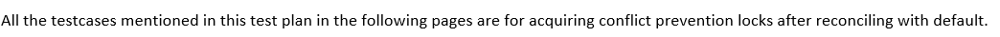
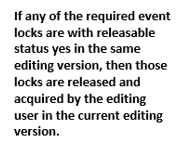
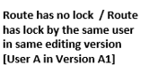
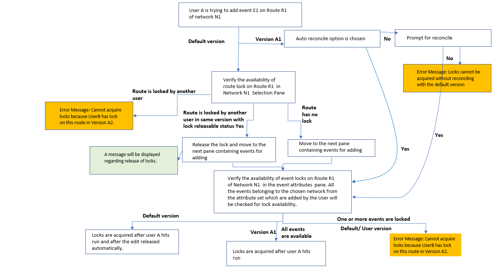
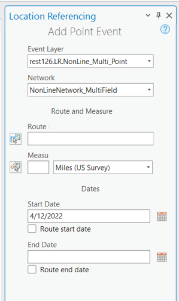
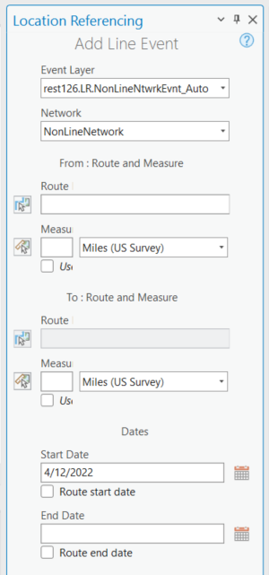

# Conflict Prevention for Event Editing in Pro – LR Event Tools

|   |   |
| --- | --- |
| **Kind** | Test Plan · Pro |
| **Release** | — |
| **Source** | [TestPlan_Conflict Prevention for Event Editing in Pro_SingleLineAndPoint.docx](<https://esriis.sharepoint.com/sites/LocationReferencing/Shared%20Documents/General/Test%20Plans/TestPlan_Conflict%20Prevention%20for%20Event%20Editing%20in%20Pro_SingleLineAndPoint.docx>) |
| **Edited** | 2022-04-13 00:39 by Johum Khushk |
| **Extracted** | 2026-09-04 · lane `xmlstrip` |

<!-- metadata
```yaml
title: "Conflict Prevention for Event Editing in Pro – LR Event Tools"
source_file: "TestPlan_Conflict Prevention for Event Editing in Pro_SingleLineAndPoint.docx"
source_url: "https://esriis.sharepoint.com/sites/LocationReferencing/Shared%20Documents/General/Test%20Plans/TestPlan_Conflict%20Prevention%20for%20Event%20Editing%20in%20Pro_SingleLineAndPoint.docx"
doc_id: 666
doc_kind: "Test Plan"
surface: "Pro"
doc_revision: ""
target_release: ""
pe: ""
dev: ""
author: "Rahul Rakshit"
last_edited_by: "Johum Khushk"
last_edited: "2022-04-13T00:39:00Z"
extracted: 2026-09-04
extraction_lane: xmlstrip
prompt_version: "v2.0.2"
keywords: ["conflict prevention", "event editing", "event lock", "point event", "line event", "branched version", "lock acquisition"]
tools: ["Add Point Event", "Add Line Event"]
products: []
issues: []
related: [{"doc":670,"file":"conflict-prevention-for-event-editing-in-pro-core-tools__doc670.md","s":10.194},{"doc":671,"file":"conflict-prevention-for-event-editing-in-pro-core-tools__doc671.md","s":9.772},{"doc":667,"file":"conflict-prevention-for-event-editing-in-pro-add-multiple-point-events-tool__doc667.md","s":7.57},{"doc":683,"file":"conflict-prevention-for-event-editing-in-pro__doc683.md","s":6.674},{"doc":668,"file":"test-plan-for-conflict-prevention-for-add-multiple-line-events-tool-in-arcgis__doc668.md","s":6.522}]
```
-->

## Summary

This document covers conflict prevention testing for event editing using Add Point Event and Add Line Event tools in ArcGIS Pro. It includes scenarios for locking events on branched version service data, handling spanning and non-spanning events, and verifying lock acquisition and error messages under various user and version conditions. The test plan ensures proper lock management and conflict resolution during event editing workflows.

## Related documents

<!-- related:begin -->
- [Conflict Prevention for Event Editing in Pro – Core Tools](<https://esriis.sharepoint.com/sites/lrsworkspace/LRS Doc Index/Test Plans/conflict-prevention-for-event-editing-in-pro-core-tools__doc670.md>) — similar text 0.80 · 6 title words · 5 filename words · same kind/surface/folder <!-- rel:670 -->
- [Conflict Prevention for Event Editing in Pro – Core Tools](<https://esriis.sharepoint.com/sites/lrsworkspace/LRS Doc Index/Test Plans/conflict-prevention-for-event-editing-in-pro-core-tools__doc671.md>) — similar text 0.83 · 6 title words · 5 filename words · same kind/surface/folder <!-- rel:671 -->
- [Conflict Prevention for Event Editing in Pro – Add Multiple Point Events Tool Test Plan](<https://esriis.sharepoint.com/sites/lrsworkspace/LRS Doc Index/Test Plans/conflict-prevention-for-event-editing-in-pro-add-multiple-point-events-tool__doc667.md>) — similar text 0.39 · 5 title words · 3 filename words · same kind/surface/folder <!-- rel:667 -->
- [Conflict Prevention for Event Editing in Pro](<https://esriis.sharepoint.com/sites/lrsworkspace/LRS Doc Index/User Stories/conflict-prevention-for-event-editing-in-pro__doc683.md>) — similar text 0.21 · 5 title words · 5 filename words · same surface <!-- rel:683 -->
- [Test Plan for Conflict Prevention for Add Multiple Line Events Tool in ArcGIS Pro](<https://esriis.sharepoint.com/sites/lrsworkspace/LRS Doc Index/Test Plans/test-plan-for-conflict-prevention-for-add-multiple-line-events-tool-in-arcgis__doc668.md>) — similar text 0.34 · 3 title words · 3 filename words · same kind/surface/folder <!-- rel:668 -->
<!-- related:end -->

<!-- docs:begin -->
## Esri documentation

[Conflict prevention](https://doc.esri.com/en/arcgis-pro/latest/help/production/location-referencing-pipelines/conflict-prevention.html) · [Event editing using the attribute table](https://doc.esri.com/en/arcgis-pro/latest/help/production/location-referencing-pipelines/event-editing-using-the-attribute-table.html)

_No page matched:_ [Add Point Event](https://www.google.com/search?q=%22Add%20Point%20Event%22+site%3Adoc.esri.com) · [Add Line Event](https://www.google.com/search?q=%22Add%20Line%20Event%22+site%3Adoc.esri.com)
<!-- docs:end -->

---

## 2: Conflict Prevention for Event Editing in Pro – LR Event Tools

Notes:

- Conflict prevention for event editing is applicable to following tools:
  - Add Point Event tool
  - Add Line Event tool
- Test on branched version service data with conflict prevention enabled
- Events spanning, Events not spanning, Point & Stationing Events registered to Line Network + Nonline Network
- Point and line attribute sets have at least three events for multiple add point and add line event tools
- N1: Line Network, N2: Non-Line Network
- User A has: VersionA1 & VersionA2   |   User B has: VersionB1
- In case of non-line network, only event belonging to a route will be locked. While, locking an event should lock the event layer for all the routes in a line (Line ID + Event FC name in the locks table will be inserted when spanning event gets locked)
- Check for route/ event lock in second pane once user types the route / line id or selects route / line on map.
- If the user changes the event layer in the drop down (and Route is selected / typed in pane), make sure locks are checked again in that case.

[figure: In second pane]

[figure: In second pane]

[figure: Check for route/ event lock · in · second pane · once user · types · the route / line id. · Check with both with route · name, · route · / line · ID · Check for route/ event lock · in · second pane · once user · selects route / line on map · . · Check with both with route name, route / line ID · Only i · f · route / event · lock can be acquired · on second pane, · then move to the · 3 · rd · pane · . · I · f route / event lock can · not · be acquired on second pane, then · display error on second pane and use · r · cannot move to third pane. · If the user changes the event layer in the drop down (and Route is selected / typed in pane), make sure locks are checked · again · in that case. · - If locks can be acquired, then lock will be added to locks table · , · user can · move to third pane and · add event. · - If locks cannot be acquired, then no lock will be added to locks · table, user cannot move to 3 · rd · pane · and · add event.]

Conflict Prevention for Event Editing using Add Single Point / Line Event Tools
- Verify in both default and user version (100% testing in user version, 10% in default)
- Some EE conflict prevention message screen shots are added for reference
- Test with all the LR event tools

| Event Type | Test Case | L1 |  |  | RX |  |  | E1 |  |  | E2 |  | E3 |  | Reconcile needed |  | Result |  | Message/s |  |
| --- | --- | --- | --- | --- | --- | --- | --- | --- | --- | --- | --- | --- | --- | --- | --- | --- | --- | --- | --- | --- |
| Point event, Spanning, non- spanning event | 1.No locks exist |  |  |  |  |  |  |  |  |  |  |  |  |  | No | Event l ock can be acquired |  | Message for acquiring locks at the upper right corner of pane . |  |  |
|  | 2 . No locks exist |  |  |  |  |  |  |  |  |  |  |  |  |  | Yes | Reconcile prompt or auto reconcile and lock acquired |  | Auto reconcile not selected: Reconcile this version with Default to acquire locks. |  |  |
| 2.1. Workflow Test s : - If the reconcile is required, verify the prompt: "A reconcile with default is required before acquiring a lock . Please reconcile and try again." - I f user is unable to reconcile, d isplay an error message in LR tool pane. - If the user selects different line/route on map, the lock of first route / line still exist s with release abl e status yes above logic should be reapplied . 2 . 2 . Switch RouteID / line after lock acquired – validate again if lock can be acquired. 2 . 3 . Switch event after lock acquired – validate again if lock can be acquired. 2. 4 Event lock already acquired on R1 and switch the event layer , same network 2. 5 Event lock already acquired on R1 and switch the event layer, different network |  |  |  |  |  |  |  |  |  |  |  |  |  |  |  |  |  |  |  |  |
| Point event, Spanning, non- spanning event | 3 . Line / Route already locked by the same user in the same version | Locked | UserA in VersionA1 |  |  |  |  |  |  |  |  |  |  |  | No | No additional lock needed |  | No Messages |  |  |
| Point event, non- spanning event , For spanning events that user is going to add: - From route locked - To route locked - Both from / to routes are locked | 4 . Line / route already locked by another user in another version | Locked | UserB in VersionB1 |  |  |  |  |  |  |  |  |  |  |  | No | Cannot acquire locks |  | Error message in middle of screen: Unable to add event. The Line /route L1 is already locked by UserB in VersionB1 > click ok > Edit Failed message on tool pane in upper right corner |  |  |
| Point event, Spanning, non- spanning event | 4 . 1 Line / route already locked by another user B in another version . Version not being used. User A transfers the lock and try to make an edit | Locked | UserB in VersionB1 |  |  |  |  |  |  |  |  |  |  |  | No | Locks can be acquired |  | Message for acquiring locks at the upper right corner of pane. |  |  |
|  | 4 . 2 Line / route already locked by another user B in same version . Version not being used. User A transfers the lock and try to make an edit |  |  |  |  |  |  |  |  |  |  |  |  |  |  |  |  |  |  |  |
|  | 4 . 3 Line / route already locked by another user B in same version . Version being used and edit has taken place . User A tries to transfer the lock – unable to transfer lock . |  |  |  |  |  |  |  |  |  |  |  |  |  |  |  |  |  |  |  |
| Point event, Spanning, non- spanning event | 5 . Concurrent route on another network is locked by the same user in the same version – verify this case with another user |  |  | Locked |  | UserA in VersionA1 |  |  |  |  |  |  |  |  | No | Lock can be acquired |  | Message for acquiring locks at the upper right corner of pane. |  |  |
| Point event, non- spanning event , For spanning events that user is going to add: - From route locked - To route locked - Both from / to routes are locked | 6 . Same user has a line / route lock in another version | Locked | UserA in VersionA2 |  |  |  |  |  |  |  |  |  |  |  | No | Cannot acquire locks |  | Error message in middle of screen: Unable to add event. The Line/route L1 is already locked by UserA in VersionA2 > click ok > Edit Failed message on tool pane in upper right corner |  |  |
| Point event, Spanning, non- spanning event | 7 . Another user has a lock (for that line / route ) on another event layer on the same route in another version | Locked | UserB in VersionB1 |  |  |  |  |  |  | Locked |  | UserB in VersionB1 |  |  | No | Lock /s can be acquired |  | Message for acquiring locks at the upper right corner of pane. |  |  |
|  | 7.1 Another user B has a lock (for that line / route ) on another event layer on the same route in another version . Version not being used. User A transfers the lock and try to make an edit | Locked | UserB in VersionB1 |  |  |  |  |  |  | Locked |  | UserB in VersionB1 |  |  | No | Lock /s can be acquired |  | Message for acquiring locks at the upper right corner of pane. |  |  |
|  | 8. Same user has a lock (for that line / route ) on another event layer on the same route in another version | Locked | UserA in VersionA2 |  |  |  |  |  |  | Locked |  | UserA in VersionA2 |  |  | No | Lock /s can be acquired |  | Message for acquiring locks at the upper right corner of pane. |  |  |
| Point event, non- spanning event , For spanning events that user is going to add: - From route locked - To route locked - Both from / to routes are locked | 9. Event layer already locked (for that line /route ) by the same user in another version | Locked | UserA in Version A2 |  |  |  | Locked |  | UserA in Version A2 |  |  |  |  |  | No | Cannot acquire locks |  | Error message in middle of screen: Cannot acquire locks because UserA has the lock in version UserA.VersionA1 > click ok > Edit Failed message on tool pane in upper right corner |  |  |
|  | 10. Event layer already locked (for that line / route ) by another user in another version | Locked | UserB in Version B1 |  |  |  | Locked |  | UserB in Version B1 |  |  |  |  |  | No | Cannot acquire locks |  | Error message in middle of screen: Cannot acquire locks because UserB has the lock in version UserB.VersionB1 Edit Failed message on tool pane in upper right corner |  |  |
|  | 1 1. User has lock on all the event layers for that line /route in another version | Locked | UserA in VersionA2 |  |  |  | Locked |  | UserA in VersionA2 | Locked |  | UserA in VersionA2 |  |  | Yes | Reconcile but cannot acquire locks |  | Auto reconcile not selected: Reconcile this version with Default to acquire locks. Error message in middle of screen: Cannot acquire locks because UserA has the lock in version UserA.VersionA2 > click ok > Edit Failed message on tool pane in upper right corner |  |  |
| Point event, non- spanning event , For spanning events that user is going to add: - From route locked - To route locked - Both from / to routes are locked | 1 2 . User has lock on some events, another user has lock on other events | Locked | UserB in VersionB1 |  |  |  | Locked |  | UserB in VersionB1 | Locked |  | UserA in VersionA1 |  |  | No | Cannot acquire locks |  | Error message in middle of screen: Cannot acquire locks because UserA has the lock in version UserA.VersionA1 +Text file enlisting all events that are locked by other user/s with the version/s info. Edit Failed message on tool pane in upper right corner |  |  |
|  | 1 3 . User has lock on some events, another user has lock on other events . Try to edit all the events. | Locked | UserA in VersionA2 |  |  |  | Locked |  | UserA in VersionA2 | Locked |  | UserB in VersionB1 |  |  | No | Cannot acquire locks |  | Error message in middle of screen: Cannot acquire locks because UserA has the lock in version UserA.VersionA1 +Text file enlisting all events that are locked by other user/s with the version/s info. Edit Failed message on tool pane in upper right corner |  |  |
|  | 14 . Same user has a route / line lock and a lock (for that line /route ) on another event layer in the same version | Locked | UserA in VersionA1 |  |  |  |  |  |  | Locked |  | UserA in VersionA1 |  |  | No | Lock can be acquired |  | Message for acquiring locks at the upper right corner of pane. |  |  |
| Point event, Spanning, non- spanning event | 1 5 . Concurrent route on another network and another event of that route are locked by the same user in the same version |  |  | Locked |  | UserA in VersionA1 |  |  |  |  |  |  | Locked | UserA in VersionA1 | No | Lock can be acquired |  | Message for acquiring locks at the upper right corner of pane. |  |  |
|  | 1 6 . Line /route and another event layer on that line / route are locked by the same user in the same version | Locked | UserA in VersionA1 |  |  |  | Locked |  | UserA in VersionA1 |  |  |  |  |  | No | Lock can be acquired |  | Message for acquiring locks at the upper right corner of pane. |  |  |

- Lock acquired; lock removed (using locks table in db) before clicking Run – should re acquire a lock
- No lock present and unable to auto reconcile - No locks will be acquired
- Acquire the lock using the REST service and then use the add line / point event tool to add an event
- Verify lock can be acquired with protected version
- Verify lock can be acquired with private version
- Locks are taken in private versions and no edit has taken place. These locks cannot be transferred to another user and should not be able to acquire locks.
- Locks are taken in protected versions and no edit has taken place. These locks cannot be transferred to another user and should not be able to acquire locks.
- Try to acquire a lock without being logged in - should not be able to acquire a lock
- Try to acquire an event lock as a data viewer – should  not be able to acquire a lock
- Try to acquire a lock as portal user who does not have access to the service - should not be able to acquire a lock
- Add cases where locks are taken in private or protected versions and no edit has taken place. These locks cannot be transferred to another user. 2 cases
- Where locks are acquired make sure lock is displayed in locks table and identify
- Verify release locks only when using default version - should release automatically
- If the user changes the event layer in the drop down (and Route is selected / typed in pane),, make sure locks are checked again in that case.
- If locks can be acquired, then lock will be added to locks table and user can add event.
- If locks cannot be acquired, then no lock will be added to locks table and user can not add event.

      
