# Consider Route Dominance in Append Events Test Plan

|   |   |
| --- | --- |
| **Kind** | Test Plan · Other |
| **Release** | — |
| **Product** | Roads & Highways · Pipeline Referencing |
| **Issue** | [ArcGISPro/ps-location-referencing#3537](https://devtopia.esri.com/ArcGISPro/ps-location-referencing/issues/3537) |
| **Source** | [AppendEventsDominant_OtherMethods_testplan.pptx](<https://esriis.sharepoint.com/sites/LocationReferencing/Shared%20Documents/General/Test%20Plans/AppendEventsDominant_OtherMethods_testplan.pptx>) |
| **Edited** | 2024-11-25 21:38 by Lakshmi Ananthanarayanan |
| **Extracted** | 2026-09-04 · lane `xmlstrip` |

<!-- metadata
```yaml
title: "Consider Route Dominance in Append Events Test Plan"
source_file: "AppendEventsDominant_OtherMethods_testplan.pptx"
source_url: "https://esriis.sharepoint.com/sites/LocationReferencing/Shared%20Documents/General/Test%20Plans/AppendEventsDominant_OtherMethods_testplan.pptx"
doc_id: 278
doc_kind: "Test Plan"
surface: "Other"
doc_revision: ""
target_release: ""
pe: "Lakshmi"
dev: ""
author: "Lakshmi Ananthanarayanan"
last_edited_by: "Lakshmi Ananthanarayanan"
last_edited: "2024-11-25T21:38:13Z"
extracted: 2026-09-04
extraction_lane: xmlstrip
prompt_version: "v2.0.2"
keywords: ["route dominance", "append events", "retire overlaps", "retire by eventid", "replace by eventid", "concurrency", "conflict prevention", "spanning event", "gapped route", "looped route", "branched route", "alpha route"]
tools: ["Append Events"]
products: ["Roads & Highways", "Pipeline Referencing"]
issues: ["ArcGISPro/ps-location-referencing#3537"]
related: [{"doc":279,"file":"consider-route-dominance-in-append-events-add-method-test-plan__doc279.md","s":8.219},{"doc":360,"file":"add-point-event-to-dominant-route-in-arcgis-pro-test-plan__doc360.md","s":5.403},{"doc":156,"file":"allow-append-events-to-run-when-locks-are-present-test-plan__doc156.md","s":5.306},{"doc":358,"file":"add-line-event-to-dominant-route-in-arcgis-pro-test-plan__doc358.md","s":4.185},{"doc":169,"file":"add-point-and-non-spanning-line-event-to-dominant-route-in-experience-builder__doc169.md","s":4.159}]
```
-->

## Summary

Test plan for verifying the Append Events tool behavior with route dominance logic using Retire Overlaps, Retire by EventID, and Replace by EventID methods. Covers testing with various route types, concurrency scenarios, conflict prevention, and different data sources including RH and APR data in fgdb, sde, and feature services. Includes detailed test scenarios for point, line, spanning, gapped, looped, branched, and alpha routes with expected event appending and measure conversion outcomes.

## Related documents

<!-- related:begin -->
- [Consider Route Dominance in Append Events (add method) – Test Plan](<https://esriis.sharepoint.com/sites/lrsworkspace/LRS Doc Index/Test Plans/consider-route-dominance-in-append-events-add-method-test-plan__doc279.md>) — similar text 0.54 · 5 title words · 4 filename words · same kind/folder <!-- rel:279 -->
- [Add Point Event to Dominant Route in ArcGIS Pro – Test Plan](<https://esriis.sharepoint.com/sites/lrsworkspace/LRS Doc Index/Test Plans/add-point-event-to-dominant-route-in-arcgis-pro-test-plan__doc360.md>) — similar text 0.24 · 1 title word · 2 filename words · same kind/folder <!-- rel:360 -->
- [Allow Append Events to Run When Locks Are Present - Test Plan](<https://esriis.sharepoint.com/sites/lrsworkspace/LRS%20Doc%20Index/Test%20Plans/allow-append-events-to-run-when-locks-are-present-test-plan__doc156.md>) — similar text 0.24 · 2 title words · 3 filename words · same kind/pe/folder <!-- rel:156 -->
- [Add Line Event to Dominant Route in ArcGIS Pro – Test Plan](<https://esriis.sharepoint.com/sites/lrsworkspace/LRS Doc Index/Test Plans/add-line-event-to-dominant-route-in-arcgis-pro-test-plan__doc358.md>) — similar text 0.12 · 1 title word · 2 filename words · same kind/folder <!-- rel:358 -->
- [Add Point and non-Spanning Line Event to Dominant Route in Experience Builder – Test Plan](<https://esriis.sharepoint.com/sites/lrsworkspace/LRS Doc Index/Test Plans/add-point-and-non-spanning-line-event-to-dominant-route-in-experience-builder__doc169.md>) — similar text 0.17 · 1 title word · 2 filename words · same kind/folder <!-- rel:169 -->
<!-- related:end -->

<!-- docs:begin -->
## Esri documentation

[Event behavior for route retirement](https://doc.esri.com/en/arcgis-pro/latest/help/production/roads-highways/event-behavior-for-route-retirement.html) · [Conflict prevention](https://doc.esri.com/en/arcgis-pro/latest/help/production/roads-highways/conflict-prevention.html)

_No page matched:_ [Append Events](https://www.google.com/search?q=%22Append%20Events%22+site%3Adoc.esri.com)
<!-- docs:end -->

---

## Slide 1 — Consider Route Dominance in Append Events (Retire Overlaps, Retire by EventID, Replace by EventID methods) – Test Plan

https://devtopia.esri.com/ArcGISPro/ps-location-referencing/issues/3537

PE: Lakshmi
Dev:

## Slide 2

Test Data

- Test with RH and APR data
- Test in fgdb, sde and FS
- Test with point, spanning and non-spanning line events
- Test simple routes, gapped routes, and routes with complex shapes
- Test with spatial and temporal concurrencies
- Test Retire overlaps , Retire by EventID and Replace by EventID Methods
- Test conflict prevention
- Test with input feature class and feature table
- Test in python and model builder
Verification

- Verify the tool identifies the correct dominant route and the result events are appended to the correct Route/Measure for each of the different methods of append chosen.
- Verify new messages related to dominant route appear in the text output.

Automation

- Add to Append Events APR Python automation
Documentation

- Update the documentation for the gp tool.  Add usage notes about what this parameter does and how it can result in splitting of source events.
- Add graphics and explanation to https://prodev.arcgis.com/en/pro-app/latest/help/production/roads-highways/create-and-modify-lrs-events.htm.

## Slide 3

Test Scenarios
If the option  is “Append events to the dominant route “enabled when the tool is run, all records being appended should be checked against the concurrency logic (spatial and temporal) to identify the dominant route. Verify for all methods except add.

- Default is unchecked. When checked –
  - If there is no concurrent section, append the event with input Route/Measure  as per the chosen method.
  - If an event record is completely on a concurrent section and the source Route/Measures are on the dominant route, append the event with input Route/Measure as per the chosen method
  - If an event record is completely on a concurrent section and the source Route/Measures are on the subordinate route, translate the route/measure to the dominant route and append it onto the dominant route as per the chosen method.
    - Provide info text output “The source event record with OID # was appended onto the dominant route (list of RouteID(s)).”
  - If the event record is on multiple or a mix of concurrent/non concurrent sections, determine which route to append as per the chosen method  for each section
    - Provide info text output “The source event record with OID # was split into # of sections appended onto the following dominant routes (list of RouteID(s)).”

## Case 2 <!-- slide 4 -->

### If the Event Is Added To the Dominant Route That Has Complex

Test Scenarios cntd..

  - For any concurrent sections with Dominant route being not calibrated, append event onto the Route/Measure which ever is properly calibrated.
    - Provide info  in text output “The concurrent section couldn’t be calculated, so the event was placed on the input Route “RouteID”.”
    - f)   If both input and concurrent routes are not calibrated. Add the event to input route and after running Generate Events, show corresponding loc error

**If the event is added to the dominant route that has complex shape and self intersections**

  - Point event – add to any measure at the self intersection
  - Line event – must preserve the shape as if it is drawn on input route, and then determine the measures on target route based on the shape
  - Make sure event always go with target route direction even it can be different from input route’s direction

## Case 3 <!-- slide 5 -->

### A. With Conflict Prevention

Test Scenarios cntd..
**a. With conflict prevention, lock all target routes that the event is eventually appended to. If the provided input route does not get any event, don’t lock it. (Locks are acquired only for the required routes)**
      b.  When there’s existing lock: (test for all methods except add )

  - Input route is the target route, and it is locked – do not append anything, fail the tool and let users know target route is locked
  - Input route is not target route. Input route is locked, and target route is not locked – append successfully
  - Event is going to split to append on different routes, some or all the target routes are locked --- do not append anything and fail the tool. Let users know which target routes(dominant) are locked.
  - Dominant route is the target route and is locked by the same user in the same version – append the events and do not acquire any new lock.

## Slide 6 — 1a .: Simple input route has no concurrency. Add the event on this route. – Retire by EventID (Not required, verify

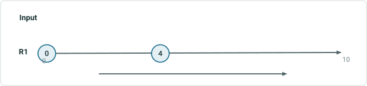

| EventID | RID | M | ToM | FromDate | ToDate | Attribute |
| --- | --- | --- | --- | --- | --- | --- |
| Point1 | R1 | 0 |  | 1/1/2000 | 1/1/2020 | Stop Sign |
| Point2 | R1 | 4 |  | 1/1/2000 | null | Stop Sign |
| Line1 | R1 | 2 | 8 | 1/1/2000 | null | Interstate |

Route and events from LRS
Source event records to append

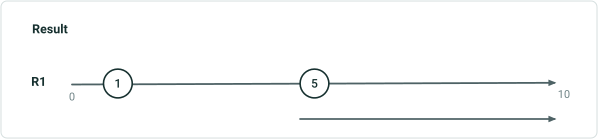

| EventID | RID | M | ToM | FromDate | ToDate | Attribute |
| --- | --- | --- | --- | --- | --- | --- |
| Point1 | R1 | 1 |  | 1/1/2010 | null | Signal |
| Point2 | R1 | 5 |  | 1/1/2020 | null | signal |
| Line1 | R1 | 5 | 10 | 1/1/2020 | null | Local |

| EventID | RID | M | ToM | FromDate | ToDate | Attribute |
| --- | --- | --- | --- | --- | --- | --- |
| Point1 | R1 | 0 |  | 1/1/2000 | 1/1/2010 | Stop Sign |
| Point1 | R1 | 1 |  | 1/1/2010 | 1/1/2020 | Signal |
| Point1 | R1 | 1 |  | 1/1/2020 | null | Signal |
| Point2 | R1 | 4 |  | 1/1/2000 | 1/1/2020 | Stop Sign |
| Point2 | R1 | 5 |  | 1/1/2020 | null | Signal |
| Line1 | R1 | 2 | 8 | 1/1/2000 | 1/1/2020 | Interstate |
| Line1 | R1 | 5 | 10 | 1/1/2020 | null | Local |

For the event point 1, the highlighted results both are correct. What ever is current Pro behavior follow that.

| EventID | RID | M | ToM | FromDate | ToDate | Attribute |
| --- | --- | --- | --- | --- | --- | --- |
| Point1 | R1 | 0 |  | 1/1/2000 | 1/1/2010 | Stop Sign |
| Point1 | R1 | 1 |  | 1/1/2010 | null | Signal |

## Slide 7 — 1b : Simple input route has no concurrency. Add the event on this route. – Replace by EventID (Not required)


| EventID | RID | M | ToM | FromDate | ToDate | Attribute |
| --- | --- | --- | --- | --- | --- | --- |
| Point1 | R1 | 0 |  | 1/1/2000 | 1/1/2020 | Stop Sign |
| Point2 | R1 | 4 |  | 1/1/2000 | null | Stop Sign |
| Line1 | R1 | 2 | 8 | 1/1/2000 | null | Interstate |

Route and events from LRS
Source event records to append


| EventID | RID | M | ToM | FromDate | ToDate | Attribute |
| --- | --- | --- | --- | --- | --- | --- |
| Point1 | R1 | 1 |  | 1/1/2010 | null | signal |
| Point2 | R1 | 5 |  | 1/1/2020 | null | signal |
| Line1 | R1 | 5 | 10 | 1/1/2020 | null | Local |

| EventID | RID | M | ToM | FromDate | ToDate | Attribute |
| --- | --- | --- | --- | --- | --- | --- |
| Point1 | R1 | 1 |  | 1/1/2010 | null | Signal |
| Point2 | R1 | 5 |  | 1/1/2020 | null | Signal |
| Line1 | R1 | 5 | 10 | 1/1/2020 | null | Local |

## Slide 8 — 1c : Simple input route has no concurrency. Add the event on this route. – Retire overlaps 2 (Not required) 010 nu

| EventID | RID | M | ToM | FromDate | ToDate | Attribute |
| --- | --- | --- | --- | --- | --- | --- |
| Line1 | R1 | 2 | 8 | 1/1/2000 | null | Interstate |

Route and events from LRS
Source event records to append

| EventID | RID | M | ToM | FromDate | ToDate | Attribute |
| --- | --- | --- | --- | --- | --- | --- |
| Line1 | R1 | 5 | 10 | 1/1/2020 | null | Local |

| EventID | RID | M | ToM | FromDate | ToDate | Attribute |
| --- | --- | --- | --- | --- | --- | --- |
| Line1 | R1 | 2 | 8 | 1/1/2000 | 1/1/2020 | Interstate |
| Line1 | R1 | 2 | 5 | 1/1/2020 | null | Interstate |
| Line1 | R1 | 5 | 10 | 1/1/2020 | null | Local |

[figure: Input · Result · R1 · 0 · 10]

## Slide 9 — 2a .: Simple input route is the dominant route over the only one time slice. Add the event on this route.. – Retire by

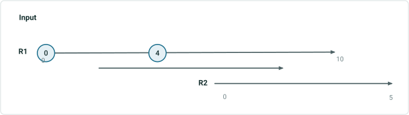

| EventID | RID | M | ToM | FromDate | ToDate | Attribute |
| --- | --- | --- | --- | --- | --- | --- |
| Point1 | R1 | 0 |  | 1/1/2000 | 1/1/2020 | Stop Sign |
| Point2 | R1 | 4 |  | 1/1/2000 | null | Stop Sign |
| Line1 | R1 | 2 | 8 | 1/1/2000 | null | Interstate |

Route and events from LRS
Source event records to append

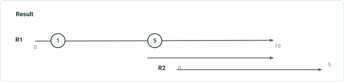

| EventID | RID | M | ToM | FromDate | ToDate | Attribute |
| --- | --- | --- | --- | --- | --- | --- |
| Point1 | R1 | 1 |  | 1/1/2010 | null | Signal |
| Point2 | R1 | 5 |  | 1/1/2020 | null | signal |
| Line1 | R1 | 5 | 10 | 1/1/2020 | null | Local |

| EventID | RID | M | ToM | FromDate | ToDate | Attribute |
| --- | --- | --- | --- | --- | --- | --- |
| Point1 | R1 | 0 |  | 1/1/2000 | 1/1/2010 | Stop Sign |
| Point1 | R1 | 1 |  | 1/1/2010 | 1/1/2020 | Signal |
| Point1 | R1 | 1 |  | 1/1/2020 | null | Signal |
| Point2 | R1 | 4 |  | 1/1/2000 | 1/1/2020 | Stop Sign |
| Point2 | R1 | 5 |  | 1/1/2020 | null | Signal |
| Line1 | R1 | 2 | 8 | 1/1/2000 | 1/1/2020 | Interstate |
| Line1 | R1 | 5 | 10 | 1/1/2020 | null | Local |

| EventID | RID | M | ToM | FromDate | ToDate | Attribute |
| --- | --- | --- | --- | --- | --- | --- |
| Point1 | R1 | 0 |  | 1/1/2000 | 1/1/2010 | Stop Sign |
| Point1 | R1 | 1 |  | 1/1/2010 | null | Signal |

For the event point 1, the highlighted results both are correct. What ever is current Pro behavior follow that.

## Slide 10 — 2b : Simple input route is the dominant route over the only one time slice. Add the event on this route.. – Replace by

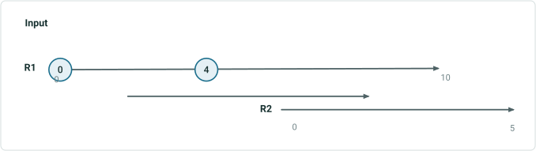

| EventID | RID | M | ToM | FromDate | ToDate | Attribute |
| --- | --- | --- | --- | --- | --- | --- |
| Point1 | R1 | 0 |  | 1/1/2000 | 1/1/2020 | Stop Sign |
| Point2 | R1 | 4 |  | 1/1/2000 | null | Stop Sign |
| Line1 | R1 | 2 | 8 | 1/1/2000 | null | Interstate |

Route and events from LRS
Source event records to append

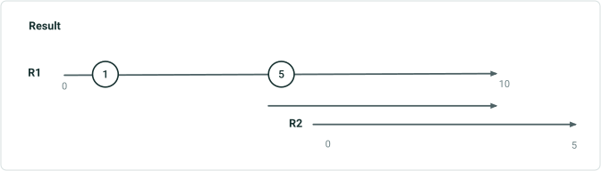

| EventID | RID | M | ToM | FromDate | ToDate | Attribute |
| --- | --- | --- | --- | --- | --- | --- |
| Point1 | R1 | 1 |  | 1/1/2010 | null | signal |
| Point2 | R1 | 5 |  | 1/1/2020 | null | signal |
| Line1 | R1 | 5 | 10 | 1/1/2020 | null | Local |

| EventID | RID | M | ToM | FromDate | ToDate | Attribute |
| --- | --- | --- | --- | --- | --- | --- |
| Point1 | R1 | 1 |  | 1/1/2010 | null | Signal |
| Point2 | R1 | 5 |  | 1/1/2020 | null | Signal |
| Line1 | R1 | 5 | 10 | 1/1/2020 | null | Local |

## Slide 11 — 2c : Simple input route is the dominant route over the only one time slice. Add the event on this route.. – Retire

| EventID | RID | M | ToM | FromDate | ToDate | Attribute |
| --- | --- | --- | --- | --- | --- | --- |
| Line1 | R1 | 2 | 8 | 1/1/2000 | null | Interstate |

Route and events from LRS
Source event records to append

| EventID | RID | M | ToM | FromDate | ToDate | Attribute |
| --- | --- | --- | --- | --- | --- | --- |
| Line1 | R1 | 5 | 10 | 1/1/2020 | null | Local |

| EventID | RID | M | ToM | FromDate | ToDate | Attribute |
| --- | --- | --- | --- | --- | --- | --- |
| Line1 | R1 | 2 | 8 | 1/1/2000 | 1/1/2020 | Interstate |
| Line1 | R1 | 2 | 5 | 1/1/2020 | null | Interstate |
| Line1 | R1 | 5 | 10 | 1/1/2020 | null | Local |

[figure: Input · Result · R1 · 0 · 10 · 5 · R2]

## Slide 12 — 3a : Simple input route is neither the most dominant nor the most subordinate. Add the event on dominant routes and

Route and events from LRS

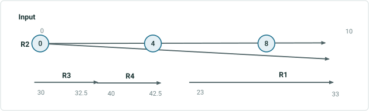

| EventID | RID | M | ToM | FromDate | ToDate | Attribute |
| --- | --- | --- | --- | --- | --- | --- |
| Point1 | R2 | 0 |  | 1/1/2000 | 1/1/2020 | Stop Sign |
| Point2 | R2 | 4 |  | 1/1/2000 | null | Stop Sign |
| Point3 | R2 | 8 |  | 1/1/2000 | null | Stop sign |
| Line1 | R2 | 0 | 10 | 1/1/2000 | null | Interstate |

Source event records to append

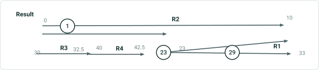

| EventID | RID | M | ToM | FromDate | ToDate | Attribute |
| --- | --- | --- | --- | --- | --- | --- |
| Point1 | R2 | 1 |  | 1/1/2010 | null | signal |
| Point2 | R2 | 5 |  | 1/1/2020 | null | signal |
| Point3 | R2 | 8 |  | 1/1/2020 | null | signal |
| Line1 | R2 | 0 | 10 | 1/1/2020 | Null | Local |

| EventID | RID | M | ToM | FromDate | ToDate | Attribute |
| --- | --- | --- | --- | --- | --- | --- |
| Point1 | R2 | 0 |  | 1/1/2000 | 1/1/2010 | Stop Sign |
| Point1 | R2 | 1 |  | 1/1/2010 | 1/1/2020 | signal |
| Point1 | R2 | 1 |  | 1/1/2020 | null | signal |
| Point2 | R2 | 4 |  | 1/1/2000 | 1/1/2020 | Stop Sign |
| Point2 | R1 | 23 |  | 1/1/2020 | null | signal |
| Point3 | R2 | 8 |  | 1/1/2000 | 1/1/2020 | Stop sign |
| Point3 | R1 | 29 |  | 1/1/2020 | null | signal |
| Line1 | R2 | 0 | 10 | 1/1/2000 | 1/1/2020 | Interstate |
| Line1 | R2 | 0 | 5 | 1/1/2020 | null | Local |
| Line1 | R1 | 23 | 33 | 1/1/2020 | null | Local |

## Slide 13 — 3b : Simple input route is neither the most dominant nor the most subordinate. Add the event on dominant routes and

Route and events from LRS


| EventID | RID | M | ToM | FromDate | ToDate | Attribute |
| --- | --- | --- | --- | --- | --- | --- |
| Point1 | R2 | 0 |  | 1/1/2000 | 1/1/2020 | Stop Sign |
| Point2 | R2 | 4 |  | 1/1/2000 | null | Stop Sign |
| Point3 | R2 | 8 |  | 1/1/2000 | null | Stop sign |
| Line1 | R2 | 0 | 10 | 1/1/2000 | null | Interstate |

Source event records to append

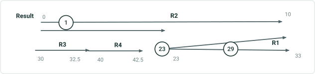

| EventID | RID | M | ToM | FromDate | ToDate | Attribute |
| --- | --- | --- | --- | --- | --- | --- |
| Point1 | R2 | 1 |  | 1/1/2010 | null | signal |
| Point2 | R2 | 5 |  | 1/1/2020 | null | signal |
| Point3 | R2 | 8 |  | 1/1/2020 | null | signal |
| Line1 | R2 | 0 | 10 | 1/1/2020 | Null | Local |

| EventID | RID | M | ToM | FromDate | ToDate | Attribute |
| --- | --- | --- | --- | --- | --- | --- |
| Point1 | R2 | 1 |  | 1/1/2010 | null | signal |
| Point2 | R1 | 23 |  | 1/1/2020 | null | signal |
| Point3 | R1 | 29 |  | 1/1/2020 | null | signal |
| Line1 | R2 | 0 | 5 | 1/1/2020 | null | Local |
| Line1 | R1 | 23 | 33 | 1/1/2020 | null | Local |

## Slide 14 — 3c : Simple input route is neither the most dominant nor the most subordinate. Add the event on dominant routes and

Route and events from LRS

| EventID | RID | M | ToM | FromDate | ToDate | Attribute |
| --- | --- | --- | --- | --- | --- | --- |
| Line1 | R2 | 0 | 10 | 1/1/2000 | null | Interstate |

Source event records to append

| EventID | RID | M | ToM | FromDate | ToDate | Attribute |
| --- | --- | --- | --- | --- | --- | --- |
| Line1 | R2 | 0 | 10 | 1/1/2020 | Null | Local |

| EventID | RID | M | ToM | FromDate | ToDate | Attribute |
| --- | --- | --- | --- | --- | --- | --- |
| Line1 | R2 | 0 | 10 | 1/1/2000 | 1/1/2020 | Interstate |
| Line1 | R2 | 0 | 5 | 1/1/2020 | null | Local |
| Line1 | R1 | 23 | 33 | 1/1/2020 | null | Local |

[figure: Input · Result · R2 · 0 · 10 · R3 · 30 · 32.5 · R4 · R1 · 40 · 42.5 · 23 · 33]

## Slide 15

4a: Gapped input route is the subordinate route over all time slices. Add the event on dominant route and convert measures Retire by EventID
Route and events from LRS

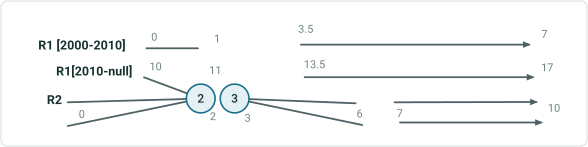

| EventID | RID | M | ToM | FromDate | ToDate | Attribute |
| --- | --- | --- | --- | --- | --- | --- |
| Point1 | R2 | 2 |  | 1/1/2000 | null | Stop Sign |
| Point2 | R2 | 3 |  | 1/1/2000 | null | Stop Sign |
| Line1 | R2 | 0 | 2 | 1/1/2000 | null | Interstate |
| Line1 | R2 | 3 | 6 | 1/1/2000 | null | Interstate |
| Line1 | R2 | 7 | 10 | 1/1/2000 | null | Interstate |

Source event records to append

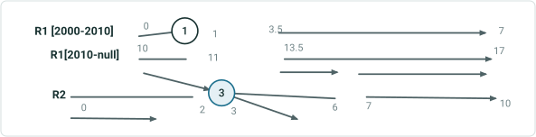

| EventID | RID | M | ToM | FromDate | ToDate | Attribute |
| --- | --- | --- | --- | --- | --- | --- |
| Point1 | R2 | 2 |  | 1/1/2005 | 1/1/2010 | signal |
| Point2 | R2 | 3 |  | 1/1/2020 | null | signal |
| Line1 | R2 | 0 | 10 | 1/1/2020 | Null | Local |

| EventID | RID | M | ToM | FromDate | ToDate | Attribute |
| --- | --- | --- | --- | --- | --- | --- |
| Point1 | R2 | 2 |  | 1/1/2000 | 1/1/2005 | Stop Sign |
| Point1 | R1 | 1 |  | 1/1/2005 | 1/1/2010 | signal |
| Point2 | R2 | 3 |  | 1/1/2000 | 1/1/2020 | Stop Sign |
| Point2 | R2 | 3 |  | 1/1/2020 | null | signal |
| Line1 | R2 | 0 | 10 | 1/1/2000 | 1/1/2020 | Interstate |
| Line1 | R2 | 0 | 1 | 1/1/2020 | null | Local |
| Line1 | R2 | 3 | 4.5 | 1/1/2020 | null | Local |
| Line1 | R1 | 10 | 11 | 1/1/2020 | null | Local |
| Line1 | R1 | 13.5 | 14.5 | 1/1/2020 | null | Local |
| Line1 | R1 | 15 | 17 | 1/1/2020 | null | Local |

## Slide 16

4b: Gapped input route is the subordinate route over all time slices. Add the event on dominant route and convert measures Replace by EventID
Route and events from LRS

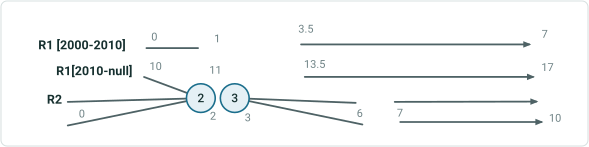

| EventID | RID | M | ToM | FromDate | ToDate | Attribute |
| --- | --- | --- | --- | --- | --- | --- |
| Point1 | R2 | 2 |  | 1/1/2000 | null | Stop Sign |
| Point2 | R2 | 3 |  | 1/1/2000 | null | Stop Sign |
| Line1 | R2 | 0 | 10 | 1/1/2000 | null | Interstate |

Source event records to append

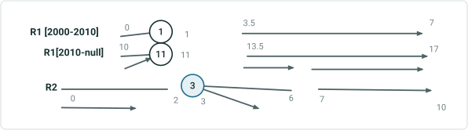

| EventID | RID | M | ToM | FromDate | ToDate | Attribute |
| --- | --- | --- | --- | --- | --- | --- |
| Point1 | R2 | 2 |  | 1/1/2005 | null | signal |
| Point2 | R2 | 3 |  | 1/1/2020 | null | signal |
| Line1 | R2 | 0 | 10 | 1/1/2020 | Null | Local |

| EventID | RID | M | ToM | FromDate | ToDate | Attribute |
| --- | --- | --- | --- | --- | --- | --- |
| Point1 | R1 | 1 |  | 1/1/2005 | 1/1/2010 | signal |
| Point1 | R1 | 11 |  | 1/1/2010 | null | signal |
| Point2 | R2 | 3 |  | 1/1/2020 | null | signal |
| Line1 | R2 | 0 | 1 | 1/1/2020 | null | Local |
| Line1 | R2 | 3 | 4.5 | 1/1/2020 | null | Local |
| Line1 | R1 | 10 | 11 | 1/1/2020 | null | Local |
| Line1 | R1 | 13.5 | 14.5 | 1/1/2020 | null | Local |
| Line1 | R1 | 15 | 17 | 1/1/2020 | null | Local |

## Slide 17

4c: Gapped input route is the subordinate route over all time slices. Add the event on dominant route and convert measures - Retire overlaps
Route and events from LRS

| EventID | RID | M | ToM | FromDate | ToDate | Attribute |
| --- | --- | --- | --- | --- | --- | --- |
| Line1 | R2 | 0 | 2 | 1/1/2000 | null | Interstate |
| Line1 | R2 | 3 | 6 | 1/1/2000 | null | Interstate |
| Line1 | R2 | 7 | 10 | 1/1/2000 | null | Interstate |

Source event records to append

| EventID | RID | M | ToM | FromDate | ToDate | Attribute |
| --- | --- | --- | --- | --- | --- | --- |
| Line1 | R2 | 0 | 10 | 1/1/2020 | Null | Local |

| EventID | RID | M | ToM | FromDate | ToDate | Attribute |
| --- | --- | --- | --- | --- | --- | --- |
| Line1 | R2 | 0 | 2 | 1/1/2000 | 1/1/2020 | Interstate |
| Line1 | R2 | 3 | 6 | 1/1/2000 | 1/1/2020 | Interstate |
| Line1 | R2 | 0 | 1 | 1/1/2020 | null | Local |
| Line1 | R2 | 3 | 4.5 | 1/1/2020 | null | Local |
| Line1 | R1 | 10 | 11 | 1/1/2020 | null | Local |
| Line1 | R1 | 13.5 | 14.5 | 1/1/2020 | null | Local |
| Line1 | R1 | 15 | 17 | 1/1/2020 | null | Local |

[figure: R1 [2000-2010] · R2 · Result · 0 · 1 · 3.5 · 7 · 2 · 10 · 6 · 3 · R1[2010-null] · 11 · 13.5 · 17 · Input]

## Slide 18

5: Looped input route has different concurrencies over time. Add the event to dominant route in each time slice and convert measures.
Route and events from LRS

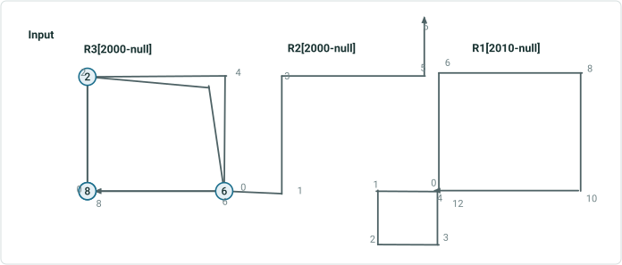

| EventID | RID | M | ToM | FromDate | ToDate | Attribute |
| --- | --- | --- | --- | --- | --- | --- |
| P1 | R3 | 0 |  | 1/1/2000 | 1/1/2020 | Stop Sign |
| P2 | R3 | 8 |  | 1/1/2000 | null | Stop Sign |
| P3 | R3 | 2 |  | 1/1/2000 | null | Stop Sign |
| P4 | R3 | 6 |  | 1/1/2000 | null | Stop Sign |
| L1 | R3 | 0 | 8 | 1/1/2000 | null | Interstate |

Source event records to append

| EventID | RID | M | ToM | FromDate | ToDate | Attribute |
| --- | --- | --- | --- | --- | --- | --- |
| P1 | R3 | 0 |  | 1/1/2010 | null | Signal |
| P2 | R3 | 8 |  | 1/1/2020 | null | Signal |
| P3 | R3 | 3 |  | 1/1/2020 | null | Signal |
| P4 | R3 | 6 |  | 1/1/2020 | null | Signal |
| L1 | R3 | 0 | 8 | 1/1/2000 | null | Local |

## Slide 19

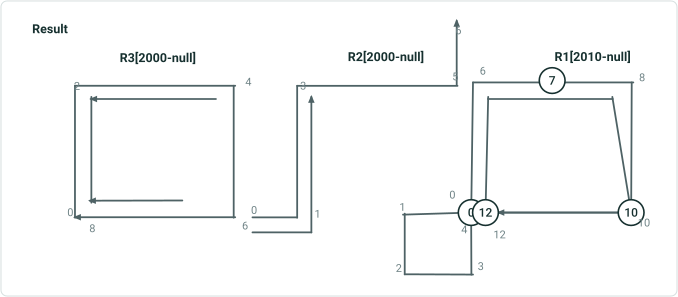

| EventID | RID | M | ToM | FromDate | ToDate | Attribute |
| --- | --- | --- | --- | --- | --- | --- |
| P1 | R3 | 0 |  | 1/1/2000 | 1/1/2010 | Stop Sign |
| P1* | R1 | 0 |  | 1/1/2010 | 1/1/2020 | Signal |
| P1* | R1 | 0 |  | 1/1/2020 | null | Signal |
| P2 | R3 | 8 |  | 1/1/2000 | 1/1/2020 | Stop Sign |
| P2* | R1 | 12 |  | 1/1/2020 | null | Signal |
| P3 | R3 | 2 |  | 1/1/2000 | 1/1/2020 | Stop Sign |
| P3 | R1 | 7 |  | 1/1/2020 | null | Signal |
| P4 | R3 | 6 |  | 1/1/2000 | 1/1/2020 | Stop Sign |
| P4 | R1 | 10 |  | 1/1/2020 | null | Signal |
| L1 | R3 | 0 | 4 | 1/1/2000 | 1/1/2010 | Local |
| L1 | R3 | 6.5 | 8 | 1/1/2000 | 1/1/2010 | Local |
| L1 | R2 | 0 | 3 | 1/1/2000 | 1/1/2010 | Local |
| L1 | R1 | 4 | 12 | 1/1/2010 | null | Local |

- - measure can be anyone of the values (0,4,12)
5a. Retire by EventID

## Slide 20


| EventID | RID | M | ToM | FromDate | ToDate | Attribute |
| --- | --- | --- | --- | --- | --- | --- |
| P1* | R1 | 0 |  | 1/1/2010 | null | Signal |
| P2* | R1 | 12 |  | 1/1/2020 | null | Signal |
| P3 | R1 | 7 |  | 1/1/2020 | null | Signal |
| P4 | R1 | 10 |  | 1/1/2020 | null | Signal |
| L1 | R1 | 4 | 12 | 1/1/2010 | null | Local |
| L1 | R3 | 0 | 4 | 1/1/2000 | 1/1/2010 | Local |
| L1 | R3 | 6.5 | 8 | 1/1/2000 | 1/1/2010 | Local |
| L1 | R2 | 0 | 3 | 1/1/2000 | 1/1/2010 | Local |

- - measure can be anyone of the values (0,4,12)
5b. Replace by EventID

## Slide 21

5c: Looped input route has different concurrencies over time. Add the event to dominant route(orange color ) in each time slice and convert measures. – Retire overlaps
Route and events from LRS

| EventID | RID | M | ToM | FromDate | ToDate | Attribute |
| --- | --- | --- | --- | --- | --- | --- |
| L1 | R3 | 0 | 8 | 1/1/2000 | null | Interstate |

Source event records to append

| EventID | RID | M | ToM | FromDate | ToDate | Attribute |
| --- | --- | --- | --- | --- | --- | --- |
| L1 | R3 | 0 | 8 | 1/1/2020 | null | Local |

| EventID | RID | M | ToM | FromDate | ToDate | Attribute |
| --- | --- | --- | --- | --- | --- | --- |
| L1 | R3 | 0 | 8 | 1/1/2000 | 1/1/2020 | Interstate |
| L1 | R1 | 4 | 12 | 1/1/2020 | null | Local |

- - measure can be anyone of the values (0,4,12)

[figure: R3[2000-null] · R1[2010-null] · R2[2000-null] · Input · 0 · 8 · 2 · 4 · 6 · 1 · 3 · 5 · 10 · 12]

## Slide 22

6: Branched input route has different concurrencies over time. The target dominant routes in opposite direction. Add the event to dominant route in each time slice and convert measures.
Route and events from LRS

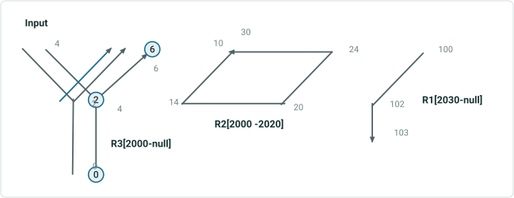

| EventID | RID | M | ToM | FromDate | ToDate | Attribute |
| --- | --- | --- | --- | --- | --- | --- |
| P1 | R3 | 0 |  | 1/1/2000 | null | Stop Sign |
| P2 | R3 | 2 |  | 1/1/2000 | 1/1/2020 | Stop Sign |
| P3 | R3 | 6 |  | 1/1/2000 | null | Stop Sign |
| L1 | R3 | 0 | 6 | 1/1/2000 | null | Interstate |
| L1 | R3 | 4 | 6 | 1/1/2000 | null | Interstate |

Source event records to append

| EventID | RID | M | ToM | FromDate | ToDate | Attribute |
| --- | --- | --- | --- | --- | --- | --- |
| P1 | R3 | 0 |  | 1/1/2010 | null | Signal |
| P2 | R3 | 2 |  | 1/1/2010 | null | Signal |
| P3 | R3 | 6 |  | 1/1/2010 | null | Signal |
| L1 | R3 | 0 | 6 | 1/1/2010 | null | Local |
| L2 | R3 | 4 | 6 | 1/1/2010 | null | Local |

## Slide 23


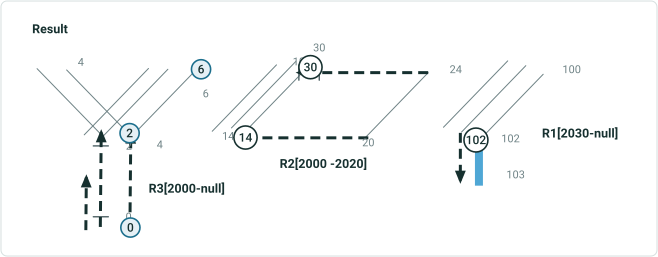

| EventID | RID | M | ToM | FromDate | ToDate | Attribute |
| --- | --- | --- | --- | --- | --- | --- |
| P1 | R3 | 0 |  | 1/1/2000 | 1/1/2010 | Stop Sign |
| P1 | R3 | 0 |  | 1/1/2010 | null | Signal |
| P2 | R3 | 2 |  | 1/1/2000 | 1/1/2010 | Stop Sign |
| P2 | R2 | 14 |  | 1/1/2010 | 1/1/2020 | Signal |
| P2 | R3 | 2 |  | 1/1/2020 | 1/1/2030 | Signal |
| P2 | R1 | 102 |  | 1/1/2030 | null | Signal |
| P3 | R3 | 6 |  | 1/1/2000 | 1/1/2010 | Stop Sign |
| P3* | R2 | 30 |  | 1/1/2010 | 1/1/2020 | Signal |
| P3 | R3 | 6 |  | 1/1/2020 | 1/1/2030 | Signal |
| P3 | R1 | 100 |  | 1/1/2030 | null | Signal |
| L1 | R3 | 0 | 6 | 1/1/2000 | 1/1/2010 | Interstate |
| L1 | R3 | 0 | 4 | 1/1/2010 | 1/1/2020 | Local |
| L1 | R3 | 0 | 6 | 1/1/2020 | 1/1/2030 | Local |
| L1 | R3 | 0 | 1 | 1/1/2030 | null | Local |
| L1 | R3 | 2 | 4 | 1/1/2030 | null | Local |
| L1 | R2 | 10 | 14 | 1/1/2010 | 1/1/2020 | Local |
| L1 | R1 | 100 | 103 | 1/1/2030 | null | Local |
| L2 | R1 | 4 | 6 | 1/1/2000 | 1/1/2010 | Interstate |
| L2 | R2 | 10 | 14 | 1/1/2010 | 1/1/2020 | Local |
| L2 | R3 | 4 | 6 | 1/1/2020 | 1/1/2030 | Local |
| L2 | R1 | 100 | 102 | 1/1/2030 | null | Local |

6a. Retire by EventID
- - measure can be anyone of the values (10,30)

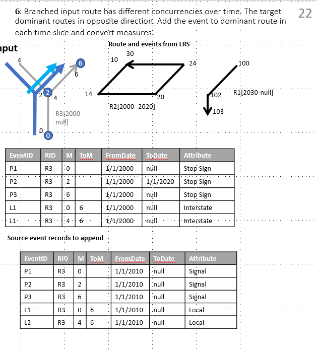

## Slide 24


6b. Replace by EventID
- - measure can be anyone of the values (10,30)

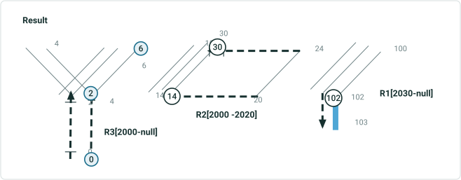

| EventID | RID | M | ToM | FromDate | ToDate | Attribute |
| --- | --- | --- | --- | --- | --- | --- |
| P1 | R3 | 0 |  | 1/1/2010 | null | Signal |
| P2 | R2 | 14 |  | 1/1/2010 | 1/1/2020 | Signal |
| P2 | R3 | 2 |  | 1/1/2020 | 1/1/2030 | Signal |
| P2 | R1 | 102 |  | 1/1/2030 | null | Signal |
| P3* | R2 | 30 |  | 1/1/2010 | 1/1/2020 | Signal |
| P3 | R3 | 6 |  | 1/1/2020 | 1/1/2030 | Signal |
| P3 | R1 | 100 |  | 1/1/2030 | null | Signal |
| L1 | R3 | 0 | 4 | 1/1/2010 | 1/1/2020 | Local |
| L1 | R3 | 0 | 6 | 1/1/2020 | 1/1/2030 | Local |
| L1 | R3 | 0 | 1 | 1/1/2030 | null | Local |
| L1 | R3 | 2 | 4 | 1/1/2030 | null | Local |
| L1 | R2 | 10 | 14 | 1/1/2010 | 1/1/2020 | Local |
| L1 | R1 | 100 | 103 | 1/1/2030 | null | Local |
| L2 | R2 | 10 | 14 | 1/1/2010 | 1/1/2020 | Local |
| L2 | R3 | 4 | 6 | 1/1/2020 | 1/1/2030 | Local |
| L2 | R1 | 100 | 102 | 1/1/2030 | null | Local |


## Slide 25

6: Branched input route has different concurrencies over time. The target dominant routes in opposite direction. Add the event to dominant route in each time slice and convert measures. – Retire Overlaps
Route and events from LRS

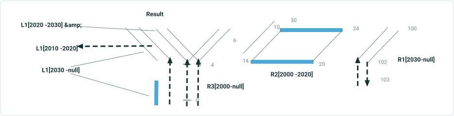

| EventID | RID | M | ToM | FromDate | ToDate | Attribute |
| --- | --- | --- | --- | --- | --- | --- |
| L1 | R3 | 0 | 6 | 1/1/2000 | null | Interstate |

Source event records to append

| EventID | RID | M | ToM | FromDate | ToDate | Attribute |
| --- | --- | --- | --- | --- | --- | --- |
| L1 | R3 | 0 | 6 | 1/1/2010 | null | Local |

| EventID | RID | M | ToM | FromDate | ToDate | Attribute |
| --- | --- | --- | --- | --- | --- | --- |
| L1 | R3 | 0 | 6 | 1/1/2000 | 1/1/2010 | Interstate |
| L1 | R3 | 0 | 4 | 1/1/2010 | 1/1/2020 | Local |
| L1 | R2 | 10 | 14 | 1/1/2010 | 1/1/2020 | Local |
| L1 | R3 | 0 | 6 | 1/1/2020 | 1/1/2030 | Local |
| L1 | R3 | 0 | 1 | 1/1/2030 | null | Local |
| L1 | R3 | 2 | 4 | 1/1/2030 | null | Local |
| L1 | R1 | 100 | 103 | 1/1/2030 | null | Local |

## Slide 26

8a: Alpha input route is the subordinate route over the only one time slice. Add the event on the dominant, 3D alpha route. - Retire by EventID
Route and events from LRS

| EventID | RID | M | ToM | FromDate | ToDate | Attribute |
| --- | --- | --- | --- | --- | --- | --- |
| P1 | R2 | 8 |  | 1/1/2000 | null | Stop Sign |
| L1 | R2 | 0 | 16 | 1/1/2000 | null | Interstate |

Source event records to append

| EventID | RID | M | ToM | FromDate | ToDate | Attribute |
| --- | --- | --- | --- | --- | --- | --- |
| P1 | R2 | 8 |  | 1/1/2010 | null | Signal |
| L1 | R2 | 0 | 16 | 1/1/2010 | null | Local |

| EventID | RID | M | ToM | FromDate | ToDate | Attribute |
| --- | --- | --- | --- | --- | --- | --- |
| P1 | R2 | 8 |  | 1/1/2000 | 1/1/2010 | Stop Sign |
| P1 | R1 | 9 |  | 1/1/2010 | null | Signal |
| L1 | R2 | 0 | 16 | 1/1/2000 | 1/1/2010 | Interstate |
| L1 | R2 | 0 | 2 | 1/1/2010 | null | Local |
| L1 | R2 | 14 | 16 | 1/1/2010 | null | Local |
| L1 | R1 | 3 | 15 | 1/1/2010 | null | Local |

[figure: 0 · 3 · 8 · R2 · R1 · 16 · 5 · 11 · 17 · 6 · 9 · 12 · 15 · 2 · 14 · Input · Result]

## Slide 27

8b: Alpha input route is the subordinate route over the only one time slice. Add the event on the dominant, 3D alpha route. - Replace by EventID
Route and events from LRS

| EventID | RID | M | ToM | FromDate | ToDate | Attribute |
| --- | --- | --- | --- | --- | --- | --- |
| P1 | R2 | 8 |  | 1/1/2000 | null | Stop Sign |
| L1 | R2 | 0 | 16 | 1/1/2000 | null | Interstate |

Source event records to append

| EventID | RID | M | ToM | FromDate | ToDate | Attribute |
| --- | --- | --- | --- | --- | --- | --- |
| P1 | R2 | 8 |  | 1/1/2010 | null | Signal |
| L1 | R2 | 0 | 16 | 1/1/2010 | null | Local |

| EventID | RID | M | ToM | FromDate | ToDate | Attribute |
| --- | --- | --- | --- | --- | --- | --- |
| P1 | R1 | 9 |  | 1/1/2010 | null | Signal |
| L1 | R2 | 0 | 2 | 1/1/2010 | null | Local |
| L1 | R2 | 14 | 16 | 1/1/2010 | null | Local |
| L1 | R1 | 3 | 15 | 1/1/2010 | null | Local |

[figure: 0 · 3 · 8 · R2 · R1 · 16 · 5 · 11 · 17 · 6 · 9 · 12 · 15 · 2 · 14 · Input · Result]

## Slide 28

8c: Alpha input route is the subordinate route over the only one time slice. Add the event on the dominant, 3D alpha route. – Retire Overlaps
Route and events from LRS

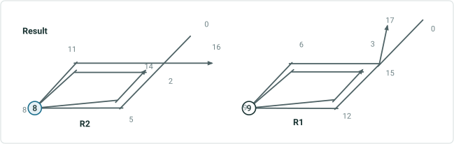

| EventID | RID | M | ToM | FromDate | ToDate | Attribute |
| --- | --- | --- | --- | --- | --- | --- |
| P1 | R2 | 8 |  | 1/1/2000 | null | Stop Sign |
| L1 | R2 | 0 | 16 | 1/1/2000 | null | Interstate |

Source event records to append

| EventID | RID | M | ToM | FromDate | ToDate | Attribute |
| --- | --- | --- | --- | --- | --- | --- |
| P1 | R2 | 8 |  | 1/1/2010 | null | Signal |
| L1 | R2 | 0 | 16 | 1/1/2010 | null | Local |

| EventID | RID | M | ToM | FromDate | ToDate | Attribute |
| --- | --- | --- | --- | --- | --- | --- |
| P1 | R2 | 8 |  | 1/1/2000 | null | Stop Sign |
| P1 | R1 | 9 |  | 1/1/2010 | null | Signal |
| L1 | R2 | 0 | 16 | 1/1/2000 | 1/1/2010 | Interstate |
| L1 | R2 | 2 | 14 | 1/1/2010 | null | Interstate |
| L1 | R2 | 0 | 2 | 1/1/2010 | null | Local |
| L1 | R2 | 14 | 16 | 1/1/2010 | null | Local |
| L1 | R1 | 3 | 15 | 1/1/2010 | null | Local |

## Slide 29 — For Spanning events only two methods Retire by EventID and Replace by Event ID is supported.

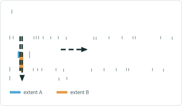

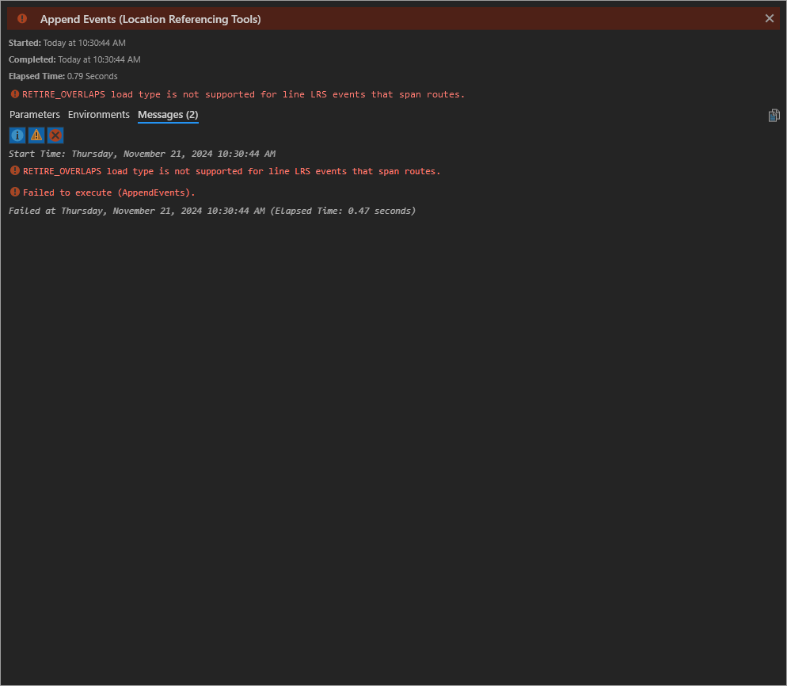

## Slide 30 — Spanning Positive 1a : Simple input routes have no concurrency. Add the event on these routes. – Retire by EventID

| EventID | From RID | From M | To RID | To M | FromDate | ToDate | Attribute |
| --- | --- | --- | --- | --- | --- | --- | --- |
| LE1 | R1 | 0 | R3 | 110 | 1/1/2000 | null | Class 2 |

Route and events from LRS
Source event records to append

| EventID | From RID | From M | To RID | To M | FromDate | ToDate | Attribute |
| --- | --- | --- | --- | --- | --- | --- | --- |
| LE1 | R1 | 0 | R3 | 110 | 1/1/2010 | null | Class 3 |

| EventID | From RID | From M | To RID | To M | FromDate | ToDate | Attribute |
| --- | --- | --- | --- | --- | --- | --- | --- |
| LE1 | R1 | 0 | R3 | 110 | 1/1/2000 | 1/1/2010 | Class 2 |
| LE1 | R1 | 0 | R3 | 110 | 1/1/2010 | null | Class 3 |

[figure: Result · R1 · 0 · 110 · R2 · L1 · 10 · 50 · Input · R3 · 60 · 100]

## Slide 31 — Spanning Positive 1b : Simple input routes have no concurrency. Add the event on these routes. – Replace by EventID

| EventID | From RID | From M | To RID | To M | FromDate | ToDate | Attribute |
| --- | --- | --- | --- | --- | --- | --- | --- |
| LE1 | R1 | 0 | R3 | 110 | 1/1/2000 | null | Class 2 |

Route and events from LRS
Source event records to append

| EventID | From RID | From M | To RID | To M | FromDate | ToDate | Attribute |
| --- | --- | --- | --- | --- | --- | --- | --- |
| LE1 | R1 | 0 | R3 | 110 | 1/1/2010 | null | Class 3 |

| EventID | From RID | From M | To RID | To M | FromDate | ToDate | Attribute |
| --- | --- | --- | --- | --- | --- | --- | --- |
| LE1 | R1 | 0 | R3 | 110 | 1/1/2010 | null | Class 3 |

[figure: R1 · 0 · 110 · R2 · L1 · 10 · 50 · Input · R3 · 60 · 100 · Result]

## Slide 32 — Spanning Positive 2a : Simple input routes are the dominant route over the only one time slice. Add the event on these

| EventID | From RID | From M | To RID | To M | FromDate | ToDate | Attribute |
| --- | --- | --- | --- | --- | --- | --- | --- |
| LE1 | R1 | 0 | R3 | 110 | 1/1/2000 | null | Class 2 |

Route and events from LRS
Source event records to append

| EventID | From RID | From M | To RID | To M | FromDate | ToDate | Attribute |
| --- | --- | --- | --- | --- | --- | --- | --- |
| LE1 | R1 | 0 | R3 | 110 | 1/1/2010 | null | Class 3 |

| EventID | From RID | From M | To RID | To M | FromDate | ToDate | Attribute |
| --- | --- | --- | --- | --- | --- | --- | --- |
| LE1 | R1 | 0 | R3 | 110 | 1/1/2000 | 1/1/2010 | Class 2 |
| LE1 | R1 | 0 | R3 | 110 | 1/1/2010 | null | Class 3 |

[figure: Result · R1 · 0 · 110 · R2 · L1 · 10 · 50 · Input · R3 · 60 · 100 · A1 · 20 · 160 · A2 · L2 · 30 · A3 · 150]

## Slide 33 — Spanning Positive 2b : Simple input routes are the dominant route over the only one time slice. Add the event on these

| EventID | From RID | From M | To RID | To M | FromDate | ToDate | Attribute |
| --- | --- | --- | --- | --- | --- | --- | --- |
| LE1 | R1 | 0 | R3 | 110 | 1/1/2000 | null | Class 2 |

Route and events from LRS
Source event records to append

| EventID | From RID | From M | To RID | To M | FromDate | ToDate | Attribute |
| --- | --- | --- | --- | --- | --- | --- | --- |
| LE1 | R1 | 0 | R3 | 110 | 1/1/2010 | null | Class 3 |

| EventID | From RID | From M | To RID | To M | FromDate | ToDate | Attribute |
| --- | --- | --- | --- | --- | --- | --- | --- |
| LE1 | R1 | 0 | R3 | 110 | 1/1/2010 | null | Class 3 |

[figure: R1 · 0 · 110 · R2 · L1 · 10 · 50 · Input · R3 · 60 · 100 · Result · 20 · 160 · A2 · L2 · 30 · A3 · 150]

## Slide 34 — Spanning Positive 3a : Simple input routes are the subordinate route over all time slices. Add the event on dominant

| EventID | From RID | From M | To RID | To M | FromDate | ToDate | Attribute |
| --- | --- | --- | --- | --- | --- | --- | --- |
| LE1 | R1 | 0 | R3 | 110 | 1/1/2000 | null | Class 2 |

Route and events from LRS
Source event records to append

| EventID | From RID | From M | To RID | To M | FromDate | ToDate | Attribute |
| --- | --- | --- | --- | --- | --- | --- | --- |
| LE1 | R1 | 0 | R3 | 110 | 1/1/2010 | null | Class 3 |

| EventID | From RID | From M | To RID | To M | FromDate | ToDate | Attribute |
| --- | --- | --- | --- | --- | --- | --- | --- |
| LE1 | R1 | 0 | R3 | 110 | 1/1/2000 | 1/1/2010 | Class 2 |
| LE1 | R1 | 0 | R1 | 5 | 1/1/2010 | null | Class3 |
| LE1 | R3 | 105 | R3 | 110 | 1/1/2010 | null | Class3 |
| LE1 | B2 | 0 | B2 | 5 | 1/1/2010 | null | Class3 |
| LE1 | B3 | 10 | B3 | 20 | 1/1/2010 | null | Class3 |

[figure: Result · R1 · 0 · 110 · R2 · L1 · 10 · 50 · Input · R3 · 60 · 100 · A1 · 20 · 160 · A2 · L2 · 30 · A3 · 150 · B2 · L3 · B3 · 5]

## Slide 35 — Spanning Positive 3b : Simple input routes are the subordinate route over all time slices. Add the event on dominant

| EventID | From RID | From M | To RID | To M | FromDate | ToDate | Attribute |
| --- | --- | --- | --- | --- | --- | --- | --- |
| LE1 | R1 | 0 | R3 | 110 | 1/1/2000 | null | Class 2 |

Route and events from LRS
Source event records to append

| EventID | From RID | From M | To RID | To M | FromDate | ToDate | Attribute |
| --- | --- | --- | --- | --- | --- | --- | --- |
| LE1 | R1 | 0 | R3 | 110 | 1/1/2010 | null | Class 3 |

| EventID | From RID | From M | To RID | To M | FromDate | ToDate | Attribute |
| --- | --- | --- | --- | --- | --- | --- | --- |
| LE1 | R1 | 0 | R1 | 5 | 1/1/2010 | null | Class3 |
| LE1 | R3 | 105 | R3 | 110 | 1/1/2010 | null | Class3 |
| LE1 | B2 | 0 | B2 | 5 | 1/1/2010 | null | Class3 |
| LE1 | B3 | 10 | B3 | 20 | 1/1/2010 | null | Class3 |

[figure: Result · R1 · 0 · 110 · R2 · L1 · 10 · 50 · Input · R3 · 60 · 100 · A1 · 20 · 160 · A2 · L2 · 30 · A3 · 150 · B2 · L3 · B3 · 5]

## Slide 36 — Spanning Positive 4a : Simple input routes are the subordinate route over all time slices. Add the event on dominant

| EventID | From RID | From M | To RID | To M | FromDate | ToDate | Attribute |
| --- | --- | --- | --- | --- | --- | --- | --- |
| LE1 | R1 | 0 | R3 | 110 | 1/1/2000 | null | Class 2 |

Route and events from LRS
Source event records to append

| EventID | From RID | From M | To RID | To M | FromDate | ToDate | Attribute |
| --- | --- | --- | --- | --- | --- | --- | --- |
| LE1 | R1 | 0 | R3 | 110 | 1/1/2010 | null | Class 3 |

| EventID | From RID | From M | To RID | To M | FromDate | ToDate | Attribute |
| --- | --- | --- | --- | --- | --- | --- | --- |
| LE1 | R1 | 0 | R3 | 110 | 1/1/2000 | 1/1/2010 | Class 2 |
| LE1 | R1 | 0 | R1 | 5 | 1/1/2010 | null | Class 3 |
| LE1 | A1 | 25 | A1 | 30 | 1/1/2010 | 1/1/2020 | Class3 |
| LE1 | A2 | 100 | A2 | 150 | 1/1/2010 | 1/1/2020 | Class3 |
| LE1 | A2 | 140 | A2 | 150 | 1/1/2020 | null | Class3 |
| LE1 | B2 | 0 | B2 | 5 | 1/1/2020 | null | Class 3 |
| LE1 | B3 | 10 | B3 | 20 | 1/1/2020 | null | Class 3 |

[figure: R1[2000 – null] · 0 · 110 · R2[2000 – null] · L1 · 10 · 50 · Input · 60 · 100 · A1[2010 – null] · 25 · A2[2010 – null] · L2 · 30 · 150 · 20 · B2[2020 – null] · L3 · 5 · R3[2000 – null] · B3[2020 – null] · Result]

## Slide 37 — Spanning Positive 4b : Simple input routes are the subordinate route over all time slices. Add the event on dominant

| EventID | From RID | From M | To RID | To M | FromDate | ToDate | Attribute |
| --- | --- | --- | --- | --- | --- | --- | --- |
| LE1 | R1 | 0 | R3 | 110 | 1/1/2000 | null | Class 2 |

Route and events from LRS
Source event records to append

| EventID | From RID | From M | To RID | To M | FromDate | ToDate | Attribute |
| --- | --- | --- | --- | --- | --- | --- | --- |
| LE1 | R1 | 0 | R3 | 110 | 1/1/2010 | null | Class 3 |

| EventID | From RID | From M | To RID | To M | FromDate | ToDate | Attribute |
| --- | --- | --- | --- | --- | --- | --- | --- |
| LE1 | R1 | 0 | R1 | 5 | 1/1/2010 | null | Class 3 |
| LE1 | A1 | 25 | A1 | 30 | 1/1/2010 | 1/1/2020 | Class3 |
| LE1 | A2 | 100 | A2 | 150 | 1/1/2010 | 1/1/2020 | Class3 |
| LE1 | A2 | 140 | A2 | 150 | 1/1/2020 | null | Class3 |
| LE1 | B2 | 0 | B2 | 5 | 1/1/2020 | null | Class 3 |
| LE1 | B3 | 10 | B3 | 20 | 1/1/2020 | null | Class 3 |

[figure: R1[2000 – null] · 0 · 110 · R2[2000 – null] · L1 · 10 · 50 · Input · 60 · 100 · A1[2010 – null] · 25 · A2[2010 – null] · L2 · 30 · 150 · 20 · B2[2020 – null] · L3 · 5 · R3[2000 – null] · B3[2020 – null] · Result]

## Slide 38 — Spanning Positive 5a : Lines have many routes, some in opposite direction.- – Retire by EventID

Route and events from LRS

| EventID | From RID | From M | To RID | To M | FromDate | ToDate | Attribute |
| --- | --- | --- | --- | --- | --- | --- | --- |
| LE1 | L1R1 | 100 | L1R6 | 100 | 1/1/2000 | null | Class 2 |
| LE2 | L2R4 | 30 | L2R3 | 150 | 1/1/2000 | null | Class 2 |

Source event records to append

| EventID | From RID | From M | To RID | To M | FromDate | ToDate | Attribute |
| --- | --- | --- | --- | --- | --- | --- | --- |
| LE1 | L1R1 | 100 | L1R6 | 100 | 1/1/2010 | null | Class 3 |
| LE2 | L2R4 | 30 | L2R3 | 150 | 1/1/2010 | null | Class 3 |

| EventID | From RID | From M | To RID | To M | FromDate | ToDate | Attribute |
| --- | --- | --- | --- | --- | --- | --- | --- |
| LE1 | L1R1 | 100 | L1R6 | 100 | 1/1/2000 | 1/1/2010 | Class 2 |
| LE2 | L2R4 | 30 | L2R3 | 150 | 1/1/2000 | 1/1/2010 | Class 2 |
| LE1 | L3R1 | 100 | L3R1 | 160 | 1/1/2010 | null | Class 3 |
| LE1 | L3R2 | 100 | L3R2 | 150 | 1/1/2010 | null | Class 3 |
| LE1 | L3R3 | 0 | L3R3 | 50 | 1/1/2010 | null | Class 3 |
| LE1 | L3R4 | 0 | L3R4 | 60 | 1/1/2010 | null | Class 3 |
| LE2 | L3R1 | 100 | L3R1 | 160 | 1/1/2010 | null | Class 3 |
| LE2 | L3R2 | 125 | L3R2 | 150 | 1/1/2010 | null | Class 3 |

[figure: 38 · Input · R1 · 100 · L2 · 200 · 50 · L1 · 60 · L3 · 160 · 0 · 40 · 80 · 150 · 30 · R6 · R4 · R2 · R3 · R5 · 130 · Result]

## Slide 39 — Spanning Positive 5b : Lines have many routes, some in opposite direction.- – Replace by EventID

Route and events from LRS

| EventID | From RID | From M | To RID | To M | FromDate | ToDate | Attribute |
| --- | --- | --- | --- | --- | --- | --- | --- |
| LE1 | L1R1 | 100 | L1R6 | 100 | 1/1/2000 | null | Class 2 |
| LE2 | L2R4 | 30 | L2R3 | 150 | 1/1/2000 | null | Class 2 |

Source event records to append

| EventID | From RID | From M | To RID | To M | FromDate | ToDate | Attribute |
| --- | --- | --- | --- | --- | --- | --- | --- |
| LE1 | L1R1 | 100 | L1R6 | 100 | 1/1/2010 | null | Class 3 |
| LE2 | L2R4 | 30 | L2R3 | 150 | 1/1/2010 | null | Class 3 |

| EventID | From RID | From M | To RID | To M | FromDate | ToDate | Attribute |
| --- | --- | --- | --- | --- | --- | --- | --- |
| LE1 | L3R1 | 100 | L3R1 | 160 | 1/1/2010 | null | Class 3 |
| LE1 | L3R2 | 100 | L3R2 | 150 | 1/1/2010 | null | Class 3 |
| LE1 | L3R3 | 0 | L3R3 | 50 | 1/1/2010 | null | Class 3 |
| LE1 | L3R4 | 0 | L3R4 | 60 | 1/1/2010 | null | Class 3 |
| LE2 | L3R1 | 100 | L3R1 | 160 | 1/1/2010 | null | Class 3 |
| LE2 | L3R2 | 125 | L3R2 | 150 | 1/1/2010 | null | Class 3 |

[figure: 39 · Input · R1 · 100 · L2 · 200 · 50 · L1 · 60 · L3 · 160 · 0 · 40 · 80 · 150 · 30 · R6 · R4 · R2 · R3 · R5 · 130 · Result]
