# Coordinates Method in Add Point and Add Line Widgets Test Plan

|   |   |
| --- | --- |
| **Kind** | Test Plan · Experience Builder |
| **Release** | — |
| **Issue** | [Beijing-R-D-Center/ExperienceBuilder-Web-Extensions#24791](https://devtopia.esri.com/Beijing-R-D-Center/ExperienceBuilder-Web-Extensions/issues/24791) |
| **Source** | [24791-CoordinatesMethodinAddPointandLine_TestPlanV1.pptx](<https://esriis.sharepoint.com/sites/LocationReferencing/Shared%20Documents/General/Test%20Plans/24791-CoordinatesMethodinAddPointandLine_TestPlanV1.pptx>) |
| **Edited** | 2025-06-11 21:25 by Mac Christmas |
| **Extracted** | 2026-09-04 · lane `xmlstrip` |

<!-- metadata
```yaml
title: "Coordinates Method in Add Point and Add Line Widgets Test Plan"
source_file: "24791-CoordinatesMethodinAddPointandLine_TestPlanV1.pptx"
source_url: "https://esriis.sharepoint.com/sites/LocationReferencing/Shared%20Documents/General/Test%20Plans/24791-CoordinatesMethodinAddPointandLine_TestPlanV1.pptx"
doc_id: 49
doc_kind: "Test Plan"
surface: "Experience Builder"
doc_revision: "V1"
target_release: ""
pe: ""
dev: ""
author: "Mac Christmas"
last_edited_by: "Mac Christmas"
last_edited: "2025-06-11T21:25:20Z"
extracted: 2026-09-04
extraction_lane: xmlstrip
prompt_version: "v2.0.2"
keywords: ["coordinates method", "add point", "add line", "event widgets", "route", "measure", "location error", "time slices"]
tools: ["Add Point", "Add Line", "Search by Route"]
products: []
issues: ["Beijing-R-D-Center/ExperienceBuilder-Web-Extensions#24791"]
related: [{"doc":138,"file":"add-line-event-widget__doc138.md","s":1004.299},{"doc":139,"file":"add-point-event-widget__doc139.md","s":1003.799},{"doc":48,"file":"location-offset-method-in-add-point-and-add-line-widgets-test-plan__doc48.md","s":7.446},{"doc":636,"file":"add-line-event-tool-coordinate-offset-method-test-plan__doc636.md","s":5.537},{"doc":176,"file":"coordinate-method-in-add-point-and-line-widgets__doc176.md","s":5.414}]
```
-->

## Summary

Test plan for the Coordinates method functionality in the Add Point and Add Line Event widgets. Covers positive and negative test cases including configuration, UI behavior, coordinate input validation, and event placement scenarios on various route types such as normal, gapped, branched, vertical, and line networks. Includes tests for time slices and location error handling.

## Related documents

<!-- related:begin -->
- [Add Line Event widget](<https://esriis.sharepoint.com/sites/lrsworkspace/LRS Doc Index/Other/add-line-event-widget__doc138.md>) — shared issue Beijing-R-D-Center/ExperienceBuilder-Web-Extensions#24791 · similar text 0.12 · 2 title words · 3 filename words · same surface <!-- rel:138 -->
- [Add Point Event widget](<https://esriis.sharepoint.com/sites/lrsworkspace/LRS Doc Index/Other/add-point-event-widget__doc139.md>) — shared issue Beijing-R-D-Center/ExperienceBuilder-Web-Extensions#24791 · similar text 0.12 · 2 title words · 2 filename words · same surface <!-- rel:139 -->
- [Location Offset Method in Add Point and Add Line Widgets Test Plan](<https://esriis.sharepoint.com/sites/lrsworkspace/LRS%20Doc%20Index/Test%20Plans/location-offset-method-in-add-point-and-add-line-widgets-test-plan__doc48.md>) — similar text 0.19 · 5 title words · 4 filename words · same kind/surface/folder <!-- rel:48 -->
- [Add Line Event Tool Coordinate Offset Method Test Plan](<https://esriis.sharepoint.com/sites/lrsworkspace/LRS%20Doc%20Index/Test%20Plans/add-line-event-tool-coordinate-offset-method-test-plan__doc636.md>) — similar text 0.65 · 3 title words · 1 filename word · same kind/folder <!-- rel:636 -->
- [Coordinate method in Add Point and Line widgets](<https://esriis.sharepoint.com/sites/lrsworkspace/LRS Doc Index/User Stories/coordinate-method-in-add-point-and-line-widgets__doc176.md>) — similar text 0.13 · 5 title words · 2 filename words · same surface <!-- rel:176 -->
<!-- related:end -->

<!-- docs:begin -->
## Esri documentation

[Add calibration points](https://doc.esri.com/en/arcgis-pro/latest/help/production/location-referencing-pipelines/add-calibration-points.html) · [Split a centerline by measure](https://doc.esri.com/en/arcgis-pro/latest/help/production/location-referencing-pipelines/split-a-centerline-by-measure.html) · [Location errors](https://doc.esri.com/en/arcgis-pro/latest/help/production/location-referencing-pipelines/location-errors.html)

_No page matched:_ [Add Line](https://www.google.com/search?q=%22Add%20Line%22+site%3Adoc.esri.com) · [Search by Route](https://www.google.com/search?q=%22Search%20by%20Route%22+site%3Adoc.esri.com)
<!-- docs:end -->

---

## Slide 1

Coordinates Method in Add Point and Add Line Widgets

| Positive Tests: Configuration |
| --- |
| Add Coordinates in the Methods (Add Line will have it for both the From and To Methods) Coordinates can be configured as the default Method in Add Point and the From/To Methods in Add Line Add default Spatial Reference configuration parameter to LRS network layers Add Search Radius configuration parameter to LRS network layers Search Radius will always be in the same units as the parent LRS network |

| Notes |
| --- |
| Add Coordinates method functionality to the Add Point and Add Line Event widgets Widgets will use same coordinate logic as in the Search by Route widget’s Coordinates method Test with nonline (auto-generated, single-field, and multi-field RouteID configurations) and line networks Test with different coordinate systems (Web Map, LRS, WGS_1984, etc.) Test conflict prevention continues to work as expected Sanity test Merge coincident events and Retire overlapping events data validation options i18n and 508 Referent population will not be part of this user story Use Pro Coordinates method test cases for testing Sanity test Search by Route widget’s Coordinate search functionality |

Devtopia Issue

| Positive Tests: Add Point/Add Line UI |
| --- |
| Coordinates method can be chosen (when enabled) Coordinates method is not displayed (when disabled) Coordinates method is chosen as the default method (when configured) RouteID/RouteName parameter continues to work as expected RouteID/RouteName picker continues to work as expected RouteID/RouteName picker continues to work as expected RouteID/RouteName parameter continues to work as expected X Coordinate and Y Coordinate parameters are required Z Coordinate parameter is optional Small markers appear on map for actual coordinate location Larger markers appear on map for location on route nearest to coordinate input Actual distance between coordinate and route is displayed If coordinate input returns to measures on the same route (Coordinate input is at self-intersecting measure of route, Coordinate input is equidistant from 2 measures on the same route, etc.), show measure selection pop-up that allows users to pick which measure they would like to use Reset button resets tool UI to initial state For Add Line, test the above for both the From and To Methods Ensure data actions from other widgets continue to populate Add Point and Add Line widgets as expected Confirm GCS coordinate distance from route is returned in Meters and not Degrees |

## Slide 2

| Negative Tests: Error |
| --- |
| Input invalid X coordinate with valid Y and Z coordinates Input invalid Y coordinate with valid X and Z coordinates Input invalid Z coordinate with valid X and Y coordinates Input X coordinate that exceeds the spatial reference (Examples: °, -°, etc.) Input Y coordinate that exceeds the spatial reference (Examples: °, -°, etc.) Input Z coordinate that exceeds the spatial reference (Examples: °, -°, etc.) Input X and Z coordinate, Y coordinate is missing Input Y and Z coordinate, X coordinate is missing Input invalid RouteID/RouteName Input invalid date range |

## Slide 3 — 1. Coordinate location falling on route (XYZ coordinates is provided by typing the value) for X marked location) 1a.

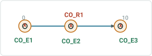

| RouteID | Event Layer | EventId | From Date | To Date | Measure | Ref Method | Ref location | Ref offset |
| --- | --- | --- | --- | --- | --- | --- | --- | --- |
| CO_R1 | Event1 | CO_E1 | 1/1/2000 |  | 0 | X/Y | X,Y | 0 |
| CO_R1 | Event1 | CO_E2 | 1/1/2000 |  | 5 | X/Y | X,Y | 0 |
| CO_R1 | Event1 | CO_E3 | 1/1/2000 |  | 10 | X/Y | X,Y | 0 |

1b.  Adding multiple point events in a normal route

| RouteId | Event Layer | EventId | FromDate | To Date | Measure |
| --- | --- | --- | --- | --- | --- |
| CO_R1 | Event1 | CO_E4 | 1/1/2000 |  | 8 |
| CO_R1 | Event2 | CO_E1 | 1/1/2000 |  | 8 |
| CO_R1 | Event3 | CO_E1 | 1/1/2000 |  | 8 |

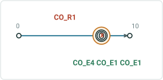

| Ref Method | Ref location | Ref offset |
| --- | --- | --- |
| X/Y | X,Y | 0 |
| X/Y | X,Y | 0 |
| X/Y | X,Y | 0 |

## Slide 4 — 2. Coordinate location not falling on the route(XYZ location is provided for location and event is placed on nearest

| RouteID | Event Layer | EventId | From Date | To Date | Measure |
| --- | --- | --- | --- | --- | --- |
| CO_R2 | Event1 | CO_E5 | 1/1/2000 |  | 0 |
| CO_R2 | Event1 | CO_E6 | 1/1/2000 |  | 5 |
| CO_R2 | Event1 | CO_E7 | 1/1/2000 |  | 10 |

2b.Adding multiple point events in a gapped route

| RouteID | Event Layer | EventId | From Date | To Date | Measure |
| --- | --- | --- | --- | --- | --- |
| CO_R1 | Event1 | CO_E6 | 1/1/2000 |  | 5.1 |
| CO_R1 | Event2 | CO_E2 | 1/1/2000 |  | 5.1 |
| CO_R1 | Event3 | CO_E2 | 1/1/2000 |  | 5.1 |

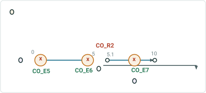

| Measure |
| --- |
| 5 |
| 5.1 |

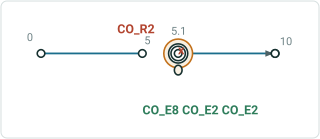

| Ref Method | Ref location | Ref offset |
| --- | --- | --- |
| X/Y | X,Y | 0.01 |
| X/Y | X,Y | 0.01 |
| X/Y | X,Y | 0.02 |

| Ref Method | Ref location | Ref offset |
| --- | --- | --- |
| X/Y | X,Y | 0.01 |
| X/Y | X,Y | 0.01 |
| X/Y | X,Y | 0.01 |

## Slide 5 — 3. Coordinate location falling on the route where there is more than one measure (XYZ location is provided for X marked

| RouteID | Event Layer | EventId | From Date | To Date | Measure |
| --- | --- | --- | --- | --- | --- |
| CO_R3 | Event1 | CO_E9 | 1/1/2000 |  | 14 |
| CO_R3 | Event1 | CO_E10 | 1/1/2000 |  | 47.5 |

3b.Adding multiple point events in a branched route

| RouteID | Event Layer | EventId | From Date | To Date | Measure |
| --- | --- | --- | --- | --- | --- |
| CO_R4 | Event1 | CO_E11 | 1/1/2000 |  | 10.59 |
| CO_R4 | Event2 | CO_E3 | 1/1/2000 |  | 10.59 |
| CO_R4 | Event3 | CO_E3 | 1/1/2000 |  | 10.59 |
| CO_R4 | Event1 | CO_E12 | 1/1/2000 |  | 25.3 |
| CO_R4 | Event2 | CO_E4 | 1/1/2000 |  | 25.3 |
| CO_R4 | Event3 | CO_E4 | 1/1/2000 |  | 25.3 |

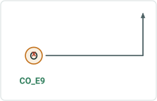

| Measure |
| --- |
| 14 |
| 71 |

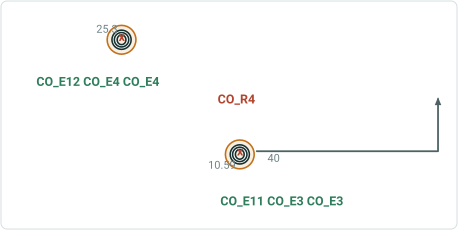

| Measure |
| --- |
| 10.59 |
| 40 |

| Ref Method | Ref location | Ref offset |
| --- | --- | --- |
| X/Y | X,Y | 0 |
| X/Y | X,Y | 0 |

| Ref Method | Ref location | Ref offset |
| --- | --- | --- |
| X/Y | X,Y | 0 |
| X/Y | X,Y | 0 |
| X/Y | X,Y | 0 |
| X/Y | X,Y | 0 |
| X/Y | X,Y | 0 |
| X/Y | X,Y | 0 |

 

## Slide 6 — 4. Coordinate location falling out of the route and the nearest location on the route has more than one measure. (XYZ

| RouteId | Event Layer | EventId | From Date | To Date | Measure |
| --- | --- | --- | --- | --- | --- |
| CO_R5 | Event1 | CO_E13 | 1/1/2000 |  | 40 |
| CO_R5 | Event1 | CO_E14 | 1/1/2000 |  | 15 |

4b.Adding multiple point events in a lollipop route

| RouteId | Event Layer | EventId | FromDate | To Date | Measure |
| --- | --- | --- | --- | --- | --- |
| CO_R6 | Event1 | CO_E15 | 1/1/2000 |  | 70 |
| CO_R6 | Event2 | CO_E4 | 1/1/2000 |  | 70 |
| CO_R6 | Event3 | CO_E4 | 1/1/2000 |  | 70 |

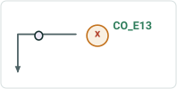

| Measure |
| --- |
| 0 |
| 40 |

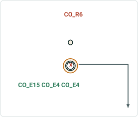

| Measure |
| --- |
| 30 |
| 70 |

| Ref Method | Ref location | Ref offset |
| --- | --- | --- |
| X/Y | X,Y | 0.02 |
| X/Y | X,Y | 0.02 |

| Ref Method | Ref location | Ref offset |
| --- | --- | --- |
| X/Y | X,Y | 0.02 |
| X/Y | X,Y | 0.02 |
| X/Y | X,Y | 0.02 |

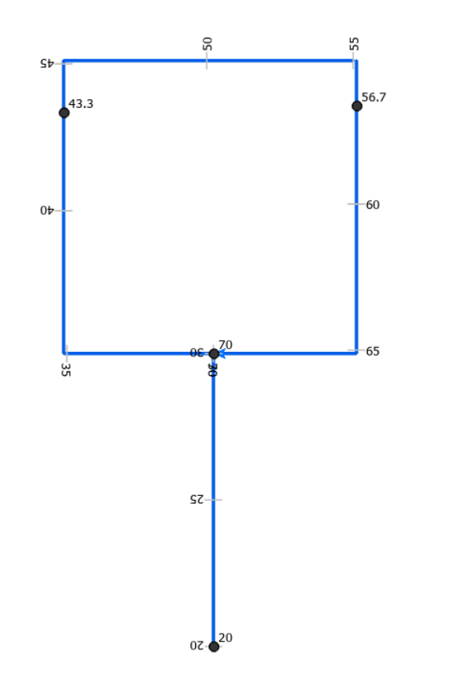 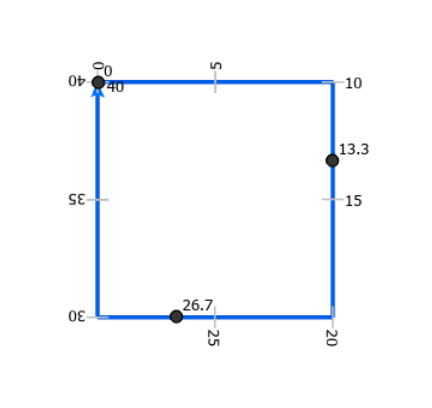

## Slide 7 — 5. Vertical Route 5a.Adding a point event in a vertical route having same xy and diff z.

| RouteId | Event Layer | EventId | FromDate | To Date | Measure |
| --- | --- | --- | --- | --- | --- |
| CO_R7 | Event1 | CO_E16 | 1/1/2000 |  | 1 |
| CO_R7 | Event1 | CO_E17 | 1/1/2000 |  | 2 |
| CO_R7 | Event1 | CO_E18 | 1/1/2000 |  | 8 |

5b. Adding multiple point events in a vertical route having same xy and diff z.

| RouteId | Event Layer | EventId | FromDate | To Date | Measure |
| --- | --- | --- | --- | --- | --- |
| CO_R8 | Event1 | CO_E19 | 1/1/2000 |  | 2 |
| CO_R8 | Event2 | CO_E5 | 1/1/2000 |  | 2 |
| CO_R8 | Event3 | CO_E5 | 1/1/2000 |  | 2 |

| Ref Method | Ref location | Ref offset |
| --- | --- | --- |
| X/Y | X,Y,Z | 0 |
| X/Y | X,Y,Z | 0.01 |
| X/Y | X,Y,Z | 0 |

| Ref Method | Ref location | Ref offset |
| --- | --- | --- |
| X/Y | X,Y,Z | 0 |
| X/Y | X,Y,Z | 0 |
| X/Y | X,Y,Z | 0 |

[figure: CO_E19 CO_E5 CO_E5 · CO_R8 · CO_E17 · x · CO_R7 · CO_E16 · CO_E18 · 2]

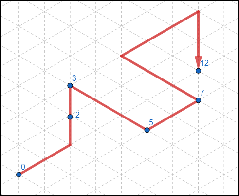 

## Slide 8 — 6. Line Network 6a.Adding a point event in a line network .

| LineID | RouteID | Event Layer | EventId | From Date | To Date | Measure |
| --- | --- | --- | --- | --- | --- | --- |
| L2 | R2L2 | EventL1 | CO_E10 | 1/1/2000 |  | 200 |
| L2 | R4L2 | EventL1 | CO_E2 | 1/1/2000 |  | 110 |
| L2 | R5L2 | EventL1 | CO_E3 | 1/1/2000 |  | 10 |

6b. Adding multiple  point events in a line network

| LineID | RouteID | Event Layer | EventId | From Date | To Date | Measure |
| --- | --- | --- | --- | --- | --- | --- |
| L2 | R1L2 | EventL1 | CO_E4 | 1/1/2000 |  | 2 |
| L2 | R1L2 | EventL2 | CO_E1 | 1/1/2000 |  | 2 |
| L2 | R1L2 | EventL3 | CO_E1 | 1/1/2000 |  | 2 |
| L2 | R3L2 | EventL1 | CO_E5 | 1/1/2000 |  | 2 |
| L2 | R3L2 | EventL2 | CO_E2 | 1/1/2000 |  | 2 |
| L2 | R3L2 | EventL3 | CO_E2 | 1/1/2000 |  | 2 |

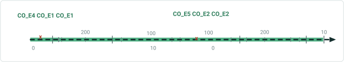

| Ref Method | Ref location | Ref offset |
| --- | --- | --- |
| X/Y | X,Y | 0 |
| X/Y | X,Y | 0.01 |
| X/Y | X,Y | 0 |

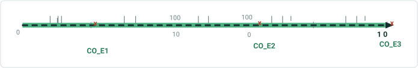

| Ref Method | Ref location | Ref offset |
| --- | --- | --- |
| X/Y | X,Y | 0.01 |
| X/Y | X,Y | 0.01 |
| X/Y | X,Y | 0.01 |
| X/Y | X,Y | 0 |
| X/Y | X,Y | 0 |
| X/Y | X,Y | 0 |

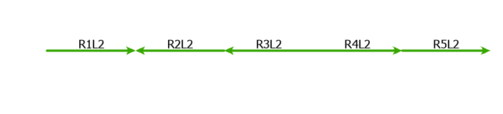

## Slide 9 — 7a. Adding point event with time slices Event dates are from null to null For event CO_E20 - coordinates fall exactly

| RouteID | Event Layer | EventId | From Date | To Date | Measure | Loc Error |
| --- | --- | --- | --- | --- | --- | --- |
| CO_R9 | Event1 | CO_E20 | Null | 1/1/2000 | 9 | Route not found |
| CO_R9 | Event1 | CO_E20 | 1/1/2000 | 1/1/2010 | 9 | No Error |
| CO_R9 | Event1 | CO_E20 | 1/1/2010 | 1/1/2020 | 9 | No Error |
| CO_R9 | Event1 | CO_E20 | 1/1/2020 | Null | 9 | Route not found |
| CO_R9 | Event1 | CO_E21 | Null | 1/1/2010 | 14 | Route not found |
| CO_R9 | Event1 | CO_E21 | 1/1/2010 | 1/1/2020 | 14 | No Error |
| CO_R9 | Event1 | CO_E21 | 1/1/2020 | Null | 14 | Route not found |

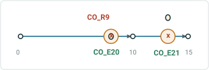

| RouteID | From Date | To Date | F M | To M |
| --- | --- | --- | --- | --- |
| CO_R9 | 1/1/2000 | 1/1/2010 | 0 | 10 |
| CO_R9 | 1/1/2010 | 1/1/2020 | 0 | 15 |

## Slide 10 — 7a. Adding point event with time slices Event dates are from null to null. Location Errors (Route not found) record

| RouteID | Event Layer | EventId | From Date | To Date | Measure | Loc Error |
| --- | --- | --- | --- | --- | --- | --- |
| CO_R10 | Event1 | CO_E22 | Null | 1/1/2000 | 5 | Route not found |
| CO_R10 | Event1 | CO_E22 | 1/1/2000 | 1/1/2010 | 5 | No Error |
| CO_R10 | Event1 | CO_E22 | 1/1/2010 | 1/1/2020 | 5 | No Error |
| CO_R10 | Event1 | CO_E22 | 1/1/2020 | Null | 5 | Route not found |
| CO_R10 | Event2 | CO_E6 | Null | 1/1/2000 | 5 | Route not found |
| CO_R10 | Event2 | CO_E6 | 1/1/2000 | 1/1/2010 | 5 | No Error |
| CO_R10 | Event2 | CO_E6 | 1/1/2010 | 1/1/2020 | 5 | No Error |
| CO_R10 | Event2 | CO_E6 | 1/1/2020 | Null | 5 | Route not found |
| CO_R10 | Event3 | CO_E6 | Null | 1/1/2000 | 5 | Route not found |
| CO_R10 | Event3 | CO_E6 | 1/1/2000 | 1/1/2010 | 5 | No Error |
| CO_R10 | Event3 | CO_E6 | 1/1/2010 | 1/1/2020 | 5 | No Error |
| CO_R10 | Event3 | CO_E6 | 1/1/2020 | Null | 5 | Route not found |
| CO_R10 | Event1 | CO_E23 | Null | 1/1/2000 | 14 | Route not found |
| CO_R10 | Event1 | CO_E21 | 1/1/2000 | 1/1/2020 | 14 | No Error |
| CO_R10 | Event1 | CO_E21 | 1/1/2020 | Null | 14 | Route not found |

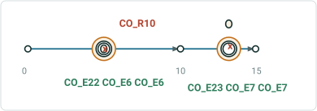

| RouteID | From Date | To Date | F M | To M |
| --- | --- | --- | --- | --- |
| CO_R10 | 1/1/2000 | 1/1/2010 | 0 | 10 |
| CO_R10 | 1/1/2010 | 1/1/2020 | 0 | 15 |

## Slide 11 — 1. Coordinate location falling on route (XYZ coordinates is provided by typing the value) for X marked location) 1a.


| Event Layer | EventId | FromRouteID | FromMeasure | ToMeasure | From Date | To Date | FromRef Method | FromRefLoc | FromRefOffset | ToRefMethod | ToRef Loc | ToRef offset | Sign |
| --- | --- | --- | --- | --- | --- | --- | --- | --- | --- | --- | --- | --- | --- |
| LEA | LEA1 | R1 | 2 | 6 | 1/1/2000 |  | X/Y | -300,-300 | 0 | X/Y | -400,-400 | 0 | 111 |

1b.  Adding multiple line events on a simple route with multi field ID


| Event Layer | EventId | FromRouteID | FromMeasure | ToMeasure | From Date | To Date | sign |
| --- | --- | --- | --- | --- | --- | --- | --- |
| MLA | MLA1 | RM1 | 2 | 6 | 1/1/2000 |  | 222 |
| MLB | MLB1 | RM1 | 2 | 6 | 1/1/2000 |  | 223 |

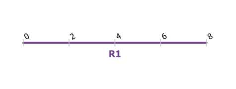

## Slide 12 — 2. Coordinate location not falling on the route(XYZ location is provided for location and event is placed on nearest

2b.Adding multiple line events in a gapped route with single field route ID

| Event Layer | EventId | FromRouteID | FromMeasure | ToMeasure | From Date | To Date | sign |
| --- | --- | --- | --- | --- | --- | --- | --- |
| SLA | SLA1 | RS2 | 2 | 7 | 1/1/2000 |  | 331 |
| SLB | SLB1 | RS2 | 2 | 7 | 1/1/2000 |  | 332 |

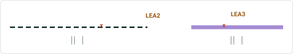

| Event Layer | EventId | FromRouteID | FromMeasure | ToMeasure | From Date | To Date | FromRef Method | FromRefLoc | FromRefOffset | ToRefMethod | ToRef Loc | ToRef offset | sign |
| --- | --- | --- | --- | --- | --- | --- | --- | --- | --- | --- | --- | --- | --- |
| LEA | LEA2 | R7b | 4 | 6 | 1/1/2000 |  | X/Y | -300,-300 | 0 | X/Y | -400,-400 | 0 | 112 |
| LEA | LEA2 | R7b | 8 | 8.7 | 1/1/2000 |  | X/Y | -400,-400 | 0 | X/Y | -500,-500 | 0 | 112 |

To continuous_auto, RID, 6
From continuous_auto, RID, 8

 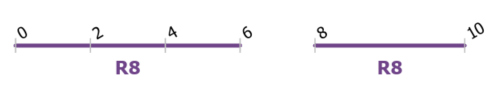

## Slide 13 — 3. Coordinate location falling on the route where there is more than one measure (XYZ location is provided for X marked

3b.Adding multiple line events in a branched route with multi field route ID

| Event Layer | EventId | FromRouteID | FromMeasure | ToMeasure | From Date | To Date | FromRef Method | FromRefLoc | FromRefOffset | ToRefMethod | ToRef Loc | ToRef offset | sign |
| --- | --- | --- | --- | --- | --- | --- | --- | --- | --- | --- | --- | --- | --- |
| LEA | LEA4 | R16 | 2 | 14 | 1/1/2000 |  | X/Y | -300,-300 | 0 | X/Y | -300,-300 | 0 | 113 |

| Event Layer | EventId | FromRouteID | FromMeasure | ToMeasure | From Date | To Date | sign |
| --- | --- | --- | --- | --- | --- | --- | --- |
| MLA | MLA2 | RM5 | 2 | 5 | 1/1/2000 |  | 224 |
| MLB | MLB2 | RM5 | 2 | 5 | 1/1/2000 |  | 225 |

[figure: R16 · LEA4 · 2, 14 · x · RM5 · 2, 4 · MLA2 MLB2]

 

## Slide 14 — 4. Coordinate location falling out of the route and the nearest location on the route has more than one measure. (XYZ

4b.Adding multiple line events in a lollipop route

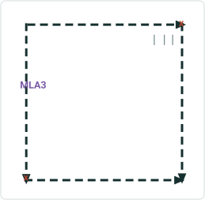

| Event Layer | EventId | FromRouteID | FromMeasure | ToMeasure | From Date | To Date | sign |
| --- | --- | --- | --- | --- | --- | --- | --- |
| MLA | MLA3 | RM3 | 1 | 5 | 1/1/2000 |  | 226 |

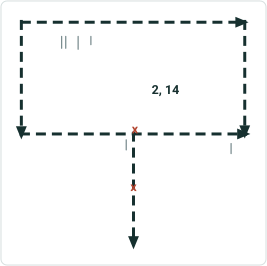

| Event Layer | EventId | FromRouteID | FromMeasure | ToMeasure | From Date | To Date | FromRef Method | FromRefLoc | FromRefOffset | ToRefMethod | ToRef Loc | ToRef offset | sign |
| --- | --- | --- | --- | --- | --- | --- | --- | --- | --- | --- | --- | --- | --- |
| LEA | LEA5 | R12 | 1 | 14 | 1/1/2000 |  | X/Y | -300,-300 | 0 | X/Y | -400,-400 | 0 | 115 |
| LEB | LEB1 | R12 | 1 | 14 | 1/1/2000 |  | X/Y | -400,-400 | 0 | X/Y | -500,-500 | 0 | 116 |

## Slide 15 — 5. Vertical Route 5a.Adding a line event in a vertical route with auto generated route ID; same xy and diff z.

5b. Adding multiple line events in a vertical route with single field route ID; diff xy and diff z.

| Event Layer | EventId | FromRouteID | FromMeasure | ToMeasure | From Date | To Date | FromRef Method | FromRefLoc | FromRefOffset | ToRefMethod | ToRef Loc | ToRef offset | sign |
| --- | --- | --- | --- | --- | --- | --- | --- | --- | --- | --- | --- | --- | --- |
| LEA | LEA5 | V23 | 2 | 4 | 1/1/2000 |  | X/Y | 100,100,200 | 0 | X/Y | 100,100,400 | 0 | 114 |

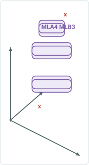

| Event Layer | EventId | FromRouteID | FromMeasure | ToMeasure | From Date | To Date | sign |
| --- | --- | --- | --- | --- | --- | --- | --- |
| MLA | MLA4 | V23 | 2 | 10 | 1/1/2000 |  | 227 |
| MLB | MLB3 | V23 | 2 | 10 | 1/1/2000 |  | 228 |

Info always saved as the event’s coor system

## Slide 16 — 6. Line Network 6a.Adding a spanning line event in a line network .

6b. Adding multiple line events in a line network

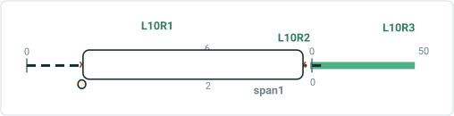

| Event Layer | EventId | FromRouteID | FromMeasure | ToRouteID | ToMeasure | From Date | To Date | FromRef Method | FromRefLoc | FromRefOffset | ToRefMethod | ToRef Loc | ToRef offset | sign |
| --- | --- | --- | --- | --- | --- | --- | --- | --- | --- | --- | --- | --- | --- | --- |
| span | span1 | L10R1 | 2 | L10R2 | 0.5 | 1/1/2000 |  | X/Y | -300,-300 | 0 | X/Y | -200,-200 | 0 | 441 |

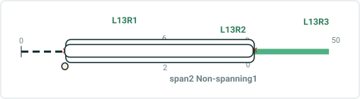

| Event Layer | EventId | FromRouteID | FromMeasure | ToRouteID | ToMeasure | From Date | To Date | FromRef Method | FromRefLoc | FromRefOffset | ToRefMethod | ToRef Loc | ToRef offset | sign |
| --- | --- | --- | --- | --- | --- | --- | --- | --- | --- | --- | --- | --- | --- | --- |
| span | span2 | L13R1 | 2 | L13R3 | 0 | 1/1/2000 |  | X/Y | -300,-300 | 0 | X/Y | -200,-200 | 0 | 442 |

| Event Layer | EventId | FromRouteID | FromMeasure | ToMeasure | From Date | To Date | sign |
| --- | --- | --- | --- | --- | --- | --- | --- |
| stayput | Stayput1 | L13R1 | 2 | 6 | 1/1/2000 |  | 551 |
| stayput | stayput2 | L13R2 | 0 | 2 | 1/1/2000 |  | 552 |

Create another line- line event that is non-spanning, with referent to check F/T refloc for the separated parts

## Slide 17 — 7a. Adding line event with time slices Event dates are from null to null coordinates fall exactly on the route.

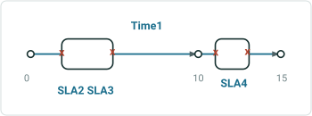

| RouteID | From Date | To Date | F M | To M |
| --- | --- | --- | --- | --- |
| Time1 | 1/1/2000 | 1/1/2010 | 0 | 10 |
| TIme1 | 1/1/2010 | 1/1/2020 | 0 | 15 |

| Event Layer | EventId | FromRouteID | FromMeasure | ToMeasure | From Date | To Date | sign | LocError |
| --- | --- | --- | --- | --- | --- | --- | --- | --- |
| SLA | SLA2 | Time1 | 2 | 5 | 1/1/2000 | 1/1/2010 | 334 | No Error |
| SLA | SLA3 | Time1 | 2 | 5 | 1/1/2010 | 1/1/2020 | 334 | No Error |
| SLA | SLA3 | Time1 | 2 | 5 | 1/1/2020 | null | 334 | Rt not found |
| SLA | SLA4 | Time1 | 11 | 13 | 1/1/2010 | 1/1/2020 | 337 | No Error |
| SLA | SLA4 | Time1 | 11 | 13 | 1/1/2020 | null | 337 | Rt not found |

## Slide 18 — 7a. Adding line event with time slices Event dates are from null to null. Location Errors record should not show up for

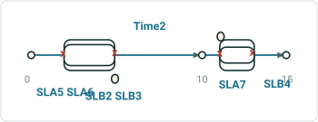

| RouteID | From Date | To Date | F M | To M |
| --- | --- | --- | --- | --- |
| Time2 | 1/1/2000 | 1/1/2010 | 0 | 10 |
| Time2 | 1/1/2010 | 1/1/2020 | 0 | 15 |

| Event Layer | EventId | FromRouteID | FromMeasure | ToMeasure | From Date | To Date | sign | LocError |
| --- | --- | --- | --- | --- | --- | --- | --- | --- |
| SLA | SLA5 | Time2 | 2 | 5 | 1/1/2000 | 1/1/2010 | 306 | No Error |
| SLB | SLB2 | Time2 | 2 | 5 | 1/1/2000 | 1/1/2010 | 307 | No Error |
| SLA | SLA6 | Time2 | 2 | 5 | 1/1/2010 | 1/1/2020 | 308 | No Error |
| SLB | SLB3 | Time2 | 2 | 5 | 1/1/2010 | 1/1/2020 | 309 | No Error |
| SLA | SLA7 | Time2 | 11 | 13 | 1/1/2010 | 1/1/2020 | 314 | No Error |
| SLB | SLB4 | Time2 | 11 | 13 | 1/1/2010 | 1/1/2020 | 315 | No Error |
