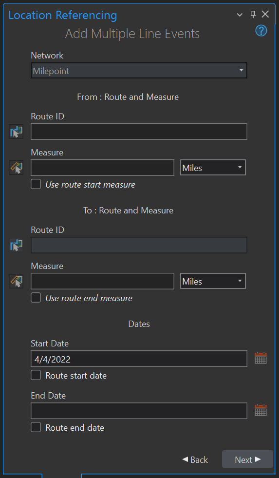
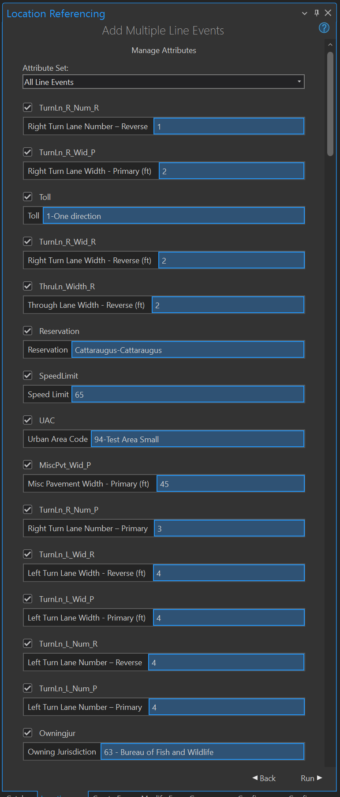
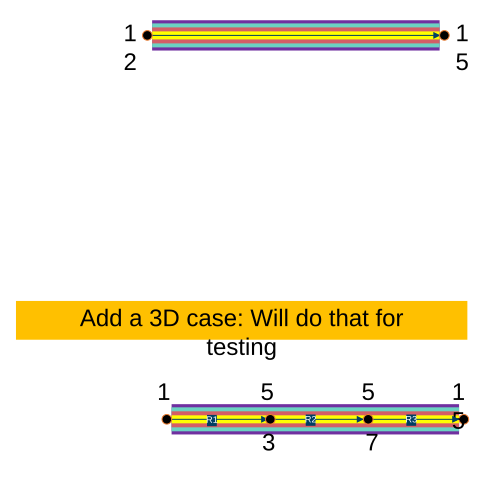

# Create multiple line events: Test Plan

| Field | Value |
| --- | --- |
| **Doc** | 669 · Test Plan · Pro |
| **Product** | Utility Network |
| **Release** | — |
| **Issues** | — |
| **Source** | [Add_Multi_Lines_Events_TestPlan.pptx](<https://esriis.sharepoint.com/sites/LocationReferencing/Shared%20Documents/General/Test%20Plans/Add_Multi_Lines_Events_TestPlan.pptx>) |
| **People** | author Rahul Rakshit · PE — · dev — |
| **Edited** | 2022-04-07 20:23 by Rahul Rakshit |
| **Extracted** | 2026-09-04 · lane xmlstrip · format 3.0 · prompt v2.0.2 |
| **Keywords** | line event · route · measure · branched versioning · attribute set · error handling · route picker · measure picker |
| **Tools** | — |

## Summary

Test plan for adding multiple line events across different network types including user created and auto-populated RouteID networks with branched versioning. It covers validation of route and measure pickers, attribute management, error handling, and UI behaviors for line and non-line networks. Includes test cases for date fields, measure precision, route selection, and error messages.

## Related documents

<!-- related:begin -->
- [Add Multiple Point Events](<https://esriis.sharepoint.com/sites/lrsworkspace/LRS%20Doc%20Index/Test%20Plans/add-multiple-point-events-2022-04.md>) — similar text 0.30 · 2 title words · 2 filename words · same kind/surface/folder <!-- rel:672 s=5.353 -->
- [Add Multiple Point Events](<https://esriis.sharepoint.com/sites/lrsworkspace/LRS Doc Index/Test Plans/add-multiple-point-events-2024-01.md>) — similar text 0.24 · 2 title words · 2 filename words · same kind/folder <!-- rel:434 s=4.676 -->
- [Experience Builder: Add Multiple Line Events Widget Test Plan](<https://esriis.sharepoint.com/sites/lrsworkspace/LRS Doc Index/Test Plans/16343-exb-add-multiple-line-events-widget.md>) — similar text 0.26 · 3 title words · 2 filename words · same kind/folder <!-- rel:457 s=4.562 -->
- [Test Plan for Conflict Prevention for Add Multiple Line Events Tool in ArcGIS Pro](<https://esriis.sharepoint.com/sites/lrsworkspace/LRS Doc Index/Test Plans/for-conflict-prevention-for-add-multiple-line-events-tool.md>) — similar text 0.07 · 3 title words · same kind/surface/folder <!-- rel:668 s=3.584 -->
- [Splitting Events in ArcGIS Pro - Test Plan](<https://esriis.sharepoint.com/sites/lrsworkspace/LRS Doc Index/Test Plans/3920-splitting-events-in-pro.md>) — similar text 0.22 · 1 title word · same kind/surface/folder <!-- rel:491 s=3.539 -->
<!-- related:end -->

<!-- docs:begin -->
## Esri documentation

[Split a centerline by measure](https://doc.esri.com/en/arcgis-pro/latest/help/production/location-referencing-pipelines/split-a-centerline-by-measure.html)
<!-- docs:end -->

---

## Test Cases

### TC-U01 — Networks Types <!-- src: S5 · slide 1 · label Networks Types -->

**Steps:**
1. Network with user created RouteID
2. Network with auto-populated RouteID
3. Network with Auto-populated RouteID supporting lines (UN)

### TC-U02 — Event Types <!-- src: S5 · slide 1 · label Event Types -->

**Steps:**
1. Line Event
2. Line Event spanning

### TC-U03 — Network <!-- src: S5 · slide 1 · label Network -->

**Steps:**
1. Verify that the Network dropdown contains only the networks available in the map
2. Verify that the no Network is selected initially

### TC-U04 — From Route <!-- src: S5 · slide 2 · label From Route -->

**Steps:**
1. Verify the route flashes 3 times, Once it is chosen on the map using the route picker and is not kept selected
2. Verify the ‘Route Name” is displayed instead of Route ID for the Networks configured with route name
3. RouteID / Route Name and Measure should be empty until the user types or select using the picker tools
4. Verify that the route selector UI is shown when the user clicks a location with the route picker that has more than one route at that location
5. Verify that the route selector UI is shown when the user types in a Route ID/Name which has more than one time-slices
6. Verify the route and measure are displayed on hover when the user selects either the Route or Measure pickers to interact with the map
7. For Line Networks, the Route Name drop-down shows the routes in line order for the selected line

### TC-U05 — From Measure <!-- src: S5 · slide 2 · label From Measure -->

**Steps:**
1. Verify that the measure picker is shown when the user picks a location where we have multiple measures
2. Verify that the measures can be typed
3. Provide a measure with 10 decimal places where only 7 decimal places are allowed and verify that the measure is truncated properly
4. Verify the snapping with route and measure picker
5. Verify that the measure units are set to the network’s units
6. Provide measures in stationing format. Note that the user may be thinking that the measure units are in feet.
7. Before selecting the route name or measure, change the units to meters (the Network units are Miles) and pick the route and measure values and ensure that the measures units are not changed
8. WRT the test above change the units to miles, do not change the measure value and validate the value on the units of miles
9. Verify the green dot at the location, when a measure on a route is selected on the map using the measure picker. The green dot’s location depends upon the measure value.

### TC-U06 — To Route <!-- src: S5 · slide 3 · label To Route -->

**Steps:**
1. For a non-line Network, the To Route ID is same as the From Route ID and it cannot be changed
2. Verify the route flashes 3 times, Once it is chosen on the map using the route picker
3. Verify the ‘Route Name” is displayed instead of Route ID for the Network configured with route name. Valid only for line Network.
4. Route ID / Route Name and Measure should be empty until the user types or select using the picker tools
5. Verify that the route selector UI is shown when the user clicks a location with the route picker that has more than one route at that location
6. Verify that the route selector UI is shown when the user types in a RouteId /Name which has more than one time-slices
7. For Line Networks, the Route ID drop-down shows the routes in line order for the selected line

### TC-U07 — To Measure <!-- src: S5 · slide 3 · label To Measure -->

**Steps:**
1. Verify that the measure picker is shown when the user picks a location where we have multiple measures.
2. Verify that the measures can be typed
3. Provide a measure with 9 decimal places where only 7 decimal places are allowed and verify that the measure is truncated properly
4. Verify the snapping with route and measure picker
5. Verify that the measure units are set to the network units
6. Provide some measures in stationing format
7. Before selecting the route name or measure, change the units to meters (the Network units are Miles) and pick the route and measure values and ensure that the measures units are not changed
8. WRT the test above change the units to miles, do not change the measure value and validate the value on the units of miles
9. Verify the red dot at the location, when a measure on a route is selected on the map using the measure picker or typing the value

### TC-U08 — Managing attributes <!-- src: S5 · slide 4 · label Managing attributes -->

**Steps:**
1. Verify that the following fields are supported
2. Double
3. Text
4. Date
5. GUID
6. Short
7. Coded value domains
8. Range domains
9. Attribute rules
10. Contingent values
11. Subtypes
12. No nullable fields
13. Fields with default values defined
14. Fields with default values defined when configuring attribute sets
15. In case of any errors in the attribute fields, verify that the error message is correct/make sense when hovering over the red graphic

### TC-U09 — Misc. <!-- src: S5 · slide 6 · label Misc. -->

**Steps:**
1. Two Networks exist, the 2 nd pane is filled up and then the network is changed. Clear the form.
2. The 2 nd pane is filled up and then the Line Name is changed. Update the From and To Routes and validate the measures and dates.
3. The 2 nd pane is filled up and then the From RID is changed. Do not clear the form, just validate the inputs based on the new from RID.
4. The 2 nd is filled up and then the To RID is changed. Do not clear the form, just validate the inputs based on the new To RID.
5. The whole 2 nd and 3 rd panes are filled up and then Network is changed. Clear the form.
6. The whole 2 nd and 3 rd panes are filled up and you are on the 3 rd pane. Now click back to 1 st pane and then come back to the 3 rd , nothing should change.
7. Create an attribute set and then add multiple line events using that attribute set.

## Other content

### Slide 1 — Create multiple line events : Test Plan <!-- slide 1 -->

| Attribute set combinations |
| --- |
|  |

| Database Types |
| --- |
| Branched versioning FS |

| Contains Events from | Network in 2 nd pane | Result |
| --- | --- | --- |
| Non-Line Network (N1) | Same Network (N1) | Add Events |
| Line Network (N2) | Same Network (N2) | Add Events |
| Non-Line Network (N1) | Different Non-Line Network (N3) | No Events to add - error message |
|  |  |  |
| Line Network (N2) | Different Line Network (N4) | No Events to add - error message |
| Multiple Networks Non-Line (N1,N3) | Network (N1) | Add Events for layers registered with N1 only |
| Multiple Networks Line and Non-Line (N1,N2) | Network (N1) | Add Events for layers registered with N1 only |
| Non-Line Network (N1) – Only one Event layer in the attribute set | Same Network (N1) | Add Events |

### Slide 2 <!-- slide 2 -->

| Line Name |
| --- |
| Only valid for line Networks |

### Slide 3 <!-- slide 3 -->

### Slide 4 <!-- slide 4 -->

| Start Date |
| --- |
| Verify that the Start Date text box is populated with the current date |

| End Date |
| --- |
| By default, End Date should be empty. |

### Slide 5 <!-- slide 5 -->

| Errors |
| --- |
|  |

|  | Test | Error Message |
| --- | --- | --- |
| 1 | Do not fill anything in the second pane and click Next | Please select a network |
| 2 | Fill the Network and click Next | Please enter the Route ID |
| 3 | Line Name missing when a Line Network is selected | Please enter the Line Name |
| 4 | Typed From Route does not exist in the Network | Invalid Route ID/name |
| 5 | Typed To Route does not exist in the Network | Invalid Route ID/name |
| 6 | From Route is missing | enter the Route ID |
| 7 | To Route is missing | enter the Route ID |
| 8 | Type text in the from measure field | Invalid Measure |
| 9 | Type text in the To measure field | Invalid Measure |
| 10 | Type 0.2.2. in the To measure field | Invalid measure |

|  | Test | Error Message |
| --- | --- | --- |
| 11 | Type 0.2.2. in the To measure field | Invalid measure |
| 12 | Start Date < End Date | Start date cannot be after the end date |
| 13 | Start Date = End Date | Start date and end date cannot be same |
| 14 | From M = To M in non-spanning event | From measure cannot be equal to the to measure |
| 15 | From M > To M in non-spanning event | From measure cannot be more than the to measure |
| 16 | From RID and to RID do not belong the same line | The route does not belong to <Line Name> |
| 17 | The From Route does not exist within the range of Start and End Dates | Route ID does not exist in the selected Network |
| 18 | The To Route does not exist within the range of Start and End Dates | Route ID does not exist in the selected Network |
| 19 | Click at a location where no route exists using the Route ID picker tool | No error message. Nothing happens |
| 20 | Measure for uncalibrated route | Invalid Measure |

### Slide 6 <!-- slide 6 -->

| Errors |
| --- |
|  |

|  | Test | Error Message |
| --- | --- | --- |
| 21 | Start Date not in date format | Invalid date |
| 22 | End Date not in date format | Invalid date |
| 23 | Nothing is selected in the third pane and run is clicked | No attribute added |
| 24 | No Start Date provided | Provide a start date |

### Slide 7 <!-- slide 7 -->

|  | Route ID | From Date | To Date | From Measure | To Measure | Code |
| --- | --- | --- | --- | --- | --- | --- |
|  | R1 | 1/1/2000 | Null | 12 | 15 | A |
|  | R1 | 1/1/2000 | Null | 12 | 15 | 12 |
|  | R1 | 1/1/2000 | Null | 12 | 15 | 8R |
|  | R1 | 1/1/2000 | Null | 12 | 15 | 1-345-2 |

|  | From R ID | From Measure | To RID | To Measure | From Date | To Date | Code |
| --- | --- | --- | --- | --- | --- | --- | --- |
|  | R1 | 1 | R3 | 15 | 1/1/2000 | Null | A |
|  | R1 | 1 | R3 | 15 | 1/1/2000 | Null | 12 |
|  | R1 | 1 | R3 | 15 | 1/1/2000 | Null | 8R |
|  | R1 | 1 | R3 | 15 | 1/1/2000 | Null | 1-345 |

Add a 3D case: Will do that for testing 

[figure: 12 · 15 · 1 · R1 · R2 · R3 · 5 · 3 · 7]

