# Create Route AI Assistant Test Plan

| Field | Value |
| --- | --- |
| **Doc** | 98 · Test Plan · Pro |
| **Product** | Roads & Highways |
| **Release** | — |
| **Issues** | — |
| **Source** | [CreateRoute_AI_Assistant_TestPlan1.pptx](<https://esriis.sharepoint.com/sites/LocationReferencing/Shared%20Documents/General/Test%20Plans/CreateRoute_AI_Assistant_TestPlan1.pptx>) |
| **People** | author Rahul Rakshit · PE — · dev — |
| **Edited** | 2025-12-09 21:27 by Rahul Rakshit |
| **Extracted** | 2026-09-04 · lane xmlstrip · format 3.0 · prompt v2.0.2 |
| **Keywords** | create route · route creation · centerlines · route id · network · date validation · input validation · error handling · complex routes · gapped routes · route calibration · location referencing |
| **Tools** | Create Route |

## Summary

This document provides a detailed test plan for the Create Route tool in the Location Referencing system within ArcGIS Pro. It covers workflows, input validation, error handling, and user prompts for creating routes with various complexities including gapped and complex shapes. The plan also addresses multi-user editing, licensing, and integration considerations.

## Related documents

<!-- related:begin -->
- [Create Route in Line Network and Multifield Network with Additional Attributes Pro AI Assistant Test Plan](<https://esriis.sharepoint.com/sites/lrsworkspace/LRS Doc Index/Test Plans/create-route-in-line-network-and-multifield-network.md>) — similar text 0.51 · 3 title words · 3 filename words · same kind/surface/folder <!-- rel:86 s=7.741 -->
- [Realign Route AI Assistant Test Plan](<https://esriis.sharepoint.com/sites/lrsworkspace/LRS Doc Index/Test Plans/7067-realign-route-ai-assistant-rh-apr-2026-02.md>) — similar text 0.40 · 2 title words · 1 filename word · same kind/surface/folder <!-- rel:51 s=5.581 -->
- [Realign Route AI Assistant Test Plan](<https://esriis.sharepoint.com/sites/lrsworkspace/LRS Doc Index/Test Plans/7067-realign-route-ai-assistant-rh-apr-v1.md>) — similar text 0.45 · 2 title words · 1 filename word · same kind/surface/folder <!-- rel:80 s=5.363 -->
- [Extend Route AI Assistant Test Plan](<https://esriis.sharepoint.com/sites/lrsworkspace/LRS Doc Index/Test Plans/7065-extend-route-ai-assistant.md>) — similar text 0.40 · 2 title words · same kind/surface/folder <!-- rel:18 s=5.081 -->
- [Retire Route – Pro AI Assistant Test Plan](<https://esriis.sharepoint.com/sites/lrsworkspace/LRS%20Doc%20Index/Test%20Plans/7066-retire-route-pro-ai-assistant.md>) — similar text 0.21 · 2 title words · 1 filename word · same kind/surface/folder <!-- rel:4 s=4.636 -->
<!-- related:end -->

<!-- docs:begin -->
## Esri documentation

[Create a route](https://doc.esri.com/en/arcgis-pro/latest/help/production/roads-highways/create-a-new-route.html) · [Merge centerlines](https://doc.esri.com/en/arcgis-pro/latest/help/production/roads-highways/merge-centerlines.html) · [View LRS Network properties](https://doc.esri.com/en/arcgis-pro/latest/help/production/roads-highways/view-lrs-network-properties.html) · [Complex scenarios for route calibration](https://doc.esri.com/en/arcgis-pro/latest/help/production/roads-highways/complex-scenarios-for-route-calibration.html) · [Set Location Referencing options](https://doc.esri.com/en/arcgis-pro/latest/help/production/roads-highways/set-location-referencing-options.html)
<!-- docs:end -->

---

## Overview

### Slide 1 <!-- slide 1 -->

### Slide 2 <!-- slide 2 -->

Note

- Test only in feature services
- Test on RH data with single field route id
- Projected and unprojected data with 3D
- Use multiple centerlines to create a route
- Test with spelling mistakes
- Gapped and multiple gapped route creation
- Complex routes such as lollipops, loops, alpha, branch, infinity with all the variations using multiple centerlines and gaps
- Centerlines that are not always in the same direction
- Test with local scene
- Verify that the create route form only opens when no error exists in the input parameters

### Slide 3 — Workflow for centerlines <!-- slide 3 -->

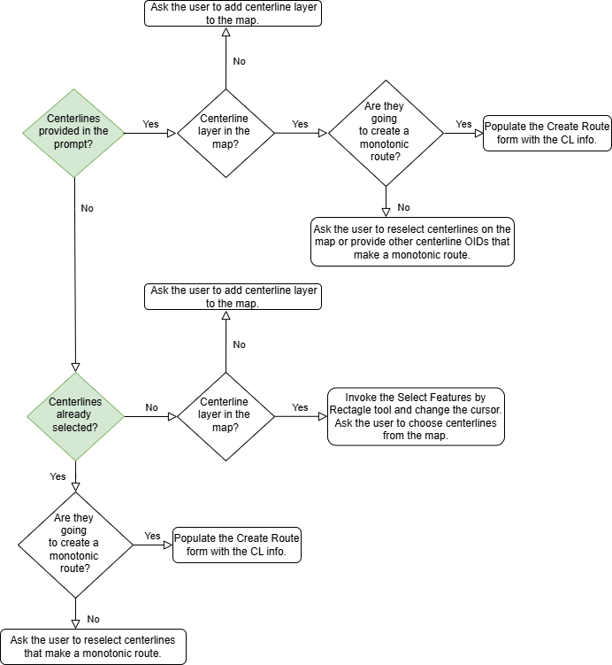

## Test Cases

### TC-U01 — No input provided (more than one network present) <!-- src: LLM · slide 4 · AI Assistant should ask for -->
- **Group:** AI Assistant should ask for
- **Case:** Centerlines
Network*
Route ID
*When more than one network is present

[figure: No input provided · Route · Route Network · Network Route · Road Network · Road · Network · Datum · Roadway · Highway · Create · Produce · Form a · Make · Build · Generate · a · new · Add · LRS]

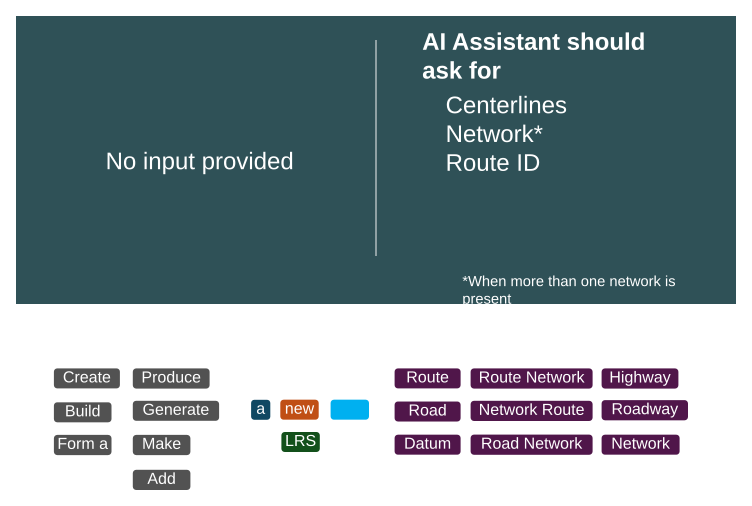

### TC-U02 — No input provided — prompt list part 1 <!-- src: LLM · slide 5 · AI Assistant should ask for -->
- **Group:** AI Assistant should ask for
- **Case:** Centerlines
Network*
Route ID
*When more than one network is present
No input provided

| Create a Route | Build a Datum | Form a new Road |
| --- | --- | --- |
| Create a Route Network | Build a Road Network | Form a new Network Route |
| Create a Highway | Build a Network | Form a new Roadway |
| Create a Road | Build new Route | Form a new Datum |
| Create a Network Route | Build new Route Network | Form a new Road Network |
| Create a Roadway | Build new Highway | Form a new Network |
| Create a Datum | Build new Road | Make a Route |
| Create a Road Network | Build new Network Route | Make a Route Network |
| Create a Network | Build new Roadway | Make a Highway |
| Create new Route | Build new Datum | Make a Road |
| Create new Route Network | Build new Road Network | Make a Network Route |
| Create new Highway | Build new Network | Make a Roadway |
| Create new Road | Generate a Route | Make a Datum |
| Create new Network Route | Generate a Route Network | Make a Road Network |
| Create new Roadway | Generate a Highway | Make a Network |
| Create new Datum | Generate a Road | Make new Route |
| Create new Road Network | Generate a Network Route | Make new Route Network |
| Create new Network | Generate a Roadway | Make new Highway |
| Produce a Route | Generate a Datum | Make new Road |
| Produce a Route Network | Generate a Road Network | Make new Network Route |
| Produce a Highway | Generate a Network | Make new Roadway |
| Produce a Road | Generate new Route | Make new Datum |
| Produce a Network Route | Generate new Route Network | Make new Road Network |
| Produce a Roadway | Generate new Highway | Make new Network |
| Produce a Datum | Generate new Road | Add a Route |
| Produce a Road Network | Generate new Network Route | Add a Route Network |
| Produce a Network | Generate new Roadway | Add a Highway |
| Produce new Route | Generate new Datum | Add a Road |
| Produce new Route Network | Generate new Road Network | Add a Network Route |
| Produce new Highway | Generate new Network | Add a Roadway |
| Produce new Road | Form a Route | Add a Datum |
| Produce new Network Route | Form a Route Network | Add a Road Network |
| Produce new Roadway | Form a Highway | Add a Network |
| Produce new Datum | Form a Road | Add new Route |

Prompts shown with red color should not open the create route tool

### TC-U03 — No input provided — prompt list part 2 <!-- src: LLM · slide 6 · AI Assistant should ask for -->
- **Group:** AI Assistant should ask for
- **Case:** Centerlines
Network*
Route ID
*When more than one network is present
No input provided

| Produce new Road Network | Form a Network Route | Add new Route Network |
| --- | --- | --- |
| Produce new Network | Form a Roadway | Add new Highway |
| Build a Route | Form a Datum | Add new Road |
| Build a Route Network | Form a Road Network | Add new Network Route |
| Build a Highway | Form a Network | Add new Roadway |
| Build a Road | Form a new Route | Add new Datum |
| Build a Network Route | Form a new Route Network | Add new Road Network |
| Build a Roadway | Form a new Highway | Add new Network |
| Create Route for LRS | Build Road for LRS | Form a Datum for LRS |
| Create Route Network for LRS | Build Network Route for LRS | Form a Road Network for LRS |
| Create Highway for LRS | Build Roadway for LRS | Form a Network for LRS |
| Create Road for LRS | Build Datum for LRS | Make Route for LRS |
| Create Network Route for LRS | Build Road Network for LRS | Make Route Network for LRS |
| Create Roadway for LRS | Build Network for LRS | Make Highway for LRS |
| Create Datum for LRS | Generate Route for LRS | Make Road for LRS |
| Create Road Network for LRS | Generate Route Network for LRS | Make Network Route for LRS |
| Create Network for LRS | Generate Highway for LRS | Make Roadway for LRS |
| Produce Route for LRS | Generate Road for LRS | Make Datum for LRS |
| Produce Route Network for LRS | Generate Network Route for LRS | Make Road Network for LRS |
| Produce Highway for LRS | Generate Roadway for LRS | Make Network for LRS |
| Produce Road for LRS | Generate Datum for LRS | Add Route for LRS |
| Produce Network Route for LRS | Generate Road Network for LRS | Add Route Network for LRS |
| Produce Roadway for LRS | Generate Network for LRS | Add Highway for LRS |
| Produce Datum for LRS | Form a Route for LRS | Add Road for LRS |
| Produce Road Network for LRS | Form a Route Network for LRS | Add Network Route for LRS |
| Produce Network for LRS | Form a Highway for LRS | Add Roadway for LRS |
| Build Route for LRS | Form a Road for LRS | Add Datum for LRS |
| Build Route Network for LRS | Form a Network Route for LRS | Add Road Network for LRS |
| Build Highway for LRS | Form a Roadway for LRS | Add Network for LRS |
| Create an LRS Route | Make an LRS Network Route | Add LRS Route |
| Create an LRS Route Network | Make an LRS Roadway | Add LRS Route Network |
| Create an LRS Highway | Make an LRS Datum | Add LRS Highway |
| Create an LRS Road | Make a new LRS Route | Add LRS Road |
| Create an LRS Network Route | Make a new LRS Route Network | Add LRS Network Route |

Prompts shown with red color should not open the create route tool

### TC-U04 — No input provided — prompt list part 3 <!-- src: LLM · slide 7 · AI Assistant should ask for -->
- **Group:** AI Assistant should ask for
- **Case:** Centerlines
Network*
Route ID
*When more than one network is present
No input provided

| Create an LRS Roadway | Make a new LRS Highway | Add LRS Roadway |
| --- | --- | --- |
| Create an LRS Datum | Make a new LRS Road | Add LRS Datum |
| Create a new LRS Route | Make a new LRS Network Route | Build a new LRS Datum |
| Create a new LRS Route Network | Make a new LRS Roadway | Build LRS Route |
| Create a new LRS Highway | Make a new LRS Datum | Build LRS Route Network |
| Create a new LRS Road | Make LRS Route | Build LRS Highway |
| Create a new LRS Network Route | Make LRS Route Network | Build LRS Road |
| Create a new LRS Roadway | Make LRS Highway | Build LRS Network Route |
| Create a new LRS Datum | Make LRS Road | Build LRS Roadway |
| Create LRS Route | Make LRS Network Route | Build LRS Datum |
| Create LRS Route Network | Make LRS Roadway | Form an LRS Route |
| Create LRS Highway | Make LRS Datum | Form an LRS Route Network |
| Create LRS Road | Add an LRS Route | Form an LRS Highway |
| Create LRS Network Route | Add an LRS Route Network | Form an LRS Road |
| Create LRS Roadway | Add an LRS Highway | Form an LRS Network Route |
| Create LRS Datum | Add an LRS Road | Make an LRS Route |
| Produce an LRS Route | Add an LRS Network Route | Make an LRS Route Network |
| Produce an LRS Route Network | Produce an LRS Roadway | Make an LRS Highway |
| Produce an LRS Highway | Produce an LRS Datum | Make an LRS Road |
| Produce an LRS Road | Produce a new LRS Route | Form an LRS Datum |
| Produce an LRS Network Route | Produce a new LRS Route Network | Form a new LRS Route |
| Build an LRS Route | Produce a new LRS Highway | Form a new LRS Route Network |
| Build an LRS Route Network | Produce a new LRS Road | Form a new LRS Highway |
| Build an LRS Highway | Produce a new LRS Network Route | Form a new LRS Road |
| Build an LRS Road | Produce a new LRS Roadway | Form a new LRS Network Route |
| Build an LRS Network Route | Produce a new LRS Datum | Form a new LRS Roadway |
| Build an LRS Roadway | Produce LRS Route | Form a new LRS Datum |
| Build an LRS Datum | Produce LRS Route Network | Add an LRS Roadway |
| Build a new LRS Route | Produce LRS Highway | Add an LRS Datum |
| Build a new LRS Route Network | Produce LRS Road | Add a new LRS Route |
| Build a new LRS Highway | Produce LRS Network Route | Add a new LRS Route Network |
| Build a new LRS Road | Produce LRS Roadway | Add a new LRS Highway |
| Build a new LRS Network Route | Produce LRS Datum | Add a new LRS Road |
| Build a new LRS Roadway | Form an LRS Roadway | Add a new LRS Network Route |
| Add a new LRS Roadway | Add a new LRS Datum |  |

Prompts shown with red color should not open the create route tool

### TC-U05 — No input provided (only one network present) <!-- src: LLM · slide 8 · AI Assistant should ask for -->
- **Group:** AI Assistant should ask for
- **Case:** Centerlines
Network*
Route ID

*When only one network is present

[figure: No input provided · Route · Route Network · Network Route · Road Network · Road · Network · Datum · Roadway · Highway · Create · Produce · Form a · Make · Build · Generate · Add · a · new · LRS]

### TC-U06 — Network is provided <!-- src: LLM · slide 9 · AI Assistant should ask for -->
- **Group:** AI Assistant should ask for
- **Case:** <Network Name> Network

[figure: Centerlines Route ID · Network is provided · Route · <Network Name> · Road · Datum · Roadway · Highway · Create · Produce · Form a · Make · Build · in · Add · a · new · LRS]

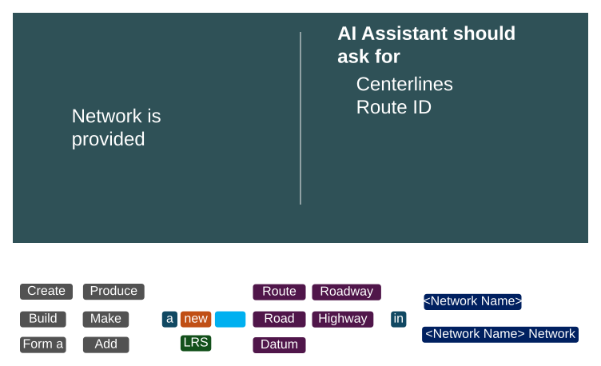

### TC-U07 — Centerlines are provided <!-- src: LLM · slide 10 · AI Assistant should ask for -->
- **Group:** AI Assistant should ask for
- **Case:** Between 101 to 108
Between 101 - 108

[figure: Network* Route ID · Centerlines are provided · Route · Road · Datum · Roadway · Highway · Create · Produce · Form a · Make · Build · using Centerlines with · Add · using CL with · with Centerlines · Object ID · OID · = 102 · 102, 103, 107 · <Any Field> · a · new · LRS]

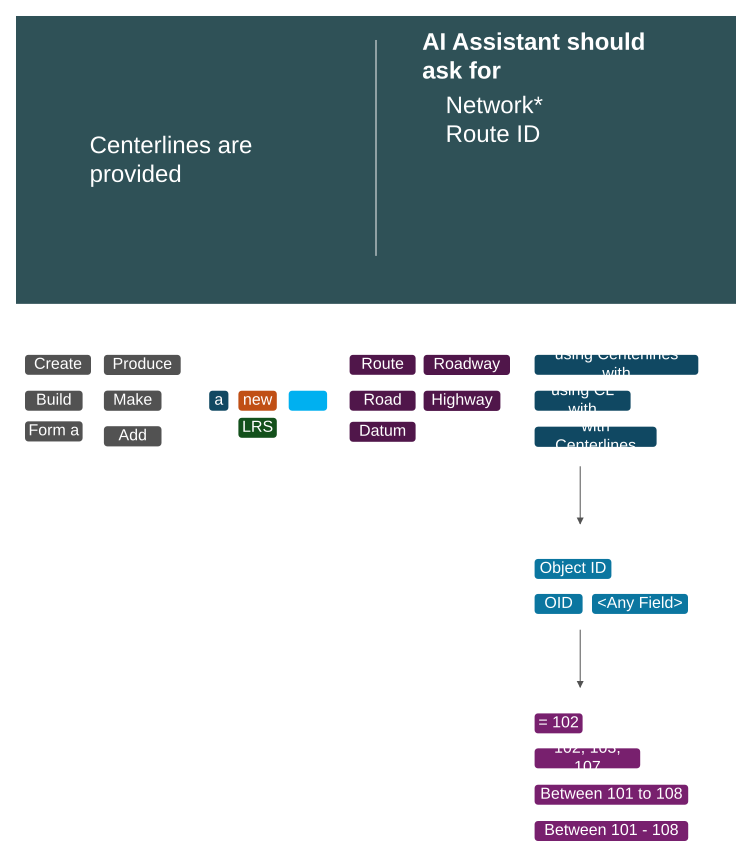

### TC-U08 — Date is provided <!-- src: LLM · slide 11 · AI Assistant should ask for -->
- **Group:** AI Assistant should ask for
- **Case:** Centerlines
Network*
Route ID
January 1st, 2000
*When more than one network is present

[figure: Date is provided · Route · Road · Datum · Roadway · Highway · Create · Produce · Form a · Make · Build · Add · on · for · Date 01/01/2000 · 01/01/2000 · 01-01-2000 · with · Jan 1, 2000 · a · new · LRS]

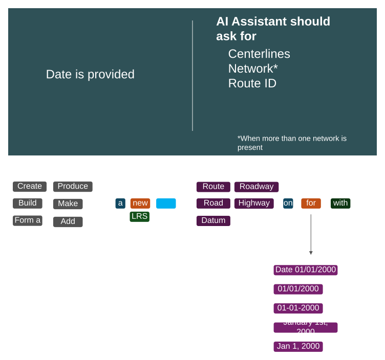

### TC-U09 — Route ID is provided (Route ID = R1) <!-- src: LLM · slide 12 · AI Assistant should ask for -->
- **Group:** AI Assistant should ask for
- **Case:** Route ID is provided
Route ID = R1

[figure: Centerlines · Route · Road · Datum · Roadway · Highway · Create · Produce · Form a · Make · Build · Add · with · Route ID R1 · RID R1 · R1 · a · new · LRS]

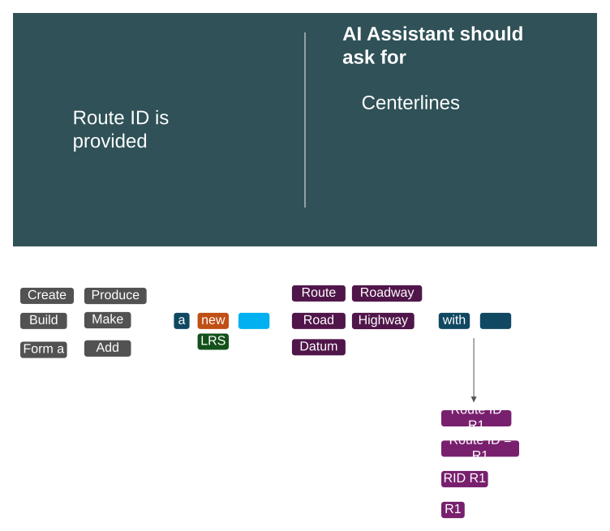

### TC-U10 — Route ID provided when Route Name is not configured <!-- src: LLM · slide 13 · AI Assistant should ask for -->
- **Group:** AI Assistant should ask for
- **Case:** Route ID is provided
Route ID = R1

If Route Name is not configured for the Network, then consider this as Route ID

[figure: Centerlines · Route · Road · Datum · Roadway · Highway · Create · Produce · Form a · Make · Build · Add · with · Route ID R1 · RID R1 · R1 · a · new · LRS]

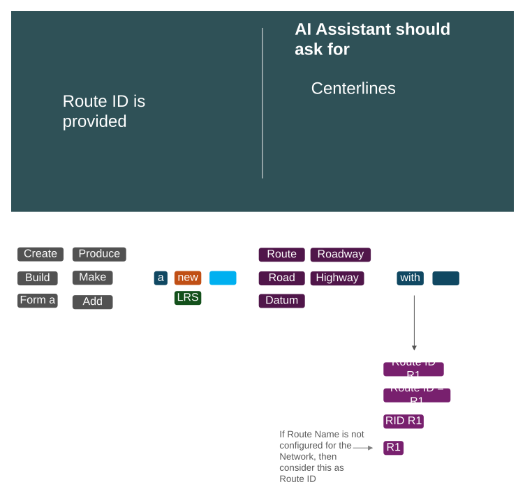

### TC-U11 — Route ID and Network provided <!-- src: LLM · slide 14 · AI Assistant should ask for -->
- **Group:** AI Assistant should ask for
- **Case:** Route ID and Network provided
*When more than one network is present
Route ID = R1

<Network Name> Network

[figure: Centerlines · Route · Road · Datum · Roadway · Highway · Create · Produce · Form a · Make · Build · Add · with · Route ID R1 · RID R1 · R1 · <Network Name> · in · a · new · LRS]

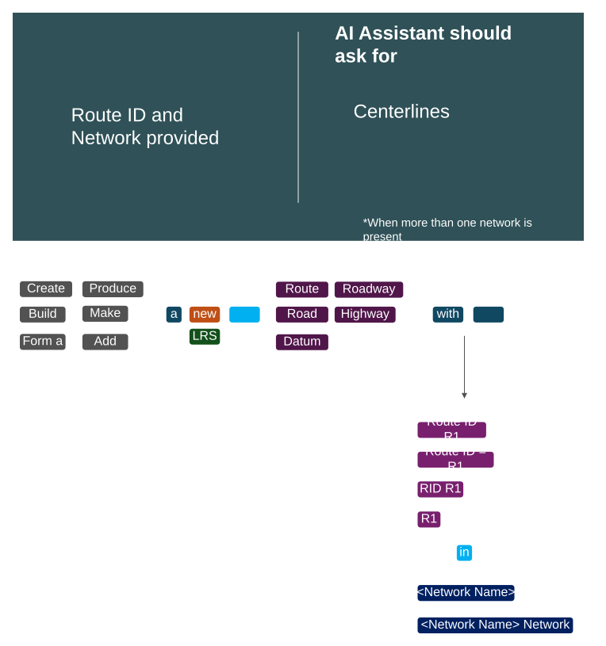

### TC-U12 — Route ID and Network provided <!-- src: LLM · slide 15 · AI Assistant should ask for -->
- **Group:** AI Assistant should ask for
- **Case:** Route ID and Network provided
*When more than one network is present
Route ID = R1

<Network Name> Network

[figure: Centerlines · Route · Road · Datum · Roadway · Highway · Create · Produce · Form a · Make · Build · Add · with · Route ID R1 · RID R1 · R1 · <Network Name> · in · a · new · LRS]

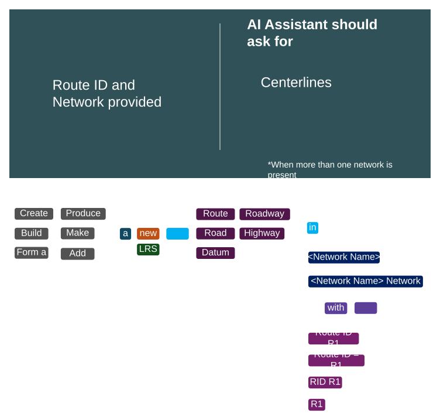

### TC-U13 — Route ID, Network and Date provided <!-- src: LLM · slide 16 · AI Assistant should ask for -->
- **Group:** AI Assistant should ask for
- **Case:** Route ID, Network and Date provided
*When more than one network is present
Route ID = R1

<Network Name> Network
January 1st, 2000

[figure: Centerlines · Route · Road · Datum · Roadway · Highway · Create · Produce · Form a · Make · Build · Add · with · Route ID R1 · RID R1 · R1 · <Network Name> · in · on · for · Date 01/01/2000 · 01/01/2000 · 01-01-2000 · Jan 1, 2000 · …]

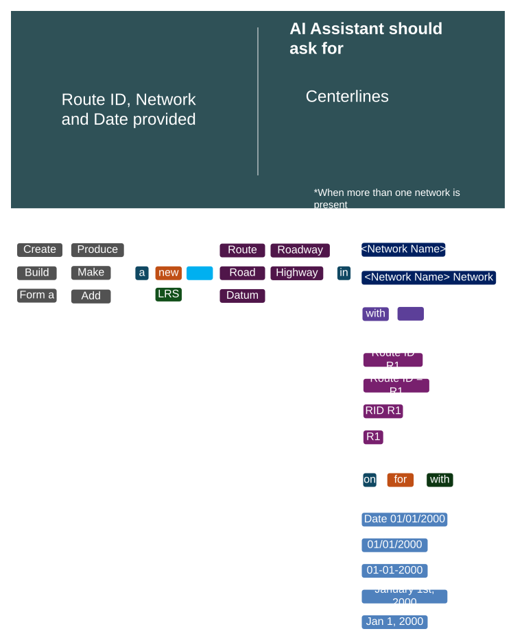

### TC-U14 — Route ID, Centerlines, Network and Date provided <!-- src: LLM · slide 17 · AI Assistant should -->
- **Group:** AI Assistant should
- **Case:** Route ID, Centerlines Network and Date provided
Route ID = R1

<Network Name> Network
January 1st, 2000
Between 101 to 108
Between 101 - 108
- **Expected Result:** Populate and open the Create Route form

[figure: Route · Road · Datum · Roadway · Highway · Create · Produce · Form a · Make · Build · Add · with · Route ID R1 · RID R1 · R1 · <Network Name> · in · on · for · Date 01/01/2000 · 01/01/2000 · 01-01-2000 · Jan 1, 2000 · using Centerlines with · …]

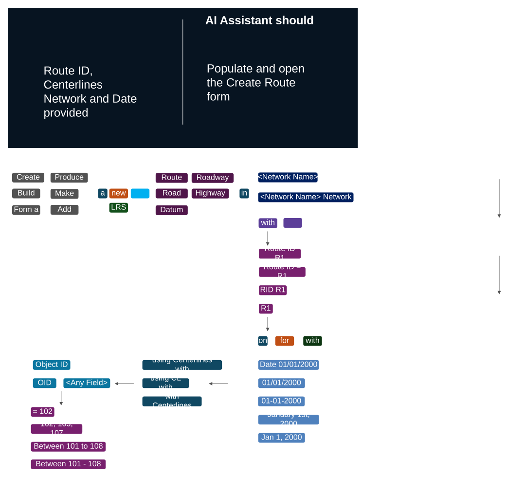

### TC-U15 — Route ID, Centerlines and Network provided (no date) <!-- src: LLM · slide 18 · AI Assistant should -->
- **Group:** AI Assistant should
- **Case:** Route ID, Centerlines and Network provided
Route ID = R1

<Network Name> Network
Between 101 to 108
Between 101 - 108

If Route Name is not configured for the Network, then consider this as Route ID
- **Expected Result:** Populate with today’s date and open the Create Route form

[figure: Route · Road · Datum · Roadway · Highway · Create · Produce · Form a · Make · Build · Add · with · Route ID R1 · RID R1 · R1 · <Network Name> · in · using Centerlines with · using CL with · with Centerlines · Object ID · OID · = 102 · 102, 103, 107 · …]

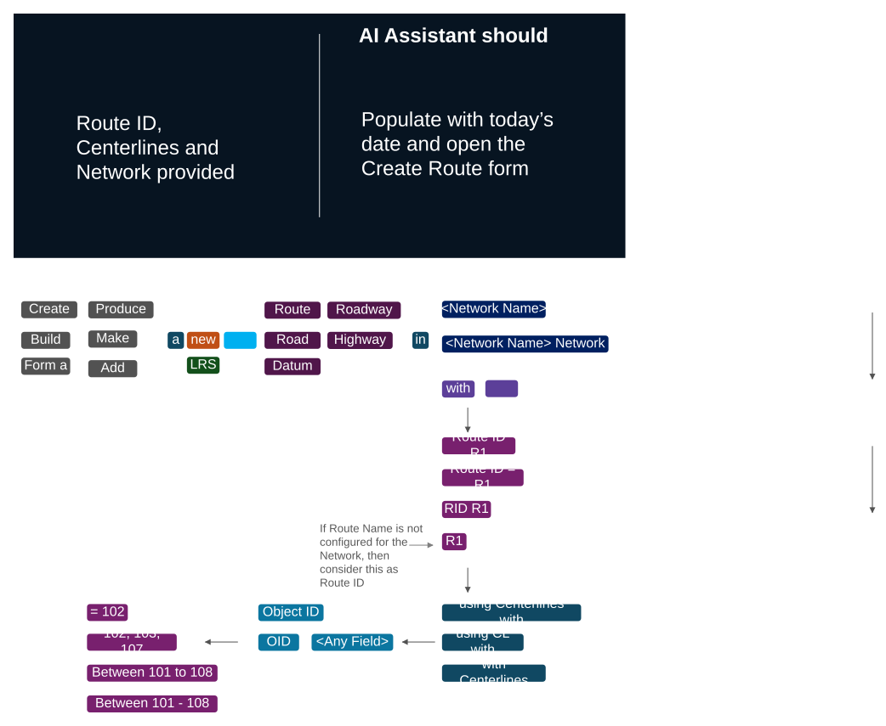

### TC-U16 — Route ID, Centerlines, Measures and Network provided <!-- src: LLM · slide 19 · AI Assistant should -->
- **Group:** AI Assistant should
- **Case:** Route ID, Centerlines, From and To Measures and  Network provided
Route ID = R1

<Network Name> Network
Between 101 to 108
Between 101 - 108

From Measure 0 and to Measure 0.892
Measures 0  and 0.892
0 and 0.892 as measures
0 and 0.892 as From and To measures
- **Expected Result:** Populate with today’s date and open the Create Route form

[figure: Route · Road · Datum · Roadway · Highway · Create · Produce · Form a · Make · Build · Add · with · Route ID R1 · RID R1 · R1 · <Network Name> · in · using Centerlines with · using CL with · with Centerlines · Object ID · OID · = 102 · 102, 103, 107 · …]

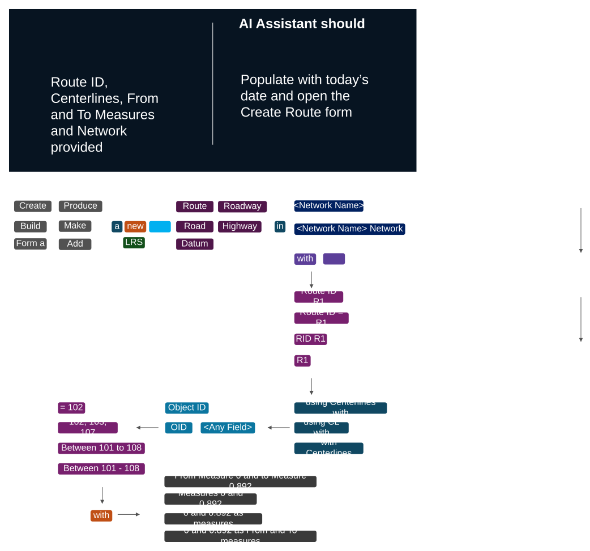

### TC-U17 — Route ID, Centerlines, Measures, Network and date provided <!-- src: LLM · slide 20 · AI Assistant should -->
- **Group:** AI Assistant should
- **Case:** Route ID, Centerlines, From and To Measures, Network and date provided
Route ID = R1
<Network Name> Network
Between 101 to 108
Between 101 - 108

From Measure 0 and to Measure 0.892
Measures 0  and 0.892
0 and 0.892 as measures
0 and 0.892 as From and To measures
January 1st, 2000
- **Expected Result:** Populate and open the Create Route form

[figure: Route · Road · Datum · Roadway · Highway · Create · Produce · Form a · Make · Build · Add · Route ID R1 · RID R1 · and · R1 · <Network Name> · in · using Centerlines with · using CL with · with Centerlines · Object ID · OID · = 102 · 102, 103, 107 · …]

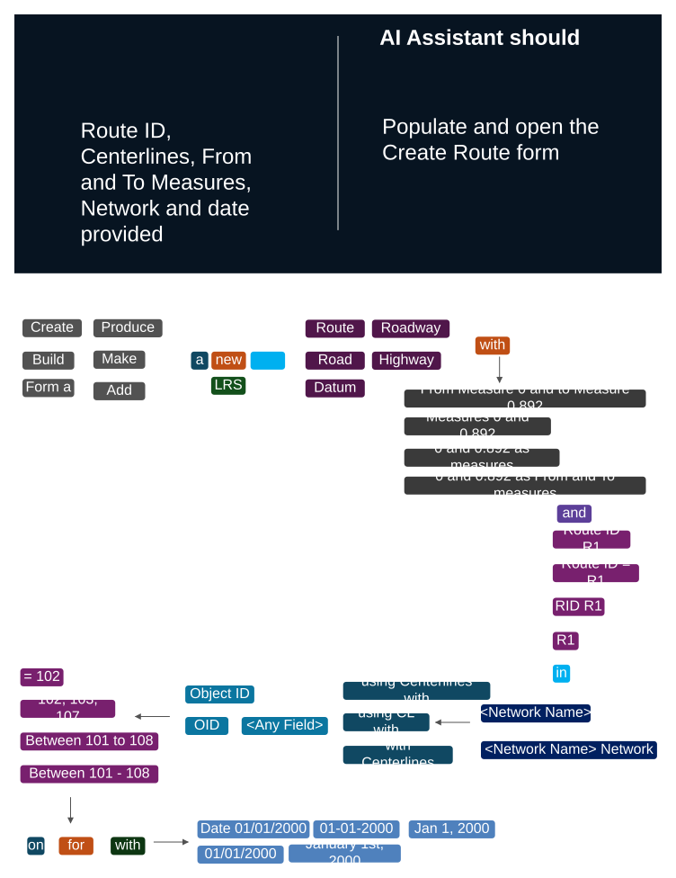

### TC-U18 — Route ID, Centerlines, spanning measures, Network and date provided <!-- src: LLM · slide 21 · AI Assistant should -->
- **Group:** AI Assistant should
- **Case:** Route ID, Centerlines, From and To Measures, Network and date provided
Route ID = R1
<Network Name> Network
Between 101 to 108
Between 101 - 108

From Measure 0 and to Measure 0.892
Spanning Measures 0  and 0.892
0 and 0.892 as measures
0 and 0.892 as From and To measures
January 1st, 2000
- **Expected Result:** Populate and open the Create Route form

[figure: Route · Road · Datum · Roadway · Highway · Create · Produce · Form a · Make · Build · Add · Route ID R1 · RID R1 · with · R1 · <Network Name> · in · using Centerlines with · using CL with · with Centerlines · Object ID · OID · = 102 · 102, 103, 107 · …]

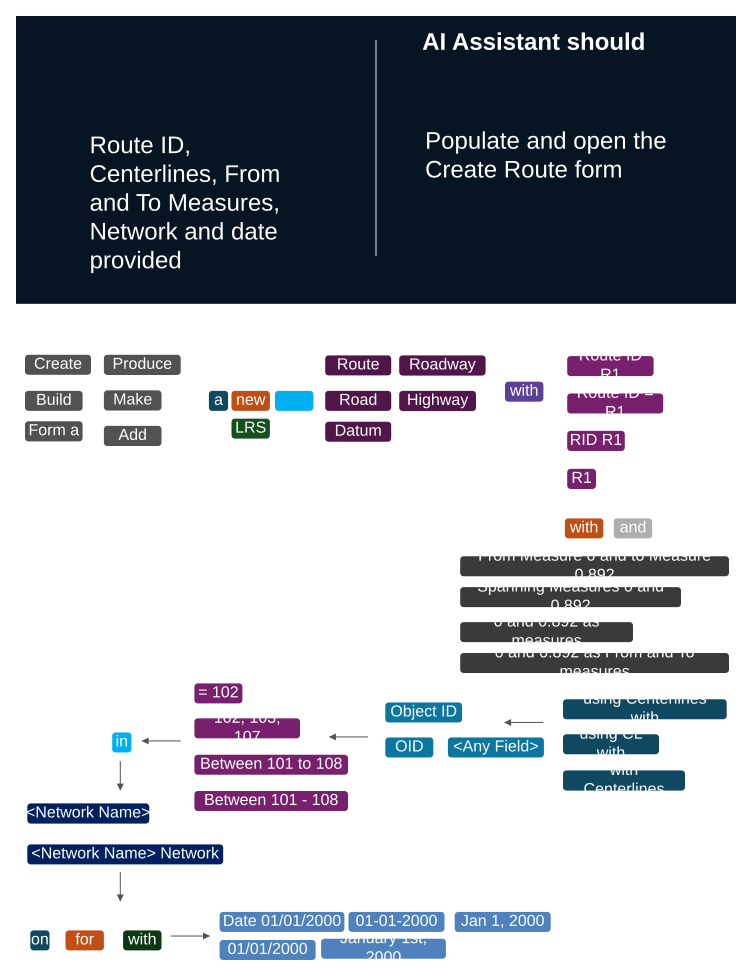

### TC-U19 — All inputs provided — form populated and opened <!-- src: LLM · slide 22 · AI Assistant should -->
- **Group:** AI Assistant should
- **Case:** Route ID, Centerlines, From and To Measures, Network and date provided
- **Expected Result:** Populate and open the Create Route form

### TC-U20 — All inputs provided — form populated and opened <!-- src: LLM · slide 23 · AI Assistant should -->
- **Group:** AI Assistant should
- **Case:** Route ID, Centerlines, From and To Measures, Network and date provided
- **Expected Result:** Populate and open the Create Route form

### TC-U21 — All inputs provided but LR license not available <!-- src: LLM · slide 24 · AI Assistant should -->
- **Group:** AI Assistant should
- **Case:** Route ID, Centerlines, From and To Measures, Network and date provided but LR license not available
Route ID = R1
<Network Name> Network
Between 101 to 108
Between 101 - 108

From Measure 0 and to Measure 0.892
Spanning Measures 0  and 0.892
0 and 0.892 as measures
0 and 0.892 as From and To measures
January 1st, 2000
- **Expected Result:** Not show any info

[figure: Route · Road · Datum · Roadway · Highway · Create · Produce · Form a · Make · Build · Add · Route ID R1 · RID R1 · with · R1 · <Network Name> · in · using Centerlines with · using CL with · with Centerlines · Object ID · OID · = 102 · 102, 103, 107 · …]

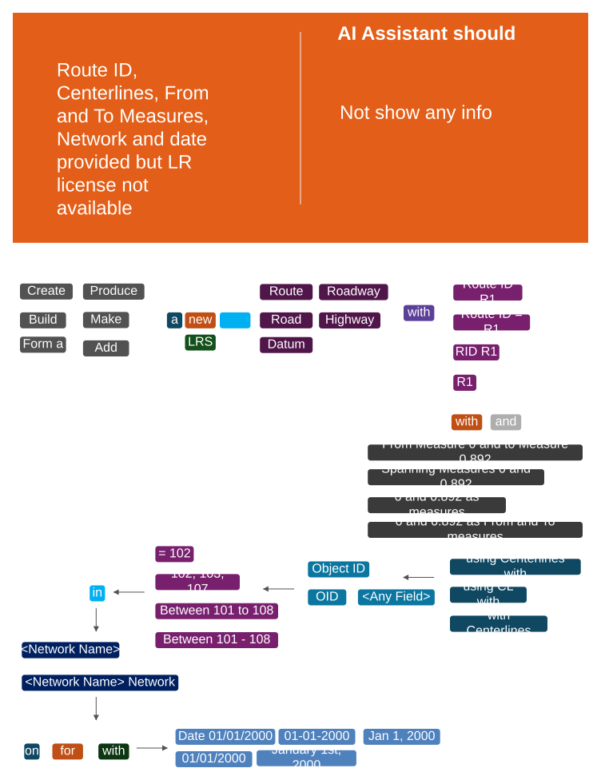

### TC-U22 — Invalid measures (From = To, From > To) <!-- src: LLM · slide 25 · AI Assistant should -->
- **Group:** AI Assistant should
- **Case:** Route ID, Centerlines, From and To Measures, Network and date provided but From Measure = To Measure, From Measure > Measure
Route ID = R1
<Network Name> Network
Between 101 to 108
Between 101 - 108

From Measure 0 and to Measure 0.892
Spanning Measures 0  and 0.892
0 and 0.892 as measures
0 and 0.892 as From and To measures
January 1st, 2000
- **Expected Result:** Inform the user about the issue with the measures and ask them to provide valid measures

[figure: Route · Road · Datum · Roadway · Highway · Create · Produce · Form a · Make · Build · Add · Route ID R1 · RID R1 · with · R1 · <Network Name> · in · using Centerlines with · using CL with · with Centerlines · Object ID · OID · = 102 · 102, 103, 107 · …]

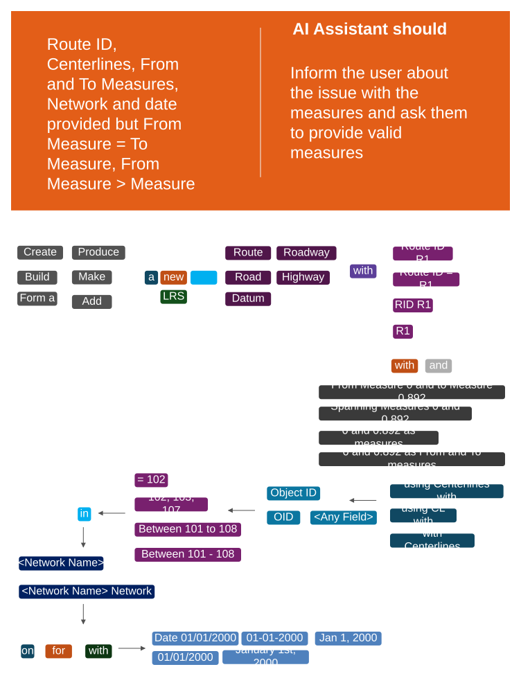

### TC-U23 — Invalid centerline OIDs (text, same ids, incorrect clause etc.) <!-- src: LLM · slide 26 · AI Assistant should -->
- **Group:** AI Assistant should
- **Case:** Route ID, Centerlines, From and To Measures, Network and date provided but centerlines OIDs are invalid (text, same ids, incorrect clause etc.)
Route ID = R1
<Network Name> Network
Between 101 to 108
Between 101 - 108

From Measure 0 and to Measure 0.892
Spanning Measures 0  and 0.892
0 and 0.892 as measures
0 and 0.892 as From and To measures
January 1st, 2000
- **Expected Result:** Inform the user about the issue with the CL OIDs and ask them to provide valid IDs

[figure: Route · Road · Datum · Roadway · Highway · Create · Produce · Form a · Make · Build · Add · Route ID R1 · RID R1 · with · R1 · <Network Name> · in · using Centerlines with · using CL with · with Centerlines · Object ID · OID · = 102 · 102, 103, 107 · …]

### TC-U24 — Route ID already exists for the provided date <!-- src: LLM · slide 27 · AI Assistant should -->
- **Group:** AI Assistant should
- **Case:** Route ID, Centerlines, From and To Measures, Network and date provided but Route ID already exists for the provided date
Route ID = R1
<Network Name> Network
Between 101 to 108
Between 101 - 108

From Measure 0 and to Measure 0.892
Spanning Measures 0  and 0.892
0 and 0.892 as measures
0 and 0.892 as From and To measures
January 1st, 2000
- **Expected Result:** Inform that the route already exists and a new route ID should be provided

[figure: Route · Road · Datum · Roadway · Highway · Create · Produce · Form a · Make · Build · Add · Route ID R1 · RID R1 · with · R1 · <Network Name> · in · using Centerlines with · using CL with · with Centerlines · Object ID · OID · = 102 · 102, 103, 107 · …]

### TC-U25 — Object IDs do not exist <!-- src: LLM · slide 28 · AI Assistant should -->
- **Group:** AI Assistant should
- **Case:** Route ID, Centerlines and Network provided but the object IDs do not exist
Route ID = R1

<Network Name> Network
Between 101 to 108
Between 101 - 108
- **Expected Result:** Provide a message that the object IDs do not exist

[figure: Route · Road · Datum · Roadway · Highway · Create · Produce · Form a · Make · Build · Add · with · Route ID R1 · RID R1 · R1 · <Network Name> · in · using Centerlines with · using CL with · with Centerlines · Object ID · OID · = 102 · 102, 103, 107 · …]

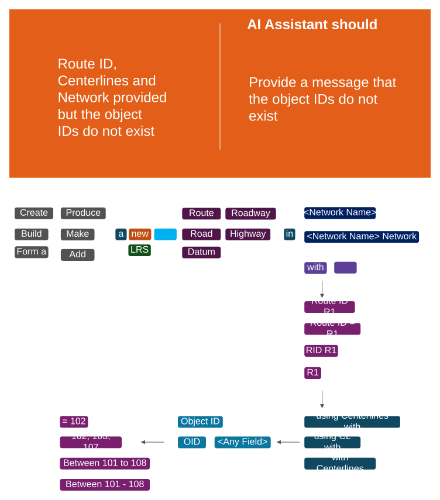

### TC-U26 — Object IDs cause non monotonic route <!-- src: LLM · slide 29 · AI Assistant should -->
- **Group:** AI Assistant should
- **Case:** Route ID, Centerlines and Network provided but the object IDs cause non monotonic route
Route ID = R1

<Network Name> Network
Between 101 to 108
Between 101 - 108

If Route Name is not configured for the Network, then consider this as Route ID
- **Expected Result:** Provide a message that chosen centerlines will result in a non monotonic route, so provide new centerlines

[figure: Route · Road · Datum · Roadway · Highway · Create · Produce · Form a · Make · Build · Add · with · Route ID R1 · RID R1 · R1 · <Network Name> · in · using Centerlines with · using CL with · with Centerlines · Object ID · OID · = 102 · 102, 103, 107 · …]

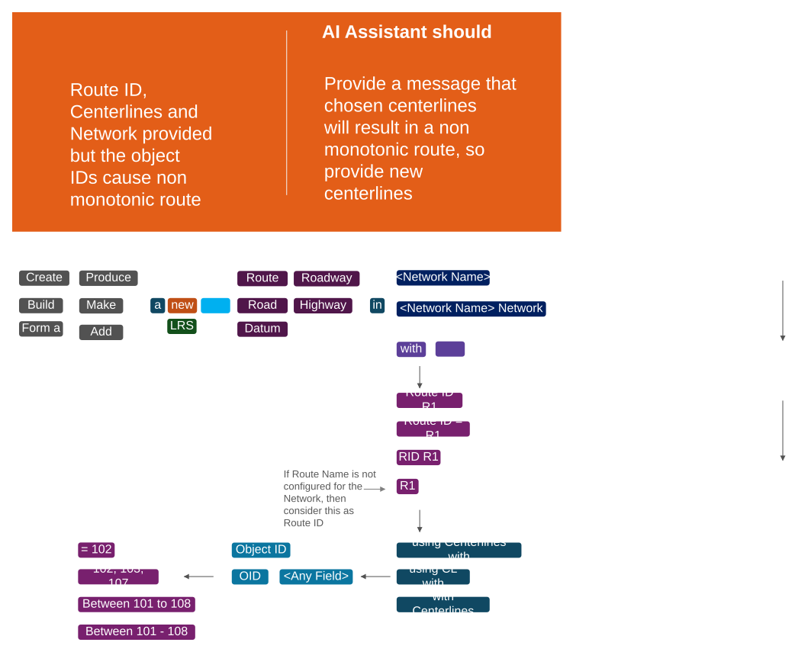

### TC-U27 — Date has issues (incorrect format or unfixable typo) <!-- src: LLM · slide 30 · AI Assistant should -->
- **Group:** AI Assistant should
- **Case:** Route ID, Centerlines, From and To Measures, Network and date provided but the date has issues such as From Date is in incorrect format or typo that can’t be fixed by AI
Route ID = R1
<Network Name> Network
Between 101 to 108
Between 101 - 108

From Measure 0 and to Measure 0.892
Spanning Measures 0  and 0.892
0 and 0.892 as measures
0 and 0.892 as From and To measures
January 1st, 2000
- **Expected Result:** Ask to provide a valid date

[figure: Route · Road · Datum · Roadway · Highway · Create · Produce · Form a · Make · Build · Add · Route ID R1 · RID R1 · with · R1 · <Network Name> · in · using Centerlines with · using CL with · with Centerlines · Object ID · OID · = 102 · 102, 103, 107 · …]

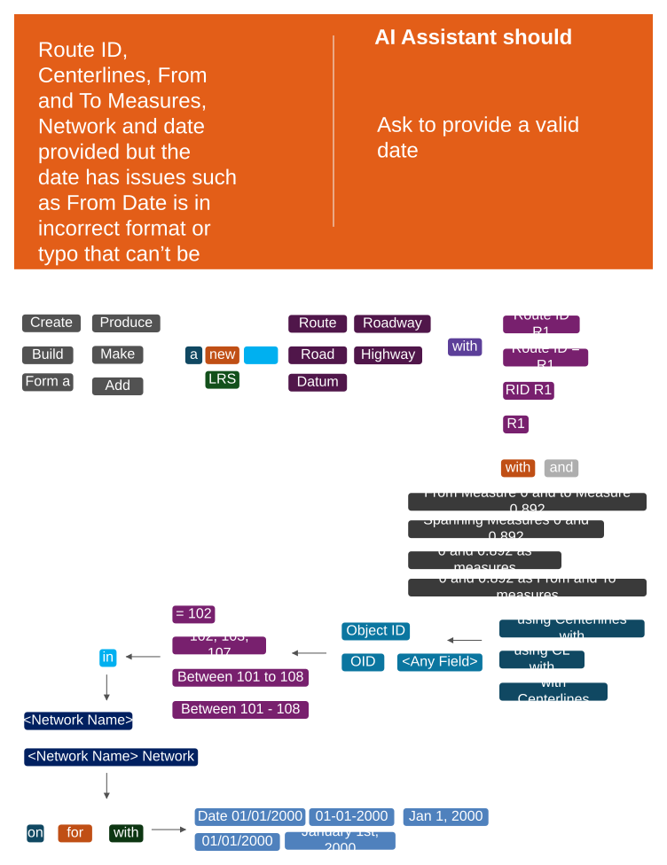

### TC-U28 — More than one issue exists for the inputs <!-- src: LLM · slide 31 · AI Assistant should -->
- **Group:** AI Assistant should
- **Case:** Route ID, Centerlines, From and To Measures, Network and date provided but more than one issue exists for the inputs
Route ID = R1
<Network Name> Network
Between 101 to 108
Between 101 - 108

From Measure 0 and to Measure 0.892
Spanning Measures 0  and 0.892
0 and 0.892 as measures
0 and 0.892 as From and To measures
January 1st, 2000
- **Expected Result:** List all the issues that are causing errors in the create route form one at a time.

[figure: Route · Road · Datum · Roadway · Highway · Create · Produce · Form a · Make · Build · Add · Route ID R1 · RID R1 · with · R1 · <Network Name> · in · using Centerlines with · using CL with · with Centerlines · Object ID · OID · = 102 · 102, 103, 107 · …]

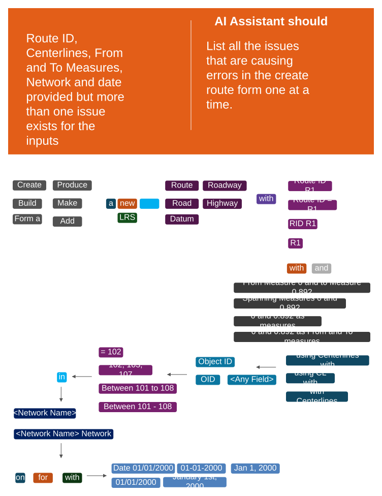

### TC-U29 — Network and Centerline FC are not present in the map <!-- src: LLM · slide 32 · AI Assistant should -->
- **Group:** AI Assistant should
- **Case:** Route ID, Centerlines, From and To Measures, Network and date provided but Network and Centerline FC are not present in the map
Route ID = R1
<Network Name> Network
Between 101 to 108
Between 101 - 108

From Measure 0 and to Measure 0.892
Spanning Measures 0  and 0.892
0 and 0.892 as measures
0 and 0.892 as From and To measures
January 1st, 2000
- **Expected Result:** Ask the user to add the Network and the Centerline FC to the map.

[figure: Route · Road · Datum · Roadway · Highway · Create · Produce · Form a · Make · Build · Add · Route ID R1 · RID R1 · with · R1 · <Network Name> · in · using Centerlines with · using CL with · with Centerlines · Object ID · OID · = 102 · 102, 103, 107 · …]

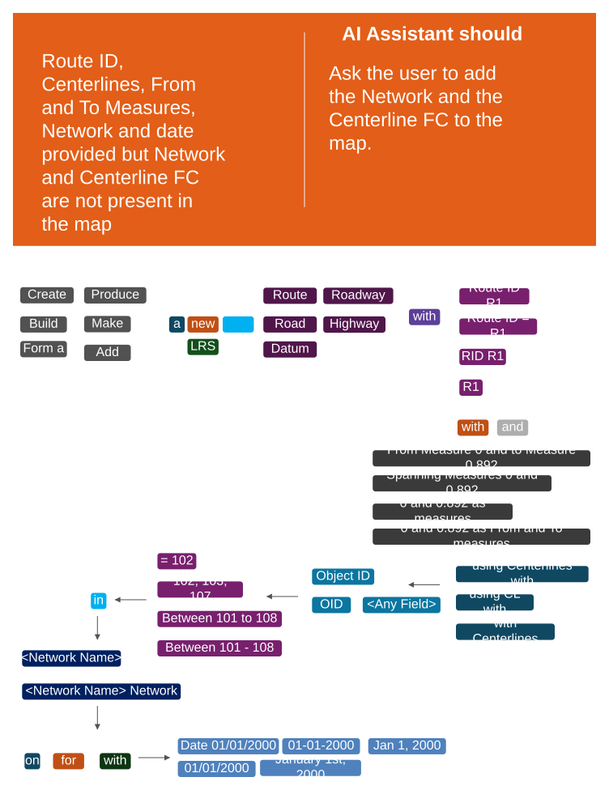

### TC-U30 — Access and activate Create Route in the Location Referencing tab <!-- src: LLM · slide 33 · Help Prompts bullet 1 -->
- **Group:** Help Prompts
- **Case:** How do I access and activate the Create Route in the Location Referencing tab?

### TC-U31 — Prerequisite steps before creating a route in an LRS network <!-- src: LLM · slide 33 · Help Prompts bullet 2 -->
- **Group:** Help Prompts
- **Case:** What are the prerequisite steps before creating a route in an LRS network?

### TC-U32 — Difference between ‘Create Route’ Geoprocessing and editing tools <!-- src: LLM · slide 33 · Help Prompts bullet 3 -->
- **Group:** Help Prompts
- **Case:** Explain the difference between the ‘Create Route’ Geoprocessing and editing tools.

### TC-U33 — License required to create a route in ArcGIS Pro <!-- src: LLM · slide 33 · Help Prompts bullet 4 -->
- **Group:** Help Prompts
- **Case:** What license is required to create a route in ArcGIS Pro?

### TC-U34 — Feature classes required on the map before creating a route <!-- src: LLM · slide 33 · Help Prompts bullet 5 -->
- **Group:** Help Prompts
- **Case:** What feature classes must be present on the map before creating a route?

### TC-U35 — Role of centerline features in route creation <!-- src: LLM · slide 33 · Help Prompts bullet 6 -->
- **Group:** Help Prompts
- **Case:** What is the role of centerline features in route creation?

### TC-U36 — Importance of non-overlapping centerlines in the LRS data model <!-- src: LLM · slide 33 · Help Prompts bullet 7 -->
- **Group:** Help Prompts
- **Case:** Why is it important to ensure centerlines do not overlap in the LRS data model?

### TC-U37 — Adding centerline features to the centerline feature class <!-- src: LLM · slide 33 · Help Prompts bullet 8 -->
- **Group:** Help Prompts
- **Case:** How can centerline features be added to the centerline feature class?

### TC-U38 — Where is the Create Route tool located in ArcGIS Pro? <!-- src: LLM · slide 33 · Help Prompts bullet 9 -->
- **Group:** Help Prompts
- **Case:** Where is the Create Route tool located in ArcGIS Pro?

### TC-U39 — Effect of digitization direction on route calibration <!-- src: LLM · slide 33 · Help Prompts bullet 10 -->
- **Group:** Help Prompts
- **Case:** How does the direction of digitization affect route calibration?

### TC-U40 — How is the To Measure value calculated by default? <!-- src: LLM · slide 33 · Help Prompts bullet 11 -->
- **Group:** Help Prompts
- **Case:** How is the To Measure value calculated by default?

### TC-U41 — Full workflow of creating a route using the LRS Create Route tool <!-- src: LLM · slide 33 · Help Prompts bullet 12 -->
- **Group:** Help Prompts
- **Case:** Walk me through the full workflow of creating a route using the LRS Create Route tool.

### TC-U42 — Start and end measure calculation in the create route tool <!-- src: LLM · slide 33 · Help Prompts bullet 13 -->
- **Group:** Help Prompts
- **Case:** How are the start and end measures calculated for a route in the create route tool?

### TC-U43 — Providing own from and to measures in the create route tool <!-- src: LLM · slide 33 · Help Prompts bullet 14 -->
- **Group:** Help Prompts
- **Case:** Can I provide my own from and to measures for the route in the create route tool?

### TC-U44 — Use of the ‘Calculate’ buttons in the create route tool <!-- src: LLM · slide 33 · Help Prompts bullet 15 -->
- **Group:** Help Prompts
- **Case:** What is the use of the ‘Calculate’ buttons in the create route tool?

### TC-U45 — Changing the order of the centerlines in the create route tool <!-- src: LLM · slide 33 · Help Prompts bullet 16 -->
- **Group:** Help Prompts
- **Case:** How do I change the order of the centerlines in the create route tool?

### TC-U46 — Adding additional attributes for the route when creating it <!-- src: LLM · slide 33 · Help Prompts bullet 17 -->
- **Group:** Help Prompts
- **Case:** How do I add additional attributes for the route when creating it?

### TC-U47 — Copying ‘additional attributes’ from an existing route <!-- src: LLM · slide 33 · Help Prompts bullet 18 -->
- **Group:** Help Prompts
- **Case:** Can I copy ‘additional attributes’ from an existing route when creating a route?

### TC-U48 — What the ‘flip the direction of the centerlines’ tool does <!-- src: LLM · slide 33 · Help Prompts bullet 19 -->
- **Group:** Help Prompts
- **Case:** What does the ‘flip the direction of the centerlines’ tool do in the create route workflow?

### TC-U49 — Is the flipped centerline direction permanent after edits are saved? <!-- src: LLM · slide 33 · Help Prompts bullet 20 -->
- **Group:** Help Prompts
- **Case:** Is the flipped direction of the centerline permanent once the create route tool is run and edits saved?

### TC-U50 — Troubleshoot: The Create Route tool is greyed out <!-- src: LLM · slide 33 · Help Prompts bullet 21 -->
- **Group:** Help Prompts
- **Case:** Troubleshoot: The Create Route tool is greyed out. What is preventing me from using it?

### TC-U51 — Create Route in a branch-versioned enterprise environment <!-- src: LLM · slide 33 · Help Prompts bullet 22 -->
- **Group:** Help Prompts
- **Case:** How does the Create Route tool function in a branch-versioned enterprise environment?

### TC-U52 — Capabilities required to allow route creation via feature services <!-- src: LLM · slide 33 · Help Prompts bullet 23 -->
- **Group:** Help Prompts
- **Case:** What capabilities must an LRS network be published with to allow route creation via feature services?

### TC-U53 — Potential conflicts or errors during route creation and resolution <!-- src: LLM · slide 33 · Help Prompts bullet 24 -->
- **Group:** Help Prompts
- **Case:** Explain potential conflicts or errors that might arise during a route creation and how to resolve them.

### TC-U54 — Managing route time slices for historical route data <!-- src: LLM · slide 33 · Help Prompts bullet 25 -->
- **Group:** Help Prompts
- **Case:** How does the LRS Create Route tool manage route time slices for historical route data?

### TC-U55 — Creating a route with a complex shape such as a roundabout <!-- src: LLM · slide 33 · Help Prompts bullet 26 -->
- **Group:** Help Prompts
- **Case:** Explain the process for creating a route that has a complex shape such as a roundabout.

### TC-U56 — Creating a route with a complex shape such as a lollipop <!-- src: LLM · slide 33 · Help Prompts bullet 27 -->
- **Group:** Help Prompts
- **Case:** Explain the process for creating a route that has a complex shape such as a lollipop.

### TC-U57 — Creating a route with a complex shape such as an alpha <!-- src: LLM · slide 33 · Help Prompts bullet 28 -->
- **Group:** Help Prompts
- **Case:** Explain the process for creating a route that has a complex shape such as an alpha.

### TC-U58 — Creating a route with a complex shape such as an infinity <!-- src: LLM · slide 33 · Help Prompts bullet 29 -->
- **Group:** Help Prompts
- **Case:** Explain the process for creating a route that has a complex shape such as an infinity.

### TC-U59 — Creating a route with a complex shape such as a branch <!-- src: LLM · slide 33 · Help Prompts bullet 30 -->
- **Group:** Help Prompts
- **Case:** Explain the process for creating a route that has a complex shape such as a branch.

### TC-U60 — Undo or correct a route created by mistake <!-- src: LLM · slide 33 · Help Prompts bullet 31 -->
- **Group:** Help Prompts
- **Case:** What if I Create Route a route by mistake? How do I undo or correct the action?

### TC-U61 — Official documentation link for the LRS Create Route tool <!-- src: LLM · slide 33 · Help Prompts bullet 32 -->
- **Group:** Help Prompts
- **Case:** Provide the official documentation link for the LRS Create Route tool in ArcGIS Pro.

### TC-U62 — User role and permissions to execute the tool in an enterprise GDB <!-- src: LLM · slide 33 · Help Prompts bullet 33 -->
- **Group:** Help Prompts
- **Case:** What user role and permissions are necessary to execute the LRS Create Route tool in an enterprise geodatabase?

### TC-U63 — Handling routes that overlap temporally (different time slices) <!-- src: LLM · slide 33 · Help Prompts bullet 34 -->
- **Group:** Help Prompts
- **Case:** How does the LRS Create Route tool handle routes that overlap temporally (have different time slices)?

### TC-U64 — Effect of Create Route on centerline geometry and its direction <!-- src: LLM · slide 33 · Help Prompts bullet 35 -->
- **Group:** Help Prompts
- **Case:** How does the LRS Create Route operation affect the underlying centerline geometry and its direction?

### TC-U65 — Reconcile and post workflow after an LRS create route edit <!-- src: LLM · slide 34 · Help Prompts bullet 1 -->
- **Group:** Help Prompts
- **Case:** Guide me on the reconcile and post workflow after an LRS create route edit in a versioned environment.

### TC-U66 — Common data integrity issues after using the Create Route tool <!-- src: LLM · slide 34 · Help Prompts bullet 2 -->
- **Group:** Help Prompts
- **Case:** What are common data integrity issues to check for after using the LRS Create Route tool?

### TC-U67 — Effect on routes that have equation points defined <!-- src: LLM · slide 34 · Help Prompts bullet 3 -->
- **Group:** Help Prompts
- **Case:** How does the Create Route tool affect routes that have equation points defined?

### TC-U68 — Core LRS data model concepts in the context of creating a route <!-- src: LLM · slide 34 · Help Prompts bullet 4 -->
- **Group:** Help Prompts
- **Case:** Explain the core LRS data model concepts (routes, lines, networks) in the context of creating a route.

### TC-U69 — Impact on external systems integrating via feature services <!-- src: LLM · slide 34 · Help Prompts bullet 5 -->
- **Group:** Help Prompts
- **Case:** How does the LRS Create Route tool impact external systems that integrate with the LRS data via feature services?

### TC-U70 — Managing locking conflicts in a multi-user environment <!-- src: LLM · slide 34 · Help Prompts bullet 6 -->
- **Group:** Help Prompts
- **Case:** How do I manage conflicts related to locking when the LRS Create Route tool is used in a multi-user environment?

### TC-U71 — Role of conflict prevention on branch-versioned data <!-- src: LLM · slide 34 · Help Prompts bullet 7 -->
- **Group:** Help Prompts
- **Case:** Explain the role of conflict prevention during an LRS route creation on branch-versioned data.

### TC-U72 — Permissions needed for an editor to use the Create Route tool <!-- src: LLM · slide 34 · Help Prompts bullet 8 -->
- **Group:** Help Prompts
- **Case:** What specific permissions are needed for an editor to use the Create Route tool in an enterprise geodatabase?

### TC-U73 — Relationship between centerline digitization and route direction <!-- src: LLM · slide 34 · Help Prompts bullet 9 -->
- **Group:** Help Prompts
- **Case:** What is the relationship between the centerline direction of digitization and the resulting LRS route direction?

### TC-U74 — Considerations for 3D or vertical routes when creating a route <!-- src: LLM · slide 34 · Help Prompts bullet 10 -->
- **Group:** Help Prompts
- **Case:** What are the considerations for 3D or vertical routes when creating a route?

### TC-U75 — Warning for physical gaps and how to disable it <!-- src: LLM · slide 34 · Help Prompts bullet 11 -->
- **Group:** Help Prompts
- **Case:** A warning appears if creating a route introduces physical gaps, and how can I disable it?

### TC-U76 — Verifying route direction before confirming the creation <!-- src: LLM · slide 34 · Help Prompts bullet 12 -->
- **Group:** Help Prompts
- **Case:** How can I verify the direction of a route in the LRS network before confirming the creation?

### TC-U77 — Checklist of all parameters in the Create Route pane <!-- src: LLM · slide 34 · Help Prompts bullet 13 -->
- **Group:** Help Prompts
- **Case:** Provide a checklist of all parameters in the Create Route pane and explain what each one does.

### TC-U78 — Significance of the ‘Start Date' field <!-- src: LLM · slide 34 · Help Prompts bullet 14 -->
- **Group:** Help Prompts
- **Case:** Explain the significance of the ‘Start Date' field when using the LRS Create Route tool.

### TC-U79 — Adding an ‘End Date’ to the route just created <!-- src: LLM · slide 34 · Help Prompts bullet 15 -->
- **Group:** Help Prompts
- **Case:** How do I add an ‘End Date’ to the route I just created?

### TC-U80 — Adding centerlines not present in the centerline feature class <!-- src: LLM · slide 34 · Help Prompts bullet 16 -->
- **Group:** Help Prompts
- **Case:** How do I add centerlines when I do not have them in the centerline feature class when creating a route?

### TC-U81 — Bringing centerlines from a CAD drawing to create a route <!-- src: LLM · slide 34 · Help Prompts bullet 17 -->
- **Group:** Help Prompts
- **Case:** How do I bring centerlines from a CAD drawing to create a route?

### TC-U82 — 3D length calculation when centerlines have z values <!-- src: LLM · slide 34 · Help Prompts bullet 18 -->
- **Group:** Help Prompts
- **Case:** How is the 3D length calculated when creating a route when the centerlines have z values?

### TC-U83 — Calibration direction when centerlines are in opposite direction <!-- src: LLM · slide 34 · Help Prompts bullet 19 -->
- **Group:** Help Prompts
- **Case:** If the centerlines are in opposite direction when creating a route, then what is the direction of calibration of the resultant route that gets created?

### TC-U84 — How do I create a route with gaps? <!-- src: LLM · slide 34 · Help Prompts bullet 20 -->
- **Group:** Help Prompts
- **Case:** How do I create a route with gaps?

### TC-U85 — Defining measures at the start and end points of a gap <!-- src: LLM · slide 34 · Help Prompts bullet 21 -->
- **Group:** Help Prompts
- **Case:** Can I define the measures at the start and end points of a gap when creating a route?

### TC-U86 — Impact of gap calibration rules when creating a gapped route <!-- src: LLM · slide 34 · Help Prompts bullet 22 -->
- **Group:** Help Prompts
- **Case:** What is the impact of the gap calibration rules when creating a gapped route?
