# Create Route in Line Network and Multifield Network with Additional Attributes Pro AI Assistant Test Plan

| Field | Value |
| --- | --- |
| **Doc** | 86 · Test Plan · Pro |
| **Product** | Roads & Highways · Pipeline Referencing |
| **Release** | — |
| **Issues** | — |
| **Source** | [CreateRoute_AI_Assistant_LineNetwork_TestPlan.pptx](<https://esriis.sharepoint.com/sites/LocationReferencing/Shared%20Documents/General/Test%20Plans/CreateRoute_AI_Assistant_LineNetwork_TestPlan.pptx>) |
| **People** | author Rahul Rakshit · PE — · dev — |
| **Edited** | 2025-12-30 19:27 by Praveen Kumar |
| **Extracted** | 2026-09-04 · lane xmlstrip · format 3.0 · prompt v2.0.2 |
| **Keywords** | route creation · line network · multifield network · additional attributes · create route form · ai assistant · complex routes |
| **Tools** | Create Route |

## Summary

Test plan for creating routes in line network and multifield network environments using the Pro AI Assistant. Covers scenarios with additional attributes, multiple centerlines, complex route shapes, and validation of input parameters. Includes workflows for handling missing information, mandatory fields, and versioned environments.

## Related documents

<!-- related:begin -->
- [Create Route AI Assistant Test Plan](<https://esriis.sharepoint.com/sites/lrsworkspace/LRS Doc Index/Test Plans/create-route-ai-assistant.md>) — similar text 0.51 · 3 title words · 3 filename words · same kind/surface/folder <!-- rel:98 s=7.741 -->
- [Realign Route AI Assistant Test Plan](<https://esriis.sharepoint.com/sites/lrsworkspace/LRS Doc Index/Test Plans/7067-realign-route-ai-assistant-rh-apr-2026-02.md>) — similar text 0.46 · 2 title words · 1 filename word · same kind/surface/folder <!-- rel:51 s=5.738 -->
- [Realign Route AI Assistant Test Plan](<https://esriis.sharepoint.com/sites/lrsworkspace/LRS Doc Index/Test Plans/7067-realign-route-ai-assistant-rh-apr-v1.md>) — similar text 0.52 · 2 title words · 1 filename word · same kind/surface/folder <!-- rel:80 s=5.683 -->
- [Retire Route – Pro AI Assistant Test Plan](<https://esriis.sharepoint.com/sites/lrsworkspace/LRS%20Doc%20Index/Test%20Plans/7066-retire-route-pro-ai-assistant.md>) — similar text 0.21 · 3 title words · 1 filename word · same kind/surface/folder <!-- rel:4 s=4.876 -->
- [ArcGIS Pro AI Assistant: Realign Route Subsequent Panes Test Plan](<https://esriis.sharepoint.com/sites/lrsworkspace/LRS Doc Index/Test Plans/pro-ai-assistant-realign-route-subsequent-panes.md>) — similar text 0.18 · 3 title words · 1 filename word · same kind/surface/folder <!-- rel:50 s=4.682 -->
<!-- related:end -->

<!-- docs:begin -->
## Esri documentation

[Create a route](https://doc.esri.com/en/arcgis-pro/latest/help/production/roads-highways/create-a-new-route.html) · [Complex scenarios for route calibration](https://doc.esri.com/en/arcgis-pro/latest/help/production/roads-highways/complex-scenarios-for-route-calibration.html)
<!-- docs:end -->

---

## Overview

### Slide 1 <!-- slide 1 -->

Create Route in Line Network and Multifield Network with additional attributes Pro AI Assistant Test plan

### Slide 2 <!-- slide 2 -->

Note

- Test only in feature services
- Test on RH data with multi field route id with and without additional attributes
- Test on APR Data with line network with and without additional attributes
- Test with PostMile Network with and without additional attributes
- Projected and unprojected data with 3D
- Use multiple centerlines to create a route
- Test with spelling mistakes
- Gapped and multiple gapped route creation
- Complex routes such as lollipops, loops, alpha, branch, infinity with all the variations using multiple centerlines and gaps
- Centerlines that are not always in the same direction
- Test with local scene
- Verify that the create route form only opens when no error exists in the input parameters
- Test with fields having domains, subtypes, attribute rules and contingent values

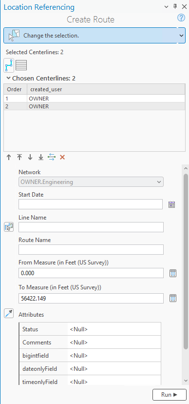
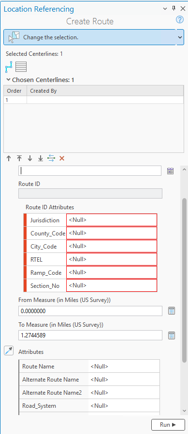

### Slide 3 — Workflow for Network <!-- slide 3 -->

Multifiled routeid Network
Is the linename provided
Has all the field  info
Open create route pane with info
Ask the user for linename
Open create route pane with info
Ask the user for missing field info
Mandatory additional attributes
Ask for the mandatory field info
Has all the info

[figure: Line Network · Network · Yes · No]

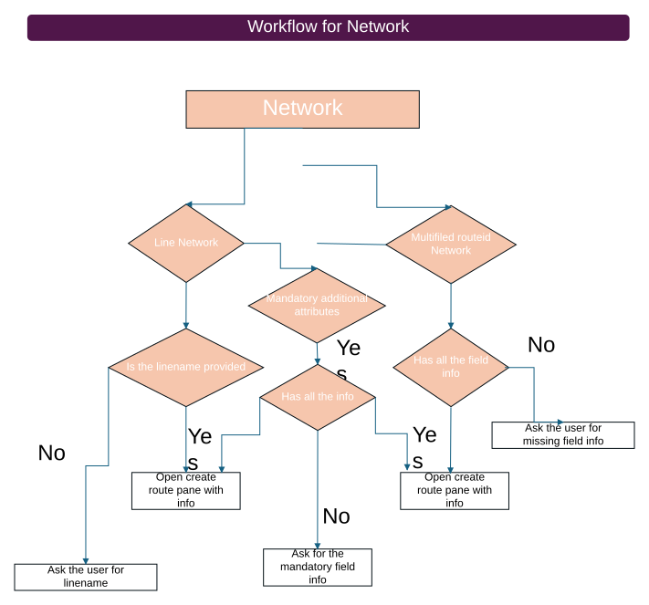
[connections: Network → Line Network · Line Network → Is the linename provided · Is the linename provided → Open create route pane with info · Is the linename provided → Ask the user for linename · Line Network → Mandatory additional attributes]

## Test Cases

### TC-U01 — Route Name, Centerlines, Network, Line Name and Date provided <!-- src: LLM · slide 4 · AI Assistant should -->
- **Case:** Route Name, Centerlines Network*, Line Name and Date provided
Route Name = R1

  <Network Name> Network
January 1st, 2000
Populate and open the Create Route form
Between 101 to 108
Between 101 - 108
- **Expected Result:** Populate and open the Create Route form

[figure: Route · Road · Roadway · Highway · Create · Produce · Form a · Make · Build · Add · with · Route Name R1 · Rname R1 · R1 · <Network Name> · in · on · for · Date 01/01/2000 · 01/01/2000 · 01-01-2000 · Jan 1, 2000 · using Centerlines with · using CL with · …]

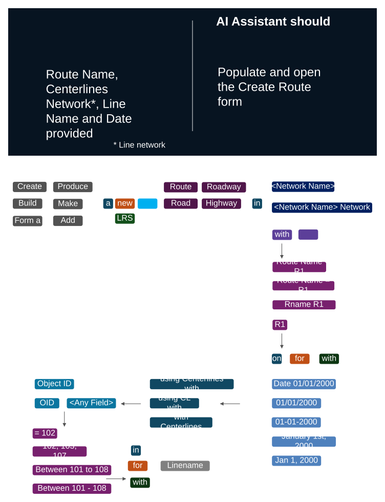

### TC-U02 — Route Name, Centerlines, Network and Date provided but no line name <!-- src: LLM · slide 5 · AI Assistant should ask for -->
- **Case:** Route Name, Centerlines, Network*, and Date provided but no line name
Route Name = R1

  <Network Name> Network
January 1st, 2000
Between 101 to 108
Between 101 - 108

[figure: Route · Road · Roadway · Highway · Create · Produce · Form a · Make · Build · Add · with · Route Name R1 · Rname R1 · R1 · <Network Name> · in · on · for · Date 01/01/2000 · 01/01/2000 · 01-01-2000 · Jan 1, 2000 · Line Name · using Centerlines with · …]

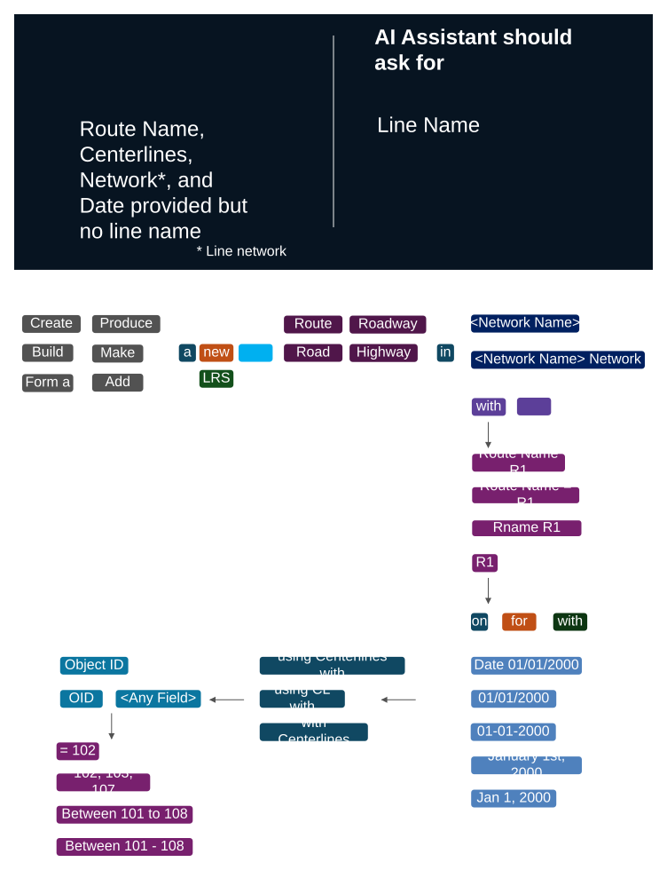

### TC-U03 — Route Name, Centerlines, Network, Line Name and Date provided <!-- src: LLM · slide 6 · AI Assistant should -->
- **Group:** Multi field network
- **Case:** Route Name, Centerlines Network*, Line Name and Date provided

  <Network Name> Network
January 1st, 2000
Populate and open the Create Route form
Between 101 to 108
Between 101 - 108
- **Expected Result:** Populate and open the Create Route form

[figure: Route · Road · Roadway · Highway · Create · Produce · Form a · Make · Build · Add · with · Field1 = 320 · Field2= 001 · <Network Name> · in · on · for · Date 01/01/2000 · 01/01/2000 · 01-01-2000 · Jan 1, 2000 · using Centerlines with · using CL with · with Centerlines · …]

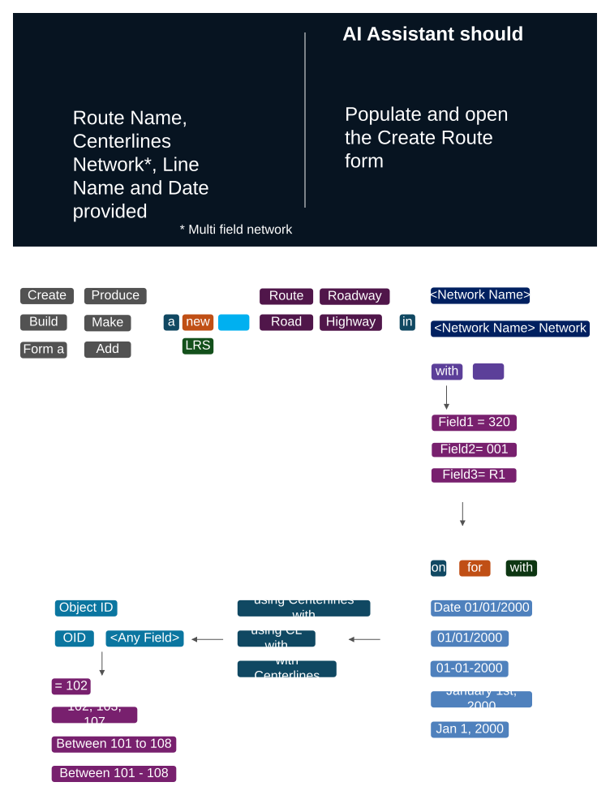

### TC-U04 — Route Name, Centerlines, Network and Date provided but no field info <!-- src: LLM · slide 7 · AI Assistant should ask for -->
- **Group:** Multi filed network
- **Case:** Route Name, Centerlines, Network*, and Date provided but no field info

  <Network Name> Network
January 1st, 2000
The missing field info
Between 101 to 108
Between 101 - 108
- **Expected Result:** The missing field info

[figure: Route · Road · Roadway · Highway · Create · Produce · Form a · Make · Build · Add · with · <Network Name> · in · on · for · Date 01/01/2000 · 01/01/2000 · 01-01-2000 · Jan 1, 2000 · using Centerlines with · using CL with · with Centerlines · Object ID · OID · …]

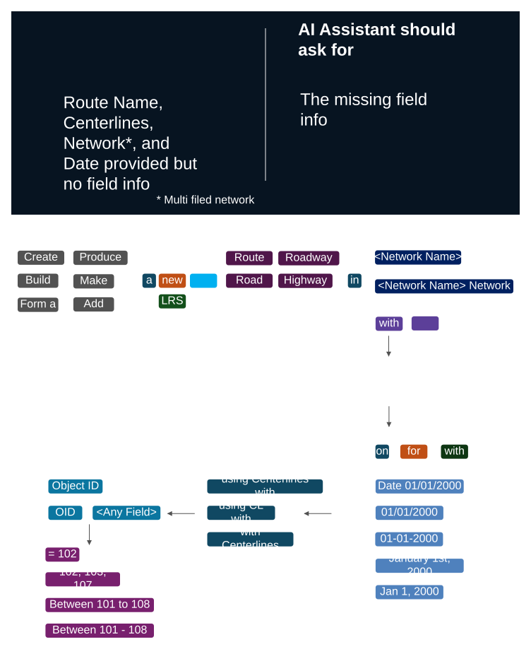

### TC-U05 — Route ID, Centerlines Network, additional attributes and Date provided <!-- src: LLM · slide 8 · AI Assistant should -->
- **Case:** Route ID, Centerlines Network, additional attributes and Date provided
Route ID = R1

  <Network Name> Network
January 1st, 2000
Populate and open the Create Route form
Between 101 to 108
Between 101 - 108
- **Expected Result:** Populate and open the Create Route form

[figure: Route · Road · Roadway · Highway · Create · Produce · Form a · Make · Build · Add · with · Route ID R1 · RID R1 · <Network Name> · in · on · for · Date 01/01/2000 · 01/01/2000 · 01-01-2000 · Jan 1, 2000 · using Centerlines with · using CL with · with Centerlines · …]

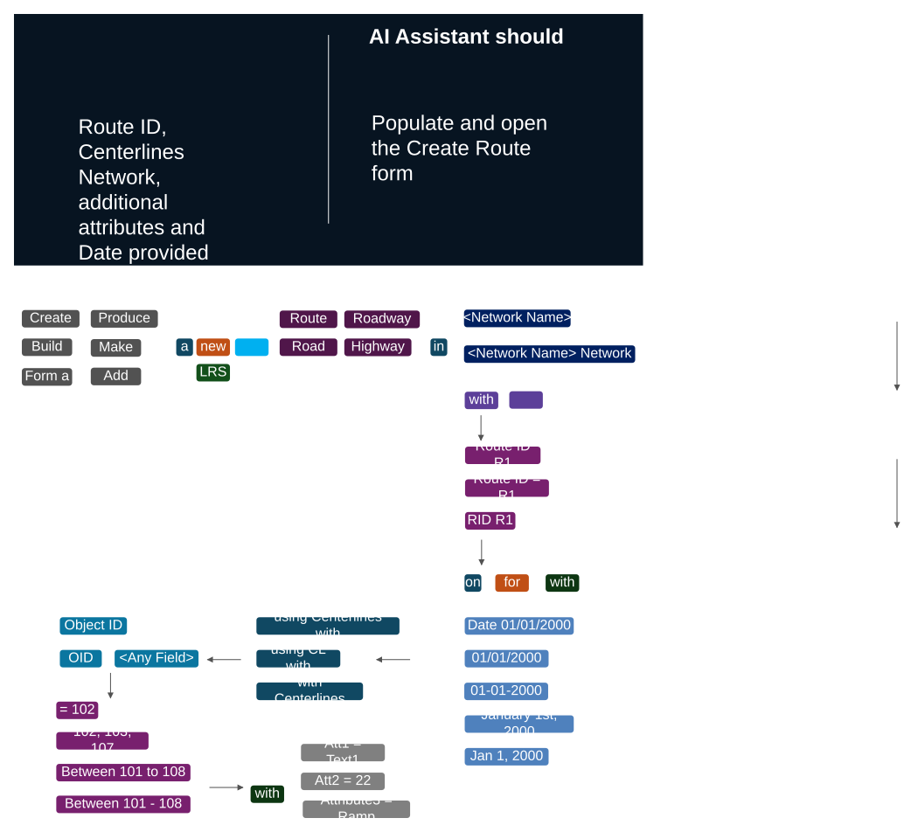

### TC-U06 — Route ID, Centerlines Network and Date provided with no additional attributes <!-- src: LLM · slide 9 · AI Assistant should ask for -->
- **Group:** Network has some mandatory additional attribute fields
- **Case:** Route ID, Centerlines Network and Date provided with no additional attributes
Route ID = R1

  <Network Name> Network
January 1st, 2000
For mandatory additional attributes
Between 101 to 108
Between 101 - 108
- **Expected Result:** For mandatory additional attributes

[figure: Route · Road · Roadway · Highway · Create · Produce · Form a · Make · Build · Add · with · Route ID R1 · RID R1 · <Network Name> · in · on · for · Date 01/01/2000 · 01/01/2000 · 01-01-2000 · Jan 1, 2000 · using Centerlines with · using CL with · with Centerlines · …]

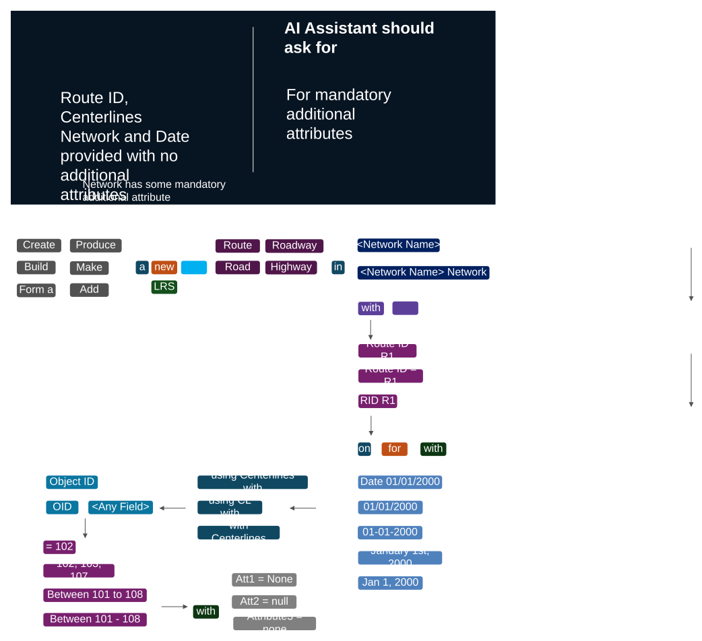

### TC-U07 — Route Name, Centerlines, Network, Line Name and Date provided <!-- src: LLM · slide 10 · AI Assistant should -->
- **Group:** Line network with additional attributes
- **Case:** Route Name, Centerlines Network*, Line Name and Date provided
Route Name = R1

  <Network Name> Network
January 1st, 2000
Populate and open the Create Route form
Between 101 to 108
Between 101 - 108
- **Expected Result:** Populate and open the Create Route form

[figure: Route · Road · Roadway · Highway · Create · Produce · Form a · Make · Build · Add · with · Route Name R1 · Rname R1 · R1 · <Network Name> · in · on · for · Date 01/01/2000 · 01/01/2000 · 01-01-2000 · Jan 1, 2000 · using Centerlines with · using CL with · …]

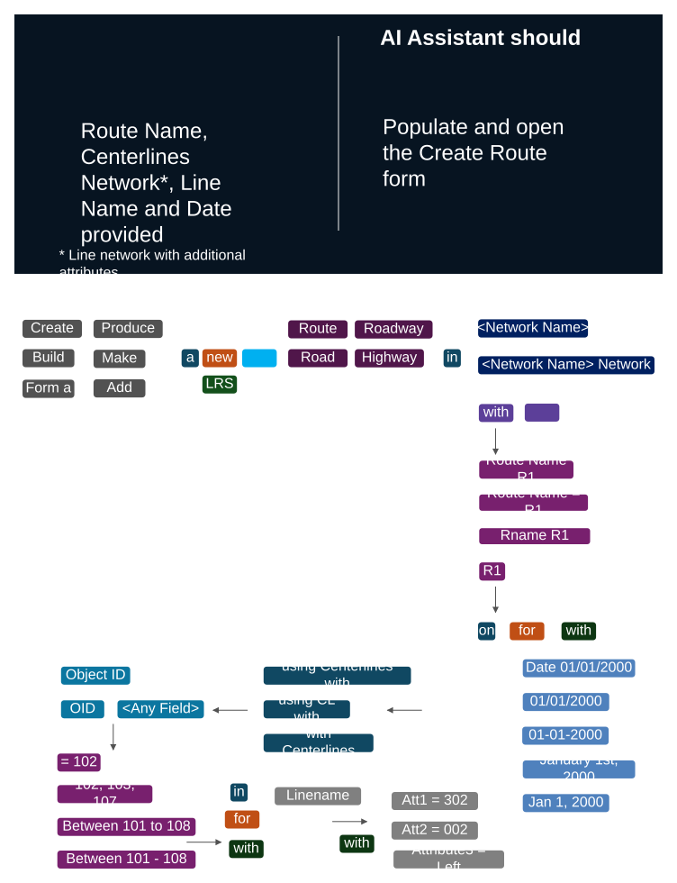

### TC-U08 — Route Name, Centerlines, Network, Line Name and Date provided <!-- src: LLM · slide 11 · AI Assistant should -->
- **Group:** Multi field network with additional attributes
- **Case:** Route Name, Centerlines Network*, Line Name and Date provided

  <Network Name> Network
January 1st, 2000
Populate and open the Create Route form
Between 101 to 108
Between 101 - 108
- **Expected Result:** Populate and open the Create Route form

[figure: Route · Road · Roadway · Highway · Create · Produce · Form a · Make · Build · Add · with · Field1 = 320 · Field2= 001 · <Network Name> · in · on · for · Date 01/01/2000 · 01/01/2000 · 01-01-2000 · Jan 1, 2000 · using Centerlines with · using CL with · with Centerlines · …]

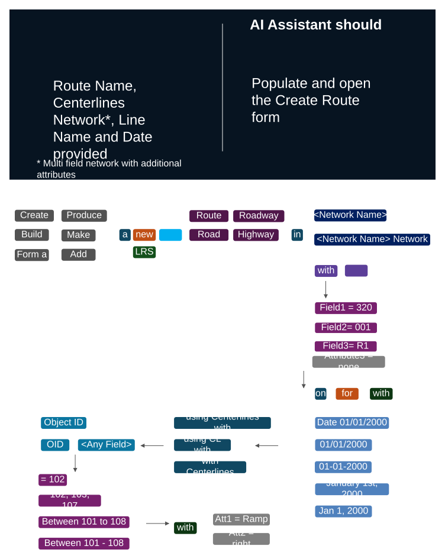

### TC-U09 — Route Name \ Line Name already exists for the provided date <!-- src: LLM · slide 12 · AI Assistant should -->
- **Case:** Route ID, Centerlines, From and To Measures, Network and date provided but Route Name \ Line Name already exists for the provided date
Inform that the route already exists and a new route name \ line name should be provided
<Network Name> Network
Between 101 to 108
Between 101 - 108

  From Measure 0 and to Measure 0.892
Spanning Measures 0  and 0.892
0 and 0.892 as measures
0 and 0.892 as From and To measures
January 1st, 2000
Route Name = R1
- **Expected Result:** Inform that the route already exists and a new route name \ line name should be provided

[figure: Route · Road · Roadway · Highway · Create · Produce · Form a · Make · Build · Add · with · R1 · <Network Name> · in · using Centerlines with · using CL with · with Centerlines · Object ID · OID · = 102 · 102, 103, 107 · <Any Field> · a · new · …]

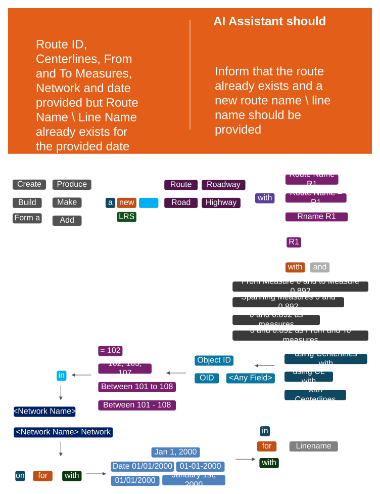

### TC-U10 — Route ID, Centerlines, Measures, Network, Field info, Line name and date <!-- src: LLM · slide 13 · AI Assistant should -->
- **Case:** Route ID, Centerlines, From and To Measures, Network, Field info, Line name and date provided
- **Expected Result:** Populate and open the Create Route form

### TC-U11 — Help Prompts <!-- src: LLM · slide 14 · Help Prompts -->
- **Group:** Help Prompts
- **Steps:**
  1. How do I access and activate the Create Route in the line network of pipeline Referencing?
  2. What are the prerequisite steps before creating a route in a line network?
  3. What are the prerequisite steps before creating a route in a multifield network ?
  4. What is line network?
  5. What is multi field network?
  6. Walk me through the full workflow of creating a route using the LRS Create Route tool for a line network.
  7. How are the start and end measures calculated for a route in the create route tool in line network?
  8. How do I create a route and change the order of the routes in the line network?
  9. How do I add additional attributes for the route when creating it?
  10. Can I copy ‘additional attributes’ from an existing route when creating a route?
  11. How to provide filed info for a multi filed network?
  12. How to provide a line name while creating a route?
  13. Guide me on the creating route workflow in line network in a versioned environment?
  14. Guide me on create route workflow with multifield routeid network ?
  15. Guide me on providing non lrs attributes while creating a route ?
