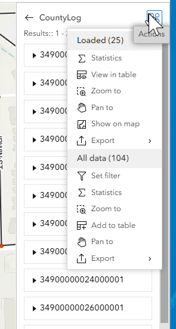

# Data Action Support for Add Line Event Widget – Test Plan

|   |   |
| --- | --- |
| **Kind** | Test Plan · Experience Builder |
| **Release** | — |
| **Product** | Roads & Highways · Pipeline Referencing |
| **Issue** | [Beijing-R-D-Center/ExperienceBuilder-Web-Extensions#17675](https://devtopia.esri.com/Beijing-R-D-Center/ExperienceBuilder-Web-Extensions/issues/17675) |
| **Source** | [DataActionAddLine_testplan.pptx](<https://esriis.sharepoint.com/sites/LocationReferencing/Shared%20Documents/General/Test%20Plans/DataActionAddLine_testplan.pptx>) |
| **Edited** | 2024-02-15 22:21 by Claire Wang |
| **Extracted** | 2026-09-04 · lane `xmlstrip` |

<!-- metadata
```yaml
title: "Data Action Support for Add Line Event Widget – Test Plan"
source_file: "DataActionAddLine_testplan.pptx"
source_url: "https://esriis.sharepoint.com/sites/LocationReferencing/Shared%20Documents/General/Test%20Plans/DataActionAddLine_testplan.pptx"
doc_id: 431
doc_kind: "Test Plan"
surface: "Experience Builder"
doc_revision: ""
target_release: ""
pe: "Claire Wang"
dev: "Dan"
author: "Lakshmi Ananthanarayanan"
last_edited_by: "Claire Wang"
last_edited: "2024-02-15T22:21:11Z"
extracted: 2026-09-04
extraction_lane: xmlstrip
prompt_version: "v2.0.2"
keywords: ["add line event", "data action", "experience builder", "route", "measure", "event attribute set", "spanning event", "non spanning event", "network table", "validation"]
tools: ["Add Line Event widget", "LRS Search", "LRS Identify", "network Table"]
products: ["Roads & Highways", "Pipeline Referencing"]
issues: ["Beijing-R-D-Center/ExperienceBuilder-Web-Extensions#17675"]
related: [{"doc":375,"file":"data-action-support-for-lrs-identify-widget-test-plan__doc375.md","s":6.845},{"doc":414,"file":"data-action-support-for-merge-event-widget-test-plan__doc414.md","s":6.52},{"doc":455,"file":"experience-builder-add-single-line-event-widget__doc455.md","s":6.087},{"doc":138,"file":"add-line-event-widget__doc138.md","s":4.817},{"doc":480,"file":"user-story-add-line-event-multiple__doc480.md","s":3.972}]
```
-->

## Summary

Test plan for the Add Line Event widget's data action support in Experience Builder. Covers verification of data action behavior in Search, Identify, and network Table widgets, including positive and negative test cases for route and event population, measure handling, and validation logic. Includes automation and documentation update notes.

## Related documents

<!-- related:begin -->
- [Data Action Support for LRS Identify widget– Test Plan](<https://esriis.sharepoint.com/sites/lrsworkspace/LRS Doc Index/Test Plans/data-action-support-for-lrs-identify-widget-test-plan__doc375.md>) — similar text 0.55 · 3 title words · 2 filename words · same kind/surface/pe/folder <!-- rel:375 -->
- [Data Action Support for Merge Event widget– Test Plan](<https://esriis.sharepoint.com/sites/lrsworkspace/LRS Doc Index/Test Plans/data-action-support-for-merge-event-widget-test-plan__doc414.md>) — similar text 0.53 · 4 title words · 2 filename words · same kind/surface/folder <!-- rel:414 -->
- [Experience Builder: Add Single Line Event Widget](<https://esriis.sharepoint.com/sites/lrsworkspace/LRS Doc Index/User Stories/experience-builder-add-single-line-event-widget__doc455.md>) — similar text 0.25 · 4 title words · 2 filename words · same surface/dev/folder <!-- rel:455 -->
- [Add Line Event widget](<https://esriis.sharepoint.com/sites/lrsworkspace/LRS Doc Index/Other/add-line-event-widget__doc138.md>) — similar text 0.25 · 4 title words · 2 filename words · same surface <!-- rel:138 -->
- [User Story Add Line Event (Multiple)](<https://esriis.sharepoint.com/sites/lrsworkspace/LRS Doc Index/User Stories/user-story-add-line-event-multiple__doc480.md>) — similar text 0.24 · 3 title words · 2 filename words · same surface <!-- rel:480 -->
<!-- related:end -->

<!-- docs:begin -->
## Esri documentation

[Split a centerline by measure](https://doc.esri.com/en/arcgis-pro/latest/help/production/roads-highways/split-a-centerline-by-measure.html)

_No page matched:_ [Add Line Event widget](https://www.google.com/search?q=%22Add%20Line%20Event%20widget%22+site%3Adoc.esri.com) · [LRS Search](https://www.google.com/search?q=%22LRS%20Search%22+site%3Adoc.esri.com) · [LRS Identify](https://www.google.com/search?q=%22LRS%20Identify%22+site%3Adoc.esri.com) · [network Table](https://www.google.com/search?q=%22network%20Table%22+site%3Adoc.esri.com)
<!-- docs:end -->

---

## Slide 1 — Data Action Support for Add Line Event widget– Test Plan

https://devtopia.esri.com/Beijing-R-D-Center/ExperienceBuilder-Web-Extensions/issues/17675

PE: Claire Wang
Dev: Dan

### Notes

When Add Line is launched, does it add the default event/attribute set? ----- what if default event is registered to network1 and the route chosen is network2?
	choose the first for the selected network
Populate date is today’s date? If the route is retired, it will error out in validation
After Add Line is launched and populated via data action, is changing the event or hitting reset still able to clear populated values? – spanning/nonspanning chance is low – if they want to switch they know the pane is cleared

## Slide 2

Data:

- Add data action into LRS Search, LRS Identify and network Table that opens Add Line Widget and populate desired fields
- Test with RH, APR, and APRUN
- Test with different types (single/multiple) and events (spanning/non-spanning for single) being default in Add Line
- Test with other widgets that don’t have our data actions and make sure our actions don’t appear
- Verify the tool aligns with any other Experience Builder specifications/requirements
- 508/i18n
- Test with various themes
- Test in different browsers (chrome and firefox) and layouts
Automation
Follow the same way we automate other widgets
Documentation

- Update documentation for the LRS widgets to mention these available data actions and how they will copy data into the new widget being launched
- Update screenshots as needed

## Slide 3


Verification:

- Data action should automatically be there in the widgets (Search; Identify; Table) without needing to manually configure
- Upon launching Add Line, the event/attribute set to add is the default configured for Add Line or the last event/attribute set added via the pane, if selected network is the default network in Add Line
  - If the selected network is not the default network in Add Line, the Add Line widget should honor the selected network and show the first available event for the network
  - Type (Single/Multiple) will remain the last type they choose in the pane. The default type is not honored
- For Search, data action populates the route, measure, and date fields
  - If selected result has only one measure, provide options in data action pane to let users choose whether it will be the From or To Measure
  - If selected result has 2 measures, populate as From and To
  - If Add Line has a spanning event in the pane, both From and To Route boxes are enabled and populated with the selected route. For non line network or non-spanning event, To Route is grey and shows From Route
- For Identify, data action populates the route, measure, and date fields from the displayed location
  - As Identify only returns 1 measure, always provide an option to let users choose whether it will be the From or To Measure
  - If Add Line has a spanning event as default, use the selected route for both From and To Routes


## Slide 4

Verification:

- For network table, data action populates the route and date fields. Do not populate measure fields
  - If network is non-line and multiple routes are selected, data action is disabled
  - If network is line and multiple routes are selected, check the number of route selected and if they are on the same line
    - If only 2 routes are selected and they are on the same line with the same date range, when Add Line is opened with a spanning event, populate the two route IDs/names as the From and To (lowest line order would be the from)
      - If Add Line already has a non-spanning event in the pane, selecting 2 routes and launching data action will use the route with the lower line order to populate From and To Route boxes
      - If network only has non-spanning events, users can still select 2 routes and launch Add Line, but the route with the lower line order will populate both From and To Route boxes
    - If more than 2 routes are selected, data action is disabled
    - If 2 routes are records of the same route but they have different dates, data action is disabled
    - If 2 routes are in the same line with different dates, data action is always enabled. Add Line tool will then validate the dates
Check if data action is configurable/will be enhancement for returned tables------------
In table returned from other widgets, records can have a measure or 2 measures:

  - 1 measure – provide From/To options
  - 2 measures – populate from and to measures
  - If 2 routes in the same line are selected, use the lower line order’s route’s from measure and then the second route’s to measure



## Slide 5

Verification:

- Dates are populated under the following logic, and validation is done in Add Line
  - From Search, the start and end dates of the searched route are populated.
  - From Identify, the start and end dates of the identified route are populated.
  - From Table, use the start and end date of the route (or the route with a lower line order if 2 routes in the same line are selected)
- If selected routes’ network does not have event or its events are not in map, data action is disabled
- If Add Line widget is already open, overwrite whatever is populated
  - This includes all the existing Route/Measure/Date fields, as well as the event and network when 2 in the previous page applies
- After Add Line is launched and populated via data action, changing anything in the tool pane that will reset the pane still does what it is supposed to do (e.g. changing spanning event to a non spanning event; hitting reset button). Whether resetting to the default event/network or not does not matter when 2 in the previous page applies
  - Normally, all events are spanning in a line network, so users won’t worry about changing to a non spanning event will reset the fields
- Verify the measure populated in the Add Line pane is the same precision. This is in Eric’s queue

## Slide 6 — Positive cases (for Line network, mix Single-spanning, Single-non spanning, and Multiple being the default in Add Line)

  - LRS Search
  - Search returns 1 route with 1 measure. Choose it to be the To M
  - Search returns 2 routes and each with 1 measure. Before selecting a result, Data Action is disabled. Select one result to add line events, choose the measure to be From M, and add the event
  - Search returns 1 route with 2 measures. Verify they become From and To measures
  - Line - Search returns 1 route with 1 measure. Choose it to be the From M
  - Line with spanning event being the default in Add Line - Search returns 1 route with 2 measures. Verify the route serves for both From and To routes, and the measures become the From and To measures. Add the event
  - Searched network is not the default network in Add Line, so Add Line widget shows the first available event for the searched network and populate corresponding fields
  - LRS Identify
  - Identify a location. Choose it to be the To M and add the event
  - Line - Identify a location. Choose it to be the From M
  - Line with spanning event being the default in Add Line - Identify a location. Choose it to be the From M. Verify the route serves for both From and To routes, and only From Measure is populated. Change the To Route, type in a To Measure and add the event
  - Line with spanning event being the default in Add Line - Identify a location. Change event to a non spanning event in Add Line and verify the pane is reset

## Slide 7 — Positive cases

  - Table
  - Non-line – Select 1 route
  - Line – Select 1 route. Verify the route serves for both From and To Routes. No measure information is populated.
  - Line – Select 2 routes that are in the same line and have the same date range. Verify the route with the lower line order has become the From Route, and the other route has become the To Route. No measure information is populated. Add event
  - Selected line network is not the default network (nonline) in Add Line, so Add Line widget shows the first available event for line network and populate corresponding fields
    - If 1 route is selected, use the first available event as it being a spanning or non spanning event does not matter, and corresponding fields can be populated based on this 1 route
    - If 2 valid routes are selected, use the event layer staying in the pane or the default event if Add Line is opened for the first time. The event being a spanning or non spanning event does not matter

## Negative Cases (Data Action Not Shown) <!-- slide 8 -->

### In the Table of a Line Network

  - If Add Line widget is not configured
  - Search a Derived route
  - Search a route that does not have event registered to it
  - Search a route that does not have any of its registered event in the map
  - Identify a Derived route
  - Identify a route that does not have any of its registered event in the map
  - In the table of a non-line network, select multiple routes
**In the table of a line network, select 3 routes on the same line**
  - In the table of a line network, select 2 routes on different lines
  - In the table of a line network, select 2 time slices of the same route
  - In the point event table, select a point event and data action does not appear

Negative cases (cannot add event)

  - In table, select 2 routes in a line with non overlapping dates. Add Line widget will open but validation cannot pass on the dates. User do not want to use such routes.
