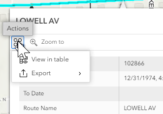

# Data Action Support for LRS Identify widget– Test Plan

|   |   |
| --- | --- |
| **Kind** | Test Plan · Experience Builder |
| **Release** | — |
| **Product** | Roads & Highways · Pipeline Referencing |
| **Issue** | [Beijing-R-D-Center/ExperienceBuilder-Web-Extensions#17939](https://devtopia.esri.com/Beijing-R-D-Center/ExperienceBuilder-Web-Extensions/issues/17939) |
| **Source** | [DataActionIdentify_testplan.pptx](<https://esriis.sharepoint.com/sites/LocationReferencing/Shared%20Documents/General/Test%20Plans/DataActionIdentify_testplan.pptx>) |
| **Edited** | 2024-05-07 20:49 by Claire Wang |
| **Extracted** | 2026-09-04 · lane `xmlstrip` |

<!-- metadata
```yaml
title: "Data Action Support for LRS Identify widget– Test Plan"
source_file: "DataActionIdentify_testplan.pptx"
source_url: "https://esriis.sharepoint.com/sites/LocationReferencing/Shared%20Documents/General/Test%20Plans/DataActionIdentify_testplan.pptx"
doc_id: 375
doc_kind: "Test Plan"
surface: "Experience Builder"
doc_revision: ""
target_release: ""
pe: "Claire Wang"
dev: "Prutha"
author: "Lakshmi Ananthanarayanan"
last_edited_by: "Claire Wang"
last_edited: "2024-05-07T20:49:39Z"
extracted: 2026-09-04
extraction_lane: xmlstrip
prompt_version: "v2.0.2"
keywords: ["data action", "identify widget", "add point", "add line", "non lrs data action", "spanning event", "event addition"]
tools: ["Add Point", "Add Line"]
products: ["Roads & Highways", "Pipeline Referencing"]
issues: ["Beijing-R-D-Center/ExperienceBuilder-Web-Extensions#17939"]
related: [{"doc":431,"file":"data-action-support-for-add-line-event-widget-test-plan__doc431.md","s":6.845},{"doc":414,"file":"data-action-support-for-merge-event-widget-test-plan__doc414.md","s":5.626},{"doc":859,"file":"lrs-identify-show-coordinates-in-results-experience-builder-widget-test-plan__doc859.md","s":3.984},{"doc":456,"file":"exb-search-by-referent-test-plan__doc456.md","s":3.84},{"doc":170,"file":"add-spanning-line-events-to-dominant-routes-in-experience-builder-test-plan__doc170.md","s":3.211}]
```
-->

## Summary

Test plan for adding data actions into the LRS Identify widget including nonLRS and LRS data actions. Covers verification of data action presence, configuration, functionality, and behavior with different event types and networks. Includes positive test cases and scenarios where LRS data actions should not appear.

## Related documents

<!-- related:begin -->
- [Data Action Support for Add Line Event Widget – Test Plan](<https://esriis.sharepoint.com/sites/lrsworkspace/LRS Doc Index/Test Plans/data-action-support-for-add-line-event-widget-test-plan__doc431.md>) — similar text 0.55 · 3 title words · 2 filename words · same kind/surface/pe/folder <!-- rel:431 -->
- [Data Action Support for Merge Event widget– Test Plan](<https://esriis.sharepoint.com/sites/lrsworkspace/LRS Doc Index/Test Plans/data-action-support-for-merge-event-widget-test-plan__doc414.md>) — similar text 0.49 · 3 title words · 2 filename words · same kind/surface/folder <!-- rel:414 -->
- [LRS Identify: Show Coordinates in Results Experience Builder Widget Test Plan](<https://esriis.sharepoint.com/sites/lrsworkspace/LRS%20Doc%20Index/Test%20Plans/lrs-identify-show-coordinates-in-results-experience-builder-widget-test-plan__doc859.md>) — similar text 0.23 · 2 title words · 1 filename word · same kind/surface/folder <!-- rel:859 -->
- [ExB Search By Referent – Test Plan](<https://esriis.sharepoint.com/sites/lrsworkspace/LRS Doc Index/Test Plans/exb-search-by-referent-test-plan__doc456.md>) — similar text 0.22 · 1 filename word · same kind/surface/pe/folder <!-- rel:456 -->
- [Add Spanning Line Events to Dominant Routes in Experience Builder – Test Plan](<https://esriis.sharepoint.com/sites/lrsworkspace/LRS Doc Index/Test Plans/add-spanning-line-events-to-dominant-routes-in-experience-builder-test-plan__doc170.md>) — similar text 0.19 · 1 filename word · same kind/surface/folder <!-- rel:170 -->
<!-- related:end -->

<!-- docs:begin -->
## Esri documentation

[Add calibration points](https://doc.esri.com/en/arcgis-pro/latest/help/production/roads-highways/add-calibration-points.html)

_No page matched:_ [Add Line](https://www.google.com/search?q=%22Add%20Line%22+site%3Adoc.esri.com)
<!-- docs:end -->

---

## Slide 1 — Data Action Support for LRS Identify widget– Test Plan

https://devtopia.esri.com/Beijing-R-D-Center/ExperienceBuilder-Web-Extensions/issues/17939

PE: Claire Wang
Dev: Prutha

## Slide 2

Data:

- Add data action into LRS Identify
  - 4 nonLRS data actions: view in table/export/pan to/zoom to
  - 3 LRS data actions: Add Point/Add Line (From)/Add Line (To)
- Test with RH, APR, and PoM (nonLRS only)
- Test adding different types (single/multiple) of events
- Test adding spanning and non-spanning for Add Line
- Verify the tool aligns with any other Experience Builder specifications/requirements
- 508/i18n
- Test with various themes
- Test in different browsers (chrome and firefox) and layouts
Automation
Follow the same way we automate other widgets
Documentation

- Update documentation for Add Point and Add Line widgets
- Update screenshots as needed

## Slide 3


Verification:

- Verify the 7 data actions exist in Identify dropdown
- Verify the 7 data actions can show/hide in configuration
- Briefly test the 4 nonLRS data actions and make sure they work as expected
- For LRS data actions:
  - Upon launching data action, the event/attribute set to add is the default configured for target widget or the last event/attribute set added via the target widget
    - If the selected network is not the default network in target widget, the target widget should honor the selected network and show the first available event for the network
    - Type (Single/Multiple) will remain the last type they choose in the pane. The default type is not honored
  - Date action populates the route, measure (from or to, chosen by user), and date fields from the displayed location
    - If Add Line has a spanning event in the pane, use the selected route for both From and To Routes
    - Use selected route’s start and end dates to populate the target widget
  - If Add Line widget is already open, overwrite whatever is populated
  - After Add Line is launched and populated via data action, changing anything in the tool pane that will reset the pane still does what it is supposed to do (e.g. changing spanning event to a non spanning event; hitting reset button).



## Slide 4 — Positive cases

  - nonLRS data actions
  - Identify a route and view in table
  - Identify a route and export
  - Pan to identified location
  - Zoom to identified location
  - LRS data actions
  - Identify a location. Launch Add Point widget
    - Network changes when current network in Add Point is not identified network
  - Identify a location on a route with time slices. Choose it to be Add Line (To)
  - Add spanning line event - Identify a location. Choose it to be the From M. Verify the route serves for both From and To routes, and only From Measure is populated. Change the To Route, type in a To Measure and add the event
  - With Add Point already populated, identify a location and launch data action. Verify the pane is overwritten

## Slide 5

LRS Data actions not shown

  - Identify a Derived route
  - Identify a route that does not have any of its registered event in the map
  - Disable Add Point data action in Identify widget and verify it no longer shows up
