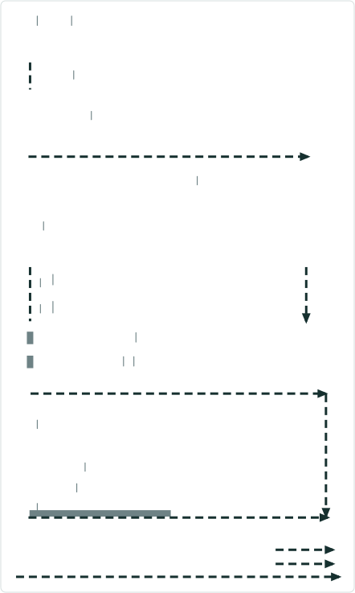

# Data Action Support for Merge Event widget– Test Plan

|   |   |
| --- | --- |
| **Kind** | Test Plan · Experience Builder |
| **Release** | — |
| **Product** | Roads & Highways · Pipeline Referencing |
| **Issue** | [Beijing-R-D-Center/ExperienceBuilder-Web-Extensions#17678](https://devtopia.esri.com/Beijing-R-D-Center/ExperienceBuilder-Web-Extensions/issues/17678) |
| **Source** | [DataActionMergeEvents_testplan2.pptx](<https://esriis.sharepoint.com/sites/LocationReferencing/Shared%20Documents/General/Test%20Plans/DataActionMergeEvents_testplan2.pptx>) |
| **Edited** | 2024-02-29 22:06 by Claire Wang |
| **Extracted** | 2026-09-04 · lane `xmlstrip` |

<!-- metadata
```yaml
title: "Data Action Support for Merge Event widget– Test Plan"
source_file: "DataActionMergeEvents_testplan2.pptx"
source_url: "https://esriis.sharepoint.com/sites/LocationReferencing/Shared%20Documents/General/Test%20Plans/DataActionMergeEvents_testplan2.pptx"
doc_id: 414
doc_kind: "Test Plan"
surface: "Experience Builder"
doc_revision: ""
target_release: ""
pe: "Claire"
dev: "Sharon"
author: "Lakshmi Ananthanarayanan"
last_edited_by: "Claire Wang"
last_edited: "2024-02-29T22:06:28Z"
extracted: 2026-09-04
extraction_lane: xmlstrip
prompt_version: "v2.0.2"
keywords: ["merge events", "data action", "line event", "event table", "experience builder", "validation"]
tools: ["Merge Events"]
products: ["Roads & Highways", "Pipeline Referencing"]
issues: ["Beijing-R-D-Center/ExperienceBuilder-Web-Extensions#17678"]
related: [{"doc":431,"file":"data-action-support-for-add-line-event-widget-test-plan__doc431.md","s":6.52},{"doc":375,"file":"data-action-support-for-lrs-identify-widget-test-plan__doc375.md","s":5.626},{"doc":437,"file":"merge-events-widget-test-plan__doc437.md","s":4.166},{"doc":455,"file":"experience-builder-add-single-line-event-widget__doc455.md","s":4.067},{"doc":291,"file":"support-overlapping-events-in-experience-builder-dynamic-segmentation-table__doc291.md","s":3.602}]
```
-->

## Summary

Test plan for adding a data action to LRS Line Event tables that opens the Merge Events widget and populates fields. Covers verification of data action behavior with different event types, widget interactions, and UI validation. Includes positive test cases and conditions where the data action should not appear.

## Related documents

<!-- related:begin -->
- [Data Action Support for Add Line Event Widget – Test Plan](<https://esriis.sharepoint.com/sites/lrsworkspace/LRS Doc Index/Test Plans/data-action-support-for-add-line-event-widget-test-plan__doc431.md>) — similar text 0.53 · 4 title words · 2 filename words · same kind/surface/folder <!-- rel:431 -->
- [Data Action Support for LRS Identify widget– Test Plan](<https://esriis.sharepoint.com/sites/lrsworkspace/LRS Doc Index/Test Plans/data-action-support-for-lrs-identify-widget-test-plan__doc375.md>) — similar text 0.49 · 3 title words · 2 filename words · same kind/surface/folder <!-- rel:375 -->
- [Merge Events Widget Test Plan](<https://esriis.sharepoint.com/sites/lrsworkspace/LRS Doc Index/Test Plans/merge-events-widget-test-plan__doc437.md>) — similar text 0.16 · 2 title words · 1 filename word · same kind/surface/folder <!-- rel:437 -->
- [Experience Builder: Add Single Line Event Widget](<https://esriis.sharepoint.com/sites/lrsworkspace/LRS Doc Index/User Stories/experience-builder-add-single-line-event-widget__doc455.md>) — similar text 0.26 · 2 title words · same surface/pe/folder <!-- rel:455 -->
- [Support Overlapping Events in Experience Builder Dynamic Segmentation Table](<https://esriis.sharepoint.com/sites/lrsworkspace/LRS Doc Index/User Stories/support-overlapping-events-in-experience-builder-dynamic-segmentation-table__doc291.md>) — similar text 0.10 · 1 title word · 1 filename word · same surface <!-- rel:291 -->
<!-- related:end -->

<!-- docs:begin -->
## Esri documentation

[Merge events](https://doc.esri.com/en/arcgis-pro/latest/help/production/roads-highways/merge-events.html) · [Event editing using the attribute table](https://doc.esri.com/en/arcgis-pro/latest/help/production/roads-highways/event-editing-using-the-attribute-table.html)
<!-- docs:end -->

---

## Slide 1 — Data Action Support for Merge Event widget– Test Plan

https://devtopia.esri.com/Beijing-R-D-Center/ExperienceBuilder-Web-Extensions/issues/17678

PE: Claire
Dev: Sharon

## Slide 2

Data:

- Add data action into LRS Line Event tables that opens Merge Events Widget and populate desired fields
- Test with RH, APR, and APRUN
- Test with different events (spanning/non-spanning)
- Test with APR events with Route Name configured and not configured
- Test with other widgets (e.g. a point event table) that don’t have this data action and make sure this action doesn’t appear
- Verify the tool aligns with any other Experience Builder specifications/requirements
- 508 (tabbing only)/i18n
- Test with various themes
- Test in different browsers (chrome and firefox) and layouts
Automation
Follow the same way we automate other widgets
Documentation

- Update documentation for the LRS widgets to mention these available data actions and how they will copy data into the new widget being launched
- Update screenshots as needed

## Slide 3

Verification:

- Data action should automatically be in the line event tables without needing to manually configure
- If only 1 event is selected, data action does not show. Selecting 2 or more events will enable data action
  - Any validation on measure/spatial adjacency and date will be done in the widget. Data action to launch Merge Events does not validate these
- Data action should populate the available fields in Merge Events
  - the event layer should be the table’s event layer
  - List selected events in Events to Merge table. Merge Events widget preserves the event that has the lowest calibration of the route/line, just like what Merge Events widget does
  - Not sure yet how Change Event Selection button interacts with table and data action – need to confirm when Merge Event is done
  - From measure = From measure of the first event in the increasing order of calibration of the route/line
  - To measure = To measure of the last event in the increasing order of calibration of the route/line
  - From Date is populated today’s date; To Date is null

## Slide 4



Verification:

- Copy the preserved event’s attributes to attribute table
- If Merge Events widget is already open, overwrite whatever is populated
  - This includes all the existing Event layer/selected events/Measures/Date/Event attributes
  - Re-selecting events from table and launching data action again will also overwrite Merge Events pane
- After Merge Events is launched and populated via data action, changing anything in the tool pane that will reset the pane still does what it is supposed to do (e.g. changing event layer)
- Verify values can still be changed in the editable fields


## Slide 5 — Positive cases

  - Select 2 events that can also pass Merge Events validation. Change some event values in attribute table in Merge Events widget. Merge events
  - Select 3 events and 1 event is retired. Verify data action is enabled, and Merge Events widget returns an error on the date.
  - Line - Manually populate some fields in Merge Events. Then, select 2 spanning events in line network and launch data action. Verify existing fields are overwritten.
Cases where Data action is not shown

  - Table is not line event
  - Only 1 line event is selected in a line event table
  - If event layer selected in table is not configured in the target widget, data action is not shown
