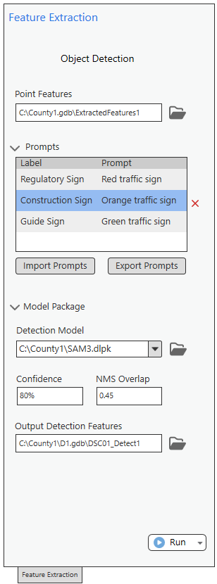

# Detect Objects Test Plan

|   |   |
| --- | --- |
| **Kind** | Test Plan · Pro |
| **Release** | — |
| **Product** | Roads & Highways |
| **Source** | [Detect_Objects_TestPlan.pptx](<https://esriis.sharepoint.com/sites/LocationReferencing/Shared%20Documents/General/Test%20Plans/Detect_Objects_TestPlan.pptx>) |
| **Edited** | 2026-07-13 14:13 by Rahul Rakshit |
| **Extracted** | 2026-09-04 · lane `xmlstrip` |

<!-- metadata
```yaml
title: "Detect Objects Test Plan"
source_file: "Detect_Objects_TestPlan.pptx"
source_url: "https://esriis.sharepoint.com/sites/LocationReferencing/Shared%20Documents/General/Test%20Plans/Detect_Objects_TestPlan.pptx"
doc_id: 10
doc_kind: "Test Plan"
surface: "Pro"
doc_revision: ""
target_release: ""
pe: ""
dev: ""
author: "Rahul Rakshit"
last_edited_by: "Rahul Rakshit"
last_edited: "2026-07-13T14:13:39Z"
extracted: 2026-09-04
extraction_lane: xmlstrip
prompt_version: "v2.0.2"
keywords: ["object detection", "feature extraction", "point feature class", "deduplication", "geolocation", "confidence", "non maximum suppression", "detection model"]
tools: ["Detect Object"]
products: ["Roads & Highways"]
issues: []
related: [{"doc":19,"file":"load-video-test-plan__doc19.md","s":4.836},{"doc":8,"file":"camera-calibration-test-plan__doc8.md","s":3.176},{"doc":34,"file":"reassign-route-ai-assistant-test-plan__doc34.md","s":2.857},{"doc":7,"file":"linear-referencing-attribution-in-linear-feature-extraction__doc7.md","s":2.153},{"doc":14,"file":"linear-referencing-attribution-in-feature-extraction__doc14.md","s":2.083}]
```
-->

## Summary

Test plan for the Detect Objects tool within the Feature Extraction panel, covering UI loading, input validation, prompt management, model loading, execution, output schema conformance, deduplication logic, geolocation, logging, and performance. Includes detailed field validation tests for input point feature classes and threshold parameters such as confidence and non-maximum suppression. Also covers licensing scenarios, error handling, and internationalization.

## Related documents

<!-- related:begin -->
- [Load Video Test Plan](<https://esriis.sharepoint.com/sites/lrsworkspace/LRS Doc Index/Test Plans/load-video-test-plan__doc19.md>) — similar text 0.29 · same kind/surface/folder <!-- rel:19 -->
- [Camera Calibration Test Plan](<https://esriis.sharepoint.com/sites/lrsworkspace/LRS Doc Index/Test Plans/camera-calibration-test-plan__doc8.md>) — similar text 0.25 · same kind/folder <!-- rel:8 -->
- [Reassign Route AI Assistant Test Plan](<https://esriis.sharepoint.com/sites/lrsworkspace/LRS Doc Index/Test Plans/reassign-route-ai-assistant-test-plan__doc34.md>) — similar text 0.07 · same kind/surface/folder <!-- rel:34 -->
- [Linear Referencing Attribution in Linear Feature Extraction](<https://esriis.sharepoint.com/sites/lrsworkspace/LRS Doc Index/User Stories/linear-referencing-attribution-in-linear-feature-extraction__doc7.md>) — similar text 0.07 · same surface <!-- rel:7 -->
- [Linear Referencing attribution in Feature Extraction](<https://esriis.sharepoint.com/sites/lrsworkspace/LRS Doc Index/User Stories/linear-referencing-attribution-in-feature-extraction__doc14.md>) — similar text 0.06 · same surface <!-- rel:14 -->
<!-- related:end -->

<!-- docs:begin -->
## Esri documentation

_No page matched:_ [Detect Object](https://www.google.com/search?q=%22Detect%20Object%22+site%3Adoc.esri.com)
<!-- docs:end -->

---

## Slide 1

## Slide 2


Draft UI



## Slide 3

| Section | Test | Result |
| --- | --- | --- |
| Tool Launch | Open Feature Extraction → Object Detection panel→ Detect Object | Panel loads without errors; all controls visible (Input Points FC, Prompts grid, Import/Export, Detection Model, Confidence, NMS, Output Geodatabase, Run) |
|  | Default values populated | Confidence and NMS show defaults; Output GDB defaults to project FGDB |
| Input Selection | Browse and select the frames point FC | Accepted |
|  | Browse and select a valid Output . gdb | Path accepted |
| Prompts Grid | Add one row: Regulatory Sign / Red traffic sign | Row persists in grid |
|  | Import a known-good CSV (2-3 prompts) | Grid populates correctly |
|  | Export prompts to CSV | File written; reopen matches grid |
| Model Package | Default Esri SAM3 DLPK auto-selected (if registered) | Dropdown shows Esri DLPK |
|  | Browse to local SAM3.dlpk on disk | Path accepted and validated as SAM3 |
| Thresholds | Set Confidence = 80% and NMS = 0.45 | Values accepted; no inline error |
| Run Execution | Click Run with ~100-frame fixture, 2 prompts, GPU available | Tool completes without crash; progress reported |
|  | Device auto-detect | Log indicates GPU used (or CPU if no GPU) |
|  | Completion summary displayed | Frames processed, detections created, skipped frames shown |
| Output FC | Output FC created in project FGDB | Point FC exists with correct name |
|  | Schema check | Fields present: OBJECTID, SHAPE, object_id , class_label , video_path , key_frame_index , key_bbox_norm , confidence, n_views , first_frame , last_frame , track_blob |
|  | Row count > 0 | At least one detection persisted |
|  | Spot-check one row | confidence in [0,1]; class_label matches a configured label; SHAPE is a valid geolocated point; object_id is a GUID |
| Logging | Log file generated | Contains: model used, device, confidence, NMS, prompts, totals |
|  | Counts reconcile | processed + skipped = total input frames |
| Negative Path | Run with a non-point FC as frames input | Tool blocks with actionable message; no crash |
|  | Run with invalid model path | Actionable error message; no crash |

Sanity Testing

## Slide 4

| Enterprise License with LR | Result |
| --- | --- |
| Professional Plus | Works |
| Professional | Works |
| Creator | Works |

| Downloaded Through | Result |
| --- | --- |
| Webpage | Works |
| Pro Package Manager | Works |
| Python Command | Works |

| Package Manger Active Environment | Result |
| --- | --- |
| Only Pro Default Environment | Works |
| Only Cloned Environment | Works |
| Installed in both Pro Default and Cloned Environments | Works |

| Enterprise License without LR or Indoors | Result |
| --- | --- |
| Professional Plus | Fails |
| Professional | Fails |
| Creator | Fails |

| Dataset | Hardware |
| --- | --- |
|  |  |
|  |  |
|  |  |

| Type of run | Frames | Result |
| --- | --- | --- |
| Small run | 100 frames | Completes without GPU; baseline recorded |
| Medium run | 10,000 frames | Stable memory; no leaks |
| Large run | 100,000 frames | Completes without OOM; progress reported |
| CPU vs GPU benchmark | 10,000 frames | GPU ≥ Nx faster; both produce same detections |

[figure: Licensing · Deep Learning Package · Datasets · Performance]

## Slide 5

Input Point FC: Schema Validation
The input point FC should accept a FC exactly with the fields shown in the graphic for the mandatory fields.

| Input Fields | Result |
| --- | --- |
| Number of fields do not match | Accepted if mandatory fields present |
| Name + Alias + Data Type + Number Format + Length does not match | Fail |
| Multiple fields missing | Fail |
| Duplicate Alias between two fields | Fail |

Not Required

## Slide 6

| Input | Output |
| --- | --- |
| Non-Feature Class | Error message |
| Non point FC | Error message |
| Non existing file | Error message |
| No value | Error message |
| Multiple FC files selected | Error message |
| Valid FC | File Accepted |
| Value provided > Next Page > Provide inputs in that Page > Back | The inputs provided for FC should remain same |
| Network location | Works |
| FGDB | Works |
| eGDB | Works |
| FS | Error message |
| Null Geometry | Frame Skipped + Error identifies OBJECTID of offending record |
| No Data exists in the FC | Tool doesn’t start |
| Unknown spatial reference | Error message |
| Duplicate Geometry for Every Frame | Warning indicating stationary or potentially invalid GPS source |
| File locked by another user | Error |
| Selection Set in the FC | Works |
| Definition Query in the FC | Works |
| Use OI dataset as input | Works |

Input Point FC

## Slide 7

Input Point FC

| Field | Test | Output |
| --- | --- | --- |
| Name | Field Missing | Error |
|  | Null | Error |
|  | No Value | Error |
|  | Value exceeds 255 characters | Error |
|  | Trailing spaces in name | Error |
|  | Leading spaces in name | Error |
|  | Unsupported characters in name | Error |
|  | Duplicate Name values | Error |
|  | All frames have same Name | Error |
|  | Duplicate Name but different ImagePath | Error |
|  | Duplicate Name and duplicate ImagePath | Error |
|  | Name values skip sequence unexpectedly | Error |
|  | Name sequence out of order | Error |
| Image Path | Field Missing | Error |
|  | Null | Error |
|  | No Value | Error |
|  | Video file missing | Error |
|  | Invalid path syntax | Error |
|  | Broken UNC path | Error |
|  | Unsupported Video extension | Error |
|  | Relative path when absolute required | Error |
|  | Corrupt Video file | Error |
|  | Duplicate ImagePath records | Error |
|  | Image path exceeds field length | Error |
|  | Image path not pointing to the same file | Error |
|  | Path contains trailing spaces | Error |
|  | Path contains leading spaces | Error |
|  | Video file extension Missing | Error |
|  | Authentication required; Protected network share | Error |
|  | File locked by another user | Error |

## Slide 8

Input Point FC

| Field | Test | Output |
| --- | --- | --- |
| Acquisition Date | Field Missing | Error |
|  | Null | Error |
|  | No Value | Error |
|  | AcquisitionDate contains non-date text | Error |
|  | AcquisitionDate contains special characters | Error |
|  | Values not in 6/21/2026 5:04:12 AM format: Missing components | Error |
|  | Invalid month: 2025-13-01 | Error |
|  | Invalid day: 2025-01-32 | Error |
|  | February 30th date: 2025-02-30 | Error |
|  | Leap year violation: 2025-02-29 | Error |
|  | Invalid date format: 2025/99/99 | Error |
|  | AcquisitionDate decreases between consecutive frames | Error |
|  | Negative elapsed time between frames | Error |
|  | Sudden jump in timestamps | Warning |
|  | Duplicate records with identical timestamps | Error |
|  | Significant mismatch with OffsetFromStart Timestamp: progression inconsistent with offset values | Warning |
|  | AcquisitionDate progression inconsistent with OffsetFromStart: Timestamp spacing doesn't match offsets | Warning |
|  | Verify timestamp increases as frame sequence advances |  |
|  | Verify timestamp intervals align with expected frame rate |  |
|  | Verify AcquisitionDate is consistent with video capture time and GPS progression |  |
|  | Verify duplicate timestamps do not create unintended deduplication or tracking issues |  |

## Slide 9

Input Point FC

| Field | Test | Output |
| --- | --- | --- |
| Camera Heading: Represents camera azimuth/ direction of travel. Typical range: 0°–360° 0° = North 90° = East 180° = South 270° = West | Field Missing | Error |
|  | Null | Error |
|  | No Value | Error |
|  | Heading < 0 | Error |
|  | Heading > 360 | Error |
|  | Heading below minimum tolerance: 0.0001 | Error |
|  | Heading slightly above maximum: 360.01 | Error |
|  | Heading = 0 North | Accepted |
|  | Heading = 360 | Accepted |
|  | Heading = 0.01 Small valid value | Accepted |
|  | Heading = 359.99 Large valid value | Accepted |
|  | Heading = 180 Mid-range value | Accepted |
|  | Sudden heading change between consecutive frames5° → 270° |  |
|  | Heading oscillates every frame45° → 180° → 50° → 190° |  |
|  | One corrupted heading among valid frames: Single frame = 999° | Warning |
|  | Consecutive invalid heading values: Multiple frames invalid | Warning |
|  | Vehicle moving north but heading south: GPS track ≠ heading | Error |
|  | Vehicle moving east but heading west: GPS track conflict | Error |
|  | GPS track changes direction but heading remains constant: Potential telemetry issue | Warning |
|  | Heading changes but GPS position remains unchanged: Potential metadata issue | Warning |
|  | Identical GPS coordinates but highly variable headings | Warning |

## Slide 10

Input Point FC

| Field | Test | Output |
| --- | --- | --- |
| CameraPitch: Represents the vertical angle of the camera relative to the horizon. Typical values: 0° = camera pointed at horizon Negative values = camera pointed downward Positive values = camera pointed upward Typical vehicle-mounted imagery: -5° to -45° | Field Missing | Error |
|  | Null | Error |
|  | No Value | Error |
|  | Pitch less than minimum: -91° | Error |
|  | Pitch far below minimum: -180° | Error |
|  | Pitch greater than maximum: +91° | Error |
|  | Pitch far above maximum: +180° | Error |
|  | Slightly outside boundary: 90.01° | Error |
|  | Pitch = -90°Straight down | Accepted |
|  | Pitch = +90°Straight up | Accepted |
|  | Pitch = 0°Horizon | Accepted |
|  | Pitch = -0.01°Near-horizontal downward | Accepted |
|  | Pitch = 0°Horizon | Accepted |
|  | Pitch = +0.01°Near-horizontal upward | Accepted |
|  | Abrupt pitch change between adjacent frames-20° → +45° | Warning |
|  | Continuous oscillation-10° → +20° → -15° → +25 | Warning |
|  | Single corrupted pitch value in sequence :One frame = 999°: Frame skipped | Warning: Logged |
|  | Multiple invalid pitch values: Several consecutive bad values | Frames skipped |
|  | Pitch offset by +60° | Severe error: Geolocation significantly degraded |
|  | Pitch changes significantly while GPS remains stationary | Warning |
|  | Pitch stable but object locations fluctuate dramatically | Potential pitch error: Warning |

## Slide 11

Input Point FC

| Field | Test | Output |
| --- | --- | --- |
| CameraRoll : Represents the rotation of the camera around its forward viewing axis. Typical values: 0° = Level horizon Positive values = Clockwise rotation Negative values = Counter-clockwise rotation Vehicle-mounted imagery is typically close to 0° | Field Missing | Error |
|  | Null | Error |
|  | No Value | Error |
|  | Roll less than minimum: -181° | Error |
|  | Roll greater than maximum: +181° | Error |
|  | Roll = -360°: Invalid range | Error |
|  | Roll = +360°: Invalid range | Error |
|  | Roll Slightly outside valid range: 180.01° | Error |
|  | Roll = -180°: Minimum boundary | Accepted |
|  | Roll = +180°: Maximum boundary | Accepted |
|  | Roll = 0°: Perfectly level | Accepted |
|  | Roll = -0.01°: Small valid value | Accepted |
|  | Roll = +0.01°: Small valid value | Accepted |
|  | Roll = 45°: Valid roll angle | Accepted |
|  | Single corrupted roll value One frame = 999° | Frame skipped; warning logged |
|  | Multiple corrupted roll values: Several consecutive frames invalid | Frames skipped |
|  | Roll changes dramatically but GPS path remains smooth: Metadata inconsistency | Warning |

## Slide 12

Input Point FC

| Field | Test | Output |
| --- | --- | --- |
| HorizontalFieldOfView: defines the camera's horizontal viewing angle | Field Missing | Error |
|  | Null | Error |
|  | No Value | Error |
|  | HFOV = 00° | Error |
|  | Negative HFOV: -10° | Error |
|  | HFOV slightly negative: -0.01° | Error |
|  | HFOV > 180°: 181° | Error |
|  | HFOV = 360°: Full circle | Error |
|  | HFOV = 1°: Minimum practical value | Accepted or warning |
|  | HFOV = 30°: Narrow field of view | Accepted |
|  | HFOV = 90°: Common camera value | Accepted |
|  | HFOV = 120°: Wide angle camera | Accepted |
|  | HFOV = 179.99°: Near maximum | Accepted or warning |
|  | HFOV = 180°: Maximum boundary | Accepted or warning |
|  | HFOV changes between adjacent frames: 120° → 80° | Warning |
|  | HFOV changes every frame: Unstable calibration: Warning | Warning |
|  | Mixed valid and invalid HFOV values: Dataset partially corrupted | Invalid rows reported |
|  | Narrow HFOV with wide-angle imagery: Incorrect calibration | Warning |
|  | Wide HFOV with narrow-angle imagery: Incorrect calibration | Warning |

## Slide 13

Input Point FC

| Field | Test | Output |
| --- | --- | --- |
| VerticalFieldOfView | Field Missing | Error |
|  | Null | Error |
|  | No Value | Error |
|  | VFOV = 0: Invalid viewing angle | Error |
|  | VFOV < 0: -10° | Error |
|  | Slightly negative VFOV: -0.01° | Error |
|  | VFOV > 180: 181° | Error |
|  | VFOV = 360°: Full sphere | Error |
|  | Extremely small value: 0.001° | Error or Warning |
|  | VFOV = 1°: Extremely narrow view | Accepted with Warning |
|  | VFOV = 30°: Narrow view | Accepted |
|  | VFOV = 60°: Typical value | Accepted |
|  | VFOV = 90°: Wide view | Accepted |
|  | VFOV = 179.99°: Maximum practical value | Accepted with Warning |
|  | VFOV = 180°: Boundary limit | Accepted with Warning |
|  | VFOV = 180.01°: Exceeds maximum | Error |
|  | VFOV changes every frame: Calibration instability | Warning |
|  | VFOV constant throughout video | Accepted |
|  | Small variation between frames | Warning |
|  | Significant variation between frames | Warning |

## Slide 14

Input Point FC

| Field | Test | Output |
| --- | --- | --- |
| NearDistance: Defines the minimum valid distance from the camera where objects can be projected, geolocated, or considered within the camera's viewing frustum. | Field Missing | Error |
|  | Null | Error |
|  | No Value | Error |
|  | NearDistance = 00 meters | Error |
|  | Negative NearDistance: -1 meter | Error |
|  | Negative decimal distance: -0.01 | Error |
|  | Extremely small value: 0.000001 | Warning or Error |
|  | Extremely large value: 100000 m | Warning |
|  | NearDistance = 0.1 m | Accepted |
|  | NearDistance = 1 m | Accepted |
|  | NearDistance = 10 m | Accepted |
|  | NearDistance < FarDistance: Valid frustum | Accepted |
|  | NearDistance = FarDistance: Invalid frustum | Error |
|  | NearDistance > FarDistance: Invalid frustum | Error |
|  | NearDistance significantly larger than FarDistance | Error |
|  | NearDistance almost equal to FarDistance | Warning |
|  | Object located exactly at NearDistance | Accepted |
|  | Object closer than NearDistance | Object excluded |
|  | Object slightly closer than NearDistance | Excluded; logged |
|  | Object slightly farther than NearDistance | Accepted |
|  | Detection exists inside excluded zone | Warning |
|  | Constant NearDistance across all frames | Accepted |
|  | Small NearDistance variation | Warning |
|  | Significant variation between frames | Warning |

## Slide 15

Input Point FC

| Field | Test | Output |
| --- | --- | --- |
| FarDistance: the maximum valid distance from the camera where objects can be projected, geolocated, or considered part of the camera viewing frustum. | Field Missing | Error |
|  | Null | Error |
|  | No Value | Error |
|  | FarDistance = 00 meters | Error |
|  | Negative FarDistance: -1 meter | Error |
|  | Negative decimal distance: -0.01 | Error |
|  | Extremely small value: 0.000001 | Error or Warning |
|  | Extremely large value: 100000 m | Warning |
|  | FarDistance = 0.1 m | Accepted |
|  | FarDistance = 1 m | Accepted |
|  | FarDistance = 10 m | Accepted |
|  | NearDistance < FarDistance: Valid frustum | Accepted |
|  | NearDistance = FarDistance: Invalid frustum | Error |
|  | NearDistance > FarDistance: Invalid frustum | Error |
|  | FarDistance slightly less than NearDistance | Error |
|  | NearDistance almost equal to FarDistance | Warning |
|  | Object located exactly at FarDistance | Accepted |
|  | Object closer than FarDistance | Accepted |
|  | Object slightly away than FarDistance | Excluded; logged |
|  | Detection exists inside excluded zone | Warning |
|  | Constant FarDistance across all frames | Accepted |
|  | Small NearDistance variation | Warning |
|  | Significant variation between frames | Warning |

## Slide 16

Input Point FC

| Field | Test | Output |
| --- | --- | --- |
| OrientedImageryType | Field Missing | Error |
|  | Null | Error |
|  | No Value | Error |
|  | Any value other than one of Horizontal, Oblique, Nadir, 360, Inspection, TerrestrialFrameVideo , AerialFrameVideo , Terrestrial360Video | Error |

## Slide 17

Input Point FC

| Field | Test | Output |
| --- | --- | --- |
| OffsetFromStart: Represents the temporal or positional offset of a frame from the beginning of the video/image sequence. | Field Missing | Error |
|  | Null | Error |
|  | No Value | Error |
|  | OffsetFromStart < 0-1 | Error |
|  | OffsetFromStart = 0: First frame | Accepted |
|  | OffsetFromStart = 0.001: Small positive offset | Accepted |
|  | OffsetFromStart = 1: Valid offset | Accepted |
|  | OffsetFromStart = video duration: Last valid frame | Accepted |
|  | OffsetFromStart slightly above duration: Duration + 0.001: | Warning or Error |
|  | OffsetFromStart extremely close to zero | Accepted |
|  | Offsets increase monotonically: 0,1,2,3,4 | Accepted |
|  | Duplicate offsets: 1,1,2,3 | Warning |
|  | Offsets decrease between frames: 1,2,1,3Validatio | Warning |
|  | Random offsets: No sequence | Warning |
|  | Large gaps in offsets: 1,2,100,101 | Warning |
|  | Missing offsets mid-sequence: Gap detected | Warning |
|  | Offset resets mid-video: 10→11→0→1 | Warning or Error |
|  | Offset progression matches AcquisitionDate progression | Accepted |
|  | Offset increases while AcquisitionDate decreases | Warning |
|  | Constant AcquisitionDate, increasing offsets | Warning |
|  | Random AcquisitionDate but ordered offsets | Warning |
|  | Offset sequence matches image sequence | Accepted |
|  | Offset sequence inconsistent with image numbering | Warning |
|  | Offset increases with GPS movement | Accepted |
|  | Offset increases but GPS unchanged | Warning |
|  | GPS changes dramatically with minimal offset increase | Warning |
|  | Offset remains constant while GPS changes | Warning |
|  | Offset sequence inconsistent with vehicle movement | Warning |

## Slide 18

Input Point FC

| Field | Test | Output |
| --- | --- | --- |
| Latitude | Field Missing | Error |
|  | Null | Error |
|  | No Value | Error |
|  | Latitude < -90: -90.0001 | Error |
|  | Latitude > 90: 90.0001 | Error |
|  | Latitude = -91: Invalid value | Error |
|  | Latitude = 91: Invalid value | Error |
|  | Latitude = -90: South Pole | Accepted |
|  | Latitude = 90: North Pole | Accepted |
|  | Latitude = 0: Equator | Accepted |
|  | Latitude = -89.9999: Near South Pole | Accepted |
|  | Latitude = 89.9999: Near North Pole | Accepted |
|  | Latitude = -90.01: Out of range | Error |
|  | Latitude = 90.01: Out of range | Error |
|  | Constant latitude in stationary sequence | Accepted |
|  | Small latitude changes between frames | Accepted |
|  | Abrupt latitude jump between adjacent frames | Warning |
|  | Latitude oscillates significantly | Warning |
|  | Random latitude values per frame | Data quality warning |
|  | Single corrupted latitude value | Frame skipped; logged |
|  | Dataset-wide identical latitude | Warning if inconsistent with movement |
|  | Same latitude but varying longitude | Accepted if movement is east/west |

## Slide 19

Input Point FC

| Field | Test | Output |
| --- | --- | --- |
| Longitude | Field Missing | Error |
|  | Null | Error |
|  | No Value | Error |
|  | Longitude < -180: -180.0001 | Error |
|  | Longitude > 180: 180.0001 | Error |
|  | Longitude = -181: Invalid value | Error |
|  | Longitude = 181: Invalid value | Error |
|  | Longitude = -180 | Accepted |
|  | Longitude = 100 | Accepted |
|  | Longitude = 0: Prime Meridian | Accepted |
|  | Longitude = -179.9999 | Accepted |
|  | Longitude = 179.9999 | Accepted |
|  | Longitude = -180.01: Out of range | Error |
|  | Longitude = 180.01: Out of range | Error |
|  | Constant Longitude in stationary sequence | Accepted |
|  | Small Longitude changes between frames | Accepted |
|  | Abrupt Longitude jump between adjacent frames | Warning |
|  | Longitude oscillates significantly | Warning |
|  | Random Longitude values per frame | Data quality warning |
|  | Single corrupted Longitude value | Frame skipped; logged |
|  | Dataset-wide identical latitude | Warning if inconsistent with movement |
|  | Same latitude but varying longitude | Accepted if movement is north/south |

## Slide 20

Input Point FC

| Field | Test | Output |
| --- | --- | --- |
| Elevation | Field Missing | Error |
|  | Null | Error |
|  | No Value | Error |
|  | Elevation = 0: Sea level | Accepted |
|  | Elevation = -10m: Below sea level | Accepted |
|  | Constant Elevation on flat terrain | Accepted |
|  | Small elevation changes along route | Accepted |
|  | Sudden elevation jump between adjacent frames | Warning |
|  | Elevation fluctuates significantly | Warning |

| Field | Test | Output |
| --- | --- | --- |
| GeorefQuality | Field Missing | Error |
|  | Null | Accepted |
|  | No Value | Accepted |
|  | Low | Accepted |
|  | Med | Accepted |
|  | High | Accepted |

## Slide 21

Input Point FC

| Field | Test | Output |
| --- | --- | --- |
| FrameWidth | Field Missing | Error |
|  | Null | Error |
|  | No Value | Error |
|  | FrameWidth = 00 | Error |
|  | Negative FrameWidth: -1080 | Error |
|  | FrameWidth = -1Invalid value | Error |
|  | Very small width: 1 pixel | Error or Warning |
|  | Extremely large width: 100000 | Error |
|  | Common HD width: 1920 | Accepted |
|  | Common 4K width: 3840 | Accepted |
|  | FrameWidth matches image metadata: Image width = field value | Accepted |
|  | FrameWidth smaller than actual image width: Metadata mismatch | Error or Warning |
|  | FrameWidth larger than actual image width: Metadata mismatch | Error or Warning |
|  | FrameWidth differs by 1 pixel: Minor mismatch | Warning |
|  | FrameWidth differs significantly from image metadata: Large mismatch | Error |
|  | Both dimensions valid: Valid image size | Accepted |
|  | FrameHeight = 0 and FrameWidth valid | Error |
|  | Unusual aspect ratio: 1920 × 100 | Warning |
|  | Impossible dimensions: 1920 × 1 | Error |
|  | Bounding box xmax < FrameWidth | Accepted |
|  | Bounding box xmax = FrameWidth | Accepted |
|  | Bounding box xmax > FrameWidth | Error |
|  | Bounding box extends beyond image edge | Error |
|  | xmin < 0 | Error |

## Slide 22

Input Point FC

| Field | Test | Output |
| --- | --- | --- |
| FrameHeight | Field Missing | Error |
|  | Null | Error |
|  | No Value | Error |
|  | FrameHeight = 00 | Error |
|  | Negative FrameHeight: -1080 | Error |
|  | FrameHeight = -1Invalid value | Error |
|  | Very small height: 1 pixel | Error or Warning |
|  | Extremely large height: 100000 | Error |
|  | Common HD height: 1080 | Accepted |
|  | Common 4K height: 2160: | Accepted |
|  | FrameHeight matches image metadata: Image height = field value | Accepted |
|  | FrameHeight smaller than actual image height: Metadata mismatch | Error or Warning |
|  | FrameHeight larger than actual image height: Metadata mismatch | Error or Warning |
|  | FrameHeight differs by 1 pixel: Minor mismatch: | Warning |
|  | FrameHeight differs significantly from image metadata: Large mismatch | Error |
|  | Both dimensions valid: Valid image size | Accepted |
|  | FrameHeight valid, FrameWidth NULL | Error |
|  | FrameHeight NULL, FrameWidth valid | Error |
|  | FrameWidth = 0 | Error |
|  | FrameHeight = 0 and FrameWidth valid | Accepted |
|  | Unusual aspect ratio: 1920 × 100 | Warning |
|  | Square dimensions: 1000 × 1000 | Accepted |
|  | Impossible dimensions: 1920 × 1 | Error |

## Slide 23

Input Point FC

| Field | Test | Output |
| --- | --- | --- |
| FrameHeight | PrincipalY within image bounds: PrincipalY < FrameHeight | Accepted |
|  | PrincipalY equals FrameHeight | Accepted |
|  | PrincipalY exceeds FrameHeight | Error |
|  | PrincipalY far beyond FrameHeight | Error |
|  | PrincipalY negative | Error |
|  | FrameHeight change invalidates PrincipalY | Error |
|  | Bounding box ymax < FrameHeight | Accepted |
|  | Bounding box ymax = FrameHeight | Accepted |
|  | Bounding box ymax > FrameHeight | Error |
|  | Bounding box extends beyond bottom image edge | Error |
|  | Bounding box normalization using invalid FrameHeight | Error |
|  | Normalized coordinates exceed 1.0 due to incorrect FrameHeight | Error |
|  | Constant FrameHeight throughout video | Accepted |
|  | Small dimension changes between frame | Warning |
|  | Significant FrameHeight changes | Error or Warning |
|  | Single corrupted value: FrameHeight = 99999 for one frame | Frame skipped |
|  | Multiple corrupted values: Several invalid frames | Validation report generated |
|  | PrincipalX within width and PrincipalY within height | Accepted |
|  | PrincipalX > FrameWidth: Invalid optical center | Error |
|  | PrincipalY > FrameHeight: Invalid optical center | Error |
|  | PrincipalX = FrameWidth and PrincipalY = FrameHeight | Accepted |
|  | Bounding box completely within image: Valid bbox | Accepted |
|  | xmax > FrameWidth: Bounding box outside image | Error |
|  | ymax > FrameHeight: Bounding box outside image | Error |
|  | xmin < 0: Invalid bbox | Error |
|  | ymin < 0: Invalid bbox | Error |
|  | Bounding box exceeds both dimensions | Error |

## Slide 24

Input Point FC

| Field | Test | Output |
| --- | --- | --- |
| CameraHeight | Field Missing | Error |
|  | Null | Error |
|  | No Value | Error |
|  | CameraHeight = 00 m | Error |
|  | Negative CameraHeight: -1 m | Error |
|  | Negative decimal height: -0.01 m | Error |
|  | Extremely small positive value: 0.001 m: | Error or Warning |
|  | Extremely large value: 1000 m | Warning |
|  | Unrealistic vehicle camera height: 50 m | Warning |

| Field | Test | Output |
| --- | --- | --- |
| FocalLength: Represents the camera focal length used in the camera calibration model. | Field Missing | Error |
|  | Null | Error |
|  | No Value | Error |
|  | FocalLength = 00 | Error |
|  | Negative focal length: -1 | Error |
|  | Extremely small focal length: 0.0001 | Error or Warning |
|  | Extremely large focal length: 10000 | Error |
|  | Constant focal length across all frames: Same value throughout | Accepted |
|  | Small focal length variation: Minor fluctuation | Warning |
|  | Large focal length variation: Substantial changes between frames | Warning |
|  | Random focal lengths per frame: Unstable calibration: | Warning |
|  | Single corrupted focal length value: One frame = 99999 | Frame skipped; logged |
|  | Multiple corrupted focal lengths: Several bad records: Validation failure or skipped records | Error |

## Slide 25

Input Point FC

| Field | Test | Output |
| --- | --- | --- |
| PrincipalX : Represents the horizontal image coordinate of the camera's principal point (optical center). 0 <= PrincipalX <= FrameWidth PrincipalX ≈ FrameWidth / 2 | Field Missing | Error |
|  | Null | Error |
|  | No Value | Error |
|  | PrincipalX = 0: Left edge of image | Accepted |
|  | PrincipalX < 0: -1 | Error |
|  | PrincipalX = -100: Negative pixel location | Error |
|  | PrincipalX > FrameWidth: 1081 | Error |
|  | PrincipalX far outside image: 5000 | Error |
|  | PrincipalX = 0: Image boundary | Accepted |
|  | PrincipalX = 1: Near left boundary | Accepted |
|  | PrincipalX = FrameWidth/2: Optical center | Accepted |
|  | PrincipalX = FrameWidth - 1: Near right boundary | Accepted |
|  | PrincipalX = FrameWidth: Right boundary | Accepted |
|  | PrincipalX = FrameHeight+1: Outside image | Error |
|  | PrincipalX > FrameHeight: Outside image extent | Error |
|  | PrincipalX = FrameHeight: Edge case | Accepted |
|  | PrincipalX valid but FrameHeight invalid: FrameHeight=0 | Error |
|  | PrincipalX changes but FrameHeight constant | Calibration change warning |
|  | PrincipalX constant for all frames: Stable calibration | Accepted |
|  | PrincipalX changes slightly between frames: Small variation | Warning |
|  | PrincipalX changes significantly between frames5: 40 → 100 → 800 | Warning |
|  | PrincipalX randomly changes every frame: Unstable calibration | Warning |
|  | Single corrupted PrincipalX value: One frame = 99999 | Frame skipped; warning logged |

## Slide 26

Input Point FC

| Field | Test | Output |
| --- | --- | --- |
| PrincipalY : Represents the vertical image coordinate of the camera's principal point (optical center). 0 <= PrincipalY <= FrameHeight and is close to FrameHeight / 2 | Field Missing | Error |
|  | Null | Error |
|  | No Value | Error |
|  | PrincipalY = 0: Top edge of image | Accepted |
|  | PrincipalY < 0-1 | Error |
|  | PrincipalY = -100: Negative pixel location | Error |
|  | PrincipalY > FrameHeight: 1081 | Error |
|  | PrincipalY far outside image: 5000 | Error |
|  | PrincipalY = 0: Image boundary | Accepted |
|  | PrincipalY = 1: Near upper boundary | Accepted |
|  | PrincipalY = FrameHeight/2: Optical center | Accepted |
|  | PrincipalY = FrameHeight-1: Near lower boundary | Accepted |
|  | PrincipalY = FrameHeight: Image boundary | Accepted |
|  | PrincipalY = FrameHeight+1: Outside image | Error |
|  | PrincipalY > FrameHeight: Outside image extent | Error |
|  | PrincipalY = FrameHeight: Edge case | Accepted |
|  | PrincipalY valid but FrameHeight invalid: FrameHeight=0 | Error |
|  | PrincipalY changes but FrameHeight constant | Calibration change warning |
|  | PrincipalY constant for all frames: Stable calibration | Accepted |
|  | PrincipalY changes slightly between frames: Small variation | Warning |
|  | PrincipalY changes significantly between frames5: 40 → 100 → 800 | Warning |
|  | Single corrupted PrincipalY value: One frame = 99999: Frame skipped; warning logged | Warning |

## Slide 27

Input Point FC

| Field | Test | Output |
| --- | --- | --- |
| Radial: The Radial field stores radial lens distortion coefficients (typically k1, k2, k3, and optionally k4, k5, k6). 0.103,-0.245,0.017,0.001 | Field Missing | Error |
|  | Null | Error |
|  | No Value | Error |
|  | Single coefficient only: "0.1" | Error |
|  | Missing middle coefficient: "0.1,,0.2" | Error |
|  | Missing first coefficient: ",0.2,0.3" | Error |
|  | Missing last coefficient: "0.1,0.2," | Error |
|  | Leading delimiter: ",0.1,0.2" | Error |
|  | Trailing delimiter: "0.1,0.2," | Error |
|  | Wrong delimiter: "0.1;0.2;0.3" | Error |
|  | Mixed delimiters: "0.1,0.2;0.3" | Error |
|  | Multiple consecutive delimiters: "0.1,,,0.2" | Error |
|  | Alphabetic string: "ABC" | Error |
|  | Mixed text and numbers: "0.1,K2,0.3" | Error |
|  | Special characters: "@#$%" | Error |
|  | Zero coefficients: "" | Error |
|  | One coefficient: "0.1 | Error |
|  | Two coefficients when three required: "0.1,0.2" | Error |
|  | Too many coefficients: 10+ coefficients | Error |
|  | Duplicate coefficient pattern: Same value repeated | Warning |
|  | Exceeds field length: >256 characters | Error |
|  | Truncated string: Partial coefficient list | Error |
|  | Leading/trailing spaces: " 0.1,0.2,0.3" | Trimmed or validation warning |
|  | Zero distortion coefficients: "0,0,0" | Accepted |
|  | Distortion produces negative pixel coordinates: Invalid projection | Error |
|  | Distortion produces coordinates beyond image dimensions: Invalid projection | Error |

## Slide 28

Input Point FC

| Field | Test | Output |
| --- | --- | --- |
| Tangential: The Tangential field stores tangential lens distortion coefficients (typically P1, P2, and sometimes additional coefficients). These parameters are used during camera calibration and image rectification. 0.001,-0.002,0.0005 | Field Missing | Error |
|  | Null | Error |
|  | No Value | Error |
|  | Single numeric value only: "0.001“ | Error |
|  | Missing second coefficient: "0.001," | Error |
|  | Missing first coefficient: ",0.001" | Error |
|  | Trailing delimiter: "0.001,-0.002," | Error |
|  | Leading delimiter: ",0.001,-0.002" | Error |
|  | Wrong delimiter: "0.001;0.002" | Error |
|  | Mixed delimiters: "0.001,-0.002;0.003" | Error |
|  | Excessive delimiters: "0.001,,0.002" | Error |
|  | Alphabetic text: "ABC" | Error |
|  | Mixed text and numbers: "0.001,P2" | Error |
|  | Special characters: "@#$%" | Error |
|  | Zero coefficients: "" | Error |
|  | One coefficient: "0.001" | Error |
|  | Too many coefficients: 10+ values | Error |
|  | Unexpected coefficient count: Format differs from specification | Error |
|  | Duplicate coefficient values: All values identical | Warning |
|  | Unrealistically high distortion: 10,10 | Error |
|  | Length exceeds field size: >256 characters | Error |
|  | Truncated coefficient string: Incomplete value | Error |
|  | Unicode symbols present: Non-numeric symbols | Error |
|  | Zero tangential distortion: "0,0" | Accepted |
|  | Distortion causes projection outside image bounds: Extreme coefficients | Error |
|  | Distortion produces coordinates greater than image dimensions: Projection error | Error or Warning |

## Slide 29

Detection Model

| Test | Result |
| --- | --- |
| Load SAM3.dlpk from disk path: Run execution | Successful initialization without licensing |
| SAM3 dlpk accessed from network | Works |
| SAM3 dlpk does not exist | Option to download |
| Use TextSAM dlpk | Error |
| Use a new dlpk created by downloading the weights from hugging face and using an emd file in Pro | Error |
| Run tool on a machine with an eligible NVIDIA GPU: Process executes via GPU acceleration. Pass: Performance logs confirm GPU compute usage. |  |
| The model still runs without a GPU  (or disable GPU): Model automatically falls back to CPU execution without crashing . Pass: Run completes successfully. |  |
| Use any dlpk and rename it as SAM3.dlpk. Invalid dlpk . | Error |
| Incompatible model (non-SAM3 DLPK): Point to a YOLO/Mask R-CNN DLPK: Rejected with model-type mismatch message | Error |

## Slide 30

| Feature | Tier | Prompt |
| --- | --- | --- |
| Red Traffic Sign | Very short | red sign |
|  | Very short | stop sign |
|  | Short | red traffic sign |
|  | Short | red road sign |
|  | Medium | red regulatory traffic sign beside the road |
|  | Medium | octagonal or triangular red traffic sign |
|  | Optimal | red traffic sign (stop, yield, do-not-enter, wrong-way) |
|  | Optimal | red regulatory road sign on a pole |
|  | High quality | a red regulatory traffic sign mounted on a roadside pole — octagonal stop, inverted-triangle yield, circular do-not-enter, or rectangular wrong-way — with white text or symbols |
| White Traffic Sign | Very short | white sign |
|  | Very short | speed limit sign |
|  | Short | white traffic sign |
|  | Short | white regulatory sign |
|  | Medium | white rectangular regulatory sign with black text |
|  | Medium | white roadside speed limit sign |
|  | Optimal | white regulatory traffic sign (speed limit, one way, lane use) |
|  | Optimal | white rectangular road sign with black lettering |
|  | High quality | a white rectangular regulatory traffic sign with black lettering or symbols on a roadside pole — speed limit, one way, no parking, keep right, or lane-use control |
| Green Traffic Sign | Very short | green sign |
|  | Very short | highway sign |
|  | Short | green guide sign |
|  | Short | green directional sign |
|  | Medium | green directional traffic sign with white text |
|  | Medium | green highway destination sign |
|  | Optimal | green guide / directional traffic sign (destination, exit, distance) |
|  | Optimal | green highway sign with white arrows |
|  | High quality | a large green guide sign with white lettering and directional arrows on a highway gantry or roadside post — destination, exit number, distance, or street-direction sign |

RH Prompts

## Slide 31

| Feature | Tier | Prompt |
| --- | --- | --- |
| Yellow Traffic Sign | Very short | yellow sign |
|  | Very short | warning sign |
|  | Short | yellow warning sign |
|  | Short | yellow traffic sign |
|  | Medium | yellow diamond-shaped warning sign |
|  | Medium | yellow road warning sign with black symbol |
|  | Optimal | yellow diamond warning sign (curve, pedestrian, merge, intersection) |
|  | Optimal | yellow diamond traffic sign on a pole |
|  | High quality | a yellow diamond-shaped warning traffic sign with black symbols or text on a roadside pole — curve, intersection, pedestrian, school, merge, or animal-crossing warning |
| Blue Traffic Sign | Very short | blue sign |
|  | Very short | services sign |
|  | Short | blue traffic sign |
|  | Short | blue information sign |
|  | Medium | blue rectangular motorist-services sign |
|  | Medium | blue road information sign with white symbol |
|  | Optimal | blue service / information sign (hospital, gas, food, lodging, rest area) |
|  | Optimal | blue motorist-services road sign |
|  | High quality | a blue rectangular motorist-information or services sign with white symbols and text along a road — hospital, fuel, food, lodging, rest area, or disability parking |
| Crosswalks | Very short | crosswalk |
|  | Very short | zebra crossing |
|  | Short | pedestrian crosswalk |
|  | Short | crosswalk markings |
|  | Medium | white painted crosswalk markings on the road |
|  | Medium | striped pedestrian crossing on asphalt |
|  | Optimal | crosswalk — painted pedestrian crossing stripes on the road surface |
|  | Optimal | white zebra-striped crosswalk at intersection |
|  | High quality | white painted pedestrian crosswalk markings on the asphalt at an intersection — parallel transverse lines and zebra/continental bar patterns spanning the roadway |

RH Prompts

## Slide 32

| Feature | Tier | Prompt |
| --- | --- | --- |
| Traffic Lights | Very short | traffic light |
|  | Very short | stoplight |
|  | Short | traffic signal |
|  | Short | traffic light head |
|  | Medium | traffic signal light over the intersection |
|  | Medium | red-yellow-green signal on a pole |
|  | Optimal | traffic light — red-yellow-green signal head on a pole or mast arm |
|  | Optimal | traffic signal head at intersection |
|  | High quality | a traffic signal head with stacked red, yellow, and green lamps in a black housing, mounted on a vertical pole or overhead mast arm at an intersection |
| Road Name Signs | Very short | street sign |
|  | Very short | street name sign |
|  | Short | road name sign |
|  | Short | street name blade |
|  | Medium | green street name sign at the intersection |
|  | Medium | horizontal street name blade on a pole |
|  | Optimal | road / street name sign (blade sign at intersection) |
|  | Optimal | street name blade sign with white lettering |
|  | High quality | a horizontal street name blade sign — usually green or blue with white lettering — mounted at an intersection on a pole or below a traffic signal, displaying the road name |
| Highway Shields | Very short | highway shield |
|  | Very short | route marker |
|  | Short | highway route shield |
|  | Short | route number sign |
|  | Medium | highway route shield with a number |
|  | Medium | interstate route marker sign |
|  | Optimal | highway shield / route marker (interstate, US, or state route) |
|  | Optimal | numbered highway route shield on a pole |
|  | High quality | a highway route marker shield displaying a route number — the red-white-and-blue interstate shield, the white US-route shield, or a state-route marker — on a roadside pole or guide sign |

RH Prompts

## Slide 33

| Feature | Tier | Prompt |
| --- | --- | --- |
| Fire Hydrants | Very short | fire hydrant |
|  | Very short | hydrant |
|  | Short | roadside fire hydrant |
|  | Short | fire hydrant by the curb |
|  | Medium | fire hydrant on the sidewalk near the curb |
|  | Medium | capped fire hydrant on the grass verge |
|  | Optimal | fire hydrant — short capped post near the curb / sidewalk |
|  | Optimal | roadside fire hydrant with side outlet caps |
|  | High quality | a fire hydrant — a short metal post with side outlet caps and a bonnet, on the sidewalk or grass verge near the curb, often painted red, yellow, or silver |

RH Prompts

| Tier | What it is / when to use |
| --- | --- |
| Very short | Bare concept noun (1–2 words). Fastest to type; broadest recall but can over-segment onto similar objects. |
| Short | Concept plus one qualifier (2–4 words). Good default for clean, close-range imagery. |
| Medium | One descriptive phrase adding shape / color / context. Helps when the scene is cluttered. |
| Optimal | Recommended tier for SAM3 — a concise, disambiguated noun phrase. Start here, then fall back to Short if recall is low. |
| High quality | Rich, fully-attributed description. Provided for completeness and for caption-capable pipelines; for raw SAM3 it can dilute the concept, so test against Optimal. |

Prompts Key

## Slide 34

Prompts

| Test | Result |
| --- | --- |
| Add prompts manually | Works |
| Delete prompts | Works |
| Import Prompts when prompts already exist | Merged |
| Same Label and Prompt combination: Multiple times | Error |
| Export empty list | Error |
| Import empty list | Error |
| Import 10, 100, 1000 prompts | Works |
| Import CSV file | Works |
| Export CSV file | Works |
| Run without Label | Error |
| Run without Prompt | Error |
| Run without Label and Prompt | Error |
| Import Prompts (malformed CSV): Import CSV missing prompt column / extra columns / wrong delimiter | Error |
| No prompts provided: Empty prompt list | Error |
| Blank prompt: "" | Error |
| Prompt contains only spaces: " " | Error |
| Prompt contains special characters only: "@#$%" | Error |
| Prompt contains unsupported symbols: "####" | Error |
| Single character prompt: "A": | Warning |
| Extremely short prompt: "Car" | Accepted |
| Extremely long prompt: >1000 characters | Error |
| Prompt exceeds supported UI length: Very large text block | Error |
| Prompt truncated during storage: Partial text | Warning |
| English prompt: Stop Sign | Accepted |
| Non-English prompt: Señal de Alto | Accepted |
| Mixed languages: Stop Sign + Señal de Alto | Warning |
| Unicode promptJapanese /Chinese text | Accepted |

## Slide 35

Prompts

| Test | Result |
| --- | --- |
| No labels provided: Empty label list | Error |
| Blank label: "" | Error |
| label contains only spaces: " " | Error |
| label contains special characters only: "@#$%" | Error |
| label contains unsupported symbols: "####" | Error |
| Single character label: "A" | Warning |
| Extremely short label: "Car" | Accepted |
| Extremely long label: >1000 characters | Error |
| label exceeds supported UI length: Very large text block | Error |
| label truncated during storage: Partial text | Warning |
| English label: Stop Sign | Accepted |
| Non-English label: Señal de Alto | Accepted |
| Mixed languages: Stop Sign + Señal de Alto | Warning |
| Unicode label: Japanese/Chinese text | Accepted |
| Single prompt → matching label: Stop Sign → Stop Sign | Accepted |
| Prompt produces null label: Stop Sign → NULL | Error |
| Multiple prompts produce same label: Stop Sign + Yield Sign → Sign | Warning |
| Same object assigned different labels: Stop Sign → Stop Sign / Regulatory Sign | Warning |
| The prompts are saved with the Project | Works |

## Slide 36

| Field Name | Type | Notes |  |
| --- | --- | --- | --- |
| OBJECTID | OID | Managed system field |  |
| SHAPE | Point | Geolocated object position |  |
| class_label | Text | Coarse SAM3 class label |  |
| video_path | Text(512) | Deduplication scope (source video) |  |
| key_frame_index | Long | Representative frame number |  |
| key_bbox_norm | Text(64) | Normalized bounding box ( x,y,w,h ) |  |
| confidence | Double | Detection confidence score |  |
| locating_type | Text | Triangulated, depth, ground_plane , or fused |  |
| pos_err_m | Double | Geolocation error radius (meters) |  |
| n_views | Long | Number of observations/rays used for triangulation |  |
| first_frame | Long | First frame where object appears |  |
| last_frame | Long | Last frame where object appears |  |
| track_blob | Blob | Serialized bbox track (segments → keyframes) | Need Blob reader |
| thumb_blob | Blob | Optional thumbnail JPEG | Need Blob reader |
| Validation_Status | Text |  |  |

Output schema Conformance
Output Point FC

| Input | Output |
| --- | --- |
| Point to an existing Feature Class name within the target geodatabase that is locked. | Error |
| No name provided | Works |
| Name too long | Error |
| Name contains non supported characters | Error |
| Default point feature class naming |  |
| Name starts with a number | Error |
| Required schema fields exist | Test |
| Change the GDB | Works |

## Slide 37

Confidence

| Test | Result |
| --- | --- |
| No value provided | Error |
| Negative value | Error |
| Value outside of (0 -100) | Error |
| Non numeric value | Error |
| Special characters | Error |
| Value within (0 -100) | Accepted |

NMS Overlap

| Test | Result |
| --- | --- |
| No value provided | Error |
| Negative value | Error |
| Value outside of (0.00 -1.00) | Error |
| Non numeric value | Error |
| Special characters | Error |
| Value within (0.00 - 1.00 ) | Accepted |

Non-Maximum Suppression (NMS) is needed in object segmentation to eliminate duplicate, overlapping predictions and select the single best boundary for each object. Increase NMS if duplicated detection occur.

| Object Type | Typical NMS |
| --- | --- |
| Traffic signs (stop signs, speed limit signs, guide signs) | 0.3 – 0.5 |
| Indoor / facility assets (security cameras, AEDs, fire extinguishers) | 0.4 – 0.6 |
| Dense traffic sign corridors (urban downtown, sign clusters) | 0.2 – 0.4 |
| Security cameras mounted near each other | 0.5 – 0.7 |

## Slide 38

Deduplication

| Test | Result |
| --- | --- |
| Same stop sign detected in 50 frames | One object feature created |
| Same object detected in consecutive frames | One object feature created |
| Same object detected intermittently | One object feature created |
| Same object observed from varying distances | One object feature created |
| Multiple duplicate detections in same frame | One retained detection |
| Multiple duplicate detections across frames | One output object |
| Same object detected by multiple prompt | One output object |
| Object visible for entire video | Same object_id throughout |
| Object partially occluded | Same object_id retained |
| Object leaves and re-enters frame briefly | Same object_id retained |
| Long-duration track | Object_id remains unchanged |
| Multiple observations from different viewpoints | Same object_id |
| Object receives new object_id every frame | Error |
| Two objects share same object_id | Error |
| GUID not unique | Error |
| object_id changes after deduplication | Error |
| Object hidden for 1 frame | Track continues |
| Object hidden for 5 frames | Track maintained |
| Object hidden behind vehicle | Track reconnected |
| Partial occlusion | Same object retained |
| Object reappears after brief loss | Same object_id |
| Object appears in 1 frame | n_views = 1 |
| Object appears in 10 frames | n_views = 10 |
| Object triangulated using 5 observations | n_views = 5 |
| Multiple candidate detections | Highest confidence selected |
| Equal confidence, larger bbox | Larger bbox selected |
| Equal confidence, equal bbox, earliest frame | Earliest frame selected |
| Multiple equal candidates | Deterministic selection |

## Slide 39

Deduplication

| Test | Result |
| --- | --- |
| (0.90,1000) (0.95,500) (0.85,8000) | 0.95 selected |
| (0.90,5000) (0.90,3000) (0.90,1000) | Largest bbox selected |
| Three identical confidence and area values | Earliest frame selected |
| One candidate with best confidence but very small bbox | Highest confidence selected |
| One candidate with largest bbox but lowest confidence | Higher confidence candidate selected |
| Zero-area bbox | Candidate rejected |
| Negative bbox dimensions | Error |
| Very small bbox | Eligible but lower ranked |
| Very large bbox | Eligible |
| Bbox exceeds image extent | Error |
| Same inputs run repeatedly | Same winner every run |
| Same object processed on different machines | Same winner |
| Same object processed after restart | Same winner |
| Highest confidence candidate has invalid SHAPE | Excluded |
| Highest confidence candidate has invalid Latitude/Longitude | Excluded |
| Highest confidence candidate has invalid bbox | Excluded |
| Highest confidence candidate has NULL frame index | Excluded |
| Highest confidence candidate has NULL object_id | Error |

## Slide 40

Deduplication

| Test | Candidate A | Candidate B | Expected Selected |
| --- | --- | --- | --- |
| Higher confidence wins | Conf=0.95, Area=1000 | Conf=0.90, Area=5000 | A |
| Higher confidence wins despite much smaller bbox | Conf=0.99, Area=500 | Conf=0.80, Area=8000 | A |
| Small confidence difference | Conf=0.91, Area=2000 | Conf=0.90, Area=5000 | A |
| Confidence dominates bbox size | Conf=0.75, Area=100 | Conf=0.74, Area=10000 | A |
| Confidence differs only in third decimal | Conf=0.901 | Conf=0.900 | A |
| Equal confidence, larger bbox | 0.90 / 4000 | 0.90 / 2000 | A |
| Equal confidence, slightly larger bbox | 0.75 / 5001 | 0.75 / 5000 | A |
| Equal confidence, major bbox difference | 0.80 / 10000 | 0.80 / 500 | A |
| Equal confidence, bbox doubles in size | 0.95 / 8000 | 0.95 / 4000 | A |
| Equal confidence, bbox differs by one pixel | 0.90 / 10001 | 0.90 / 10000 | A |
| Equal confidence + equal bbox | 10 | 20 | Frame 10 |
| Equal confidence + equal bbox | 1 | 100 | Frame 1 |
| Three identical candidates | Frames 5/15/25 | - | Frame 5 |
| Identical detections in all values | Earliest frame | Later frame | Earliest |
| Tie between many detections | Frames 10-100 | - | Frame 10 |

## Slide 41

Geolocation

| Object # | Real World (X-Y-Z) | Detect (X-Y-Z) | Difference in Ft |
| --- | --- | --- | --- |
| 1 |  |  |  |
| 2 |  |  |  |
| 3 |  |  |  |
| 4 |  |  |  |
| 5 |  |  |  |
| 6 |  |  |  |
| 7 |  |  |  |
| 8 |  |  |  |
| 9 |  |  |  |
| 10 |  |  |  |

| Test | Result |
| --- | --- |
| What happens when there is only one detection for the tracked object? | Locate at the camera location |
|  |  |

## Slide 42

Logging and diagnostics
Logging & diagnostics

  - Logs configuration, model used, sampling rate, and total detections
  - Logs per-frame failures without terminating full job
  - Provides summary at completion (frames processed, detections created, skipped frames)
Performance Results

| No. of Frames | No. of Labels | GPU | Time Taken |
| --- | --- | --- | --- |
|  |  |  |  |
|  |  |  |  |
|  |  |  |  |
|  |  |  |  |
|  |  |  |  |
|  |  |  |  |
|  |  |  |  |
|  |  |  |  |
|  |  |  |  |
|  |  |  |  |
|  |  |  |  |
|  |  |  |  |
|  |  |  |  |

## Slide 43

Tool Run

| Test | Result |
| --- | --- |
| Re-run identical inputs: Output identical |  |
| Cancel mid-run: Tool stops cleanly |  |
| Configure parameters, close the project session, and reopen it: The last-used configuration for the tool is fully persisted and loaded automatically. |  |

Internationalization

| Input | Output |
| --- | --- |
| All user facing strings | Internationalized |
| Error Messages | Internationalized |
| Logging info | Internationalized |

Requirements prior to testing

| List |
| --- |
| All Error Messages |
| All Warning Messages |
| Output Point FC schema |
| Logging info and format |
| Logic for deduplication + Non deduplicated FC (that’ll confirm the deduplication logic) |
| Logic for geolocation (and how did you geolocate without real data) |

## Slide 44
