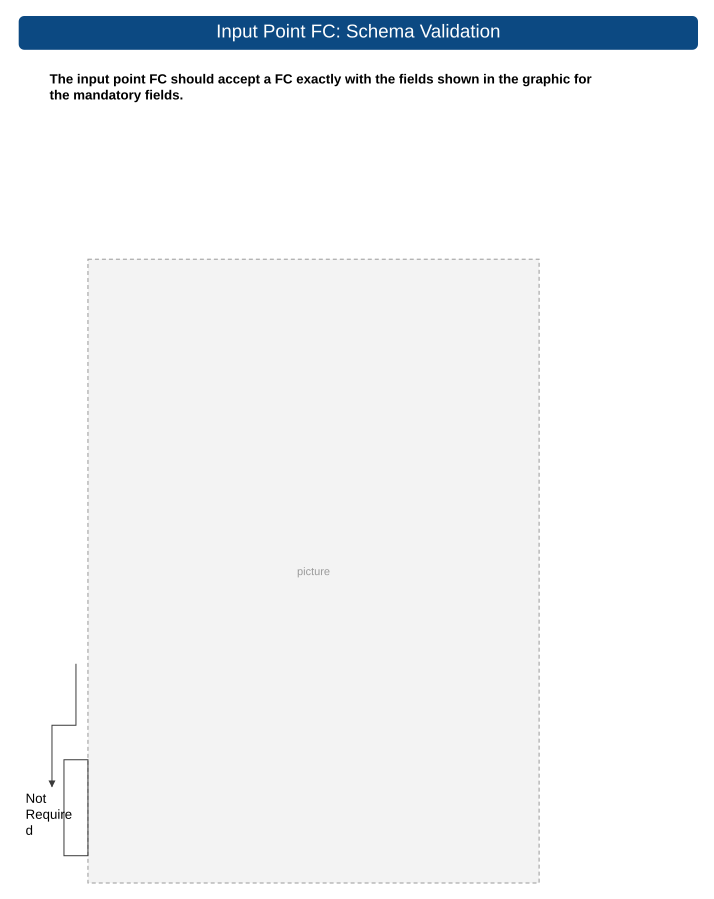
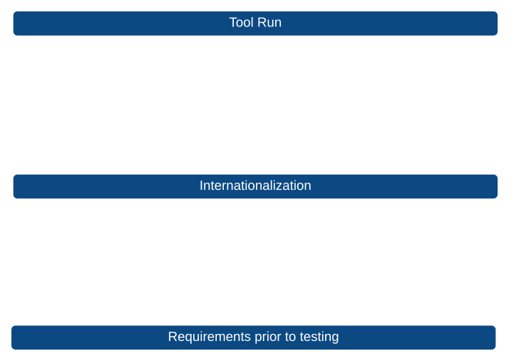

# Detect Objects Test Plan

| Field | Value |
| --- | --- |
| **Doc** | 10 · Test Plan · Pro |
| **Product** | Roads & Highways |
| **Release** | — |
| **Issues** | — |
| **Source** | [Detect_Objects_TestPlan.pptx](<https://esriis.sharepoint.com/sites/LocationReferencing/Shared%20Documents/General/Test%20Plans/Detect_Objects_TestPlan.pptx>) |
| **People** | author Rahul Rakshit · PE — · dev — |
| **Edited** | 2026-07-13 14:13 by Rahul Rakshit |
| **Extracted** | 2026-09-04 · lane xmlstrip · format 3.0 · prompt v2.0.2 |
| **Keywords** | object detection · feature extraction · point feature class · deduplication · geolocation · confidence · non maximum suppression · detection model |
| **Tools** | Detect Object |

## Summary

Test plan for the Detect Objects tool within the Feature Extraction panel, covering UI loading, input validation, prompt management, model loading, execution, output schema conformance, deduplication logic, geolocation, logging, and performance. Includes detailed field validation tests for input point feature classes and threshold parameters such as confidence and non-maximum suppression. Also covers licensing scenarios, error handling, and internationalization.

## Related documents

<!-- related:begin -->
- [Load Video Test Plan](<https://esriis.sharepoint.com/sites/lrsworkspace/LRS Doc Index/Test Plans/load-video.md>) — similar text 0.29 · same kind/surface/folder <!-- rel:19 s=4.836 -->
- [Camera Calibration Test Plan](<https://esriis.sharepoint.com/sites/lrsworkspace/LRS Doc Index/Test Plans/camera-calibration.md>) — similar text 0.25 · same kind/folder <!-- rel:8 s=3.176 -->
- [Reassign Route AI Assistant Test Plan](<https://esriis.sharepoint.com/sites/lrsworkspace/LRS Doc Index/Test Plans/7039-reassign-route-ai-assistant.md>) — similar text 0.07 · same kind/surface/folder <!-- rel:34 s=2.857 -->
- [Linear Referencing Attribution in Linear Feature Extraction](<https://esriis.sharepoint.com/sites/lrsworkspace/LRS Doc Index/User Stories/lr-attribution-in-linear-feature-extraction.md>) — similar text 0.07 · same surface <!-- rel:7 s=2.153 -->
- [Linear Referencing attribution in Feature Extraction](<https://esriis.sharepoint.com/sites/lrsworkspace/LRS Doc Index/User Stories/lr-attribution-in-feature-extraction.md>) — similar text 0.06 · same surface <!-- rel:14 s=2.083 -->
<!-- related:end -->

<!-- docs:begin -->
## Esri documentation

_No page matched:_ [Detect Object](https://www.google.com/search?q=%22Detect%20Object%22+site%3Adoc.esri.com)
<!-- docs:end -->

---

## Overview

### Slide 1 <!-- slide 1 -->

### Slide 2 — Draft UI <!-- slide 2 -->

## Test Cases

### TC-U01 — Open Feature Extraction → Object Detection panel→ Detect Object <!-- src: S3 · slide 3 · table · row 1 -->

- **Expected Result:** Panel loads without errors; all controls visible (Input Points FC, Prompts grid, Import/Export, Detection Model, Confidence, NMS, Output Geodatabase, Run)
- **Section:** Tool Launch

### TC-U02 — Default values populated <!-- src: S3 · slide 3 · table · row 2 -->

- **Expected Result:** Confidence and NMS show defaults; Output GDB defaults to project FGDB

### TC-U03 — Browse and select the frames point FC <!-- src: S3 · slide 3 · table · row 3 -->

- **Expected Result:** Accepted
- **Section:** Input Selection

### TC-U04 — Browse and select a valid Output . gdb <!-- src: S3 · slide 3 · table · row 4 -->

- **Expected Result:** Path accepted

### TC-U05 — Add one row: Regulatory Sign / Red traffic sign <!-- src: S3 · slide 3 · table · row 5 -->

- **Expected Result:** Row persists in grid
- **Section:** Prompts Grid

### TC-U06 — Import a known-good CSV (2-3 prompts) <!-- src: S3 · slide 3 · table · row 6 -->

- **Expected Result:** Grid populates correctly

### TC-U07 — Export prompts to CSV <!-- src: S3 · slide 3 · table · row 7 -->

- **Expected Result:** File written; reopen matches grid

### TC-U08 — Default Esri SAM3 DLPK auto-selected (if registered) <!-- src: S3 · slide 3 · table · row 8 -->

- **Expected Result:** Dropdown shows Esri DLPK
- **Section:** Model Package

### TC-U09 — Browse to local SAM3.dlpk on disk <!-- src: S3 · slide 3 · table · row 9 -->

- **Expected Result:** Path accepted and validated as SAM3

### TC-U10 — Set Confidence = 80% and NMS = 0.45 <!-- src: S3 · slide 3 · table · row 10 -->

- **Expected Result:** Values accepted; no inline error
- **Section:** Thresholds

### TC-U11 — Click Run with ~100-frame fixture, 2 prompts, GPU available <!-- src: S3 · slide 3 · table · row 11 -->

- **Expected Result:** Tool completes without crash; progress reported
- **Section:** Run Execution

### TC-U12 — Device auto-detect <!-- src: S3 · slide 3 · table · row 12 -->

- **Expected Result:** Log indicates GPU used (or CPU if no GPU)

### TC-U13 — Completion summary displayed <!-- src: S3 · slide 3 · table · row 13 -->

- **Expected Result:** Frames processed, detections created, skipped frames shown

### TC-U14 — Output FC created in project FGDB <!-- src: S3 · slide 3 · table · row 14 -->

- **Expected Result:** Point FC exists with correct name
- **Section:** Output FC

### TC-U15 — Schema check <!-- src: S3 · slide 3 · table · row 15 -->

- **Expected Result:** Fields present: OBJECTID, SHAPE, object_id , class_label , video_path , key_frame_index , key_bbox_norm , confidence, n_views , first_frame , last_frame , track_blob

### TC-U16 — Row count › 0 <!-- src: S3 · slide 3 · table · row 16 -->

- **Expected Result:** At least one detection persisted

### TC-U17 — Spot-check one row <!-- src: S3 · slide 3 · table · row 17 -->

- **Expected Result:** confidence in [0,1]; class_label matches a configured label; SHAPE is a valid geolocated point; object_id is a GUID

### TC-U18 — Log file generated <!-- src: S3 · slide 3 · table · row 18 -->

- **Expected Result:** Contains: model used, device, confidence, NMS, prompts, totals
- **Section:** Logging

### TC-U19 — Counts reconcile <!-- src: S3 · slide 3 · table · row 19 -->

- **Expected Result:** processed + skipped = total input frames

### TC-U20 — Run with a non-point FC as frames input <!-- src: S3 · slide 3 · table · row 20 -->

- **Expected Result:** Tool blocks with actionable message; no crash
- **Section:** Negative Path

### TC-U21 — Run with invalid model path <!-- src: S3 · slide 3 · table · row 21 -->

- **Expected Result:** Actionable error message; no crash

### TC-U22 — Field Missing (1) <!-- src: S3 · slide 7 · table · row 1 -->

- **Expected Result:** Error
- **Field:** Name

### TC-U23 — Value exceeds 255 characters <!-- src: S3 · slide 7 · table · row 4 -->

- **Expected Result:** Error

### TC-U24 — Trailing spaces in name <!-- src: S3 · slide 7 · table · row 5 -->

- **Expected Result:** Error

### TC-U25 — Leading spaces in name <!-- src: S3 · slide 7 · table · row 6 -->

- **Expected Result:** Error

### TC-U26 — Unsupported characters in name <!-- src: S3 · slide 7 · table · row 7 -->

- **Expected Result:** Error

### TC-U27 — Duplicate Name values <!-- src: S3 · slide 7 · table · row 8 -->

- **Expected Result:** Error

### TC-U28 — All frames have same Name <!-- src: S3 · slide 7 · table · row 9 -->

- **Expected Result:** Error

### TC-U29 — Duplicate Name but different ImagePath <!-- src: S3 · slide 7 · table · row 10 -->

- **Expected Result:** Error

### TC-U30 — Duplicate Name and duplicate ImagePath <!-- src: S3 · slide 7 · table · row 11 -->

- **Expected Result:** Error

### TC-U31 — Name values skip sequence unexpectedly <!-- src: S3 · slide 7 · table · row 12 -->

- **Expected Result:** Error

### TC-U32 — Name sequence out of order <!-- src: S3 · slide 7 · table · row 13 -->

- **Expected Result:** Error

### TC-U33 — Field Missing (2) <!-- src: S3 · slide 7 · table · row 14 -->

- **Expected Result:** Error
- **Field:** Image Path

### TC-U34 — Video file missing <!-- src: S3 · slide 7 · table · row 17 -->

- **Expected Result:** Error

### TC-U35 — Invalid path syntax <!-- src: S3 · slide 7 · table · row 18 -->

- **Expected Result:** Error

### TC-U36 — Broken UNC path <!-- src: S3 · slide 7 · table · row 19 -->

- **Expected Result:** Error

### TC-U37 — Unsupported Video extension <!-- src: S3 · slide 7 · table · row 20 -->

- **Expected Result:** Error

### TC-U38 — Relative path when absolute required <!-- src: S3 · slide 7 · table · row 21 -->

- **Expected Result:** Error

### TC-U39 — Corrupt Video file <!-- src: S3 · slide 7 · table · row 22 -->

- **Expected Result:** Error

### TC-U40 — Duplicate ImagePath records <!-- src: S3 · slide 7 · table · row 23 -->

- **Expected Result:** Error

### TC-U41 — Image path exceeds field length <!-- src: S3 · slide 7 · table · row 24 -->

- **Expected Result:** Error

### TC-U42 — Image path not pointing to the same file <!-- src: S3 · slide 7 · table · row 25 -->

- **Expected Result:** Error

### TC-U43 — Path contains trailing spaces <!-- src: S3 · slide 7 · table · row 26 -->

- **Expected Result:** Error

### TC-U44 — Path contains leading spaces <!-- src: S3 · slide 7 · table · row 27 -->

- **Expected Result:** Error

### TC-U45 — Video file extension Missing <!-- src: S3 · slide 7 · table · row 28 -->

- **Expected Result:** Error

### TC-U46 — Authentication required; Protected network share <!-- src: S3 · slide 7 · table · row 29 -->

- **Expected Result:** Error

### TC-U47 — File locked by another user <!-- src: S3 · slide 7 · table · row 30 -->

- **Expected Result:** Error

### TC-U48 — Field Missing (3) <!-- src: S3 · slide 8 · table · row 1 -->

- **Expected Result:** Error
- **Field:** Acquisition Date

### TC-U49 — AcquisitionDate contains non-date text <!-- src: S3 · slide 8 · table · row 4 -->

- **Expected Result:** Error

### TC-U50 — AcquisitionDate contains special characters <!-- src: S3 · slide 8 · table · row 5 -->

- **Expected Result:** Error

### TC-U51 — Values not in 6/21/2026 5: 04: 12 AM format: Missing components <!-- src: S3 · slide 8 · table · row 6 -->

- **Expected Result:** Error

### TC-U52 — Invalid month: 2025-13-01 <!-- src: S3 · slide 8 · table · row 7 -->

- **Expected Result:** Error

### TC-U53 — Invalid day: 2025-01-32 <!-- src: S3 · slide 8 · table · row 8 -->

- **Expected Result:** Error

### TC-U54 — February 30th date: 2025-02-30 <!-- src: S3 · slide 8 · table · row 9 -->

- **Expected Result:** Error

### TC-U55 — Leap year violation: 2025-02-29 <!-- src: S3 · slide 8 · table · row 10 -->

- **Expected Result:** Error

### TC-U56 — Invalid date format: 2025/99/99 <!-- src: S3 · slide 8 · table · row 11 -->

- **Expected Result:** Error

### TC-U57 — AcquisitionDate decreases between consecutive frames <!-- src: S3 · slide 8 · table · row 12 -->

- **Expected Result:** Error

### TC-N01 — Negative elapsed time between frames <!-- src: S3 · slide 8 · table · row 13 -->

- **Expected Result:** Error

### TC-U58 — Sudden jump in timestamps <!-- src: S3 · slide 8 · table · row 14 -->

- **Expected Result:** Warning

### TC-U59 — Duplicate records with identical timestamps <!-- src: S3 · slide 8 · table · row 15 -->

- **Expected Result:** Error

### TC-U60 — Significant mismatch with OffsetFromStart Timestamp <!-- src: S3 · slide 8 · table · row 16 -->

- **Case:** Significant mismatch with OffsetFromStart Timestamp: progression inconsistent with offset values
- **Expected Result:** Warning

### TC-U61 — AcquisitionDate progression inconsistent with OffsetFromStart <!-- src: S3 · slide 8 · table · row 17 -->

- **Case:** AcquisitionDate progression inconsistent with OffsetFromStart: Timestamp spacing doesn't match offsets
- **Expected Result:** Warning

### TC-U62 — Verify timestamp increases as frame sequence advances <!-- src: S3 · slide 8 · table · row 18 -->

### TC-U63 — Verify timestamp intervals align with expected frame rate <!-- src: S3 · slide 8 · table · row 19 -->

### TC-U64 — Verify AcquisitionDate is consistent with video capture time and GPS progression <!-- src: S3 · slide 8 · table · row 20 -->

### TC-U65 — Verify duplicate timestamps do not create unintended deduplication or tracking <!-- src: S3 · slide 8 · table · row 21 -->

- **Case:** Verify duplicate timestamps do not create unintended deduplication or tracking issues

### TC-U66 — Field Missing (4) <!-- src: S3 · slide 9 · table · row 1 -->

- **Expected Result:** Error
- **Field:** Camera Heading: Represents camera azimuth/ direction of travel.; Typical range:; 0°–360°; 0° = North; 90° = East; 180° = South; 270° = West

### TC-U67 — Heading below minimum tolerance: 0.0001 <!-- src: S3 · slide 9 · table · row 6 -->

- **Expected Result:** Error

### TC-U68 — Heading slightly above maximum: 360.01 <!-- src: S3 · slide 9 · table · row 7 -->

- **Expected Result:** Error

### TC-U69 — Heading = 0 North <!-- src: S3 · slide 9 · table · row 8 -->

- **Expected Result:** Accepted

### TC-U70 — Heading = 0.01 Small valid value <!-- src: S3 · slide 9 · table · row 10 -->

- **Expected Result:** Accepted

### TC-U71 — Heading = 359.99 Large valid value <!-- src: S3 · slide 9 · table · row 11 -->

- **Expected Result:** Accepted

### TC-U72 — Heading = 180 Mid-range value <!-- src: S3 · slide 9 · table · row 12 -->

- **Expected Result:** Accepted

### TC-U73 — Sudden heading change between consecutive frames5° → 270° <!-- src: S3 · slide 9 · table · row 13 -->

### TC-U74 — Heading oscillates every frame45° → 180° → 50° → 190° <!-- src: S3 · slide 9 · table · row 14 -->

### TC-U75 — One corrupted heading among valid frames: Single frame = 999° <!-- src: S3 · slide 9 · table · row 15 -->

- **Expected Result:** Warning

### TC-U76 — Consecutive invalid heading values: Multiple frames invalid <!-- src: S3 · slide 9 · table · row 16 -->

- **Expected Result:** Warning

### TC-U77 — Vehicle moving north but heading south: GPS track ≠ heading <!-- src: S3 · slide 9 · table · row 17 -->

- **Expected Result:** Error

### TC-U78 — Vehicle moving east but heading west: GPS track conflict <!-- src: S3 · slide 9 · table · row 18 -->

- **Expected Result:** Error

### TC-U79 — GPS track changes direction but heading remains constant <!-- src: S3 · slide 9 · table · row 19 -->

- **Case:** GPS track changes direction but heading remains constant: Potential telemetry issue
- **Expected Result:** Warning

### TC-U80 — Heading changes but GPS position remains unchanged: Potential metadata issue <!-- src: S3 · slide 9 · table · row 20 -->

- **Expected Result:** Warning

### TC-U81 — Identical GPS coordinates but highly variable headings <!-- src: S3 · slide 9 · table · row 21 -->

- **Expected Result:** Warning

### TC-U82 — Field Missing (5) <!-- src: S3 · slide 10 · table · row 1 -->

- **Expected Result:** Error
- **Field:** CameraPitch: Represents the vertical angle of the camera relative to the horizon.; Typical values:; 0° = camera pointed at horizon; Negative values = camera pointed downward; Positive values = camera pointed upward; Typical vehicle-mounted imagery: -5° to -45°

### TC-U83 — Pitch less than minimum: -91° <!-- src: S3 · slide 10 · table · row 4 -->

- **Expected Result:** Error

### TC-U84 — Pitch far below minimum: -180° <!-- src: S3 · slide 10 · table · row 5 -->

- **Expected Result:** Error

### TC-U85 — Pitch greater than maximum: +91° <!-- src: S3 · slide 10 · table · row 6 -->

- **Expected Result:** Error

### TC-U86 — Pitch far above maximum: +180° <!-- src: S3 · slide 10 · table · row 7 -->

- **Expected Result:** Error

### TC-U87 — Slightly outside boundary: 90.01° <!-- src: S3 · slide 10 · table · row 8 -->

- **Expected Result:** Error

### TC-U88 — Pitch = -90°Straight down <!-- src: S3 · slide 10 · table · row 9 -->

- **Expected Result:** Accepted

### TC-U89 — Pitch = +90°Straight up <!-- src: S3 · slide 10 · table · row 10 -->

- **Expected Result:** Accepted

### TC-U90 — Pitch = 0°Horizon (1) <!-- src: S3 · slide 10 · table · row 11 -->

- **Expected Result:** Accepted

### TC-U91 — Pitch = -0.01°Near-horizontal downward <!-- src: S3 · slide 10 · table · row 12 -->

- **Expected Result:** Accepted

### TC-U92 — Pitch = 0°Horizon (2) <!-- src: S3 · slide 10 · table · row 13 -->

- **Expected Result:** Accepted

### TC-U93 — Pitch = +0.01°Near-horizontal upward <!-- src: S3 · slide 10 · table · row 14 -->

- **Expected Result:** Accepted

### TC-U94 — Abrupt pitch change between adjacent frames-20° → +45° <!-- src: S3 · slide 10 · table · row 15 -->

- **Expected Result:** Warning

### TC-U95 — Continuous oscillation-10° → +20° → -15° → +25 <!-- src: S3 · slide 10 · table · row 16 -->

- **Expected Result:** Warning

### TC-U96 — Single corrupted pitch value in sequence: One frame = 999°: Frame skipped <!-- src: S3 · slide 10 · table · row 17 -->

- **Expected Result:** Warning: Logged

### TC-U97 — Multiple invalid pitch values: Several consecutive bad values <!-- src: S3 · slide 10 · table · row 18 -->

- **Expected Result:** Frames skipped

### TC-U98 — Pitch offset by +60° <!-- src: S3 · slide 10 · table · row 19 -->

- **Expected Result:** Severe error: Geolocation significantly degraded

### TC-U99 — Pitch changes significantly while GPS remains stationary <!-- src: S3 · slide 10 · table · row 20 -->

- **Expected Result:** Warning

### TC-U100 — Pitch stable but object locations fluctuate dramatically <!-- src: S3 · slide 10 · table · row 21 -->

- **Expected Result:** Potential pitch error: Warning

### TC-U101 — Field Missing (6) <!-- src: S3 · slide 11 · table · row 1 -->

- **Expected Result:** Error
- **Field:** CameraRoll : Represents the rotation of the camera around its forward viewing axis.; Typical values:; 0° = Level horizon; Positive values = Clockwise rotation; Negative values = Counter-clockwise rotation; Vehicle-mounted imagery is typically close to 0°

### TC-U102 — Roll less than minimum: -181° <!-- src: S3 · slide 11 · table · row 4 -->

- **Expected Result:** Error

### TC-U103 — Roll greater than maximum: +181° <!-- src: S3 · slide 11 · table · row 5 -->

- **Expected Result:** Error

### TC-U104 — Roll = -360°: Invalid range <!-- src: S3 · slide 11 · table · row 6 -->

- **Expected Result:** Error

### TC-U105 — Roll = +360°: Invalid range <!-- src: S3 · slide 11 · table · row 7 -->

- **Expected Result:** Error

### TC-U106 — Roll Slightly outside valid range: 180.01° <!-- src: S3 · slide 11 · table · row 8 -->

- **Expected Result:** Error

### TC-U107 — Roll = -180°: Minimum boundary <!-- src: S3 · slide 11 · table · row 9 -->

- **Expected Result:** Accepted

### TC-U108 — Roll = +180°: Maximum boundary <!-- src: S3 · slide 11 · table · row 10 -->

- **Expected Result:** Accepted

### TC-U109 — Roll = 0°: Perfectly level <!-- src: S3 · slide 11 · table · row 11 -->

- **Expected Result:** Accepted

### TC-U110 — Roll = -0.01°: Small valid value <!-- src: S3 · slide 11 · table · row 12 -->

- **Expected Result:** Accepted

### TC-U111 — Roll = +0.01°: Small valid value <!-- src: S3 · slide 11 · table · row 13 -->

- **Expected Result:** Accepted

### TC-U112 — Roll = 45°: Valid roll angle <!-- src: S3 · slide 11 · table · row 14 -->

- **Expected Result:** Accepted

### TC-U113 — Single corrupted roll value One frame = 999° <!-- src: S3 · slide 11 · table · row 15 -->

- **Expected Result:** Frame skipped; warning logged

### TC-U114 — Multiple corrupted roll values: Several consecutive frames invalid <!-- src: S3 · slide 11 · table · row 16 -->

- **Expected Result:** Frames skipped

### TC-U115 — Roll changes dramatically but GPS path remains smooth: Metadata inconsistency <!-- src: S3 · slide 11 · table · row 17 -->

- **Expected Result:** Warning

### TC-U116 — Field Missing (7) <!-- src: S3 · slide 12 · table · row 1 -->

- **Expected Result:** Error
- **Field:** HorizontalFieldOfView: defines the camera's horizontal viewing angle

### TC-N02 — Negative HFOV: -10° <!-- src: S3 · slide 12 · table · row 5 -->

- **Expected Result:** Error

### TC-N03 — HFOV slightly negative: -0.01° <!-- src: S3 · slide 12 · table · row 6 -->

- **Expected Result:** Error

### TC-U117 — HFOV = 360°: Full circle <!-- src: S3 · slide 12 · table · row 8 -->

- **Expected Result:** Error

### TC-U118 — HFOV = 1°: Minimum practical value <!-- src: S3 · slide 12 · table · row 9 -->

- **Expected Result:** Accepted or warning

### TC-U119 — HFOV = 30°: Narrow field of view <!-- src: S3 · slide 12 · table · row 10 -->

- **Expected Result:** Accepted

### TC-U120 — HFOV = 90°: Common camera value <!-- src: S3 · slide 12 · table · row 11 -->

- **Expected Result:** Accepted

### TC-U121 — HFOV = 120°: Wide angle camera <!-- src: S3 · slide 12 · table · row 12 -->

- **Expected Result:** Accepted

### TC-U122 — HFOV = 179.99°: Near maximum <!-- src: S3 · slide 12 · table · row 13 -->

- **Expected Result:** Accepted or warning

### TC-U123 — HFOV = 180°: Maximum boundary <!-- src: S3 · slide 12 · table · row 14 -->

- **Expected Result:** Accepted or warning

### TC-U124 — HFOV changes between adjacent frames: 120° → 80° <!-- src: S3 · slide 12 · table · row 15 -->

- **Expected Result:** Warning

### TC-U125 — HFOV changes every frame: Unstable calibration: Warning <!-- src: S3 · slide 12 · table · row 16 -->

- **Expected Result:** Warning

### TC-U126 — Mixed valid and invalid HFOV values: Dataset partially corrupted <!-- src: S3 · slide 12 · table · row 17 -->

- **Expected Result:** Invalid rows reported

### TC-U127 — Narrow HFOV with wide-angle imagery: Incorrect calibration <!-- src: S3 · slide 12 · table · row 18 -->

- **Expected Result:** Warning

### TC-U128 — Wide HFOV with narrow-angle imagery: Incorrect calibration <!-- src: S3 · slide 12 · table · row 19 -->

- **Expected Result:** Warning

### TC-U129 — Field Missing (8) <!-- src: S3 · slide 13 · table · row 1 -->

- **Expected Result:** Error
- **Field:** VerticalFieldOfView

### TC-U130 — VFOV = 0: Invalid viewing angle <!-- src: S3 · slide 13 · table · row 4 -->

- **Expected Result:** Error

### TC-N04 — Slightly negative VFOV: -0.01° <!-- src: S3 · slide 13 · table · row 6 -->

- **Expected Result:** Error

### TC-U131 — VFOV = 360°: Full sphere <!-- src: S3 · slide 13 · table · row 8 -->

- **Expected Result:** Error

### TC-U132 — Extremely small value: 0.001° <!-- src: S3 · slide 13 · table · row 9 -->

- **Expected Result:** Error or Warning

### TC-U133 — VFOV = 1°: Extremely narrow view <!-- src: S3 · slide 13 · table · row 10 -->

- **Expected Result:** Accepted with Warning

### TC-U134 — VFOV = 30°: Narrow view <!-- src: S3 · slide 13 · table · row 11 -->

- **Expected Result:** Accepted

### TC-U135 — VFOV = 60°: Typical value <!-- src: S3 · slide 13 · table · row 12 -->

- **Expected Result:** Accepted

### TC-U136 — VFOV = 90°: Wide view <!-- src: S3 · slide 13 · table · row 13 -->

- **Expected Result:** Accepted

### TC-U137 — VFOV = 179.99°: Maximum practical value <!-- src: S3 · slide 13 · table · row 14 -->

- **Expected Result:** Accepted with Warning

### TC-U138 — VFOV = 180°: Boundary limit <!-- src: S3 · slide 13 · table · row 15 -->

- **Expected Result:** Accepted with Warning

### TC-U139 — VFOV = 180.01°: Exceeds maximum <!-- src: S3 · slide 13 · table · row 16 -->

- **Expected Result:** Error

### TC-U140 — VFOV changes every frame: Calibration instability <!-- src: S3 · slide 13 · table · row 17 -->

- **Expected Result:** Warning

### TC-U141 — VFOV constant throughout video <!-- src: S3 · slide 13 · table · row 18 -->

- **Expected Result:** Accepted

### TC-U142 — Small variation between frames <!-- src: S3 · slide 13 · table · row 19 -->

- **Expected Result:** Warning

### TC-U143 — Significant variation between frames (1) <!-- src: S3 · slide 13 · table · row 20 -->

- **Expected Result:** Warning

### TC-U144 — Field Missing (9) <!-- src: S3 · slide 14 · table · row 1 -->

- **Expected Result:** Error
- **Field:** NearDistance: Defines the minimum valid distance from the camera where objects can be projected, geolocated, or considered within the camera's viewing frustum.

### TC-U145 — NearDistance = 00 meters <!-- src: S3 · slide 14 · table · row 4 -->

- **Expected Result:** Error

### TC-N05 — Negative NearDistance: -1 meter <!-- src: S3 · slide 14 · table · row 5 -->

- **Expected Result:** Error

### TC-N06 — Negative decimal distance: -0.01 (1) <!-- src: S3 · slide 14 · table · row 6 -->

- **Expected Result:** Error

### TC-U146 — Extremely small value: 0.000001 (1) <!-- src: S3 · slide 14 · table · row 7 -->

- **Expected Result:** Warning or Error

### TC-U147 — Extremely large value: 100000 m (1) <!-- src: S3 · slide 14 · table · row 8 -->

- **Expected Result:** Warning

### TC-U148 — NearDistance ‹ FarDistance: Valid frustum (1) <!-- src: S3 · slide 14 · table · row 12 -->

- **Expected Result:** Accepted

### TC-U149 — NearDistance = FarDistance: Invalid frustum (1) <!-- src: S3 · slide 14 · table · row 13 -->

- **Expected Result:** Error

### TC-U150 — NearDistance › FarDistance: Invalid frustum (1) <!-- src: S3 · slide 14 · table · row 14 -->

- **Expected Result:** Error

### TC-U151 — NearDistance significantly larger than FarDistance <!-- src: S3 · slide 14 · table · row 15 -->

- **Expected Result:** Error

### TC-U152 — NearDistance almost equal to FarDistance (1) <!-- src: S3 · slide 14 · table · row 16 -->

- **Expected Result:** Warning

### TC-U153 — Object located exactly at NearDistance <!-- src: S3 · slide 14 · table · row 17 -->

- **Expected Result:** Accepted

### TC-U154 — Object closer than NearDistance <!-- src: S3 · slide 14 · table · row 18 -->

- **Expected Result:** Object excluded

### TC-U155 — Object slightly closer than NearDistance <!-- src: S3 · slide 14 · table · row 19 -->

- **Expected Result:** Excluded; logged

### TC-U156 — Object slightly farther than NearDistance <!-- src: S3 · slide 14 · table · row 20 -->

- **Expected Result:** Accepted

### TC-U157 — Detection exists inside excluded zone (1) <!-- src: S3 · slide 14 · table · row 21 -->

- **Expected Result:** Warning

### TC-U158 — Constant NearDistance across all frames <!-- src: S3 · slide 14 · table · row 22 -->

- **Expected Result:** Accepted

### TC-U159 — Small NearDistance variation (1) <!-- src: S3 · slide 14 · table · row 23 -->

- **Expected Result:** Warning

### TC-U160 — Significant variation between frames (2) <!-- src: S3 · slide 14 · table · row 24 -->

- **Expected Result:** Warning

### TC-U161 — Field Missing (10) <!-- src: S3 · slide 15 · table · row 1 -->

- **Expected Result:** Error
- **Field:** FarDistance: the maximum valid distance from the camera where objects can be projected, geolocated, or considered part of the camera viewing frustum.

### TC-U162 — FarDistance = 00 meters <!-- src: S3 · slide 15 · table · row 4 -->

- **Expected Result:** Error

### TC-N07 — Negative FarDistance: -1 meter <!-- src: S3 · slide 15 · table · row 5 -->

- **Expected Result:** Error

### TC-N08 — Negative decimal distance: -0.01 (2) <!-- src: S3 · slide 15 · table · row 6 -->

- **Expected Result:** Error

### TC-U163 — Extremely small value: 0.000001 (2) <!-- src: S3 · slide 15 · table · row 7 -->

- **Expected Result:** Error or Warning

### TC-U164 — Extremely large value: 100000 m (2) <!-- src: S3 · slide 15 · table · row 8 -->

- **Expected Result:** Warning

### TC-U165 — NearDistance ‹ FarDistance: Valid frustum (2) <!-- src: S3 · slide 15 · table · row 12 -->

- **Expected Result:** Accepted

### TC-U166 — NearDistance = FarDistance: Invalid frustum (2) <!-- src: S3 · slide 15 · table · row 13 -->

- **Expected Result:** Error

### TC-U167 — NearDistance › FarDistance: Invalid frustum (2) <!-- src: S3 · slide 15 · table · row 14 -->

- **Expected Result:** Error

### TC-U168 — FarDistance slightly less than NearDistance <!-- src: S3 · slide 15 · table · row 15 -->

- **Expected Result:** Error

### TC-U169 — NearDistance almost equal to FarDistance (2) <!-- src: S3 · slide 15 · table · row 16 -->

- **Expected Result:** Warning

### TC-U170 — Object located exactly at FarDistance <!-- src: S3 · slide 15 · table · row 17 -->

- **Expected Result:** Accepted

### TC-U171 — Object closer than FarDistance <!-- src: S3 · slide 15 · table · row 18 -->

- **Expected Result:** Accepted

### TC-U172 — Object slightly away than FarDistance <!-- src: S3 · slide 15 · table · row 19 -->

- **Expected Result:** Excluded; logged

### TC-U173 — Detection exists inside excluded zone (2) <!-- src: S3 · slide 15 · table · row 20 -->

- **Expected Result:** Warning

### TC-U174 — Constant FarDistance across all frames <!-- src: S3 · slide 15 · table · row 21 -->

- **Expected Result:** Accepted

### TC-U175 — Small NearDistance variation (2) <!-- src: S3 · slide 15 · table · row 22 -->

- **Expected Result:** Warning

### TC-U176 — Significant variation between frames (3) <!-- src: S3 · slide 15 · table · row 23 -->

- **Expected Result:** Warning

### TC-U177 — Field Missing (11) <!-- src: S3 · slide 16 · table · row 1 -->

- **Expected Result:** Error
- **Field:** OrientedImageryType

### TC-U178 — Any value other than one of Horizontal, Oblique, Nadir, 360, Inspection <!-- src: S3 · slide 16 · table · row 4 -->

- **Case:** Any value other than one of Horizontal, Oblique, Nadir, 360, Inspection, TerrestrialFrameVideo , AerialFrameVideo , Terrestrial360Video
- **Expected Result:** Error

### TC-U179 — Field Missing (12) <!-- src: S3 · slide 17 · table · row 1 -->

- **Expected Result:** Error
- **Field:** OffsetFromStart: Represents the temporal or positional offset of a frame from the beginning of the video/image sequence.

### TC-U180 — OffsetFromStart = 0: First frame <!-- src: S3 · slide 17 · table · row 5 -->

- **Expected Result:** Accepted

### TC-P01 — OffsetFromStart = 0.001: Small positive offset <!-- src: S3 · slide 17 · table · row 6 -->

- **Expected Result:** Accepted

### TC-U181 — OffsetFromStart = 1: Valid offset <!-- src: S3 · slide 17 · table · row 7 -->

- **Expected Result:** Accepted

### TC-U182 — OffsetFromStart = video duration: Last valid frame <!-- src: S3 · slide 17 · table · row 8 -->

- **Expected Result:** Accepted

### TC-U183 — OffsetFromStart slightly above duration: Duration + 0.001 <!-- src: S3 · slide 17 · table · row 9 -->

- **Expected Result:** Warning or Error

### TC-U184 — OffsetFromStart extremely close to zero <!-- src: S3 · slide 17 · table · row 10 -->

- **Expected Result:** Accepted

### TC-U185 — Offsets increase monotonically: 0,1,2,3,4 <!-- src: S3 · slide 17 · table · row 11 -->

- **Expected Result:** Accepted

### TC-U186 — Duplicate offsets: 1,1,2,3 <!-- src: S3 · slide 17 · table · row 12 -->

- **Expected Result:** Warning

### TC-U187 — Offsets decrease between frames: 1,2,1,3Validatio <!-- src: S3 · slide 17 · table · row 13 -->

- **Expected Result:** Warning

### TC-U188 — Random offsets: No sequence <!-- src: S3 · slide 17 · table · row 14 -->

- **Expected Result:** Warning

### TC-U189 — Large gaps in offsets: 1,2,100,101 <!-- src: S3 · slide 17 · table · row 15 -->

- **Expected Result:** Warning

### TC-U190 — Missing offsets mid-sequence: Gap detected <!-- src: S3 · slide 17 · table · row 16 -->

- **Expected Result:** Warning

### TC-U191 — Offset resets mid-video: 10→11→0→1 <!-- src: S3 · slide 17 · table · row 17 -->

- **Expected Result:** Warning or Error

### TC-U192 — Offset progression matches AcquisitionDate progression <!-- src: S3 · slide 17 · table · row 18 -->

- **Expected Result:** Accepted

### TC-U193 — Offset increases while AcquisitionDate decreases <!-- src: S3 · slide 17 · table · row 19 -->

- **Expected Result:** Warning

### TC-U194 — Constant AcquisitionDate, increasing offsets <!-- src: S3 · slide 17 · table · row 20 -->

- **Expected Result:** Warning

### TC-U195 — Random AcquisitionDate but ordered offsets <!-- src: S3 · slide 17 · table · row 21 -->

- **Expected Result:** Warning

### TC-U196 — Offset sequence matches image sequence <!-- src: S3 · slide 17 · table · row 22 -->

- **Expected Result:** Accepted

### TC-U197 — Offset sequence inconsistent with image numbering <!-- src: S3 · slide 17 · table · row 23 -->

- **Expected Result:** Warning

### TC-U198 — Offset increases with GPS movement <!-- src: S3 · slide 17 · table · row 24 -->

- **Expected Result:** Accepted

### TC-U199 — Offset increases but GPS unchanged <!-- src: S3 · slide 17 · table · row 25 -->

- **Expected Result:** Warning

### TC-U200 — GPS changes dramatically with minimal offset increase <!-- src: S3 · slide 17 · table · row 26 -->

- **Expected Result:** Warning

### TC-U201 — Offset remains constant while GPS changes <!-- src: S3 · slide 17 · table · row 27 -->

- **Expected Result:** Warning

### TC-U202 — Offset sequence inconsistent with vehicle movement <!-- src: S3 · slide 17 · table · row 28 -->

- **Expected Result:** Warning

### TC-U203 — Field Missing (13) <!-- src: S3 · slide 18 · table · row 1 -->

- **Expected Result:** Error
- **Field:** Latitude

### TC-U204 — Latitude = -91: Invalid value <!-- src: S3 · slide 18 · table · row 6 -->

- **Expected Result:** Error

### TC-U205 — Latitude = 91: Invalid value <!-- src: S3 · slide 18 · table · row 7 -->

- **Expected Result:** Error

### TC-U206 — Latitude = -90: South Pole <!-- src: S3 · slide 18 · table · row 8 -->

- **Expected Result:** Accepted

### TC-U207 — Latitude = 90: North Pole <!-- src: S3 · slide 18 · table · row 9 -->

- **Expected Result:** Accepted

### TC-U208 — Latitude = 0: Equator <!-- src: S3 · slide 18 · table · row 10 -->

- **Expected Result:** Accepted

### TC-U209 — Latitude = -89.9999: Near South Pole <!-- src: S3 · slide 18 · table · row 11 -->

- **Expected Result:** Accepted

### TC-U210 — Latitude = 89.9999: Near North Pole <!-- src: S3 · slide 18 · table · row 12 -->

- **Expected Result:** Accepted

### TC-U211 — Latitude = -90.01: Out of range <!-- src: S3 · slide 18 · table · row 13 -->

- **Expected Result:** Error

### TC-U212 — Latitude = 90.01: Out of range <!-- src: S3 · slide 18 · table · row 14 -->

- **Expected Result:** Error

### TC-U213 — Constant latitude in stationary sequence <!-- src: S3 · slide 18 · table · row 15 -->

- **Expected Result:** Accepted

### TC-U214 — Small latitude changes between frames <!-- src: S3 · slide 18 · table · row 16 -->

- **Expected Result:** Accepted

### TC-U215 — Abrupt latitude jump between adjacent frames <!-- src: S3 · slide 18 · table · row 17 -->

- **Expected Result:** Warning

### TC-U216 — Latitude oscillates significantly <!-- src: S3 · slide 18 · table · row 18 -->

- **Expected Result:** Warning

### TC-U217 — Random latitude values per frame <!-- src: S3 · slide 18 · table · row 19 -->

- **Expected Result:** Data quality warning

### TC-U218 — Single corrupted latitude value <!-- src: S3 · slide 18 · table · row 20 -->

- **Expected Result:** Frame skipped; logged

### TC-U219 — Dataset-wide identical latitude (1) <!-- src: S3 · slide 18 · table · row 21 -->

- **Expected Result:** Warning if inconsistent with movement

### TC-U220 — Same latitude but varying longitude (1) <!-- src: S3 · slide 18 · table · row 22 -->

- **Expected Result:** Accepted if movement is east/west

### TC-U221 — Field Missing (14) <!-- src: S3 · slide 19 · table · row 1 -->

- **Expected Result:** Error
- **Field:** Longitude

### TC-U222 — Longitude = -181: Invalid value <!-- src: S3 · slide 19 · table · row 6 -->

- **Expected Result:** Error

### TC-U223 — Longitude = 181: Invalid value <!-- src: S3 · slide 19 · table · row 7 -->

- **Expected Result:** Error

### TC-U224 — Longitude = 0: Prime Meridian <!-- src: S3 · slide 19 · table · row 10 -->

- **Expected Result:** Accepted

### TC-U225 — Longitude = -180.01: Out of range <!-- src: S3 · slide 19 · table · row 13 -->

- **Expected Result:** Error

### TC-U226 — Longitude = 180.01: Out of range <!-- src: S3 · slide 19 · table · row 14 -->

- **Expected Result:** Error

### TC-U227 — Constant Longitude in stationary sequence <!-- src: S3 · slide 19 · table · row 15 -->

- **Expected Result:** Accepted

### TC-U228 — Small Longitude changes between frames <!-- src: S3 · slide 19 · table · row 16 -->

- **Expected Result:** Accepted

### TC-U229 — Abrupt Longitude jump between adjacent frames <!-- src: S3 · slide 19 · table · row 17 -->

- **Expected Result:** Warning

### TC-U230 — Longitude oscillates significantly <!-- src: S3 · slide 19 · table · row 18 -->

- **Expected Result:** Warning

### TC-U231 — Random Longitude values per frame <!-- src: S3 · slide 19 · table · row 19 -->

- **Expected Result:** Data quality warning

### TC-U232 — Single corrupted Longitude value <!-- src: S3 · slide 19 · table · row 20 -->

- **Expected Result:** Frame skipped; logged

### TC-U233 — Dataset-wide identical latitude (2) <!-- src: S3 · slide 19 · table · row 21 -->

- **Expected Result:** Warning if inconsistent with movement

### TC-U234 — Same latitude but varying longitude (2) <!-- src: S3 · slide 19 · table · row 22 -->

- **Expected Result:** Accepted if movement is north/south

### TC-U235 — Field Missing (15) <!-- src: S3 · slide 20 · table · row 1 -->

- **Expected Result:** Error
- **Field:** Elevation

### TC-U236 — Elevation = 0: Sea level <!-- src: S3 · slide 20 · table · row 4 -->

- **Expected Result:** Accepted

### TC-U237 — Elevation = -10m: Below sea level <!-- src: S3 · slide 20 · table · row 5 -->

- **Expected Result:** Accepted

### TC-U238 — Constant Elevation on flat terrain <!-- src: S3 · slide 20 · table · row 6 -->

- **Expected Result:** Accepted

### TC-U239 — Small elevation changes along route <!-- src: S3 · slide 20 · table · row 7 -->

- **Expected Result:** Accepted

### TC-U240 — Sudden elevation jump between adjacent frames <!-- src: S3 · slide 20 · table · row 8 -->

- **Expected Result:** Warning

### TC-U241 — Elevation fluctuates significantly <!-- src: S3 · slide 20 · table · row 9 -->

- **Expected Result:** Warning

### TC-U242 — Field Missing (16) <!-- src: S3 · slide 20 · table · row 1 -->

- **Expected Result:** Error
- **Field:** GeorefQuality

### TC-U243 — Field Missing (17) <!-- src: S3 · slide 21 · table · row 1 -->

- **Expected Result:** Error
- **Field:** FrameWidth

### TC-N09 — Negative FrameWidth: -1080 <!-- src: S3 · slide 21 · table · row 5 -->

- **Expected Result:** Error

### TC-U244 — FrameWidth = -1Invalid value <!-- src: S3 · slide 21 · table · row 6 -->

- **Expected Result:** Error

### TC-U245 — Very small width: 1 pixel <!-- src: S3 · slide 21 · table · row 7 -->

- **Expected Result:** Error or Warning

### TC-U246 — Extremely large width: 100000 <!-- src: S3 · slide 21 · table · row 8 -->

- **Expected Result:** Error

### TC-U247 — Common HD width: 1920 <!-- src: S3 · slide 21 · table · row 9 -->

- **Expected Result:** Accepted

### TC-U248 — Common 4K width: 3840 <!-- src: S3 · slide 21 · table · row 10 -->

- **Expected Result:** Accepted

### TC-U249 — FrameWidth matches image metadata: Image width = field value <!-- src: S3 · slide 21 · table · row 11 -->

- **Expected Result:** Accepted

### TC-U250 — FrameWidth smaller than actual image width: Metadata mismatch <!-- src: S3 · slide 21 · table · row 12 -->

- **Expected Result:** Error or Warning

### TC-U251 — FrameWidth larger than actual image width: Metadata mismatch <!-- src: S3 · slide 21 · table · row 13 -->

- **Expected Result:** Error or Warning

### TC-U252 — FrameWidth differs by 1 pixel: Minor mismatch <!-- src: S3 · slide 21 · table · row 14 -->

- **Expected Result:** Warning

### TC-U253 — FrameWidth differs significantly from image metadata: Large mismatch <!-- src: S3 · slide 21 · table · row 15 -->

- **Expected Result:** Error

### TC-U254 — Both dimensions valid: Valid image size (1) <!-- src: S3 · slide 21 · table · row 16 -->

- **Expected Result:** Accepted

### TC-U255 — FrameHeight = 0 and FrameWidth valid (1) <!-- src: S3 · slide 21 · table · row 17 -->

- **Expected Result:** Error

### TC-U256 — Unusual aspect ratio: 1920 × 100 (1) <!-- src: S3 · slide 21 · table · row 18 -->

- **Expected Result:** Warning

### TC-U257 — Impossible dimensions: 1920 × 1 (1) <!-- src: S3 · slide 21 · table · row 19 -->

- **Expected Result:** Error

### TC-U258 — Bounding box xmax ‹ FrameWidth <!-- src: S3 · slide 21 · table · row 20 -->

- **Expected Result:** Accepted

### TC-U259 — Bounding box xmax = FrameWidth <!-- src: S3 · slide 21 · table · row 21 -->

- **Expected Result:** Accepted

### TC-U260 — Bounding box xmax › FrameWidth <!-- src: S3 · slide 21 · table · row 22 -->

- **Expected Result:** Error

### TC-U261 — Bounding box extends beyond image edge <!-- src: S3 · slide 21 · table · row 23 -->

- **Expected Result:** Error

### TC-U262 — Field Missing (18) <!-- src: S3 · slide 22 · table · row 1 -->

- **Expected Result:** Error
- **Field:** FrameHeight

### TC-N10 — Negative FrameHeight: -1080 <!-- src: S3 · slide 22 · table · row 5 -->

- **Expected Result:** Error

### TC-U263 — FrameHeight = -1Invalid value <!-- src: S3 · slide 22 · table · row 6 -->

- **Expected Result:** Error

### TC-U264 — Very small height: 1 pixel <!-- src: S3 · slide 22 · table · row 7 -->

- **Expected Result:** Error or Warning

### TC-U265 — Extremely large height: 100000 <!-- src: S3 · slide 22 · table · row 8 -->

- **Expected Result:** Error

### TC-U266 — Common HD height: 1080 <!-- src: S3 · slide 22 · table · row 9 -->

- **Expected Result:** Accepted

### TC-U267 — Common 4K height: 2160 <!-- src: S3 · slide 22 · table · row 10 -->

- **Expected Result:** Accepted

### TC-U268 — FrameHeight matches image metadata: Image height = field value <!-- src: S3 · slide 22 · table · row 11 -->

- **Expected Result:** Accepted

### TC-U269 — FrameHeight smaller than actual image height: Metadata mismatch <!-- src: S3 · slide 22 · table · row 12 -->

- **Expected Result:** Error or Warning

### TC-U270 — FrameHeight larger than actual image height: Metadata mismatch <!-- src: S3 · slide 22 · table · row 13 -->

- **Expected Result:** Error or Warning

### TC-U271 — FrameHeight differs by 1 pixel: Minor mismatch <!-- src: S3 · slide 22 · table · row 14 -->

- **Expected Result:** Warning

### TC-U272 — FrameHeight differs significantly from image metadata: Large mismatch <!-- src: S3 · slide 22 · table · row 15 -->

- **Expected Result:** Error

### TC-U273 — Both dimensions valid: Valid image size (2) <!-- src: S3 · slide 22 · table · row 16 -->

- **Expected Result:** Accepted

### TC-U274 — FrameHeight valid, FrameWidth NULL <!-- src: S3 · slide 22 · table · row 17 -->

- **Expected Result:** Error

### TC-U275 — FrameHeight NULL, FrameWidth valid <!-- src: S3 · slide 22 · table · row 18 -->

- **Expected Result:** Error

### TC-U276 — FrameHeight = 0 and FrameWidth valid (2) <!-- src: S3 · slide 22 · table · row 20 -->

- **Expected Result:** Accepted

### TC-U277 — Unusual aspect ratio: 1920 × 100 (2) <!-- src: S3 · slide 22 · table · row 21 -->

- **Expected Result:** Warning

### TC-U278 — Square dimensions: 1000 × 1000 <!-- src: S3 · slide 22 · table · row 22 -->

- **Expected Result:** Accepted

### TC-U279 — Impossible dimensions: 1920 × 1 (2) <!-- src: S3 · slide 22 · table · row 23 -->

- **Expected Result:** Error

### TC-U280 — PrincipalY within image bounds: PrincipalY ‹ FrameHeight <!-- src: S3 · slide 23 · table · row 1 -->

- **Expected Result:** Accepted
- **Field:** FrameHeight

### TC-U281 — PrincipalY equals FrameHeight <!-- src: S3 · slide 23 · table · row 2 -->

- **Expected Result:** Accepted

### TC-U282 — PrincipalY exceeds FrameHeight <!-- src: S3 · slide 23 · table · row 3 -->

- **Expected Result:** Error

### TC-U283 — PrincipalY far beyond FrameHeight <!-- src: S3 · slide 23 · table · row 4 -->

- **Expected Result:** Error

### TC-N11 — PrincipalY negative <!-- src: S3 · slide 23 · table · row 5 -->

- **Expected Result:** Error

### TC-U284 — FrameHeight change invalidates PrincipalY <!-- src: S3 · slide 23 · table · row 6 -->

- **Expected Result:** Error

### TC-U285 — Bounding box ymax ‹ FrameHeight <!-- src: S3 · slide 23 · table · row 7 -->

- **Expected Result:** Accepted

### TC-U286 — Bounding box ymax = FrameHeight <!-- src: S3 · slide 23 · table · row 8 -->

- **Expected Result:** Accepted

### TC-U287 — Bounding box ymax › FrameHeight <!-- src: S3 · slide 23 · table · row 9 -->

- **Expected Result:** Error

### TC-U288 — Bounding box extends beyond bottom image edge <!-- src: S3 · slide 23 · table · row 10 -->

- **Expected Result:** Error

### TC-U289 — Bounding box normalization using invalid FrameHeight <!-- src: S3 · slide 23 · table · row 11 -->

- **Expected Result:** Error

### TC-U290 — Normalized coordinates exceed 1.0 due to incorrect FrameHeight <!-- src: S3 · slide 23 · table · row 12 -->

- **Expected Result:** Error

### TC-U291 — Constant FrameHeight throughout video <!-- src: S3 · slide 23 · table · row 13 -->

- **Expected Result:** Accepted

### TC-U292 — Small dimension changes between frame <!-- src: S3 · slide 23 · table · row 14 -->

- **Expected Result:** Warning

### TC-U293 — Significant FrameHeight changes <!-- src: S3 · slide 23 · table · row 15 -->

- **Expected Result:** Error or Warning

### TC-U294 — Single corrupted value: FrameHeight = 99999 for one frame <!-- src: S3 · slide 23 · table · row 16 -->

- **Expected Result:** Frame skipped

### TC-U295 — Multiple corrupted values: Several invalid frames <!-- src: S3 · slide 23 · table · row 17 -->

- **Expected Result:** Validation report generated

### TC-U296 — PrincipalX within width and PrincipalY within height <!-- src: S3 · slide 23 · table · row 18 -->

- **Expected Result:** Accepted

### TC-U297 — PrincipalX › FrameWidth: Invalid optical center <!-- src: S3 · slide 23 · table · row 19 -->

- **Expected Result:** Error

### TC-U298 — PrincipalY › FrameHeight: Invalid optical center <!-- src: S3 · slide 23 · table · row 20 -->

- **Expected Result:** Error

### TC-U299 — PrincipalX = FrameWidth and PrincipalY = FrameHeight <!-- src: S3 · slide 23 · table · row 21 -->

- **Expected Result:** Accepted

### TC-U300 — Bounding box completely within image: Valid bbox <!-- src: S3 · slide 23 · table · row 22 -->

- **Expected Result:** Accepted

### TC-U301 — xmax › FrameWidth: Bounding box outside image <!-- src: S3 · slide 23 · table · row 23 -->

- **Expected Result:** Error

### TC-U302 — ymax › FrameHeight: Bounding box outside image <!-- src: S3 · slide 23 · table · row 24 -->

- **Expected Result:** Error

### TC-U303 — xmin ‹ 0: Invalid bbox <!-- src: S3 · slide 23 · table · row 25 -->

- **Expected Result:** Error

### TC-U304 — ymin ‹ 0: Invalid bbox <!-- src: S3 · slide 23 · table · row 26 -->

- **Expected Result:** Error

### TC-U305 — Bounding box exceeds both dimensions <!-- src: S3 · slide 23 · table · row 27 -->

- **Expected Result:** Error

### TC-U306 — Field Missing (19) <!-- src: S3 · slide 24 · table · row 1 -->

- **Expected Result:** Error
- **Field:** CameraHeight

### TC-N12 — Negative CameraHeight: -1 m <!-- src: S3 · slide 24 · table · row 5 -->

- **Expected Result:** Error

### TC-N13 — Negative decimal height: -0.01 m <!-- src: S3 · slide 24 · table · row 6 -->

- **Expected Result:** Error

### TC-P02 — Extremely small positive value: 0.001 m <!-- src: S3 · slide 24 · table · row 7 -->

- **Expected Result:** Error or Warning

### TC-U307 — Extremely large value: 1000 m <!-- src: S3 · slide 24 · table · row 8 -->

- **Expected Result:** Warning

### TC-U308 — Unrealistic vehicle camera height: 50 m <!-- src: S3 · slide 24 · table · row 9 -->

- **Expected Result:** Warning

### TC-U309 — Field Missing (20) <!-- src: S3 · slide 24 · table · row 1 -->

- **Expected Result:** Error
- **Field:** FocalLength: Represents the camera focal length used in the camera calibration model.

### TC-N14 — Negative focal length: -1 <!-- src: S3 · slide 24 · table · row 5 -->

- **Expected Result:** Error

### TC-U310 — Extremely small focal length: 0.0001 <!-- src: S3 · slide 24 · table · row 6 -->

- **Expected Result:** Error or Warning

### TC-U311 — Extremely large focal length: 10000 <!-- src: S3 · slide 24 · table · row 7 -->

- **Expected Result:** Error

### TC-U312 — Constant focal length across all frames: Same value throughout <!-- src: S3 · slide 24 · table · row 8 -->

- **Expected Result:** Accepted

### TC-U313 — Small focal length variation: Minor fluctuation <!-- src: S3 · slide 24 · table · row 9 -->

- **Expected Result:** Warning

### TC-U314 — Large focal length variation: Substantial changes between frames <!-- src: S3 · slide 24 · table · row 10 -->

- **Expected Result:** Warning

### TC-U315 — Random focal lengths per frame: Unstable calibration <!-- src: S3 · slide 24 · table · row 11 -->

- **Expected Result:** Warning

### TC-U316 — Single corrupted focal length value: One frame = 99999 <!-- src: S3 · slide 24 · table · row 12 -->

- **Expected Result:** Frame skipped; logged

### TC-U317 — Multiple corrupted focal lengths: Several bad records <!-- src: S3 · slide 24 · table · row 13 -->

- **Case:** Multiple corrupted focal lengths: Several bad records: Validation failure or skipped records
- **Expected Result:** Error

### TC-U318 — Field Missing (21) <!-- src: S3 · slide 25 · table · row 1 -->

- **Expected Result:** Error
- **Field:** PrincipalX : Represents the horizontal image coordinate of the camera's principal point (optical center).; 0 <= PrincipalX <= FrameWidth; PrincipalX ≈ FrameWidth / 2

### TC-U319 — PrincipalX = 0: Left edge of image <!-- src: S3 · slide 25 · table · row 4 -->

- **Expected Result:** Accepted

### TC-N15 — PrincipalX = -100: Negative pixel location <!-- src: S3 · slide 25 · table · row 6 -->

- **Expected Result:** Error

### TC-U320 — PrincipalX › FrameWidth: 1081 <!-- src: S3 · slide 25 · table · row 7 -->

- **Expected Result:** Error

### TC-U321 — PrincipalX far outside image: 5000 <!-- src: S3 · slide 25 · table · row 8 -->

- **Expected Result:** Error

### TC-U322 — PrincipalX = 0: Image boundary <!-- src: S3 · slide 25 · table · row 9 -->

- **Expected Result:** Accepted

### TC-U323 — PrincipalX = 1: Near left boundary <!-- src: S3 · slide 25 · table · row 10 -->

- **Expected Result:** Accepted

### TC-U324 — PrincipalX = FrameWidth/2: Optical center <!-- src: S3 · slide 25 · table · row 11 -->

- **Expected Result:** Accepted

### TC-U325 — PrincipalX = FrameWidth - 1: Near right boundary <!-- src: S3 · slide 25 · table · row 12 -->

- **Expected Result:** Accepted

### TC-U326 — PrincipalX = FrameWidth: Right boundary <!-- src: S3 · slide 25 · table · row 13 -->

- **Expected Result:** Accepted

### TC-U327 — PrincipalX = FrameHeight+1: Outside image <!-- src: S3 · slide 25 · table · row 14 -->

- **Expected Result:** Error

### TC-U328 — PrincipalX › FrameHeight: Outside image extent <!-- src: S3 · slide 25 · table · row 15 -->

- **Expected Result:** Error

### TC-U329 — PrincipalX = FrameHeight: Edge case <!-- src: S3 · slide 25 · table · row 16 -->

- **Expected Result:** Accepted

### TC-U330 — PrincipalX valid but FrameHeight invalid: FrameHeight=0 <!-- src: S3 · slide 25 · table · row 17 -->

- **Expected Result:** Error

### TC-U331 — PrincipalX changes but FrameHeight constant <!-- src: S3 · slide 25 · table · row 18 -->

- **Expected Result:** Calibration change warning

### TC-U332 — PrincipalX constant for all frames: Stable calibration <!-- src: S3 · slide 25 · table · row 19 -->

- **Expected Result:** Accepted

### TC-U333 — PrincipalX changes slightly between frames: Small variation <!-- src: S3 · slide 25 · table · row 20 -->

- **Expected Result:** Warning

### TC-U334 — PrincipalX changes significantly between frames5: 40 → 100 → 800 <!-- src: S3 · slide 25 · table · row 21 -->

- **Expected Result:** Warning

### TC-U335 — PrincipalX randomly changes every frame: Unstable calibration <!-- src: S3 · slide 25 · table · row 22 -->

- **Expected Result:** Warning

### TC-U336 — Single corrupted PrincipalX value: One frame = 99999 <!-- src: S3 · slide 25 · table · row 23 -->

- **Expected Result:** Frame skipped; warning logged

### TC-U337 — Field Missing (22) <!-- src: S3 · slide 26 · table · row 1 -->

- **Expected Result:** Error
- **Field:** PrincipalY : Represents the vertical image coordinate of the camera's principal point (optical center).; 0 <= PrincipalY <= FrameHeight and is close to FrameHeight / 2

### TC-U338 — PrincipalY = 0: Top edge of image <!-- src: S3 · slide 26 · table · row 4 -->

- **Expected Result:** Accepted

### TC-N16 — PrincipalY = -100: Negative pixel location <!-- src: S3 · slide 26 · table · row 6 -->

- **Expected Result:** Error

### TC-U339 — PrincipalY › FrameHeight: 1081 <!-- src: S3 · slide 26 · table · row 7 -->

- **Expected Result:** Error

### TC-U340 — PrincipalY far outside image: 5000 <!-- src: S3 · slide 26 · table · row 8 -->

- **Expected Result:** Error

### TC-U341 — PrincipalY = 0: Image boundary <!-- src: S3 · slide 26 · table · row 9 -->

- **Expected Result:** Accepted

### TC-U342 — PrincipalY = 1: Near upper boundary <!-- src: S3 · slide 26 · table · row 10 -->

- **Expected Result:** Accepted

### TC-U343 — PrincipalY = FrameHeight/2: Optical center <!-- src: S3 · slide 26 · table · row 11 -->

- **Expected Result:** Accepted

### TC-U344 — PrincipalY = FrameHeight-1: Near lower boundary <!-- src: S3 · slide 26 · table · row 12 -->

- **Expected Result:** Accepted

### TC-U345 — PrincipalY = FrameHeight: Image boundary <!-- src: S3 · slide 26 · table · row 13 -->

- **Expected Result:** Accepted

### TC-U346 — PrincipalY = FrameHeight+1: Outside image <!-- src: S3 · slide 26 · table · row 14 -->

- **Expected Result:** Error

### TC-U347 — PrincipalY › FrameHeight: Outside image extent <!-- src: S3 · slide 26 · table · row 15 -->

- **Expected Result:** Error

### TC-U348 — PrincipalY = FrameHeight: Edge case <!-- src: S3 · slide 26 · table · row 16 -->

- **Expected Result:** Accepted

### TC-U349 — PrincipalY valid but FrameHeight invalid: FrameHeight=0 <!-- src: S3 · slide 26 · table · row 17 -->

- **Expected Result:** Error

### TC-U350 — PrincipalY changes but FrameHeight constant <!-- src: S3 · slide 26 · table · row 18 -->

- **Expected Result:** Calibration change warning

### TC-U351 — PrincipalY constant for all frames: Stable calibration <!-- src: S3 · slide 26 · table · row 19 -->

- **Expected Result:** Accepted

### TC-U352 — PrincipalY changes slightly between frames: Small variation <!-- src: S3 · slide 26 · table · row 20 -->

- **Expected Result:** Warning

### TC-U353 — PrincipalY changes significantly between frames5: 40 → 100 → 800 <!-- src: S3 · slide 26 · table · row 21 -->

- **Expected Result:** Warning

### TC-U354 — Single corrupted PrincipalY value: One frame = 99999: Frame skipped <!-- src: S3 · slide 26 · table · row 22 -->

- **Case:** Single corrupted PrincipalY value: One frame = 99999: Frame skipped; warning logged
- **Expected Result:** Warning

### TC-U355 — Field Missing (23) <!-- src: S3 · slide 27 · table · row 1 -->

- **Expected Result:** Error
- **Field:** Radial: The Radial field stores radial lens distortion coefficients (typically k1, k2, k3, and optionally k4, k5, k6).; 0.103,-0.245,0.017,0.001

### TC-U356 — Single coefficient only: "0.1" <!-- src: S3 · slide 27 · table · row 4 -->

- **Expected Result:** Error

### TC-U357 — Missing middle coefficient: "0.1,,0.2" <!-- src: S3 · slide 27 · table · row 5 -->

- **Expected Result:** Error

### TC-U358 — Missing first coefficient: ",0.2,0.3" <!-- src: S3 · slide 27 · table · row 6 -->

- **Expected Result:** Error

### TC-U359 — Missing last coefficient: "0.1,0.2," <!-- src: S3 · slide 27 · table · row 7 -->

- **Expected Result:** Error

### TC-U360 — Leading delimiter: ",0.1,0.2" <!-- src: S3 · slide 27 · table · row 8 -->

- **Expected Result:** Error

### TC-U361 — Trailing delimiter: "0.1,0.2," <!-- src: S3 · slide 27 · table · row 9 -->

- **Expected Result:** Error

### TC-U362 — Wrong delimiter: "0.1;0.2;0.3" <!-- src: S3 · slide 27 · table · row 10 -->

- **Expected Result:** Error

### TC-U363 — Mixed delimiters: "0.1,0.2;0.3" <!-- src: S3 · slide 27 · table · row 11 -->

- **Expected Result:** Error

### TC-U364 — Multiple consecutive delimiters: "0.1,,,0.2" <!-- src: S3 · slide 27 · table · row 12 -->

- **Expected Result:** Error

### TC-U365 — Alphabetic string: "ABC" <!-- src: S3 · slide 27 · table · row 13 -->

- **Expected Result:** Error

### TC-U366 — Mixed text and numbers: "0.1,K2,0.3" <!-- src: S3 · slide 27 · table · row 14 -->

- **Expected Result:** Error

### TC-U367 — Special characters: "@ $%" (1) <!-- src: S3 · slide 27 · table · row 15 -->

- **Expected Result:** Error

### TC-U368 — Zero coefficients: "" (1) <!-- src: S3 · slide 27 · table · row 16 -->

- **Expected Result:** Error

### TC-U369 — One coefficient: "0.1 <!-- src: S3 · slide 27 · table · row 17 -->

- **Expected Result:** Error

### TC-U370 — Two coefficients when three required: "0.1,0.2" <!-- src: S3 · slide 27 · table · row 18 -->

- **Expected Result:** Error

### TC-U371 — Too many coefficients: 10+ coefficients <!-- src: S3 · slide 27 · table · row 19 -->

- **Expected Result:** Error

### TC-U372 — Duplicate coefficient pattern: Same value repeated <!-- src: S3 · slide 27 · table · row 20 -->

- **Expected Result:** Warning

### TC-U373 — Exceeds field length: ›256 characters <!-- src: S3 · slide 27 · table · row 21 -->

- **Expected Result:** Error

### TC-U374 — Truncated string: Partial coefficient list <!-- src: S3 · slide 27 · table · row 22 -->

- **Expected Result:** Error

### TC-U375 — Leading/trailing spaces: " 0.1,0.2,0.3" <!-- src: S3 · slide 27 · table · row 23 -->

- **Expected Result:** Trimmed or validation warning

### TC-U376 — Zero distortion coefficients: "0,0,0" <!-- src: S3 · slide 27 · table · row 24 -->

- **Expected Result:** Accepted

### TC-N17 — Distortion produces negative pixel coordinates: Invalid projection <!-- src: S3 · slide 27 · table · row 25 -->

- **Expected Result:** Error

### TC-U377 — Distortion produces coordinates beyond image dimensions: Invalid projection <!-- src: S3 · slide 27 · table · row 26 -->

- **Expected Result:** Error

### TC-U378 — Field Missing (24) <!-- src: S3 · slide 28 · table · row 1 -->

- **Expected Result:** Error
- **Field:** Tangential: The Tangential field stores tangential lens distortion coefficients (typically P1, P2, and sometimes additional coefficients). These parameters are used during camera calibration and image rectification.; 0.001,-0.002,0.0005

### TC-U379 — Single numeric value only: "0.001“ <!-- src: S3 · slide 28 · table · row 4 -->

- **Expected Result:** Error

### TC-U380 — Missing second coefficient: "0.001," <!-- src: S3 · slide 28 · table · row 5 -->

- **Expected Result:** Error

### TC-U381 — Missing first coefficient: ",0.001" <!-- src: S3 · slide 28 · table · row 6 -->

- **Expected Result:** Error

### TC-U382 — Trailing delimiter: "0.001,-0.002," <!-- src: S3 · slide 28 · table · row 7 -->

- **Expected Result:** Error

### TC-U383 — Leading delimiter: ",0.001,-0.002" <!-- src: S3 · slide 28 · table · row 8 -->

- **Expected Result:** Error

### TC-U384 — Wrong delimiter: "0.001;0.002" <!-- src: S3 · slide 28 · table · row 9 -->

- **Expected Result:** Error

### TC-U385 — Mixed delimiters: "0.001,-0.002;0.003" <!-- src: S3 · slide 28 · table · row 10 -->

- **Expected Result:** Error

### TC-U386 — Excessive delimiters: "0.001,,0.002" <!-- src: S3 · slide 28 · table · row 11 -->

- **Expected Result:** Error

### TC-U387 — Alphabetic text: "ABC" <!-- src: S3 · slide 28 · table · row 12 -->

- **Expected Result:** Error

### TC-U388 — Mixed text and numbers: "0.001,P2" <!-- src: S3 · slide 28 · table · row 13 -->

- **Expected Result:** Error

### TC-U389 — Special characters: "@ $%" (2) <!-- src: S3 · slide 28 · table · row 14 -->

- **Expected Result:** Error

### TC-U390 — Zero coefficients: "" (2) <!-- src: S3 · slide 28 · table · row 15 -->

- **Expected Result:** Error

### TC-U391 — One coefficient: "0.001" <!-- src: S3 · slide 28 · table · row 16 -->

- **Expected Result:** Error

### TC-U392 — Too many coefficients: 10+ values <!-- src: S3 · slide 28 · table · row 17 -->

- **Expected Result:** Error

### TC-U393 — Unexpected coefficient count: Format differs from specification <!-- src: S3 · slide 28 · table · row 18 -->

- **Expected Result:** Error

### TC-U394 — Duplicate coefficient values: All values identical <!-- src: S3 · slide 28 · table · row 19 -->

- **Expected Result:** Warning

### TC-U395 — Unrealistically high distortion: 10,10 <!-- src: S3 · slide 28 · table · row 20 -->

- **Expected Result:** Error

### TC-U396 — Length exceeds field size: ›256 characters <!-- src: S3 · slide 28 · table · row 21 -->

- **Expected Result:** Error

### TC-U397 — Truncated coefficient string: Incomplete value <!-- src: S3 · slide 28 · table · row 22 -->

- **Expected Result:** Error

### TC-U398 — Unicode symbols present: Non-numeric symbols <!-- src: S3 · slide 28 · table · row 23 -->

- **Expected Result:** Error

### TC-U399 — Zero tangential distortion: "0,0" <!-- src: S3 · slide 28 · table · row 24 -->

- **Expected Result:** Accepted

### TC-U400 — Distortion causes projection outside image bounds: Extreme coefficients <!-- src: S3 · slide 28 · table · row 25 -->

- **Expected Result:** Error

### TC-U401 — Distortion produces coordinates greater than image dimensions: Projection error <!-- src: S3 · slide 28 · table · row 26 -->

- **Expected Result:** Error or Warning

### TC-U402 — Load SAM3.dlpk from disk path: Run execution <!-- src: S3 · slide 29 · table · row 1 -->

- **Expected Result:** Successful initialization without licensing

### TC-U403 — SAM3 dlpk accessed from network <!-- src: S3 · slide 29 · table · row 2 -->

- **Expected Result:** Works

### TC-U404 — SAM3 dlpk does not exist <!-- src: S3 · slide 29 · table · row 3 -->

- **Expected Result:** Option to download

### TC-U405 — Use TextSAM dlpk <!-- src: S3 · slide 29 · table · row 4 -->

- **Expected Result:** Error

### TC-U406 — Use a new dlpk created by downloading the weights from hugging face and using <!-- src: S3 · slide 29 · table · row 5 -->

- **Case:** Use a new dlpk created by downloading the weights from hugging face and using an emd file in Pro
- **Expected Result:** Error

### TC-U407 — Run tool on a machine with an eligible NVIDIA GPU <!-- src: S3 · slide 29 · table · row 6 -->

- **Case:** Run tool on a machine with an eligible NVIDIA GPU: Process executes via GPU acceleration. Pass: Performance logs confirm GPU compute usage.

### TC-U408 — The model still runs without a GPU  (or disable GPU) <!-- src: S3 · slide 29 · table · row 7 -->

- **Case:** The model still runs without a GPU  (or disable GPU): Model automatically falls back to CPU execution without crashing . Pass: Run completes successfully.

### TC-U409 — Use any dlpk and rename it as SAM3.dlpk. Invalid dlpk . <!-- src: S3 · slide 29 · table · row 8 -->

- **Expected Result:** Error

### TC-U410 — Incompatible model (non-SAM3 DLPK): Point to a YOLO/Mask R-CNN DLPK <!-- src: S3 · slide 29 · table · row 9 -->

- **Case:** Incompatible model (non-SAM3 DLPK): Point to a YOLO/Mask R-CNN DLPK: Rejected with model-type mismatch message
- **Expected Result:** Error

### TC-U411 — Add prompts manually <!-- src: S3 · slide 34 · table · row 1 -->

- **Expected Result:** Works

### TC-U412 — Delete prompts <!-- src: S3 · slide 34 · table · row 2 -->

- **Expected Result:** Works

### TC-U413 — Import Prompts when prompts already exist <!-- src: S3 · slide 34 · table · row 3 -->

- **Expected Result:** Merged

### TC-U414 — Same Label and Prompt combination: Multiple times <!-- src: S3 · slide 34 · table · row 4 -->

- **Expected Result:** Error

### TC-U415 — Export empty list <!-- src: S3 · slide 34 · table · row 5 -->

- **Expected Result:** Error

### TC-U416 — Import empty list <!-- src: S3 · slide 34 · table · row 6 -->

- **Expected Result:** Error

### TC-U417 — Import 10, 100, 1000 prompts <!-- src: S3 · slide 34 · table · row 7 -->

- **Expected Result:** Works

### TC-U418 — Import CSV file <!-- src: S3 · slide 34 · table · row 8 -->

- **Expected Result:** Works

### TC-U419 — Export CSV file <!-- src: S3 · slide 34 · table · row 9 -->

- **Expected Result:** Works

### TC-U420 — Run without Label <!-- src: S3 · slide 34 · table · row 10 -->

- **Expected Result:** Error

### TC-U421 — Run without Prompt <!-- src: S3 · slide 34 · table · row 11 -->

- **Expected Result:** Error

### TC-U422 — Run without Label and Prompt <!-- src: S3 · slide 34 · table · row 12 -->

- **Expected Result:** Error

### TC-U423 — Import Prompts (malformed CSV) <!-- src: S3 · slide 34 · table · row 13 -->

- **Case:** Import Prompts (malformed CSV): Import CSV missing prompt column / extra columns / wrong delimiter
- **Expected Result:** Error

### TC-U424 — No prompts provided: Empty prompt list <!-- src: S3 · slide 34 · table · row 14 -->

- **Expected Result:** Error

### TC-U425 — Blank prompt: "" <!-- src: S3 · slide 34 · table · row 15 -->

- **Expected Result:** Error

### TC-U426 — Prompt contains only spaces: " " <!-- src: S3 · slide 34 · table · row 16 -->

- **Expected Result:** Error

### TC-U427 — Prompt contains special characters only: "@ $%" <!-- src: S3 · slide 34 · table · row 17 -->

- **Expected Result:** Error

### TC-U428 — Prompt contains unsupported symbols: " " <!-- src: S3 · slide 34 · table · row 18 -->

- **Expected Result:** Error

### TC-U429 — Single character prompt: "A" <!-- src: S3 · slide 34 · table · row 19 -->

- **Expected Result:** Warning

### TC-U430 — Extremely short prompt: "Car" <!-- src: S3 · slide 34 · table · row 20 -->

- **Expected Result:** Accepted

### TC-U431 — Extremely long prompt: ›1000 characters <!-- src: S3 · slide 34 · table · row 21 -->

- **Expected Result:** Error

### TC-U432 — Prompt exceeds supported UI length: Very large text block <!-- src: S3 · slide 34 · table · row 22 -->

- **Expected Result:** Error

### TC-U433 — Prompt truncated during storage: Partial text <!-- src: S3 · slide 34 · table · row 23 -->

- **Expected Result:** Warning

### TC-U434 — English prompt: Stop Sign <!-- src: S3 · slide 34 · table · row 24 -->

- **Expected Result:** Accepted

### TC-U435 — Non-English prompt: Señal de Alto <!-- src: S3 · slide 34 · table · row 25 -->

- **Expected Result:** Accepted

### TC-U436 — Mixed languages: Stop Sign + Señal de Alto (1) <!-- src: S3 · slide 34 · table · row 26 -->

- **Expected Result:** Warning

### TC-U437 — Unicode promptJapanese /Chinese text <!-- src: S3 · slide 34 · table · row 27 -->

- **Expected Result:** Accepted

### TC-U438 — No labels provided: Empty label list <!-- src: S3 · slide 35 · table · row 1 -->

- **Expected Result:** Error

### TC-U439 — Blank label: "" <!-- src: S3 · slide 35 · table · row 2 -->

- **Expected Result:** Error

### TC-U440 — label contains only spaces: " " <!-- src: S3 · slide 35 · table · row 3 -->

- **Expected Result:** Error

### TC-U441 — label contains special characters only: "@ $%" <!-- src: S3 · slide 35 · table · row 4 -->

- **Expected Result:** Error

### TC-U442 — label contains unsupported symbols: " " <!-- src: S3 · slide 35 · table · row 5 -->

- **Expected Result:** Error

### TC-U443 — Single character label: "A" <!-- src: S3 · slide 35 · table · row 6 -->

- **Expected Result:** Warning

### TC-U444 — Extremely short label: "Car" <!-- src: S3 · slide 35 · table · row 7 -->

- **Expected Result:** Accepted

### TC-U445 — Extremely long label: ›1000 characters <!-- src: S3 · slide 35 · table · row 8 -->

- **Expected Result:** Error

### TC-U446 — label exceeds supported UI length: Very large text block <!-- src: S3 · slide 35 · table · row 9 -->

- **Expected Result:** Error

### TC-U447 — label truncated during storage: Partial text <!-- src: S3 · slide 35 · table · row 10 -->

- **Expected Result:** Warning

### TC-U448 — English label: Stop Sign <!-- src: S3 · slide 35 · table · row 11 -->

- **Expected Result:** Accepted

### TC-U449 — Non-English label: Señal de Alto <!-- src: S3 · slide 35 · table · row 12 -->

- **Expected Result:** Accepted

### TC-U450 — Mixed languages: Stop Sign + Señal de Alto (2) <!-- src: S3 · slide 35 · table · row 13 -->

- **Expected Result:** Warning

### TC-U451 — Unicode label: Japanese/Chinese text <!-- src: S3 · slide 35 · table · row 14 -->

- **Expected Result:** Accepted

### TC-U452 — Single prompt → matching label: Stop Sign → Stop Sign <!-- src: S3 · slide 35 · table · row 15 -->

- **Expected Result:** Accepted

### TC-U453 — Prompt produces null label: Stop Sign → NULL <!-- src: S3 · slide 35 · table · row 16 -->

- **Expected Result:** Error

### TC-U454 — Multiple prompts produce same label: Stop Sign + Yield Sign → Sign <!-- src: S3 · slide 35 · table · row 17 -->

- **Expected Result:** Warning

### TC-U455 — Same object assigned different labels: Stop Sign → Stop Sign / Regulatory Sign <!-- src: S3 · slide 35 · table · row 18 -->

- **Expected Result:** Warning

### TC-U456 — The prompts are saved with the Project <!-- src: S3 · slide 35 · table · row 19 -->

- **Expected Result:** Works

### TC-U457 — No value provided (1) <!-- src: S3 · slide 37 · table · row 1 -->

- **Expected Result:** Error

### TC-N18 — Negative value (1) <!-- src: S3 · slide 37 · table · row 2 -->

- **Expected Result:** Error

### TC-U458 — Value outside of (0 -100) <!-- src: S3 · slide 37 · table · row 3 -->

- **Expected Result:** Error

### TC-U459 — Non numeric value (1) <!-- src: S3 · slide 37 · table · row 4 -->

- **Expected Result:** Error

### TC-U460 — Special characters (1) <!-- src: S3 · slide 37 · table · row 5 -->

- **Expected Result:** Error

### TC-U461 — Value within (0 -100) <!-- src: S3 · slide 37 · table · row 6 -->

- **Expected Result:** Accepted

### TC-U462 — No value provided (2) <!-- src: S3 · slide 37 · table · row 1 -->

- **Expected Result:** Error

### TC-N19 — Negative value (2) <!-- src: S3 · slide 37 · table · row 2 -->

- **Expected Result:** Error

### TC-U463 — Value outside of (0.00 -1.00) <!-- src: S3 · slide 37 · table · row 3 -->

- **Expected Result:** Error

### TC-U464 — Non numeric value (2) <!-- src: S3 · slide 37 · table · row 4 -->

- **Expected Result:** Error

### TC-U465 — Special characters (2) <!-- src: S3 · slide 37 · table · row 5 -->

- **Expected Result:** Error

### TC-U466 — Value within (0.00 - 1.00 ) <!-- src: S3 · slide 37 · table · row 6 -->

- **Expected Result:** Accepted

### TC-U467 — Same stop sign detected in 50 frames <!-- src: S3 · slide 38 · table · row 1 -->

- **Expected Result:** One object feature created

### TC-U468 — Same object detected in consecutive frames <!-- src: S3 · slide 38 · table · row 2 -->

- **Expected Result:** One object feature created

### TC-U469 — Same object detected intermittently <!-- src: S3 · slide 38 · table · row 3 -->

- **Expected Result:** One object feature created

### TC-U470 — Same object observed from varying distances <!-- src: S3 · slide 38 · table · row 4 -->

- **Expected Result:** One object feature created

### TC-U471 — Multiple duplicate detections in same frame <!-- src: S3 · slide 38 · table · row 5 -->

- **Expected Result:** One retained detection

### TC-U472 — Multiple duplicate detections across frames <!-- src: S3 · slide 38 · table · row 6 -->

- **Expected Result:** One output object

### TC-U473 — Same object detected by multiple prompt <!-- src: S3 · slide 38 · table · row 7 -->

- **Expected Result:** One output object

### TC-U474 — Object visible for entire video <!-- src: S3 · slide 38 · table · row 8 -->

- **Expected Result:** Same object_id throughout

### TC-U475 — Object partially occluded <!-- src: S3 · slide 38 · table · row 9 -->

- **Expected Result:** Same object_id retained

### TC-U476 — Object leaves and re-enters frame briefly <!-- src: S3 · slide 38 · table · row 10 -->

- **Expected Result:** Same object_id retained

### TC-U477 — Long-duration track <!-- src: S3 · slide 38 · table · row 11 -->

- **Expected Result:** Object_id remains unchanged

### TC-U478 — Multiple observations from different viewpoints <!-- src: S3 · slide 38 · table · row 12 -->

- **Expected Result:** Same object_id

### TC-U479 — Object receives new object_id every frame <!-- src: S3 · slide 38 · table · row 13 -->

- **Expected Result:** Error

### TC-U480 — Two objects share same object_id <!-- src: S3 · slide 38 · table · row 14 -->

- **Expected Result:** Error

### TC-U481 — GUID not unique <!-- src: S3 · slide 38 · table · row 15 -->

- **Expected Result:** Error

### TC-U482 — object_id changes after deduplication <!-- src: S3 · slide 38 · table · row 16 -->

- **Expected Result:** Error

### TC-U483 — Object hidden for 1 frame <!-- src: S3 · slide 38 · table · row 17 -->

- **Expected Result:** Track continues

### TC-U484 — Object hidden for 5 frames <!-- src: S3 · slide 38 · table · row 18 -->

- **Expected Result:** Track maintained

### TC-U485 — Object hidden behind vehicle <!-- src: S3 · slide 38 · table · row 19 -->

- **Expected Result:** Track reconnected

### TC-U486 — Partial occlusion <!-- src: S3 · slide 38 · table · row 20 -->

- **Expected Result:** Same object retained

### TC-U487 — Object reappears after brief loss <!-- src: S3 · slide 38 · table · row 21 -->

- **Expected Result:** Same object_id

### TC-U488 — Object appears in 1 frame <!-- src: S3 · slide 38 · table · row 22 -->

- **Expected Result:** n_views = 1

### TC-U489 — Object appears in 10 frames <!-- src: S3 · slide 38 · table · row 23 -->

- **Expected Result:** n_views = 10

### TC-U490 — Object triangulated using 5 observations <!-- src: S3 · slide 38 · table · row 24 -->

- **Expected Result:** n_views = 5

### TC-U491 — Multiple candidate detections <!-- src: S3 · slide 38 · table · row 25 -->

- **Expected Result:** Highest confidence selected

### TC-U492 — Equal confidence, larger bbox <!-- src: S3 · slide 38 · table · row 26 -->

- **Expected Result:** Larger bbox selected

### TC-U493 — Equal confidence, equal bbox, earliest frame <!-- src: S3 · slide 38 · table · row 27 -->

- **Expected Result:** Earliest frame selected

### TC-U494 — Multiple equal candidates <!-- src: S3 · slide 38 · table · row 28 -->

- **Expected Result:** Deterministic selection

### TC-U495 — Three identical confidence and area values <!-- src: S3 · slide 39 · table · row 3 -->

- **Expected Result:** Earliest frame selected

### TC-U496 — One candidate with best confidence but very small bbox <!-- src: S3 · slide 39 · table · row 4 -->

- **Expected Result:** Highest confidence selected

### TC-U497 — One candidate with largest bbox but lowest confidence <!-- src: S3 · slide 39 · table · row 5 -->

- **Expected Result:** Higher confidence candidate selected

### TC-U498 — Zero-area bbox <!-- src: S3 · slide 39 · table · row 6 -->

- **Expected Result:** Candidate rejected

### TC-N20 — Negative bbox dimensions <!-- src: S3 · slide 39 · table · row 7 -->

- **Expected Result:** Error

### TC-U499 — Very small bbox <!-- src: S3 · slide 39 · table · row 8 -->

- **Expected Result:** Eligible but lower ranked

### TC-U500 — Very large bbox <!-- src: S3 · slide 39 · table · row 9 -->

- **Expected Result:** Eligible

### TC-U501 — Bbox exceeds image extent <!-- src: S3 · slide 39 · table · row 10 -->

- **Expected Result:** Error

### TC-U502 — Same inputs run repeatedly <!-- src: S3 · slide 39 · table · row 11 -->

- **Expected Result:** Same winner every run

### TC-U503 — Same object processed on different machines <!-- src: S3 · slide 39 · table · row 12 -->

- **Expected Result:** Same winner

### TC-U504 — Same object processed after restart <!-- src: S3 · slide 39 · table · row 13 -->

- **Expected Result:** Same winner

### TC-U505 — Highest confidence candidate has invalid SHAPE <!-- src: S3 · slide 39 · table · row 14 -->

- **Expected Result:** Excluded

### TC-U506 — Highest confidence candidate has invalid Latitude/Longitude <!-- src: S3 · slide 39 · table · row 15 -->

- **Expected Result:** Excluded

### TC-U507 — Highest confidence candidate has invalid bbox <!-- src: S3 · slide 39 · table · row 16 -->

- **Expected Result:** Excluded

### TC-U508 — Highest confidence candidate has NULL frame index <!-- src: S3 · slide 39 · table · row 17 -->

- **Expected Result:** Excluded

### TC-U509 — Highest confidence candidate has NULL object_id <!-- src: S3 · slide 39 · table · row 18 -->

- **Expected Result:** Error

### TC-U510 — What happens when there is only one detection for the tracked object? <!-- src: S3 · slide 41 · table · row 1 -->

- **Expected Result:** Locate at the camera location

### TC-U511 — Re-run identical inputs: Output identical <!-- src: S3 · slide 43 · table · row 1 -->

### TC-U512 — Cancel mid-run: Tool stops cleanly <!-- src: S3 · slide 43 · table · row 2 -->

### TC-U513 — Configure parameters, close the project session, and reopen it <!-- src: S3 · slide 43 · table · row 3 -->

- **Case:** Configure parameters, close the project session, and reopen it: The last-used configuration for the tool is fully persisted and loaded automatically.

## Other content

### Slide 4 <!-- slide 4 -->

| Enterprise License with LR | Result |
| --- | --- |
| Professional Plus | Works |
| Professional | Works |
| Creator | Works |

| Downloaded Through | Result |
| --- | --- |
| Webpage | Works |
| Pro Package Manager | Works |
| Python Command | Works |

| Package Manger Active Environment | Result |
| --- | --- |
| Only Pro Default Environment | Works |
| Only Cloned Environment | Works |
| Installed in both Pro Default and Cloned Environments | Works |

| Enterprise License without LR or Indoors | Result |
| --- | --- |
| Professional Plus | Fails |
| Professional | Fails |
| Creator | Fails |

| Dataset | Hardware |
| --- | --- |
|  |  |
|  |  |
|  |  |

| Type of run | Frames | Result |
| --- | --- | --- |
| Small run | 100 frames | Completes without GPU; baseline recorded |
| Medium run | 10,000 frames | Stable memory; no leaks |
| Large run | 100,000 frames | Completes without OOM; progress reported |
| CPU vs GPU benchmark | 10,000 frames | GPU ≥ Nx faster; both produce same detections |

[figure: Licensing · Deep Learning Package · Datasets · Performance]

### Slide 5 — Input Point FC: Schema Validation <!-- slide 5 -->

The input point FC should accept a FC exactly with the fields shown in the graphic for the mandatory fields.

| Input Fields | Result |
| --- | --- |
| Number of fields do not match | Accepted if mandatory fields present |
| Name + Alias + Data Type + Number Format + Length does not match | Fail |
| Multiple fields missing | Fail |
| Duplicate Alias between two fields | Fail |

Not Required

### Slide 6 — Input Point FC <!-- slide 6 -->

| Input | Output |
| --- | --- |
| Non-Feature Class | Error message |
| Non point FC | Error message |
| Non existing file | Error message |
| No value | Error message |
| Multiple FC files selected | Error message |
| Valid FC | File Accepted |
| Value provided > Next Page > Provide inputs in that Page > Back | The inputs provided for FC should remain same |
| Network location | Works |
| FGDB | Works |
| eGDB | Works |
| FS | Error message |
| Null Geometry | Frame Skipped + Error identifies OBJECTID of offending record |
| No Data exists in the FC | Tool doesn’t start |
| Unknown spatial reference | Error message |
| Duplicate Geometry for Every Frame | Warning indicating stationary or potentially invalid GPS source |
| File locked by another user | Error |
| Selection Set in the FC | Works |
| Definition Query in the FC | Works |
| Use OI dataset as input | Works |

### Slide 30 — RH Prompts <!-- slide 30 -->

| Feature | Tier | Prompt |
| --- | --- | --- |
| Red Traffic Sign | Very short | red sign |
|  | Very short | stop sign |
|  | Short | red traffic sign |
|  | Short | red road sign |
|  | Medium | red regulatory traffic sign beside the road |
|  | Medium | octagonal or triangular red traffic sign |
|  | Optimal | red traffic sign (stop, yield, do-not-enter, wrong-way) |
|  | Optimal | red regulatory road sign on a pole |
|  | High quality | a red regulatory traffic sign mounted on a roadside pole — octagonal stop, inverted-triangle yield, circular do-not-enter, or rectangular wrong-way — with white text or symbols |
| White Traffic Sign | Very short | white sign |
|  | Very short | speed limit sign |
|  | Short | white traffic sign |
|  | Short | white regulatory sign |
|  | Medium | white rectangular regulatory sign with black text |
|  | Medium | white roadside speed limit sign |
|  | Optimal | white regulatory traffic sign (speed limit, one way, lane use) |
|  | Optimal | white rectangular road sign with black lettering |
|  | High quality | a white rectangular regulatory traffic sign with black lettering or symbols on a roadside pole — speed limit, one way, no parking, keep right, or lane-use control |
| Green Traffic Sign | Very short | green sign |
|  | Very short | highway sign |
|  | Short | green guide sign |
|  | Short | green directional sign |
|  | Medium | green directional traffic sign with white text |
|  | Medium | green highway destination sign |
|  | Optimal | green guide / directional traffic sign (destination, exit, distance) |
|  | Optimal | green highway sign with white arrows |
|  | High quality | a large green guide sign with white lettering and directional arrows on a highway gantry or roadside post — destination, exit number, distance, or street-direction sign |

### Slide 31 — RH Prompts <!-- slide 31 -->

| Feature | Tier | Prompt |
| --- | --- | --- |
| Yellow Traffic Sign | Very short | yellow sign |
|  | Very short | warning sign |
|  | Short | yellow warning sign |
|  | Short | yellow traffic sign |
|  | Medium | yellow diamond-shaped warning sign |
|  | Medium | yellow road warning sign with black symbol |
|  | Optimal | yellow diamond warning sign (curve, pedestrian, merge, intersection) |
|  | Optimal | yellow diamond traffic sign on a pole |
|  | High quality | a yellow diamond-shaped warning traffic sign with black symbols or text on a roadside pole — curve, intersection, pedestrian, school, merge, or animal-crossing warning |
| Blue Traffic Sign | Very short | blue sign |
|  | Very short | services sign |
|  | Short | blue traffic sign |
|  | Short | blue information sign |
|  | Medium | blue rectangular motorist-services sign |
|  | Medium | blue road information sign with white symbol |
|  | Optimal | blue service / information sign (hospital, gas, food, lodging, rest area) |
|  | Optimal | blue motorist-services road sign |
|  | High quality | a blue rectangular motorist-information or services sign with white symbols and text along a road — hospital, fuel, food, lodging, rest area, or disability parking |
| Crosswalks | Very short | crosswalk |
|  | Very short | zebra crossing |
|  | Short | pedestrian crosswalk |
|  | Short | crosswalk markings |
|  | Medium | white painted crosswalk markings on the road |
|  | Medium | striped pedestrian crossing on asphalt |
|  | Optimal | crosswalk — painted pedestrian crossing stripes on the road surface |
|  | Optimal | white zebra-striped crosswalk at intersection |
|  | High quality | white painted pedestrian crosswalk markings on the asphalt at an intersection — parallel transverse lines and zebra/continental bar patterns spanning the roadway |

### Slide 32 — RH Prompts <!-- slide 32 -->

| Feature | Tier | Prompt |
| --- | --- | --- |
| Traffic Lights | Very short | traffic light |
|  | Very short | stoplight |
|  | Short | traffic signal |
|  | Short | traffic light head |
|  | Medium | traffic signal light over the intersection |
|  | Medium | red-yellow-green signal on a pole |
|  | Optimal | traffic light — red-yellow-green signal head on a pole or mast arm |
|  | Optimal | traffic signal head at intersection |
|  | High quality | a traffic signal head with stacked red, yellow, and green lamps in a black housing, mounted on a vertical pole or overhead mast arm at an intersection |
| Road Name Signs | Very short | street sign |
|  | Very short | street name sign |
|  | Short | road name sign |
|  | Short | street name blade |
|  | Medium | green street name sign at the intersection |
|  | Medium | horizontal street name blade on a pole |
|  | Optimal | road / street name sign (blade sign at intersection) |
|  | Optimal | street name blade sign with white lettering |
|  | High quality | a horizontal street name blade sign — usually green or blue with white lettering — mounted at an intersection on a pole or below a traffic signal, displaying the road name |
| Highway Shields | Very short | highway shield |
|  | Very short | route marker |
|  | Short | highway route shield |
|  | Short | route number sign |
|  | Medium | highway route shield with a number |
|  | Medium | interstate route marker sign |
|  | Optimal | highway shield / route marker (interstate, US, or state route) |
|  | Optimal | numbered highway route shield on a pole |
|  | High quality | a highway route marker shield displaying a route number — the red-white-and-blue interstate shield, the white US-route shield, or a state-route marker — on a roadside pole or guide sign |

### Slide 33 — RH Prompts <!-- slide 33 -->

| Feature | Tier | Prompt |
| --- | --- | --- |
| Fire Hydrants | Very short | fire hydrant |
|  | Very short | hydrant |
|  | Short | roadside fire hydrant |
|  | Short | fire hydrant by the curb |
|  | Medium | fire hydrant on the sidewalk near the curb |
|  | Medium | capped fire hydrant on the grass verge |
|  | Optimal | fire hydrant — short capped post near the curb / sidewalk |
|  | Optimal | roadside fire hydrant with side outlet caps |
|  | High quality | a fire hydrant — a short metal post with side outlet caps and a bonnet, on the sidewalk or grass verge near the curb, often painted red, yellow, or silver |

| Tier | What it is / when to use |
| --- | --- |
| Very short | Bare concept noun (1–2 words). Fastest to type; broadest recall but can over-segment onto similar objects. |
| Short | Concept plus one qualifier (2–4 words). Good default for clean, close-range imagery. |
| Medium | One descriptive phrase adding shape / color / context. Helps when the scene is cluttered. |
| Optimal | Recommended tier for SAM3 — a concise, disambiguated noun phrase. Start here, then fall back to Short if recall is low. |
| High quality | Rich, fully-attributed description. Provided for completeness and for caption-capable pipelines; for raw SAM3 it can dilute the concept, so test against Optimal. |

Prompts Key

### Slide 34 <!-- slide 34 -->

Prompts

### Slide 35 <!-- slide 35 -->

Prompts

### Slide 36 — Output Point FC <!-- slide 36 -->

| Field Name | Type | Notes |  |
| --- | --- | --- | --- |
| OBJECTID | OID | Managed system field |  |
| SHAPE | Point | Geolocated object position |  |
| class_label | Text | Coarse SAM3 class label |  |
| video_path | Text(512) | Deduplication scope (source video) |  |
| key_frame_index | Long | Representative frame number |  |
| key_bbox_norm | Text(64) | Normalized bounding box ( x,y,w,h ) |  |
| confidence | Double | Detection confidence score |  |
| locating_type | Text | Triangulated, depth, ground_plane , or fused |  |
| pos_err_m | Double | Geolocation error radius (meters) |  |
| n_views | Long | Number of observations/rays used for triangulation |  |
| first_frame | Long | First frame where object appears |  |
| last_frame | Long | Last frame where object appears |  |
| track_blob | Blob | Serialized bbox track (segments → keyframes) | Need Blob reader |
| thumb_blob | Blob | Optional thumbnail JPEG | Need Blob reader |
| Validation_Status | Text |  |  |

Output schema Conformance

| Input | Output |
| --- | --- |
| Point to an existing Feature Class name within the target geodatabase that is locked. | Error |
| No name provided | Works |
| Name too long | Error |
| Name contains non supported characters | Error |
| Default point feature class naming |  |
| Name starts with a number | Error |
| Required schema fields exist | Test |
| Change the GDB | Works |

### Slide 37 <!-- slide 37 -->

Confidence

NMS Overlap

Non-Maximum Suppression (NMS) is needed in object segmentation to eliminate duplicate, overlapping predictions and select the single best boundary for each object. Increase NMS if duplicated detection occur.

| Object Type | Typical NMS |
| --- | --- |
| Traffic signs (stop signs, speed limit signs, guide signs) | 0.3 – 0.5 |
| Indoor / facility assets (security cameras, AEDs, fire extinguishers) | 0.4 – 0.6 |
| Dense traffic sign corridors (urban downtown, sign clusters) | 0.2 – 0.4 |
| Security cameras mounted near each other | 0.5 – 0.7 |

### Slide 38 <!-- slide 38 -->

Deduplication

### Slide 39 <!-- slide 39 -->

Deduplication

### Slide 40 <!-- slide 40 -->

Deduplication

| Test | Candidate A | Candidate B | Expected Selected |
| --- | --- | --- | --- |
| Higher confidence wins | Conf=0.95, Area=1000 | Conf=0.90, Area=5000 | A |
| Higher confidence wins despite much smaller bbox | Conf=0.99, Area=500 | Conf=0.80, Area=8000 | A |
| Small confidence difference | Conf=0.91, Area=2000 | Conf=0.90, Area=5000 | A |
| Confidence dominates bbox size | Conf=0.75, Area=100 | Conf=0.74, Area=10000 | A |
| Confidence differs only in third decimal | Conf=0.901 | Conf=0.900 | A |
| Equal confidence, larger bbox | 0.90 / 4000 | 0.90 / 2000 | A |
| Equal confidence, slightly larger bbox | 0.75 / 5001 | 0.75 / 5000 | A |
| Equal confidence, major bbox difference | 0.80 / 10000 | 0.80 / 500 | A |
| Equal confidence, bbox doubles in size | 0.95 / 8000 | 0.95 / 4000 | A |
| Equal confidence, bbox differs by one pixel | 0.90 / 10001 | 0.90 / 10000 | A |
| Equal confidence + equal bbox | 10 | 20 | Frame 10 |
| Equal confidence + equal bbox | 1 | 100 | Frame 1 |
| Three identical candidates | Frames 5/15/25 | - | Frame 5 |
| Identical detections in all values | Earliest frame | Later frame | Earliest |
| Tie between many detections | Frames 10-100 | - | Frame 10 |

### Slide 41 <!-- slide 41 -->

Geolocation

| Object # | Real World (X-Y-Z) | Detect (X-Y-Z) | Difference in Ft |
| --- | --- | --- | --- |
| 1 |  |  |  |
| 2 |  |  |  |
| 3 |  |  |  |
| 4 |  |  |  |
| 5 |  |  |  |
| 6 |  |  |  |
| 7 |  |  |  |
| 8 |  |  |  |
| 9 |  |  |  |
| 10 |  |  |  |

|  |  |

### Slide 42 — Logging and diagnostics <!-- slide 42 -->

Logging & diagnostics

  - Logs configuration, model used, sampling rate, and total detections
  - Logs per-frame failures without terminating full job
  - Provides summary at completion (frames processed, detections created, skipped frames)
Performance Results

| No. of Frames | No. of Labels | GPU | Time Taken |
| --- | --- | --- | --- |
|  |  |  |  |
|  |  |  |  |
|  |  |  |  |
|  |  |  |  |
|  |  |  |  |
|  |  |  |  |
|  |  |  |  |
|  |  |  |  |
|  |  |  |  |
|  |  |  |  |
|  |  |  |  |
|  |  |  |  |
|  |  |  |  |

### Slide 43 — Tool Run <!-- slide 43 -->

Internationalization

| Input | Output |
| --- | --- |
| All user facing strings | Internationalized |
| Error Messages | Internationalized |
| Logging info | Internationalized |

Requirements prior to testing

| List |
| --- |
| All Error Messages |
| All Warning Messages |
| Output Point FC schema |
| Logging info and format |
| Logic for deduplication + Non deduplicated FC (that’ll confirm the deduplication logic) |
| Logic for geolocation (and how did you geolocate without real data) |

### Slide 44 <!-- slide 44 -->
