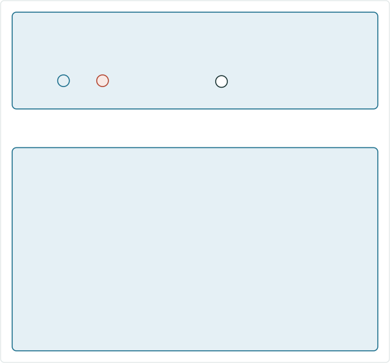
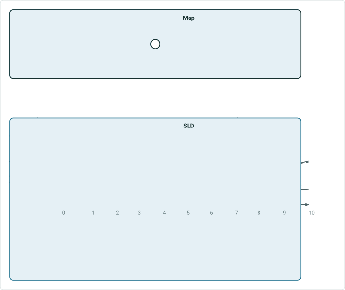
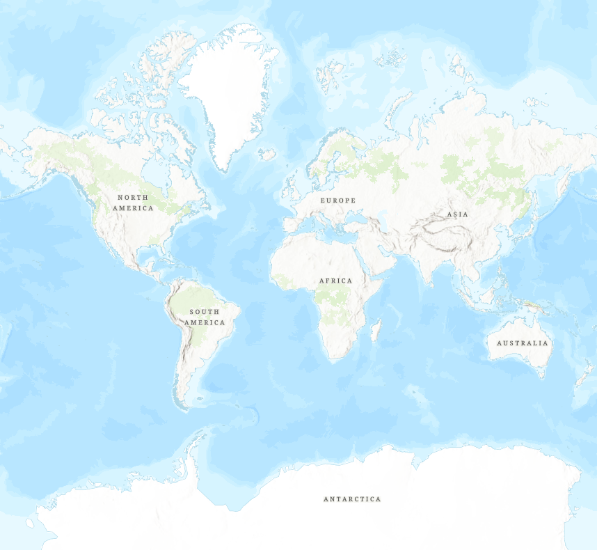
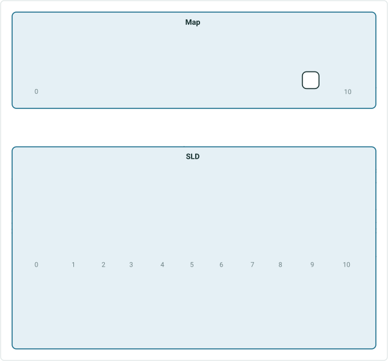
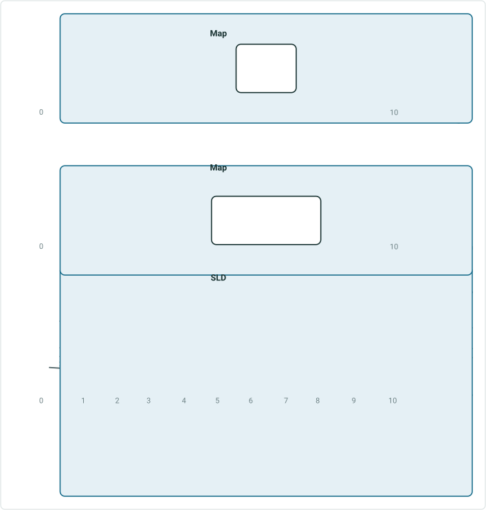
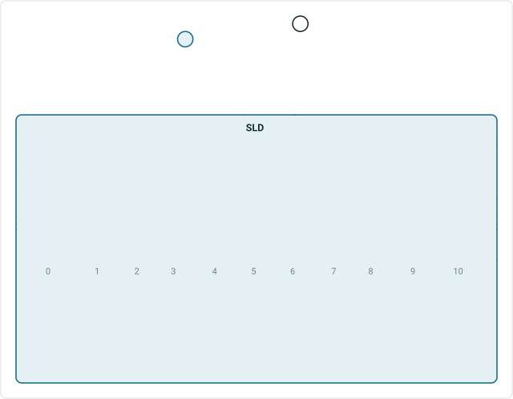
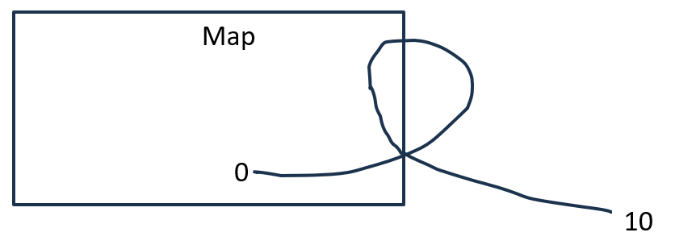

# Dynamic Segmentation: SLD Interaction with Map Test Plan

|   |   |
| --- | --- |
| **Kind** | Test Plan · Experience Builder |
| **Release** | — |
| **Product** | Roads & Highways · Pipeline Referencing · Utility Network |
| **Issue** | [Beijing-R-D-Center/ExperienceBuilder-Web-Extensions#24788](https://devtopia.esri.com/Beijing-R-D-Center/ExperienceBuilder-Web-Extensions/issues/24788) |
| **Source** | [24788-SLDInteractionwithMap_TestPlanV2.pptx](<https://esriis.sharepoint.com/sites/LocationReferencing/Shared%20Documents/LR%20Product%20Engineers/24788-SLDInteractionwithMap_TestPlanV2.pptx>) |
| **Edited** | 2025-05-13 22:22 by Mac Christmas |
| **Extracted** | 2026-09-04 · lane `xmlstrip` |

<!-- metadata
```yaml
title: "Dynamic Segmentation: SLD Interaction with Map Test Plan"
source_file: "24788-SLDInteractionwithMap_TestPlanV2.pptx"
source_url: "https://esriis.sharepoint.com/sites/LocationReferencing/Shared%20Documents/LR%20Product%20Engineers/24788-SLDInteractionwithMap_TestPlanV2.pptx"
doc_id: 175
doc_kind: "Test Plan"
surface: "Experience Builder"
doc_revision: "V2"
target_release: ""
pe: ""
dev: ""
author: "Mac Christmas"
last_edited_by: "Mac Christmas"
last_edited: "2025-05-13T22:22:46Z"
extracted: 2026-09-04
extraction_lane: xmlstrip
prompt_version: "v2.0.2"
keywords: ["dynamic segmentation", "straight line diagram", "sld", "map interaction", "sync", "route", "zoom", "measure"]
tools: []
products: ["Roads & Highways", "Pipeline Referencing", "Utility Network"]
issues: ["Beijing-R-D-Center/ExperienceBuilder-Web-Extensions#24788"]
related: [{"doc":191,"file":"experience-builder-sld-interaction-with-map__doc191.md","s":4.601},{"doc":151,"file":"dynamic-segmentation-widget__doc151.md","s":3.261},{"doc":76,"file":"dynamic-segmentation-widget-integration-with-oriented-imagery__doc76.md","s":3.189},{"doc":346,"file":"dynamic-segmentation-straight-line-diagram-support-exb__doc346.md","s":2.97},{"doc":57,"file":"dynamic-segmentation-widget__doc57.md","s":2.776}]
```
-->

## Summary

Test plan for the interaction between the Straight Line Diagram (SLD) component of Dynamic Segmentation and the map widget. It covers positive test cases for synchronization of scale, zoom, markers, and navigation between the SLD and map, including handling of complex route shapes and accessibility considerations.

## Related documents

<!-- related:begin -->
- [Experience Builder SLD Interaction with Map](<https://esriis.sharepoint.com/sites/lrsworkspace/LRS Doc Index/User Stories/experience-builder-sld-interaction-with-map__doc191.md>) — similar text 0.35 · 3 title words · 1 filename word · same surface <!-- rel:191 -->
- [Dynamic Segmentation widget](<https://esriis.sharepoint.com/sites/lrsworkspace/LRS Doc Index/Other/dynamic-segmentation-widget__doc151.md>) — similar text 0.18 · 2 title words · 1 filename word · same surface <!-- rel:151 -->
- [Dynamic Segmentation widget integration with Oriented Imagery](<https://esriis.sharepoint.com/sites/lrsworkspace/LRS Doc Index/User Stories/dynamic-segmentation-widget-integration-with-oriented-imagery__doc76.md>) — similar text 0.15 · 2 title words · same surface <!-- rel:76 -->
- [Dynamic Segmentation – Straight Line Diagram Support - ExB](<https://esriis.sharepoint.com/sites/lrsworkspace/LRS Doc Index/Test Plans/dynamic-segmentation-straight-line-diagram-support-exb__doc346.md>) — similar text 0.21 · 2 title words · same kind/surface <!-- rel:346 -->
- [Dynamic Segmentation widget](<https://esriis.sharepoint.com/sites/lrsworkspace/LRS Doc Index/Other/dynamic-segmentation-widget__doc57.md>) — similar text 0.18 · 2 title words · same surface <!-- rel:57 -->
<!-- related:end -->

<!-- docs:begin -->
## Esri documentation

[Apply dynamic segmentation](https://doc.esri.com/en/arcgis-pro/latest/help/production/roads-highways/apply-dynamic-segmentation.html) · [Split a centerline by measure](https://doc.esri.com/en/arcgis-pro/latest/help/production/roads-highways/split-a-centerline-by-measure.html)
<!-- docs:end -->

---

## Slide 1

Dynamic Segmentation: SLD Interaction with Map

| Positive Tests: SLD Interaction w/ Map Widget |
| --- |
| When toggling the sync button on/off, always honor the range in the SLD and update the map appropriately If ruler is single clicked, show a marker on the map that is at the same measure as the ruler location. Ensure the drill down is present. If drill down is active, we will keep the marker active in the map When user clicks off the ruler, remove the point on the map If scale is changed, zoom in/out in the map to match the SLD scale If horizontal scroll bar is used to navigate within the SLD, wait 1 second then move around in the map to reflect the new SLD view When sync is enabled, show markers for the ends of events within the SLD in the map When sync is enabled, ensure zoom level of map is not too zoomed in |

| Notes |
| --- |
| Add functionality to Dynamic Segmentation’s SLD component to interact with the map No new configuration options, a toggle button will be added to the SLD to turn sync with the map on/off Test with APR, UNAPR, and RH data Sanity test ADMRH and PoM data Test with PCS vs. GCS data Test with complex route shapes (loop, lollipop, barbell, alpha, branch, etc.) Test with routes with different direction orientations (horizontal moving West vs. East, Vertical moving North vs. South, diagonal moving NE vs. NW vs. SE vs. SW, multi-directional, etc.) Test SLD with dozens of layers to ensure performance is acceptable I18n and 508. Reach out to Chandan for 508 accessibility web app testing. |

Devtopia Issue

| Positive Tests: SLD Table UI |
| --- |
| Toggle button follows existing SLD style Toggle button can be updated with out-of-the-box themes Toggle button reflects active vs. non active state Toggle button is on by default Toggle button is accessible by keyboard navigation |

## Slide 2

| Positive Tests |
| --- |
| SLD displaying only portion of route, map shows only the portion displayed in SLD Map widget zoomed out past extent of route, SLD shows the full extent Map widget zoomed in greatly on route, SLD shows zoomed extent Map widget displaying area near route, last available display of SLD is shown in SLD. User re-toggles the sync option, map updates to zoom to portion of route displayed in SLD 5. Map widget displayed complex shape with self-intersecting measures. SLD displays the full range of measures displayed in the map |

| Positive Tests: Map Widget Interaction w/ SLD |
| --- |
| When moving around in the map, the SLD view will shift to match the displayed extent on the map When zooming in/out in the map, the SLD scale will change to reflect the measure range displayed in the map If the map is navigated to a location where the chosen route is no longer in view, keep the SLD at the last location that it can capture before the map is out of range 3a. After user has toggled the sync button off/on after zooming to a location off the route, ensure the map zooms back in to the displayed route measures at an appropriate scale If the map zoom extent is greater than the max zoom of the SLD, update the SLD to zoom out to the max scale Test all supported operations for map interaction, including mouse navigation (including map rotation w/ right click), keyboard navigation (arrow keys and A + S keys to rotate map), Default View button, Previous/Next extent buttons, Find my location button, Zoom In/Out buttons, Compass button, etc. Turn off Map widget’s Enable scroll zooming configuration option, ensure SLD interaction continues to work |

## Case 1 <!-- slide 3 -->

### SLD Displaying Only Portion of Route



**SLD displaying only portion of route, map shows only the portion displayed in SLD**
Portion of route displayed in SLD
Zoom level on map

Route start displayed in SLD
Route end displayed in SLD

## Case 2 <!-- slide 4 -->

### Map Widget Zoomed Out Far Past Extent of Route



**Map widget zoomed out far past extent of route, SLD shows whole route**
Full extent of route displayed in SLD
Zoom level on map



## Case 3 <!-- slide 5 -->

### Map Widget Zoomed in Greatly on Route



**Map widget zoomed in greatly on route, SLD shows zoomed extent**
Highlighted portion of route
Portion of route displayed in SLD, there is a threshold for zooming in, but the SLD will zoom in to the furthest it can

Zoom level on map

## Case 4 <!-- slide 6 -->

### Map Widget Displaying Area Near Route



**Map widget displaying area near route, last available display of SLD is shown in SLD. User re-toggles the sync option, map updates to zoom to portion of route displayed in SLD**
Portion of route displayed in SLD

Zoom level on map

Zoom level on map
Button is toggled back on

## Case 5 <!-- slide 7 -->

### Map Widget Displayed Complex Shape with Self-intersecting



**Map widget displayed complex shape with self-intersecting measures. SLD displays the full range of measures displayed in the map**

Portion of route displayed in SLD


