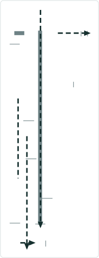
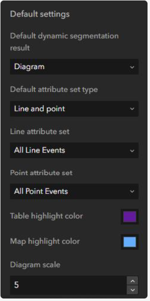
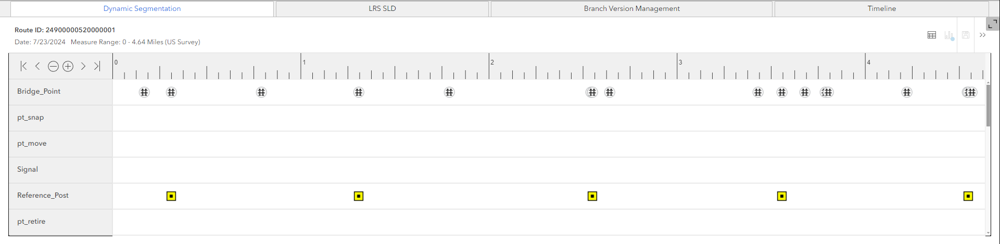

# Dynamic Segmentation – Straight Line Diagram Support - ExB

|   |   |
| --- | --- |
| **Kind** | Test Plan · Experience Builder |
| **Release** | — |
| **Product** | Roads & Highways · Pipeline Referencing |
| **Issue** | [Beijing-R-D-Center/ExperienceBuilder-Web-Extensions#20594](https://devtopia.esri.com/Beijing-R-D-Center/ExperienceBuilder-Web-Extensions/issues/20594) |
| **Source** | [DynSeg_SLD_ExB_TestPlan.pptx](<https://esriis.sharepoint.com/sites/LocationReferencing/Shared%20Documents/General/Test%20Plans/DynSeg_SLD_ExB_TestPlan.pptx>) |
| **Edited** | 2024-07-25 20:18 by Lakshmi Ananthanarayanan |
| **Extracted** | 2026-09-04 · lane `xmlstrip` |

<!-- metadata
```yaml
title: "Dynamic Segmentation – Straight Line Diagram Support - ExB"
source_file: "DynSeg_SLD_ExB_TestPlan.pptx"
source_url: "https://esriis.sharepoint.com/sites/LocationReferencing/Shared%20Documents/General/Test%20Plans/DynSeg_SLD_ExB_TestPlan.pptx"
doc_id: 346
doc_kind: "Test Plan"
surface: "Experience Builder"
doc_revision: ""
target_release: ""
pe: "Lakshmi"
dev: "Eric"
author: "Rahul Rakshit"
last_edited_by: "Lakshmi Ananthanarayanan"
last_edited: "2024-07-25T20:18:12Z"
extracted: 2026-09-04
extraction_lane: xmlstrip
prompt_version: "v2.0.2"
keywords: ["dynamic segmentation", "single line diagram", "experience builder", "route search", "timeline widget", "event layers", "attribute set"]
tools: ["Dynamic Segmentation"]
products: ["Roads & Highways", "Pipeline Referencing"]
issues: ["Beijing-R-D-Center/ExperienceBuilder-Web-Extensions#20594"]
related: [{"doc":161,"file":"view-only-non-editable-dynseg-sld-in-experience-builder-test-plan__doc161.md","s":1003.298},{"doc":71,"file":"test-plan-include-intersections-in-straight-line-diagram__doc71.md","s":5.46},{"doc":351,"file":"dynamic-segmentation-table-experience-builder-test-plan__doc351.md","s":5.016},{"doc":352,"file":"dynamic-segmentation-table-experience-builder-test-plan__doc352.md","s":4.679},{"doc":60,"file":"dynamic-segmentation-widget__doc60.md","s":3.925}]
```
-->

## Summary

Test plan for the Dynamic Segmentation widget's Single Line Diagram (SLD) support in ArcGIS Experience Builder. Covers setup, configuration, visualization, interaction, and various test cases including route search, identify, and network table behaviors. Includes verification of timeline widget integration, event layer handling, zooming, scrolling, and symbology reflection.

## Related documents

<!-- related:begin -->
- [View-only (non editable) DynSeg / SLD in Experience Builder – test plan](<https://esriis.sharepoint.com/sites/lrsworkspace/LRS Doc Index/Test Plans/view-only-non-editable-dynseg-sld-in-experience-builder-test-plan__doc161.md>) — shared issue Beijing-R-D-Center/ExperienceBuilder-Web-Extensions#20594 · similar text 0.19 · 1 filename word · same kind/surface/folder <!-- rel:161 -->
- [Test Plan: Include Intersections in Straight Line Diagram](<https://esriis.sharepoint.com/sites/lrsworkspace/LRS%20Doc%20Index/Test%20Plans/test-plan-include-intersections-in-straight-line-diagram__doc71.md>) — similar text 0.34 · 3 title words · 1 filename word · same kind/surface/folder <!-- rel:71 -->
- [Dynamic Segmentation Table Experience Builder Test Plan](<https://esriis.sharepoint.com/sites/lrsworkspace/LRS Doc Index/Test Plans/dynamic-segmentation-table-experience-builder-test-plan__doc351.md>) — similar text 0.30 · 2 title words · 2 filename words · same kind/surface/folder <!-- rel:351 -->
- [Dynamic Segmentation Table Experience Builder Test Plan](<https://esriis.sharepoint.com/sites/lrsworkspace/LRS Doc Index/Test Plans/dynamic-segmentation-table-experience-builder-test-plan__doc352.md>) — similar text 0.30 · 2 title words · 2 filename words · same kind/surface <!-- rel:352 -->
- [Dynamic Segmentation widget](<https://esriis.sharepoint.com/sites/lrsworkspace/LRS Doc Index/Other/dynamic-segmentation-widget__doc60.md>) — similar text 0.25 · 2 title words · 2 filename words · same surface <!-- rel:60 -->
<!-- related:end -->

<!-- docs:begin -->
## Esri documentation

[Apply dynamic segmentation](https://doc.esri.com/en/arcgis-pro/latest/help/production/roads-highways/apply-dynamic-segmentation.html)
<!-- docs:end -->

---

## Slide 1 — Dynamic Segmentation – Straight Line Diagram Support - ExB

User Story
Test Plan Author : Lakshmi
Developer: Eric

## Slide 2



- The initial state of the Dynseg SLD window is empty
- The Dynseg diagram can be populated by  using a data action called Dynamic Segmentation.
- In the configuration option for dynamic segmentation widget, verify the default option can be set to SLD.
- Verify the diagram measure scale option is available. This option is based on the network unit of measure. If it is miles, it defaults to 3  and if it is feet it defaults to 1000. Default is 3 miles and convert it to the same value for any unit of measure. (Discuss with Eric to finalize)
- Verify the scale can be changed by the user.
Line , Nonline (APR & RH)
Point , Line , Spanning Line event
Point , Line (including spanning line event), using both attribute sets



## Slide 3

Testing widget
Single Line Diagram

- Confirm that the SLD can be set up as a floating window.
- Confirm that the SLD can be docked in the app.
- Verify the Dynseg SLD is  populated by searching for a route and using a data action called Dynamic Segmentation.
- Verify the Dynseg SLD is populated by identifying a route  and using a data action called Dynamic Segmentation
- Verify the Dynseg SLD is  populated by selecting a route from network table and using a data action called Dynamic Segmentation
- Verify upon launching through data action if the default result option  is set to diagram it opens the Dynseg results in SLD.
- Verify from the  Dynseg SLD the users can switch back and forth between the table and the diagram
- Verify the date for the Dynseg is picked from the timeline widget, if no date is set then it defaults to today’s date.
- Verify only one route can be dynamically segmented.
- Verify the time range of visualization matches that of the table.
- Verify the dynamic segmentation  results of events matches that of the table
- Verify all the event layers within the attribute set(s) that belong to the network is shown
- Verify point events placed at the top of the diagram followed by line events
- Verify if more number of events are in the attribute set , vertical scrolling experience is shown
- Verify horizontal scrolling is seen if  zoomed into the SLD



## Slide 4

Testing widget
Single Line Diagram

- Verify the layers are orders as per the attribute set(s)
- Verify the layers can be turned on and off. When the layer is turned off, it goes to greyscale and move to the bottom and have the rectangle flattened
- Verify by default all the event layers in the chosen attribute set is on in the SLD
- Verify there are Zoom in, Zoom out option , option to move to the beginning or the end of the     route.
- Verify by default the SLD zooms to the diagram measure scale upon opening through data action
- verify the scroll wheel works while zooming in and out of the SLD.
23. Verify that the SLD can be exported (if it is not working  it will be covered in subsequent user stories)
24. In the Route Search, if:

  - No measures are provided, then in the SLD, Dynseg the complete route
  - A measure range is provided, then in the SLD, Dynseg between that range on that route
  - If a single measure is searched return the complete route
  - A line and measure is searched, then in the SLD, Dynseg a selected route (that is part of the line) from the results


## Slide 5

Test Cases
Single Line Diagram
Timeline:
1. Configure the timeline widget to Today’s date
         a.) Search for a route which is current.
         b.)  Identify a route which is current
         c.) Select a route from the network table which is current
For all the above cases, SLD will be drawn for the Today’s date containing all the events belonging to the route which are available on today’s date.
2. Configure the timeline widget to Today’s date
         a .) Search for a route which is past.
         b.)  Identify a route which is past
         c.) Select a route from the network table which is past
For all the above cases, SLD will note be drawn and a message letting the user know that the selected route is out of date for SLD will be provided

3. Configure the timeline widget with Start time and End time
        a .) Search for a route which is current.
         b.)  Identify a route which is current
         c.) Select a route from the network table which is current
For all the above cases, SLD will be drawn for the from date provided in the timeline widget containing all the events belonging to the route which are available on that date.
4. Configure the timeline widget with Start time and End time
	a .) Search for a route which is past.
               b.)  Identify a route which is past
                c.) Select a route from the network table which is past
For all the above cases, SLD will note be drawn and a message letting the user know that the selected route is out of date for SLD will be provided.

5. Do not configure the timeline widget and SLD should default to Today’s Date.

## Slide 6

Test Cases
Single Line Diagram
Search by Route
5. Search by route using route and measure method and do not provide any measure value,                 SLD should be drawn for the entire route

 6. Search for the route using route and measure method and provide a single measure value or multiple single measure values.  Select any of the route from the search result, SLD should be drawn for the entire route

7. Search for the route using route and measure method and search for a range of measure, SLD should be drawn for searched measure range

8. Search by route using other methods  and test whether SLDs are drawn from the search results.

Identify

9. Identify a route and launch the Dynseg SLD through data action. SLD will be drawn for the events present at the from date of the time slider/timeline widget.

10. Identify a route with multiple time slices, select the past time slice in the identify widget and launch the Dynseg SLD through data action. Irrespective of time slice chosen in the identify widget, SLD will be drawn for the events present at the from date of the time slider/timeline widget.

## (Check with Eric for these test cases <!-- slide 7 -->

Test Cases
Single Line Diagram

Network Table
11. Selecting a single record, show the data action for Dynseg.
12. If more than one record is selected do not show the data action for Dynseg.
13. If no selection, do not show the data action for Dynseg
 14. Data action will not be shown in the event tables.
(Check with Eric for these test cases)

Other test cases

15.  Change the symbology of the layer in the web map and check whether the changes are reflected in the SLD
16.  Test with more events
17.  Select only point event attribute set and create a SLD for a route
18.  Test cases from the Dynseg test plan for  Pro will be tested to cover the functional testing of dynamic segmentation covering complex routes, gapped routes and events include point events, spanning and non spanning line events. ( cover most of the functional test cases and make sure the test results are correct)
Verify few  cases and check  the results are correct in both SLD and table.

Automation:
No automation as of now

Documentation
Add information about the diagram option to the existing Dynamic Segmentation widget topic
