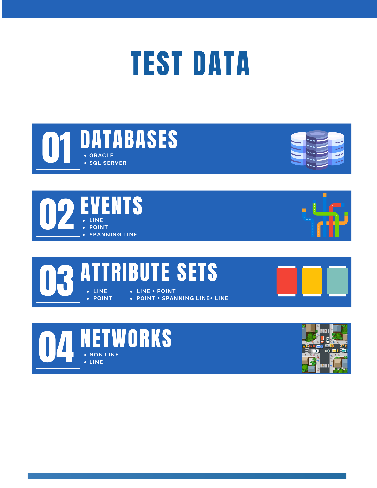
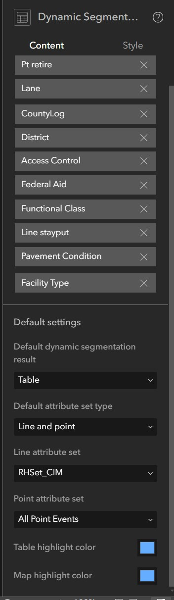
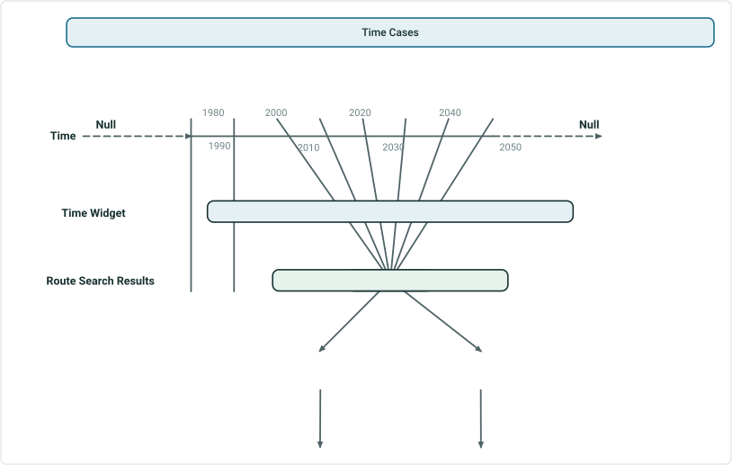
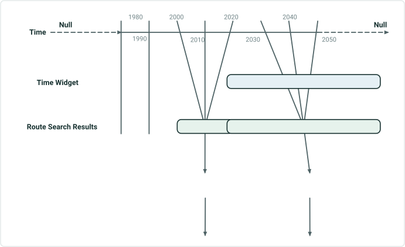

# Dynamic Segmentation Table Experience Builder Test Plan

|   |   |
| --- | --- |
| **Kind** | Test Plan · Experience Builder |
| **Release** | — |
| **Source** | [DynSeg_Table_ExB_TestPlan1.pptx](<https://esriis.sharepoint.com/sites/LocationReferencing/Shared%20Documents/General/Test%20Plans/DynSeg_Table_ExB_TestPlan1.pptx>) |
| **Edited** | 2024-07-16 17:31 by Rahul Rakshit |
| **Extracted** | 2026-09-04 · lane `xmlstrip` |

<!-- metadata
```yaml
title: "Dynamic Segmentation Table Experience Builder Test Plan"
source_file: "DynSeg_Table_ExB_TestPlan1.pptx"
source_url: "https://esriis.sharepoint.com/sites/LocationReferencing/Shared%20Documents/General/Test%20Plans/DynSeg_Table_ExB_TestPlan1.pptx"
doc_id: 351
doc_kind: "Test Plan"
surface: "Experience Builder"
doc_revision: ""
target_release: ""
pe: ""
dev: ""
author: "Rahul Rakshit"
last_edited_by: "Rahul Rakshit"
last_edited: "2024-07-16T17:31:20Z"
extracted: 2026-09-04
extraction_lane: xmlstrip
prompt_version: "v2.0.2"
keywords: ["dynamic segmentation", "experience builder", "route", "event attributes", "time slice", "editing", "data validation"]
tools: ["Dynamic Segmentation"]
products: []
issues: []
related: [{"doc":352,"file":"dynamic-segmentation-table-experience-builder-test-plan__doc352.md","s":9.746},{"doc":337,"file":"dynamic-segmentation-table-test-plan-options__doc337.md","s":5.223},{"doc":346,"file":"dynamic-segmentation-straight-line-diagram-support-exb__doc346.md","s":5.016},{"doc":362,"file":"experience-builder-dynamic-segmentation-widget__doc362.md","s":4.312},{"doc":592,"file":"dynamic-segmentation-merge-option-test-plan__doc592.md","s":3.635}]
```
-->

## Summary

This document outlines acceptance and functional testing criteria for the Dynamic Segmentation table widget in Experience Builder. It covers configuration, editing behaviors, time slice filtering, and data validation for route and event attributes. The plan includes tests for editing, saving, domain enforcement, and large dataset handling to ensure consistency with ArcGIS Pro dynamic segmentation.

## Related documents

<!-- related:begin -->
- [Dynamic Segmentation Table Experience Builder Test Plan](<https://esriis.sharepoint.com/sites/lrsworkspace/LRS Doc Index/Test Plans/dynamic-segmentation-table-experience-builder-test-plan__doc352.md>) — similar text 0.90 · 5 title words · 3 filename words · same kind/surface <!-- rel:352 -->
- [Dynamic Segmentation Table Test Plan Options](<https://esriis.sharepoint.com/sites/lrsworkspace/LRS Doc Index/Test Plans/dynamic-segmentation-table-test-plan-options__doc337.md>) — similar text 0.22 · 3 title words · 3 filename words · same kind/surface/folder <!-- rel:337 -->
- [Dynamic Segmentation – Straight Line Diagram Support - ExB](<https://esriis.sharepoint.com/sites/lrsworkspace/LRS Doc Index/Test Plans/dynamic-segmentation-straight-line-diagram-support-exb__doc346.md>) — similar text 0.30 · 2 title words · 2 filename words · same kind/surface/folder <!-- rel:346 -->
- [Experience Builder Dynamic Segmentation widget](<https://esriis.sharepoint.com/sites/lrsworkspace/LRS Doc Index/User Stories/experience-builder-dynamic-segmentation-widget__doc362.md>) — similar text 0.24 · 4 title words · 1 filename word · same surface <!-- rel:362 -->
- [Dynamic Segmentation Merge Option Test Plan](<https://esriis.sharepoint.com/sites/lrsworkspace/LRS Doc Index/Test Plans/dynamic-segmentation-merge-option-test-plan__doc592.md>) — similar text 0.11 · 2 title words · same kind/surface/folder <!-- rel:592 -->
<!-- related:end -->

<!-- docs:begin -->
## Esri documentation

[Apply dynamic segmentation](https://doc.esri.com/en/arcgis-pro/latest/help/production/location-referencing-pipelines/apply-dynamic-segmentation.html) · [Event editing using the attribute table](https://doc.esri.com/en/arcgis-pro/latest/help/production/location-referencing-pipelines/event-editing-using-the-attribute-table.html) · [Edit feature services](https://doc.esri.com/en/arcgis-pro/latest/help/production/location-referencing-pipelines/edit-feature-services.html)
<!-- docs:end -->

---

## Slide 1

## Slide 2



## Slide 3

Acceptance Testing

- Highlight color of the row in the table.
- Highlight color of the section in the map.
- Line attribute set is set up as default.
- Point attribute set can be selected.
Configuration
Table

- Confirm that the table can be set up as a floating window.
- Confirm that the table can be docked in the app.
- The initial state of the table is empty.
- The Dynseg table can be populated by searching for a route and using a data action called Dynamic Segmentation.
- The display precision of the Network is used to show the measures in the table
- Only one route can be dynamically segmented.
- In the Route Search, if:
  - No measures are provided, then in the table, Dynseg the complete route
  - A measure range is provided, then in the table, Dynseg between that range on that route
  - A line and measure is searched, then in the table, Dynseg a route (that is part of the line) from the results
- Only event’s business fields can be edited.
- If a row in the table is selected, then highlight the section of the route (confirm the from and to measures)
The following is configurable



## Slide 4

Acceptance Testing
Table

- When a cell is edited, and the focus has moved away from it, the color of the cell turns to yellow until the save button is pushed.
- When a cell is edited and the user tries to close the app without saving, then a prompt is seen about unsaved edits.
- Only line event’s business fields are editable when the Type field is Line.
- Only point event’s business fields are editable when the Type field is Point.
- Test with the following field with:
  - Coded value domain
  - Range domain
  - Attribute rules
  - Subtypes
  - Contingent values
  - Default value set
  - Null values not allowed

## Slide 5



If this time slice is selected
No result generated for dynseg
No result generated for dynseg
If this time slice is selected

- The only thing that matters is the from date of the time filter/slider. The dynseg will take place only for the routes and events that are present on the from date of the time slider.
- If the time slider is set to a point in time, then that date is used to dynseg.
- If no time slider/filter widget is configured, then today’s date is used to dynseg.

## Slide 6



If this time slice is selected
Table date will be 2010 and the routes and events available in 2010 will be used for dynseg
If this time slice is selected
Table date will be 2010 and the routes and events available in 2010 will be used for dynseg

- The only thing that matters is the from date of the time filter/slider. The dynseg will take place only for the routes and events that are present on the from date of the time slider.
- If the time slider is set to a point in time, then that date is used to dynseg.
- If no time slider/filter widget is configured, then today’s date is used to dynseg.

## The dynseg test plan from Pro will be used for test cases <!-- slide 7 -->

Functional Testing

- Perform the same operation (Route + Attribute Sets) in Pro DynSeg and in ExB. The results should be same for a point in time, where time = The from date of the time slider in ExB.
      The dynseg test plan from Pro will be used for test cases.

- When a cell is edited and saved, the edits go to the selected version in the map.
- Once you make an edit and save, then verify that the individual event’s attribute table is updated, and shape is generated.
- Test with hundred of thousands of records (ILI)
- Test with Cracking Line event + Other events using INDOT dataset.
- Verify that non-allowed values are not transferred from the Dynseg table to the event tables. E.g. A value of out range for a field where range domain is set.
- Domains are copied over from the underlying point event tables so that user has them available when editing the data in the dynamic segmentation table.
- The following fields types are supported (provided they are the characteristic fields)
  - Text
  - Numeric
  - Date
  - Guid
- A dynseg table is still generated if there exists only point events but no line events for the selected route.
- The type field is non editable.
