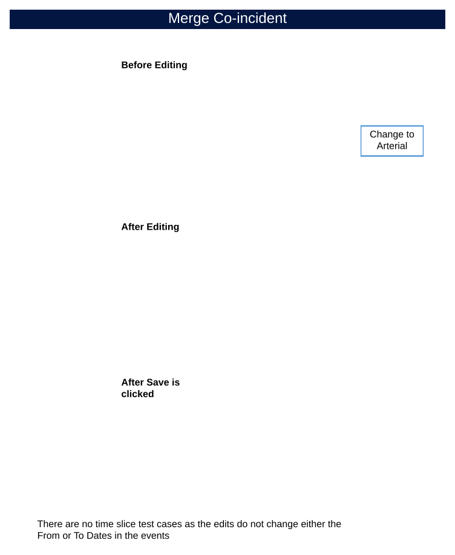
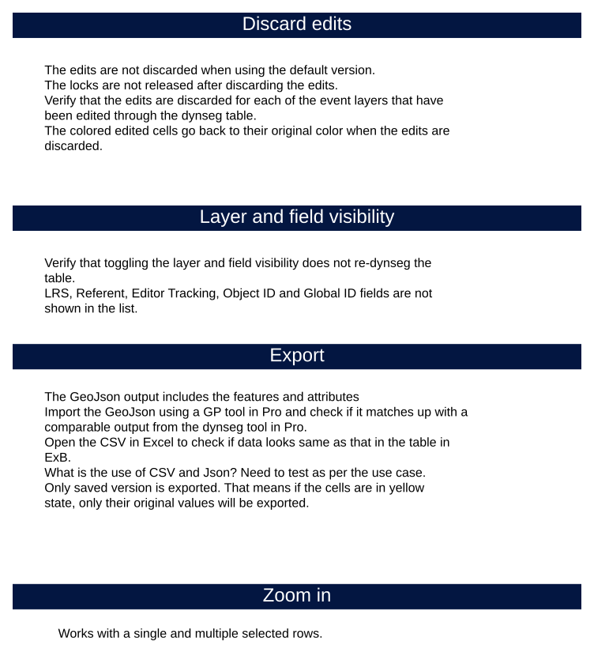

# Dynamic Segmentation Table Test Plan Options

| Field | Value |
| --- | --- |
| **Doc** | 337 · Test Plan · Experience Builder |
| **Product** | — |
| **Release** | — |
| **Issues** | — |
| **Source** | [DynSegTable_TestPlan_Options1.pptx](<https://esriis.sharepoint.com/sites/LocationReferencing/Shared%20Documents/General/Test%20Plans/DynSegTable_TestPlan_Options1.pptx>) |
| **People** | author Rahul Rakshit · PE — · dev — |
| **Edited** | 2024-08-15 22:21 by Rahul Rakshit |
| **Extracted** | 2026-09-04 · lane xmlstrip · format 3.0 · prompt v2.0.2 |
| **Keywords** | dynamic segmentation table · merge co-incident events · field calculator · export · discard edits · zoom · layer visibility |
| **Tools** | Dynamic Segmentation Table |

## Summary

Test plan for dynamic segmentation table features including merge co-incident events, field calculator, layer visibility, export functionality, discard edits, and zooming behavior. Covers configuration options, field types supported by the calculator, error handling, and export formats such as CSV, Json, and GeoJson. Includes acceptance criteria for editing, locking, and discard behavior in the dynamic segmentation table within Experience Builder.

## Related documents

<!-- related:begin -->
- [Experience Builder Dynamic Segmentation Widget Additional Options](<https://esriis.sharepoint.com/sites/lrsworkspace/LRS Doc Index/User Stories/exb-dynseg-widget-additional-options.md>) — similar text 0.29 · 3 title words · 2 filename words · same surface <!-- rel:361 s=5.669 -->
- [Dynamic Segmentation Table Experience Builder Test Plan](<https://esriis.sharepoint.com/sites/lrsworkspace/LRS Doc Index/Test Plans/dynseg-table-exb-2024-07.md>) — similar text 0.22 · 3 title words · 3 filename words · same kind/surface/folder <!-- rel:351 s=5.223 -->
- [Dynamic Segmentation Table Experience Builder Test Plan](<https://esriis.sharepoint.com/sites/lrsworkspace/LRS Doc Index/Test Plans/dynseg-table-exb-2024-07-2.md>) — similar text 0.22 · 3 title words · 3 filename words · same kind/surface <!-- rel:352 s=4.722 -->
- [Dynamic Segmentation – Straight Line Diagram Support - ExB](<https://esriis.sharepoint.com/sites/lrsworkspace/LRS Doc Index/Test Plans/20594-dynseg-sld-support-exb.md>) — similar text 0.17 · 2 title words · 2 filename words · same kind/surface/folder <!-- rel:346 s=4.183 -->
- [Search by Route Results Table Test Plan](<https://esriis.sharepoint.com/sites/lrsworkspace/LRS%20Doc%20Index/Test%20Plans/search-by-route-results-table.md>) — similar text 0.10 · 1 title word · 1 filename word · same kind/surface/folder <!-- rel:350 s=3.257 -->
<!-- related:end -->

<!-- docs:begin -->
## Esri documentation

_No page matched:_ [Dynamic Segmentation Table](https://www.google.com/search?q=%22Dynamic%20Segmentation%20Table%22+site%3Adoc.esri.com)
<!-- docs:end -->

---

## Slide 1

## Slide 2

## Slide 3 — The following is configurable

- Merge co-incident events checkbox. Default False.
- Confirm that a field calculator button is added. This will be always available.
- Confirm that a select layers button is added. This will be always available.
- Confirm that an Export button is added. This will be always available.
- Confirm that the discard edits button is provided. Enabled only when edits exist.
- The field calculator is available for all field types outlined in next page.
- The existing pattern for zooming is followed.
- When multiple rows are selected in the table, perform a zoom extent.
- Turning off a layer in the UI should remove the contents of that layers from the dynseg table.
- All point events can be turned off and all line events except one can be turned off.
- Support the following formats: CSV, Json and GeoJson
- Only exporting all records is supported.
- The existing ExB pattern for export is followed.
- The button is enabled only when an edit has taken place.

[figure: Acceptance Testing · Configuration · Table · Field Calculator · Zoom to Selected · Layers on/off · Export · Discard edits]

## Slide 4

| Measure Range | Type | Speed | Functional Class |
| --- | --- | --- | --- |
| 0 - 1 | Line | 25 | Local |
| 1 - 2 | Line | 40 | Local |
| 2 - 3 | Line | 50 | Local |
| 3 - 4 | Line | 50 | Arterial |

| Measure Range | Type | Speed | Functional Class |
| --- | --- | --- | --- |
| 0 - 1 | Line | 25 | Local |
| 1 - 2 | Line | 40 | Local |
| 2 - 3 | Line | 50 | Arterial |
| 3 - 4 | Line | 50 | Arterial |

| Measure Range | Type | Speed | Functional Class |
| --- | --- | --- | --- |
| 0 - 1 | Line | 25 | Local |
| 1 - 2 | Line | 40 | Local |
| 2 - 4 | Line | 50 | Arterial |

After Save is clicked
There are no time slice test cases as the edits do not change either the From or To Dates in the events

[figure: Merge Co-incident · Change to Arterial · Before Editing · After Editing]

## Slide 5 — Calculate field

| Measure Range | Type | Bridge | Speed | Functional Class |
| --- | --- | --- | --- | --- |
| 0 - 1 | Line |  | 25 | Local |
| 1 - 1 | Point | X | 25 | Local |
| 1 - 2 | Line |  | 40 | Local |
| 2 - 4 | Line |  | 50 | Arterial |

Before Editing

| Measure Range | Type | Bridge | Speed | Functional Class |
| --- | --- | --- | --- | --- |
| 0 - 1 | Line |  | 40 | Local |
| 1 - 1 | Point | X | 40 | Local |
| 1 - 2 | Line |  | 40 | Local |
| 2 - 4 | Line |  | 40 | Arterial |

Calculate Speed = 40
After Editing

## Slide 6 — Calculate field with Merge co-incident

| Measure Range | Type | Bridge | Speed | Functional Class |
| --- | --- | --- | --- | --- |
| 0 - 1 | Line |  | 25 | Local |
| 1 - 2 | Line |  | 40 | Local |
| 2 - 4 | Line |  | 50 | Arterial |
| 4 - 4 | Point | X | 50 | Arterial |

Before Editing
Calculate Speed = 40
After Editing

| Measure Range | Type | Bridge | Speed | Functional Class |
| --- | --- | --- | --- | --- |
| 0 - 2 | Line |  | 40 | Local |
| 2 - 4 | Line |  | 40 | Arterial |
| 4 - 4 | Point | X | 40 | Arterial |

## Slide 7 — Other tests for field calculator

- Edit the following field types:
  - Text
  - Coded value domain: Show drop-down with domain values
  - Range values
  - Short
  - Long
  - Big Integer
  - Float
  - Double
  - Date
  - Date only: Show date picker
  - Time only
  - With contingent values
  - With related tables
  - Subtypes
  - Default value set
  - Null values not allowed
- Locks are transferred when edited by another user in the same version.
- LRS, Referent, Editor Tracking, Object ID and Global ID fields are not shown in the list.
- The updated cells are colored.
- The change takes place for the entire field irrespective of row selection.
- Show an error if
  - The calculated value is out of range
  - The input type is not supported by the field. E.g., Text value in a numeric field
  - Route/Line is already locked by another user
  - Route/Line is already locked by same user in another version
  - Field length out of range

## Slide 8 — Discard edits

- The edits are not discarded when using the default version.
- The locks are not released after discarding the edits.
- Verify that the edits are discarded for each of the event layers that have been edited through the dynseg table.
- The colored edited cells go back to their original color when the edits are discarded.

Layer and field visibility

- Verify that toggling the layer and field visibility does not re-dynseg the table.
- LRS, Referent, Editor Tracking, Object ID and Global ID fields are not shown in the list.
Export

- The GeoJson output includes the features and attributes
- Import the GeoJson using a GP tool in Pro and check if it matches up with a comparable output from the dynseg tool in Pro.
- Open the CSV in Excel to check if data looks same as that in the table in ExB.
- What is the use of CSV and Json? Need to test as per the use case.
- Only saved version is exported. That means if the cells are in yellow state, only their original values will be exported.
Zoom in

- Works with a single and multiple selected rows.

