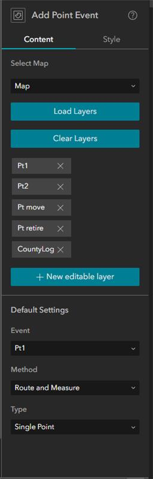
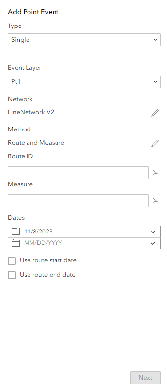
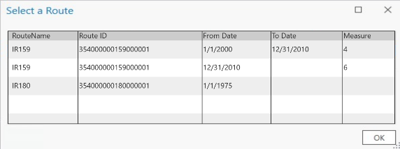
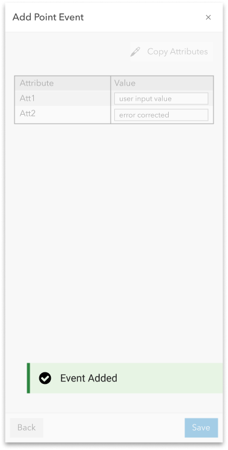
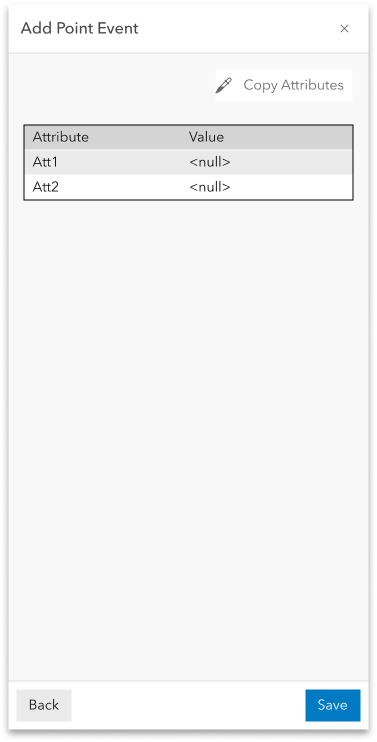
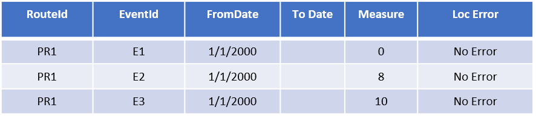
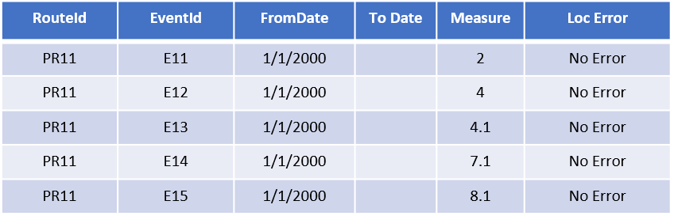
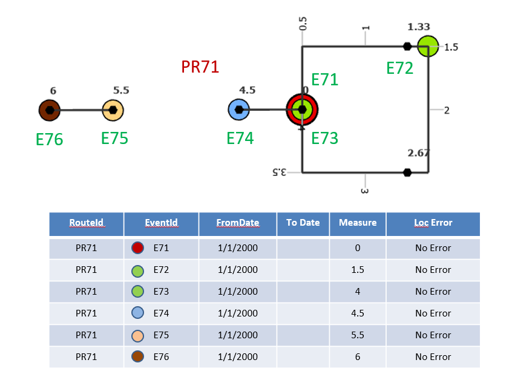

# Experience Builder: Add Single Point Event Widget

| Field | Value |
| --- | --- |
| **Doc** | 463 · Test Plan · Experience Builder |
| **Product** | — |
| **Release** | — |
| **Issues** | — |
| **Source** | [ExB_AddSinlgePointEvent.docx](<https://esriis.sharepoint.com/sites/LocationReferencing/Shared%20Documents/General/Test%20Plans/ExB_AddSinlgePointEvent.docx>) |
| **People** | author Praveen Kumar · PE — · dev — |
| **Edited** | 2023-11-09 21:28 by Johum Khushk |
| **Extracted** | 2026-09-04 · lane xmlstrip · format 3.0 · prompt v2.0.2 |
| **Keywords** | point event · event layer · route picker · measure picker · attribute editing · error handling · experience builder widget |
| **Tools** | Add Single Point Event |

## Summary

Test plan for the Add Single Point Event widget in Experience Builder. Covers configuration validation, UI tests for event layer selection and attribute editing, error handling, and functional tests including accessibility and internationalization. Ensures correct behavior with route and measure inputs, field aliasing, and attribute rules.

## Related documents

<!-- related:begin -->
- [Experience Builder: Add Single Line Event Widget](<https://esriis.sharepoint.com/sites/lrsworkspace/LRS Doc Index/User Stories/16340-exb-add-single-line-event-widget.md>) — similar text 0.46 · 6 title words · 2 filename words · same surface/folder <!-- rel:455 s=6.683 -->
- [Add Point Event Experience Builder Widget](<https://esriis.sharepoint.com/sites/lrsworkspace/LRS Doc Index/User Stories/add-point-event-exb-widget.md>) — similar text 0.36 · 6 title words · 2 filename words · same surface <!-- rel:497 s=5.719 -->
- [Add Multiple Point Events](<https://esriis.sharepoint.com/sites/lrsworkspace/LRS Doc Index/Test Plans/add-multiple-point-events-2024-01.md>) — similar text 0.45 · 2 title words · 2 filename words · same kind/surface/folder <!-- rel:434 s=5.696 -->
- [Add Point Events in Experience Builder](<https://esriis.sharepoint.com/sites/lrsworkspace/LRS Doc Index/User Stories/add-point-events-in-exb-2023-09-2.md>) — similar text 0.38 · 4 title words · 2 filename words · same surface <!-- rel:496 s=5.261 -->
- [Add Point Events in Experience Builder](<https://esriis.sharepoint.com/sites/lrsworkspace/LRS Doc Index/User Stories/add-point-events-in-exb-2023-09.md>) — similar text 0.38 · 4 title words · 2 filename words · same surface <!-- rel:495 s=5.252 -->
<!-- related:end -->

<!-- docs:begin -->
## Esri documentation

[Event editing using the attribute table](https://doc.esri.com/en/arcgis-pro/latest/help/production/location-referencing-pipelines/event-editing-using-the-attribute-table.html)

_No page matched:_ [Add Single Point Event](https://www.google.com/search?q=%22Add%20Single%20Point%20Event%22+site%3Adoc.esri.com)
<!-- docs:end -->

---

## Overview

### Experience Builder: Add Single Point Event Widget

### Configuration

[figure: Do we have these? · yes]

1. Verify any map can be selected from the list.

1. Verify all the point event layers from the selected map are imported.

1. Verify the reordering of the imported point event layers.

1. Verify the layer is removable using ‘x’.

1. Changing map and importing again should clear present list of layers and import the point layers from the new map.

1. When the event layer is selected under Default Settings, make sure ‘Method’ and ‘Type’ auto populates with correct values.

1. Test loading, line event layers – should not be able to load.

1. Toggle ‘Use field alias’ on and off, make sure correct field names display below.

1. Turn fields on/off under ‘Configure Fields’ – verify only business fields are shown and edit, LRS fields and System fields should not be listed in the configuration.

1. Verify the reordering of the fields, selecting/ unselecting (display + editing)

1. Choose a map which does not have any point event layers and verify an error message is displayed.

1. Test with map that has no networks (Networks are required to be configured and for the picker to work)

1. If there is no LRS enabled service in the webmap, make sure any event layers are not shown and a message is provided that no LRS enabled service is present.

1. Verify, user can import all the layers from the map using the Load Layers button.

1. Verify, user can add any missing layer using the ‘New editable Layer’ option? After discussion in scrum, it was removed

1. Verify error message if the map has layers from more than one service.

1. Verify, user can change the label in the layer configuration

### UI Tests – First Pane

1. Test with both Line, Non-line (single + multi field) Network

1. Type and Event layer should be as per the settings from the configuration.

1. Verify that the default option is “Using route and measure”

1. Verify that the default for ‘Event Layer’ is the layer configured
and verify that the Network is automatically set to the registered network of the selected event layer

1. RouteID and Measure should be empty until the user types or select using the picker tools

1. Verify the route and measure values are correct when pickers interact with the route on map

1. Verify that the measure units are set to the network units & tolerance

1. Provide some measures in stationing format

1. Verify the ‘Route Name” is displayed instead of route id for the events configured with route name

1. Verify that the route selector UI is shown when the user clicks a location with the route picker that has more than one route at that location

1. Verify the intellisense experience for RouteID/Name (after the 3rd character is typed)

1. Verify the route flashes 3 times, once it is chosen on the map using the route picker

1. Verify the green dot at that location, when a measure on a route is selected on the map using the measure picker

1. Verify that the Date text boxes are populated with the current date by default & empty End Date

1. Test with and without additional attributes for the event fields

1. 508 testing

1.  i18n testing

1. Make sure coded value domains, range domains, subtypes, non-nullable fields, and default values for any fields where applicable are honored

1. Verify, routes listed in the selector should be filtered based on the timeline settings of the map.

1. Verify, user should not be able to change the network, method until the measure translation is supported

## Test Cases

### TC-N01 — User Clicks Next Without Filling Routeid – Verify Error Message <!-- src: S6 · case 1 -->

### TC-N02 — User Clicks Next Without Filling Measure – Verify Error Message <!-- src: S6 · case 1 -->

### TC-N03 — User Clicks Next Without Filling the From Date - Verify Error Message <!-- src: S6 · case 1 -->

1. Verify error message when the routeid / route name / measures are invalid

1. Verify error message when from date is less than or equal to the to date

1. Verify the routeid \ routename\ measure exists in the provided date and are validated

### TC-N04 — Make Sure the Attribute Fields as per the Configuration Settings of the Event <!-- src: S6 · case 1 -->

- **Case:** Make sure the attribute fields as per the configuration settings of the event layer selected.

1. Verify user can enter\edit values for the editable fields.

1. Verify, coded value domains, range domains, subtypes, non-nullable fields, attribute rules, contingent values and default values for any fields work as expected

### TC-N05 — If the User Clicks Save <!-- src: S6 · case 1 -->

- **Case:** If the user clicks Save, make sure a confirmation message appears and edit goes through!

1. Verify, once the operation is complete, the 2nd pane transitions back to the initial pane

### TC-N06 — If the User Clicks Back <!-- src: S6 · case 1 -->

- **Case:** If the user clicks Back, go back to the previous step make sure entered values are preserved

### TC-N07 — If Any Fields Are Not Populated Correctly <!-- src: S6 · case 1 -->

- **Case:** If any fields are not populated correctly, make sure appropriate error for the field(s) is displayed, that need to be updated.

1. Verify, when hovered on the field, description is displayed.

## Other content

### Other Tests

1. Add a test scenario where an attribute rule is violated and make sure an appropriate error message is returned

1. Test on projected and unprojected data.

1. Test on different themes

### Functional Tests (From Previous Test Plan)

[figure: E3]

[figure: E2]

[figure: E1]

[figure: 10]

[figure: 0]

[figure: PR1]

[figure: 8.1]

[figure: 0]

[figure: 4.1]

[figure: 4]

[figure: E11]

[figure: PR11]

[figure: E12]

[figure: E13]

[figure: E14]

[figure: E15]

[figure: 0]

[figure: 4]

[figure: 1.33]

[figure: 2.67]

[figure: E21]

[figure: PR21]

[figure: E22]

[figure: E23]

[figure: 6]

[figure: 4]

[figure: 4]

[figure: 0]

[figure: PR31]

[figure: E33]

[figure: E34]

[figure: E31]

[figure: E32]

[figure: 0]

[figure: 8]

[figure: 4.33]

[figure: 5.67]

[figure: 1.5]

[figure: 7.5]

[figure: PR41]

[figure: E42]

[figure: E41]

[figure: E44]

[figure: E43]

