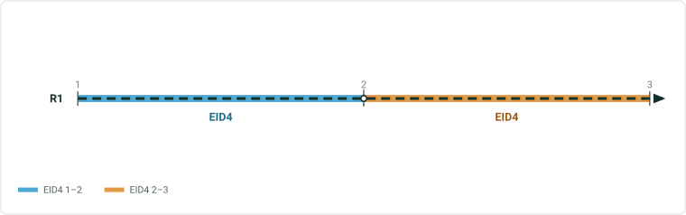
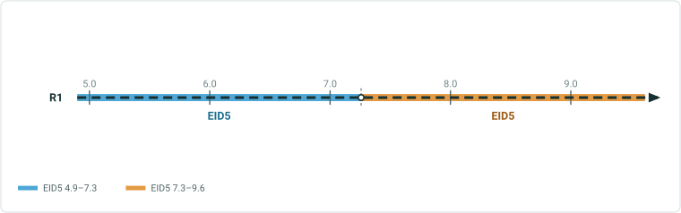
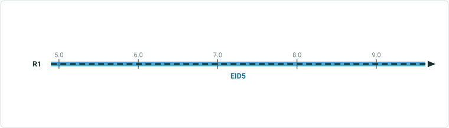
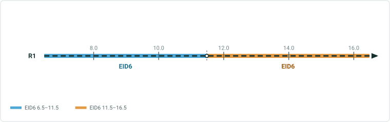
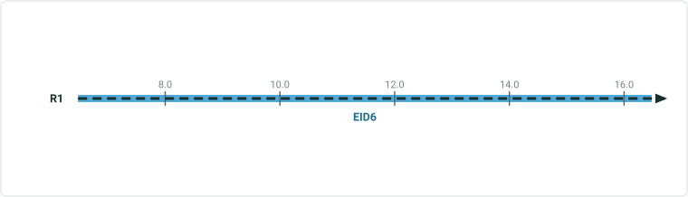
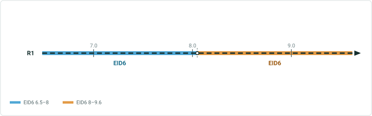
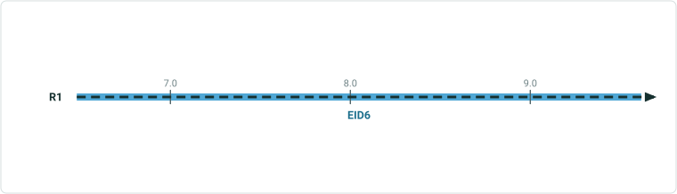
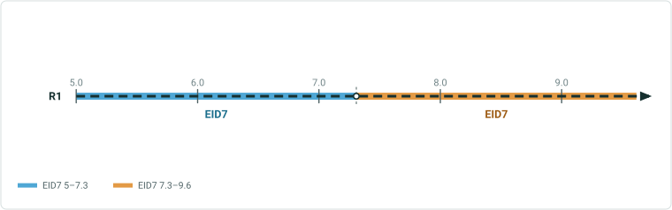

# ExB: Auto-Populate Referents for Add Point and Add Line widgets Test Plan

|   |   |
| --- | --- |
| **Kind** | Test Plan · Experience Builder |
| **Release** | — |
| **Issue** | [Beijing-R-D-Center/ExperienceBuilder-Web-Extensions#26358](https://devtopia.esri.com/Beijing-R-D-Center/ExperienceBuilder-Web-Extensions/issues/26358) |
| **Source** | [26358_PopulateReferentsOnNewlyCreatedEventsInAddPtAddLnEventWidgets_TestPlan.pptx](<https://esriis.sharepoint.com/sites/LocationReferencing/Shared%20Documents/General/Test%20Plans/26358_PopulateReferentsOnNewlyCreatedEventsInAddPtAddLnEventWidgets_TestPlan.pptx>) |
| **Edited** | 2026-08-31 19:44 by Kevin Roper |
| **Extracted** | 2026-09-04 · lane `xmlstrip` |

<!-- metadata
```yaml
title: "ExB: Auto-Populate Referents for Add Point and Add Line widgets Test Plan"
source_file: "26358_PopulateReferentsOnNewlyCreatedEventsInAddPtAddLnEventWidgets_TestPlan.pptx"
source_url: "https://esriis.sharepoint.com/sites/LocationReferencing/Shared%20Documents/General/Test%20Plans/26358_PopulateReferentsOnNewlyCreatedEventsInAddPtAddLnEventWidgets_TestPlan.pptx"
doc_id: 906
doc_kind: "Test Plan"
surface: "Experience Builder"
doc_revision: ""
target_release: ""
pe: "Kevin"
dev: "Prutha"
author: "kroper@esri.com"
last_edited_by: "Kevin Roper"
last_edited: "2026-08-31T19:44:16Z"
extracted: 2026-09-04
extraction_lane: xmlstrip
prompt_version: "v2.0.2"
keywords: ["referent", "add point event", "add line event", "coordinates method", "location offset", "route and measure", "experience builder widget"]
tools: []
products: []
issues: ["Beijing-R-D-Center/ExperienceBuilder-Web-Extensions#26358"]
related: [{"doc":2,"file":"iteration-planning-and-issue-tracking-for-location-referencing-3-8-12-2__doc2.md","s":1001.234},{"doc":48,"file":"location-offset-method-in-add-line-and-add-point-widgets-test-plan__doc48.md","s":5.223},{"doc":49,"file":"coordinates-method-in-add-point-and-add-line-widgets-test-plan__doc49.md","s":5.048},{"doc":618,"file":"add-line-event-tools-intersection-location-offset-method-test-plan__doc618.md","s":4.156},{"doc":139,"file":"add-point-event-widget__doc139.md","s":3.644}]
```
-->

## Summary

Test plan for auto-populating referents in the Add Point and Add Line widgets within Experience Builder. It covers testing various input methods including Route and Measure, Coordinates, and Location Offset across line and non-line networks, with and without cardinal direction offsets. The document includes expected results for point and line events, spanning routes, multiple events, and automation and documentation follow-ups.

## Related documents

<!-- related:begin -->
- [Iteration Planning and Issue Tracking for Location Referencing 3.8/12.2](<https://esriis.sharepoint.com/sites/lrsworkspace/LRS Doc Index/Schedules/iteration-planning-and-issue-tracking-for-location-referencing-3-8-12-2__doc2.md>) — shared issue Beijing-R-D-Center/ExperienceBuilder-Web-Extensions#26358 · similar text 0.03 <!-- rel:2 -->
- [Location Offset Method in Add Line and Add Point Widgets Test Plan](<https://esriis.sharepoint.com/sites/lrsworkspace/LRS%20Doc%20Index/Test%20Plans/location-offset-method-in-add-line-and-add-point-widgets-test-plan__doc48.md>) — similar text 0.09 · 4 title words · 1 filename word · same kind/surface/folder <!-- rel:48 -->
- [Coordinates Method in Add Point and Add Line Widgets Test Plan](<https://esriis.sharepoint.com/sites/lrsworkspace/LRS Doc Index/Test Plans/coordinates-method-in-add-point-and-add-line-widgets-test-plan__doc49.md>) — similar text 0.06 · 4 title words · 1 filename word · same kind/surface/folder <!-- rel:49 -->
- [Add Line Event Tools – Intersection Location Offset Method Test Plan](<https://esriis.sharepoint.com/sites/lrsworkspace/LRS Doc Index/Test Plans/add-line-event-tools-intersection-location-offset-method-test-plan__doc618.md>) — similar text 0.08 · 2 title words · 2 filename words · same kind/surface/folder <!-- rel:618 -->
- [Add Point Event widget](<https://esriis.sharepoint.com/sites/lrsworkspace/LRS Doc Index/Other/add-point-event-widget__doc139.md>) — similar text 0.05 · 2 title words · 2 filename words · same surface <!-- rel:139 -->
<!-- related:end -->

<!-- docs:begin -->
## Esri documentation

[Storing referent and offset information for event location](https://doc.esri.com/en/arcgis-pro/latest/help/production/location-referencing-pipelines/storing-referent-and-offset-information-for-event-location.html)
<!-- docs:end -->

---

## Slide 1

ExB: Auto-Populate Referents for Add Point and Add Line widgets Test Plan
#26358
Dev: Prutha
PE: Kevin

### Notes

Test plan walkthrough for auto-populating referents in the Add Point and Add Line widgets.

## Slide 2

Testing

- Test with Add Point/Line Event and Add Multiple Point/Line Events
  - Honor all input methods (Route and Measure, Coordinates, Location Offset)
  - Test with mix of different referent methods for Add Line Events
- Test with line and non-line networks
- Feature services only
- Test with and without cardinal direction offsets
- Test with and without referents configured

### Notes

Scope of coverage for the test pass.

## Slide 3

Add Point Event - Route and Measure Method

Inputs

| Event Layer | Third Party Damage |
| --- | --- |
| Network | Engineering Network |
| Route ID / Name | ANA-SRLF-16-001 |
| Measure | 5 |
| Start Date | 1/1/2000 |
| End Date |  |

Output Point Event - Expected Results

| Route ID / Name | {A3FD8E46-3A17-410D-959D-0DCC4BCE8027} |
| --- | --- |
| Event ID | EID1 |
| From Measure | 5 |
| From Date | 1/1/2000 |
| To Date |  |
| Business Field(s) | Code1 Code2 Code3 |
| Location Error | NO ERROR |
| Referent Method | Engineering Network |
| Referent Location | {A3FD8E46-3A17-410D-959D-0DCC4BCE8027} |
| Referent Offset | 16.404 |

### Notes

Add Point Event using the Route and Measure input method.

## Slide 4

Add Point Event – Coordinates Method

Providing a GC Factor (geographic coordinate factor) adjusts the coordinates by dividing the X and Y values by the factor specified.
Inputs

| Event Layer | Third Party Damage |
| --- | --- |
| Network | Engineering Network |
| Route ID / Name | ANA-SRLF-16-001 |
| GC Factor (optional) |  |
| X | -1920009. |
| Y | 1311562. |
| Z | 0 |
| Start Date | 1/1/2000 |
| End Date |  |

Also test using GC factor. From measure and and referent location should scale by the factor specified.
Output Point Event - Expected Results

| Route ID / Name | {A3FD8E46-3A17-410D-959D-0DCC4BCE8027} |
| --- | --- |
| Event ID | EID2 |
| From Measure | 4.981000 |
| From Date | 1/1/2000 |
| To Date |  |
| Business Field(s) | Code1 Code2 Code3 |
| Location Error | NO ERROR |
| Referent Method | X/Y |
| Referent Location | -1920009., 1311562., 0 |
| Referent Offset | 0 |

### Notes

Add Point Event using the Coordinates input method, including the GC factor behavior.

## Slide 5

Add Point Event - Location Offset Method

Inputs

| Event Layer | Third Party Damage |
| --- | --- |
| Network | Engineering Network |
| Route ID / Name | ANA-SRLF-16-001 |
| Point Layer | RouteIntersections |
| Intersection Name | ANA-SHLL-16-001,ANA-SRLF-16-001 |
| Offset | 5 |
| Start Date | 1/1/2000 |
| End Date |  |

Output Point Event - Expected Results

| Route ID / Name | {A3FD8E46-3A17-410D-959D-0DCC4BCE8027} |
| --- | --- |
| Event ID | EID3 |
| From Measure | 6.480000 |
| From Date | 1/1/2000 |
| To Date |  |
| Business Field(s) | Code1 Code2 Code3 |
| Location Error | NO ERROR |
| Referent Method | RouteIntersections |
| Referent Location | {145315DC-2CE3-4E46-93F4-87660AEC7EBE} |
| Referent Offset | -16.404 |

### Notes

Add Point Event using the Location Offset input method.

## Slide 6



Add Line Event – Route and Measure Method

Inputs


| Event Layer | DOT Class |
| --- | --- |
| Network | Engineering Network |
| Line Name | NPS 16 Anacortes - Shell Relief |
| From: Route and Measure |  |
| Route ID / Name | ANA-SRLF-16-001 |
| Measure | 1 |
| To: Route and Measure |  |
| Route ID / Name | ANA-SRLF-16-001 |
| Measure | 3 |
| Start Date | 1/1/2000 |
| End Date |  |

Output Line Event - Expected Results

| From Route ID / Name | {A3FD8E46-3A17-410D-959D-0DCC4BCE8027} |
| --- | --- |
| To Route ID / Name | {A3FD8E46-3A17-410D-959D-0DCC4BCE8027} |
| Event ID | EID4 |
| From Measure | 1 |
| To Measure | 3 |
| From Date | 1/1/2000 |
| To Date |  |
| Business Field(s) | Code1 Code2 Code3 |
| Location Error | NO ERROR |
| From Reference Location | {A3FD8E46-3A17-410D-959D-0DCC4BCE8027} |
| From Reference Method | Engineering Network |
| From Reference Offset | 3.281 |
| To Reference Location | {A3FD8E46-3A17-410D-959D-0DCC4BCE8027} |
| To Reference Method | Engineering Network |
| To Reference Offset | 9.842 |

### Notes

Add Line Event using Route and Measure for both endpoints.

## Slide 7


Add Line Event – Route and Measure Method (Spanning)

Inputs


| Event Layer | DOT Class |
| --- | --- |
| Network | Engineering Network |
| Line Name | NPS 16 Anacortes - Shell Relief |
| From: Route and Measure |  |
| Route ID / Name | ANA-SRLF-16-001 |
| Measure | 1 |
| To: Route and Measure |  |
| Route ID / Name | ANA-SRLF-16-002 |
| Measure | 3 |
| Start Date | 1/1/2000 |
| End Date |  |

Output Line Event - Expected Results

| From Route ID / Name | {A3FD8E46-3A17-410D-959D-0DCC4BCE8027} |
| --- | --- |
| To Route ID / Name | {236DA090-F136-43BB-84E9-09E2A335C84B} |
| Event ID | EID4 |
| From Measure | 1 |
| To Measure | 3 |
| From Date | 1/1/2000 |
| To Date |  |
| Business Field(s) | Code1 Code2 Code3 |
| Location Error | NO ERROR |
| From Reference Location | {A3FD8E46-3A17-410D-959D-0DCC4BCE8027} |
| From Reference Method | Engineering Network |
| From Reference Offset | 3.281 |
| To Reference Location | {236DA090-F136-43BB-84E9-09E2A335C84B} |
| To Reference Method | Engineering Network |
| To Reference Offset | 9.842 |

### Notes

Add Line Event using Route and Measure for both endpoints.

## Slide 8



Add Line Event – Coordinates Method

Inputs

| Event Layer | DOT Class |
| --- | --- |
| Network | Engineering Network |
| Line Name | NPS 16 Anacortes - Shell Relief |
| From: Coordinates |  |
| Route ID / Name | ANA-SRLF-16-001 |
| GC Factor (optional) |  |
| Spatial Reference | LRS Spatial Reference |
| X | -1920009. |
| Y | 1311562. |
| Z | 0 |
| To: Coordinates |  |
| Route ID / Name | ANA-SRLF-16-001 |
| X | -1920013. |
| Y | 1311564. |
| Z | 0 |
| Start Date | 1/1/2000 |
| End Date |  |

Output Line Event - Expected Results



| From Route ID / Name | {A3FD8E46-3A17-410D-959D-0DCC4BCE8027} |
| --- | --- |
| To Route ID / Name | {A3FD8E46-3A17-410D-959D-0DCC4BCE8027} |
| Event ID | EID5 |
| From Measure | 4.899 |
| To Measure | 9.616 |
| From Date | 1/1/2000 |
| To Date |  |
| Business Field(s) | Code1 Code2 Code3 |
| Location Error | NO ERROR |
| From Reference Location | -1920009., 1311562., 0 |
| From Reference Method | X/Y |
| From Reference Offset | 0 |
| To Reference Location | -1920013., 1311564., 0 |
| To Reference Method | X/Y |
| To Reference Offset | 0 |

### Notes

Add Line Event using Coordinates for both endpoints.

## Slide 9


Add Line Event – Coordinates Method (Spanning)

Inputs

| Event Layer | DOT Class |
| --- | --- |
| Network | Engineering Network |
| Line Name | NPS 16 Anacortes - Shell Relief |
| From: Coordinates |  |
| Route ID / Name | ANA-SRLF-16-001 |
| GC Factor (optional) |  |
| Spatial Reference | LRS Spatial Reference |
| X | -1920009. |
| Y | 1311562. |
| Z | 0 |
| To: Coordinates |  |
| Route ID / Name | ANA-SRLF-16-002 |
| X | -1920013. |
| Y | 1311564. |
| Z | 0 |
| Start Date | 1/1/2000 |
| End Date |  |

Output Line Event - Expected Results


| From Route ID / Name | {A3FD8E46-3A17-410D-959D-0DCC4BCE8027} |
| --- | --- |
| To Route ID / Name | {236DA090-F136-43BB-84E9-09E2A335C84B} |
| Event ID | EID5 |
| From Measure | 4.899 |
| To Measure | 9.616 |
| From Date | 1/1/2000 |
| To Date |  |
| Business Field(s) | Code1 Code2 Code3 |
| Location Error | NO ERROR |
| From Reference Location | -1920009., 1311562., 0 |
| From Reference Method | X/Y |
| From Reference Offset | 0 |
| To Reference Location | -1920013., 1311564., 0 |
| To Reference Method | X/Y |
| To Reference Offset | 0 |

### Notes

Add Line Event using Coordinates for both endpoints.

## Slide 10



Add Line Event – Location Offset Method

Inputs

| Event Layer | DOT Class |
| --- | --- |
| Network | Engineering Network |
| Line Name | NPS 16 Anacortes - Shell Relief |
| From: Location Offset |  |
| Route ID / Name | ANA-SRLF-16-001 |
| Point Layer | RouteIntersections |
| Intersection Name | ANA-SHLL-16-001,ANA-SRLF-16-001 |
| Offset | 5 |
| To: Location Offset |  |
| Route ID / Name | ANA-SRLF-16-001 |
| Point Layer | RouteIntersections |
| Intersection Name | ANA-SHLL-16-001,ANA-SRLF-16-001 |
| Offset | 5 |
| Start Date | 1/1/2000 |
| End Date |  |

Output Line Event - Expected Results



| From Route ID / Name | {A3FD8E46-3A17-410D-959D-0DCC4BCE8027} |
| --- | --- |
| To Route ID / Name | {A3FD8E46-3A17-410D-959D-0DCC4BCE8027} |
| Event ID | EID6 |
| From Measure | 6.48 |
| To Measure | 16.48 |
| From Date | 1/1/2000 |
| To Date |  |
| Business Field(s) | Code1 Code2 Code3 |
| Location Error | NO ERROR |
| From Reference Location | {145315DC-2CE3-4E46-93F4-87660AEC7EBE} |
| From Reference Method | RouteIntersections |
| From Reference Offset | -16.404 |
| To Reference Location | {145315DC-2CE3-4E46-93F4-87660AEC7EBE} |
| To Reference Method | RouteIntersections |
| To Reference Offset | 16.404 |

### Notes

Add Line Event using Location Offset for both endpoints, with opposing cardinal directions.

## Slide 11


Add Line Event – Location Offset Method (Spanning)

Inputs

| Event Layer | DOT Class |
| --- | --- |
| Network | Engineering Network |
| Line Name | NPS 16 Anacortes - Shell Relief |
| From: Location Offset |  |
| Route ID / Name | ANA-SRLF-16-001 |
| Point Layer | RouteIntersections |
| Intersection Name | ANA-SHLL-16-001,ANA-SRLF-16-001 |
| Offset | 5 |
| To: Location Offset |  |
| Route ID / Name | ANA-SRLF-16-001 |
| Point Layer | RouteIntersections |
| Intersection Name | ANA-SHLL-16-001,ANA-SRLF-16-001 |
| Offset | 5 |
| Start Date | 1/1/2000 |
| End Date |  |

Output Line Event - Expected Results


| From Route ID / Name | {A3FD8E46-3A17-410D-959D-0DCC4BCE8027} |
| --- | --- |
| To Route ID / Name | {236DA090-F136-43BB-84E9-09E2A335C84B} |
| Event ID | EID6 |
| From Measure | 6.48 |
| To Measure | 16.48 |
| From Date | 1/1/2000 |
| To Date |  |
| Business Field(s) | Code1 Code2 Code3 |
| Location Error | NO ERROR |
| From Reference Location | {145315DC-2CE3-4E46-93F4-87660AEC7EBE} |
| From Reference Method | RouteIntersections |
| From Reference Offset | -16.404 |
| To Reference Location | {145315DC-2CE3-4E46-93F4-87660AEC7EBE} |
| To Reference Method | RouteIntersections |
| To Reference Offset | 16.404 |

### Notes

Add Line Event using Location Offset for both endpoints, with opposing cardinal directions.

## Slide 12


Add Line Event – Location Offset Method (Different Intersections, Spanning)

Inputs

| Event Layer | DOT Class |
| --- | --- |
| Network | Engineering Network |
| Line Name | NPS 16 Anacortes - Shell Relief |
| From: Location Offset |  |
| Route ID / Name | ANA-SRLF-16-001 |
| Point Layer | RouteIntersections |
| Intersection Name | ANA-SHLL-16-001,ANA-SRLF-16-001 |
| Offset | 5 |
| To: Location Offset |  |
| Route ID / Name | ANA-SRLF-16-001 |
| Point Layer | RouteIntersections |
| Intersection Name | ANA-SHLL-16-001,ANA-SRLF-16-001 |
| Offset | 5 |
| Start Date | 1/1/2000 |
| End Date |  |

Output Line Event - Expected Results


| From Route ID / Name | {A3FD8E46-3A17-410D-959D-0DCC4BCE8027} |
| --- | --- |
| To Route ID / Name | {236DA090-F136-43BB-84E9-09E2A335C84B} |
| Event ID | EID6 |
| From Measure | 6.48 |
| To Measure | 16.48 |
| From Date | 1/1/2000 |
| To Date |  |
| Business Field(s) | Code1 Code2 Code3 |
| Location Error | NO ERROR |
| From Reference Location | {145315DC-2CE3-4E46-93F4-87660AEC7EBE} |
| From Reference Method | RouteIntersections |
| From Reference Offset | -16.404 |
| To Reference Location | {145315DC-2CE3-4E46-93F4-ABCDEFGHIJK} |
| To Reference Method | RouteIntersections |
| To Reference Offset | 16.404 |

### Notes

Add Line Event using Location Offset for both endpoints, with opposing cardinal directions.

## Slide 13



Add Line Event – Different Methods

Inputs

| Event Layer | DOT Class |
| --- | --- |
| Network | Engineering Network |
| Line Name | NPS 16 Anacortes - Shell Relief |
| From: Location Offset |  |
| Route ID / Name | ANA-SRLF-16-001 |
| Point Layer | RouteIntersections |
| Intersection Name | ANA-SHLL-16-001,ANA-SRLF-16-001 |
| Offset | 5 |
| To: Coordinates |  |
| Route ID / Name | ANA-SRLF-16-001 |
| X | -1920013. |
| Y | 1311564. |
| Z | 0 |
| Start Date | 1/1/2000 |
| End Date |  |

Output Line Event - Expected Results



| From Route ID / Name | {A3FD8E46-3A17-410D-959D-0DCC4BCE8027} |
| --- | --- |
| To Route ID / Name | {A3FD8E46-3A17-410D-959D-0DCC4BCE8027} |
| Event ID | EID6 |
| From Measure | 6.48 |
| To Measure | 9.616 |
| From Date | 1/1/2000 |
| To Date |  |
| Business Field(s) | Code1 Code2 Code3 |
| Location Error | NO ERROR |
| From Reference Location | {145315DC-2CE3-4E46-93F4-87660AEC7EBE} |
| From Reference Method | RouteIntersections |
| From Reference Offset | -16.404 |
| To Reference Location | -1920013., 1311564., 0 |
| To Reference Method | X/Y |
| To Reference Offset | 0 |

### Notes

Add Line Event mixing Location Offset on the from end with Coordinates on the to end.

## Slide 14

Add Multiple Point Events

Inputs

| Network | Engineering Network |
| --- | --- |
| Route ID / Name | ANA-SRLF-16-001 |
| Measure | 5 |
| Start Date | 1/1/2000 |
| End Date |  |

Manage Attributes

| Third Party Damage |
| --- |
| Pipeline Device |

Output Third Party Damage Event - Expected Results

| Route ID / Name | {A3FD8E46-3A17-410D-959D-0DCC4BCE8027} |
| --- | --- |
| Event ID | EID1 |
| From Measure | 5 |
| From Date | 1/1/2000 |
| To Date |  |
| Business Field(s) | Code1 Code2 Code3 |
| Location Error | NO ERROR |
| Referent Method | Engineering Network |
| Referent Location | {A3FD8E46-3A17-410D-959D-0DCC4BCE8027} |
| Referent Offset | 16.404 |

Output Pipeline Device Event - Expected Results

| Route ID / Name | {A3FD8E46-3A17-410D-959D-0DCC4BCE8027} |
| --- | --- |
| Event ID | EID2 |
| From Measure | 5 |
| From Date | 1/1/2000 |
| To Date |  |
| Business Field(s) | Code1 Code2 Code3 |
| Location Error | NO ERROR |
| Referent Method | Engineering Network |
| Referent Location | {A3FD8E46-3A17-410D-959D-0DCC4BCE8027} |
| Referent Offset | 16.404 |

### Notes

One input set producing two point events across two layers.

## Slide 15



Add Multiple Line Events

Inputs


| Network | Engineering Network |
| --- | --- |
| Route ID / Name | ANA-SRLF-16-001 |
| Measure | 5 |
| Start Date | 1/1/2000 |
| End Date |  |

Manage Attributes

| DOT Class |
| --- |
| Risk – Unauthorized Activity |

| From Route ID | {A3FD8E46-3A17-410D-959D-0DCC4BCE8027} |
| --- | --- |
| To Route ID | {A3FD8E46-3A17-410D-959D-0DCC4BCE8027} |
| Event ID | EID7 |
| From Measure | 6.48 |
| To Measure | 9.616 |
| From Date | 1/1/2000 |
| To Date |  |
| Business Field(s) | Code1 Code2 Code3 |
| Location Error | NO ERROR |
| From Reference Location | {145315DC-2CE3-4E46-93F4-87660AEC7EBE} |
| From Reference Method | RouteIntersections |
| From Reference Offset | -16.404 |
| To Reference Location | -1920013., 1311564., 0 |
| To Reference Method | X/Y |
| To Reference Offset | 0 |

| From Route ID | {A3FD8E46-3A17-410D-959D-0DCC4BCE8027} |
| --- | --- |
| To Route ID | {A3FD8E46-3A17-410D-959D-0DCC4BCE8027} |
| Event ID | EID8 |
| From Measure | 6.48 |
| To Measure | 9.616 |
| From Date | 1/1/2000 |
| To Date |  |
| Business Field(s) | Code1 Code2 Code3 |
| Location Error | NO ERROR |
| From Reference Location | {145315DC-2CE3-4E46-93F4-87660AEC7EBE} |
| From Reference Method | RouteIntersections |
| From Reference Offset | -16.404 |
| To Reference Location | -1920013., 1311564., 0 |
| To Reference Method | X/Y |
| To Reference Offset | 0 |

### Notes

One input set producing two point events across two layers.

## Slide 16


Add Multiple Line Events (Spanning)

Inputs


| Network | Engineering Network |
| --- | --- |
| Route ID / Name | ANA-SRLF-16-001 |
| Measure | 5 |
| Start Date | 1/1/2000 |
| End Date |  |

Manage Attributes

| DOT Class |
| --- |
| Risk – Unauthorized Activity |

| From Route ID | {A3FD8E46-3A17-410D-959D-0DCC4BCE8027} |
| --- | --- |
| To Route ID | {A3FD8E46-3A17-410D-959D-0DCC4BCE8027} |
| Event ID | EID7 |
| From Measure | 6.48 |
| To Measure | 9.616 |
| From Date | 1/1/2000 |
| To Date |  |
| Business Field(s) | Code1 Code2 Code3 |
| Location Error | NO ERROR |
| From Reference Location | {145315DC-2CE3-4E46-93F4-87660AEC7EBE} |
| From Reference Method | RouteIntersections |
| From Reference Offset | -16.404 |
| To Reference Location | -1920013., 1311564., 0 |
| To Reference Method | X/Y |
| To Reference Offset | 0 |

| From Route ID | {A3FD8E46-3A17-410D-959D-0DCC4BCE8027} |
| --- | --- |
| To Route ID | {A3FD8E46-3A17-410D-959D-0DCC4BCE8027} |
| Event ID | EID8 |
| From Measure | 6.48 |
| To Measure | 9.616 |
| From Date | 1/1/2000 |
| To Date |  |
| Business Field(s) | Code1 Code2 Code3 |
| Location Error | NO ERROR |
| From Reference Location | {145315DC-2CE3-4E46-93F4-87660AEC7EBE} |
| From Reference Method | RouteIntersections |
| From Reference Offset | -16.404 |
| To Reference Location | -1920013., 1311564., 0 |
| To Reference Method | X/Y |
| To Reference Offset | 0 |

### Notes

One input set producing two point events across two layers.

## Slide 17

Automation

- Update automation for Add Point/Add Line to incorporate these referents being populated

### Notes

Automation follow-up.

## Slide 18

Documentation

- Document automatic referent population in the existing topics

### Notes

Documentation follow-up.
