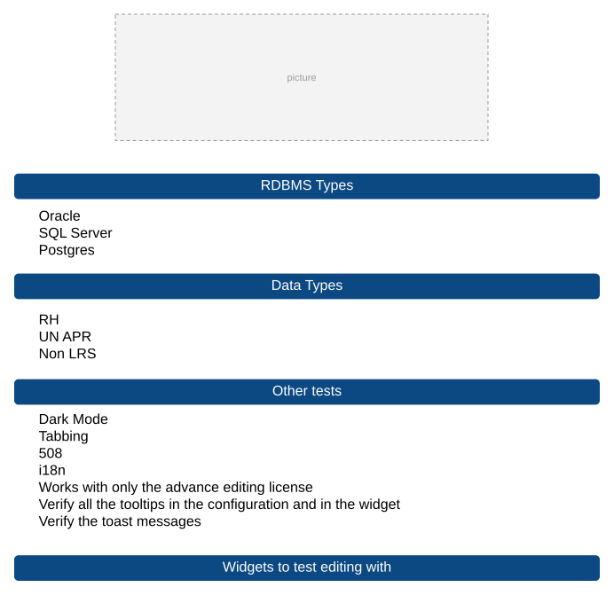
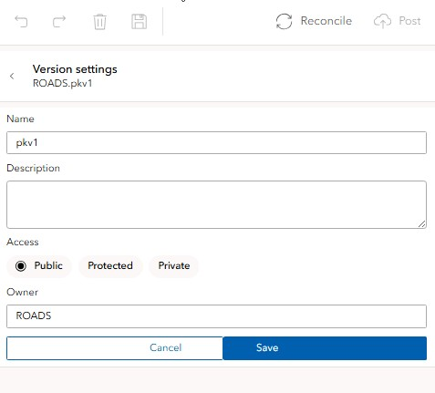
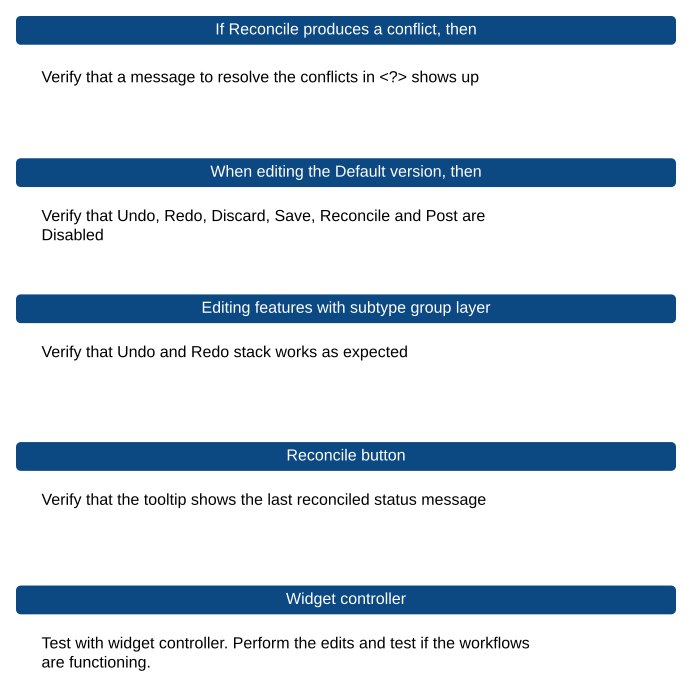

# Experience Builder Versioning Test Plan

| Field | Value |
| --- | --- |
| **Doc** | 73 · Test Plan · Experience Builder |
| **Product** | Roads & Highways · Pipeline Referencing · Utility Network |
| **Release** | — |
| **Issues** | — |
| **Source** | [Versioning_ExB_TP_V2.pptx](<https://esriis.sharepoint.com/sites/LocationReferencing/Shared%20Documents/General/Test%20Plans/Versioning_ExB_TP_V2.pptx>) · rev V2 |
| **People** | author Rahul Rakshit · PE — · dev — |
| **Edited** | 2026-02-12 19:50 by Rahul Rakshit |
| **Extracted** | 2026-09-04 · lane xmlstrip · format 3.0 · prompt v2.0.2 |
| **Keywords** | versioning · editing workflow · undo redo · version management · conflict resolution · experience builder · widget display |
| **Tools** | — |

## Summary

Test plan for versioning and editing workflows in the Experience Builder environment. Covers editing operations, version management, conflict resolution, URL parameters, configuration tests, and widget display options. Includes tests for multiple services, version access levels, and special cases with undo/redo stack behavior.

## Related documents

<!-- related:begin -->
- [Experience Builder Branch Versioning widget](<https://esriis.sharepoint.com/sites/lrsworkspace/LRS Doc Index/User Stories/exb-branch-versioning-widget.md>) — similar text 0.37 · 3 title words · 1 filename word · same surface <!-- rel:101 s=5.075 -->
- [Advanced Versioning Capabilities in LRS Configuration Widget](<https://esriis.sharepoint.com/sites/lrsworkspace/LRS Doc Index/Test Plans/26708-advanced-versioning-capabilities-in-lrs-configuration-widget.md>) — similar text 0.34 · 1 title word · 1 filename word · same kind/surface/folder <!-- rel:157 s=4.687 -->
- [Experience Builder Time and Versioning widget](<https://esriis.sharepoint.com/sites/lrsworkspace/LRS%20Doc%20Index/User%20Stories/exb-time-and-versioning-widget.md>) — similar text 0.27 · 3 title words · 1 filename word · same surface <!-- rel:167 s=4.34 -->
- [LRS Controller Widget](<https://esriis.sharepoint.com/sites/lrsworkspace/LRS Doc Index/Other/26748-lrs-controller-widget.md>) — similar text 0.36 · same surface <!-- rel:64 s=2.722 -->
- [Experience Builder Straight Line Diagram Event Attributes/Editing on Click](<https://esriis.sharepoint.com/sites/lrsworkspace/LRS Doc Index/User Stories/exb-sld-event-attributes-editing-on-click.md>) — similar text 0.13 · 2 title words · same surface <!-- rel:345 s=2.626 -->
<!-- related:end -->

<!-- docs:begin -->
## Esri documentation

_No page matched:_ [experience builder](https://www.google.com/search?q=%22experience%20builder%22+site%3Adoc.esri.com)
<!-- docs:end -->

---

## Overview

### Slide 1 <!-- slide 1 -->

### Slide 2 <!-- slide 2 -->

RDBMS Types

- Oracle
- SQL Server
- Postgres
Data Types

- RH
- UN APR
- Non LRS
Widgets to test editing with

| Core Editing | LRS Editing |
| --- | --- |
| Table | Line Events: Single and Multiple |
| Edit | Point Events: Single and Multiple |
| Trace | Merge Events |
|  | Split Events |
|  | SLD |
|  | Dynseg |

## Test Cases

### TC-U01 — Other tests <!-- src: LLM · slide 2 · "Other tests" checklist -->
- **Group:** Other tests
- **Steps:**
  1. Dark Mode
  2. Tabbing
  3. 508
  4. i18n
  5. Works with only the advance editing license
  6. Verify all the tooltips in the configuration and in the widget
  7. Verify the toast messages

### TC-U02 — Verify that the Save is enabled <!-- src: LLM · slide 3 · workflow table row 1 -->
- **Group:** Perform 3 edits (Add/Edit/Delete), then

### TC-U03 — Discard is enabled <!-- src: LLM · slide 3 · workflow table row 2 -->
- **Group:** Perform 3 edits (Add/Edit/Delete), then

### TC-U04 — Undo is enabled <!-- src: LLM · slide 3 · workflow table row 3 -->
- **Group:** Perform 3 edits (Add/Edit/Delete), then

### TC-U05 — Reconcile is enabled <!-- src: LLM · slide 3 · workflow table row 4 -->
- **Group:** Perform 3 edits (Add/Edit/Delete), then

### TC-U06 — Try to close the browser tab <!-- src: LLM · slide 3 · workflow table row 5 -->
- **Group:** Perform 3 edits (Add/Edit/Delete), then
- **Expected Result:** Warning to save should show up

### TC-U07 — Verify that Post is disabled until reconciled <!-- src: LLM · slide 3 · workflow table row 6 -->
- **Group:** Perform 3 edits (Add/Edit/Delete), then

### TC-U08 — Undo stack works <!-- src: LLM · slide 3 · workflow table row 7 -->
- **Group:** Perform 3 edits (Add/Edit/Delete), then

### TC-U09 — Click on Discard <!-- src: LLM · slide 3 · workflow table row 8 -->
- **Group:** Perform 3 edits (Add/Edit/Delete), then
- **Expected Result:** Message to confirm Discarding the edits shows up

### TC-U10 — Save the edits <!-- src: LLM · slide 3 · workflow table row 9 -->
- **Group:** Perform 3 edits (Add/Edit/Delete), then
- **Expected Result:** Message to confirm Saving the edits shows up

### TC-U11 — Discard the edits <!-- src: LLM · slide 3 · workflow table row 10 -->
- **Group:** Perform 3 edits (Add/Edit/Delete), then
- **Expected Result:** All the tools become disabled

### TC-U12 — Save the edits <!-- src: LLM · slide 3 · workflow table row 11 -->
- **Group:** Perform 3 edits (Add/Edit/Delete), then
- **Expected Result:** Undo, Redo, Discard and Save are disabled, Reconcile is Enabled

### TC-U13 — If Enterprise is 12.1 or higher and Reconcile is done <!-- src: LLM · slide 3 · workflow table row 12 -->
- **Group:** Perform 3 edits (Add/Edit/Delete), then
- **Expected Result:** Save and Discard are Disabled

### TC-U14 — If Enterprise is 12.0 or lower and Reconcile is done <!-- src: LLM · slide 3 · workflow table row 13 -->
- **Group:** Perform 3 edits (Add/Edit/Delete), then
- **Expected Result:** Save and Discard are Enabled

### TC-U15 — Try to create a new version <!-- src: LLM · slide 4 · workflow table row 1 -->
- **Group:** Perform 3 edits, don’t save then
- **Expected Result:** Disabled

### TC-U16 — Three dots on the side <!-- src: LLM · slide 4 · workflow table row 2 -->
- **Group:** Perform 3 edits, don’t save then
- **Expected Result:** Disabled

### TC-U17 — Version Settings <!-- src: LLM · slide 4 · workflow table row 3 -->
- **Group:** Perform 3 edits, don’t save then
- **Expected Result:** Disabled

### TC-U18 — Try to create a new version <!-- src: LLM · slide 5 · workflow table row 1 -->
- **Group:** Perform 3 edits, save, then
- **Expected Result:** Enabled

### TC-U19 — Three dots on the side <!-- src: LLM · slide 5 · workflow table row 2 -->
- **Group:** Perform 3 edits, save, then
- **Expected Result:** Enabled

### TC-U20 — When multiple versions (~30) are available, then <!-- src: LLM · slide 5 · "When multiple versions (~30) are available, then" checklist -->
- **Group:** When multiple versions (~30) are available, then
- **Steps:**
  1. Verify that the version list has the correct count
  2. The versions show up in a paginated format

### TC-U21 — Create a new feature <!-- src: LLM · slide 6 · workflow table row 1 -->
- **Group:** Go to the version setting page, then
- **Expected Result:** The version settings page should be disabled

### TC-U22 — Create a new feature and undo <!-- src: LLM · slide 6 · workflow table row 2 -->
- **Group:** Go to the version setting page, then
- **Expected Result:** The version settings page should be enabled

### TC-U23 — Edit the Name of the version with more than 42 characters <!-- src: LLM · slide 7 · workflow table row 1 -->
- **Group:** Go to the version setting page, then
- **Expected Result:** No changes saved

### TC-U24 — Edit the Description with more than 42 characters <!-- src: LLM · slide 7 · workflow table row 2 -->
- **Group:** Go to the version setting page, then
- **Expected Result:** No changes saved

### TC-U25 — Version name empty <!-- src: LLM · slide 7 · workflow table row 3 -->
- **Group:** Go to the version setting page, then
- **Expected Result:** No changes saved

### TC-U26 — Version name with symbols <!-- src: LLM · slide 7 · workflow table row 4 -->
- **Group:** Go to the version setting page, then

### TC-U27 — Version name with space in between <!-- src: LLM · slide 7 · workflow table row 5 -->
- **Group:** Go to the version setting page, then

### TC-U28 — Version name with leading spaces <!-- src: LLM · slide 7 · workflow table row 6 -->
- **Group:** Go to the version setting page, then
- **Expected Result:** No changes saved

### TC-U29 — Version name with trailing spaces <!-- src: LLM · slide 7 · workflow table row 7 -->
- **Group:** Go to the version setting page, then
- **Expected Result:** No changes saved

### TC-U30 — Version name already exists <!-- src: LLM · slide 7 · workflow table row 8 -->
- **Group:** Go to the version setting page, then
- **Expected Result:** No changes saved

### TC-U31 — Public Version: Change the owner <!-- src: LLM · slide 7 · workflow table row 9 -->
- **Group:** Go to the version setting page, then

### TC-U32 — Protected Version: Change the owner <!-- src: LLM · slide 7 · workflow table row 10 -->
- **Group:** Go to the version setting page, then

### TC-U33 — Private Version: Change the owner <!-- src: LLM · slide 7 · workflow table row 11 -->
- **Group:** Go to the version setting page, then

### TC-U34 — Default Version: Change the owner from SDE <!-- src: LLM · slide 7 · workflow table row 12 -->
- **Group:** Go to the version setting page, then

### TC-U35 — Change the owner of a version that is owned by another user <!-- src: LLM · slide 7 · workflow table row 13 -->
- **Group:** Go to the version setting page, then

### TC-U36 — Change the owner and verify if the locks table in LRS has the owner changed <!-- src: LLM · slide 7 · workflow table row 14 -->
- **Group:** Go to the version setting page, then

### TC-U37 — Verify that a protected version is protected <!-- src: LLM · slide 8 · workflow table row 1 -->
- **Group:** Go to the version setting page, then
- **Case:** Verify that a protected version is protected i.e., it allows any user to view the data but restricts editing rights exclusively to the owner or the geodatabase administrator.

### TC-U38 — Verify that a private version is private <!-- src: LLM · slide 8 · workflow table row 2 -->
- **Group:** Go to the version setting page, then
- **Case:** Verify that a private version is private i.e., it does not allow any user except the owner/ geodatabase administrator to view and edit the data.

### TC-U39 — Change Version Access from Public to Protected <!-- src: LLM · slide 8 · workflow table row 3 -->
- **Group:** Go to the version setting page, then
- **Case:** Change Version Access from Public to Protected and verify that the access is updated

### TC-U40 — Change Version Access from Public to Private <!-- src: LLM · slide 8 · workflow table row 4 -->
- **Group:** Go to the version setting page, then
- **Case:** Change Version Access from Public to Private and verify that the access is updated

### TC-U41 — Change Version Access from Protected to Public <!-- src: LLM · slide 8 · workflow table row 5 -->
- **Group:** Go to the version setting page, then
- **Case:** Change Version Access from Protected to Public and verify that the access is updated

### TC-U42 — Change Version Access from Protected to Private <!-- src: LLM · slide 8 · workflow table row 6 -->
- **Group:** Go to the version setting page, then
- **Case:** Change Version Access from Protected to Private and verify that the access is updated

### TC-U43 — Change Version Access from Private to Public <!-- src: LLM · slide 8 · workflow table row 7 -->
- **Group:** Go to the version setting page, then
- **Case:** Change Version Access from Private to Public and verify that the access is updated

### TC-U44 — Change Version Access from Private to Protected <!-- src: LLM · slide 8 · workflow table row 8 -->
- **Group:** Go to the version setting page, then
- **Case:** Change Version Access from Private to Protected and verify that the access is updated

### TC-U45 — Private version does not show up for non-owner users <!-- src: LLM · slide 8 · workflow table row 9 -->
- **Group:** Go to the version setting page, then
- **Case:** Verify that a Private version does not show up on the list of versions if the user is not the owner or geodatabase administrator

### TC-U46 — Test with default version as protected <!-- src: LLM · slide 8 · workflow table row 10 -->
- **Group:** Go to the version setting page, then

### TC-U47 — Service 1 VM+LRS and Service 2 VM+LRS <!-- src: LLM · slide 9 · Special Cases · services capabilities row 1 -->
- **Group:** Two Services exist in the map: Service 1 and Service 2

| Service 1 Capabilities | Service 2 Capabilities | Editing possible in | Supported tools |
| --- | --- | --- | --- |
| VM+LRS | VM+LRS | Service 1 and Service 2 | LRS and Core Edit |

### TC-U48 — Service 1 VM and Service 2 with no capabilities <!-- src: LLM · slide 9 · Special Cases · services capabilities row 2 -->
- **Group:** Two Services exist in the map: Service 1 and Service 2

| Service 1 Capabilities | Service 2 Capabilities | Editing possible in | Supported tools |
| --- | --- | --- | --- |
| VM |  | Service 1 | Core Edit |

### TC-U49 — Service 1 VM+LRS and Service 2 VM <!-- src: LLM · slide 9 · Special Cases · services capabilities row 3 -->
- **Group:** Two Services exist in the map: Service 1 and Service 2

| Service 1 Capabilities | Service 2 Capabilities | Editing possible in | Supported tools |
| --- | --- | --- | --- |
| VM+LRS | VM | Service 1 and Service 2 | LRS and Core Edit |

### TC-U50 — Service 1 None and Service 2 VM <!-- src: LLM · slide 9 · Special Cases · services capabilities row 4 -->
- **Group:** Two Services exist in the map: Service 1 and Service 2

| Service 1 Capabilities | Service 2 Capabilities | Editing possible in | Supported tools |
| --- | --- | --- | --- |
| None | VM | Service 2 | Core Edit |

### TC-U51 — Service 1 VM and Service 2 VM <!-- src: LLM · slide 9 · Special Cases · services capabilities row 5 -->
- **Group:** Two Services exist in the map: Service 1 and Service 2

| Service 1 Capabilities | Service 2 Capabilities | Editing possible in | Supported tools |
| --- | --- | --- | --- |
| VM | VM | Service 1 and Service 2 | Core Edit |

### TC-U52 — Service 1 None and Service 2 None <!-- src: LLM · slide 9 · Special Cases · services capabilities row 6 -->
- **Group:** Two Services exist in the map: Service 1 and Service 2

| Service 1 Capabilities | Service 2 Capabilities | Editing possible in | Supported tools |
| --- | --- | --- | --- |
| None | None | None | None |

### TC-U53 — Edit Service1 then Service 2 then Service1 then Service 2 then Service 1 <!-- src: LLM · slide 9 · Special Cases · workflow table row 1 -->
- **Group:** Two Services exist in the map: Service 1 and Service 2
- **Expected Result:** The Undo and Redo stack should be in order

### TC-U54 — Map 1 VM+LRS and Map 2 VM+LRS <!-- src: LLM · slide 9 · Special Cases · maps capabilities row 1 -->
- **Group:** Two maps exist in the app each with a single service: Map 1 and Map 2

| Map 1 Service Capabilities | Map 2 Service Capabilities | Editing possible in | Supported tools |
| --- | --- | --- | --- |
| VM+LRS | VM+LRS | Map 1 and Map 2 | LRS and Core Edit |

### TC-U55 — Map 1 VM and Map 2 with no capabilities <!-- src: LLM · slide 9 · Special Cases · maps capabilities row 2 -->
- **Group:** Two maps exist in the app each with a single service: Map 1 and Map 2

| Map 1 Service Capabilities | Map 2 Service Capabilities | Editing possible in | Supported tools |
| --- | --- | --- | --- |
| VM |  | Map 1 | Core Edit |

### TC-U56 — Map 1 VM+LRS and Map 2 VM <!-- src: LLM · slide 9 · Special Cases · maps capabilities row 3 -->
- **Group:** Two maps exist in the app each with a single service: Map 1 and Map 2

| Map 1 Service Capabilities | Map 2 Service Capabilities | Editing possible in | Supported tools |
| --- | --- | --- | --- |
| VM+LRS | VM | Map 1 and Map 2 | LRS and Core Edit |

### TC-U57 — Map 1 None and Map 2 VM <!-- src: LLM · slide 9 · Special Cases · maps capabilities row 4 -->
- **Group:** Two maps exist in the app each with a single service: Map 1 and Map 2

| Map 1 Service Capabilities | Map 2 Service Capabilities | Editing possible in | Supported tools |
| --- | --- | --- | --- |
| None | VM | Map 2 | Core Edit |

### TC-U58 — Map 1 VM and Map 2 VM <!-- src: LLM · slide 9 · Special Cases · maps capabilities row 5 -->
- **Group:** Two maps exist in the app each with a single service: Map 1 and Map 2

| Map 1 Service Capabilities | Map 2 Service Capabilities | Editing possible in | Supported tools |
| --- | --- | --- | --- |
| VM | VM | Map 1 and Map 2 | Core Edit |

### TC-U59 — Map 1 None and Map 2 None <!-- src: LLM · slide 9 · Special Cases · maps capabilities row 6 -->
- **Group:** Two maps exist in the app each with a single service: Map 1 and Map 2

| Map 1 Service Capabilities | Map 2 Service Capabilities | Editing possible in | Supported tools |
| --- | --- | --- | --- |
| None | None | None | None |

### TC-U60 — Verify that a message to resolve the conflicts in <?> shows up <!-- src: LLM · slide 10 · "If Reconcile produces a conflict, then" -->
- **Group:** If Reconcile produces a conflict, then

### TC-U61 — Verify that Undo, Redo, Discard, Save, Reconcile and Post are Disabled <!-- src: LLM · slide 10 · "When editing the Default version, then" -->
- **Group:** When editing the Default version, then

### TC-U62 — Verify that Undo and Redo stack works as expected <!-- src: LLM · slide 10 · "Editing features with subtype group layer" -->
- **Group:** Editing features with subtype group layer

### TC-U63 — Verify that the tooltip shows the last reconciled status message <!-- src: LLM · slide 10 · "Reconcile button" -->
- **Group:** Reconcile button

### TC-U64 — Test with widget controller <!-- src: LLM · slide 10 · "Widget controller" -->
- **Group:** Widget controller
- **Case:** Test with widget controller. Perform the edits and test if the workflows are functioning.

### TC-U65 — URL Parameters <!-- src: LLM · slide 11 · URL Parameters checklist -->
- **Group:** URL Parameters
- **Steps:**
  1. Verify that the URL  contains the name of the service: fully qualified name of the version
  2. Verify that the URL changes when the version has changed
  3. Test with 2 services in the map: The URL should show the info
  4. Test that the URL is constructed based on these priorities.
     - Level1: URL
     - Level2: The version selected in the configuration default
     - Level3: Service default versioned that is returned by VMS

Workflow: If the version in Level1 is not available, the go to the next level and so on.

### TC-U66 — Select the default version <!-- src: LLM · slide 12 · Configuration Tests table row 1 -->
- **Group:** Configuration Tests

### TC-U67 — Disable Manage Versions but Edit Sessions Enabled <!-- src: LLM · slide 12 · Configuration Tests table row 2 -->
- **Group:** Configuration Tests
- **Expected Result:** Version Manager is Disabled but Undo, Redo, Discard, Save, Reconcile, Post are Enabled

### TC-U68 — Disable Manage Versions and Edit Sessions <!-- src: LLM · slide 12 · Configuration Tests table row 3 -->
- **Group:** Configuration Tests
- **Expected Result:** Version Manager, Undo, Redo, Discard, Save, Reconcile, Post are disabled

### TC-U69 — Enable Manage Versions and Edit Sessions <!-- src: LLM · slide 12 · Configuration Tests table row 4 -->
- **Group:** Configuration Tests
- **Expected Result:** Version Manager, Undo, Redo, Discard, Save, Reconcile, Post are enabled

### TC-U70 — Enable Manage Versions and Disable Edit Sessions <!-- src: LLM · slide 12 · Configuration Tests table row 5 -->
- **Group:** Configuration Tests
- **Expected Result:** Version Manager is Enabled but Undo, Redo, Discard, Save, Reconcile, Post are Disabled

### TC-U71 — Disabling Save Disables Undo, Reo and Discard <!-- src: LLM · slide 12 · Configuration Tests table row 6 -->
- **Group:** Configuration Tests

### TC-U72 — Undo is Disabled <!-- src: LLM · slide 12 · Configuration Tests table row 7 -->
- **Group:** Configuration Tests
- **Expected Result:** Redo should be Disabled

### TC-U73 — Redo is Disabled <!-- src: LLM · slide 12 · Configuration Tests table row 8 -->
- **Group:** Configuration Tests
- **Expected Result:** Undo can be enabled

### TC-U74 — Reconcile Enabled but Post Disabled <!-- src: LLM · slide 12 · Configuration Tests table row 9 -->
- **Group:** Configuration Tests
- **Expected Result:** Allow

### TC-U75 — Disabling Reconcile should Disable Post <!-- src: LLM · slide 12 · Configuration Tests table row 10 -->
- **Group:** Configuration Tests

### TC-U76 — Set the default version for each VMS enabled service in the map <!-- src: LLM · slide 12 · Configuration Tests table row 11 -->
- **Group:** Configuration Tests
- **Case:** Set the default version for each service with layers in the map that are VMS enabled

### TC-U77 — Toolbar Display: Scale <!-- src: LLM · slide 13 · Widget Display Tests table row 1 -->
- **Group:** Widget Display Tests

| Toolbar Display | Options |
| --- | --- |
| Scale | Large Medium Small |

### TC-U78 — Toolbar Display: Display Type <!-- src: LLM · slide 13 · Widget Display Tests table row 2 -->
- **Group:** Widget Display Tests

| Toolbar Display | Options |
| --- | --- |
| Display Type | Docked Floating |

### TC-U79 — Toolbar Display: Dock Position <!-- src: LLM · slide 13 · Widget Display Tests table row 3 -->
- **Group:** Widget Display Tests

| Toolbar Display | Options |
| --- | --- |
| Dock Position | Top Left Right Bottom |

### TC-U80 — Placing the widget <!-- src: LLM · slide 13 · "Placing the widget" -->
- **Group:** Placing the widget
- **Case:** Test with sidebar, accordion and grid too.

