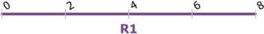
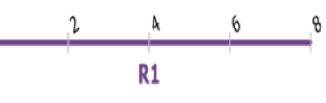

# Experience Builder: Add Multiple Line Events Widget Test Plan

|   |   |
| --- | --- |
| **Kind** | Test Plan · Experience Builder |
| **Release** | — |
| **Issue** | [Beijing-R-D-Center/ExperienceBuilder-Web-Extensions#16343](https://devtopia.esri.com/Beijing-R-D-Center/ExperienceBuilder-Web-Extensions/issues/16343) |
| **Source** | [16343-ExB_AddMultipleLineEvents_TestPlanV3.docx](<https://esriis.sharepoint.com/sites/LocationReferencing/Shared%20Documents/General/Test%20Plans/16343-ExB_AddMultipleLineEvents_TestPlanV3.docx>) |
| **Edited** | 2023-11-29 21:26 by Mac Christmas |
| **Extracted** | 2026-09-04 · lane `xmlstrip` |

<!-- metadata
```yaml
title: "Experience Builder: Add Multiple Line Events Widget Test Plan"
source_file: "16343-ExB_AddMultipleLineEvents_TestPlanV3.docx"
source_url: "https://esriis.sharepoint.com/sites/LocationReferencing/Shared%20Documents/General/Test%20Plans/16343-ExB_AddMultipleLineEvents_TestPlanV3.docx"
doc_id: 457
doc_kind: "Test Plan"
surface: "Experience Builder"
doc_revision: "V3"
target_release: ""
pe: "Mac"
dev: ""
author: "Praveen Kumar"
last_edited_by: "Mac Christmas"
last_edited: "2023-11-29T21:26:00Z"
extracted: 2026-09-04
extraction_lane: xmlstrip
prompt_version: "v2.0.2"
keywords: ["line event", "multiple line events", "experience builder", "widget", "attribute set", "route", "measure", "event merging"]
tools: []
products: []
issues: ["Beijing-R-D-Center/ExperienceBuilder-Web-Extensions#16343"]
related: [{"doc":455,"file":"experience-builder-add-single-line-event-widget__doc455.md","s":6.264},{"doc":484,"file":"add-line-events-user-story-for-experience-builder__doc484.md","s":5.161},{"doc":480,"file":"user-story-add-line-event-multiple__doc480.md","s":5.153},{"doc":170,"file":"add-spanning-line-events-to-dominant-routes-in-experience-builder-test-plan__doc170.md","s":5.122},{"doc":434,"file":"add-multiple-point-events__doc434.md","s":4.94}]
```
-->

## Summary

Test plan for the Add Multiple Line Events widget in Experience Builder. Covers UI, functional, and negative tests for line and non-line networks, spanning and non-spanning events, various route types, browsers, layouts, and spatial references. Includes configuration validation, attribute set handling, snapping, route selection, date validation, and event merging/retiring behaviors.

## Related documents

<!-- related:begin -->
- [Experience Builder: Add Single Line Event Widget](<https://esriis.sharepoint.com/sites/lrsworkspace/LRS Doc Index/User Stories/experience-builder-add-single-line-event-widget__doc455.md>) — similar text 0.52 · 5 title words · 2 filename words · same surface/folder <!-- rel:455 -->
- [Add Line Events User Story for Experience Builder](<https://esriis.sharepoint.com/sites/lrsworkspace/LRS Doc Index/User Stories/add-line-events-user-story-for-experience-builder__doc484.md>) — similar text 0.30 · 5 title words · 3 filename words · same surface <!-- rel:484 -->
- [User Story Add Line Event (Multiple)](<https://esriis.sharepoint.com/sites/lrsworkspace/LRS Doc Index/User Stories/user-story-add-line-event-multiple__doc480.md>) — similar text 0.34 · 3 title words · 4 filename words · same surface <!-- rel:480 -->
- [Add Spanning Line Events to Dominant Routes in Experience Builder – Test Plan](<https://esriis.sharepoint.com/sites/lrsworkspace/LRS Doc Index/Test Plans/add-spanning-line-events-to-dominant-routes-in-experience-builder-test-plan__doc170.md>) — similar text 0.13 · 5 title words · 1 filename word · same kind/surface/folder <!-- rel:170 -->
- [Add Multiple Point Events](<https://esriis.sharepoint.com/sites/lrsworkspace/LRS Doc Index/Test Plans/add-multiple-point-events__doc434.md>) — similar text 0.23 · 3 title words · 2 filename words · same kind/surface/folder <!-- rel:434 -->
<!-- related:end -->

<!-- docs:begin -->
## Esri documentation

[Split a centerline by measure](https://doc.esri.com/en/arcgis-pro/latest/help/production/location-referencing-pipelines/split-a-centerline-by-measure.html)

_No page matched:_ [experience builder](https://www.google.com/search?q=%22experience%20builder%22+site%3Adoc.esri.com) · [add multi line](https://www.google.com/search?q=%22add%20multi%20line%22+site%3Adoc.esri.com)
<!-- docs:end -->

---

### Experience Builder: Add Multiple Line Events Widget
 https://devtopia.esri.com/Beijing-R-D-Center/ExperienceBuilder-Web-Extensions/issues/16343 User Story
PE: Mac
Dev: ?
Notes:

- Test with both Line and Non-line (single + multi field RouteID) Networks, excluding PoM
- Test with spanning and non-spanning line events
- Test on Normal, Gapped, Complex, and Vertical routes.
- Test in different browsers (Chrome, Edge, (Firefox and Safari can be done through automation))
- Test deploying in tab and mobile layouts (UI testing and execute one or two test cases)
- 508 testing
- i18n testing
- Test on projected and unprojected data, using a variety of spatial references
- Test on different themes
- Attribute Sets cannot be edited in Experience Builder. The configuration of the Attribute Sets can only be updated in Pro (also in EE, but this is not an expected workflow)
Configuration:

- Verify any map can be selected from within the app
- Verify all the Attribute Sets published with the map can be chosen as the Attribute Set
- If there is no LRS enabled service in the webmap, provide a message that no LRS enabled service is present
- Provide an error message if the map has layers from more than one service
- When the event layer is selected under Default Settings, make sure ‘Method’ and ‘Type’ auto populates with correct values
UI Tests – First Pane:

- Open Type (Multiple Lines) should be set as per the settings from the configuration
- Attribute Set should be as per the settings from the configuration
- Verify other line Attribute Sets can be selected from the dropdown if there are more attribute sets published
- Verify that the default option is “Using route and measure"
- The Network is automatically set to parent network of the events in the Attribute Set
- Verify user cannot change the network until measure translation is supported
- Verify the ‘Route Name” is displayed instead of route id for the events configured with route name
- From and To RouteID and Measure fields should be empty until the user types or select using the picker tools
- Verify if selected event is non-spanning, To Route will be removed
- Verify if selected event is spanning, Date checkboxes will be removed
- Verify snapping is enabled when using the picker
- When a route is selected using picker, populate the measure value from that location and vice versa.
- Verify that the measure units are set to the network units & tolerance
- Provide some measures in stationing format – might not be available until Sharon is done, so we can copy into this widget
- Verify the route selector UI is shown when the user clicks a location with the route picker that has multiple routes at that location
- Verify the route selector UI is shown when user types in a route with multiple time slices
- Routes listed in the selector should be filtered based on the time settings of the map.
- Verify the intellisense experience for RouteID/Name (after the 3rd character is typed) – might not be available until Sharon is done, so we can copy into this widget
- Verify the from and to routes flash 3 times, once they are chosen on the map using the route picker
- Verify the green and red dots are shown at the from and to locations and update accordingly when input from and to measures change
- Verify that the Date text boxes are populated with the current date by default & empty End Date
- Verify these dates can be changed by using the Route Date or typing
- Test Merge Coincident Events checkbox
- Test Retire Overlapping Events checkbox
- Test Reset button - When user clicks on reset, clear user entered values and bring form to initial loading state
Negative Tests:

- Verify Next button is disabled if any of the required field is empty (Route/Measure/From Date)
- Verify error message when the routeid / route name / measures are invalid
- Verify error message when from date is less than or equal to the to date
- Verify the routeid \ routename\ measure exists in the provided date and are validated
UI Tests – Second Pane:

- Make sure the attribute fields as per the configuration settings of the selected Attribute Set
- Verify user can enter\edit values for the editable fields
- Verify, coded value domains, range domains, subtypes, non-nullable fields, attribute rules, contingent values and default values for any fields work as expected
- Copy Attributes from an event with only one time slice
- Copy Attributes from an event with time slices and time is disabled in map – picker window should appear
- Copy Attributes from a location with multiple different events or multiple time slices of the same event – picker window should appear
- When attributes have already been edited, using Copy Attributes will overwrite the data with data from the location that was clicked on in the map
- When clicking Add, execute creating the event and provide a confirmation message
- Once the operation is complete, the 2nd pane transitions back to the initial pane
- If the user clicks Back, go back to the previous step make sure entered values are preserved
- If any fields are not populated correctly, make sure appropriate error for the field(s) is displayed, that need to be updated
- No events from Attribute Set found in map
- Enable only layers registered to the selected network and disable other events which are not registered to the selected network
- If any layer within the Attribute Set is not in the webmap, do not show the field information
- Ensure unchecking an event from the attribute set will not add a new record for the specific event layer
Negative Tests:

- Violate attribute rules, contingent values, etc. in attributes
- Enter invalid attributes
Functional Tests (From Previous Test Plans):

[figure: 2. · Add · multiple · line · events · with · overlapping · sections · that · spans · a · portion · of · the · existing · event]

Existing:

| Event Layer | EventID | From RouteID | From Date | To Date | From Measure | To Measure | Extra Attribute |
| --- | --- | --- | --- | --- | --- | --- | --- |
| RoadType | Event A | Route1 | 1/1/2000 | Null | 0 | 4 | Gravel |
| SpeedLimit | Event C | Route1 | 1/1/2005 | Null | 0 | 6 | 25 |

Input:

| Event Layer | EventID | From RouteID | From Date | To Date | From Measure | To Measure | Extra Attribute |
| --- | --- | --- | --- | --- | --- | --- | --- |
| RoadType | Event B | Route1 | 1/1/2010 | Null | 1 | 3 | Paved |
| SpeedLimit | Event D | Route1 | 1/1/2010 | Null | 1 | 3 | 45 |

Expected:

| Event Layer | EventID | From RouteID | From Date | To Date | From Measure | To Measure | Extra Attribute |
| --- | --- | --- | --- | --- | --- | --- | --- |
| RoadType | Event A | Route1 | 1/1/2000 | 1/1/2010 | 0 | 4 | Gravel |
| RoadType | Event A | Route1 | 1/1/2010 | Null | 0 | 1 | Gravel |
| SpeedLimit | Event C | Route1 | 1/1/2010 | Null | 0 | 1 | 25 |
| RoadType | Event B | Route1 | 1/1/2010 | Null | 1 | 3 | Paved |
| SpeedLimit | Event D | Route1 | 1/1/2010 | Null | 1 | 3 | 45 |
| SpeedLimit | Event C | Route1 | 1/1/2005 | 1/1/2010 | 0 | 6 | 25 |
| RoadType | Event A | Route1 | 1/1/2010 | Null | 3 | 4 | Gravel |
| SpeedLimit | Event C | Route1 | 1/1/2010 | Null | 3 | 6 | 25 |

[figure: 4. · Add · multiple · line · events · with · overlapping · sections · that · ends · at · the · To · Measure · of · the · existing · event · but · does · not · cover · the · entire · length]

Existing:

| Event Layer | EventID | From RouteID | From Date | To Date | From Measure | To Measure | Extra Attribute |
| --- | --- | --- | --- | --- | --- | --- | --- |
| RoadType | Event A | Route1 | 1/1/2000 | Null | 0 | 4 | Gravel |
| SpeedLimit | Event C | Route1 | 1/1/2005 | Null | 0 | 4 | 25 |

Input:

| Event Layer | EventID | From RouteID | From Date | To Date | From Measure | To Measure | Extra Attribute |
| --- | --- | --- | --- | --- | --- | --- | --- |
| RoadType | Event B | Route1 | 1/1/2010 | Null | 2 | 4 | Paved |
| SpeedLimit | Event D | Route1 | 1/1/2010 | Null | 2 | 4 | 45 |

Expected:

| Event Layer | EventID | From RouteID | From Date | To Date | From Measure | To Measure | Extra Attribute |
| --- | --- | --- | --- | --- | --- | --- | --- |
| RoadType | Event A | Route1 | 1/1/2010 | Null | 0 | 2 | Gravel |
| RoadType | Event A | Route1 | 1/1/2000 | 1/1/2010 | 0 | 4 | Gravel |
| SpeedLimit | Event C | Route1 | 1/1/2010 | Null | 0 | 2 | 25 |
| SpeedLimit | Event C | Route1 | 1/1/2005 | 1/1/2010 | 0 | 4 | 25 |
| RoadType | Event B | Route1 | 1/1/2010 | Null | 2 | 4 | Paved |
| SpeedLimit | Event D | Route1 | 1/1/2010 | Null | 2 | 4 | 45 |

[figure: 6. · Add · multiple · spanning · line · events · that · exceeds · the · From · and · To · Measure · of · existing · event]

[figure: R2]
Existing:

| Event Layer | Event ID | From RouteID | To RouteID | From Date | To Date | From Measure | To Measure | Extra Attribute |
| --- | --- | --- | --- | --- | --- | --- | --- | --- |
| Road Type | Event A | Route1 | Route2 | 1/1/2000 | Null | 5 | 3 | Gravel |
| Speed Limit | Event C | Route1 | Route2 | 1/1/2005 | Null | 2 | 1 | 25 |

Input:

| Event Layer | EventID | From RouteID | To RouteID | From Date | To Date | From Measure | To Measure | Extra Attribute |
| --- | --- | --- | --- | --- | --- | --- | --- | --- |
| Road Type | Event B | Route1 | Route 2 | 1/1/2010 | Null | 1 | 5 | Paved |
| Speed Limit | Event D | Route 1 | Route 2 | 1/1/2010 | Null | 1 | 5 | 45 |

Expected:

## R2

| Event Layer | EventID | From RouteID | To RouteID | From Date | To Date | From Measure | To Measure | Extra Attribute |
| --- | --- | --- | --- | --- | --- | --- | --- | --- |
| Road Type | Event A | Route1 | Route1 | 1/1/2000 | 1/1/2010 | 5 | 3 | Gravel |
| Speed Limit | Event C | Route1 | Route2 | 1/1/2005 | 1/1/2010 | 2 | 1 | 25 |
| Road Type | Event B | Route1 | Route2 | 1/1/2010 | Null | 1 | 5 | Paved |
| Speed Limit | Event D | Route 1 | Route2 | 1/1/2010 | Null | 1 | 5 | 45 |

        
