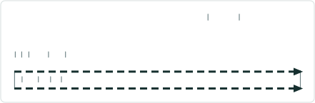
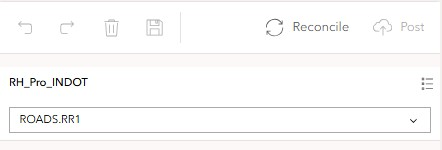
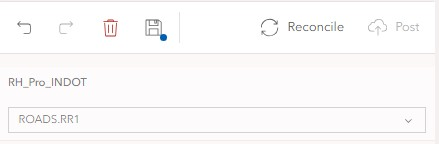
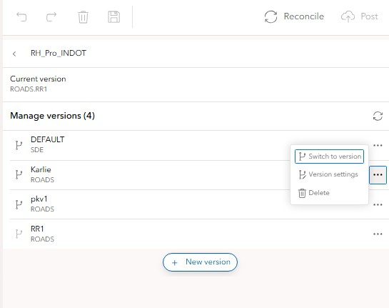
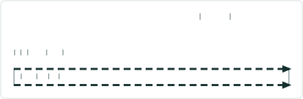
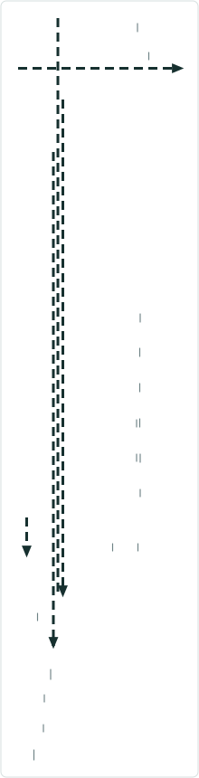
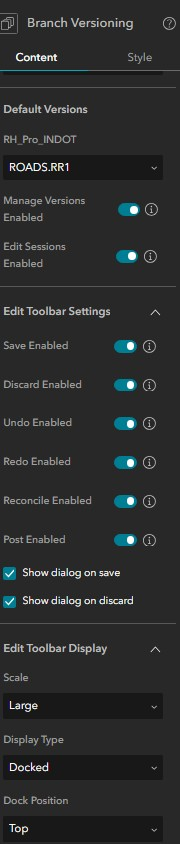
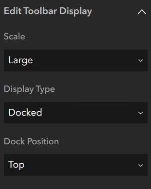

# Experience Builder Versioning Test Plan

|   |   |
| --- | --- |
| **Kind** | Test Plan · Experience Builder |
| **Release** | — |
| **Product** | Roads & Highways · Pipeline Referencing · Utility Network |
| **Source** | [Versioning_ExB_TP_V2.pptx](<https://esriis.sharepoint.com/sites/LocationReferencing/Shared%20Documents/General/Test%20Plans/Versioning_ExB_TP_V2.pptx>) |
| **Edited** | 2026-02-12 19:50 by Rahul Rakshit |
| **Extracted** | 2026-09-04 · lane `xmlstrip` |

<!-- metadata
```yaml
title: "Experience Builder Versioning Test Plan"
source_file: "Versioning_ExB_TP_V2.pptx"
source_url: "https://esriis.sharepoint.com/sites/LocationReferencing/Shared%20Documents/General/Test%20Plans/Versioning_ExB_TP_V2.pptx"
doc_id: 73
doc_kind: "Test Plan"
surface: "Experience Builder"
doc_revision: "V2"
target_release: ""
pe: ""
dev: ""
author: "Rahul Rakshit"
last_edited_by: "Rahul Rakshit"
last_edited: "2026-02-12T19:50:57Z"
extracted: 2026-09-04
extraction_lane: xmlstrip
prompt_version: "v2.0.2"
keywords: ["versioning", "editing workflow", "undo redo", "version management", "conflict resolution", "experience builder", "widget display"]
tools: []
products: ["Roads & Highways", "Pipeline Referencing", "Utility Network"]
issues: []
related: [{"doc":101,"file":"experience-builder-branch-versioning-widget__doc101.md","s":5.075},{"doc":157,"file":"advanced-versioning-capabilities-in-lrs-configuration-widget__doc157.md","s":4.687},{"doc":167,"file":"experience-builder-time-and-versioning-widget__doc167.md","s":4.34},{"doc":64,"file":"lrs-controller-widget__doc64.md","s":2.722},{"doc":345,"file":"experience-builder-straight-line-diagram-event-attributes-editing-on-click__doc345.md","s":2.626}]
```
-->

## Summary

Test plan for versioning and editing workflows in the Experience Builder environment. Covers editing operations, version management, conflict resolution, URL parameters, configuration tests, and widget display options. Includes tests for multiple services, version access levels, and special cases with undo/redo stack behavior.

## Related documents

<!-- related:begin -->
- [Experience Builder Branch Versioning widget](<https://esriis.sharepoint.com/sites/lrsworkspace/LRS Doc Index/User Stories/experience-builder-branch-versioning-widget__doc101.md>) — similar text 0.37 · 3 title words · 1 filename word · same surface <!-- rel:101 -->
- [Advanced Versioning Capabilities in LRS Configuration Widget](<https://esriis.sharepoint.com/sites/lrsworkspace/LRS Doc Index/Test Plans/advanced-versioning-capabilities-in-lrs-configuration-widget__doc157.md>) — similar text 0.34 · 1 title word · 1 filename word · same kind/surface/folder <!-- rel:157 -->
- [Experience Builder Time and Versioning widget](<https://esriis.sharepoint.com/sites/lrsworkspace/LRS%20Doc%20Index/User%20Stories/experience-builder-time-and-versioning-widget__doc167.md>) — similar text 0.27 · 3 title words · 1 filename word · same surface <!-- rel:167 -->
- [LRS Controller Widget](<https://esriis.sharepoint.com/sites/lrsworkspace/LRS Doc Index/Other/lrs-controller-widget__doc64.md>) — similar text 0.36 · same surface <!-- rel:64 -->
- [Experience Builder Straight Line Diagram Event Attributes/Editing on Click](<https://esriis.sharepoint.com/sites/lrsworkspace/LRS Doc Index/User Stories/experience-builder-straight-line-diagram-event-attributes-editing-on-click__doc345.md>) — similar text 0.13 · 2 title words · same surface <!-- rel:345 -->
<!-- related:end -->

<!-- docs:begin -->
## Esri documentation

_No page matched:_ [experience builder](https://www.google.com/search?q=%22experience%20builder%22+site%3Adoc.esri.com)
<!-- docs:end -->

---

## Slide 1


## Slide 2

RDBMS Types

- Oracle
- SQL Server
- Postgres
Data Types

- RH
- UN APR
- Non LRS
Widgets to test editing with



| Core Editing | LRS Editing |
| --- | --- |
| Table | Line Events: Single and Multiple |
| Edit | Point Events: Single and Multiple |
| Trace | Merge Events |
|  | Split Events |
|  | SLD |
|  | Dynseg |

Other tests

- Dark Mode
- Tabbing
- 508
- i18n
- Works with only the advance editing license
- Verify all the tooltips in the configuration and in the widget
- Verify the toast messages



## Slide 3

Perform 3 edits (Add/Edit/Delete), then

| Workflow | Result |
| --- | --- |
| Verify that the Save is enabled |  |
| Discard is enabled |  |
| Undo is enabled |  |
| Reconcile is enabled |  |
| Try to close the browser tab | Warning to save should show up |
| Verify that Post is disabled until reconciled |  |
| Undo stack works |  |
| Click on Discard | Message to confirm Discarding the edits shows up |
| Save the edits | Message to confirm Saving the edits shows up |
| Discard the edits | All the tools become disabled |
| Save the edits | Undo, Redo, Discard and Save are disabled, Reconcile is Enabled |
| If Enterprise is 12.1 or higher and Reconcile is done | Save and Discard are Disabled |
| If Enterprise is 12.0 or lower and Reconcile is done | Save and Discard are Enabled |



## Slide 4


Perform 3 edits, don’t save then


| Workflow | Result |
| --- | --- |
| Try to create a new version | Disabled |
| Three dots on the side | Disabled |
| Version Settings | Disabled |

 

## Slide 5

Perform 3 edits, save, then


| Workflow | Result |
| --- | --- |
| Try to create a new version | Enabled |
| Three dots on the side | Enabled |

When multiple versions (~30) are available, then

- Verify that the version list has the correct count
- The versions show up in a paginated format


## Slide 6

Go to the version setting page, then


| Workflow | Result |
| --- | --- |
| Create a new feature | The version settings page should be disabled |
| Create a new feature and undo | The version settings page should be enabled |


## Slide 7

Go to the version setting page, then


| Workflow | Result |
| --- | --- |
| Edit the Name of the version with more than 42 characters | No changes saved |
| Edit the Description with more than 42 characters | No changes saved |
| Version name empty | No changes saved |
| Version name with symbols |  |
| Version name with space in between |  |
| Version name with leading spaces | No changes saved |
| Version name with trailing spaces | No changes saved |
| Version name already exists | No changes saved |
| Public Version: Change the owner |  |
| Protected Version: Change the owner |  |
| Private Version: Change the owner |  |
| Default Version: Change the owner from SDE |  |
| Change the owner of a version that is owned by another user |  |
| Change the owner and verify if the locks table in LRS has the owner changed |  |


## Slide 8

Go to the version setting page, then


| Workflow | Result |
| --- | --- |
| Verify that a protected version is protected i.e., it allows any user to view the data but restricts editing rights exclusively to the owner or the geodatabase administrator. |  |
| Verify that a private version is private i.e., it does not allow any user except the owner/ geodatabase administrator to view and edit the data. |  |
| Change Version Access from Public to Protected and verify that the access is updated |  |
| Change Version Access from Public to Private and verify that the access is updated |  |
| Change Version Access from Protected to Public and verify that the access is updated |  |
| Change Version Access from Protected to Private and verify that the access is updated |  |
| Change Version Access from Private to Public and verify that the access is updated |  |
| Change Version Access from Private to Protected and verify that the access is updated |  |
| Verify that a Private version does not show up on the list of versions if the user is not the owner or geodatabase administrator |  |
| Test with default version as protected |  |


## Slide 9

Special Cases
Two Services exist in the map: Service 1 and Service 2

| Service 1 Capabilities | Service 2 Capabilities | Editing possible in | Supported tools |
| --- | --- | --- | --- |
| VM+LRS | VM+LRS | Service 1 and Service 2 | LRS and Core Edit |
| VM |  | Service 1 | Core Edit |
| VM+LRS | VM | Service 1 and Service 2 | LRS and Core Edit |
| None | VM | Service 2 | Core Edit |
| VM | VM | Service 1 and Service 2 | Core Edit |
| None | None | None | None |

| Workflow | Result |
| --- | --- |
| Edit Service1 then Service 2 then Service1 then Service 2 then Service 1 | The Undo and Redo stack should be in order |

Two maps exist in the app each with a single service: Map 1 and Map 2

| Map 1 Service Capabilities | Map 2 Service Capabilities | Editing possible in | Supported tools |
| --- | --- | --- | --- |
| VM+LRS | VM+LRS | Map 1 and Map 2 | LRS and Core Edit |
| VM |  | Map 1 | Core Edit |
| VM+LRS | VM | Map 1 and Map 2 | LRS and Core Edit |
| None | VM | Map 2 | Core Edit |
| VM | VM | Map 1 and Map 2 | Core Edit |
| None | None | None | None |

## Slide 10

If Reconcile produces a conflict, then
Verify that a message to resolve the conflicts in <?> shows up
When editing the Default version, then
Verify that Undo, Redo, Discard, Save, Reconcile and Post are Disabled
Editing features with subtype group layer
Verify that Undo and Redo stack works as expected
Reconcile button
Verify that the tooltip shows the last reconciled status message
Widget controller
Test with widget controller. Perform the edits and test if the workflows are functioning.

## Slide 11

URL Parameters

- Verify that the URL  contains the name of the service: fully qualified name of the version
- Verify that the URL changes when the version has changed
- Test with 2 services in the map: The URL should show the info
- Test that the URL is constructed based on these priorities.
  - Level1: URL
  - Level2: The version selected in the configuration default
  - Level3: Service default versioned that is returned by VMS
Workflow: If the version in Level1 is not available, the go to the next level and so on.

## Slide 12



Configuration Tests



| Workflow | Result |
| --- | --- |
| Select the default version |  |
| Disable Manage Versions but Edit Sessions Enabled | Version Manager is Disabled but Undo, Redo, Discard, Save, Reconcile, Post are Enabled |
| Disable Manage Versions and Edit Sessions | Version Manager, Undo, Redo, Discard, Save, Reconcile, Post are disabled |
| Enable Manage Versions and Edit Sessions | Version Manager, Undo, Redo, Discard, Save, Reconcile, Post are enabled |
| Enable Manage Versions and Disable Edit Sessions | Version Manager is Enabled but Undo, Redo, Discard, Save, Reconcile, Post are Disabled |
| Disabling Save Disables Undo, Reo and Discard |  |
| Undo is Disabled | Redo should be Disabled |
| Redo is Disabled | Undo can be enabled |
| Reconcile Enabled but Post Disabled | Allow |
| Disabling Reconcile should Disable Post |  |
| Set the default version for each service with layers in the map that are VMS enabled |  |

 

## Slide 13

| Toolbar Display | Options |
| --- | --- |
| Scale | Large Medium Small |
| Display Type | Docked Floating |
| Dock Position | Top Left Right Bottom |

Widget Display Tests
Placing the widget
Test with sidebar, accordion and grid too.


