# Extend Route AI Assistant Test Plan

|   |   |
| --- | --- |
| **Kind** | Test Plan · Pro |
| **Release** | — |
| **Product** | Roads & Highways · Pipeline Referencing · Utility Network |
| **Issue** | [ArcGISPro/ps-location-referencing#7065](https://devtopia.esri.com/ArcGISPro/ps-location-referencing/issues/7065) |
| **Source** | [7065-ExtendAI_TestPlan1.pptx](<https://esriis.sharepoint.com/sites/LocationReferencing/Shared%20Documents/General/Test%20Plans/7065-ExtendAI_TestPlan1.pptx>) |
| **Edited** | 2026-06-25 18:37 by Mac Christmas |
| **Extracted** | 2026-09-04 · lane `xmlstrip` |

<!-- metadata
```yaml
title: "Extend Route AI Assistant Test Plan"
source_file: "7065-ExtendAI_TestPlan1.pptx"
source_url: "https://esriis.sharepoint.com/sites/LocationReferencing/Shared%20Documents/General/Test%20Plans/7065-ExtendAI_TestPlan1.pptx"
doc_id: 18
doc_kind: "Test Plan"
surface: "Pro"
doc_revision: ""
target_release: ""
pe: ""
dev: ""
author: "Rahul Rakshit"
last_edited_by: "Mac Christmas"
last_edited: "2026-06-25T18:37:05Z"
extracted: 2026-09-04
extraction_lane: xmlstrip
prompt_version: "v2.0.2"
keywords: ["extend route", "ai assistant", "centerlines", "network", "effective date", "source route", "extension location", "downstream recalibration", "route extension", "measure validation", "input validation", "complex routes"]
tools: []
products: ["Roads & Highways", "Pipeline Referencing", "Utility Network"]
issues: ["ArcGISPro/ps-location-referencing#7065"]
related: [{"doc":2,"file":"iteration-planning-and-issue-tracking-for-location-referencing-3-8-12-2__doc2.md","s":1001.862},{"doc":51,"file":"realign-route-ai-assistant-test-plan__doc51.md","s":6.928},{"doc":80,"file":"realign-route-ai-assistant-test-plan__doc80.md","s":5.572},{"doc":98,"file":"create-route-ai-assistant-test-plan__doc98.md","s":5.081},{"doc":86,"file":"create-route-in-line-network-and-multifield-network-with-additional-attributes__doc86.md","s":4.588}]
```
-->

## Summary

Test plan for the Extend Route AI Assistant feature in linear referencing. Covers input validation, user prompts, handling of complex route types, recalibration options, and various network and measure scenarios. Includes tests for projected and unprojected data, multiple centerlines, and error handling for invalid inputs.

## Related documents

<!-- related:begin -->
- [Iteration Planning and Issue Tracking for Location Referencing 3.8/12.2](<https://esriis.sharepoint.com/sites/lrsworkspace/LRS%20Doc%20Index/Schedules/iteration-planning-and-issue-tracking-for-location-referencing-3-8-12-2__doc2.md>) — shared issue ArcGISPro/ps-location-referencing#7065 · similar text 0.07 · same surface <!-- rel:2 -->
- [Realign Route AI Assistant Test Plan](<https://esriis.sharepoint.com/sites/lrsworkspace/LRS Doc Index/Test Plans/realign-route-ai-assistant-test-plan__doc51.md>) — similar text 0.53 · 2 title words · same kind/surface/folder <!-- rel:51 -->
- [Realign Route AI Assistant Test Plan](<https://esriis.sharepoint.com/sites/lrsworkspace/LRS Doc Index/Test Plans/realign-route-ai-assistant-test-plan__doc80.md>) — similar text 0.59 · 2 title words · same kind/surface/folder <!-- rel:80 -->
- [Create Route AI Assistant Test Plan](<https://esriis.sharepoint.com/sites/lrsworkspace/LRS Doc Index/Test Plans/create-route-ai-assistant-test-plan__doc98.md>) — similar text 0.40 · 2 title words · same kind/surface/folder <!-- rel:98 -->
- [Create Route in Line Network and Multifield Network with Additional Attributes Pro AI Assistant Test Plan](<https://esriis.sharepoint.com/sites/lrsworkspace/LRS Doc Index/Test Plans/create-route-in-line-network-and-multifield-network-with-additional-attributes__doc86.md>) — similar text 0.42 · 2 title words · same kind/surface/folder <!-- rel:86 -->
<!-- related:end -->

<!-- docs:begin -->
## Esri documentation

[Extend a route](https://doc.esri.com/en/arcgis-pro/latest/help/production/roads-highways/extend-a-route.html) · [LRS network](https://doc.esri.com/en/arcgis-pro/latest/help/production/location-referencing-pipelines/what-is-an-lrs-network.html) · [Event behavior for route extension](https://doc.esri.com/en/arcgis-pro/latest/help/production/roads-highways/event-behavior-for-route-extension.html) · [Complex scenarios for route calibration](https://doc.esri.com/en/arcgis-pro/latest/help/production/roads-highways/complex-scenarios-for-route-calibration.html)
<!-- docs:end -->

---

## Slide 1

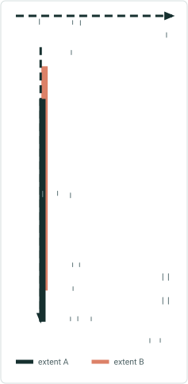

Extend Route AI Assistant
Devtopia Issue

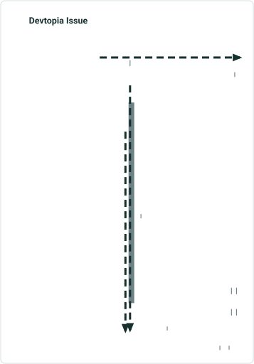

| Notes |
| --- |
| Add AI Skill for Extend Route Test only in feature services Test with RH, APR, ADMRH, UNAPR, and PoM data Projected and unprojected data with 3D Use multiple centerlines to extend a route Test with spelling mistakes Gapped and multiple gapped route extension Complex routes such as lollipops, loops, alpha, branch, infinity with all the variations using multiple centerlines and gaps Test with centerlines that are not always in the same direction and test in-memory flipped centerlines Test within local scene Verify that the Extend Route form only opens when no error exists in the input parameters Recalibrate route downstream option will be enabled by default (when applicable) Effective Date will default to today’s date unless otherwise specified I18n/L10n + A11y |

 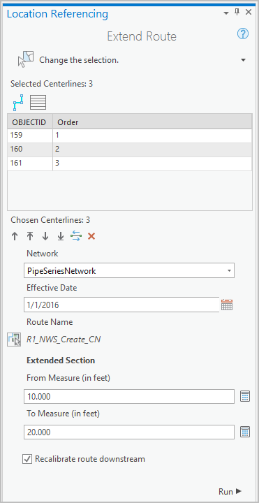

## Slide 2

Nonline Network:
Centerlines
Network
Effective Date
Source RouteID/Name
Extension Location (if centerline(s) not touching route at start or end)
Extended Section From Measure*
Extended Section To Measure*

*Optional
Line Network:
Centerlines
Network
Effective Date
Source RouteID/Name
Extension Location (if centerline(s) not touching route at start or end)
Extended Section From Measure*
Extended Section To Measure*
Recalibrate route downstream (enabled by default, if included when not applicable will be ignored per Sharon)

To Provide in Prompt:

## Slide 3


Workflow
Downstream recalibration is enabled by default


## Slide 4

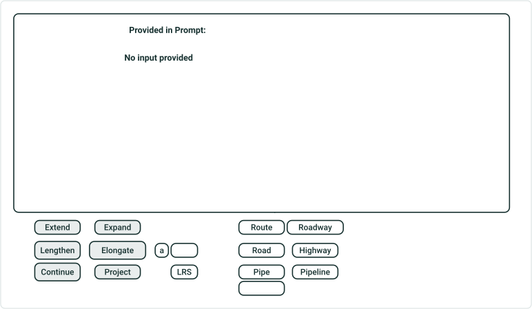

AI Assistant should ask for:

Centerlines, Network, Effective Date, Source Route

(Input centerlines touch route at start or end)

Test also with line networks

## Slide 5

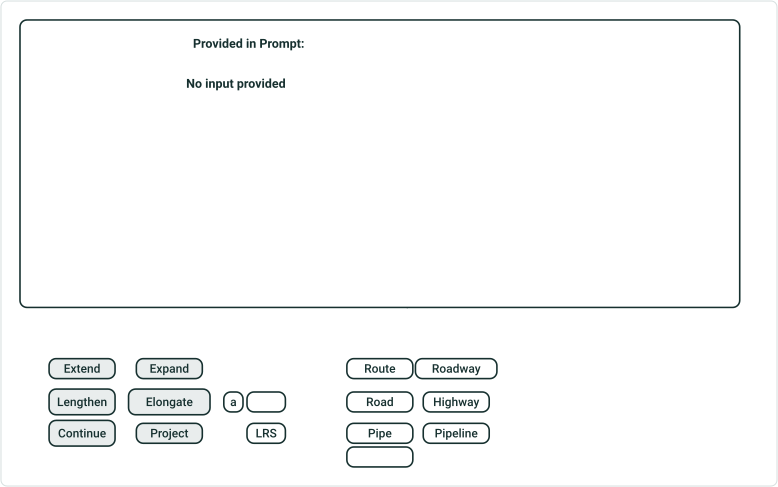

AI Assistant should ask for:

Centerlines, Network, Effective Date, Source Route, Extension Location

(Input centerlines do not touch route at start or end)

Test also with line networks

## Slide 6

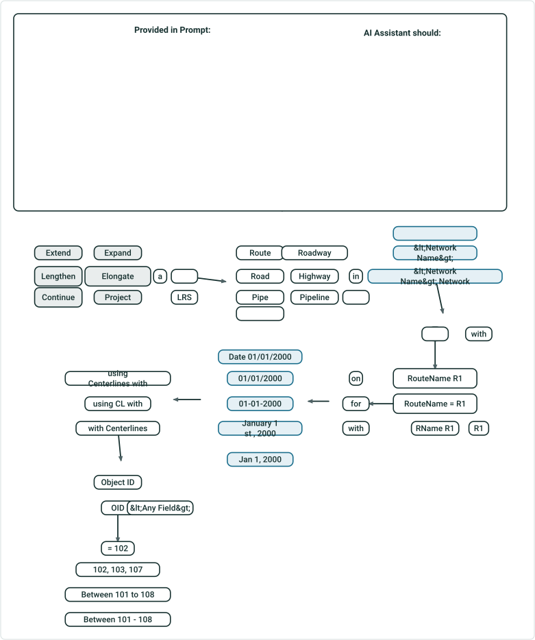

Centerlines, Network, Effective Date, Source Route
<Network Name> Network
Populate and open the Extend Route form

(input centerlines touch route at start or end)
January 1st, 2000
Between 101 to 108
Between 101 - 108
Test also with line networks

## Slide 7


Centerlines, Network, Effective Date, Source Route
<Network Name> Network
Prompt for Extension Location

(input centerlines do not touch route at start or end)
January 1st, 2000
Between 101 to 108
Between 101 - 108
Test also with line networks

## Slide 8

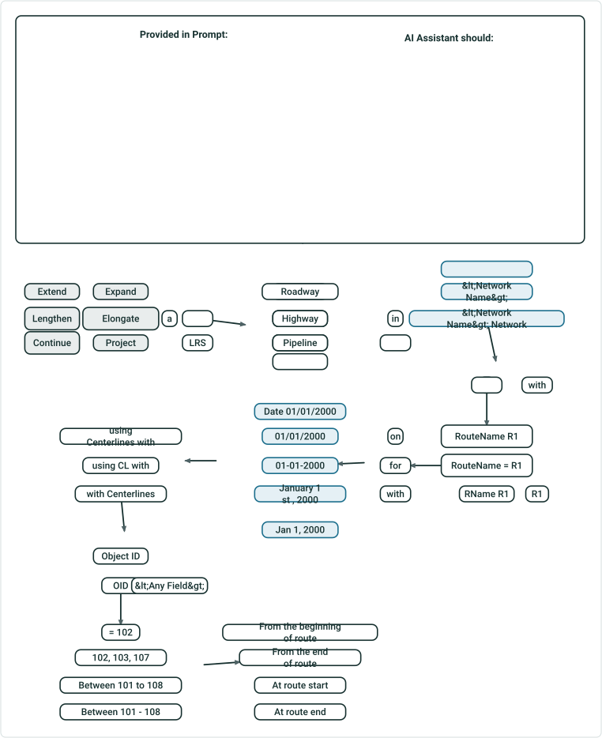

Centerlines, Network, Effective Date, Source Route, Extension Location
<Network Name> Network
Populate and open the Extend Route form

(input centerlines do not touch route at start or end, but Extension Location is provided)
January 1st, 2000
Between 101 to 108
Between 101 - 108
Test also with line networks

From the beginning of route
From the end of route

## Slide 9

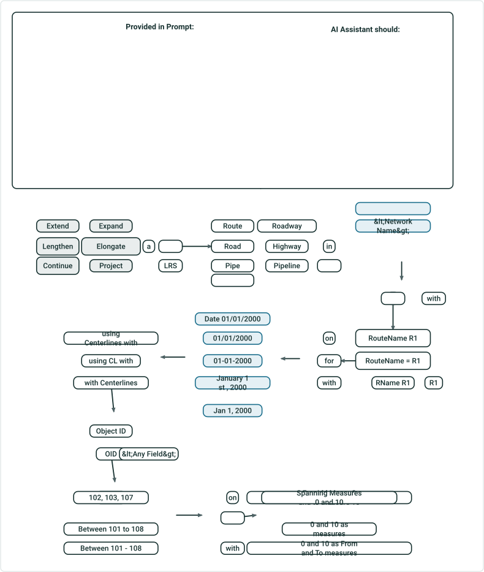

Centerlines, Network, Effective Date, Source Route, Extended From Measure, Extended To Measure
Populate and open the Extend Route form with user-specified measures

(input centerlines touch route at start or end)
Test also with line networks
January 1st, 2000
Between 101 to 108
Between 101 - 108

From Measure 0 and to Measure 10
Spanning Measures 0  and 10
0 and 10 as measures
0 and 10 as From and To measures

## Slide 10


Centerlines, Network*, Effective Date, Source Route, Extended From Measure, Extended To Measure, Downstream recalibration option
Populate and open the Extend Route form with user-specified measures

(input centerlines touch route at start)
January 1st, 2000
Between 101 to 108
Between 101 - 108

From Measure 0 and to Measure 10
Spanning Measures 0  and 10
0 and 10 as measures
0 and 10 as From and To measures
Refresh downstream segment

## Slide 11

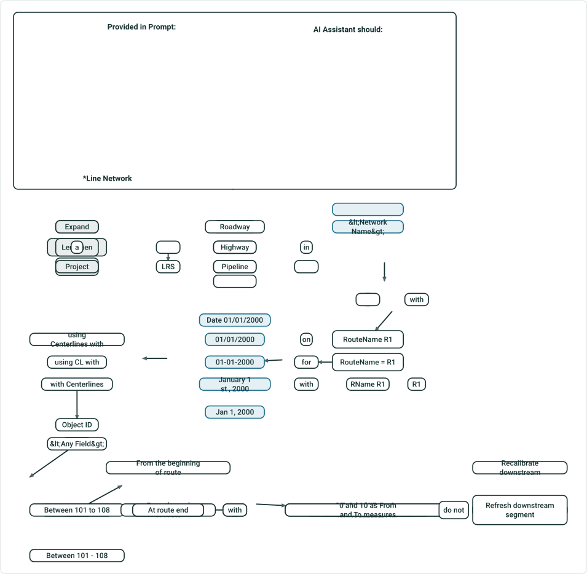

Centerlines, Network*, Effective Date, Source Route, Extension Location, Extended From Measure, Extended To Measure, Downstream recalibration option
Populate and open the Extend Route form with user-specified measures

(input centerlines do not touch route)
January 1st, 2000
Between 101 to 108
Between 101 - 108

From Measure 0 and to Measure 10
Spanning Measures 0  and 10
0 and 10 as measures
0 and 10 as From and To measures
Refresh downstream segment
From the beginning of route
From the end of route

## Slide 12

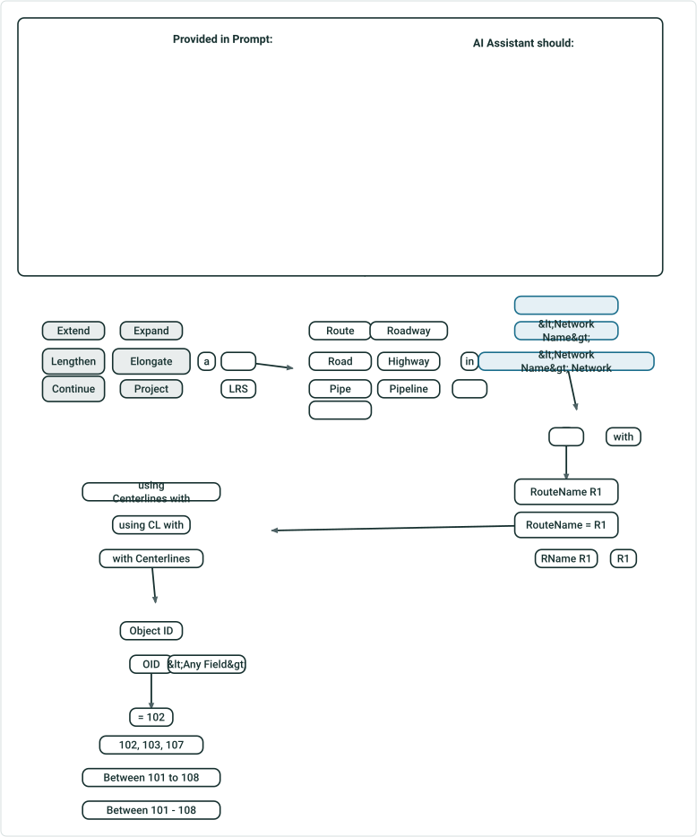

<Network Name> Network
Populate and open the Extend Route form with today’s date as Effective Date

(input centerlines touch route at start or end)
Between 101 to 108
Between 101 - 108
Test also with line networks

Centerlines, Network, Source Route

## Slide 13


Centerlines, Network*, Effective Date, Source Route, Extended From Measure, Extended To Measure, Downstream recalibration option (not applicable)
Populate and open the Extend Route form, but ignore the Downstream recalibration option as it is not possible

(input centerlines touch route at end)
January 1st, 2000
Between 101 to 108
Between 101 - 108

From Measure 0 and to Measure 10
Spanning Measures 0  and 10
0 and 10 as measures
0 and 10 as From and To measures
Refresh downstream segment

## Slide 14

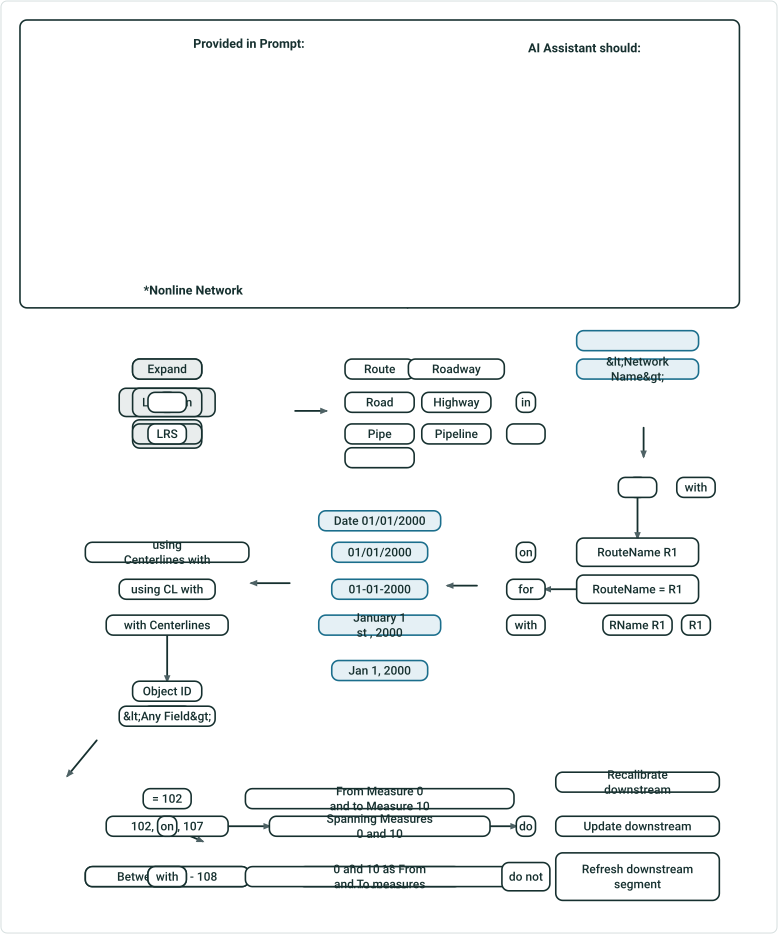

Centerlines, Network*, Effective Date, Source Route, Extended From Measure, Extended To Measure, Downstream recalibration option (not applicable)
Populate and open the Extend Route form, but ignore the Downstream recalibration option as it is not possible

January 1st, 2000
Between 101 to 108
Between 101 - 108

From Measure 0 and to Measure 10
Spanning Measures 0  and 10
0 and 10 as measures
0 and 10 as From and To measures
Refresh downstream segment
25 random prompt permutations (from Copilot):

- Extend LRS Route on RouteName R1 for Date 01/01/2000 using Centerlines with Object ID = 102 From Measure 0 and To Measure 10 to Recalibrate downstream
- Expand Pipeline with R1 for Jan 1 2000 using CL with OID 102 103 107 spanning measures 0 and 10 to Update downstream
- Continue LRS Roadway in <Network Name> on RouteName = R1 for January 1st 2000 with Centerlines using <Any Field> Between 101–108 to Refresh downstream segment
- Project Highway on Rname R1 on 01-01-2000 using CL with Object ID Between 101 to 108 From Measure 0 and To Measure 10 to Update downstream
- Lengthen LRS Road with R1 for 01/01/2000 using Centerlines with OID = 102 across measures 0 and 10 to Recalibrate downstream
- Elongate Pipe in <Network Name> on RouteName R1 for January 1st 2000 using CL with <Any Field> Between 101–108 spanning measures 0 and 10 to Update downstream
- Continue LRS Route with Rname R1 on Jan 1 2000 using Centerlines with OID 102 103 107 From Measure 0 and To Measure 10 to Refresh downstream segment
- Extend Pipeline with RouteName = R1 for Date 01/01/2000 using CL with Object ID = 102 across measures 0 and 10 to Update downstream
- Expand LRS Highway in <Network Name> on R1 on 01-01-2000 using Centerlines with OID Between 101 to 108 spanning measures 0 and 10 to Recalibrate downstream
- Project Roadway with Rname R1 for January 1st 2000 using CL with <Any Field> Between 101–108 From Measure 0 and To Measure 10 to Refresh downstream segment
- Continue Road in <Network Name> on R1 for 01/01/2000 using Centerlines with Object ID 102 103 107 across measures 0 and 10 to Update downstream
- Lengthen LRS Pipe on RouteName R1 for Date 01/01/2000 using CL with OID Between 101 to 108 From Measure 0 and To Measure 10 to Recalibrate downstream
- Elongate Route in <Network Name> with R1 on January 1st 2000 using Centerlines with <Any Field> = 102 spanning measures 0 and 10 to Update downstream
- Extend LRS Pipeline with Rname R1 for 01-01-2000 using CL with Object ID Between 101–108 From Measure 0 and To Measure 10 to Refresh downstream segment
- Expand Route on RouteName = R1 with Jan 1 2000 using Centerlines with OID 102 103 107 across measures 0 and 10 to Recalibrate downstream
- Continue LRS Highway in <Network Name> with RouteName R1 for 01/01/2000 using CL with <Any Field> Between 101 to 108 spanning measures 0 and 10 to Update downstream
- Project Pipeline on R1 for January 1st 2000 using Centerlines with Object ID = 102 From Measure 0 and To Measure 10 to Recalibrate downstream
- Lengthen Roadway with RouteName = R1 on 01-01-2000 using CL with OID Between 101–108 across measures 0 and 10 to Update downstream
- Elongate LRS Pipe in <Network Name> with Rname R1 for Date 01/01/2000 using Centerlines with <Any Field> 102 103 107 spanning measures 0 and 10 to Refresh downstream segment
- Extend Road with R1 on January 1st 2000 using CL with OID Between 101 to 108 From Measure 0 and To Measure 10 to Update downstream
- Expand LRS Route in <Network Name> with RouteName R1 for Jan 1 2000 using Centerlines with Object ID = 102 across measures 0 and 10 to Recalibrate downstream
- Continue Pipeline on Rname R1 on 01/01/2000 using CL with <Any Field> Between 101–108 spanning measures 0 and 10 to Update downstream
- Project LRS Roadway with R1 for January 1st 2000 using Centerlines with OID 102 103 107 From Measure 0 and To Measure 10 to Refresh downstream segment
- Lengthen Highway in <Network Name> on RouteName R1 for 01-01-2000 using CL with Object ID Between 101 to 108 across measures 0 and 10 to Update downstream
- Elongate LRS Route with Rname R1 for Date 01/01/2000 using Centerlines with OID = 102 spanning measures 0 and 10 to Recalibrate downstream

## Slide 15

AI Assistant should
Populate and open the Extend Route form
Centerlines, Network, Effective Date, Source Route, Extension Location (if not touching route), Extended From Measure, Extended To Measure, Recalibrate downstream option (where applicable)

## Slide 16

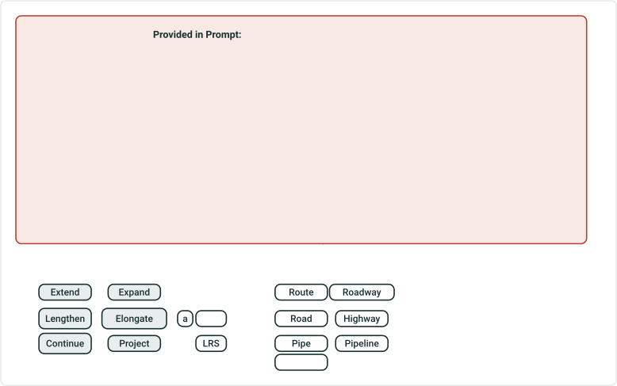

No input provided, Linear Referencing is not licensed
AI Assistant should:

Not show any info

Test also with line networks

## Slide 17

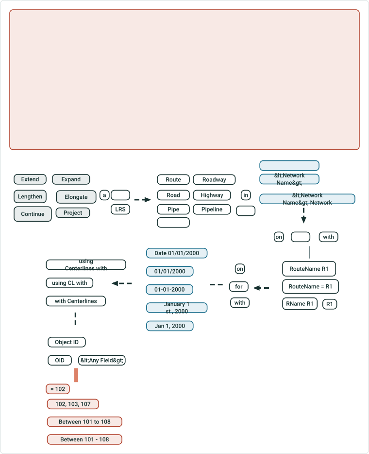

Centerlines*, Network, Effective Date, Source Route, but centerlines are invalid/duplicates/do not exist/cause non-monotonic route
<Network Name> Network
Inform user input centerlines are invalid and prompt for new centerlines
January 1st, 2000
Between 101 to 108
Between 101 - 108
Test also with line networks

## Slide 18

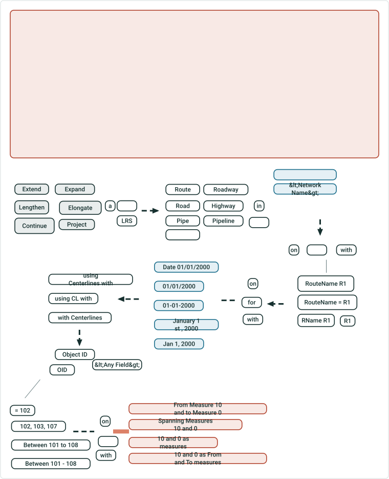

Centerlines, Network, Effective Date, Source Route, Extended From Measure, Extended To Measure, but extended section measures are invalid
Inform user that measures are invalid and prompt for new measures (or ask to use default measures)
January 1st, 2000
Between 101 to 108
Between 101 - 108

From Measure 10 and to Measure 0
Spanning Measures 10 and 0
10 and 0 as measures
10 and 0 as From and To measures

## Slide 19

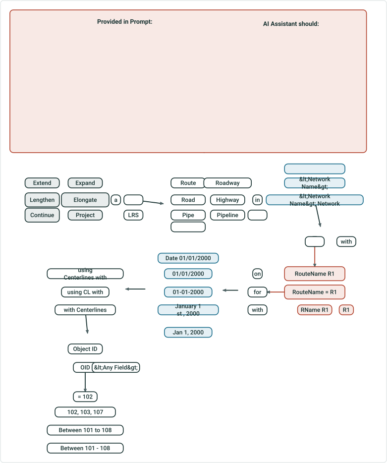

Centerlines, Network, Effective Date, Source Route, but Source Route does not exist for given effective date/does not exist
<Network Name> Network
Inform user source route is invalid and ask them to provide a different route
January 1st, 2000
Between 101 to 108
Between 101 - 108
Test also with line networks

## Slide 20

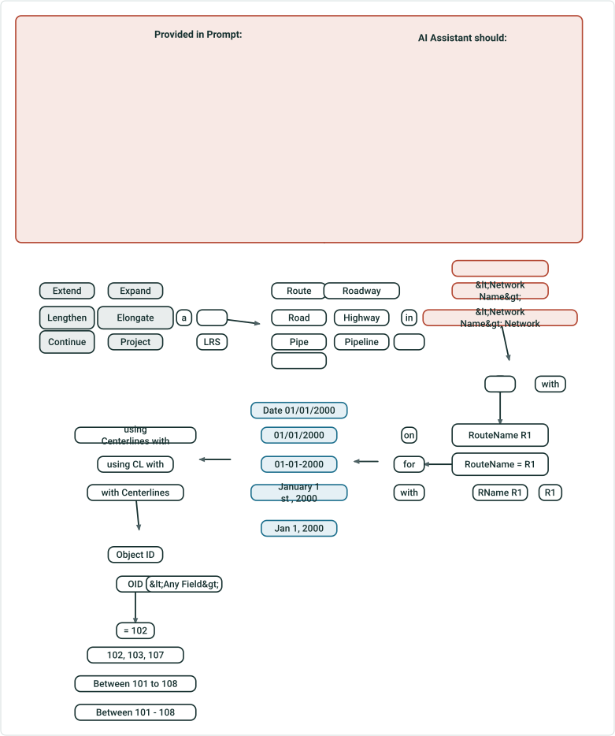

Centerlines, Network, Effective Date, Source Route, but input Network does not exist/is not in map/is invalid
<Network Name> Network
Inform user input Network has issues and prompt for new input network (or ask user to add network to map)
January 1st, 2000
Between 101 to 108
Between 101 - 108
Test also with line networks

## Slide 21

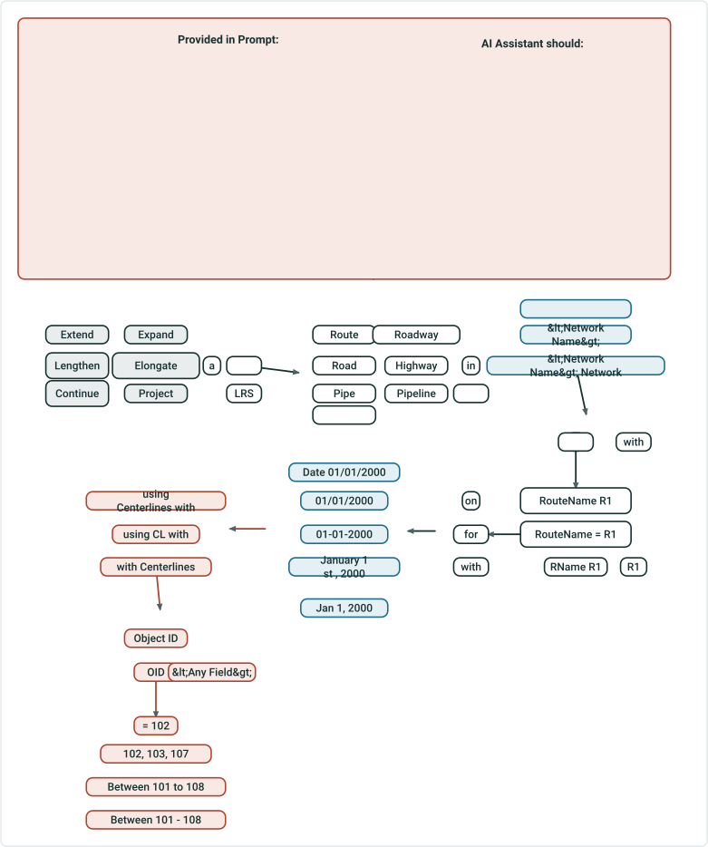

Centerlines, Network, Effective Date, Source Route, but centerline layer is not in map
<Network Name> Network
Inform user Centerline layer is not present in map and needs to be added to proceed
January 1st, 2000
Between 101 to 108
Between 101 - 108
Test also with line networks

## Slide 22

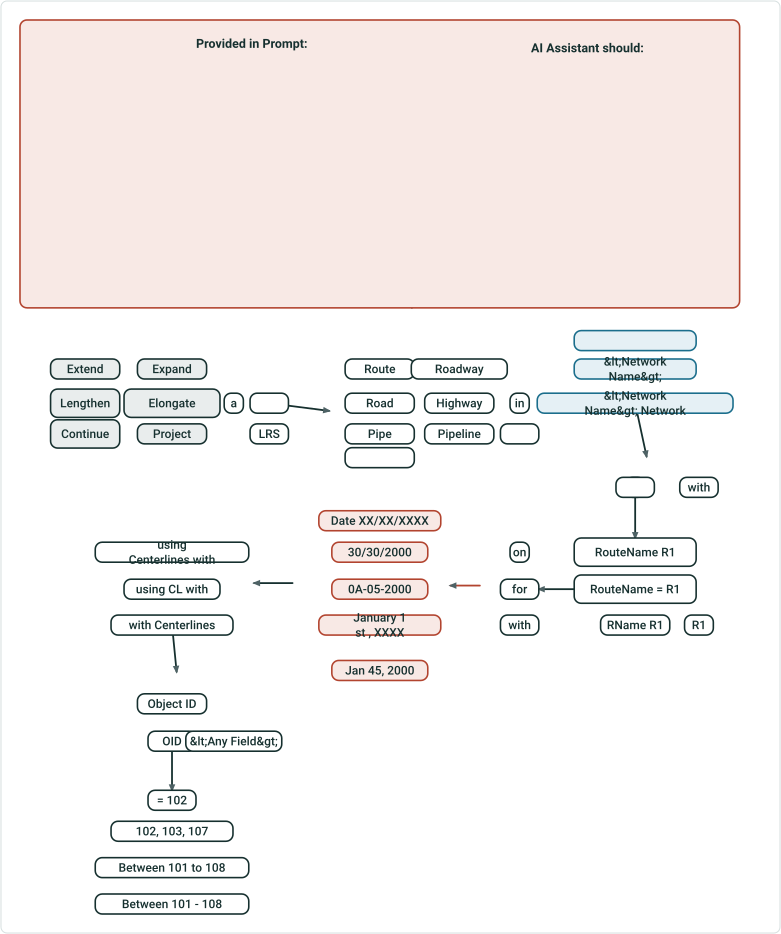

Centerlines, Network, Effective Date, Source Route, but Effective Date is invalid
<Network Name> Network
Inform user Effective Date is invalid and prompt for new date
January 1st, XXXX
Between 101 to 108
Between 101 - 108
Test also with line networks

## Slide 23

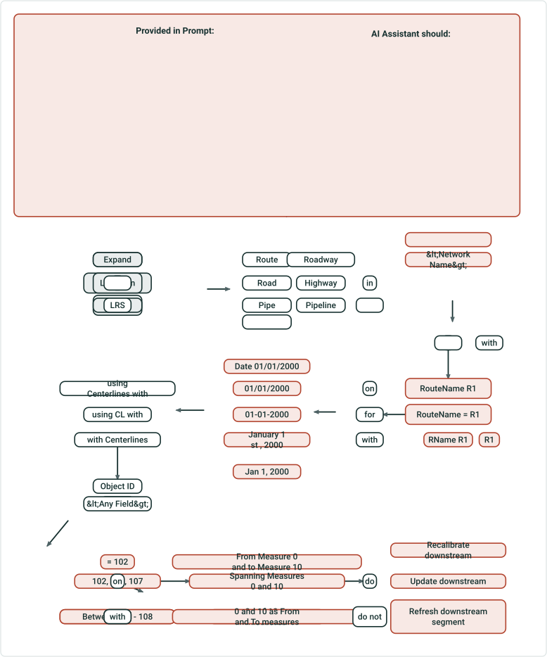

Centerlines, Network*, Effective Date, Source Route, Extended From Measure, Extended To Measure, Downstream recalibration option, but prompt has multiple issues
Inform user of issues in prompt and work through the issues until a valid extension operation is given
January 1st, 2000
Between 101 to 108
Between 101 - 108

From Measure 0 and to Measure 10
Spanning Measures 0  and 10
0 and 10 as measures
0 and 10 as From and To measures
Refresh downstream segment

## Slide 24

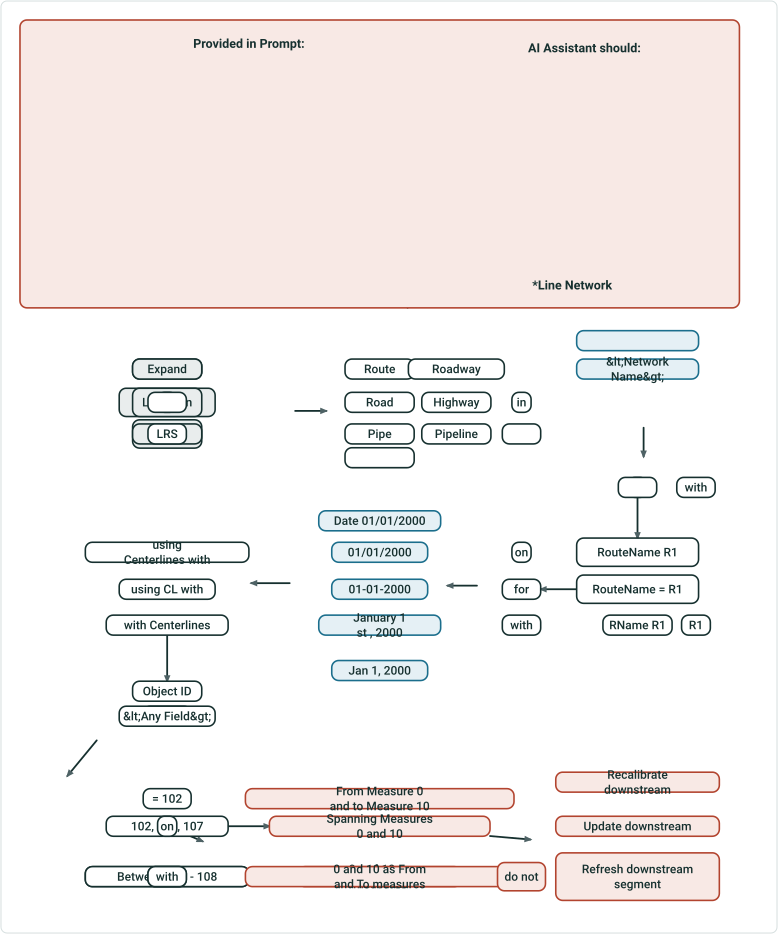

Centerlines, Network*, Effective Date, Source Route, Extended From Measure, Extended To Measure, Downstream recalibration option, but downstream calibration is disabled so Create Route should be used instead
Inform user that Create Route should be used instead of Extend
January 1st, 2000
Between 101 to 108
Between 101 - 108

From Measure 0 and to Measure 10
Spanning Measures 0  and 10
0 and 10 as measures
0 and 10 as From and To measures
Refresh downstream segment
