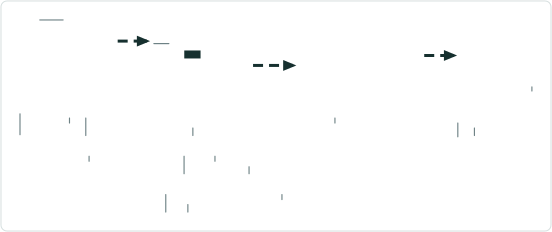
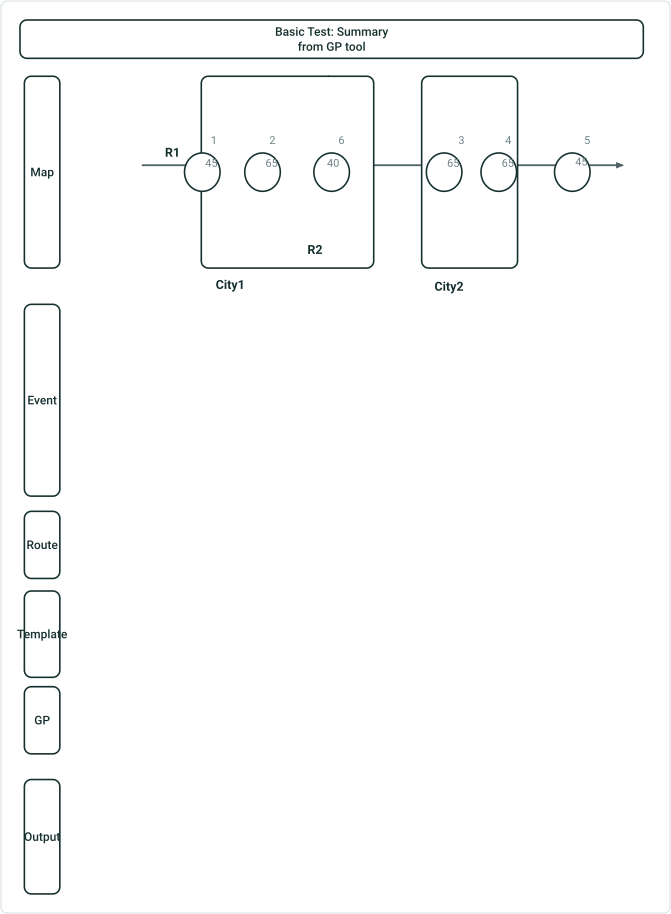
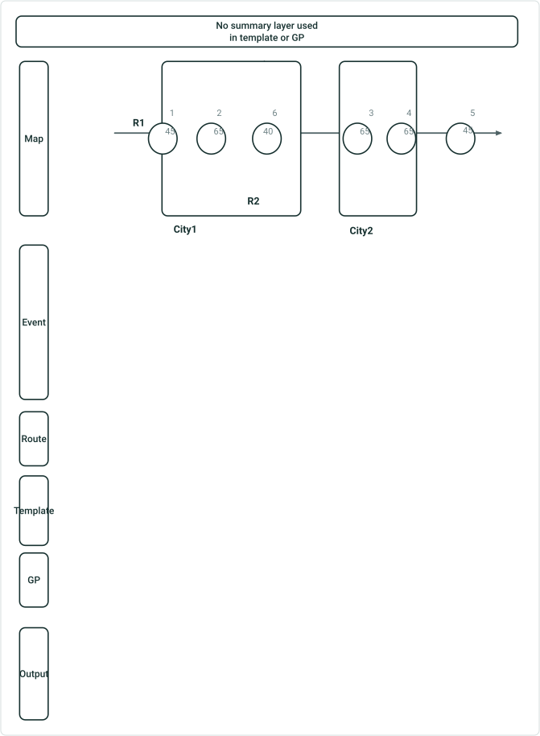
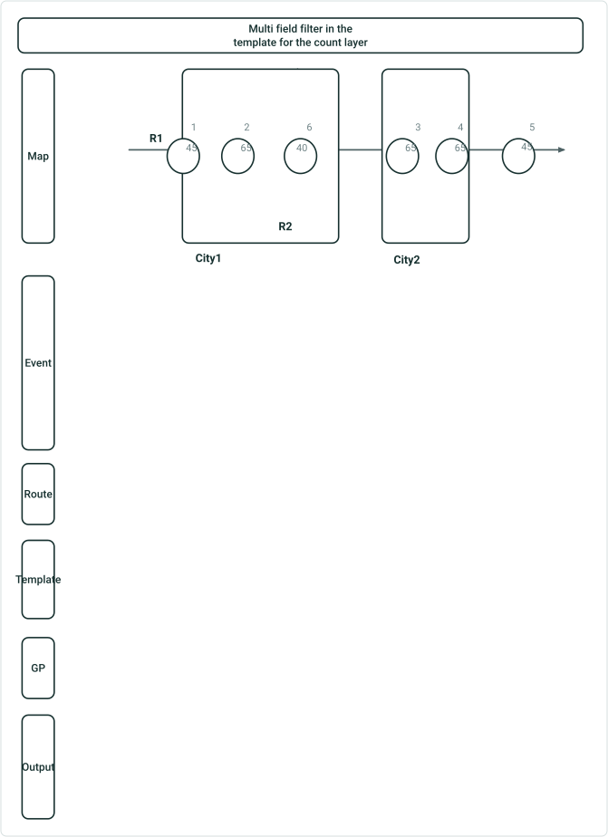
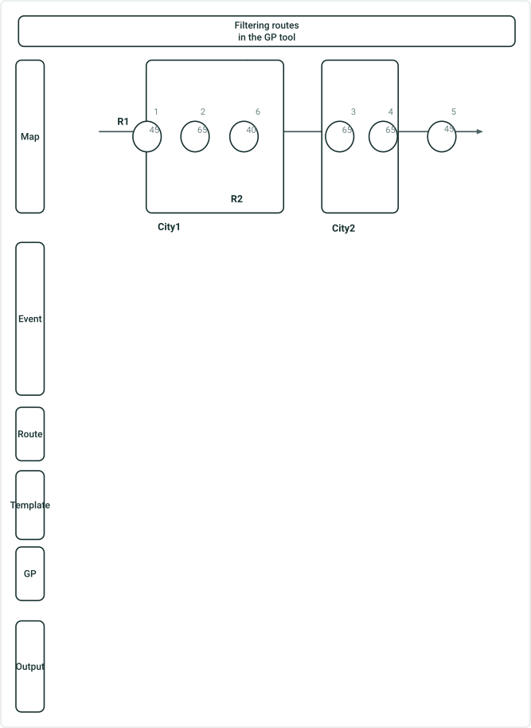
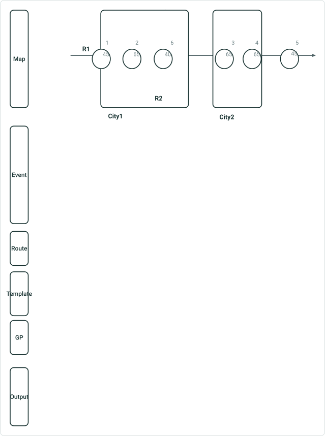
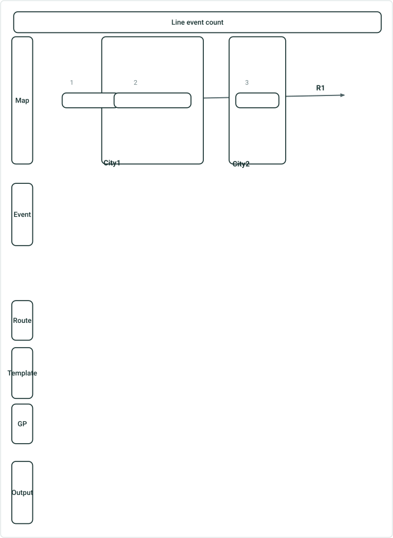

# Feature Count Support Generate Data GP Tool Test Plan

|   |   |
| --- | --- |
| **Kind** | Test Plan · Pro |
| **Release** | — |
| **Source** | [TestPlan_FeatureCountSupport_GenerateData_GPtool.pptx](<https://esriis.sharepoint.com/sites/LocationReferencing/Shared%20Documents/General/Test%20Plans/TestPlan_FeatureCountSupport_GenerateData_GPtool.pptx>) |
| **Edited** | 2025-01-16 23:29 by Rahul Rakshit |
| **Extracted** | 2026-09-04 · lane `xmlstrip` |

<!-- metadata
```yaml
title: "Feature Count Support Generate Data GP Tool Test Plan"
source_file: "TestPlan_FeatureCountSupport_GenerateData_GPtool.pptx"
source_url: "https://esriis.sharepoint.com/sites/LocationReferencing/Shared%20Documents/General/Test%20Plans/TestPlan_FeatureCountSupport_GenerateData_GPtool.pptx"
doc_id: 253
doc_kind: "Test Plan"
surface: "Pro"
doc_revision: ""
target_release: ""
pe: ""
dev: ""
author: "Rahul Rakshit"
last_edited_by: "Rahul Rakshit"
last_edited: "2025-01-16T23:29:09Z"
extracted: 2026-09-04
extraction_lane: xmlstrip
prompt_version: "v2.0.2"
keywords: ["feature count", "generate data", "geoprocessing", "route filtering", "summary layer", "time slice"]
tools: ["Generate Feature Count"]
products: []
issues: []
related: [{"doc":173,"file":"standalone-gp-generate-feature-count-test-plan__doc173.md","s":6.465},{"doc":281,"file":"generate-feature-count-geoprocessing-tool__doc281.md","s":4.52},{"doc":147,"file":"generate-lrs-feature-count-location-referencing__doc147.md","s":4.3},{"doc":260,"file":"generate-a-route-log-using-the-glrsdp-gp-tool-test-plan__doc260.md","s":3.967},{"doc":339,"file":"generate-lr-data-product-support-summary-and-length-fields-from-the-template__doc339.md","s":3.925}]
```
-->

## Summary

Test plan for feature count support using a generate data geoprocessing tool. It includes tests for summary generation from templates and GP tools, filtering routes and summary layers, multi-field filters, and time slice handling for retired events.

## Related documents

<!-- related:begin -->
- [Standalone GP – Generate Feature Count – Test Plan](<https://esriis.sharepoint.com/sites/lrsworkspace/LRS Doc Index/Test Plans/standalone-gp-generate-feature-count-test-plan__doc173.md>) — similar text 0.55 · 3 title words · 2 filename words · same kind/surface <!-- rel:173 -->
- [Generate Feature Count Geoprocessing Tool](<https://esriis.sharepoint.com/sites/lrsworkspace/LRS Doc Index/Other/generate-feature-count-geoprocessing-tool__doc281.md>) — similar text 0.22 · 4 title words · 2 filename words · same surface <!-- rel:281 -->
- [Generate LRS Feature Count (Location Referencing)](<https://esriis.sharepoint.com/sites/lrsworkspace/LRS Doc Index/Other/generate-lrs-feature-count-location-referencing__doc147.md>) — similar text 0.14 · 3 title words · 2 filename words · same surface <!-- rel:147 -->
- [Generate a Route Log using the GLRSDP GP Tool – Test Plan](<https://esriis.sharepoint.com/sites/lrsworkspace/LRS Doc Index/Test Plans/generate-a-route-log-using-the-glrsdp-gp-tool-test-plan__doc260.md>) — similar text 0.20 · 2 title words · 1 filename word · same kind/surface/folder <!-- rel:260 -->
- [Generate LR Data Product: Support summary and length fields from the template – Test Plan](<https://esriis.sharepoint.com/sites/lrsworkspace/LRS Doc Index/Test Plans/generate-lr-data-product-support-summary-and-length-fields-from-the-template__doc339.md>) — similar text 0.14 · 2 title words · 1 filename word · same kind/surface/folder <!-- rel:339 -->
<!-- related:end -->

<!-- docs:begin -->
## Esri documentation

[Create a template for an LRS feature count data product](https://doc.esri.com/en/arcgis-pro/latest/help/production/roads-highways/create-a-template-for-an-lrs-feature-count-data-product.html)

_No page matched:_ [Generate Feature Count](https://www.google.com/search?q=%22Generate%20Feature%20Count%22+site%3Adoc.esri.com)
<!-- docs:end -->

---

## Slide 1




## Slide 2


| Route ID | Event ID | From Date | To Date | Measure | Speed Sign | Loc Error |
| --- | --- | --- | --- | --- | --- | --- |
| R1 | 1 | 1/1/2000 | Null | 5 | 45 | No error |
| R1 | 2 | 1/1/2000 | Null | 10 | 65 | No error |
| R1 | 3 | 1/1/2000 | Null | 35 | 65 | No error |
| R1 | 4 | 1/1/2000 | Null | 40 | 65 | No error |
| R1 | 5 | 1/1/2020 | Null | 55 | 45 | No error |
| R2 | 6 | 1/1/2010 | Null | 8 | 40 | No error |

| Route ID | From Date | To Date |
| --- | --- | --- |
| R1 | 1/1/2000 | Null |
| R2 | 1/1/2010 | Null |

| Input Route Features |  |
| --- | --- |
| Effective date | 1/3/2025 |
| Summary |  |

| Summary Layers | City |  |
| --- | --- | --- |
| Count Layers | Signs | Filter Sign Type = Speed Limit |

| City | Route ID | Speed Signs |
| --- | --- | --- |
| City1 | R1 | 2 |
| City2 | R1 | 2 |
| Unclassified | R1 | 1 |
| City1 | R2 | 1 |

Basic Test: Summary from Template

## Slide 3



| Route ID | Event ID | From Date | To Date | Measure | Speed Sign | Loc Error |
| --- | --- | --- | --- | --- | --- | --- |
| R1 | 1 | 1/1/2000 | Null | 5 | 45 | No error |
| R1 | 2 | 1/1/2000 | Null | 10 | 65 | No error |
| R1 | 3 | 1/1/2000 | Null | 35 | 65 | No error |
| R1 | 4 | 1/1/2000 | Null | 40 | 65 | No error |
| R1 | 5 | 1/1/2020 | Null | 55 | 45 | No error |
| R2 | 6 | 1/1/2010 | Null | 8 | 40 | No error |

| Route ID | From Date | To Date |
| --- | --- | --- |
| R1 | 1/1/2000 | Null |
| R2 | 1/1/2010 | Null |

| Input Route Features |  |
| --- | --- |
| Effective date | 1/3/2025 |
| Summary | City |

| Count Layers | Signs | Filter Sign Type = Speed Limit |
| --- | --- | --- |

| City | Route ID | Speed Signs |
| --- | --- | --- |
| City1 | R1 | 2 |
| City2 | R1 | 2 |
| Unclassified | R1 | 1 |
| City1 | R2 | 1 |

Basic Test: Summary from GP tool

## Slide 4



| Route ID | Event ID | From Date | To Date | Measure | Speed Sign | Loc Error |
| --- | --- | --- | --- | --- | --- | --- |
| R1 | 1 | 1/1/2000 | Null | 5 | 45 | No error |
| R1 | 2 | 1/1/2000 | Null | 10 | 65 | No error |
| R1 | 3 | 1/1/2000 | Null | 35 | 65 | No error |
| R1 | 4 | 1/1/2000 | Null | 40 | 65 | No error |
| R1 | 5 | 1/1/2020 | Null | 55 | 45 | No error |
| R2 | 6 | 1/1/2010 | Null | 8 | 40 | No error |

| Route ID | From Date | To Date |
| --- | --- | --- |
| R1 | 1/1/2000 | Null |
| R2 | 1/1/2010 | Null |

| Input Route Features |  |
| --- | --- |
| Effective date | 1/3/2025 |
| Summary |  |

| Summary Layers |  |  |
| --- | --- | --- |
| Count Layers | Signs | Filter Sign Type = Speed Limit |

| Route ID | Speed Signs |
| --- | --- |
| R1 | 5 |
| R2 | 1 |

No summary layer used in template or GP

## Slide 5



| Route ID | Event ID | From Date | To Date | Measure | Speed Sign | Loc Error |
| --- | --- | --- | --- | --- | --- | --- |
| R1 | 1 | 1/1/2000 | Null | 5 | 45 | No error |
| R1 | 2 | 1/1/2000 | Null | 10 | 65 | No error |
| R1 | 3 | 1/1/2000 | Null | 35 | 65 | No error |
| R1 | 4 | 1/1/2000 | Null | 40 | 65 | No error |
| R1 | 5 | 1/1/2020 | Null | 55 | 45 | No error |
| R2 | 6 | 1/1/2010 | Null | 8 | 40 | No error |

| Route ID | From Date | To Date |
| --- | --- | --- |
| R1 | 1/1/2000 | Null |
| R2 | 1/1/2010 | Null |

| Input Route Features |  |
| --- | --- |
| Effective date | 1/3/2025 |
| Summary |  |

| Summary Layers | City |  |
| --- | --- | --- |
| Count Layers | Signs | Filter Sign Type = Speed Limit AND Sign TEXT = “65” |

| City | Route ID | Speed Signs |
| --- | --- | --- |
| City1 | R1 | 1 |
| City2 | R1 | 2 |

Multi field filter in the template for the count layer

## Slide 6



| Route ID | Event ID | From Date | To Date | Measure | Speed Sign | Loc Error |
| --- | --- | --- | --- | --- | --- | --- |
| R1 | 1 | 1/1/2000 | Null | 5 | 45 | No error |
| R1 | 2 | 1/1/2000 | Null | 10 | 65 | No error |
| R1 | 3 | 1/1/2000 | Null | 35 | 65 | No error |
| R1 | 4 | 1/1/2000 | Null | 40 | 65 | No error |
| R1 | 5 | 1/1/2020 | Null | 55 | 45 | No error |
| R2 | 6 | 1/1/2010 | Null | 8 | 40 | No error |

| Route ID | From Date | To Date |
| --- | --- | --- |
| R1 | 1/1/2000 | Null |
| R2 | 1/1/2010 | Null |

| Input Route Features | Filter Route ID = R2 |
| --- | --- |
| Effective date | 1/3/2025 |

| Summary Layers | City |  |
| --- | --- | --- |
| Count Layers | Signs | Filter Sign Type = Speed Limit |

| City | Route ID | Speed Signs |
| --- | --- | --- |
| City1 | R2 | 1 |

Filtering routes in the GP tool

## Slide 7


| Route ID | Event ID | From Date | To Date | Measure | Speed Sign | Loc Error |
| --- | --- | --- | --- | --- | --- | --- |
| R1 | 1 | 1/1/2000 | Null | 5 | 45 | No error |
| R1 | 2 | 1/1/2000 | Null | 10 | 65 | No error |
| R1 | 3 | 1/1/2000 | Null | 35 | 65 | No error |
| R1 | 4 | 1/1/2000 | Null | 40 | 65 | No error |
| R1 | 5 | 1/1/2020 | Null | 55 | 45 | No error |
| R2 | 6 | 1/1/2010 | Null | 8 | 40 | No error |

| Route ID | From Date | To Date |
| --- | --- | --- |
| R1 | 1/1/2000 | Null |
| R2 | 1/1/2010 | Null |

| Input Route Features |  |
| --- | --- |
| Effective date | 1/3/2025 |

| Summary Layers | City | Filter City Name= City1 |
| --- | --- | --- |
| Count Layers | Signs | Filter Sign Type = Speed Limit |

| City | Route ID | Speed Signs |
| --- | --- | --- |
| City1 | R1 | 2 |
| City1 | R2 | 1 |

Using a filter for summary layer in template

## Slide 8



| Route ID | Event ID | From Date | To Date | Measure | Speed Sign | Loc Error |
| --- | --- | --- | --- | --- | --- | --- |
| R1 | 1 | 1/1/2000 | Null | 5 | 45 | No error |
| R1 | 2 | 1/1/2000 | Null | 10 | 65 | No error |
| R1 | 3 | 1/1/2000 | Null | 35 | 65 | No error |
| R1 | 4 | 1/1/2000 | 12/31/2005 | 40 | 65 | No error |
| R1 | 5 | 1/1/2020 | Null | 55 | 45 | No error |
| R2 | 6 | 1/1/2010 | Null | 8 | 40 | No error |

| Route ID | From Date | To Date |
| --- | --- | --- |
| R1 | 1/1/2000 | Null |
| R2 | 1/1/2010 | Null |

| Input Route Features |  |
| --- | --- |
| Effective date | 1/3/2025 |
| Summary |  |

| Summary Layers | City |  |
| --- | --- | --- |
| Count Layers | Signs | Filter Sign Type = Speed Limit |

| City | Route ID | Speed Signs |
| --- | --- | --- |
| City1 | R1 | 2 |
| City2 | R1 | 1 |
| Unclassified | R1 | 1 |
| City1 | R2 | 1 |

Testing with a time slice: Retired event not included in count

## Slide 9



| Route ID | Event ID | From Date | To Date | From Measure | To Measure | Functional Class | Loc Error |
| --- | --- | --- | --- | --- | --- | --- | --- |
| R1 | 1 | 1/1/2000 | Null | 5 | 15 | Local | No error |
| R1 | 2 | 1/1/2000 | Null | 15 | 34 | Arterial | No error |
| R1 | 3 | 1/1/2000 | Null | 46 | 51 | Local | No error |

| Route ID | From Date | To Date |
| --- | --- | --- |
| R1 | 1/1/2000 | Null |

| Input Route Features |  |
| --- | --- |
| Effective date | 12/31/2022 |
| Summary |  |

| Summary Layers | City |
| --- | --- |
| Count Layers | Functional Class |

| City | Route ID | Speed Signs |
| --- | --- | --- |
| City1 | R1 | 2 |
| City2 | R1 | 1 |
| Unclassified | R1 | 1 |

## Slide 10

Other Tests

## Slide 11

Other Tests -2
