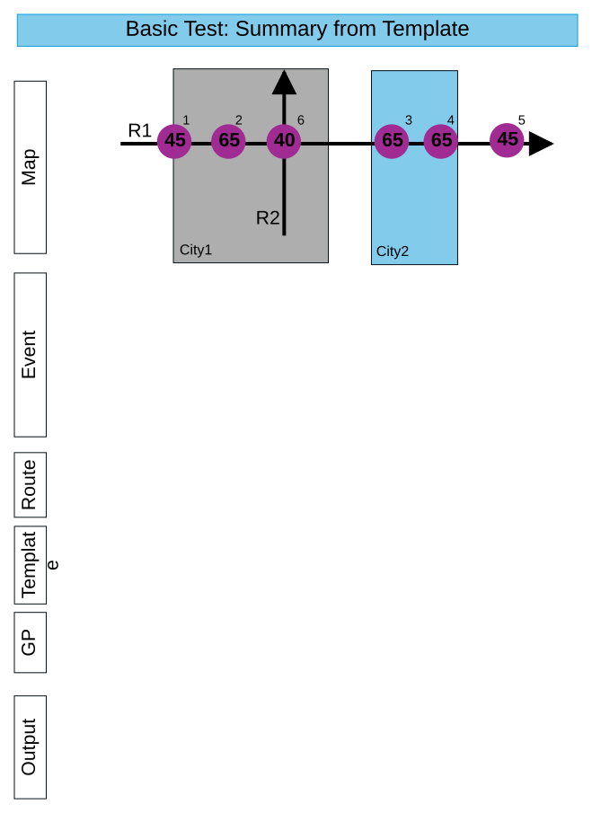
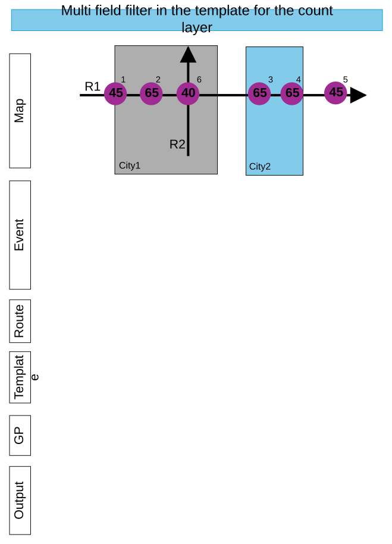
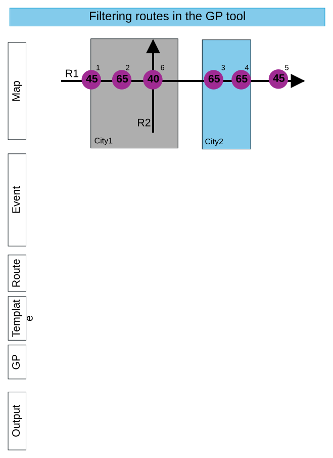
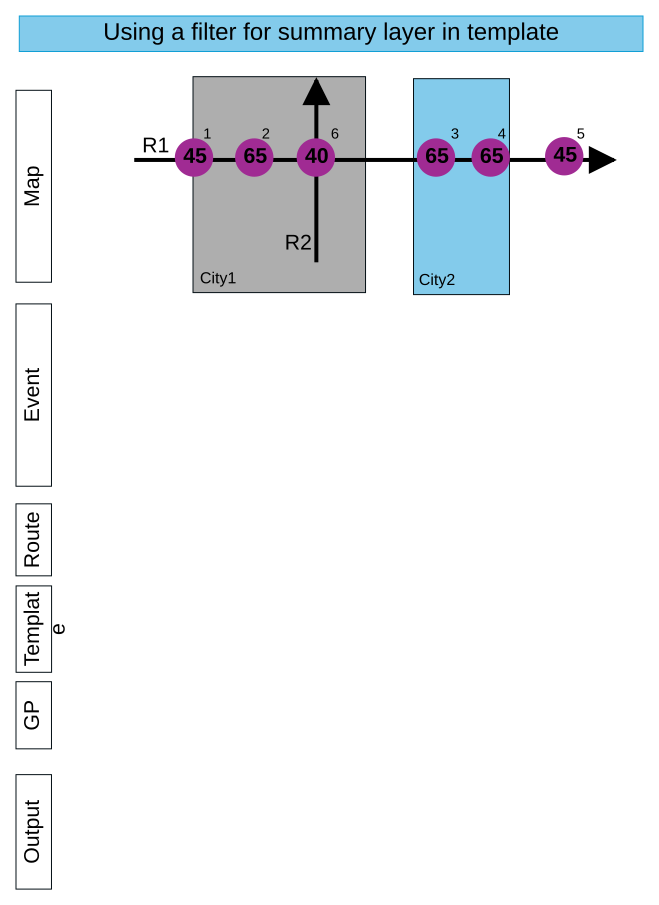
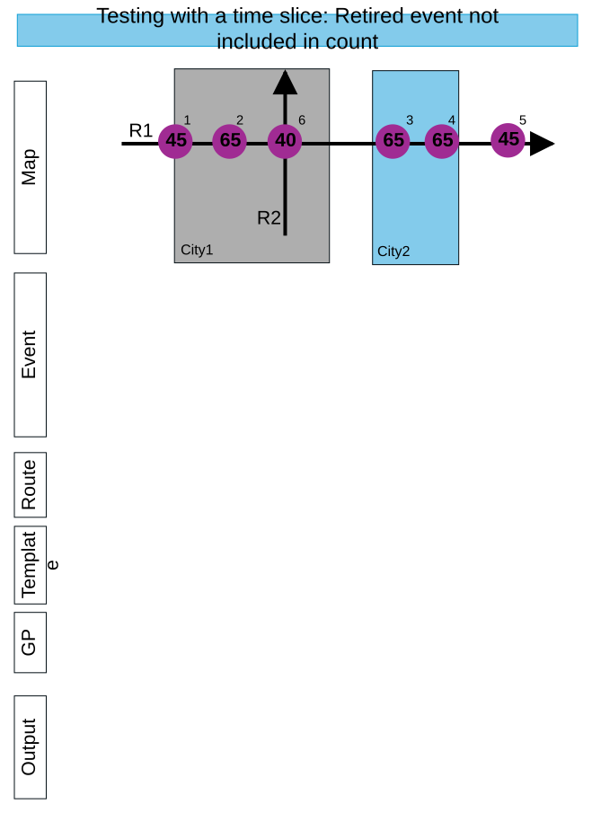
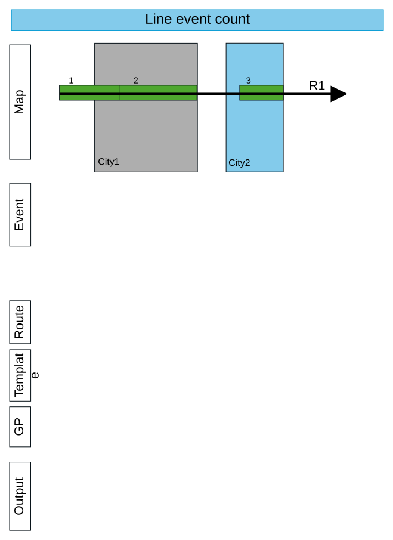

# Feature Count Support Generate Data GP Tool Test Plan

| Field | Value |
| --- | --- |
| **Doc** | 253 · Test Plan · Pro |
| **Product** | — |
| **Release** | — |
| **Issues** | — |
| **Source** | [TestPlan_FeatureCountSupport_GenerateData_GPtool.pptx](<https://esriis.sharepoint.com/sites/LocationReferencing/Shared%20Documents/General/Test%20Plans/TestPlan_FeatureCountSupport_GenerateData_GPtool.pptx>) |
| **People** | author Rahul Rakshit · PE — · dev — |
| **Edited** | 2025-01-16 23:29 by Rahul Rakshit |
| **Extracted** | 2026-09-04 · lane xmlstrip · format 3.0 · prompt v2.0.2 |
| **Keywords** | feature count · generate data · geoprocessing · route filtering · summary layer · time slice |
| **Tools** | Generate Feature Count |

## Summary

Test plan for feature count support using a generate data geoprocessing tool. It includes tests for summary generation from templates and GP tools, filtering routes and summary layers, multi-field filters, and time slice handling for retired events.

## Related documents

<!-- related:begin -->
- [Standalone GP – Generate Feature Count – Test Plan](<https://esriis.sharepoint.com/sites/lrsworkspace/LRS Doc Index/Test Plans/6205-standalone-gp-generate-feature-count.md>) — similar text 0.55 · 3 title words · 2 filename words · same kind/surface <!-- rel:173 s=6.465 -->
- [Generate Feature Count Geoprocessing Tool](<https://esriis.sharepoint.com/sites/lrsworkspace/LRS Doc Index/Other/generate-feature-count-gp.md>) — similar text 0.22 · 4 title words · 2 filename words · same surface <!-- rel:281 s=4.52 -->
- [Generate LRS Feature Count (Location Referencing)](<https://esriis.sharepoint.com/sites/lrsworkspace/LRS Doc Index/Other/6749-generate-lrs-feature-count-lr.md>) — similar text 0.14 · 3 title words · 2 filename words · same surface <!-- rel:147 s=4.3 -->
- [Generate a Route Log using the GLRSDP GP Tool – Test Plan](<https://esriis.sharepoint.com/sites/lrsworkspace/LRS Doc Index/Test Plans/6209-generate-a-route-log-using-the-glrsdp-gp.md>) — similar text 0.20 · 2 title words · 1 filename word · same kind/surface/folder <!-- rel:260 s=3.967 -->
- [Generate LR Data Product: Support summary and length fields from the template – Test Plan](<https://esriis.sharepoint.com/sites/lrsworkspace/LRS Doc Index/Test Plans/5769-generate-lr-data-product-support-summary-and-length-fields.md>) — similar text 0.14 · 2 title words · 1 filename word · same kind/surface/folder <!-- rel:339 s=3.925 -->
<!-- related:end -->

<!-- docs:begin -->
## Esri documentation

[Create a template for an LRS feature count data product](https://doc.esri.com/en/arcgis-pro/latest/help/production/roads-highways/create-a-template-for-an-lrs-feature-count-data-product.html)

_No page matched:_ [Generate Feature Count](https://www.google.com/search?q=%22Generate%20Feature%20Count%22+site%3Adoc.esri.com)
<!-- docs:end -->

---

## Slide 1

## Slide 2 — Basic Test: Summary from Template

| Route ID | Event ID | From Date | To Date | Measure | Speed Sign | Loc Error |
| --- | --- | --- | --- | --- | --- | --- |
| R1 | 1 | 1/1/2000 | Null | 5 | 45 | No error |
| R1 | 2 | 1/1/2000 | Null | 10 | 65 | No error |
| R1 | 3 | 1/1/2000 | Null | 35 | 65 | No error |
| R1 | 4 | 1/1/2000 | Null | 40 | 65 | No error |
| R1 | 5 | 1/1/2020 | Null | 55 | 45 | No error |
| R2 | 6 | 1/1/2010 | Null | 8 | 40 | No error |

| Route ID | From Date | To Date |
| --- | --- | --- |
| R1 | 1/1/2000 | Null |
| R2 | 1/1/2010 | Null |

| Input Route Features |  |
| --- | --- |
| Effective date | 1/3/2025 |
| Summary |  |

| Summary Layers | City |  |
| --- | --- | --- |
| Count Layers | Signs | Filter Sign Type = Speed Limit |

| City | Route ID | Speed Signs |
| --- | --- | --- |
| City1 | R1 | 2 |
| City2 | R1 | 2 |
| Unclassified | R1 | 1 |
| City1 | R2 | 1 |

[figure: 45 · 65 · 40 · R2 · R1 · City1 · City2 · 1 · 2 · 6 · 3–5 · Map · Event · Route · Template · GP · Output]

## Slide 3 — Basic Test: Summary from GP tool

| Route ID | Event ID | From Date | To Date | Measure | Speed Sign | Loc Error |
| --- | --- | --- | --- | --- | --- | --- |
| R1 | 1 | 1/1/2000 | Null | 5 | 45 | No error |
| R1 | 2 | 1/1/2000 | Null | 10 | 65 | No error |
| R1 | 3 | 1/1/2000 | Null | 35 | 65 | No error |
| R1 | 4 | 1/1/2000 | Null | 40 | 65 | No error |
| R1 | 5 | 1/1/2020 | Null | 55 | 45 | No error |
| R2 | 6 | 1/1/2010 | Null | 8 | 40 | No error |

| Route ID | From Date | To Date |
| --- | --- | --- |
| R1 | 1/1/2000 | Null |
| R2 | 1/1/2010 | Null |

| Input Route Features |  |
| --- | --- |
| Effective date | 1/3/2025 |
| Summary | City |

| Count Layers | Signs | Filter Sign Type = Speed Limit |
| --- | --- | --- |

| City | Route ID | Speed Signs |
| --- | --- | --- |
| City1 | R1 | 2 |
| City2 | R1 | 2 |
| Unclassified | R1 | 1 |
| City1 | R2 | 1 |

[figure: 45 · 65 · 40 · R2 · R1 · City1 · City2 · 1 · 2 · 6 · 3–5 · Map · Event · Route · Template · GP · Output]

## Slide 4 — No summary layer used in template or GP

| Route ID | Event ID | From Date | To Date | Measure | Speed Sign | Loc Error |
| --- | --- | --- | --- | --- | --- | --- |
| R1 | 1 | 1/1/2000 | Null | 5 | 45 | No error |
| R1 | 2 | 1/1/2000 | Null | 10 | 65 | No error |
| R1 | 3 | 1/1/2000 | Null | 35 | 65 | No error |
| R1 | 4 | 1/1/2000 | Null | 40 | 65 | No error |
| R1 | 5 | 1/1/2020 | Null | 55 | 45 | No error |
| R2 | 6 | 1/1/2010 | Null | 8 | 40 | No error |

| Route ID | From Date | To Date |
| --- | --- | --- |
| R1 | 1/1/2000 | Null |
| R2 | 1/1/2010 | Null |

| Input Route Features |  |
| --- | --- |
| Effective date | 1/3/2025 |
| Summary |  |

| Summary Layers |  |  |
| --- | --- | --- |
| Count Layers | Signs | Filter Sign Type = Speed Limit |

| Route ID | Speed Signs |
| --- | --- |
| R1 | 5 |
| R2 | 1 |

[figure: 45 · 65 · 40 · R2 · R1 · City1 · City2 · 1 · 2 · 6 · 3–5 · Map · Event · Route · Template · GP · Output]

## Slide 5 — Multi field filter in the template for the count layer

| Route ID | Event ID | From Date | To Date | Measure | Speed Sign | Loc Error |
| --- | --- | --- | --- | --- | --- | --- |
| R1 | 1 | 1/1/2000 | Null | 5 | 45 | No error |
| R1 | 2 | 1/1/2000 | Null | 10 | 65 | No error |
| R1 | 3 | 1/1/2000 | Null | 35 | 65 | No error |
| R1 | 4 | 1/1/2000 | Null | 40 | 65 | No error |
| R1 | 5 | 1/1/2020 | Null | 55 | 45 | No error |
| R2 | 6 | 1/1/2010 | Null | 8 | 40 | No error |

| Route ID | From Date | To Date |
| --- | --- | --- |
| R1 | 1/1/2000 | Null |
| R2 | 1/1/2010 | Null |

| Input Route Features |  |
| --- | --- |
| Effective date | 1/3/2025 |
| Summary |  |

| Summary Layers | City |  |
| --- | --- | --- |
| Count Layers | Signs | Filter Sign Type = Speed Limit AND Sign TEXT = “65” |

| City | Route ID | Speed Signs |
| --- | --- | --- |
| City1 | R1 | 1 |
| City2 | R1 | 2 |

[figure: 45 · 65 · 40 · R2 · R1 · City1 · City2 · 1 · 2 · 6 · 3–5 · Map · Event · Route · Template · GP · Output]

## Slide 6 — Filtering routes in the GP tool

| Route ID | Event ID | From Date | To Date | Measure | Speed Sign | Loc Error |
| --- | --- | --- | --- | --- | --- | --- |
| R1 | 1 | 1/1/2000 | Null | 5 | 45 | No error |
| R1 | 2 | 1/1/2000 | Null | 10 | 65 | No error |
| R1 | 3 | 1/1/2000 | Null | 35 | 65 | No error |
| R1 | 4 | 1/1/2000 | Null | 40 | 65 | No error |
| R1 | 5 | 1/1/2020 | Null | 55 | 45 | No error |
| R2 | 6 | 1/1/2010 | Null | 8 | 40 | No error |

| Route ID | From Date | To Date |
| --- | --- | --- |
| R1 | 1/1/2000 | Null |
| R2 | 1/1/2010 | Null |

| Input Route Features | Filter Route ID = R2 |
| --- | --- |
| Effective date | 1/3/2025 |

| Summary Layers | City |  |
| --- | --- | --- |
| Count Layers | Signs | Filter Sign Type = Speed Limit |

| City | Route ID | Speed Signs |
| --- | --- | --- |
| City1 | R2 | 1 |

[figure: 45 · 65 · 40 · R2 · R1 · City1 · City2 · 1 · 2 · 6 · 3–5 · Map · Event · Route · Template · GP · Output]

## Slide 7 — Using a filter for summary layer in template

| Route ID | Event ID | From Date | To Date | Measure | Speed Sign | Loc Error |
| --- | --- | --- | --- | --- | --- | --- |
| R1 | 1 | 1/1/2000 | Null | 5 | 45 | No error |
| R1 | 2 | 1/1/2000 | Null | 10 | 65 | No error |
| R1 | 3 | 1/1/2000 | Null | 35 | 65 | No error |
| R1 | 4 | 1/1/2000 | Null | 40 | 65 | No error |
| R1 | 5 | 1/1/2020 | Null | 55 | 45 | No error |
| R2 | 6 | 1/1/2010 | Null | 8 | 40 | No error |

| Route ID | From Date | To Date |
| --- | --- | --- |
| R1 | 1/1/2000 | Null |
| R2 | 1/1/2010 | Null |

| Input Route Features |  |
| --- | --- |
| Effective date | 1/3/2025 |

| Summary Layers | City | Filter City Name= City1 |
| --- | --- | --- |
| Count Layers | Signs | Filter Sign Type = Speed Limit |

| City | Route ID | Speed Signs |
| --- | --- | --- |
| City1 | R1 | 2 |
| City1 | R2 | 1 |

[figure: 45 · 65 · 40 · R2 · R1 · City1 · City2 · 1 · 2 · 6 · 3–5 · Map · Event · Route · Template · GP · Output]

## Slide 8 — Testing with a time slice: Retired event not included in count

| Route ID | Event ID | From Date | To Date | Measure | Speed Sign | Loc Error |
| --- | --- | --- | --- | --- | --- | --- |
| R1 | 1 | 1/1/2000 | Null | 5 | 45 | No error |
| R1 | 2 | 1/1/2000 | Null | 10 | 65 | No error |
| R1 | 3 | 1/1/2000 | Null | 35 | 65 | No error |
| R1 | 4 | 1/1/2000 | 12/31/2005 | 40 | 65 | No error |
| R1 | 5 | 1/1/2020 | Null | 55 | 45 | No error |
| R2 | 6 | 1/1/2010 | Null | 8 | 40 | No error |

| Route ID | From Date | To Date |
| --- | --- | --- |
| R1 | 1/1/2000 | Null |
| R2 | 1/1/2010 | Null |

| Input Route Features |  |
| --- | --- |
| Effective date | 1/3/2025 |
| Summary |  |

| Summary Layers | City |  |
| --- | --- | --- |
| Count Layers | Signs | Filter Sign Type = Speed Limit |

| City | Route ID | Speed Signs |
| --- | --- | --- |
| City1 | R1 | 2 |
| City2 | R1 | 1 |
| Unclassified | R1 | 1 |
| City1 | R2 | 1 |

[figure: 45 · 65 · 40 · R2 · R1 · City1 · City2 · 1 · 2 · 6 · 3–5 · Map · Event · Route · Template · GP · Output]

## Slide 9

| Route ID | Event ID | From Date | To Date | From Measure | To Measure | Functional Class | Loc Error |
| --- | --- | --- | --- | --- | --- | --- | --- |
| R1 | 1 | 1/1/2000 | Null | 5 | 15 | Local | No error |
| R1 | 2 | 1/1/2000 | Null | 15 | 34 | Arterial | No error |
| R1 | 3 | 1/1/2000 | Null | 46 | 51 | Local | No error |

| Route ID | From Date | To Date |
| --- | --- | --- |
| R1 | 1/1/2000 | Null |

| Input Route Features |  |
| --- | --- |
| Effective date | 12/31/2022 |
| Summary |  |

| Summary Layers | City |
| --- | --- |
| Count Layers | Functional Class |

| City | Route ID | Speed Signs |
| --- | --- | --- |
| City1 | R1 | 2 |
| City2 | R1 | 1 |
| Unclassified | R1 | 1 |

[figure: R1 · City1 · City2 · Event · Route · Template · GP · Output · Map · 1–3 · Line event count]

## Slide 10 — Other Tests

## Slide 11 — Other Tests -2
