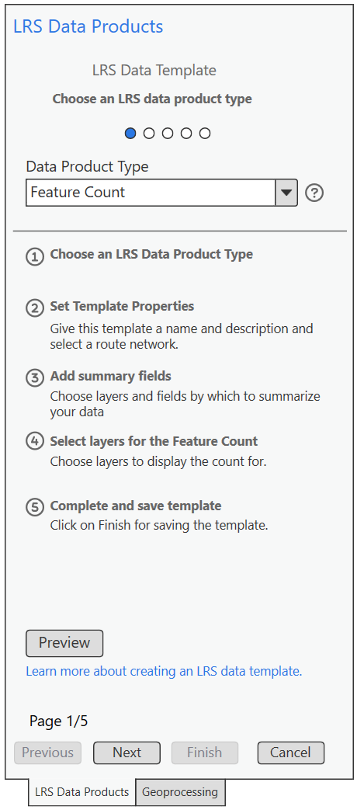
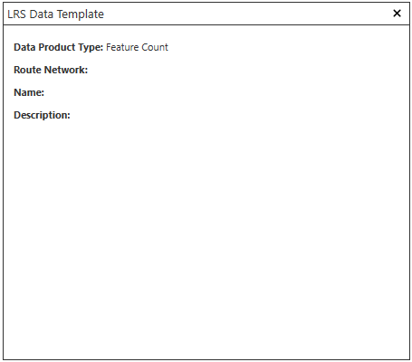
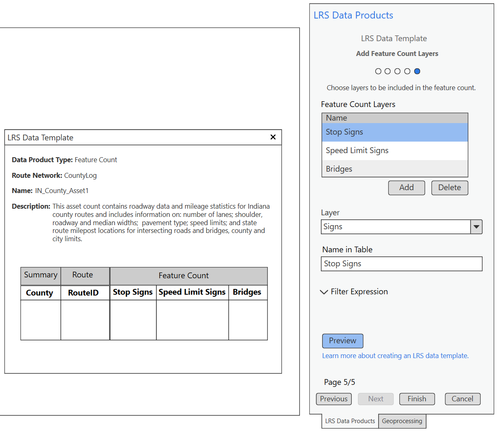

# Feature Count Template Test Plan

|   |   |
| --- | --- |
| **Kind** | Test Plan · Pro |
| **Release** | — |
| **Source** | [FeatureCountTemplate_TestPlan1.pptx](<https://esriis.sharepoint.com/sites/LocationReferencing/Shared%20Documents/General/Test%20Plans/FeatureCountTemplate_TestPlan1.pptx>) |
| **Edited** | 2025-01-14 23:02 by Rahul Rakshit |
| **Extracted** | 2026-09-04 · lane `xmlstrip` |

<!-- metadata
```yaml
title: "Feature Count Template Test Plan"
source_file: "FeatureCountTemplate_TestPlan1.pptx"
source_url: "https://esriis.sharepoint.com/sites/LocationReferencing/Shared%20Documents/General/Test%20Plans/FeatureCountTemplate_TestPlan1.pptx"
doc_id: 254
doc_kind: "Test Plan"
surface: "Pro"
doc_revision: ""
target_release: ""
pe: ""
dev: ""
author: "Rahul Rakshit"
last_edited_by: "Rahul Rakshit"
last_edited: "2025-01-14T23:02:59Z"
extracted: 2026-09-04
extraction_lane: xmlstrip
prompt_version: "v2.0.2"
keywords: ["feature count", "template", "line event", "point event", "polygon", "route identifier", "filter expression", "preview"]
tools: []
products: []
issues: []
related: [{"doc":258,"file":"lrs-data-template-create-a-template-feature-count__doc258.md","s":5.39},{"doc":196,"file":"create-a-template-for-an-lrs-feature-count-data-product__doc196.md","s":4.902},{"doc":256,"file":"route-log-data-product-template-test-plan__doc256.md","s":4.622},{"doc":198,"file":"create-a-template-for-an-lrs-feature-count-data-product__doc198.md","s":4.462},{"doc":173,"file":"standalone-gp-generate-feature-count-test-plan__doc173.md","s":4.412}]
```
-->

## Summary

Test plan for the Feature Count data product type in the Location Referencing system. It covers verification of template creation, loading, and parameter updates across multiple pages, support for line events and polygons, summary field management, route identifier field behavior based on network type, and event addition including line, point, and intersection events with filtering and preview validation.

## Related documents

<!-- related:begin -->
- [LRS Data Template: Create a template feature count](<https://esriis.sharepoint.com/sites/lrsworkspace/LRS Doc Index/User Stories/lrs-data-template-create-a-template-feature-count__doc258.md>) — similar text 0.46 · 2 title words · 2 filename words · same surface/folder <!-- rel:258 -->
- [Create a template for an LRS feature count data product](<https://esriis.sharepoint.com/sites/lrsworkspace/LRS Doc Index/Other/create-a-template-for-an-lrs-feature-count-data-product__doc196.md>) — similar text 0.22 · 2 title words · 2 filename words · same surface <!-- rel:196 -->
- [Route Log data product template – Test Plan](<https://esriis.sharepoint.com/sites/lrsworkspace/LRS Doc Index/Test Plans/route-log-data-product-template-test-plan__doc256.md>) — similar text 0.34 · same kind/surface/folder <!-- rel:256 -->
- [Create a template for an LRS feature count data product](<https://esriis.sharepoint.com/sites/lrsworkspace/LRS Doc Index/Other/create-a-template-for-an-lrs-feature-count-data-product__doc198.md>) — similar text 0.23 · 2 title words · 2 filename words · same surface <!-- rel:198 -->
- [Standalone GP – Generate Feature Count – Test Plan](<https://esriis.sharepoint.com/sites/lrsworkspace/LRS Doc Index/Test Plans/standalone-gp-generate-feature-count-test-plan__doc173.md>) — similar text 0.34 · 2 title words · 2 filename words · same kind/surface <!-- rel:173 -->
<!-- related:end -->

<!-- docs:begin -->
## Esri documentation

[Create a template for an LRS feature count data product](https://doc.esri.com/en/arcgis-pro/latest/help/production/roads-highways/create-a-template-for-an-lrs-feature-count-data-product.html) · [Create a template for an LRS length data product](https://doc.esri.com/en/arcgis-pro/latest/help/production/roads-highways/create-a-template-for-an-lrs-length-data-product.html)
<!-- docs:end -->

---

## Slide 1

## Slide 2


Page 1

  - Verify that a new Data product type “Feature Count” is available in the drop-down list.
  - Verify that the steps have updated text as per choice of data product Type.
  - Verify that the preview shows up like this. Where the route network is the first network that is available in the TOC.
  - If no network is available in the TOC, then the preview:
  - Changing the product type resets page 2-5.

  

## Slide 3


Page 2

- Verify the ability to create a new template file by typing a file name that does not exist at the selected location.
- Verify the ability to browse to an existing template file:
  - If it’s a feature count template, then load the parameters for the all the pages.
  - If it’s not a feature count template, then load the parameters for the pages 2-5 and reset the Data Product Type in page 1 to the one available in the loaded template.
- Verify that the template name, network and description are updated in the preview window.


## Slide 4


Page 3

  - Confirm that only line events and polygons are supported.
  - Verify the ability to add multiple summary fields.
  - Add filter expression.
  - Update the display value of a field.
  - Verify that the summary field shows up in the preview.
  - Changing the summary layer changes the subsequent parameters.
  - Create a template without a summary field.


## Slide 5


Page 4

  - Confirm that if the network is a non-line network, then the Route Identifier Field is “Route ID” by default. The drop down does not show up.
  - Confirm that if the network is a line network, then the Route Identifier Field is “Route Name” by default. The other option in the drop-down is the Route ID field.
  - Confirm that if the network is a line network, then an additional field “Line Name” is added to the preview.
  - Verify that Field Name shows up in the preview.


## Slide 6


Page 5

  - Verify that Line events (spanning and non spanning), point events and intersection can be added.
  - Add a filter expression to the Feature Count Layer.
  - Verify that the Field Name shows up in the preview table.

Add unique values

 
