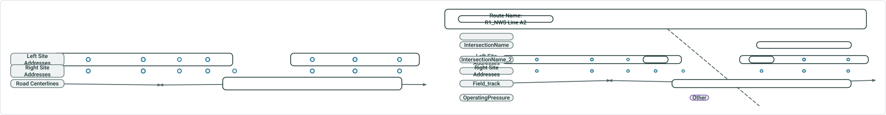

# Flatten SLD results in rows and use 10 tick marks in ruler– test plan

|   |   |
| --- | --- |
| **Kind** | Test Plan · Experience Builder |
| **Release** | — |
| **Product** | Roads & Highways · Pipeline Referencing |
| **Issue** | [Beijing-R-D-Center/ExperienceBuilder-Web-Extensions#24840](https://devtopia.esri.com/Beijing-R-D-Center/ExperienceBuilder-Web-Extensions/issues/24840) |
| **Source** | [FlattenSLD_10tickmarks_testplan.pptx](<https://esriis.sharepoint.com/sites/LocationReferencing/Shared%20Documents/General/FlattenSLD_10tickmarks_testplan.pptx>) |
| **Edited** | 2025-05-22 22:14 by Claire Wang |
| **Extracted** | 2026-09-04 · lane `xmlstrip` |

<!-- metadata
```yaml
title: "Flatten SLD results in rows and use 10 tick marks in ruler– test plan"
source_file: "FlattenSLD_10tickmarks_testplan.pptx"
source_url: "https://esriis.sharepoint.com/sites/LocationReferencing/Shared%20Documents/General/FlattenSLD_10tickmarks_testplan.pptx"
doc_id: 171
doc_kind: "Test Plan"
surface: "Experience Builder"
doc_revision: ""
target_release: ""
pe: ""
dev: "1"
author: "Lakshmi Ananthanarayanan"
last_edited_by: "Claire Wang"
last_edited: "2025-05-22T22:14:19Z"
extracted: 2026-09-04
extraction_lane: xmlstrip
prompt_version: "v2.0.2"
keywords: ["straight line diagram", "tick marks", "flatten rows", "experience builder", "event attributes", "automation", "testing"]
tools: ["Dynamic Segmentation"]
products: ["Roads & Highways", "Pipeline Referencing"]
issues: ["Beijing-R-D-Center/ExperienceBuilder-Web-Extensions#24840"]
related: [{"doc":187,"file":"experience-builder-flatten-sld-results-and-make-ruler-10-tick-marks__doc187.md","s":7.897},{"doc":161,"file":"view-only-non-editable-dynseg-sld-in-experience-builder-test-plan__doc161.md","s":4.605},{"doc":183,"file":"include-intersections-in-straight-line-diagram-sld-user-story__doc183.md","s":3.189},{"doc":181,"file":"include-site-addresses-layer-in-straight-line-diagram__doc181.md","s":3.143},{"doc":28,"file":"sld-devices-and-junctions-test-plan__doc28.md","s":3}]
```
-->

## Summary

Test plan for flattening the number of pixels used per layer in rows of the Straight Line Diagram (SLD) to make rows more compact and changing the ruler from 8 to 10 tick marks with major ticks centered. Includes verification of display fields, hovering and clicking on measures, and testing across various data types, scales, browsers, and accessibility requirements. Also covers updating automation and documentation to reflect these changes.

## Related documents

<!-- related:begin -->
- [Experience Builder Flatten SLD Results and Make Ruler 10 tick marks](<https://esriis.sharepoint.com/sites/lrsworkspace/LRS Doc Index/User Stories/experience-builder-flatten-sld-results-and-make-ruler-10-tick-marks__doc187.md>) — similar text 0.47 · 6 title words · 2 filename words · same surface/folder <!-- rel:187 -->
- [View-only (non editable) DynSeg / SLD in Experience Builder – test plan](<https://esriis.sharepoint.com/sites/lrsworkspace/LRS Doc Index/Test Plans/view-only-non-editable-dynseg-sld-in-experience-builder-test-plan__doc161.md>) — similar text 0.19 · 1 title word · 2 filename words · same kind/surface/dev <!-- rel:161 -->
- [Include Intersections in Straight Line Diagram (SLD) User Story](<https://esriis.sharepoint.com/sites/lrsworkspace/LRS%20Doc%20Index/User%20Stories/include-intersections-in-straight-line-diagram-sld-user-story__doc183.md>) — similar text 0.21 · 1 title word · 1 filename word · same surface/folder <!-- rel:183 -->
- [Include Site Addresses Layer in Straight Line Diagram](<https://esriis.sharepoint.com/sites/lrsworkspace/LRS Doc Index/User Stories/include-site-addresses-layer-in-straight-line-diagram__doc181.md>) — similar text 0.33 · 1 filename word · same surface/folder <!-- rel:181 -->
- [SLD Devices and Junctions Test Plan](<https://esriis.sharepoint.com/sites/lrsworkspace/LRS%20Doc%20Index/Test%20Plans/sld-devices-and-junctions-test-plan__doc28.md>) — similar text 0.22 · 1 title word · 1 filename word · same kind/surface <!-- rel:28 -->
<!-- related:end -->

<!-- docs:begin -->
## Esri documentation

[Apply dynamic segmentation](https://doc.esri.com/en/arcgis-pro/latest/help/production/roads-highways/apply-dynamic-segmentation.html) · [Event editing using the attribute table](https://doc.esri.com/en/arcgis-pro/latest/help/production/roads-highways/event-editing-using-the-attribute-table.html)
<!-- docs:end -->

---

## Slide 1 — Flatten SLD results in rows and use 10 tick marks in ruler– test plan

https://devtopia.esri.com/Beijing-R-D-Center/ExperienceBuilder-Web-Extensions/issues/24840

PE:
Dev:

## Slide 2




Verification
No change in configuration
In SLD:

- Flatten the number of pixels used for each layer in each row – aka the symbology used for events is shorter in height so the rows are more compact
  - Software engineer and designer have researched and have a number of pixels to use
  - Verify the display field shows fine
- Change the ruler from having 8 tick marks to 10 tick marks. Show the major tick marks at the middle of the value like on a metric ruler
  - Verify hovering and clicking on a measure still show the correct value/results

Full Address Number: 1703
Road Centerline ID: {AB840-28304-…
Type: Conceptual
Note: Other

Full Address Number: 1703
Road Centerline ID: {AB840-28304-…
Type: Conceptual
Note: Other

Route Name: R1_NWS Line A2
View Date: 4/22/2025 Measure Range: 0 – 122791.314 Feet (US Survey)

     

## Slide 3

Test

- Test SLD only
- Test with a mix of APR, RH data, Addressing, and Postmile data (sanity only)
  - Consider using automation case from \\lrtest\C$\ExperienceBuilder_Automation\11.5\Sanity Testing\SLD
  - Create more cases for data that is not covered in automation using 3 and 4 below
  - Do a brief sanity check that the tool results are the same as before
- Test with many point (intersections and events) and line layers, and centerlines and site addresses for corresponding networks. Make sure rows are flattened in height.
- Test All events attribute sets and customized attribute sets
- Test with various scales
- Test changing the scale using the experience in the SLD
- Test hovering and clicking on event records and measures
- Verify the tool aligns with any other Experience Builder specifications/requirements
- 508/i18n
- Test in different browsers (chrome and firefox) and layouts

## Slide 4

Automation
Update automation since it will break with this change.

Documentation
If there are any screenshots in the Dynamic Segmentation widget documentation, update them with these changes
