# Test Plan for REST Referent To Geometry in Linear Referencing

| Field | Value |
| --- | --- |
| **Doc** | 588 · Test Plan · Pro |
| **Product** | Pipeline Referencing |
| **Release** | — |
| **Issues** | — |
| **Source** | [TestPlan_RefToGeom_V2.pptx](<https://esriis.sharepoint.com/sites/LocationReferencing/Shared%20Documents/General/Test%20Plans/TestPlan_RefToGeom_V2.pptx>) · rev V2 |
| **People** | author Rahul Rakshit · PE — · dev — |
| **Edited** | 2023-03-27 14:46 by Johum Khushk |
| **Extracted** | 2026-09-04 · lane xmlstrip · format 3.0 · prompt v2.0.2 |
| **Keywords** | referent to geometry · point event · point feature · intersection · offset distance · route · measure · geometry |
| **Tools** | Referent To Geometry |

## Summary

This document provides a detailed test plan for the REST endpoint 'Referent To Geometry' used in Esri's Linear Referencing System. It covers positive and negative test cases involving point events, point features, intersections, and line geometries with various offset distances and temporal parameters. The tests validate correct measure calculations, geometry outputs, error handling, and unit conversions across different route configurations including simple, complex, gapped, concurrent, and vertical routes.

## Related documents

<!-- related:begin -->
- [Test Plan for REST Referent To Geometry](<https://esriis.sharepoint.com/sites/lrsworkspace/LRS Doc Index/Test Plans/for-rest-referent-to-geometry.md>) — similar text 0.92 · 3 title words · 2 filename words · same kind/folder <!-- rel:563 s=11.904 -->
- [REST Geometry to Referent Test Plan](<https://esriis.sharepoint.com/sites/lrsworkspace/LRS Doc Index/Test Plans/4211-rest-geometry-to-referent.md>) — similar text 0.19 · 3 title words · same kind/folder <!-- rel:587 s=3.422 -->
- [Generate a Route Log using the GLRSDP GP Tool – Test Plan](<https://esriis.sharepoint.com/sites/lrsworkspace/LRS Doc Index/Test Plans/6209-generate-a-route-log-using-the-glrsdp-gp.md>) — similar text 0.08 · same kind/surface/folder <!-- rel:260 s=3.247 -->
- [Add Line Events by offsetting from other points – Test Plan](<https://esriis.sharepoint.com/sites/lrsworkspace/LRS Doc Index/Test Plans/3913-add-line-events-by-offsetting-from-other-points.md>) — similar text 0.13 · same kind/surface/folder <!-- rel:231 s=3.217 -->
- [Update Measures From LRS: Support Events and Intersections](<https://esriis.sharepoint.com/sites/lrsworkspace/LRS Doc Index/Test Plans/3882-update-measures-from-lrs-support-events-and-intersections.md>) — similar text 0.11 · same kind/surface/folder <!-- rel:277 s=3.06 -->
<!-- related:end -->

<!-- docs:begin -->
## Esri documentation

[View LRS intersection properties](https://doc.esri.com/en/arcgis-pro/latest/help/production/location-referencing-pipelines/view-lrs-intersection-properties.html) · [Split a centerline by measure](https://doc.esri.com/en/arcgis-pro/latest/help/production/location-referencing-pipelines/split-a-centerline-by-measure.html)

_No page matched:_ [Referent To Geometry](https://www.google.com/search?q=%22Referent%20To%20Geometry%22+site%3Adoc.esri.com)
<!-- docs:end -->

---

## Test Cases

### TC-U01 — Rules <!-- src: S5 · slide 1 · label Rules -->

**Steps:**
1. Offset distance can be either a positive or negative value. If positive, go downstream along the route. If negative, go upstream along the route
2. For line network, when providing offset distance, line should be same when giving an input
3. If user does not provide offset units, by default it will be units of the network
4. If temporal view date parameter is empty, it will default to today’s date and results will be returned as per the time frame of the routes
5. If the point event is registered with the network, then only 1 event measure is returned (unless multiple measures are present at the location)
6. If the point feature/event is not registered with the network, then REST end point can return multiple measures for each route present at the location
7. For an intersection, the output will return measure on each route associated with an intersection
8. Z values are considered for distance calculations.

### TC-N01 — In location parameter, user provides layer id that is not a point event layer <!-- src: S4 · slide 3 · Negative Tests · 1 -->

### TC-N02 — In location parameter, user provides layer id that doesnot exist <!-- src: S4 · slide 3 · Negative Tests · 2 -->

### TC-N03 — In location parameter, user provides layer id that is invalid e.g., $$$ <!-- src: S4 · slide 3 · Negative Tests · 3 -->

### TC-N04 — In location parameter, fromObjectId is not present in the data <!-- src: S4 · slide 3 · Negative Tests · 4 -->

### TC-N05 — In location parameter, fromObjectId is invalid e.g., $$$ or &*^ <!-- src: S4 · slide 3 · Negative Tests · 5 -->

### TC-N06 — In location parameter, fromObjectId provided is not present on a route <!-- src: S4 · slide 3 · Negative Tests · 6 -->

- **Case:** In location parameter, fromObjectId provided is not present on a route (so no measures can be found)

### TC-N07 — In location parameter, toObjectId is not present in the data <!-- src: S4 · slide 3 · Negative Tests · 7 -->

### TC-N08 — In location parameter, toObjectId is invalid e.g., $$$ or &*^ <!-- src: S4 · slide 3 · Negative Tests · 8 -->

### TC-N09 — In location parameter, toObjectId provided is not present on a route <!-- src: S4 · slide 3 · Negative Tests · 9 -->

- **Case:** In location parameter, toObjectId provided is not present on a route (so no measures can be found)

### TC-N10 — In location parameter, fromOffset is not present in the data <!-- src: S4 · slide 3 · Negative Tests · 10 -->

### TC-N11 — In location parameter, fromOffset is invalid e.g., $$$ or &*^ <!-- src: S4 · slide 3 · Negative Tests · 11 -->

### TC-N12 — In location parameter, toOffset is not present in the data <!-- src: S4 · slide 3 · Negative Tests · 12 -->

### TC-N13 — In location parameter, toOffset is invalid e.g., $$$ or &*^ <!-- src: S4 · slide 3 · Negative Tests · 13 -->

### TC-N14 — Locations parameter provided has incorrect syntax <!-- src: S4 · slide 3 · Negative Tests · 14 -->

### TC-N15 — Locations parameter is empty <!-- src: S4 · slide 3 · Negative Tests · 15 -->

### TC-N16 — One of the sub parameters in locations parameter is empty <!-- src: S4 · slide 3 · Negative Tests · 16 -->

### TC-N17 — Temporal View Date is invalid (e.g., 1/1/9999 or $$$) <!-- src: S4 · slide 3 · Negative Tests · 17 -->

### TC-N18 — Temporal View Date is not numeric (xyz) <!-- src: S4 · slide 3 · Negative Tests · 18 -->

### TC-N19 — Out Spatial Reference is invalid (e.g., 99999) <!-- src: S4 · slide 3 · Negative Tests · 19 -->

### TC-N20 — Out Spatial Reference is not numeric (e.g., abc) <!-- src: S4 · slide 3 · Negative Tests · 20 -->

### TC-N21 — GDB version provided does not exist <!-- src: S4 · slide 3 · Negative Tests · 21 -->

### TC-N22 — GDB version is invalid <!-- src: S4 · slide 3 · Negative Tests · 22 -->

### TC-N23 — Should I validate all the locating errors? Do the most common cases including <!-- src: S4 · slide 3 · Negative Tests · 23 -->

- **Case:** Should I validate all the locating errors? Do the most common cases including multimatch – Check doc for loc errors

### TC-N24 — Verify error messages – input invalid, layer id invalid, input is a line feature <!-- src: S4 · slide 3 · Negative Tests · 24 -->

### TC-U02 — Output (1) <!-- src: S5 · slide 24 · label Output -->

**Steps:**
1. routeId: T0
2. Measure: 4
3. geometryType: point, geometry: xyz

### TC-U03 — Output (2) <!-- src: S5 · slide 33 · label Output -->

**Steps:**
1. routeId: R48
2. Measure: 0
3. TorouteId: R48
4. toMeasure: 8
5. geometryType: line
6. geometry: xyz

### TC-U04 — Output (confirm)? <!-- src: S5 · slide 33 · label Output (confirm)? -->

**Steps:**
1. routeId: R48
2. Measure: 4
3. TorouteId: R48
4. toMeasure: 8
5. geometryType: line
6. geometry: xyz

## Other content

### Slide 1 — REST: Referent To Geometry <!-- slide 1 -->

Notes:

- Test using BV sde, Projected and Un-Projected data
- Test will be applicable to point FCs i.e., point events registered with parent network, point events not registered with parent network, point events as referents, intersections, non LRS feature points
- For input, user can provide just offset distance (point) OR from/to offset distance (line) – should we change the name of REST END point ?
- Out put can be point or line geometry

### Slide 2 — REST: Referent To Geometry <!-- slide 2 -->

Input Location Syntax:
[
  {
    "layerId" : <layerId1>,
    "ObjectId" : <ObjectId1>,
    "Offset" : <Offset1>

```
  },
  {
```

    "layerId" : <layerId2>,
    "ObjectId" : <ObjectId2>,
    "fromOffset" : <fromOffset2>,
    "toOffset" : <toOffset2>

```
  },
  {
```

    "layerId" : "<layerId3>",
    "fromObjectId" : "<fromObjectId3>"
    "fromOffset" : <fromOffset3>
    "toObjectId" : "<toObjectId3>"
    "toOffset" : < toOffset3>

```
  },
  ...
]
```

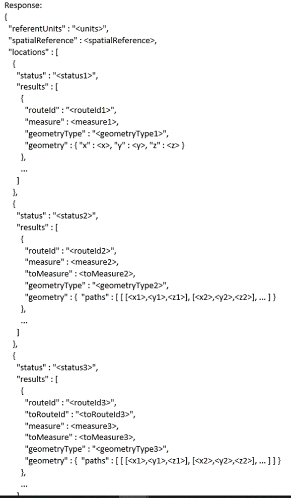
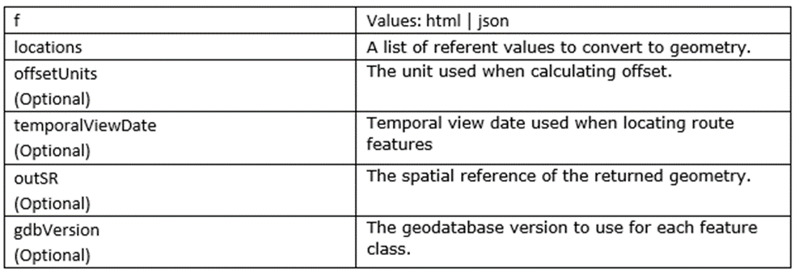

### Slide 3 — REST: Referent To Geometry <!-- slide 3 -->


### Slide 4 — REST: Referent To Geometry <!-- slide 4 -->

| Positive Tests Types |  |
| --- | --- |
| Input | Output |
| 1.1 Point event with offset distance | Point geom. output (associated with a route) |
| 1.2 Point event with from/to offset distance | Line geom. output (associated with a route) |
| 2.1 Point feature with offset distance | Point geom. output (for all the routes present at the location) |
| 2.2 Point feature with from/to offset distance | Line geom. output (for all the routes present at the location) |
| 3.1 Intersection feature with offset distance | Point geom. output (associated with routes in an intersection) |
| 3.2 Intersection feature with from/to offset distance | Point geom. output (associated with routes in an intersection) |

Key


### Slide 5 — REST: Referent To Geometry <!-- slide 5 -->

(1-4) Point event with offset distance, simple route

| Input | Output |
| --- | --- |
| layerId : 1,<br>ObjectId : 1<br>Offset : 5 | routeId : R1,<br>Measure: 20.5, geometryType : point, geometry: xyz |

R1 (1/1/2000 - null)

| Input | Output |
| --- | --- |
| layerId : 1,<br>ObjectId : 1<br>Offset : -5 | routeId : R1,<br>Measure: 10.5, geometryType : point, geometry: xyz |

| Input | Output |
| --- | --- |
| layerId : 1,<br>ObjectId : 1<br>Offset : -10 | routeId : R1,<br>Measure: location not found |

R1 (1/1/2000 - null)
Units for the LRS Network are in miles and offset units are in feet, 1 mile  = 5280 ft
R1 (1/1/2000 - null)
R1 (1/1/2000 - null)

| Input | Output |
| --- | --- |
| layerId : 2,<br>ObjectId : 2<br>Offset : 5280 | routeId : R1,<br>Measure: 16.5, geometryType : point, geometry: xyz |

[figure: 10–22 · X · 1 · 2]


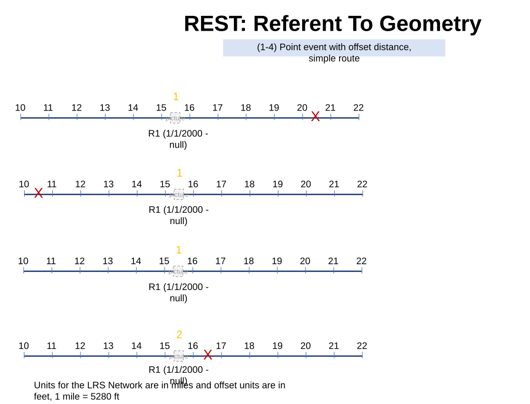

### Slide 6 — REST: Referent To Geometry <!-- slide 6 -->

(4-6) Point event with from/to offset distance, non-line simple route

| Input | Output |
| --- | --- |
| layerId : 1,<br>fromObjectId : 1<br>fromOffset : -1<br>toObjectId : 1<br>toOffset : 1 | routeId : R1,<br>Measure: 14.5,<br>toMeasure : 16.5 geometryType : line, geometry: xyz |

R1 (1/1/2000 - null)
R1 (1/1/2000 - null)
R2 (1/1/2000 - null)

| Input | Output |
| --- | --- |
| layerId : 1,<br>fromObjectId : 3<br>fromOffset : -4<br>toObjectId : 4<br>toOffset : -4 | routeId : R2,<br>Measure: 14,<br>toMeasure : 16 geometryType : line, geometry: xyz |

| Input | Output |
| --- | --- |
| layerId : 1,<br>fromObjectId : 3<br>fromOffset : -20<br>toObjectId : 4<br>toOffset : 20 | routeId : R2,<br>Measure: location not found |

Note: Do few of the test cases with just “"ObjectId" in input pram.

[figure: 10–22 · 1 · X · 3 · 4]


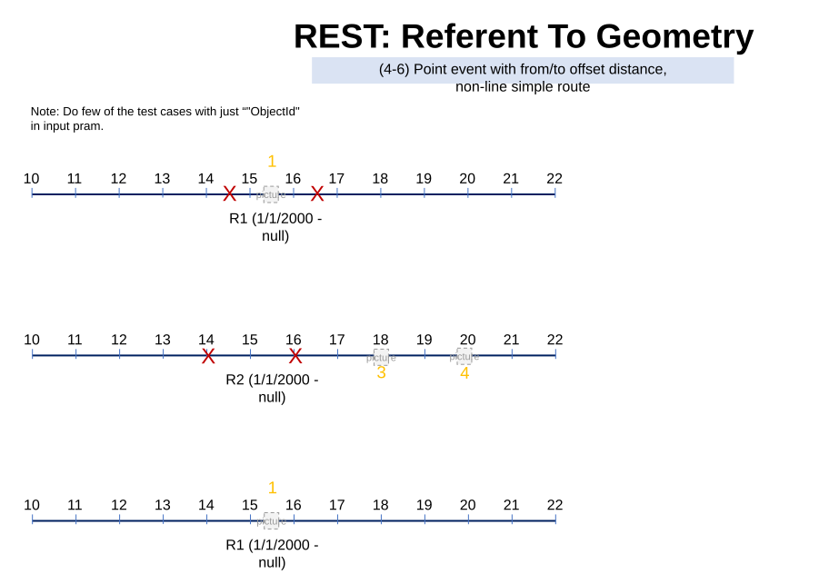

### Slide 7 — REST: Referent To Geometry <!-- slide 7 -->

(7-8) Point event with from/to offset distance, non-line simple route

| Input | Output |
| --- | --- |
| layerId : 1,<br>fromObjectId : 5<br>fromOffset : -5280<br>toObjectId : 5<br>toOffset : 5280 | routeId : R3,<br>Measure: 14.5,<br>toMeasure : 16.5 geometryType : line, geometry: xyz |

Units for the LRS Network are in miles and offset units are in feet, 1 mile  = 5280 ft
R3 (1/1/2000 - null)
R2 (1/1/2000 - null)

| Input | Output |
| --- | --- |
| layerId : 1,<br>fromObjectId : 3<br>fromOffset : -4<br>toObjectId : 4<br>toOffset : -100 | routeId : R2,<br>Measure: 14,<br>toMeasure : not found, geometryType : geometry: no geom.<br>Status: esriLocatingToPartialMatch |

[figure: 10–22 · X · 5 · 3 · 4]


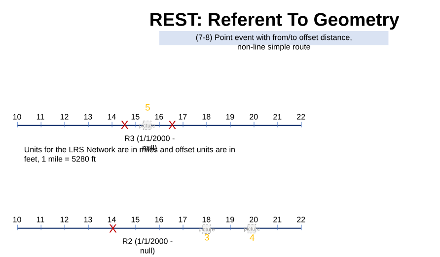

### Slide 8 — REST: Referent To Geometry <!-- slide 8 -->

(9-10) Point event with from/to offset distance, line simple route

| Input | Output |
| --- | --- |
| layerId : 3,<br>fromObjectId : 6<br>fromOffset : 30<br>toObjectId : 6<br>toOffset : 1000 | routeId : R2L3,<br>Measure: 145,<br>torouteid :<br>toMeasure : geometryType :, geometry: xyz<br>Status: esriLocatingToPartialMatch |

| Input | Output |
| --- | --- |
| layerId : 3,<br>fromObjectId : 7<br>fromOffset : -5.5<br>toObjectId : 8<br>toOffset : 1.5 | routeId : R1L3,<br>Measure: 0,<br>toRouteid : R3L3<br>toMeasure : 7.5 geometryType : line, geometry: xyz |

[figure: 6–8 · X]


### Slide 9 — REST: Referent To Geometry <!-- slide 9 -->

(11-12) Point event with from/to offset distance, line simple route
Routes are in opposite direction in a line

| Input | Output |
| --- | --- |
| layerId : 3,<br>fromObjectId : 9<br>fromOffset : 100<br>toObjectId :10<br>toOffset : -25 | routeId : R2L6,<br>Measure: 170,<br>torouteid : R4L6<br>toMeasure : 150 geometryType : line, geometry: xyz |

Routes are in opposite direction in a line

| Input | Output |
| --- | --- |
| layerId : 3,<br>fromObjectId : 9<br>fromOffset : 0<br>toObjectId :10<br>toOffset : 0 | routeId : R2L6,<br>Measure: 70,<br>torouteid : R4L6<br>toMeasure : 175 geometryType : line, geometry: xyz |

[figure: R1L6 · R2L6 · R3L6 · R4L6 · 9 · 10 · R5L6 · X]


### Slide 10 — REST: Referent To Geometry <!-- slide 10 -->

(13-14) Point event with from/to offset distance, non-line gapped route

| Input | Output |
| --- | --- |
| layerId : 1,<br>fromObjectId : 11<br>fromOffset : -15840<br>toObjectId : 11<br>toOffset : 10560 | routeId : R4,<br>Measure: 13,<br>toMeasure : 18 geometryType : line, geometry: xyz |

Units for the LRS Network are in miles and offset units are in feet, 1 mile  = 5280 ft
R4 (1/1/2000 - null)

| Input | Output |
| --- | --- |
| layerId : 1,<br>fromObjectId : 11<br>fromOffset : -18480<br>toObjectId : 11<br>toOffset : 10560 | routeId : R4,<br>Measure: not found,<br>toMeasure : 18,<br>geometryType : geometry: xyz<br>status: esriLocatingFromPartialMatch |

Units for the LRS Network are in miles and offset units are in feet, 1 mile  = 5280 ft
R4 (1/1/2000 - null)

| Input | Output |
| --- | --- |
| layerId : 1,<br>ObjectId : 11<br>fromOffset : -15840<br>toOffset : 10560 | routeId : R4,<br>Measure: 13,<br>toMeasure : 18 geometryType : line, geometry: xyz |

[figure: 10–22 · X · 11 · or]


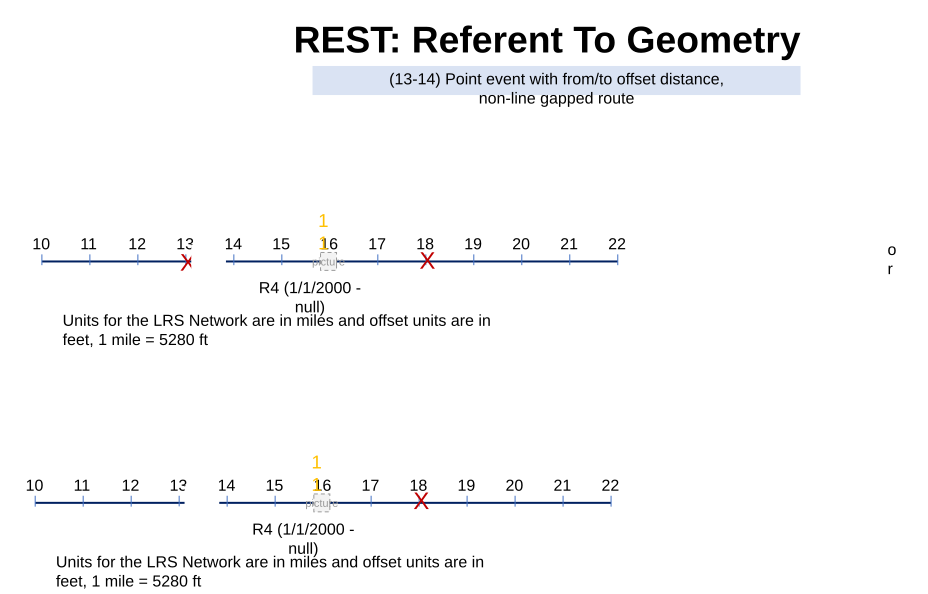

### Slide 11 — REST: Referent To Geometry <!-- slide 11 -->

(15-16) Point event with from/to offset distance, line gapped route

| Input | Output |
| --- | --- |
| layerId : 2,<br>fromObjectId : 12<br>fromOffset : 10<br>toObjectId : 13<br>toOffset : 100 | routeId : R1L4,<br>Measure: 15,<br>TorouteId : R2L4,<br>toMeasure : 200 geometryType : line, geometry: xyz |

| Input | Output |
| --- | --- |
| layerId : 2,<br>fromObjectId : 14<br>fromOffset : 10<br>toObjectId : 14<br>toOffset : 15<br>tempViewDate :  | routeId : R1L6,<br>Measure: 15,<br>TorouteId : R1L6,<br>toMeasure : 20 geometryType : point, geometry: xyz |

| Input | Output |
| --- | --- |
| layerId : 2,<br>fromObjectId : 14<br>fromOffset : 10<br>toObjectId : 14<br>toOffset : 15<br>tempViewDate: | routeId : R1L6,<br>Measure: 175,<br>TorouteId : R1L6,<br>toMeasure : 200 geometryType : point, geometry: xyz |

[figure: 12 · 13 · X · 14 · R1L6 · (1/1/2000 - 1/1/2010) · (1/1/2010 – null) · Recalibrate Route]


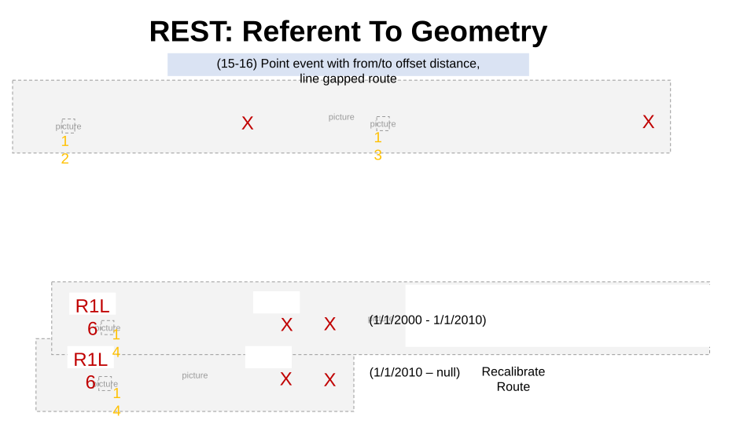

### Slide 12 — REST: Referent To Geometry <!-- slide 12 -->

(17-18) Point event with from/to offset distance, concurrent route
R6 (1/1/2000 - null)

| Input | Output |
| --- | --- |
| layerId : 1,<br>fromObjectId : 15<br>fromOffset : -5<br>toObjectId : 15<br>toOffset : 3<br>TempViewDate :  | routeId : R6,<br>Measure: 12,<br>TorouteId : R6,<br>toMeasure : 20 geometryType : point, geometry: xyz |

| Input | Output |
| --- | --- |
| layerId : 1,<br>fromObjectId : 16<br>Offset : -5<br>layerId : 1,<br>fromObjectId : 17<br>fromOffset : -0.25<br>toObjectId : 17<br>toOffset : 0.25<br>TempViewDate :  | routeId : R7,<br>Measure: 11,<br>geometryType : point, geometry: xyz<br>routeId : R9,<br>Measure: 2.25,<br>TorouteId : R9,<br>toMeasure : 2.75<br>geometryType : point, geometry: xyz |

R6_1 (1/1/2000 - null)

[figure: 10–22 · 1 · 10 · 15 · X · 2 · R7 · 3 · 16 · 17 · R8 · R9]


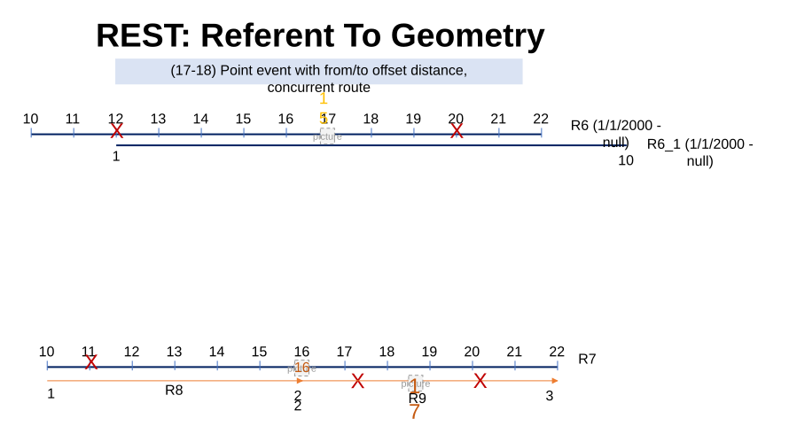

### Slide 13 — REST: Referent To Geometry <!-- slide 13 -->

(19-20) Point event as offset, complex route

| Input | Output |
| --- | --- |
| layerId : 1,<br>ObjectId : 18<br>Offset :10 | routeId : R10,<br>Measure: 20, geometryType : point, geometry: xyz<br>routeId : R10,<br>Measure: 60, geometryType : point, geometry: xyz |

| Input | Output |
| --- | --- |
| layerId : 2,<br>fromObjectId : 19<br>fromOffset : 5<br>toObjectId : 20<br>toOffset : -10 | routeId : R11,<br>Measure: 10,<br>TorouteId : R11,<br>toMeasure : 70 geometryType : line, geometry: xyz |

| Input | Output |
| --- | --- |
| layerId : 2,<br>fromObjectId : 19<br>fromOffset : 5<br>toObjectId : 20<br>toOffset : -10 | routeId : R11,<br>Measure: 10,<br>TorouteId : R11,<br>toMeasure : 15 geometryType : line, geometry: xyz |

[figure: R10 · R11 · 18 · X · 19 · 20]


### Slide 14 — REST: Referent To Geometry <!-- slide 14 -->

(21 - 22) Point event as offset, complex route

| Input | Output |
| --- | --- |
| layerId : 1,<br>ObjectId : 21<br>Offset :18 | routeId : R12,<br>Measure: 28, geometryType : point, geometry: xyz<br>routeId : R12,<br>Measure: 0, geometryType : point, geometry: xyz |

| Input | Output |
| --- | --- |
| layerId : 2,<br>fromObjectId : 22<br>fromOffset : 0<br>toObjectId : 23<br>toOffset : -8 | routeId : R13,<br>Measure: 10,<br>TorouteId : R13,<br>toMeasure : 72 geometryType : line, geometry: xyz |

| Input | Output |
| --- | --- |
| layerId : 2,<br>fromObjectId : 22<br>fromOffset : 0<br>toObjectId : 23<br>toOffset : -8 | routeId : R13,<br>Measure: 10,<br>TorouteId : R13,<br>toMeasure : 14.8 geometryType : line, geometry: xyz |

[figure: R13 · R12 · 21 · X · 22 · 23 · 1–3]


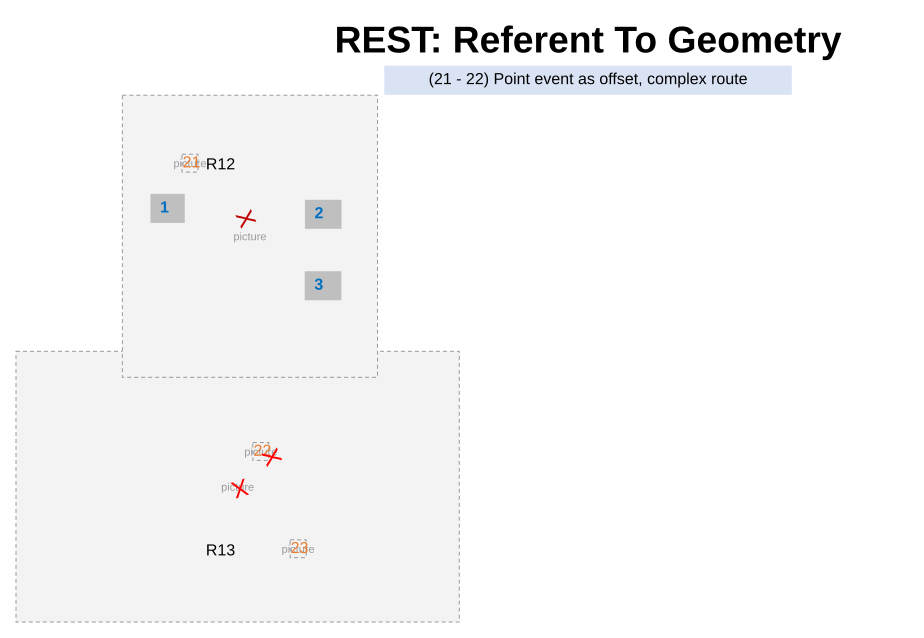

### Slide 15 — REST: Referent To Geometry <!-- slide 15 -->

(23 - 24) Point event as offset, routes in a line shape like complex case

| Input | Output |
| --- | --- |
| layerId : 1,<br>ObjectId : 24<br>Offset :10 | routeId : R41L7,<br>Measure: 20, geometryType : point, geometry: xyz |

| Input | Output |
| --- | --- |
| layerId : 2,<br>fromObjectId : 25<br>fromOffset : -10<br>toObjectId : 26<br>toOffset : -10 | routeId : R51L10,<br>Measure: 10,<br>TorouteId : R52L10,<br>toMeasure : 0 geometryType : line, geometry: xyz<br>(multi part geom.) |

[figure: R41L7 · R42L7 · R51L10 · R52L10 · X · 24–26]


### Slide 16 — REST: Referent To Geometry <!-- slide 16 -->

(25-26) Point event as offset, line network vertical routes

| Input | Output |
| --- | --- |
| layerId : 3,<br>fromObjectId : 27<br>fromOffset : -5<br>toObjectId : 28<br>toOffset : 1.5 | routeId : R1LV2,<br>Measure: 0,<br>TorouteId : R3LV2,<br>toMeasure : 3 geometryType : point, geometry: xyz |

| Input | Output |
| --- | --- |
| layerId : 3,<br>fromObjectId : 27<br>fromOffset : -5<br>toObjectId : 28<br>toOffset : 100 | routeId : R1LV2,<br>Measure: 0,<br>TorouteId : R3LV2,<br>toMeasure : not found geometryType : point, geometry: xyz<br>Status: measure not found |

[figure: 27 · 28 · X]


### Slide 17 — REST: Referent To Geometry <!-- slide 17 -->

(27) Point event with from/to offset distance, time slices

| Input | Output |
| --- | --- |
| layerId : 1,<br>fromObjectId : 15<br>fromOffset : -5<br>toObjectId : 15<br>toOffset : 3<br>TempViewDate :  | routeId : R6,<br>Measure: 12,<br>TorouteId : R6,<br>toMeasure : 20 geometryType : point, geometry: xyz |

| Input | Output |
| --- | --- |
| layerId : 1,<br>fromObjectId : 15<br>fromOffset : -5<br>toObjectId : 15<br>toOffset : 3<br>TempViewDate: | routeId : R6,<br>Measure: 12,<br>TorouteId : R6,<br>toMeasure : 20 geometryType : point, geometry: xyz |

[figure: 10–22 · 15 · R6 (2000-2010) · X · R6 (2010-2015) · R6 (2015-null)]


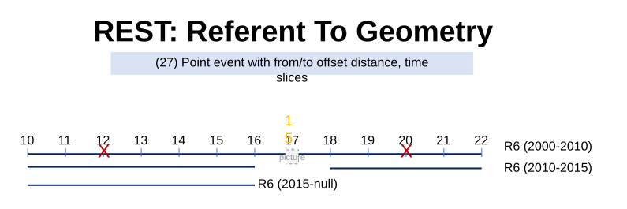

### Slide 18 — REST: Referent To Geometry <!-- slide 18 -->

(28) Point event with from/to offset distance

| Input | Output |
| --- | --- |
| layerId : 1,<br>fromObjectId : 35<br>fromOffset : -1<br>toObjectId : 35<br>toOffset : 0 | routeId : R28,<br>Measure: 0,<br>TorouteId : R28,<br>toMeasure : 1 geometryType : line, geometry: xyz |

| Input | Output |
| --- | --- |
| layerId : 1,<br>fromObjectId : 35<br>fromOffset : -1<br>toObjectId : 35<br>toOffset : 0 | routeId : R28,<br>Measure: 0,<br>TorouteId : R28,<br>toMeasure : 3 geometryType : line, geometry: xyz |

[figure: 0 · 2 · 3 · 35 · 1–3 · R28]

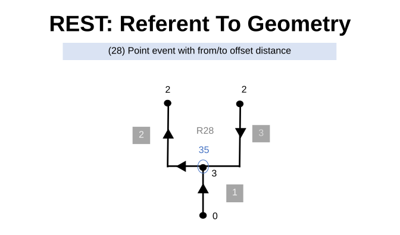

### Slide 19 — REST: Referent To Geometry <!-- slide 19 -->

(29) Point event with from/to offset distance, concurrent route

| Input | Output |
| --- | --- |
| layerId : 1,<br>ObjectId : 36<br>fromOffset : -1<br>toOffset : 0 | routeId : R60,<br>Measure: 0,<br>TorouteId : R60,<br>toMeasure : 1 geometryType : line, geometry: xyz |

| Input | Output |
| --- | --- |
| layerId : 1,<br>ObjectId : 36<br>fromOffset : -1<br>toOffset : 1 | routeId : R60,<br>Measure: 0,<br>TorouteId : R60,<br>toMeasure : 3 geometryType : line, geometry: xyz |

[figure: 2 · R60 · 3 · 0 · 1 · 36]

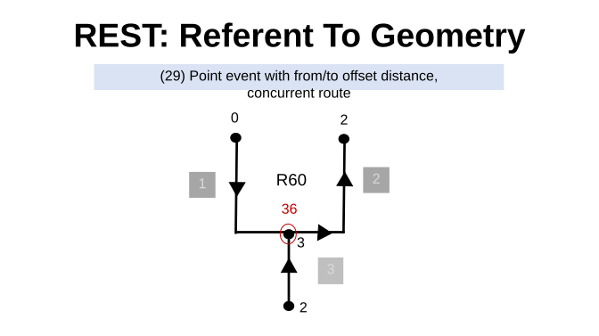

### Slide 20 — REST: Referent To Geometry <!-- slide 20 -->

Point feature as input
R6 (1/1/2000 - null)

| Input | Output |
| --- | --- |
| layerId : 1,<br>fromObjectId : 29<br>fromOffset : -5<br>toObjectId : 15<br>toOffset : 3 | routeId : R6,<br>Measure: 12,<br>TorouteId : R1L6,<br>toMeasure : 20 geometryType : point, geometry: xyz<br>routeId : R6_1,<br>Measure: 1,<br>TorouteId : R6_1,<br>toMeasure : 6 geometryType : point, geometry: xyz |

(30) For test case 1-16, 19-26 test with point feature as input (not event), validate that results are same

(31) Point feature with from/to offset distance, concurrent route
R6_1 (1/1/2000 - null)

[figure: 10–22 · 1 · 10 · 29 · X]


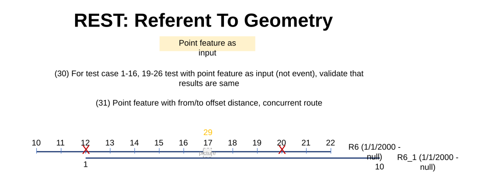

### Slide 21 — REST: Referent To Geometry <!-- slide 21 -->

(32) Point feature with from/to offset distance, concurrent route

| Input | Output |
| --- | --- |
| layerId : 1,<br>fromObjectId : 30<br>Offset : -4<br>layerId : 5,<br>fromObjectId : 31<br>fromOffset : -1<br>toObjectId : 31<br>toOffset : 1 | routeId : R7,<br>Measure: 12,<br>geometryType : point, geometry: xyz<br>routeId : R8,<br>Measure: not found,<br>geometryType : point, geometry: xyz<br>routeId : R9,<br>Measure:,<br>TorouteId : R9,<br>toMeasure :<br>geometryType : line, geometry: xyz<br>routeId : R7,<br>Measure: 18,<br>TorouteId : R7,<br>toMeasure : 20,<br>geometryType : line, geometry: xyz |

[figure: 10–22 · 1 · 2 · R7 · X · 3 · 30 · 31 · R8 · R9 · Update]


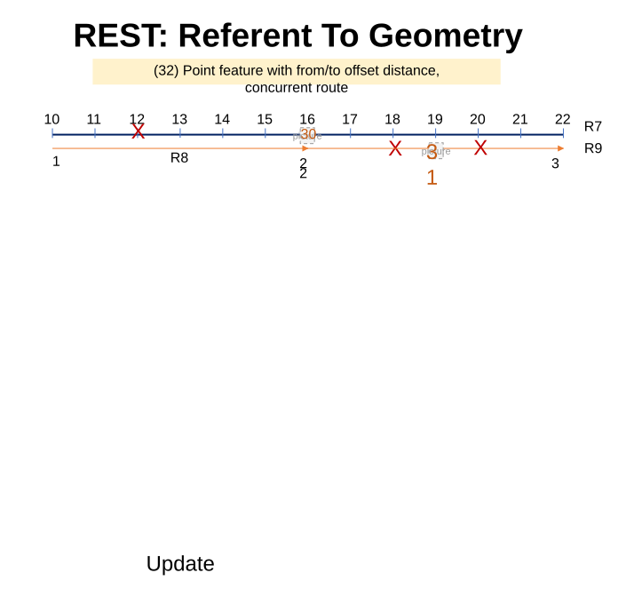

### Slide 22 — REST: Referent To Geometry <!-- slide 22 -->

(33) Point feature with offset distance - different units, concurrent route

| Input | Output |
| --- | --- |
| layerId : 3,<br>fromObjectId : 32<br>Offset : 10560<br>*Network in miles, offset distance in feet | routeId : Rx(100),<br>Measure: 3,<br>geometryType : point, geometry: xyz<br>routeId : Rx(200),<br>Measure: 18,<br>geometryType : point, geometry: xyz |

[figure: 10–22 · 1 · 10 · 11 · 3 · 32 · Rx(100) · Rx(200) · Rx(300) · X]


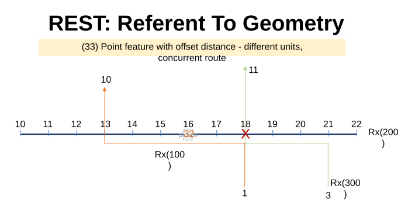

### Slide 23 — REST: Referent To Geometry <!-- slide 23 -->

(34) Point feature with offset distance - different units, concurrent route with complex shape

| Input | Output |
| --- | --- |
| layerId : 3,<br>ObjectId : 33<br>Offset : 2640<br>*Network in miles, offset distance in feet | routeId : R8_1 ,<br>Measure: 1.5,<br>geometryType : point, geometry: xyz<br>routeId : T0,<br>Measure: 0,<br>geometryType : point, geometry: xyz<br>routeId : T0,<br>Measure: 4,<br>geometryType : point, geometry: xyz |

Note: Check measure for R8_1 for output

[figure: 0 · R8_1 · 10 · X · 33]

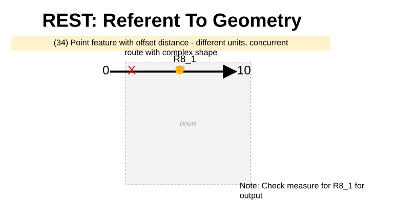

### Slide 24 — REST: Referent To Geometry <!-- slide 24 -->

| Input | Output |
| --- | --- |
| layerId : 3,<br>ObjectId : 38<br>Offset : -10560<br>*Network in miles, offset distance in feet | routeId : T0 ,<br>Measure: 0,<br>geometryType : point, geometry: xyz |

X
(35) Point is at the center of a loop

38

### Slide 25 — REST: Referent To Geometry <!-- slide 25 -->

| Input | Output |
| --- | --- |
| layerId : 1,<br>ObjectId : 36<br>Offset : 0 | routeId : R55,<br>Measure: 1,<br>geometryType : point, geometry: xyz |

(36) Point feature with offset distance on lollipop

| Input | Output |
| --- | --- |
| layerId : 1,<br>ObjectId : 36<br>Offset : 0 | routeId : R55,<br>Measure: 5,<br>geometryType : point, geometry: xyz |

| Input | Output |
| --- | --- |
| layerId : 1,<br>ObjectId : 37<br>Offset : 0 | routeId : R31,<br>Measure: 1,<br>geometryType : point, geometry: xyz |

| Input | Output |
| --- | --- |
| layerId : 1,<br>ObjectId : 37<br>Offset : 0 | routeId : R31,<br>Measure: 5,<br>geometryType : point, geometry: xyz |

[figure: 36 · 0 · 3.67 · R55 · 5 · 2.33 · 37]

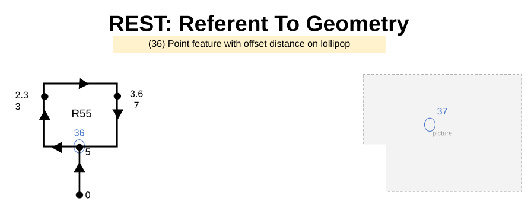

### Slide 26 — REST: Referent To Geometry <!-- slide 26 -->

X
(37) Point is at the center of a loop  (38) Point is not on route

39

| Input | Output |
| --- | --- |
| layerId : 5,<br>ObjectId : 39<br>fromOffset : -2<br>toOffset : 1 | routeId : T0,<br>Measure: 0,<br>TorouteId : T0,<br>toMeasure : 3<br>geometryType : line,<br>geometry: xyz |

X

| Input | Output |
| --- | --- |
| layerId : 5,<br>ObjectId : 39<br>fromOffset : -2<br>toOffset : 1 | routeId : T0,<br>Measure: 4,<br>TorouteId : T0,<br>toMeasure : 3 geometryType : line,<br>geometry: xyz |

| Input | Output |
| --- | --- |
| layerId : 5,<br>ObjectId : 39<br>fromOffset : -5<br>toOffset : 5 | routeId : T0,<br>Measure: not found,<br>TorouteId : T0,<br>toMeasure : not found status: esriLocatingnotfound |

### Slide 27 — REST: Referent To Geometry <!-- slide 27 -->

(38) Point feature is equidistance with several routes

| Input | Output |
| --- | --- |
| layerId : 3,<br>fromObjectId : 40<br>fromOffset : 0<br>toOffset : 1 | routeId : R39<br>Measure: 16,<br>toMeasure : not found,<br>geometryType : line,<br>geometry: xyz<br>routeId : R40<br>Measure: 0,<br>toMeasure : 1,<br>geometryType : point,<br>geometry: xyz<br>routeId : R38<br>Measure: 4,<br>toMeasure : 5,<br>geometryType : point,<br>geometry: xyz |

Provide measure such that it becomes null extent in output

[figure: 10–16 · 1–6 · 0 · 8 · 40 · R38 · R39 · R40]


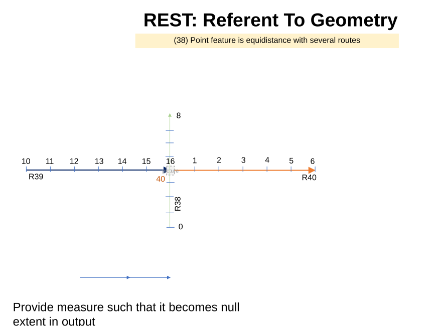

### Slide 28 — REST: Referent To Geometry <!-- slide 28 -->

(39) Point feature with from/to offset distance, multiple time slices

| Input | Output |
| --- | --- |
| layerId : 1,<br>fromObjectId : 41<br>fromOffset : -5<br>toObjectId : 41<br>toOffset : 3<br>TempViewDate :  | routeId : R6,<br>Measure: 12,<br>TorouteId : R6,<br>toMeasure : 20 geometryType : line, geometry: xyz |

| Input | Output |
| --- | --- |
| layerId : 1,<br>fromObjectId : 41<br>fromOffset : -5<br>toObjectId : 41<br>toOffset : 3<br>TempViewDate :  | routeId : R6,<br>Measure: 12,<br>TorouteId : R6,<br>toMeasure : 20 geometryType : line, geometry: xyz |

| Input | Output |
| --- | --- |
| layerId : 1,<br>fromObjectId : 15<br>fromOffset : -5<br>toObjectId : 15<br>toOffset : 3<br>TempViewDate :  | routeId : R6,<br>Measure: 12,<br>TorouteId : R6,<br>toMeasure : geometryType : point, geometry: xyz<br>status: partial match for to measure |

[figure: 10–22 · 41 · R6 (2000-2010) · X · R6 (2010-2015) · R6 (2015-null)]


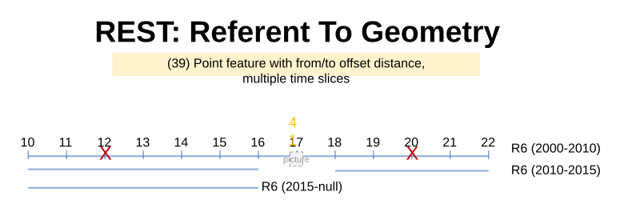

### Slide 29 — REST: Referent To Geometry <!-- slide 29 -->

| Input | Output |
| --- | --- |
| layerId : 1,<br>ObjectId : 1<br>Offset : -2 | routeId : A,<br>Measure: 13,<br>geometryType : point, geometry: xyz<br>routeId : B,<br>Measure: 3,<br>geometryType : point, geometry: xyz |

40- Intersection feature as input, point as output

| Input | Output |
| --- | --- |
| layerId : 1,<br>ObjectId : 3<br>Offset : 2 | routeId : A,<br>Measure: 19,<br>geometryType : point, geometry: xyz<br>routeId : C,<br>Measure: 28,<br>geometryType : point, geometry: xyz |

[figure: 23 · 20 · 10 · 3 · 31 · X]

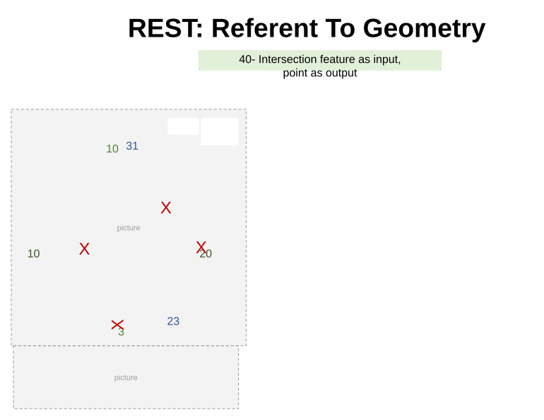

### Slide 30 — REST: Referent To Geometry <!-- slide 30 -->

41- Intersection feature as input, line as output

| Input | Output |
| --- | --- |
| layerId : 1,<br>fromObjectId : 2<br>fromOffset : -2<br>toObjectId : 2<br>toOffset : 0 | routeId : B,<br>Measure: -8,<br>TorouteId : B,<br>toMeasure : 10 geometryType : line, geometry: xyz<br>routeId : C,<br>Measure: 29,<br>TorouteId : C,<br>toMeasure : 31 geometryType : line, geometry: xyz |

[figure: 23 · 20 · 10 · 3 · 31 · X]

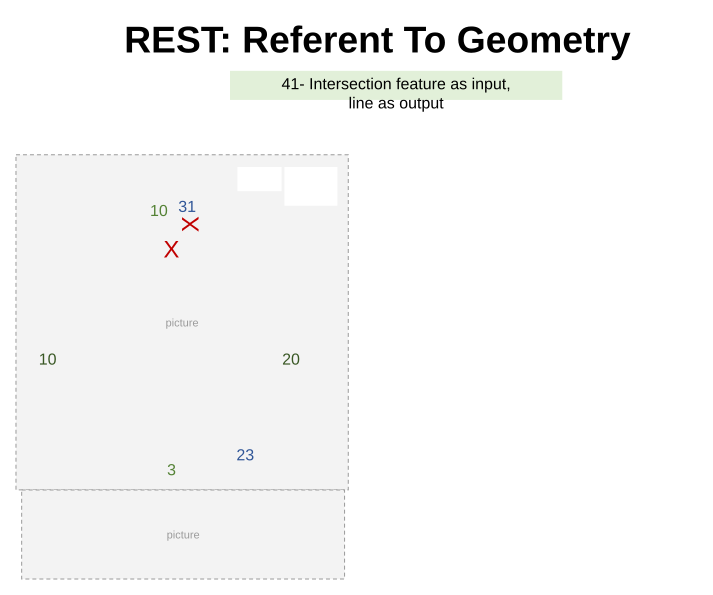

### Slide 31 — REST: Referent To Geometry <!-- slide 31 -->

42-Intersection feature as input, point output

| Input | Output |
| --- | --- |
| layerId : 1,<br>ObjectId : 3<br>Offset : -2 | routeId : B,<br>Measure: 18,<br>geometryType : point, geometry: xyz<br>routeId : A,<br>Measure:3,<br>geometryType:point , geometry: xyz<br>routeId : P1:22,<br>Measure: no measure found |

[figure: 20 5 · X · P1: 22]


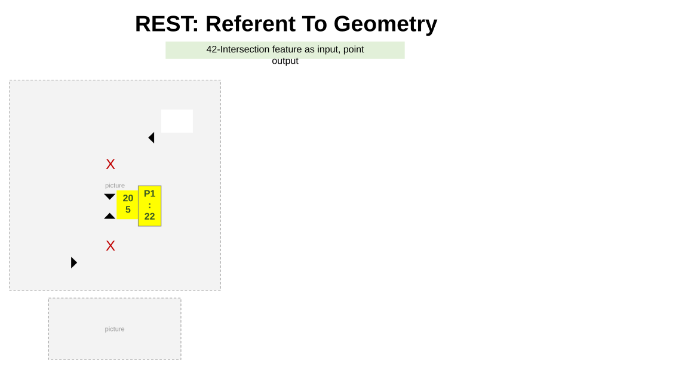

### Slide 32 — REST: Referent To Geometry <!-- slide 32 -->

GCS Data Test cases

43. GCS Data: Make sure that there exists only two end vertices and the z values are 0. Test all the 6 variations on this route + input event/point/intersection at the end and at the middle of the route. Follow the test case 1-16, 19-26, 30 – will not be able to locate measures.

44. Create a route with a 10-mile length. make sure that there exists only two end vertices and the z values are not 0. Test all the 6 variations on this route + input event / point / intersection at the end and at the middle of the route. Follow the test case 25, 26 – will not be able to locate measures.

45. Create a route with a 10-mile length. make sure that there exists multiple vertices with different z values. Test all the 6 variations on this route + input event/point/intersection at the end and at the middle of the route. Follow the test case 1-16, 19-26, 30.

46. Create a route with following z values: 5, 10,0,15, 35,0. (This might change – confirm with Eric)
Understand the formula in white paper and determine if out put measure is correct in case of z values above.
Test with both GCS & projected data.

47. See the mockup of Find tool in exp. builder and think of additional cases needed.


### Slide 33 <!-- slide 33 -->

48.

49. Line Network – Output is multi-part geometry

| Input | Output |
| --- | --- |
| layerId : 3,<br>fromObjectId : 42<br>fromOffset : 0.5<br>toObjectId :43<br>toOffset : -1.5 | routeId : R2L,<br>Measure: 3,<br>torouteid : R5L<br>toMeasure : 1, geometryType : line, geometry: xyz |

| Input | Output |
| --- | --- |
| layerId : 5,<br>ObjectId : 42<br>fromOffset : -2<br>toOffset : 2 | routeId : R48,<br>Measure: 0,<br>TorouteId : R48,<br>toMeasure : 4<br>geometryType : line,<br>geometry: xyz |

| Input | Output | Output | Output |
| --- | --- | --- | --- |
| layerId : 5,<br>ObjectId : 42<br>Offset : -2 | routeId : R48,<br>Measure: 0,<br>geometryType : point,<br>geometry: xyz | routeId : R48,<br>Measure: 4,<br>geometryType : point,<br>geometry: xyz | routeId : R48,<br>Measure: 8,<br>geometryType : point,<br>geometry: xyz |

[figure: R1L · 1 · 2 · 15 · 20 · 5 · 3 · R2L · R3L · R4L · R5L · 42 · X · 43 · R48 · 0 · 4 · 8]


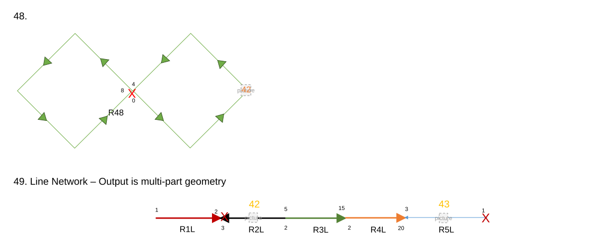
