# Generate a route Log including spanning events and centerline – Test Plan

|   |   |
| --- | --- |
| **Kind** | Test Plan · Pro |
| **Release** | — |
| **Product** | Pipeline Referencing · Utility Network |
| **Issue** | [ArcGISPro/ps-location-referencing#6240](https://devtopia.esri.com/ArcGISPro/ps-location-referencing/issues/6240) |
| **Source** | [6240_RouteLogRH-spanning.cl_Testplan.pptx](<https://esriis.sharepoint.com/sites/LocationReferencing/Shared%20Documents/General/Test%20Plans/6240_RouteLogRH-spanning.cl_Testplan.pptx>) |
| **Edited** | 2025-01-08 23:12 by Claire Wang |
| **Extracted** | 2026-09-04 · lane `xmlstrip` |

<!-- metadata
```yaml
title: "Generate a route Log including spanning events and centerline – Test Plan"
source_file: "6240_RouteLogRH-spanning.cl_Testplan.pptx"
source_url: "https://esriis.sharepoint.com/sites/LocationReferencing/Shared%20Documents/General/Test%20Plans/6240_RouteLogRH-spanning.cl_Testplan.pptx"
doc_id: 255
doc_kind: "Test Plan"
surface: "Pro"
doc_revision: ""
target_release: ""
pe: "Claire"
dev: "Michael"
author: "Lakshmi Ananthanarayanan"
last_edited_by: "Claire Wang"
last_edited: "2025-01-08T23:12:07Z"
extracted: 2026-09-04
extraction_lane: xmlstrip
prompt_version: "v2.0.2"
keywords: ["route log", "spanning event", "centerline", "point event", "intersection", "gapped route", "3d route", "referent", "filter expression", "merge coincident events", "route selection", "location field", "log field", "polygon overlap", "concurrent routes", "route direction", "calibration", "event drawing", "output format", "route name", "route id"]
tools: []
products: ["Pipeline Referencing", "Utility Network"]
issues: ["ArcGISPro/ps-location-referencing#6240"]
related: [{"doc":256,"file":"route-log-data-product-template-test-plan__doc256.md","s":8.859},{"doc":260,"file":"generate-a-route-log-using-the-glrsdp-gp-tool-test-plan__doc260.md","s":8.23},{"doc":372,"file":"transform-lrs-data-gp-tool-test-plan__doc372.md","s":5.785},{"doc":150,"file":"generate-route-log-location-referencing__doc150.md","s":4.727},{"doc":173,"file":"standalone-gp-generate-feature-count-test-plan__doc173.md","s":4.718}]
```
-->

## Summary

Test plan for generating route logs including spanning events and centerline for APR, APRUN, and ADM data models. Covers verification and testing scenarios with various route types, event types, referent configurations, and output formats. Includes positive and negative test cases, concurrency, overlapping events, and calibration rules.

## Related documents

<!-- related:begin -->
- [Route Log data product template – Test Plan](<https://esriis.sharepoint.com/sites/lrsworkspace/LRS Doc Index/Test Plans/route-log-data-product-template-test-plan__doc256.md>) — similar text 0.23 · 2 title words · 3 filename words · same kind/surface/pe/folder <!-- rel:256 -->
- [Generate a Route Log using the GLRSDP GP Tool – Test Plan](<https://esriis.sharepoint.com/sites/lrsworkspace/LRS Doc Index/Test Plans/generate-a-route-log-using-the-glrsdp-gp-tool-test-plan__doc260.md>) — similar text 0.30 · 3 title words · 3 filename words · same kind/surface/dev/folder <!-- rel:260 -->
- [Transform LRS Data GP tool – Test Plan](<https://esriis.sharepoint.com/sites/lrsworkspace/LRS Doc Index/Test Plans/transform-lrs-data-gp-tool-test-plan__doc372.md>) — similar text 0.09 · 1 filename word · same kind/surface/pe/dev/folder <!-- rel:372 -->
- [Generate Route Log (Location Referencing)](<https://esriis.sharepoint.com/sites/lrsworkspace/LRS Doc Index/Other/generate-route-log-location-referencing__doc150.md>) — similar text 0.11 · 3 title words · 2 filename words · same surface <!-- rel:150 -->
- [Standalone GP – Generate Feature Count – Test Plan](<https://esriis.sharepoint.com/sites/lrsworkspace/LRS Doc Index/Test Plans/standalone-gp-generate-feature-count-test-plan__doc173.md>) — similar text 0.25 · 1 title word · 1 filename word · same kind/surface/dev <!-- rel:173 -->
<!-- related:end -->

<!-- docs:begin -->
## Esri documentation

[Create a template for an LRS route log data product](https://doc.esri.com/en/arcgis-pro/latest/help/production/roads-highways/create-a-template-for-an-lrs-route-log-data-product.html) · [Split a centerline by point](https://doc.esri.com/en/arcgis-pro/latest/help/production/location-referencing-pipelines/split-a-centerline.html) · [View LRS intersection properties](https://doc.esri.com/en/arcgis-pro/latest/help/production/location-referencing-pipelines/view-lrs-intersection-properties.html) · [Storing referent and offset information for event location](https://doc.esri.com/en/arcgis-pro/latest/help/production/location-referencing-pipelines/storing-referent-and-offset-information-for-event-location.html)
<!-- docs:end -->

---

## Slide 1 — Generate a route Log including spanning events and centerline – Test Plan

https://devtopia.esri.com/ArcGISPro/ps-location-referencing/issues/6240

PE: Claire
Dev: Michael

## Slide 2

Verification (Additional from previous user story)

- No UI change from previous user story
- Verify tool supports running against fgdb, egdb, fs default and versions
- Verify spanning line events and centerline in ADM and UN are supported.
- Verify tool runs with a mix of point, intersection, nonspanning line events, spanning line events, and/or centerline
- Verify tool works with simple route, gapped routes, and 3D routes for APR/APRUN; verify simple route, multi-gapped routes, and complex shapes for ADM
- Verify that the selection set of the layer is honored. If a route is selected from a line, then all the routes within the line are considered (as per the effective date)
Automation: Add to existing PY
Doc: Update existing GP doc


## - Sanity test cases <!-- slide 3 -->

Testing

- Test in fgdb, egdb (oracle + sql), fs - default and versions
- Focus testing with APR, APRUN and ADM for spanning events and centerline being log layers
  - Test different start/end/prefix/suffix
  - Merge or not merge coincident for spanning line events
  - Referent with different units
  - Referent None, nearest upstream (if there is no upstream referent – no record) and nearest
  - Use filter expression on spanning events and centerline
- Sanity test cases with everything (point events, intersections, non-spanning events, spanning events, and/or centerline; location fields; referent field)
- Always honor route direction
- Test few cases with overlapping events
- Test 1 case with concurrent routes that use the same centerlines
- Test 1 case with overlapping polygons and gapped polygons
- Test with simple route, gapped routes, and 3D routes for APR; simple route, multi-gapped routes, and complex shapes for ADM
- Test with different gap calibration rules
- Test with and without route selection and definition query
how to determine where a 3D route enters/leaves a boundary? as soon as a vertex leaves the planar polygon Treat as 2D so the leaving measure is the pink

## Key takeaways have a pink color in test cases <!-- slide 4 -->

Testing – ctd.

- Test running against ~10 longest routes and verify results using tools like intersect3D/overlay and tool does not crash
- Test running against 0 route e.g. an effective date that no route exists – output should not contain any row
- Test with routes with time slices at different locations – only the time slice that exists in Effective Date is returned
- Test with routes that have measures different from geographic length
- Test with uncalibrated routes – provide the Route ID/Name but make all the rest of the fields as Null.
- For partially located events on the route, calculate the start and end locations only based on what is drawn/located on the route.
- Do not populate events that cannot be drawn at all.
- Test all the output formats (CSV ad table)
- Sanity test in python and verify result is correct
Negative cases

- Rare scenario: Data is non-ADM but centerline is passed in. (can be done this way - when centerline is configured, data is address. When template is ran, data is no longer address – error saying about centerline

Key takeaways have a pink color in test cases.

## Slide 5

APR

- Simple routes in a line, with 1 log field (spanning event) and a location field (APR 3)
  - A spanning line event with prefix and filter expression
  - Use RouteID
- Same case as above but with concurrent routes
  - A spanning line event with prefix and filter expression
  - Use RouteID
- Mixed gapped routes and 3D routes in a line, with multiple log fields, multiple location fields and 1 referent field (APR 5)
  - Log: point events, 2 intersections, and spanning and non spanning line events. Mix prefix/suffix configuration. Use filter expression on a point event, an intersection and a spanning line event. Merge coincident events for all line events
  - Polygon layers have overlapping and gapped polygons
  - Referent: nearest; without prefix/suffix, in miles
  - 1 route is uncalibrated
  - Some point events cannot be drawn; 1 spanning line event can be partially drawn; 1 spanning line event cannot be drawn at all
  - Use RouteName
- Simple routes and gapped routes in a line with overlapping point and line events. No location layer. 1 Referent layer. Routes and events have time slices (APR 6)
  - Log: a point event, an intersection, and spanning line events. Change start/end texts for all. Do not configure any prefix or suffix. No filter expression. Merge coincident for one line event
  - Referent: nearest upstream, customize stand/end/prefix/suffix, in feet
  - Use RouteName

## Slide 6

APR1 - Simple routes in a line, with 1 log field (spanning event) and a location field (APR 3)

- A spanning line event with prefix “DOT” and filter expression “is not Class3”
- Use RouteID
- Only L1R2 and L1R3 are selected (but all routes will be returned)

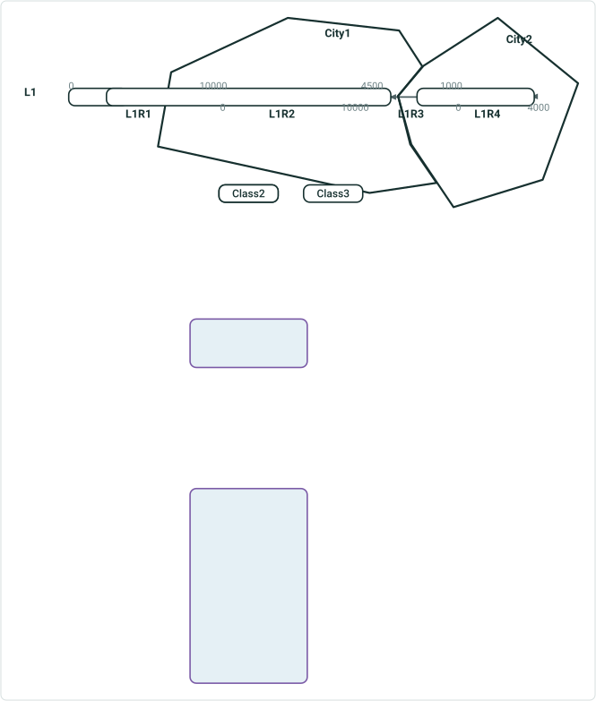

| Route ID | Line Name | Description | Measure | City | DOTClass |
| --- | --- | --- | --- | --- | --- |
| {IDL1R1- | L1 | Begin {IDL1R1- | 0 | Unclassified |  |
| {IDL1R1- | L1 | Begin DOT Class1 | 5000 | Unclassified | Class1 |
| {IDL1R1- | L1 | End Unclassified Limit | 5000 | Unclassified | Class1 |
| {IDL1R1- | L1 | Begin City1 Limit | 7000 | City1 | Class1 |
| {IDL1R1- | L1 | End {IDL1R1- | 10000 | City1 | Class1 |
| {IDL1R2- | L1 | Begin {IDL1R2- | 0 | City1 | Class1 |
| {IDL1R2- | L1 | End {IDL1R2- | 10000 | City1 | Class1 |
| {IDL1R3- | L1 | Start {IDL1R3- | 1000 | City2 | Class2 |
| {IDL1R3- | L1 | End DOT Class2 | 2500 | City2 | Class2 |
| {IDL1R3- | L1 | Begin DOT Class1 | 2500 | City2 | Class1 |
| {IDL1R3- | L1 | End City2 Limit | 3000 | City2 | Class1 |
| {IDL1R3- | L1 | Begin City1 Limit | 3000 | City1 | Class1 |
| {IDL1R3- | L1 | End {IDL1R3- | 4500 | City1 | Class1 |
| {IDL1R4- | L1 | Start {IDL1R4- | 0 | City2 | Class2 |
| {IDL1R4- | L1 | End DOT Class2 | 4000 | City2 | Class2 |
| {IDL1R4- | L1 | End {IDL1R4- | 4000 | City2 | Class2 |

Everything else that is not a named city/county/etc is treated as a feature in the polygon layers called “Unclassified”

## Slide 7

APR2 - Simple routes in a line, with 1 log field (spanning event) and a location field (APR 3) but with concurrent routes

- A spanning line event with prefix “DOT” and filter expression “is not Class3”
- Use RouteID

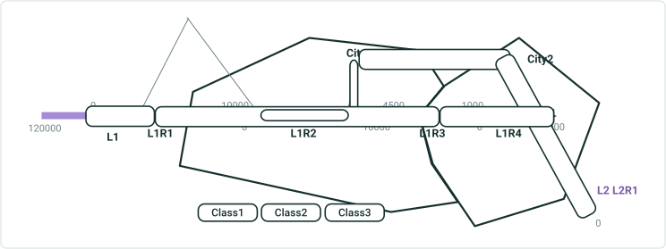

| Route ID | Line Name | Description | Measure | City | DOTClass |
| --- | --- | --- | --- | --- | --- |
| {IDL2R1- | L2 | Begin {IDL2R1- | 0 | Unclassified | Class1 |
| {IDL2R1- | L2 | Begin DOT Class1 | 0 | Unclassified | Class1 |
| {IDL2R1- | L2 | End Unclassified Limit | 5000 | Unclassified | Class1 |
| {IDL2R1- | L2 | Begin City2 Limit | 5000 | City2 | Class1 |
| {IDL2R1- | L2 | End City2 Limit | 25000 | City2 | Class1 |
| {IDL2R1- | L2 | Begin unclassified Limit | 25000 | Unclassified | Class1 |
| {IDL2R1- | L2 | End Unclassified Limit | 35000 | Unclassified | Class1 |
| {IDL2R1- | L2 | Begin City1 Limit | 35000 | City1 | Class1 |
| {IDL2R1- | L2 | End DOT Class1 | 45000 | City1 | Class1 |
| {IDL2R1- | L2 | Begin DOT Class2 | 45000 | City1 | Class2 |
| {IDL2R1- | L2 | End DOT Class2 | 65000 | City1 | Class2 |
| {IDL2R1- | L2 | End City1 Limit | 75000 | City1 |  |
| {IDL2R1- | L2 | Begin Unclassified Limit | 75000 | Unclassified |  |
| {IDL2R1- | L2 | End {IDL2R1- | 120000 | Unclassified |  |

| Route ID | Line Name | Description | Measure | City | DOTClass |
| --- | --- | --- | --- | --- | --- |
| {IDL1R1- | L1 | Begin {IDL1R1- | 0 | Unclassified |  |
| {IDL1R1- | L1 | Begin DOT Class1 | 5000 | Unclassified | Class1 |
| {IDL1R1- | L1 | End Unclassified Limit | 5000 | Unclassified | Class1 |
| {IDL1R1- | L1 | Begin City1 Limit | 7000 | City1 | Class1 |
| {IDL1R1- | L1 | End {IDL1R1- | 10000 | City1 | Class1 |
| {IDL1R2- | L1 | Begin {IDL1R2- | 0 | City1 | Class1 |
| {IDL1R2- | L1 | End {IDL1R2- | 10000 | City1 | Class1 |
| {IDL1R3- | L1 | Start {IDL1R3- | 1000 | City2 | Class2 |
| {IDL1R3- | L1 | End DOT Class2 | 2500 | City2 | Class2 |
| {IDL1R3- | L1 | Begin DOT Class1 | 2500 | City2 | Class1 |
| {IDL1R3- | L1 | End City2 Limit | 3000 | City2 | Class1 |
| {IDL1R3- | L1 | Begin City1 Limit | 3000 | City1 | Class1 |
| {IDL1R3- | L1 | End {IDL1R3- | 4500 | City1 | Class1 |
| {IDL1R4- | L1 | Start {IDL1R4- | 0 | City2 | Class2 |
| {IDL1R4- | L1 | End DOT Class2 | 4000 | City2 | Class2 |
| {IDL1R4- | L1 | End {IDL1R4- | 4000 | City2 | Class2 |

Everything else that is not a named city/county/etc is treated as a feature in the polygon layers called “Unclassified”

## Slide 8

APR3 - Mixed gapped routes and 3D routes in a line, with multiple log fields, multiple location fields and 1 referent field (APR 5)

- Log: point events, 2 intersections, and spanning and non spanning line events. Mix prefix/suffix configuration. Use filter expression on a point event “Num >= 2” and a spanning line event “Type is not Class3”. Merge coincident events for all line events
- Polygon layers have overlapping and gapped polygons
- Referent: nearest; without prefix/suffix, in miles
- 1 route is uncalibrated
- Some point events cannot be drawn; 1 spanning line event can be partially drawn; 1 spanning line event cannot be drawn at all
- Use RouteName

A vertex 15000
(z 1000)

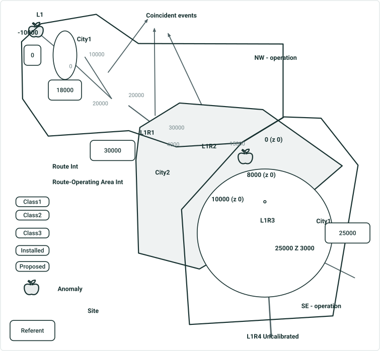

| Route Name | Line Name | Description | Measure | Referent | Offset | Operating Area | City | Site | Priority | Pipes Intersection | Pipe- OpArea Intersection | ILI status | DOTClass |
| --- | --- | --- | --- | --- | --- | --- | --- | --- | --- | --- | --- | --- | --- |
| L1R1 | L1 | Begin Pipe L1R1 | -10000 | 0 | -1.894 | report or not report, either is fine | Unclassified |  |  |  |  |  |  |
| L1R1 | L1 | Anomaly Priority A | -10000 | 0 | -1.894 | Same above | Unclassified |  | A |  |  |  |  |
| L1R1 | L1 | Intersecting NW area | -10000 | 0 | -1.894 | NW - operation | Unclassified |  |  |  | L1R1 & NW |  |  |
| L1R1 | L1 | End Unclassified Limit | -5000 | 0 | -0.947 | NW - operation | Unclassified |  |  |  |  |  |  |
| L1R1 | L1 | Begin City1 Limit | -5000 | 0 | -0.947 | NW - operation | City1 |  |  |  |  |  |  |
| L1R1 | L1 | Begin DOT Class1 type | 10000 | 18000 | 3.409 | NW - operation | Unclassified |  |  |  |  |  | Class1 |
| L1R1 | L1 | Site No. 2 | 22000 | 18000 | 0.758 | NW - operation | Unclassified | 2 |  |  |  |  | Class1 |
| L1R1 | L1 | End Unclassified Limit | 25000 | 30000 | -0.947 | NW - operation | Unclassified |  |  |  |  |  |  |
| L1R1 | L1 | Begin City2 Limit | 25000 | 30000 | -0.947 | NW - operation | City2 |  |  |  |  |  | Class1 |
| L1R1 | L1 | Intersecting L1R2 | 30000 | 30000 | 0 | NW - operation | City2 |  |  | L1R1 & L1R2 |  |  | Class1 |
| L1R1 | L1 | End Pipe L1R1 | 30000 | 30000 | 0 | NW - operation | City2 |  |  |  |  |  | Class1 |
| L1R2 | L1 | Begin Pipe L1R2 | 4000 |  |  | NW - operation | City2 |  |  |  |  | Proposed | Class1 |
| L1R2 | L1 | Intersecting L1R1 | 4000 |  |  | NW - operation | City2 |  |  | L1R1 & L1R2 |  | Proposed | Class1 |
| L1R2 | L1 | Begin ILI Proposed Status | 4000 |  |  | NW - operation | City2 |  |  |  |  | Proposed | Class1 |
| L1R2 | L1 | Intersecting L1R3 | 15000 |  |  | NW - operation | City2 |  |  | L1R2 & L1R3 |  | Proposed | Class1 |
| L1R2 | L1 | Intersecting NW area & SE area | 15000 |  |  | either operation | City2 |  |  |  | L1R2 & NW & SE | Proposed | Class1 |
| L1R2 | L1 | End NW area Limit | 15000 |  |  | NW - operation | City2 |  |  |  |  | Proposed | Class1 |
| L1R2 | L1 | End ILI Proposed Status | 15000 |  |  | either operation | City2 |  |  |  |  | Proposed | Class1 |
| L1R2 | L1 | End Pipe L1R2 | 15000 | 30000 | 2.083 | either operation | City2 |  |  |  |  | Proposed | Class1 |
| L1R3 | L1 | Begin Pipe L1R3 | 0 | 30000 | 2.083 | either operation | City2 |  |  |  |  | Installed | Class1 |
| L1R3 | L1 | Intersecting L1R2 | 0 | 30000 | 2.083 | either operation | City2 |  |  | L1R2 & L1R3 |  | Installed | Class1 |
| L1R3 | L1 | Intersecting NW area & SE area | 0 | 30000 | 2.083 | either operation | City2 |  |  |  | L1R3 & NW & SE | Installed | Class1 |
| L1R3 | L1 | Begin SE area Limit | 0 | 30000 | 2.083 | SE - operation | City2 |  |  |  |  | Installed | Class1 |
| L1R3 | L1 | Begin ILI Installed Status | 0 | 30000 | 2.083 | SE - operation | City2 |  |  |  |  | Installed | Class1 |
| L1R3 | L1 | Anomaly Priority B | 4000 | 30000 | 2.841 | SE - operation | City2 |  | B |  |  | Installed | Class1 |
| L1R3 | L1 | Begin City1 Limit | 6000 | 30000 | 3.220 | SE - operation | Either city |  |  |  |  | Installed | Class1 |
| L1R3 | L1 | End DOT Class1 type | 8000 | 25000 | -3.220 | SE - operation | Either city |  |  |  |  | Installed | Class1 |
| L1R3 | L1 | Begin DOT Class2 type | 10000 | 25000 | -2.841 | SE - operation | Either city |  |  |  |  | Installed | Class2 |
| L1R3 | L1 | Site No.3 | 12000 | 25000 | -2.462 | SE - operation | Either city | 3 |  |  |  | Installed | Class2 |
| L1R3 | L1 | End City1 Limit | 16000 | 25000 | -1.705 | SE - operation | Either city |  |  |  |  | Installed | Class2 |
| L1R3 | L1 | End ILI Installed Status | 19000 | 25000 | -1.136 | SE - operation | City2 |  |  |  |  | Installed | Class2 |
| L1R3 | L1 | End City2 Limit | 19000 | 25000 | -1.136 | SE - operation | City2 |  |  |  |  | Installed | Class2 |
| L1R3 | L1 | Begin City1 Limit | 22000 | 25000 | -0.568 | SE - operation | City1 |  |  |  |  |  | Class2 |
| L1R3 | L1 | End Pipe L1R3 | 25000 | 25000 | 0 | SE - operation | City1 |  |  |  |  |  | Class2 |
| L1R3 | L1 | End DOT Class2 type | 25000 | 25000 | 0 | SE - operation | City1 |  |  |  |  |  | Class2 |
| L1R4 | L1 | null | null | null | null | null | null | null | null | null | null | null | null |

- No End City1 Limit for the first City1
- If there is no referent on the route (not line), return null in referent
- Coincident events only have 1 start and 1 end
- For overlapping polygons, City Column says the last city the route enters, but either is fine
- If an event can be partially drawn, the route start/end counts for the event’s start/end
- When a route is not calibrated and there are events with loc error on it, just return 1 row with everything being null
Praveen will check if referent offset is calculated based on referent or event

      

## Slide 9

APR4 - Simple routes and gapped routes in a line with overlapping point and line events. No location layer. 1 Referent layer. Routes and events have time slices (APR 6)

- Log: a point event, an intersection, and spanning line events. Change start/end texts for all. Do not configure any prefix or suffix. No filter expression. Merge coincident for one line event
- Referent: nearest upstream, customize stand/end/prefix/suffix, in feet
- Use RouteName

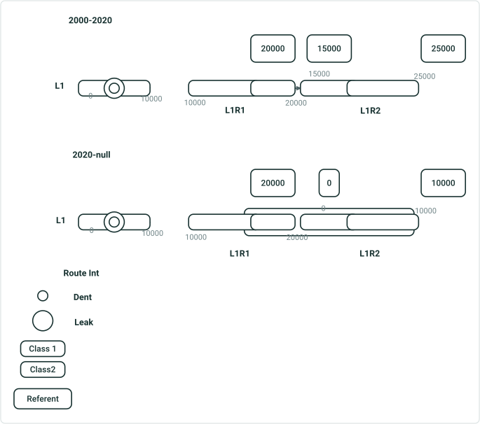

| Route Name | Line Name | Description | Measure | Referent | Offset | Anomaly Type | Pipes Intersection | DOTClass |
| --- | --- | --- | --- | --- | --- | --- | --- | --- |
| L1R1 | L1 | Start L1R1 | 0 |  |  |  |  | Class1 |
| L1R1 | L1 | Start DOT Class1 | 0 |  |  |  |  | Class1 |
| L1R1 | L1 | Anomaly Dent | 5000 |  |  |  |  | Class1 |
| L1R1 | L1 | Anomaly Leak | 5000 |  |  |  |  | Class1 |
| L1R1 | L1 | End L1R1 | 20000 | 20000 | 0 |  |  | Class1 |
| L1R1 | L1 | Intersecting L1R2 | 20000 | 20000 | 0 |  | L1R1 & L1R2 | Class1 |
| L1R2 | L1 | Start L1R2 | 15000 | 15000 | 0 |  |  | Class1 |
| L1R2 | L1 | Intersecting L1R1 | 15000 | 15000 | 0 |  | L1R1 & L1R2 | Class1 |
| L1R2 | L1 | Start DOT Class1 | 18000 | 15000 | 3000 |  |  | Class1 |
| L1R2 | L1 | End DOT Class1 | 20000 | 15000 | 5000 |  |  | Class1 |
| L1R2 | L1 | End DOT Class1 | 25000 | 25000 | 0 |  |  | Class1 |
| L1R2 | L1 | End L1R2 | 25000 | 25000 | 0 |  |  | Class1 |

- Coincident vs. overlapping events 2 DOTClass events that have identical values in all the business fields, at the same location same time - if one starts at the other's end point, they are coincident. When the "merge coincident events" option is checked in template, we only generate 1 start record and 1 end record, instead of start 1 end1 start 2 end 2. However, if they have an overlapping portion, even the "merge coincident events" option is checked, they are treated as separate records, something like start 1 start 2 end 1 end 2.
- 2 DOTClass events that have identical values in the log field but different values in other business fields, at the same location same time  - same as above. In route log, as long as the coincident events' log field matches, they merge as 1 record in result.
- 2 DOTClass events that have different values in all the business fields, at the same location same time - will not merge as all values are different. If they overlap, generate records separately.

| Route Name | Line Name | Description | Measure | Referent | Offset | Anomaly Type | Pipes Intersection | DOTClass |
| --- | --- | --- | --- | --- | --- | --- | --- | --- |
| L1R1 | L1 | Start L1R1 | 0 |  |  |  |  | Class1 |
| L1R1 | L1 | Start DOT Class1 | 0 |  |  |  |  | Class1 |
| L1R1 | L1 | Anomaly Dent | 5000 |  |  |  |  | Class1 |
| L1R1 | L1 | Anomaly Leak | 5000 |  |  |  |  | Class1 |
| L1R1 | L1 | Start DOT Class2 | 15000 |  |  |  |  | Class2 |
| L1R1 | L1 | End L1R1 | 20000 | 20000 | 0 |  |  | Class2 |
| L1R1 | L1 | Intersecting L1R2 | 20000 | 20000 | 0 |  | L1R1 & L1R2 | Class2 |
| L1R2 | L1 | Start L1R2 | 0 | 0 | 0 |  |  | Class2 |
| L1R2 | L1 | Intersecting L1R1 | 0 | 0 | 0 |  | L1R1 & L1R2 | Class2 |
| L1R2 | L1 | Start DOT Class1 | 3000 | 0 | 3000 |  |  | Class1 |
| L1R2 | L1 | End DOT Class1 | 5000 | 0 | 5000 |  |  | Class1 |
| L1R2 | L1 | End DOT Class1 | 10000 | 10000 | 0 |  |  | Class1 |
| L1R2 | L1 | End DOT Class2 | 10000 | 10000 | 0 |  |  | Class1 |
| L1R2 | L1 | End L1R2 | 10000 | 10000 | 0 |  |  | Class1 |

For overlapping events, Event Column says the last event the route enters, but either is fine


## Slide 10

APRUN

- Simple routes in a line, with 2 log fields (centerline and spanning event) and a location field (UN 3)
  - Use RouteID
- Mixed gapped routes and 3D routes in a line, with multiple log fields and 1 referent field (UN 5)
  - Log: 1 intersection, centerline, and 1 line event. Configure prefix/suffix for centerline only. Use filter expression on centerline and line event. Merge coincident events for 1 line event
  - There are overlapping line events
  - Referent: nearest upstream; without prefix/suffix, in meters
  - Use RouteName
- Simple routes and gapped routes in a line. 1 location layer. 1 Referent layer. Routes and events have time slices (UN 6)
  - Log: a spanning line event with no prefix/suffix, a centerline with customized start/end/prefix/suffix, and a point event with no filter expression. Still use RouteID
  - Polygon layers have overlapping and gapped polygons
  - Referent: nearest upstream in feet

## Slide 11

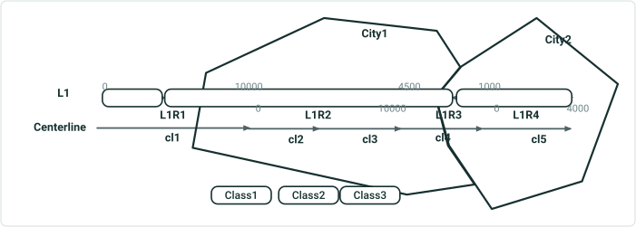

| Route ID | Line Name | Description | Measure | City | DOTClass |
| --- | --- | --- | --- | --- | --- |
| {IDL1R1- | L1 | Begin {IDL1R1- | 0 | Unclassified | Class3 |
| {IDL1R1- | L1 | Begin cl1 | 0 | Unclassified | Class3 |
| {IDL1R1- | L1 | Begin DOT Class3 | 0 | Unclassified | Class3 |
| {IDL1R1- | L1 | End DOT Class3 | 5000 | Unclassified | Class3 |
| {IDL1R1- | L1 | Begin DOT Class1 | 5000 | Unclassified | Class1 |
| {IDL1R1- | L1 | End Unclassified Limit | 7000 | City1 | Class1 |
| {IDL1R1- | L1 | Begin City1 Limit | 7000 | City1 | Class1 |
| {IDL1R1- | L1 | End cl1 | 10000 | City1 | Class1 |
| {IDL1R1- | L1 | End {IDL1R1- | 10000 | City1 | Class1 |
| {IDL1R2- | L1 | Begin {IDL1R2- | 0 | City1 | Class1 |
| {IDL1R2- | L1 | Begin cl2 | 0 | City1 | Class1 |
| {IDL1R2- | L1 | End cl2 | 5000 | City1 | Class1 |
| {IDL1R2- | L1 | Begin cl3 | 5000 | City1 | Class1 |
| {IDL1R2- | L1 | End cl3 | 10000 | City1 | Class1 |
| {IDL1R2- | L1 | End {IDL1R2- | 10000 | City1 | Class1 |
| {IDL1R3- | L1 | Start {IDL1R3- | 1000 | City2 | Class2 |
| {IDL1R3- | L1 | End cl4 | 1000 | City2 | Class2 |
| {IDL1R3- | L1 | Begin DOT Class2 | 2500 | City2 | Class2 |
| {IDL1R3- | L1 | End DOT Class1 | 2500 | City2 | Class1 |
| {IDL1R3- | L1 | End City2 Limit | 3000 | City2 | Class1 |
| {IDL1R3- | L1 | Begin City1 Limit | 3000 | City1 | Class1 |
| {IDL1R3- | L1 | Begin cl4 | 4500 | City1 | Class1 |
| {IDL1R3- | L1 | End {IDL1R3- | 4500 | City1 | Class1 |
| {IDL1R4- | L1 | Start {IDL1R4- | 0 | City2 | Class2 |
| {IDL1R4- | L1 | Start cl5 | 0 | City2 | Class2 |
| {IDL1R4- | L1 | End DOT Class2 | 4000 | City2 | Class2 |
| {IDL1R4- | L1 | End cl5 | 4000 | City2 | Class2 |
| {IDL1R4- | L1 | End {IDL1R4- | 4000 | City2 | Class2 |

APRUN1 - Simple routes in a line, with 2 log fields (centerline and spanning event) and a location field (UN 3)

- Use RouteID

## Slide 12

APRUN2 - Mixed gapped routes and 3D routes in a line, with multiple log fields and 1 referent field (UN 5)

- Log: 1 intersection, centerline, and 1 line event. Configure prefix/suffix for centerline only. Use filter expression on centerline “length > 5000” and line event “Type is not Class3”. Merge coincident events for the line event
- There are overlapping line events
- Referent: nearest upstream; without prefix/suffix, in meters
- Use RouteName

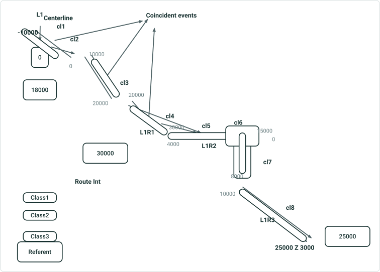

| Route Name | Line Name | Description | Measure | Referent | Offset | Pipes Intersection | DOTClass |
| --- | --- | --- | --- | --- | --- | --- | --- |
| L1R1 | L1 | Begin L1R1 | -10000 |  |  |  | Class1 |
| L1R1 | L1 | Begin DOT Class1 | -10000 |  |  |  | Class1 |
| L1R1 | L1 | Begin cl3 here | 10000 | 0 | 10000 |  | Class1 |
| L1R1 | L1 | End cl3 here | 20000 | 18000 | 609.6 |  | Class1 |
| L1R1 | L1 | Begin cl4 here | 20000 | 18000 | 609.6 |  | Class1 |
| L1R1 | L1 | End cl4 here | 30000 | 30000 | 0 |  | Class1 |
| L1R1 | L1 | Intersecting L1R2 | 30000 | 30000 | 0 | L1R1 & L1R2 | Class1 |
| L1R1 | L1 | End L1R1 | 30000 | 30000 | 0 |  | Class1 |
| L1R2 | L1 | Begin L1R2 | 4000 |  |  |  | Class1 |
| L1R2 | L1 | Intersecting L1R1 | 4000 |  |  | L1R1 & L1R2 | Class1 |
| L1R2 | L1 | Begin cl5 here | 4000 |  |  |  | Class1 |
| L1R2 | L1 | End cl5 here | 9500 |  |  |  | Class1 |
| L1R2 | L1 | End cl6 here | 9500 |  |  |  | Class1 |
| L1R2 | L1 | Begin cl6 here | 15000 |  |  |  | Class1 |
| L1R2 | L1 | Intersecting L1R3 | 15000 |  |  | L1R2 & L1R3 | Class1 |
| L1R2 | L1 | End L1R2 | 15000 |  |  |  | Class1 |
| L1R3 | L1 | Begin L1R3 | 0 |  |  |  | Class2 or 1 |
| L1R3 | L1 | Intersecting L1R2 | 0 |  |  | L1R2 & L1R3 | Class2 or 1 |
| L1R3 | L1 | Begin DOT Class2 | 0 |  |  |  | Class2 |
| L1R3 | L1 | Begin cl7 here | 0 |  |  |  | Class2 |
| L1R3 | L1 | End cl7 here | 8000 |  |  |  | Class2 |
| L1R3 | L1 | Begin cl8 here | 10000 |  |  |  | Class2 |
| L1R3 | L1 | End cl8 here | 25000 | 25000 | 0 |  | Class2 |
| L1R3 | L1 | End DOT Class2 | 25000 | 25000 | 0 |  | Class2 |
| L1R3 | L1 | End L1R3 | 25000 | 25000 | 0 |  | Class2 |


## Slide 13

APRUN3 - Simple routes and gapped routes in a line. 1 location layer. 1 Referent layer. Routes and events have time slices (UN 6)

- Log: a spanning line event with no prefix/suffix, a centerline with customized start/end/prefix/suffix, and a point event with no filter expression. Still use RouteID
- Polygon layers have overlapping and gapped polygons
- Referent: nearest upstream in feet

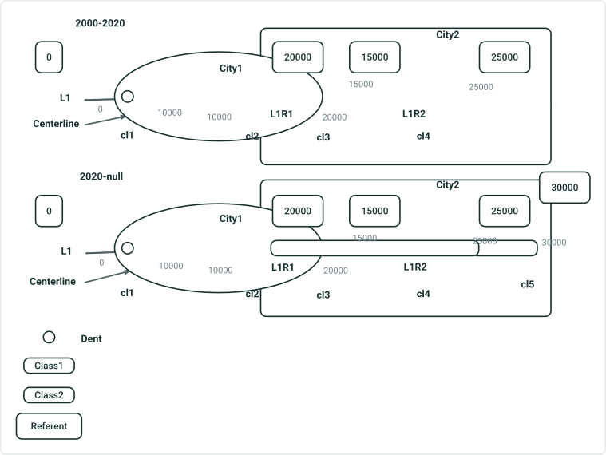

| Route ID | Line Name | Description | Measure | Referent | Offset | City | Anomaly Type | DOTClass |
| --- | --- | --- | --- | --- | --- | --- | --- | --- |
| {IDL1R1- | L1 | Begin {IDL1R1- | 0 | 0 | 0 | Unclassified |  | Class1 |
| {IDL1R1- | L1 | Here begins CenterlineID cl1 ! | 0 | 0 | 0 | Unclassified |  | Class1 |
| {IDL1R1- | L1 | Begin Class1 | 0 | 0 | 0 | Unclassified |  | Class1 |
| {IDL1R1- | L1 | End Unclassified Limit | 4500 | 0 | 4500 | Unclassified |  | Class1 |
| {IDL1R1- | L1 | Begin City1 Limit | 4500 | 0 | 4500 | City1 |  | Class1 |
| {IDL1R1- | L1 | Anomaly Dent | 5000 | 0 | 5000 | City1 | Dent | Class1 |
| {IDL1R1- | L1 | End City1 Limit | 6000 | 0 | 6000 | City1 |  | Class1 |
| {IDL1R1- | L1 | Begin Unclassified Limit | 6000 | 0 | 6000 | Unclassified |  | Class1 |
| {IDL1R1- | L1 | Here ends CenterlineID cl1 ! | 10000 | 0 | 10000 | Unclassified |  | Class1 |
| {IDL1R1- | L1 | Here begins CenterlineID cl2 ! | 10000 | 0 | 10000 | Unclassified |  | Class1 |
| {IDL1R1- | L1 | End Unclassified Limit | 14000 | 0 | 14000 | Unclassified |  | Class1 |
| {IDL1R1- | L1 | Begin City2 Limit | 14000 | 0 | 14000 | City2 |  | Class1 |
| {IDL1R1- | L1 | Here ends CenterlineID cl2 ! | 15000 | 0 | 15000 | City2 |  | Class1 |
| {IDL1R1- | L1 | Here begins CenterlineID cl3 ! | 15000 | 0 | 15000 | City2 |  | Class1 |
| {IDL1R1- | L1 | Begin City1 Limit | 16000 | 0 | 16000 | City1 |  | Class1 |
| {IDL1R1- | L1 | End City1 Limit | 18500 | 0 | 18500 | City1 |  | Class1 |
| {IDL1R1- | L1 | Here ends CenterlineID cl3 ! | 20000 | 20000 | 0 | City2 |  | Class1 |
| {IDL1R1- | L1 | End {IDL1R1- | 20000 | 20000 | 0 | City2 |  | Class1 |
| {IDL1R2- | L1 | Begin {IDL1R2- | 15000 | 15000 | 0 | City2 |  | Class1 |
| {IDL1R2- | L1 | Here ends CenterlineID cl4 ! | 15000 | 15000 | 0 | City2 |  | Class1 |
| {IDL1R2- | L1 | Here begins CenterlineID cl4 ! | 25000 | 25000 | 0 | City2 |  | Class1 |
| {IDL1R2- | L1 | End Class1 | 25000 | 25000 | 0 | City2 |  | Class1 |
| {IDL1R2- | L1 | End {IDL1R2- | 25000 | 25000 | 0 | City2 |  | Class1 |

| Route ID | Line Name | Description | Measure | Referent | Offset | City | Anomaly Type | DOTClass |
| --- | --- | --- | --- | --- | --- | --- | --- | --- |
| {IDL1R1- | L1 | Begin {IDL1R1- | 0 | 0 | 0 | Unclassified |  | Class1 |
| {IDL1R1- | L1 | Here begins CenterlineID cl1 ! | 0 | 0 | 0 | Unclassified |  | Class1 |
| {IDL1R1- | L1 | Begin Class1 | 0 | 0 | 0 | Unclassified |  | Class1 |
| {IDL1R1- | L1 | End Unclassified Limit | 4500 | 0 | 4500 | Unclassified |  | Class1 |
| {IDL1R1- | L1 | Begin City1 Limit | 4500 | 0 | 4500 | City1 |  | Class1 |
| {IDL1R1- | L1 | Anomaly Dent | 5000 | 0 | 5000 | City1 | Dent | Class1 |
| {IDL1R1- | L1 | End City1 Limit | 6000 | 0 | 6000 | City1 |  | Class1 |
| {IDL1R1- | L1 | Begin Unclassified Limit | 6000 | 0 | 6000 | Unclassified |  | Class1 |
| {IDL1R1- | L1 | Here ends CenterlineID cl1 ! | 10000 | 0 | 10000 | Unclassified |  | Class1 |
| {IDL1R1- | L1 | Here begins CenterlineID cl2 ! | 10000 | 0 | 10000 | Unclassified |  | Class1 |
| {IDL1R1- | L1 | End Unclassified Limit | 14000 | 0 | 14000 | Unclassified |  | Class1 |
| {IDL1R1- | L1 | Begin City2 Limit | 14000 | 0 | 14000 | City2 |  | Class1 |
| {IDL1R1- | L1 | Begin Class2 | 15000 | 0 | 15000 | City2 |  | Class2 |
| {IDL1R1- | L1 | Here ends CenterlineID cl2 ! | 15000 | 0 | 15000 | City2 |  | Class2 |
| {IDL1R1- | L1 | Here begins CenterlineID cl3 ! | 15000 | 0 | 15000 | City2 |  | Class2 |
| {IDL1R1- | L1 | Begin City1 Limit | 16000 | 0 | 16000 | City1 |  | Class2 |
| {IDL1R1- | L1 | End City1 Limit | 18500 | 0 | 18500 | City1 |  | Class2 |
| {IDL1R1- | L1 | Here ends CenterlineID cl3 ! | 20000 | 20000 | 0 | City2 |  | Class2 |
| {IDL1R1- | L1 | End {IDL1R1- | 20000 | 20000 | 0 | City2 |  | Class2 |
| {IDL1R2- | L1 | Begin {IDL1R2- | 15000 | 15000 | 0 | City2 |  | Class2 |
| {IDL1R2- | L1 | Here ends CenterlineID cl4 ! | 15000 | 15000 | 0 | City2 |  | Class2 |
| {IDL1R2- | L1 | Here begins CenterlineID cl4 ! | 25000 | 25000 | 0 | City2 |  | Class2 |
| {IDL1R2- | L1 | End Class1 | 25000 | 25000 | 0 | City2 |  | Class2 |
| {IDL1R2- | L1 | Here begins CenterlineID cl5 ! | 25000 | 25000 | 0 | City2 |  | Class2 |
| {IDL1R2- | L1 | End Class2 | 30000 | 30000 | 0 | City2 |  | Class2 |
| {IDL1R2- | L1 | Here ends CenterlineID cl5 ! | 30000 | 30000 | 0 | City2 |  | Class2 |
| {IDL1R2- | L1 | End {IDL1R2- | 30000 | 30000 | 0 | City2 |  | Class2 |

For overlapping polygons and events, Column says the last record the route enters, but either is fine

## Slide 14

ADM

- Simple route with multiple log fields, multiple location fields, and 1 referent field (ADM 3)
  - Log: point events, intersection, centerline, and line events. Mix prefix/suffix configuration. Use filter expression on a point event and intersection. Merge coincident events for 1 line event
  - Referent: nearest; with only suffix, in international miles
  - Concurrent routes on the same centerline
- Same case above on a lollipop route with overlapping polygon and overlapping point events
- Same case above on a branched route with no intersection with polygon and overlapping point and line events
- Multiple gapped route with 2 log fields (centerline and spanning event) and a location field (ADM 2)
  - A point event, and centerline with no prefix/suffix

## Slide 15

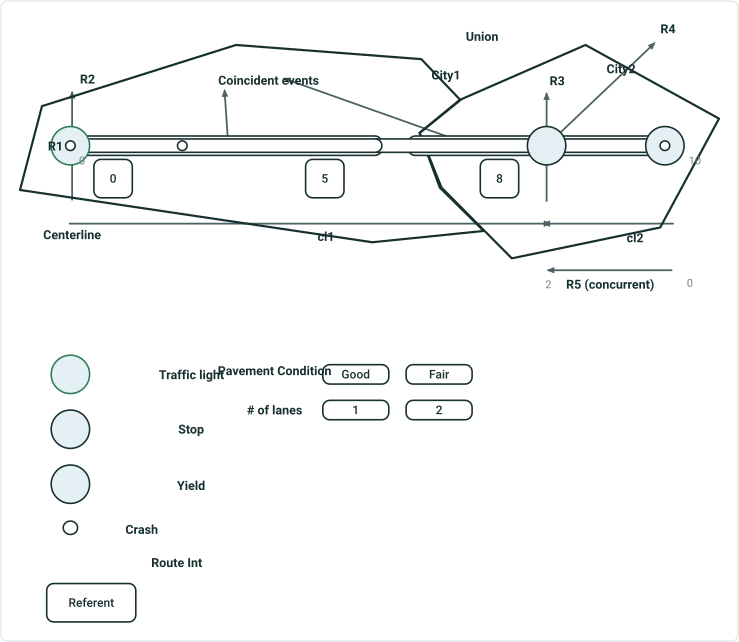

| Route ID | Description | Measure | Referent | Offset | County | City | Intersection | Sign | Severity | Pavement | Lanes |
| --- | --- | --- | --- | --- | --- | --- | --- | --- | --- | --- | --- |
| {IDR1- | Begin {IDR1- | 0 | 0 | 0 | Union | City1 |  |  |  | Good | 1 |
| {IDR1- | Begin cl1 | 0 | 0 | 0 | Union | City1 |  |  |  | Good | 1 |
| {IDR1- | Begin Good Pavement | 0 | 0 | 0 | Union | City1 |  |  |  | Good | 1 |
| {IDR1- | Begin 1 lane(s) | 0 | 0 | 0 | Union | City1 |  |  |  | Good | 1 |
| {IDR1- | Crash Minor | 0 | 0 | 0 | Union | City1 |  |  | Minor | Good | 1 |
| {IDR1- | Crash Major | 2 | 0 | 1.998 | Union | City1 |  |  | Major | Good | 1 |
| {IDR1- | End 1 lane(s) | 5 | 5 | 0 | Union | City1 |  |  |  | Good | 1 |
| {IDR1- | Begin 2 lane(s) | 5 | 5 | 0 | Union | City1 |  |  |  | Good | 2 |
| {IDR1- | End City1 Limit | 6 | 5 | 0.998 | Union | City1 |  |  |  | Good | 2 |
| {IDR1- | Begin City2 Limit | 6 | 5 | 0.998 | Union | City2 |  |  |  | Good | 2 |
| {IDR1- | Intersecting R3, R4 & R5 | 8 | 8 | 2.995 | Union | City2 | R1 & R3 & R4 & R5 |  |  | Good | 2 |
| {IDR1- | Sign Stop | 8 | 8 | 0 | Union | City2 |  | Stop |  | Good | 2 |
| {IDR1- | End Good Pavement | 8 | 8 | 0 | Union | City2 |  |  |  | Good | 2 |
| {IDR1- | Begin Fair Pavement | 8 | 8 | 0 | Union | City2 |  |  |  | Fair | 2 |
| {IDR1- | End cl1 | 8 | 8 | 0 | Union | City2 |  |  |  | Fair | 2 |
| {IDR1- | End cl2 | 8 | 8 | 0 | Union | City2 |  |  |  | Fair | 2 |
| {IDR1- | Crash Fatal | 9.5 | 8 | 1.498 | Union | City2 |  |  | Fatal | Fair | 2 |
| {IDR1- | Begin cl2 | 10 | 8 | 1.998 | Union | City2 |  |  |  | Fair | 2 |
| {IDR1- | End {IDR1- | 10 | 8 | 1.998 | Union | City2 |  |  |  | Fair | 2 |
| {IDR5- | Begin {IDR5- | 0 |  |  | Union | City2 |  |  |  |  |  |
| {IDR5- | Begin cl2 | 0 |  |  | Union | City2 |  |  |  |  |  |
| {IDR5- | Intersecting R1, R3 & R4 |  |  |  | Union | City2 | R1 & R3 & R4 & R5 |  |  |  |  |
| {IDR5- | End cl2 | 2 |  |  | Union | City2 |  |  |  |  |  |
| {IDR5- | End {IDR5- | 2 |  |  | Union | City2 |  |  |  |  |  |

ADM1 - Simple route with multiple log fields, multiple location fields, and 1 referent field (ADM 3)

- Log: point events, intersection, centerline, and line events. Mix prefix/suffix configuration. Use filter expression on a point event “Type is Stop” and intersection “more than 2 routes”. Merge coincident events for 1 line event (Pavement condition)
- Referent: nearest; with only suffix, in international miles
- Concurrent routes on the same centerline

Only R1 and R5 are selected

- R1 and R5 are concurrent routes in opposite directions using the same centerline


## Slide 16

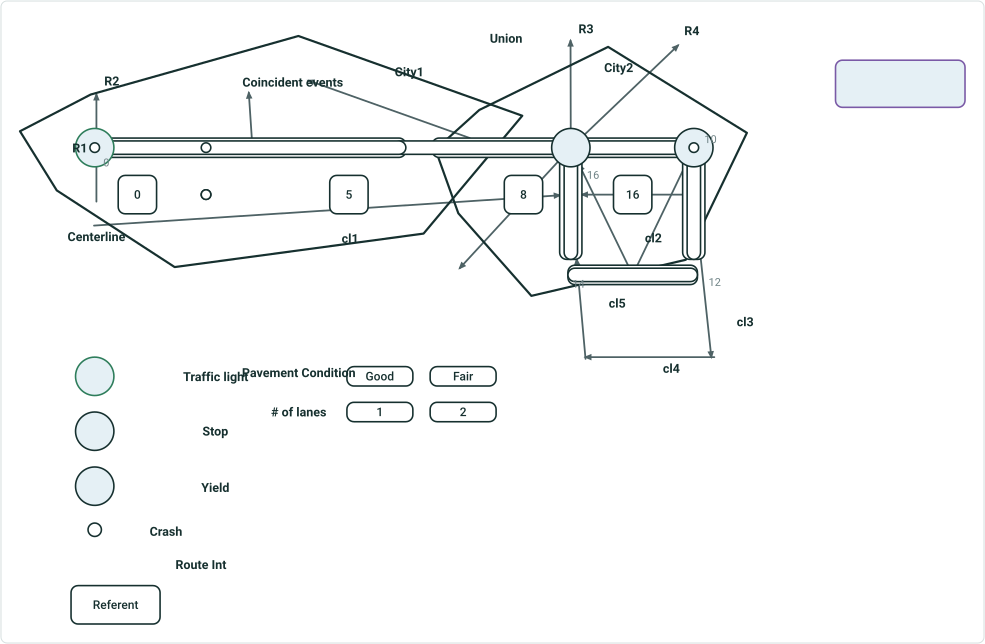

| Route ID | Description | Measure | Referent | Offset | County | City | Intersection | Sign | Severity | Pavement | Lanes |
| --- | --- | --- | --- | --- | --- | --- | --- | --- | --- | --- | --- |
| {IDR1- | Begin {IDR1- | 0 | 0 | 0 | Union | City1 |  |  |  | Good | 1 |
| {IDR1- | Begin cl1 | 0 | 0 | 0 | Union | City1 |  |  |  | Good | 1 |
| {IDR1- | Begin Good Pavement | 0 | 0 | 0 | Union | City1 |  |  |  | Good | 1 |
| {IDR1- | Begin 1 lane(s) | 0 | 0 | 0 | Union | City1 |  |  |  | Good | 1 |
| {IDR1- | Crash Minor | 0 | 0 | 0 | Union | City1 |  |  | Minor | Good | 1 |
| {IDR1- | Crash Major | 2 | 0 | 1.998 | Union | City1 |  |  | Major | Good | 1 |
| {IDR1- | Crash Minor | 2 | 0 | 1.998 | Union | City1 |  |  | Minor | Good | 1 |
| {IDR1- | Crash Fatal | 2 | 0 | 1.998 | Union | City1 |  |  | Fatal | Good | 1 |
| {IDR1- | End 1 lane(s) | 5 | 5 | 0 | Union | City1 |  |  |  | Good | 1 |
| {IDR1- | Begin 2 lane(s) | 5 | 5 | 0 | Union | City1 |  |  |  | Good | 2 |
| {IDR1- | Begin City2 Limit | 6 | 5 | 0.998 | Union | City2 |  |  |  | Good | 2 |
| {IDR1- | End City1 Limit | 6.5 | 5 or 8 | 1.498 | Union | City2 |  |  |  | Good | 2 |
| {IDR1- | Intersecting R3 & R4 | 8 | 8 | 0 | Union | City2 | R1 & R3 & R4 |  |  | Good | 2 |
| {IDR1- | Sign Stop | 8 | 8 | 0 | Union | City2 |  | Stop |  | Good | 2 |
| {IDR1- | End Good Pavement | 8 | 8 | 0 | Union | City2 |  |  |  | Good | 2 |
| {IDR1- | Begin Fair Pavement | 8 | 8 | 0 | Union | City2 |  |  |  | Fair | 2 |
| {IDR1- | End cl1 | 8 | 8 | 0 | Union | City2 |  |  |  | Fair | 2 |
| {IDR1- | End cl2 | 8 | 8 | 0 | Union | City2 |  |  |  | Fair | 2 |
| {IDR1- | Crash Fatal | 9.5 | 8 | 1.498 | Union | City2 |  |  | Fatal | Fair | 2 |
| {IDR1- | Begin cl2 | 10 | 8 | 1.998 | Union | City2 |  |  |  | Fair | 2 |
| {IDR1- | Begin cl3 | 10 | 8 | 1.998 | Union | City2 |  |  |  | Fair | 2 |
| {IDR1- | End City2 Limit | 11 | 8 | 2.995 | Union | City2 |  |  |  | Fair | 2 |
| {IDR1- | Begin Unclassified Limit | 11 | 8 | 2.995 | Union | Unclassified |  |  |  | Fair | 2 |
| {IDR1- | End cl3 | 12 | 8 or 16 | 3.992 | Union | Unclassified |  |  |  | Fair | 2 |
| {IDR1- | Begin cl4 | 12 | 8 or 16 | 3.992 | Union | Unclassified |  |  |  | Fair | 2 |
| {IDR1- | End Unclassified Limit | 13 | 16 | -2.995 | Union | Unclassified |  |  |  | Fair | 2 |
| {IDR1- | Begin City2 Limit | 13 | 16 | -2.995 | Union | City2 |  |  |  | Fair | 2 |
| {IDR1- | End cl4 | 14 | 16 | -1.998 | Union | City2 |  |  |  | Fair | 2 |
| {IDR1- | Begin cl5 | 14 | 16 | -1.998 | Union | City2 |  |  |  | Fair | 2 |
| {IDR1- | End Fair Pavement | 16 | 16 | 0 | Union | City2 |  |  |  | Fair | 2 |
| {IDR1- | End 2 lane(s) | 16 | 16 | 0 | Union | City2 |  |  |  | Fair | 2 |
| {IDR1- | Intersecting R3 & R4 | 16 | 16 | 0 | Union | City2 | R1 & R3 & R4 |  |  | Fair | 2 |
| {IDR1- | Eng cl5 | 16 | 16 | 0 | Union | City2 |  |  |  | Fair | 2 |
| {IDR1- | End {IDR1- | 10 | 5 | 4.992 | Union | City2 |  |  |  | Fair | 2 |

ADM2 - Lollipop route with multiple log fields, multiple location fields, and 1 referent field (ADM 3)

- Log: point events, intersection, centerline, and line events. Mix prefix/suffix configuration. Use filter expression on a point event “Type is Stop” and intersection “more than 2 routes”. Merge coincident events 1 line event (Pavement condition)
- Overlapping polygon and overlapping point events
- Referent: nearest; with only suffix, in international miles

Only R1 is selected

2 intersection features. 8 & 16


## Slide 17

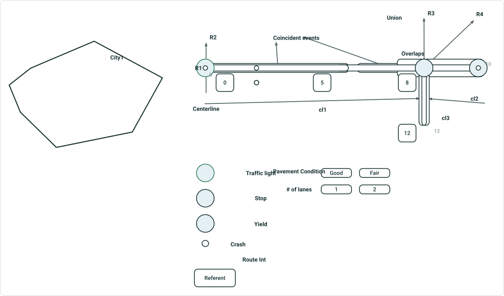

| Route ID | Description | Measure | Referent | Offset | County | City | Intersection | Sign | Severity | Pavement | Lanes |
| --- | --- | --- | --- | --- | --- | --- | --- | --- | --- | --- | --- |
| {IDR1- | Begin {IDR1- | 0 | 0 | 0 | Union | Unclassified |  |  |  | Good | 1 |
| {IDR1- | Begin cl1 | 0 | 0 | 0 | Union | Unclassified |  |  |  | Good | 1 |
| {IDR1- | Begin Good Pavement | 0 | 0 | 0 | Union | Unclassified |  |  |  | Good | 1 |
| {IDR1- | Begin 1 lane(s) | 0 | 0 | 0 | Union | Unclassified |  |  |  | Good | 1 |
| {IDR1- | Crash Minor | 0 | 0 | 0 | Union | Unclassified |  |  | Minor | Good | 1 |
| {IDR1- | Crash Major | 2 | 0 | 1.998 | Union | Unclassified |  |  | Major | Good | 1 |
| {IDR1- | Crash Minor | 2 | 0 | 1.998 | Union | Unclassified |  |  | Minor | Good | 1 |
| {IDR1- | Crash Fatal | 2 | 0 | 1.998 | Union | Unclassified |  |  | Fatal | Good | 1 |
| {IDR1- | End 1 lane(s) | 5 | 5 | 0 | Union | Unclassified |  |  |  | Good | 1 |
| {IDR1- | Begin 2 lane(s) | 5 | 5 | 0 | Union | Unclassified |  |  |  | Good | 2 |
| {IDR1- | Begin Fair Pavement | 7 | 8 | -0.998 | Union | Unclassified |  |  |  | Fair | 2 |
| {IDR1- | Intersecting R3 & R4 | 8 | 8 | 0 | Union | Unclassified | R1 & R3 & R4 |  |  | Fair | 2 |
| {IDR1- | Sign Stop | 8 | 8 | 0 | Union | Unclassified |  | Stop |  | Fair | 2 |
| {IDR1- | End Good Pavement | 8 | 8 | 0 | Union | Unclassified |  |  |  | Fair | 2 |
| {IDR1- | End cl1 | 8 | 8 | 0 | Union | Unclassified |  |  |  | Fair | 2 |
| {IDR1- | End cl2 | 8 | 8 | 0 | Union | Unclassified |  |  |  | Fair | 2 |
| {IDR1- | Crash Fatal | 9.5 | 8 | 1.498 | Union | Unclassified |  |  | Fatal | Fair | 2 |
| {IDR1- | Begin cl2 | 10 | 8 | 1.998 | Union | Unclassified |  |  |  | Fair | 2 |
| {IDR1- | Begin cl3 | 10 | 8 or 12 | 1.998 | Union | Unclassified |  |  |  | Fair | 2 |
| {IDR1- | Intersecting R3 & R4 | 10 | 8 or 12 | 1.998 | Union | Unclassified | R1 & R3 & R4 |  |  | Fair | 2 |
| {IDR1- | End cl3 | 12 | 12 | 0 | Union | Unclassified |  |  |  | Fair | 2 |
| {IDR1- | End Fair Pavement | 12 | 12 | 0 | Union | Unclassified |  |  |  | Fair | 2 |
| {IDR1- | End 2 lane(s) | 12 | 12 | 0 | Union | Unclassified |  |  |  | Fair | 2 |
| {IDR1- | End {IDR1- | 12 | 12 | 0 | Union | Unclassified |  |  |  | Fair | 2 |

Only R1 is selected

ADM3 - Branch route with multiple log fields, multiple location fields, and 1 referent field (ADM 3)

- Log: point events, intersection, centerline, and line events. Mix prefix/suffix configuration. Use filter expression on a point event “Type is Stop” and intersection “more than 2 routes”. Merge coincident events for 1 line event (Pavement condition)
- Route does not intersect polygon.
- Overlapping point and line events
- Referent: nearest; with only suffix, in international miles


## Slide 18

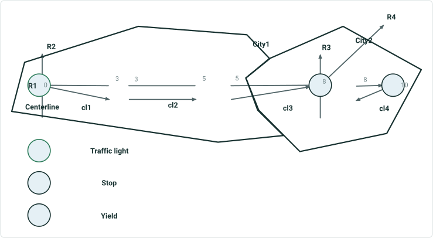

| Route ID | Description | Measure | City | Sign |
| --- | --- | --- | --- | --- |
| {IDR1- | Begin {IDR1- | 0 | City1 |  |
| {IDR1- | Begin cl1 | 0 | City1 |  |
| {IDR1- | Sign Traffic light | 0 | City1 | Traffic light |
| {IDR1- | End cl1 | 3 | City1 |  |
| {IDR1- | Begin cl2 | 3 | City1 |  |
| {IDR1- | End cl2 | 5 | City1 |  |
| {IDR1- | Begin cl3 | 5 | City1 |  |
| {IDR1- | End City1 Limit | 6 | City1 |  |
| {IDR1- | Begin City2 Limit | 6 | City2 |  |
| {IDR1- | Sign Stop | 8 | City2 | Stop |
| {IDR1- | End cl3 | 8 | City2 |  |
| {IDR1- | End cl4 | 8 | City2 |  |
| {IDR1- | Sign Yield | 10 | City2 | Yield |
| {IDR1- | Begin cl4 | 10 | City2 |  |
| {IDR1- | End {IDR1- | 10 | City2 |  |

ADM4 - Multiple gapped route with 2 log fields (centerline and point event) and a location field (ADM 2)

  - A point event, and centerline with no prefix/suffix

Only R1 is selected

## Slide 19

PoM1 - Simple routes in a line with intersection being the log field and a location field (PoM 1)

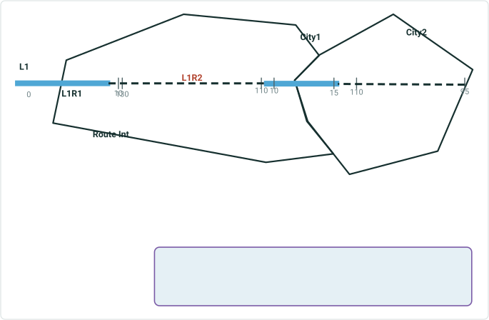

| Route ID | LineName | Description | Measure | City | Intersection |
| --- | --- | --- | --- | --- | --- |
| {IDL1R1- | L1 | Begin {IDL1R1- | 0 | Unclassified |  |
| {IDL1R1- | L1 | End Unclassified Limit | 5 | Unclassified |  |
| {IDL1R1- | L1 | Begin City1 Limit | 5 | City1 |  |
| {IDL1R1- | L1 | Intersecting {IDL1R2- | 10 | City1 | {IDL1R1- & {IDL1R2- |
| {IDL1R1- | L1 | Intersecting {IDL1R2- | 10 | City2 | {IDL1R1- & {IDL1R2- |
| {IDL1R1- | L1 | End City1 Limit | 12.5 | City1 |  |
| {IDL1R1- | L1 | Begin City2 Limit | 12.5 | City2 |  |
| {IDL1R1- | L1 | Intersecting {IDL1R2- | 15 | City2 | {IDL1R1- & {IDL1R2- |
| {IDL1R1- | L1 | End {IDL1R1- | 15 | City2 |  |
| {IDL1R2- | L1 | Begin {IDL1R2- | 95 | City2 |  |
| {IDL1R2- | L1 | Begin City2 Limit | 95 | City2 |  |
| {IDL1R2- | L1 | Intersecting {IDL1R1- | 110 | City2 | {IDL1R1- & {IDL1R2- |
| {IDL1R2- | L1 | Intersecting {IDL1R1- | 110 | City1 | {IDL1R1- & {IDL1R2- |
| {IDL1R2- | L1 | Intersecting {IDL1R1- | 130 | City1 | {IDL1R1- & {IDL1R2- |
| {IDL1R2- | L1 | End {IDL1R2- | 130 | City1 |  |

Results are route based. They might look weird under a PoM scenario. E.g. different intersections at the same measure.


## Slide 20

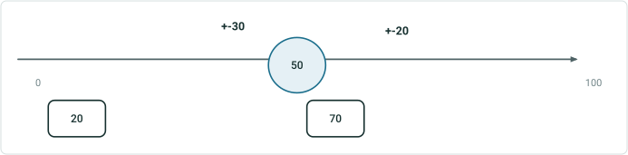
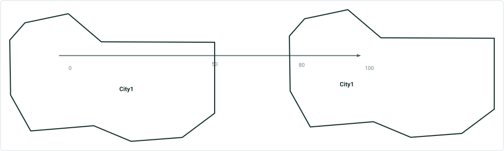

End city 1 at 50
Begin unclassified at 50
End Unclassified at 80
Begin city1 at 80
