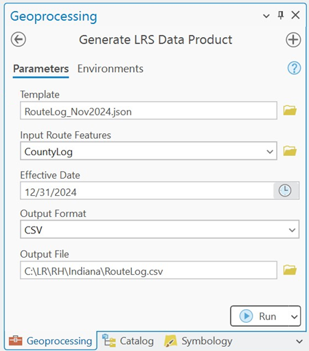
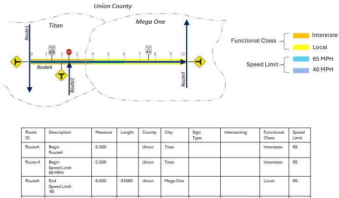
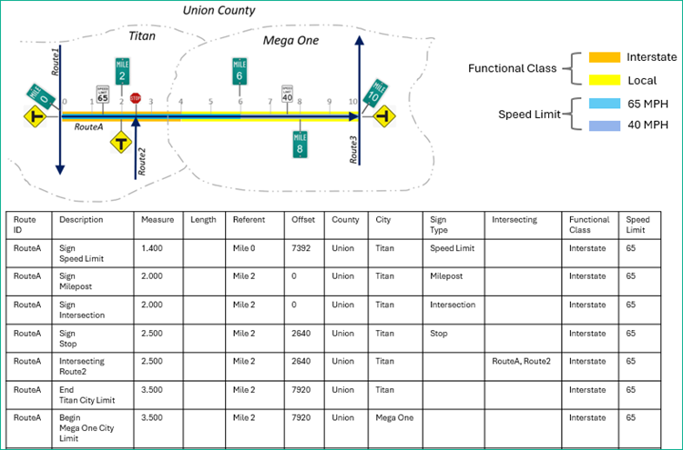
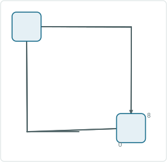
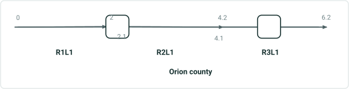
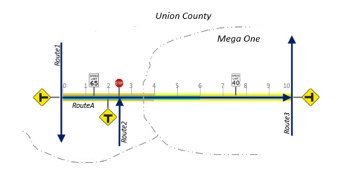

# Generate a Route Log using the GLRSDP GP Tool – Test Plan

|   |   |
| --- | --- |
| **Kind** | Test Plan · Pro |
| **Release** | — |
| **Issue** | [ArcGISPro/ps-location-referencing#6209](https://devtopia.esri.com/ArcGISPro/ps-location-referencing/issues/6209) |
| **Source** | [Generate_RouteLog_GPLRSDB_Testplan.pptx](<https://esriis.sharepoint.com/sites/LocationReferencing/Shared%20Documents/General/Test%20Plans/Generate_RouteLog_GPLRSDB_Testplan.pptx>) |
| **Edited** | 2024-12-26 22:43 by Praveen Kumar |
| **Extracted** | 2026-09-04 · lane `xmlstrip` |

<!-- metadata
```yaml
title: "Generate a Route Log using the GLRSDP GP Tool – Test Plan"
source_file: "Generate_RouteLog_GPLRSDB_Testplan.pptx"
source_url: "https://esriis.sharepoint.com/sites/LocationReferencing/Shared%20Documents/General/Test%20Plans/Generate_RouteLog_GPLRSDB_Testplan.pptx"
doc_id: 260
doc_kind: "Test Plan"
surface: "Pro"
doc_revision: ""
target_release: ""
pe: "Praveen Kumar"
dev: "Michael"
author: "Lakshmi Ananthanarayanan"
last_edited_by: "Praveen Kumar"
last_edited: "2024-12-26T22:43:05Z"
extracted: 2026-09-04
extraction_lane: xmlstrip
prompt_version: "v2.0.2"
keywords: ["route log", "geoprocessing", "test plan", "route", "event fields", "referent", "location fields", "loop route"]
tools: ["Generate LRS Data Product"]
products: []
issues: ["ArcGISPro/ps-location-referencing#6209"]
related: [{"doc":283,"file":"sample-route-log__doc283.md","s":8.415},{"doc":255,"file":"generate-a-route-log-including-spanning-events-and-centerline-test-plan__doc255.md","s":8.23},{"doc":359,"file":"transform-lrs-data-gp-tool-summarize-by-polygon-boundaries-test-plan__doc359.md","s":7.145},{"doc":256,"file":"route-log-data-product-template-test-plan__doc256.md","s":5.87},{"doc":372,"file":"transform-lrs-data-gp-tool-test-plan__doc372.md","s":4.965}]
```
-->

## Summary

Test plan for the Generate LRS Data Product geoprocessing tool focused on creating route logs. It covers verification of tool functionality including support for various route types, selection sets, definition queries, and output formats. The plan includes positive and negative test cases, UI and automation testing, and detailed test cases for line, point, intersection, location, and referent fields in route logs.

## Related documents

<!-- related:begin -->
- [Sample Route Log](<https://esriis.sharepoint.com/sites/lrsworkspace/LRS Doc Index/Other/sample-route-log__doc283.md>) — similar text 0.69 · 2 title words · 2 filename words · same surface <!-- rel:283 -->
- [Generate a route Log including spanning events and centerline – Test Plan](<https://esriis.sharepoint.com/sites/lrsworkspace/LRS Doc Index/Test Plans/generate-a-route-log-including-spanning-events-and-centerline-test-plan__doc255.md>) — similar text 0.30 · 3 title words · 3 filename words · same kind/surface/dev/folder <!-- rel:255 -->
- [Transform LRS Data GP tool: Summarize by polygon boundaries – Test Plan](<https://esriis.sharepoint.com/sites/lrsworkspace/LRS Doc Index/Test Plans/transform-lrs-data-gp-tool-summarize-by-polygon-boundaries-test-plan__doc359.md>) — similar text 0.32 · 1 title word · 1 filename word · same kind/surface/pe/dev/folder <!-- rel:359 -->
- [Route Log data product template – Test Plan](<https://esriis.sharepoint.com/sites/lrsworkspace/LRS Doc Index/Test Plans/route-log-data-product-template-test-plan__doc256.md>) — similar text 0.23 · 2 title words · 3 filename words · same kind/surface/folder <!-- rel:256 -->
- [Transform LRS Data GP tool – Test Plan](<https://esriis.sharepoint.com/sites/lrsworkspace/LRS Doc Index/Test Plans/transform-lrs-data-gp-tool-test-plan__doc372.md>) — similar text 0.18 · 1 title word · 1 filename word · same kind/surface/dev/folder <!-- rel:372 -->
<!-- related:end -->

<!-- docs:begin -->
## Esri documentation

[Create a template for an LRS route log data product](https://doc.esri.com/en/arcgis-pro/latest/help/production/roads-highways/create-a-template-for-an-lrs-route-log-data-product.html) · [Storing referent and offset information for event location](https://doc.esri.com/en/arcgis-pro/latest/help/production/location-referencing-pipelines/storing-referent-and-offset-information-for-event-location.html)

_No page matched:_ [Generate LRS Data Product](https://www.google.com/search?q=%22Generate%20LRS%20Data%20Product%22+site%3Adoc.esri.com)
<!-- docs:end -->

---

## Slide 1 — Generate a route Log using the GLRSDP GP tool – Test Plan

https://devtopia.esri.com/ArcGISPro/ps-location-referencing/issues/6209

PE: Praveen Kumar
Dev: Michael

## Slide 2

GP tool:

- Verify that Generate LRS Data Product geoprocessing tool accept LRS data template created for the route log.
- Verify that the below are hidden for the route log template
  - *Units. Change this to an optional field as its not used for this product type
  - Summary Layer
  - Summary Field
  - Exclude null summary rows

Note : This user story excludes centerlines and spanning events for the route log layers

UI verification

- When few features are selected ensure that the ‘use the selected records:’ is shown.
- 508 and i18n



## Negative Cases <!-- slide 3 -->

### Verify Simple Route, Gapped Routes, Multi-gapped Routes

Functionality Verification

**Verify simple route, gapped routes, multi-gapped routes, 3D and complex shapes are supported.**
- Verify that the selection set of the layer is honoured
- Verify that all the routes are used to produce the output when there is no selection set. Selected)
- Verify that If a route is selected from a line, then all the routes within the line are considered (as per the effective date)
- Verify that definition queries for the layer is honored
- Verify that the summary field drop down lists only the non-system fields
- Verify in python inline and stand alone
- Verify in model builder include chaining
- Verify tool supports running against fgdb, egdb, fs default and versions
- Verify there is a progress bar at the bottom of tool pane and it shows the progress
- Clicking cancel will actually cancel the tool – depend on what stage of cancel, output will be different
Automation: PY
Doc: update the GP doc

- Routes does not exist for the provided date.

## Slide 4

Testing

- Test in fgdb, egdb (oracle + sql), fs - default and versions
- Test with nonline, Line,  derived routes, PoM and Addressing (sanity)
- Test with and without route selection and definition query
- The tool should run when the layers are checked off (invisible) in map
- Test running against thousands of routes
- Test running against 0 route e.g. an effective date that no route exists – output should not contain any row
- Test simple, gapped routes, multi-gapped routes, complex shapes, and z values
- Test with different gap calibration rules
- Test with overlapping routes
- Test with routes with time slices at different locations – only the time slice that exists in Effective Date is returned
- Test with routes that have measures different from geographic length
- Test with uncalibrated routes – provide the Route ID/Name but make all the rest of the fields as Null.
- For partially located events on the route, calculate the start and end locations only based on what is drawn/located on the route.
- Do not populate events that cannot be drawn at all.
- Test cancelling tool while it’s running – not generate anything
- Test python inline and stand alone
- Test chained model builder
- Test all the output formats (CSV ad table)
- Test with non spanning line events, point events and intersections

## Slide 5

TC1 – One Line Event log field

| Route ID | Description | Measure | Speed |
| --- | --- | --- | --- |
| RouteA | Begin RouteA | 0 |  |
| RouteA | Begin Speed Limit 65 MPH | 0 | 65 |
| RouteA | End Speed Limit 65 MPH | 6 | 65 |
| RouteA | Begin Speed Limit 40 MPH | 6 | 40 |
| RouteA | End Speed Limit 40 MPH | 10 | 40 |
| RouteA | End RouteA | 10 |  |

Selected RouteA and Speed limit event field

| Layer | Field | Begin text | End text | Field prefix | Field suffix |
| --- | --- | --- | --- | --- | --- |
| Network | Route ID | Begin | End |  |  |
| Speed Limit | Speed Limit | Begin | End | Speed Limit | MPH |

Template Details :



## Slide 6

TC2 – Multiple Line Event log fields

| Route ID | Description | Measure | Speed Limit | Functional Class |
| --- | --- | --- | --- | --- |
| RouteA | Begin RouteA | 0 | 65 | Interstate |
| RouteA | Begin Speed Limit 65 MPH | 0 | 65 | Interstate |
| RouteA | Begin FC Interstate | 0 | 65 | Interstate |
| RouteA | End FC Interstate | 4 | 65 | Interstate |
| RouteA | Begin FC Local | 4 | 65 | Local |
| RouteA | End Speed Limit 65 MPH | 6 | 65 | Local |
| RouteA | Begin Speed Limit 40 MPH | 6 | 40 | Local |
| RouteA | End Speed Limit 40 MPH | 10 | 40 | Local |
| RouteA | End FC Local | 10 | 40 | Local |
| RouteA | End RouteA | 10 | 40 | Local |

Selected RouteA : Speed limit and Functional class event fields

| Layer | Field | Begin text | End text | Field prefix | Field suffix |
| --- | --- | --- | --- | --- | --- |
| Network | Route ID | Begin | End |  |  |
| Speed Limit | Speed Limit | Begin | End | Speed Limit | MPH |
| Functional Class | Functional Class | Begin | End | FC |  |

Template Details :


## Slide 7

TC3 – Point Event & Intersections log fields

| Route ID | Description | Measure | Sign Type | Intersection |
| --- | --- | --- | --- | --- |
| RouteA | Begin RouteA | 0 |  |  |
| RouteA | Intersecting RouteA , Route1 | 0 |  | RouteA , Route1 |
| RouteA | Sign Speed Limit 65 | 1.4 | Speed Limit |  |
| RouteA | Sign Stop | 2.5 | Stop |  |
| RouteA | Intersecting RouteA , Route2 | 2.5 |  | RouteA , Route2 |
| RouteA | Sign Speed Limit 40 | 7.5 | Speed Limit |  |
| RouteA | Intersecting RouteA , Route3 | 10 |  | RouteA , Route3 |
| RouteA | End RouteA | 10 |  |  |
| Route1 | Begin Route1 | 2.2 |  |  |
| Route1 | Intersecting RouteA , Route1 | 5.2 |  | RouteA , Route1 |
| Route1 | End Route1 | 7.2 |  |  |
| Route2 | Begin Route2 | 0 |  |  |
| Route2 | Intersecting RouteA , Route2 | 2 |  | RouteA , Route2 |
| Route2 | End Route2 | 2 |  |  |
| Route3 | Begin Route3 | 0 |  |  |
| Route3 | Intersecting RouteA , Route3 | 2 |  | RouteA , Route3 |
| Route3 | End Route3 | 5 |  |  |

| Layer | Field | Begin text | End text | Field prefix | Field suffix |
| --- | --- | --- | --- | --- | --- |
| Network | Route ID | Begin | End |  |  |
| Sign | Sign Type |  |  | Sign |  |
| Intersection | Intersection Name |  |  | Intersecting |  |

[figure: 2.2 · 7.2 · 5 · 0 · 2 · Template Details :]


## Slide 8

TC4 – Location fields

| Route ID | Description | Measure | County | City |
| --- | --- | --- | --- | --- |
| RouteA | Begin RouteA | 0 | Union | Titan |
| RouteA | End City Limit Titan | 3.6 | Union | Titan |
| RouteA | Start City Limit Mega One | 3.6 | Union | Mega One |
| RouteA | End RouteA | 10 | Union | Mega One |
| Route1 | Begin Route1 | 2.2 | Union | Titan |
| Route1 | End Route1 | 7.2 | Union | Titan |
| Route2 | Begin Route2 | 0 | Union | Titan |
| Route2 | End Route2 | 2 | Union | Titan |
| Route3 | Begin Route3 | 0 | Union | Mega One |
| Route3 | End Route3 | 5 | Union | Mega One |
|  |  |  |  |  |

County and City Location fields

| Layer | Field | Begin text | End text | Field prefix | Field suffix |
| --- | --- | --- | --- | --- | --- |
| Network | Route ID | Begin | End |  |  |
| County | County Name | Begin | End |  |  |
| City | City Name | Begin | End |  |  |

[figure: 2.2 · 7.2 · 5 · 0 · Template Details :]


## Slide 9

TC5 – Point Event & Intersections log fields with Referents

| Route ID | Description | Measure | Referent | Offset | Sign Type | Intersection |
| --- | --- | --- | --- | --- | --- | --- |
| RouteA | Begin RouteA | 0 | Mile 0 | 0 |  |  |
| RouteA | Intersecting RouteA , Route1 | 0 | Mile 0 | 0 |  | RouteA , Route1 |
| RouteA | Sign Milepost Mile 0 | 0 | Mile 0 | 0 | Milepost |  |
| RouteA | Sign Speed Limit 65 | 1.4 | Mile 0 | 7392 | Speed Limit |  |
| RouteA | Sign Milepost Mile 2 | 2 | Mile 2 | 0 | Milepost |  |
| RouteA | Sign Stop | 2.5 | Mile 2 | 2640 | Stop |  |
| RouteA | Intersecting RouteA , Route2 | 2.5 | Mile 2 | 2640 |  | RouteA , Route2 |
| RouteA | Sign Milepost Mile 6 | 6 | Mile 6 | 0 | Milepost |  |
| RouteA | Sign Speed Limit 40 | 7.5 | Mile 6 | 7920 | Speed Limit |  |
| RouteA | Sign Milepost Mile 8 | 8 | Mile 8 | 0 | Milepost |  |
| RouteA | Intersecting RouteA , Route3 | 10 | Mile 10 | 0 |  | RouteA , Route3 |
| RouteA | Sign Milepost Mile 10 | 10 | Mile 10 | 0 | Milepost |  |
| RouteA | End RouteA | 10 | Mile 10 | 0 |  |  |

Selected RouteA

| Layer | Field | Begin text | End text | Field prefix | Field suffix | Unit |
| --- | --- | --- | --- | --- | --- | --- |
| Network | Route ID | Begin | End |  |  |  |
| Sign | Sign Type |  |  | Sign |  |  |
| Intersection | Intersection Name |  |  | Intersecting |  |  |
| Milepost | Referent |  |  |  |  | Feet |

Template Details :



## Slide 10

TC5 – Line Event log fields with Referents

| Route ID | Description | Measure | Referent | Offset | Speed Limit | Functional Class |
| --- | --- | --- | --- | --- | --- | --- |
| RouteA | Begin RouteA | 0 | Mile 0 | 0 | 65 | Interstate |
| RouteA | Begin Speed Limit 65 MPH | 0 | Mile 0 | 0 | 65 | Interstate |
| RouteA | Begin FC Interstate | 0 | Mile 0 | 0 | 65 | Interstate |
| RouteA | End FC Interstate | 4 | Mile 2 | 10560 | 65 | Interstate |
| RouteA | Begin FC Local | 4 | Mile 2 | 10560 | 65 | Local |
| RouteA | End Speed Limit 65 MPH | 6 | Mile 6 | 0 | 65 | Local |
| RouteA | Begin Speed Limit 40 MPH | 6 | Mile 6 | 0 | 40 | Local |
| RouteA | End Speed Limit 40 MPH | 10 | Mile 10 | 0 | 40 | Local |
| RouteA | End FC Local | 10 | Mile 10 | 0 | 40 | Local |
| RouteA | End RouteA | 10 | Mile 10 | 0 | 40 | Local |
| Route1 | Begin Route1 | 2.2 |  |  |  |  |
| Route1 | End Route1 | 7.2 |  |  |  |  |
| Route2 | Begin Route2 | 0 |  |  |  |  |
| Route2 | End Route2 | 2 |  |  |  |  |
| Route3 | Begin Route3 | 0 |  |  |  |  |
| Route3 | End Route3 | 5 |  |  |  |  |

| Layer | Field | Begin text | End text | Field prefix | Field suffix | Units |
| --- | --- | --- | --- | --- | --- | --- |
| Network | Route ID | Begin | End |  |  |  |
| Speed Limit | Speed Limit | Begin | End | Speed Limit | MPH |  |
| Functional Class | Functional Class | Begin | End | FC |  |  |
| Milepost | Referent |  |  |  |  | Feet |

[figure: 2.2 · 7.2 · 5 · 0 · 2 · Template Details :]


## Slide 11

8
0
TC6 - Loop route with Point, Line and Location fields

| Route ID | Description | Measure | County | Functional Class | Speed Limit | Sign Type |
| --- | --- | --- | --- | --- | --- | --- |
| R1 | Begin R1 | 0 | Union |  | 30 |  |
| R1 | Sign Flasher | 0 | Union |  | 30 | Flasher |
| R1 | Begin Speed Limit 30 MPH | 0 | Union |  | 30 |  |
| R1 | Begin FC Local | 1 | Union | Local | 30 |  |
| R1 | Sign Flasher | 4 | Union | Local | 30 | Flasher |
| R1 | End FC Local | 6 | Union | Local | 30 |  |
| R1 | End Speed Limit 30 MPH | 8 | Union | Local | 30 |  |
| R1 | End R1 | 8 | Union | Local | 30 |  |



| Layer | Field | Begin text | End text | Field prefix | Field suffix |
| --- | --- | --- | --- | --- | --- |
| Network | Route ID | Begin | End |  |  |
| County | County Name | Begin | End |  |  |
| Sign | Sign Type |  |  | Sign |  |
| Speed Limit | Speed Limit | Begin | End | Speed Limit | MPH |
| Functional Class | Functional Class | Begin | End | FC |  |

Template Details :

## Slide 12

8
0
TC7 - Loop route with Point, Line and Location fields

| Route ID | Description | Measure | County | Functional Class | Speed Limit | Sign Type |
| --- | --- | --- | --- | --- | --- | --- |
| R1 | Begin R1 | 0 | Union |  | 30 |  |
| R1 | Sign Flasher | 0 | Union |  | 30 | Flasher |
| R1 | Begin Speed Limit 30 MPH | 0 | Union |  | 30 |  |
| R1 | Begin FC Local | 1 | Union | Local | 30 |  |
| R1 | Sign Flasher | 4 | Union | Local | 30 | Flasher |
| R1 | End FC Local | 6 | Union | Local | 30 |  |
| R1 | End Speed Limit 30 MPH | 8 | Union | Local | 30 |  |
| R1 | End R1 | 8 | Union | Local | 30 |  |


| Layer | Field | Begin text | End text | Field prefix | Field suffix |
| --- | --- | --- | --- | --- | --- |
| Network | Route ID | Begin | End |  |  |
| County | County Name | Begin | End |  |  |
| Sign | Sign Type |  |  | Sign |  |
| Speed Limit | Speed Limit | Begin | End | Speed Limit | MPH |
| Functional Class | Functional Class | Begin | End | FC |  |

Template Details : with “Merge coincident events” option checked
Events are individual separate events each side of the loop

## Slide 13

| Route Name | Line Name | Description | Measure | County | DOT Class | Anomaly |
| --- | --- | --- | --- | --- | --- | --- |
| R1 | L1 | Begin R1 | 0 | Orion | Class1 |  |
| R1 | L1 | Begin DOT Class1 | 0 | Orion | Class1 |  |
| R1 | L1 | End R1 | 2 | Orion | Class1 |  |
| R1 | L1 | End DOT Class1 | 2 | Orion | Class1 |  |
| R2 | L1 | Begin R2 | 2.1 | Orion | Class3 |  |
| R2 | L1 | Begin DOT Class3 | 2.1 | Orion | Class3 |  |
| R2 | L1 | Anomaly High | 2.1 | Orion | Class3 | Dent |
| R2 | L1 | End R2 | 4.1 | Orion | Class3 |  |
| R2 | L1 | End DOT Class3 | 4.1 | Orion | Class3 |  |
| R3 | L1 | Begin R3 | 4.2 | Orion | Class3 |  |
| R3 | L1 | Begin DOT Class3 | 4.2 | Orion | Class3 |  |
| R3 | L1 | Anomaly High | 5.2 | Orion | Class3 | External Corrosion |
| R3 | L1 | End R3 | 6.2 | Orion | Class3 |  |
| R3 | L1 | End DOT Class2 | 6.2 | Orion | Class3 |  |

TC8 – Line Network routes with Point, Line and Location fields



| Layer | Field | Begin text | End text | Field prefix | Field suffix |
| --- | --- | --- | --- | --- | --- |
| Network | Route Name | Begin | End |  |  |
| County | County Name | Begin | End |  |  |
| Anomaly | Anomaly |  |  |  |  |
| DOT Class | DOT Class | Begin | End |  |  |

## Slide 14

TC9 – Point, Line Event & Intersections log fields with location and Referents

| Layer | Field | Begin text | End text | Field prefix | Field suffix | Units |
| --- | --- | --- | --- | --- | --- | --- |
| Network | Route ID | Begin | End |  |  |  |
| Sign | Sign Type |  |  | Sign |  |  |
| Intersection | Intersection Name |  |  | Intersecting |  |  |
| Speed Limit | Speed Limit | Begin | End | Speed Limit | MPH |  |
| Functional Class | Functional Class | Begin | End | FC |  |  |
| County | County Name | Begin | End |  |  |  |
| City | City Name | Begin | End |  |  |  |
| Milepost | Referent |  |  |  |  | Feet |

[figure: 2.2 · 7.2 · 5 · 0 · 2 · Template Details :]


## Slide 15

| Route ID | Description | Measure | Referent | Offset | Sign Type | Intersection | Speed Limit | Functional Class | County | City |
| --- | --- | --- | --- | --- | --- | --- | --- | --- | --- | --- |
| RouteA | Begin RouteA | 0 | Mile 0 | 0 |  |  | 65 | Interstate | Union | Titan |
| RouteA | Intersecting RouteA, Route1 | 0 | Mile 0 | 0 |  | RouteA, Route1 | 65 | Interstate | Union | Titan |
| RouteA | Sign Milepost Mile 0 | 0 | Mile 0 | 0 | Milepost |  | 65 | Interstate | Union | Titan |
| RouteA | Begin Speed Limit 65 MPH | 0 | Mile 0 | 0 |  |  | 65 | Interstate | Union | Titan |
| RouteA | Begin FC Interstate | 0 | Mile 0 | 0 |  |  | 65 | Interstate | Union | Titan |
| RouteA | Sign Speed Limit 65 | 1.4 | Mile 0 | 7392 | Speed Limit |  | 65 | Interstate | Union | Titan |
| RouteA | Sign Milepost Mile 2 | 2 | Mile 2 | 0 | Milepost |  | 65 | Interstate | Union | Titan |
| RouteA | Sign Stop | 2.5 | Mile 2 | 2640 | Stop |  | 65 | Interstate | Union | Titan |
| RouteA | Intersecting RouteA, Route2 | 2.5 | Mile 2 | 2640 |  | RouteA, Route2 | 65 | Interstate | Union | Titan |
| RouteA | End City Limit Titan | 3.6 |  |  |  |  | 65 | Interstate | Union | Titan |
| RouteA | Start City Limit Mega One | 3.6 |  |  |  |  | 65 | Interstate | Union | Mega One |
| RouteA | End FC Interstate | 4 | Mile 2 | 10560 |  |  | 65 | Interstate | Union | Mega One |
| RouteA | Begin FC Local | 4 | Mile 2 | 10560 |  |  | 65 | Local | Union | Mega One |
| RouteA | Sign Milepost Mile 6 | 6 | Mile 6 | 0 | Milepost |  | 65 | Local | Union | Mega One |
| RouteA | End Speed Limit 65 MPH | 6 | Mile 6 | 0 |  |  | 65 | Local | Union | Mega One |
| RouteA | Begin Speed Limit 40 MPH | 6 | Mile 6 | 0 |  |  | 40 | Local | Union | Mega One |
| RouteA | Sign Speed Limit 40 | 7.5 | Mile 6 | 7920 | Speed Limit |  | 40 | Local | Union | Mega One |
| RouteA | Sign Milepost Mile 8 | 8 | Mile 8 | 0 | Milepost |  | 40 | Local | Union | Mega One |
| RouteA | Intersecting RouteA, Route3 | 10 | Mile 10 | 0 |  | RouteA, Route3 | 40 | Local | Union | Mega One |
| RouteA | Sign Milepost Mile 10 | 10 | Mile 10 | 0 | Milepost |  | 40 | Local | Union | Mega One |
| RouteA | End Speed Limit 40 MPH | 10 | Mile 10 | 0 |  |  | 40 | Local | Union | Mega One |
| RouteA | End FC Local | 10 | Mile 10 | 0 |  |  | 40 | Local | Union | Mega One |
| RouteA | End RouteA | 10 | Mile 10 | 0 |  |  | 40 | Local | Union | Mega One |
| Route1 | Begin Route1 | 2.2 |  |  |  |  |  |  | Union | Titan |
| Route1 | Intersecting RouteA, Route1 | 5.2 |  |  |  | RouteA, Route1 |  |  | Union | Titan |
| Route1 | End Route1 | 7.2 |  |  |  |  |  |  | Union | Titan |
| Route2 | Begin Route2 | 0 |  |  |  |  |  |  | Union | Titan |
| Route2 | Intersecting RouteA, Route2 | 2 |  |  |  | RouteA, Route2 |  |  | Union | Titan |
| Route2 | End Route2 | 2 |  |  |  |  |  |  | Union | Titan |
| Route3 | Begin Route3 | 0 |  |  |  |  |  |  | Union | Mega One |
| Route3 | Intersecting RouteA, Route3 | 2 |  |  |  | RouteA, Route3 |  |  | Union | Mega One |
| Route3 | End Route3 | 5 |  |  |  |  |  |  | Union | Mega One |

## Slide 16

TC10 – Location fields with boundaries missing

| Route ID | Description | Measure | County | City |
| --- | --- | --- | --- | --- |
| RouteA | Begin RouteA | 0 | Union | Unclassified |
| RouteA | Begin City Limit Mega One | 3.6 | Union | Mega One |
| RouteA | End City Limit Mega One | 9.3 | Union | Mega One |
| RouteA | End RouteA | 10 | Union | Unclassified |
| Route1 | Begin Route1 | 2.2 | Union | Unclassified |
| Route1 | End Route1 | 7.2 | Union | Unclassified |
| Route2 | Begin Route2 | 0 | Union | Unclassified |
| Route2 | End Route2 | 2 | Union | Unclassified |
| Route3 | Begin Route3 | 0 | Union | Unclassified |
| Route3 | End Route3 | 5 | Union | Unclassified |

County and City Location fields

| Layer | Field | Begin text | End text | Field prefix | Field suffix |
| --- | --- | --- | --- | --- | --- |
| Network | Route ID | Begin | End |  |  |
| County | County Name | Begin | End |  |  |
| City | City Name | Begin | End |  |  |

[figure: 2.2 · 7.2 · 2 · 0 · Template Details :]


