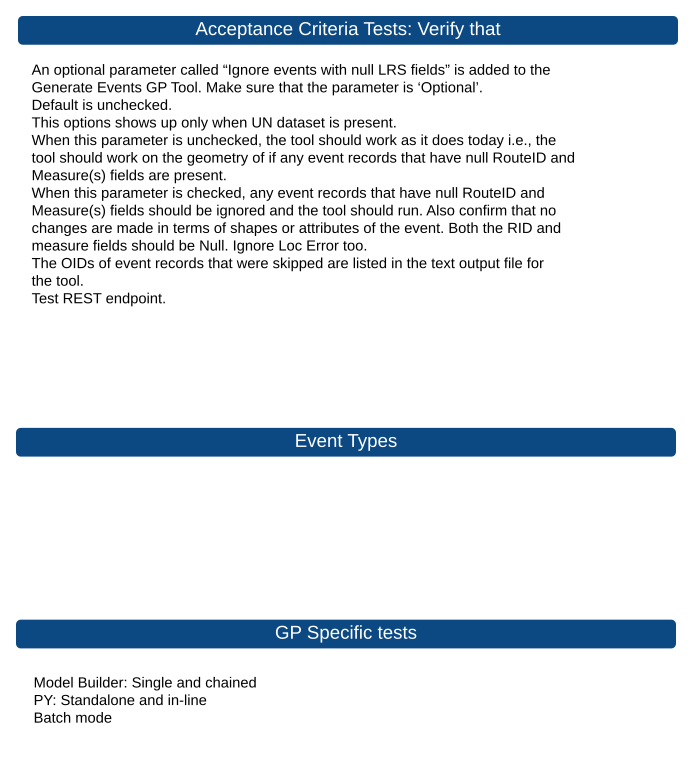
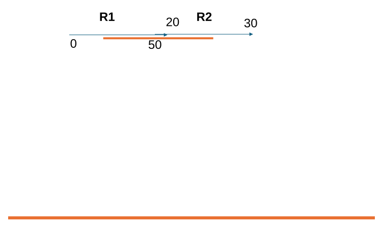

# Generate Events GP Tool Ignore Null Parameter Acceptance Tests

| Field | Value |
| --- | --- |
| **Doc** | 52 · Test Plan · Pro |
| **Product** | Utility Network |
| **Release** | — |
| **Issues** | — |
| **Source** | [GenerateEvents_IngnoreNull.pptx](<https://esriis.sharepoint.com/sites/LocationReferencing/Shared%20Documents/General/Test%20Plans/GenerateEvents_IngnoreNull.pptx>) |
| **People** | author Rahul Rakshit · PE — · dev — |
| **Edited** | 2026-02-09 22:01 by Rahul Rakshit |
| **Extracted** | 2026-09-04 · lane xmlstrip · format 3.0 · prompt v2.0.2 |
| **Keywords** | generate events · event · null fields · routeid · measure · geoprocessing · acceptance tests |
| **Tools** | Generate Events |

## Summary

This document defines acceptance criteria and test cases for the Generate Events geoprocessing tool's new optional parameter to ignore events with null LRS fields. It covers behavior verification for line and point events with null RouteID and measure fields, including REST endpoint, Model Builder, Python, and batch modes. The tests ensure ignored events are listed in output and no shape or attribute changes occur.

## Related documents

<!-- related:begin -->
- [Generate Events Skip Records with Null LRS Fields](<https://esriis.sharepoint.com/sites/lrsworkspace/LRS Doc Index/User Stories/generate-events-skip-records-with-null-lrs-fields.md>) — similar text 0.30 · 3 title words · 3 filename words · same surface <!-- rel:104 s=5.298 -->
- [Support Search Tolerance Parameter in Update Measures from LRS Tool – Test Plan](<https://esriis.sharepoint.com/sites/lrsworkspace/LRS Doc Index/Test Plans/4100-support-search-tolerance-parameter-in-update-measures.md>) — similar text 0.13 · 2 title words · same kind/surface/folder <!-- rel:229 s=3.598 -->
- [Add Point Event tool/ Add Multipoint Events tool Coordinate offset method – Test Plan](<https://esriis.sharepoint.com/sites/lrsworkspace/LRS Doc Index/Test Plans/3905-add-point-event-tool-add-multipoint-events-tool-coordinate.md>) — similar text 0.16 · 2 title words · 1 filename word · same kind/surface/folder <!-- rel:638 s=3.563 -->
- [Append Events Date Optional Test Plan](<https://esriis.sharepoint.com/sites/lrsworkspace/LRS Doc Index/Test Plans/append-events-date-optional.md>) — similar text 0.17 · 1 title word · 1 filename word · same kind/surface/folder <!-- rel:126 s=3.325 -->
- [Update Measures From LRS: Support Events and Intersections](<https://esriis.sharepoint.com/sites/lrsworkspace/LRS Doc Index/Test Plans/3882-update-measures-from-lrs-support-events-and-intersections.md>) — similar text 0.06 · 1 title word · 1 filename word · same kind/surface/folder <!-- rel:277 s=3.312 -->
<!-- related:end -->

<!-- docs:begin -->
## Esri documentation

[Split a centerline by measure](https://doc.esri.com/en/arcgis-pro/latest/help/production/location-referencing-pipelines/split-a-centerline-by-measure.html)

_No page matched:_ [Generate Events](https://www.google.com/search?q=%22Generate%20Events%22+site%3Adoc.esri.com)
<!-- docs:end -->

---

## Overview

### Slide 1 <!-- slide 1 -->

### Slide 2 <!-- slide 2 -->

### Slide 3 — Acceptance Criteria Tests : Verify that <!-- slide 3 -->

Event Types
GP Specific tests

## Test Cases

### TC-U01 — Optional “Ignore events with null LRS fields” parameter is added <!-- src: LLM · slide 3 · bullet 1 -->
- **Group:** GP Specific tests
- **Case:** An optional parameter called “Ignore events with null LRS fields” is added to the Generate Events GP Tool. Make sure that the parameter is ‘Optional’.

### TC-U02 — Default is unchecked. <!-- src: LLM · slide 3 · bullet 2 -->
- **Group:** GP Specific tests

### TC-U03 — This options shows up only when UN dataset is present. <!-- src: LLM · slide 3 · bullet 3 -->
- **Group:** GP Specific tests

### TC-U04 — Parameter unchecked: tool should work as it does today <!-- src: LLM · slide 3 · bullet 4 -->
- **Group:** GP Specific tests
- **Case:** When this parameter is unchecked, the tool should work as it does today i.e., the tool should work on the geometry of if any event records that have null RouteID and Measure(s) fields are present.

### TC-U05 — Parameter checked: records with null RouteID and Measure(s) ignored <!-- src: LLM · slide 3 · bullet 5 -->
- **Group:** GP Specific tests
- **Case:** When this parameter is checked, any event records that have null RouteID and Measure(s) fields should be ignored and the tool should run. Also confirm that no changes are made in terms of shapes or attributes of the event. Both the RID and measure fields should be Null. Ignore Loc Error too.

### TC-U06 — Skipped event record OIDs listed in the text output file <!-- src: LLM · slide 3 · bullet 6 -->
- **Group:** GP Specific tests
- **Case:** The OIDs of event records that were skipped are listed in the text output file for the tool.

### TC-U07 — Test REST endpoint. <!-- src: LLM · slide 3 · bullet 7 -->
- **Group:** GP Specific tests

### TC-U08 — Verify that these records are listed in white are ignored for a line event <!-- src: LLM · slide 4 · line event table -->

| Event ID | From Route ID | From Measure | To Route ID | To Measure | From Date | To Date | Event Attribute |
| --- | --- | --- | --- | --- | --- | --- | --- |
| E2 | Null | 20 | R2 | 40 | 1/1/2000 | Null | X2 |
| E3 | R1 | Null | R2 | 40 | 1/1/2000 | Null | X3 |
| E4 | R1 | 20 | Null | 40 | 1/1/2000 | Null | X4 |
| E5 | R1 | 20 | R2 | Null | 1/1/2000 | Null | X1 |
| E6 | Null | Null | R2 | 40 | 1/1/2000 | Null | X2 |
| E7 | Null | 20 | Null | 40 | 1/1/2000 | Null | X3 |
| E8 | Null | 20 | R2 | Null | 1/1/2000 | Null | X4 |
| E9 | R1 | Null | Null | 40 | 1/1/2000 | Null | X1 |
| E10 | R1 | Null | R2 | Null | 1/1/2000 | Null | X2 |
| E11 | R1 | 20 | Null | Null | 1/1/2000 | Null | X3 |
| E12 | Null | Null | Null | 40 | 1/1/2000 | Null | X4 |
| E13 | Null | Null | R2 | Null | 1/1/2000 | Null | X1 |
| E14 | Null | 20 | Null | Null | 1/1/2000 | Null | X2 |
| E15 | R1 | Null | Null | Null | 1/1/2000 | Null | X3 |
| E16 | Null | Null | Null | Null | 1/1/2000 | Null | X4 |

### TC-U09 — Verify that these records are listed in white are ignored for a point event <!-- src: LLM · slide 4 · point event table -->

| Event ID | Route ID | Measure | From Date | To Date | Event Attribute |
| --- | --- | --- | --- | --- | --- |
| E2 | Null | 20 | 1/1/2000 | Null | X2 |
| E3 | R1 | Null | 1/1/2000 | Null | X3 |
| E4 | Null | Null | 1/1/2000 | Null | X4 |

## Other content

### Slide 3 — Acceptance Criteria Tests : Verify that <!-- slide 3 -->

| Data Type | Event |
| --- | --- |
| FS | Line, Point |
| DC EGDB | Line, Point |
| FGDB | Line, Point |

- Model Builder: Single and chained
- PY: Standalone and in-line
- Batch mode

### Slide 5 <!-- slide 5 -->

| Route ID | From Date | To Date |
| --- | --- | --- |
| R1 | 1/1/2000 | Null |
| R2 | 1/1/2000 | Null |

| Event ID | From Route ID | From Measure | To Route ID | To Measure | From Date | To Date |
| --- | --- | --- | --- | --- | --- | --- |
| E1 | R1 | 25 | R2 | 25 | 1/1/2000 | Null |

| Event ID | From Route ID | From Measure | To Route ID | To Measure | From Date | To Date |
| --- | --- | --- | --- | --- | --- | --- |
| E1 | Null | 25 | R2 | 25 | 1/1/2000 | Null |

| Event ID | From Route ID | From Measure | To Route ID | To Measure | From Date | To Date |
| --- | --- | --- | --- | --- | --- | --- |
| E1 | Null | Null | R2 | 25 | 1/1/2000 | Null |

[figure: R1 · R2 · 0 · 50 · 20 · 30]

