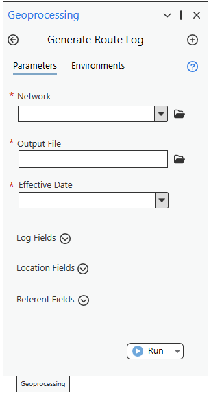
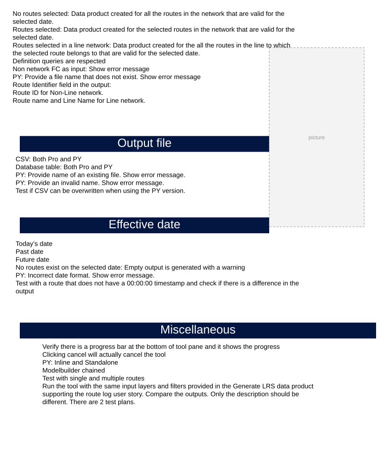
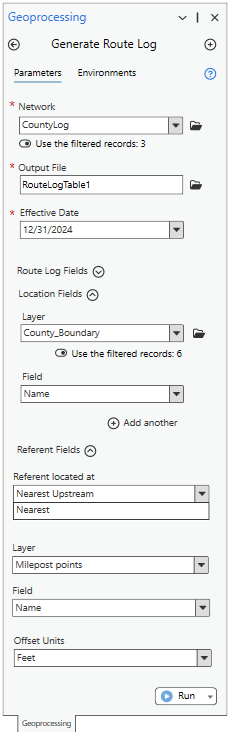

# Generate LogLo GP Standalone Test Plan

| Field | Value |
| --- | --- |
| **Doc** | 259 · Test Plan · Pro |
| **Product** | — |
| **Release** | — |
| **Issues** | — |
| **Source** | [Generate_LogLo_GP_Standalone_TestPlan1.pptx](<https://esriis.sharepoint.com/sites/LocationReferencing/Shared%20Documents/General/Test%20Plans/Generate_LogLo_GP_Standalone_TestPlan1.pptx>) |
| **People** | author Rahul Rakshit · PE — · dev — |
| **Edited** | 2025-01-14 18:16 by Rahul Rakshit |
| **Extracted** | 2026-09-04 · lane xmlstrip · format 3.0 · prompt v2.0.2 |
| **Keywords** | route log · line event · point event · referent · location fields · effective date · output file · error handling |
| **Tools** | Generate LogLo |

## Summary

Test plan for the Generate LogLo geoprocessing tool covering network data types, effective date handling, output file formats, route log fields, location fields, and referent fields. Includes validation of input parameters, error handling, and comparison of outputs between Pro and Python versions. Tests cover various route types, event types, and projection system consistency.

## Related documents

<!-- related:begin -->
- [Generate a Route Log using the GLRSDP GP Tool – Test Plan](<https://esriis.sharepoint.com/sites/lrsworkspace/LRS Doc Index/Test Plans/6209-generate-a-route-log-using-the-glrsdp-gp.md>) — similar text 0.15 · 1 title word · 2 filename words · same kind/surface/folder <!-- rel:260 s=4.479 -->
- [Generate a route Log including spanning events and centerline – Test Plan](<https://esriis.sharepoint.com/sites/lrsworkspace/LRS Doc Index/Test Plans/6240-generate-a-route-log-including-spanning-events.md>) — similar text 0.11 · 1 title word · 1 filename word · same kind/surface/folder <!-- rel:255 s=4.331 -->
- [Standalone GP – Generate Feature Count – Test Plan](<https://esriis.sharepoint.com/sites/lrsworkspace/LRS Doc Index/Test Plans/6205-standalone-gp-generate-feature-count.md>) — similar text 0.35 · 2 title words · 1 filename word · same kind/surface <!-- rel:173 s=4.115 -->
- [Route Log data product template – Test Plan](<https://esriis.sharepoint.com/sites/lrsworkspace/LRS Doc Index/Test Plans/6203-route-log-data-product-template.md>) — similar text 0.28 · 1 filename word · same kind/surface/folder <!-- rel:256 s=3.825 -->
- [Generate Route Log (Location Referencing)](<https://esriis.sharepoint.com/sites/lrsworkspace/LRS Doc Index/Other/6354-generate-route-log-lr.md>) — similar text 0.15 · 1 title word · 2 filename words · same surface <!-- rel:150 s=3.422 -->
<!-- related:end -->

<!-- docs:begin -->
## Esri documentation

[Create a template for an LRS route log data product](https://doc.esri.com/en/arcgis-pro/latest/help/production/roads-highways/create-a-template-for-an-lrs-route-log-data-product.html) · [Storing referent and offset information for event location](https://doc.esri.com/en/arcgis-pro/latest/help/production/location-referencing-pipelines/storing-referent-and-offset-information-for-event-location.html)

_No page matched:_ [Generate LogLo](https://www.google.com/search?q=%22Generate%20LogLo%22+site%3Adoc.esri.com)
<!-- docs:end -->

---

## Slide 1

## Slide 2

Network

  - Data:
    - FGDB
    - EGDB
      - Oracle
      - SQL Server
    - FS
  - Projection system:
    - Projected
    - Unprojected
  - Network type:
    - Normal
    - Line
    - Derived
    - Postmile
    - Addressing
  - Route Types:
    - Normal
    - Gapped
      - Single gaps
      - Multiple gaps
        - Stepping increment gap calibration
          - 0.00
          - 0.001
        - Adding increment gap calibration
        - Euclidian  distance gap calibration
    - Self intersecting
    - Having z values
    - Overlapping
  - Calibration measures:
    - Same as geographic length
    - Different from geographic length
    - Varying calibration due to the use of intermediate calibration points

## Slide 3

Effective date

  - Today’s date
  - Past date
  - Future date
  - No routes exist on the selected date: Empty output is generated with a warning
  - PY: Incorrect date format. Show error message.
  - Test with a route that does not have a 00:00:00 timestamp and check if there is a difference in the output
- Verify there is a progress bar at the bottom of tool pane and it shows the progress
- Clicking cancel will actually cancel the tool
- PY: Inline and Standalone
- Modelbuilder chained
- Test with single and multiple routes
- Run the tool with the same input layers and filters provided in the Generate LRS data product supporting the route log user story. Compare the outputs. Only the description should be different. There are 2 test plans.

Output file

  - CSV: Both Pro and PY
  - Database table: Both Pro and PY
  - PY: Provide name of an existing file. Show error message.
  - PY: Provide an invalid name. Show error message.
  - Test if CSV can be overwritten when using the PY version.
  - No routes selected: Data product created for all the routes in the network that are valid for the selected date.
  - Routes selected: Data product created for the selected routes in the network that are valid for the selected date.
  - Routes selected in a line network: Data product created for the all the routes in the line to which the selected route belongs to that are valid for the selected date.
  - Definition queries are respected
  - Non network FC as input: Show error message
  - PY: Provide a file name that does not exist. Show error message
  - Route Identifier field in the output:
    - Route ID for Non-Line network.
    - Route name and Line Name for Line network.
Miscellaneous

## Slide 4 — Route Log Fields

  - Types
    - Line Event
      - Non-Spanning
      - Spanning
    - Point Event
    - Intersection
    - Centerline
  - Features selected and unselected in UI and in PY
  - Definition query applied and not applied
  - PY: Provide a Line event/point event/intersection/centerline name that does not exist for the selected network. Show error message.
  - PY: Provide a field name for the Line event/point event/intersection/centerline that does not exist. Show error message.
  - UI and PY: Same layer used more than once. Show error message.
  - If no route log fields are provided, then the log should be created only for the start and end of the route.
  - PY: Layer provided but field not provided and vice-versa. Show an error.
  - Test with/out merge co-incident events.
  - Test with overlapping events. Ensure that each overlapping event is considered as a separate event.
  - Test with all the line and point events present in the longest route of the dataset.
  - Test on a route that has the highest number of event segments.
Location Fields

  - The location layer should be present in the same database as that of the network, otherwise show an error.
  - The location layer should have the same projection system as that of the network, otherwise show an error.
  - Confirm that only polygon layers are accepted as a location layer, otherwise show an error.
  - Use up to three location layers and verify that the output shows them in the same  order they were added to the tool.
  - If no location polygon is intersecting the selected routes, then it’s value in the output is “Unclassified”.
  - Features selected and unselected in UI and in PY

## Slide 5 — Location Fields

Referent Fields

  - The referent layer should be present in the same database as that of the network, otherwise show an error.
  - The referent layer should have the same projection system as that of the network, otherwise show an error.
  - PY: Provide a field name for the referent layer that does not exist. Show error message.
  - Referent type:
    - Nearest: Populate the referent values using the nearest referent feature on that route irrespective of whether it is upstream or downstream.
    - Nearest upstream: If Nearest Upstream is selected and no upstream referent exists for that feature, then do not populate the referent values.
  - Test without a referent field.
  - PY: Layer provided but field not provided and vice-versa. Show an error.
  - If the Referent Method is “None” then hide the rest of the Referent parameters.
  - Definition query applied and not applied
  - PY: Provide a field name for the location layer that does not exist. Show error message.
  - UI and PY: Same layer used more than once. Show error message.
  - Test without a location field.
  - PY: Layer provided but field not provided and vice-versa. Show an error.

