# Generate LR Data Product: Support summary and length fields from the template – Test Plan

|   |   |
| --- | --- |
| **Kind** | Test Plan · Pro |
| **Release** | — |
| **Product** | Roads & Highways · Pipeline Referencing |
| **Issue** | [ArcGISPro/ps-location-referencing#5769](https://devtopia.esri.com/ArcGISPro/ps-location-referencing/issues/5769) |
| **Source** | [ReportingGPTool_SummaryandLengthField_TestPlan 1.pptx](<https://esriis.sharepoint.com/sites/LocationReferencing/Shared%20Documents/General/Test%20Plans/ReportingGPTool_SummaryandLengthField_TestPlan%201.pptx>) |
| **Edited** | 2024-08-09 23:47 by Lakshmi Ananthanarayanan |
| **Extracted** | 2026-09-04 · lane `xmlstrip` |

<!-- metadata
```yaml
title: "Generate LR Data Product: Support summary and length fields from the template – Test Plan"
source_file: "ReportingGPTool_SummaryandLengthField_TestPlan 1.pptx"
source_url: "https://esriis.sharepoint.com/sites/LocationReferencing/Shared%20Documents/General/Test%20Plans/ReportingGPTool_SummaryandLengthField_TestPlan%201.pptx"
doc_id: 339
doc_kind: "Test Plan"
surface: "Pro"
doc_revision: ""
target_release: ""
pe: "Lakshmi"
dev: "Michael"
author: "Lakshmi Ananthanarayanan"
last_edited_by: "Lakshmi Ananthanarayanan"
last_edited: "2024-08-09T23:47:14Z"
extracted: 2026-09-04
extraction_lane: xmlstrip
prompt_version: "v2.0.2"
keywords: ["length field", "summary field", "route", "network", "polygon", "line event", "functional class", "pipe material", "spanning event", "gapped route", "time sliced scenario", "mileage", "geoprocessing", "test case", "error handling"]
tools: ["Generate LR Data Product"]
products: ["Roads & Highways", "Pipeline Referencing"]
issues: ["ArcGISPro/ps-location-referencing#5769"]
related: [{"doc":194,"file":"pro-3-4-and-11-4-user-acceptance-issues-and-documentation-updates__doc194.md","s":1120.838},{"doc":321,"file":"support-multiple-summary-fields-in-generate-lrs-data-product-test-plan__doc321.md","s":6.404},{"doc":172,"file":"generatelengthsummary-test-plan__doc172.md","s":6.229},{"doc":359,"file":"transform-lrs-data-gp-tool-summarize-by-polygon-boundaries-test-plan__doc359.md","s":5.294},{"doc":232,"file":"support-table-output-with-the-length-product-template-test-plan__doc232.md","s":5.052}]
```
-->

## Summary

Test plan for the Generate LR Data Product geoprocessing tool focusing on support for summary and length fields from a template JSON. It covers calculation of length/mileage for routes and events, validation of input parameters, error handling, and extensive test cases including various summary and length field combinations, network types, and data sources.

## Related documents

<!-- related:begin -->
- [Pro 3.4 and 11.4 User Acceptance Issues and Documentation Updates](<https://esriis.sharepoint.com/sites/lrsworkspace/LRS%20Doc%20Index/Schedules/pro-3-4-and-11-4-user-acceptance-issues-and-documentation-updates__doc194.md>) — shared issue ArcGISPro/ps-location-referencing#5769 · gantt link (2 shared) · similar text 0.04 · same surface <!-- rel:194 -->
- [Support multiple summary fields in Generate LRS Data Product – Test Plan](<https://esriis.sharepoint.com/sites/lrsworkspace/LRS Doc Index/Test Plans/support-multiple-summary-fields-in-generate-lrs-data-product-test-plan__doc321.md>) — similar text 0.27 · 5 title words · same kind/surface/dev/folder <!-- rel:321 -->
- [GenerateLengthSummary – Test Plan](<https://esriis.sharepoint.com/sites/lrsworkspace/LRS Doc Index/Test Plans/generatelengthsummary-test-plan__doc172.md>) — similar text 0.83 · 1 filename word · same kind/surface/dev <!-- rel:172 -->
- [Transform LRS Data GP tool: Summarize by polygon boundaries – Test Plan](<https://esriis.sharepoint.com/sites/lrsworkspace/LRS Doc Index/Test Plans/transform-lrs-data-gp-tool-summarize-by-polygon-boundaries-test-plan__doc359.md>) — similar text 0.20 · 1 filename word · same kind/surface/dev/folder <!-- rel:359 -->
- [Support table output with the length product template – Test Plan](<https://esriis.sharepoint.com/sites/lrsworkspace/LRS Doc Index/Test Plans/support-table-output-with-the-length-product-template-test-plan__doc232.md>) — similar text 0.19 · 3 title words · 1 filename word · same kind/surface/dev <!-- rel:232 -->
<!-- related:end -->

<!-- docs:begin -->
## Esri documentation

[LRS network](https://doc.esri.com/en/arcgis-pro/latest/help/production/location-referencing-pipelines/what-is-an-lrs-network.html)

_No page matched:_ [Generate LR Data Product](https://www.google.com/search?q=%22Generate%20LR%20Data%20Product%22+site%3Adoc.esri.com)
<!-- docs:end -->

---

## Slide 1 — Generate LR Data Product: Support summary and length fields from the template – Test Plan

https://devtopia.esri.com/ArcGISPro/ps-location-referencing/issues/5769

PE: Lakshmi
Dev: Michael

## Slide 2

General

- Use the summary field and length field from the template json  and calculate the length/mileage in the output file
- If the length fields are events or network, then length is calculated as a ∑ of (To measure – From Measure) for each event segment present in route.
- Summary field can be polygons, LRS network , LRS Line Events
- Summary field can be LRS or non LRS layers(boundary layers)
- Summary fields should be from the same database only.
- If the template Json has length field but no summary field, then create output  length /mileage as per the length field for each route (For nonline it will be route wise , for line network it will contain both line info and route info)
- If the template JSON has a Summary field but no Length field, utilize the field called "Length" to compute the length using the routes
- If the template json has no length field and no summary field, then create output length /mileage for each route, utilise the field called “Length” to compute the length.
- For this user story , single summary field  and multiple length fields can only be used.
- Selection is available only for Network. If any route is selected, then that route is summarized on the given date for the provided summary field and length field. If no route is selected, the output will contain the information for entire network
- If there are no summary fields   in the json then show up the parameters for Summary layer/boundary field and summary field in the GP tool.

## Negative test cases <!-- slide 3 -->

Verification

- Verify the output is created  as per provided summary and length field
- Verify the mileage/length  is calculated as per the selected effective date.
- Verify tool supports running against fgdb , egdb, FS (default and versions). If json is configured for fdgb or direct connect it can be used only for fgdb or direct connect.  If the json is configured for FS, it can be used only for FS.
- Verify the summary layer(boundary layer) is from the same database only

Negative Test cases

- Providing a non LRS line as a summary layer (Boundary Line)
- If the summary field /summary layer and Length field/Length layer provided in the input template does not match with the input database containing the chosen network, then error out with proper error message.
- If the summary layer / Length layer is a LRS event and it  does not belong to the chosen network, then error out. Currently measure translation is not supported.
- User  after providing the json input with summary and length parameters ,add an extra summary layer for the GP tool using the python   error out
- User provide incorrect file type we don’t support yet in python,  error out

## Slide 4

Error Messages

| Condition | Error Message |
| --- | --- |
| Summary Layer not found in the database |  |
| Length field Event /Network layer not found in the data |  |
| Event /Network layer used for length field not found in the data |  |
| Using Python, provide json template with summary layer and also provide a second boundary feature/summary feature |  |
| Providing a non- LRS line feature class(boundary line) as a summary field |  |
| Providing summary field /length field not in the data |  |
| Providing invalid Json with missing parameters |  |
| Use the json configured for direct connect with network from Feature service |  |
| Use the json configured for FS with network from direct connect or fgdb |  |
| Choose a different network from the one that is provided in Json for summary and length fields.(No measure translation as of now) |  |
| Choose a different network from a different database added to the map. |  |

## Test with large sets of data. All the illustrated test cases <!-- slide 5 -->

Testing

- Test in fgdb, egdb (oracle + SQL), fs - default and versions
- Test with nonline network and  Line work with events
- Test with PoM  and derived network using polygon summary layer or network layer.
- Test using spanning and non-spanning events
- Test with and without route selection and definition query
- The tool should run when the layers are checked off (invisible) in map
- Test running against thousands of routes
- Test simple, gapped routes, multi-gapped routes, complex shapes, and z values
- Test with overlapping events and test with gaps in events
- Test with mileage/Length unit different from the network units of measure. Take a route in GCS and verify the mileage in km, m, ft and miles.
- Test in python inline and stand alone
- Batch processing using multiple json (low priority)
- Batch processing using the same json with different selection set of routes. (low priority)
- Batch Processing using different effective date(low priority)
- Test in model builder with chaining-  Generate LR Product GP tool -  csv to excel.

Data
Test with large sets of data. All the illustrated test cases contain single route, will be tested with large set of customer data
 InDot,  Caltrans, APR data. Test with one more RH  customer data with diff unit of measure if possible.

## Slide 6

TestCase1 – Summarize by  LRS Network (no summary field and no length field). For this case, the GP parameters Boundary layer and Summary field show up .  If nothing is provided, then the mileage will be summarized route wise. If boundary layer is chosen, then use that boundary to summarise.

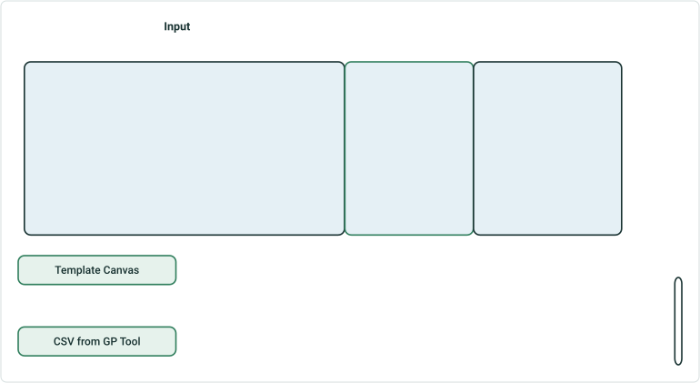

| RouteID | Length |
| --- | --- |
| R1 | 12.000 |

CSV from GP Tool

| County Name | Length |
| --- | --- |
| Clark | 6.500 |
| Lewis | 3.000 |
| Placer | 2.500 |

If no boundary layer is chosen, then
If  boundary layer is chosen, then


## Slide 7

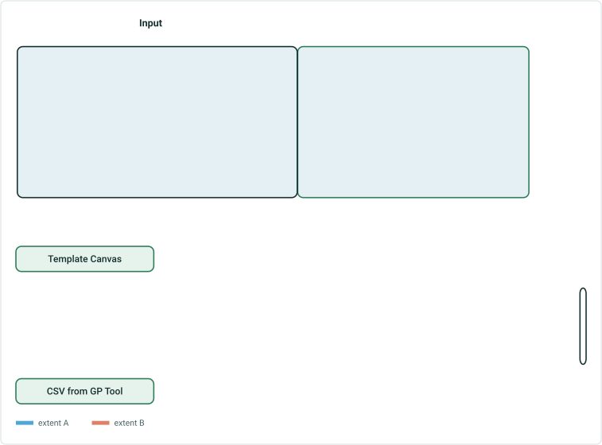

TestCase2 – Summarize by Line Network –  (no summary field and no length field). For this case, the GP parameters Boundary layer and Summary field show up .  If nothing is provided, then the mileage will be summarized route wise. (Add an output containing countywise summary)
CSV from GP Tool

When no summary or length name is provided in the template

 

## Slide 8

TestCase3 – Summarize by Line Network –  Summary Field  - Line name , no length field (enhancement)
CSV from GP Tool


| Summarize by / summary field |
| --- |
| Network/Line Name |

| Line Name | Length |
| --- | --- |
| L1 | 8.000 |
| L2 | 4.000 |

Line Name , Length
L1 , 8.000
L2 , 4.000

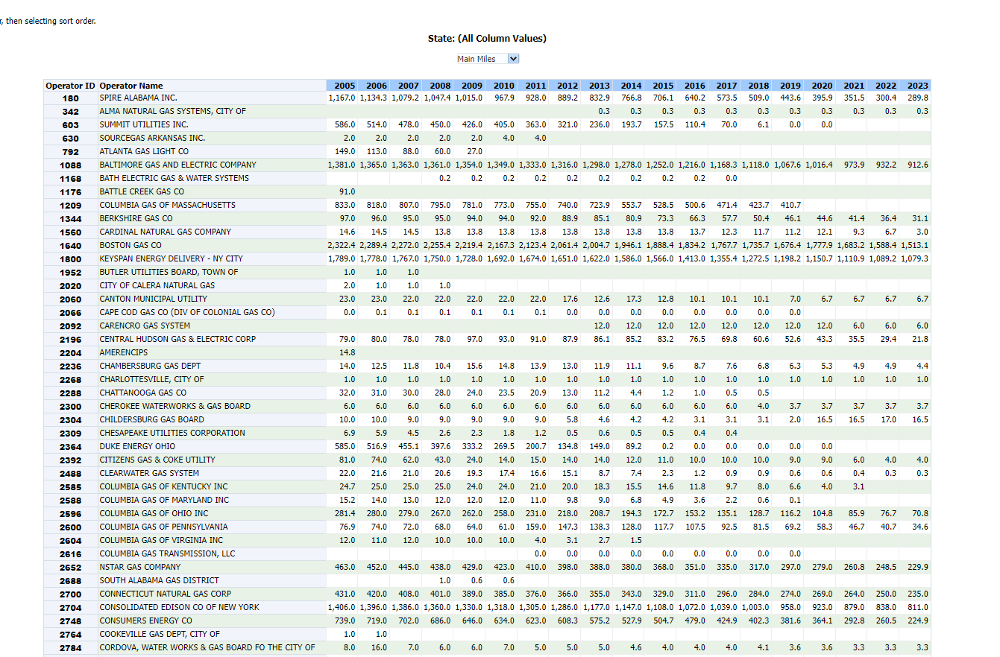

## Slide 9

TestCase4 – Summarize by  Polygon No length field – Nonline network

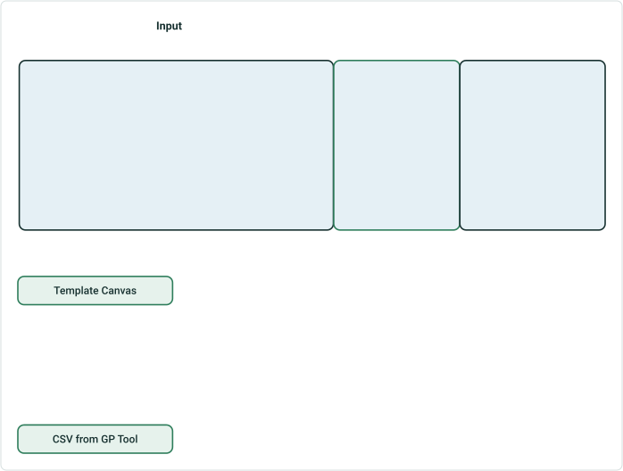

| Summarize by / summary field |
| --- |
| County/ Name |

| Name | Length |
| --- | --- |
| Clark | 6.500 |
| Lewis | 3.000 |
| Place | 2.500 |

CSV from GP Tool
The heading for the output in the csv will come from the field names.
Name , Length
Clark , 6.500
Lewis , 3.000
Place , 2.500
RH Sample Report(similar ones with/without the same length fields)

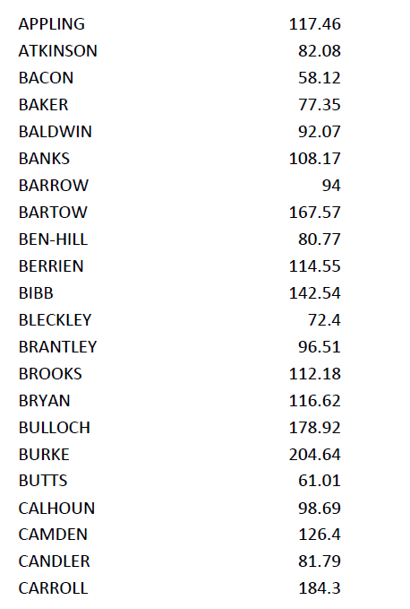 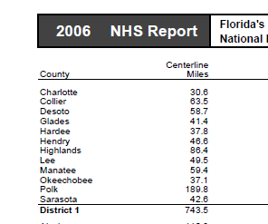 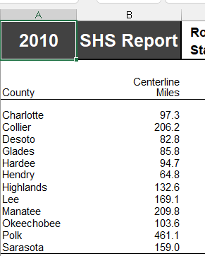

## Slide 10

TestCase5 – Summarize by Line Network –  Summary Field  - County , no length field
CSV from GP Tool


| Summarize by / summary field |
| --- |
| County/ County |

County , Length
Clark , 6.500
Lewis , 5.500
RH Sample Report(similar ones with/without the same length fields)

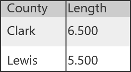 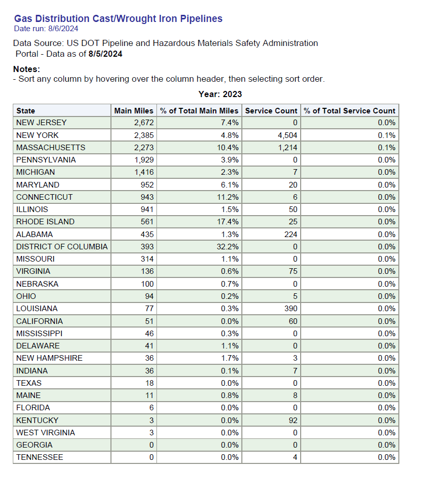

## Slide 11

TestCase7 – Summarize by  Polygon No length field, few polygons are already chosen in the template


| Summarize by/summary field |
| --- |
| County / Name |
| Clark |
| Lewis |

| Name | Length |
| --- | --- |
| Clark | 6.500 |
| Lewis | 3.000 |

CSV from GP Tool
Name, Length
Clark ,  6.500
Lewis , 3.000

## Slide 12

TestCase8 –No Summary field only length field -  Summary will be route wise

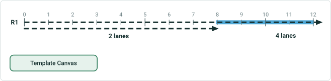

| Summary Field (Network) | Length Field (No of Lanes) |  |
| --- | --- | --- |
| Mileage | 2 lanes Miles | 4 lanes Miles |


| RouteID | 2 lanes Miles | 4 lanes Miles |
| --- | --- | --- |
| R1 | 8.000 | 4.000 |

CSV from GP Tool
The length fields are from the unique values for number of lanes attribute field from Lane event layer.
RouteID , 2 lanes Miles , 4 lanes Miles
R1  , 8.000 , 4.000

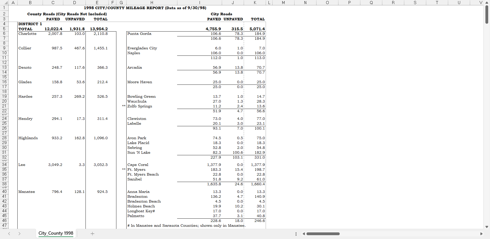

## Slide 13

TestCase9 –Summarize by LRS event(functional class)


| Summarize by/ summary field |
| --- |
| Functional Class/Class |

| Class | Length |
| --- | --- |
| Interstate | 8.000 |
| Arterial | 4.000 |

CSV from GP Tool
Class , Length
Interstate , 8.000
Arterial , 4.000

## Slide 14

TestCase10 – Summarize by polygon and length (Toll)

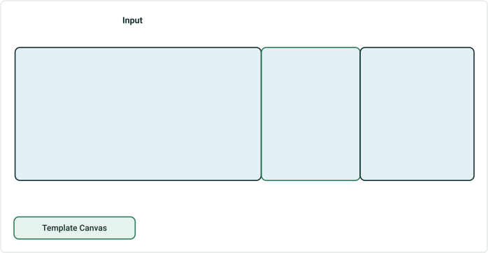

| Summarize by/ summary field | Length Field (Toll event) |
| --- | --- |
| County/Name | Toll Miles |

| Name | Toll Miles |
| --- | --- |
| Clark | 4.000 |
| Lewis | 1.000 |
| Placer | 0.000 |

CSV from GP Tool
The length fields is Toll event layer
Name , Toll Miles
Clark , 4.000
Lewis , 1.000
Placer , 0.000

## Slide 15

TestCase10a – Summarize by polygon and length (Functional Class)


| Summarize by/ summary field | Length Field (Functional Class) |  |
| --- | --- | --- |
| County/Name | Interstate | Arterial |


| Name | Interstate | Arterial |
| --- | --- | --- |
| Clark | 6.5 |  |
| Lewis | 1.5 | 1.5 |
| Placer | 0.000 | 2.5 |

CSV from GP Tool
The length fields is Toll event layer

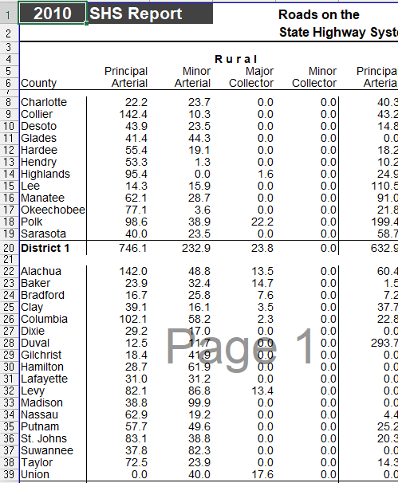

## Slide 16

TestCase11 – Summarize by LRS Event(functional class) and length field  (Toll )


| Summarize by/ summary field | Length Field (Toll event) |
| --- | --- |
| Functional Class/Class | Toll Miles |

| Class | Toll Miles |
| --- | --- |
| Interstate | 5.000 |
| Principal Arterial - Freeway | 1.000 |
| Principal Arterial – other | 0.000 |
| Minor Arterial | 0.000 |
| Major Collector | 0.000 |
| Minor Collector | 0.000 |
| Local | 0.000 |

CSV from GP Tool
The length fields is Toll event layer
Class, Toll Miles
Interstate , 5.000
Principal Arterial-Freeway , 1.000
Principal Arterial - Other , 0.000
Minor Arterial, 0.000
Major Collector, 0.000
Minor Collector, 0.000
Local, 0.000

## Slide 17

TestCase11a. – Summarize by LRS Event(functional class) and length field  (Toll )


| Summarize by/ summary field | Length Field (Toll event) |
| --- | --- |
| Functional Class/Class | Network |

| Class | Length |
| --- | --- |
| Interstate | 8.000 |
| Principal Arterial - Freeway | 4.000 |

CSV from GP Tool
The length fields is network  layer
Class, Toll Miles
Interstate , 8.000
Principal Arterial-Freeway , 4.000
RH Sample Report(similar ones with/without the same length fields)

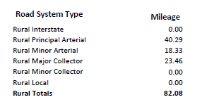

## Slide 18

TestCase12 – Summarize by LRS Event(functional class) and length fields   (Toll , Guardrail)


| Summarize by/ summary field | Length Field |  |
| --- | --- | --- |
| Functional Class/Class | Toll | Guardrail |

| Class | Toll | Guardrail |
| --- | --- | --- |
| Interstate | 5.000 | 3.000 |
| Principal Arterial - Freeway | 1.000 | 2.000 |
| Principal Arterial – other | 0.000 | 0.000 |
| Minor Arterial | 0.000 | 0.000 |
| Major Collector | 0.000 | 0.000 |
| Minor Collector | 0.000 | 0.000 |
| Local | 0.000 | 0.000 |

CSV from GP Tool
The length fields is Toll event layer and Guardrail event layer
Class, Toll, Guardrail
Interstate , 5.000, 3.000
Principal Arterial-Freeway, 1.000, 2.000
Principal Arterial - Other, 0.000, 0.000
Minor Arterial, 0.000, 0.000
Major Collector, 0.000, 0.000
Minor Collector, 0.000, 0.000
Local, 0.000, 0.000

## Slide 19

Test Case 13  – Summarize by LRS Event(functional class) and length fields   (Toll , Guardrail ).  Exclude null values in the GP tool


| Summarize by/ summary field | Length Field |  |
| --- | --- | --- |
| Functional Class/Class | Toll | Guardrail |

| Class | Toll | Guardrail |
| --- | --- | --- |
| Interstate | 5.000 | 3.000 |
| Principal Arterial - Freeway | 1.000 | 2.000 |

CSV from GP Tool
The length fields is Toll event layer and Guardrail event layer
Class, Toll, Guardrail
Interstate , 5.000, 3.000
Principal Arterial-Freeway, 1.000, 2.000
Principal Arterial - Other, 0.000, 0.000

## Slide 20

Test Case 14  – Summarize by LRS Event(Rural urban) and length fields  (mileage(network) , lanes )

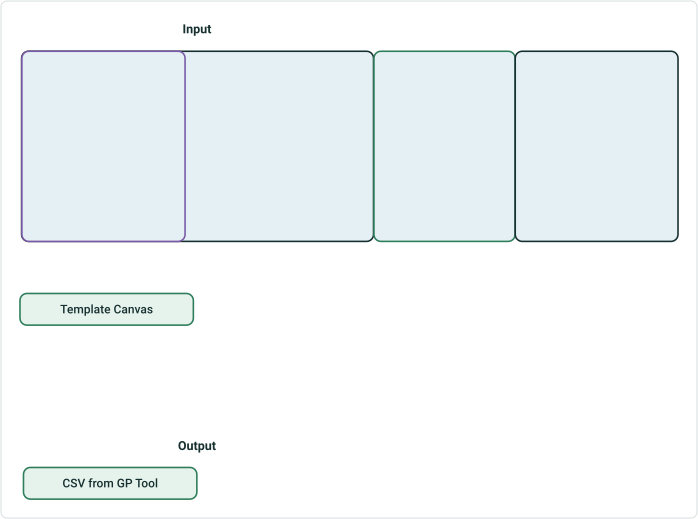

| Summarize by/ summary field | Length Field |  |  |
| --- | --- | --- | --- |
| Rural Urban/Rural urban | Network | Functionclass –Interstate | Functional class - Freeway |

| Rural Urban | Length | Inter State | Freeway |
| --- | --- | --- | --- |
| 0 - outside urban_outside corporation(Rural) | 2.500 | 2.500 | 0.000 |
| 1 - Inside urban_outside_corporation(urban) | 4.000 | 4.000 | 0.000 |
| 2- Inside urban_Outside_Corporation (urban) | 1.500 | 1.500 | 0.000 |
| 2- Inside urban_Outside_Corporation (urban) | 1.500 | 0.000 | 1.500 |
| 3 - outside _ urban_Inside corporation(Rural) | 2.500 | 0.000 | 2.500 |

CSV from GP Tool

RH Sample Report(similar ones with/without the same length fields)
Rural Urban, Length, Inter State, Freeway
0-outside urban_outside corporation(Rural), 2.500, 2.500, 0.000
1-outside urban_outside corporation(Rural), 4.000, 4.000, 0.000
2-Inside urban_Outside_Corporation(urban), 1.500, 1.500, 0.000
2-Inside urban_Outside_Corporation(urban), 1.500, 0.000, 1.500
3-outside_urban_Inside corporation(Rural), 2.500, 0.000, 2.500

## Slide 21

TestCase15 – Summarize by LRS Event(functional class) and length fields  ( county field from network)

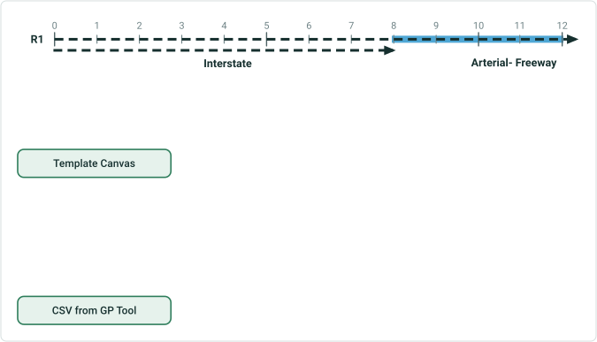

| Summarize by/ summary field | Length Field (County Name from network) |  |  |
| --- | --- | --- | --- |
| Functional Class/Class | Clark | Lewis | Placer |

| Class | Clark | Lewis | Placer |
| --- | --- | --- | --- |
| Interstate | 6.500 | 2.500 | 0.000 |
| Principal Arterial - Freeway | 0.000 | 2.500 | 2.500 |
| Principal Arterial – other | 0.000 | 0.000 | 0.000 |
| Minor Arterial | 0.000 | 0.000 | 0.000 |
| Major Collector | 0.000 | 0.000 | 0.000 |
| Minor Collector | 0.000 | 0.000 | 0.000 |
| Local | 0.000 | 0.000 | 0.000 |

CSV from GP Tool
Class, Clark, Lewis, Placer
Interstate, 6.500, 2.500, 0.000
Principal Arterial -Freeway, 0.000, 2.500, 2.500
Principal Arterial - other, 0.000, 0.000, 0.000
Minor Arterial, 0.000, 0.000, 0.000
Major Collector, 0.000, 0.000, 0.000
Minor Collector, 0.000, 0.000, 0.000
Local, 0.000, 0.000, 0.000

## Slide 22

TestCase16 – Summarize by LRS Event and length fields   ( Pavement condition & Functional class)

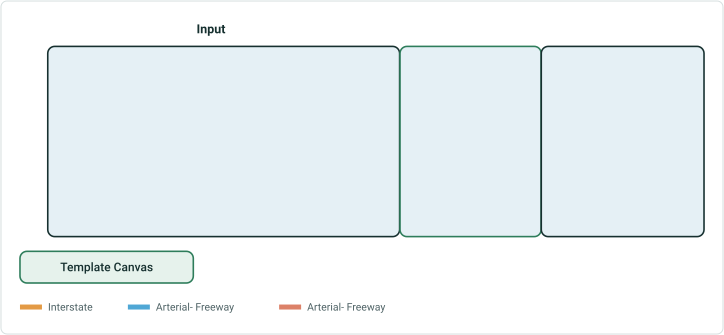

| Summarize by/ summary field | Length Field (Pavement condition & Functional Class) |  |  |  |  |  |
| --- | --- | --- | --- | --- | --- | --- |
| Speed Limit /Speed | IRI Rating (>220) miles | IRI Rating (120-170) miles | IRI Rating (60 -119) miles | IRI Rating (<60) miles | FunCls Interstate miles | FunCls – Arterial Freeway miles |

| Speed | IRI Rating (>220) miles | IRI Rating (120-170) miles | IRI Rating (60 -119) miles | IRI Rating (<60) miles | FunCls Interstate miles | FunCls – Arterial Freeway miles |
| --- | --- | --- | --- | --- | --- | --- |
| 65 mph | 3.500 | 3.000 | 0.000 | 0.000 | 6.500 | 0.000 |
| 45 mph | 0.500 | 1.000 | 0.000 | 0.500 | 1.500 | 1.500 |
| 25 mph | 0.000 | 0.000 | 1.500 | 1.000 | 0.000 | 2.500 |

CSV from GP Tool
Speed, IRI Rating(>220) miles, IRI Rating(120-170) miles, IRI Rating(60 -119) miles, IRI Rating(<60)miles, FunCls Interstate miles, FunCls – Arterial Freeway miles
65 mph, 3.500, 3.000, 0.000, 0.000, 6.500, 0.000
45 mph, 0.500, 1.000, 0.000, 0.500, 1.500, 1.500
25 mph, 0.000, 0.000, 0.000, 0.000, 0.000, 0.000
<40 mph, 0.000, 0.000, 1.500, 1.000, 0.000, 2.500

## Slide 23

Test Case 18  - County wise summary on mileage with federal Aid mileage as length

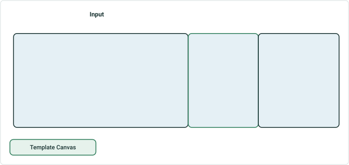

| Summarize by/ summary field | Length Field |  |  |  |
| --- | --- | --- | --- | --- |
| County /County Name | Fed Aid– Non-Interstate | Fed Aid – Rural on | Fed Aid –Urban on | Fed Aid -Interstate |

| County Name | Fed Aid-Non-Interstate | Fed Aid-Rural On | Fed Aid-Urban On | Fed Aid- Inter State |
| --- | --- | --- | --- | --- |
| Clark | 0.000 | 0.000 | 0.000 | 6.500 |
| Lewis | 1.500 | 0.000 | 0.000 | 1.500 |
| Placer | 2.500 | 0.000 | 0.000 | 0.000 |

CSV from GP Tool
RH Sample Report(similar ones with/without the same length fields)
County Name, FedAid-InterState, FedAid-Rural on, FedAid- Urban on , FedAid- Interstate
Clark, 0.000, 0.000, 0.000, 6.500
Lewis, 1.500, 0.000, 0.000, 1.500
Placer, 2.500, 0.000, 0.000, 0.000

## Slide 24

Test Case 19  - Overlapping Events – Speed Limit – For mileage both the events will be considered.

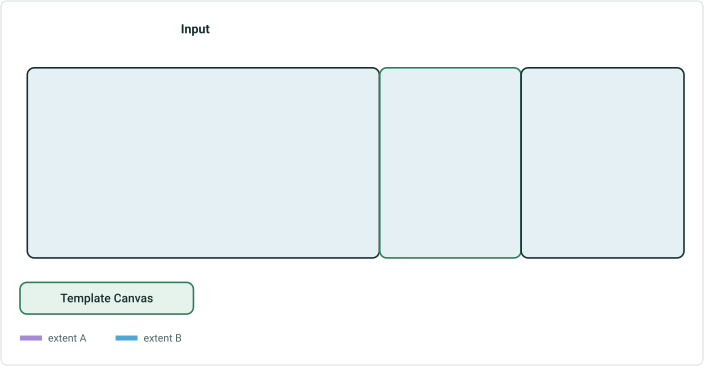

| Summarize by/ summary field | Length Field (Speed Limit) |  |  |  |
| --- | --- | --- | --- | --- |
| County /Name | >60 | 50 -60 | 40 – 50 | <40 |

| Name | >60 | 50 -60 | 40 -50 | <40 |
| --- | --- | --- | --- | --- |
| Clark | 5.000 | 0.000 | 1.500 | 0.000 |
| Lewis | 0.000 | 0.000 | 3.000 | 1.500 |
| Placer | 0.000 | 0.000 | 2.500 | 2.500 |

CSV from GP Tool
Name, >60, 50-60, 40-50, >40
Clark, 5.000, 0.000, 1.500, 0.000
Lewis, 0.000, 0.000, 3.000, 1.500
Placer,0.000, 0.000, 2.500, 2.500
 Save a  filter expression for the length fields.

## Slide 25

Test Case 20  - Complex route  Test with variety of complex route  loop , alpha, branch.

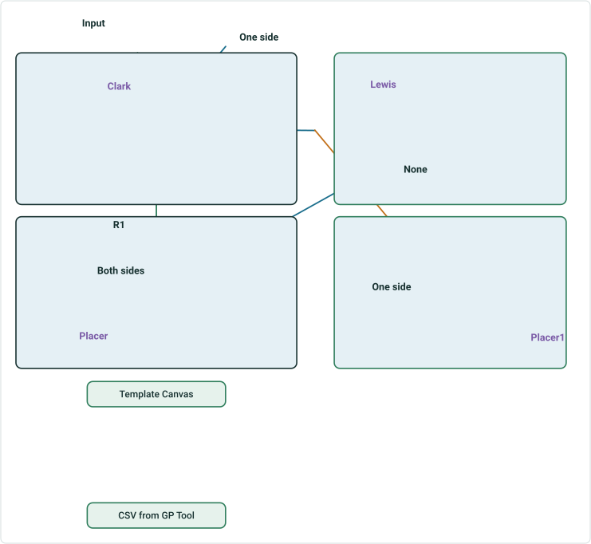

| Summarize by/ summary field | Length Field (Network & parking Event) |  |  |  |
| --- | --- | --- | --- | --- |
| County/Name | Network | Peak Parking Allowed on one side | Peak Parking allowed on both sides | Peak Parking not allowed |

CSV from GP Tool

| Name | Network | Peak Parking Allowed on one side | Peak Parking allowed on both sides | Peak Parking not allowed |
| --- | --- | --- | --- | --- |
| Clark | 0.600 | 0.350 | 0.250 | 0.050 |
| Lewis | 0.350 | 0.200 | 0.000 | 0.150 |
| Placer | 0.440 | 0.190 | 0.250 | 0.000 |
| Placer1 | 0.260 | 0.110 | 0.000 | 0.150 |

Name, Network, Peak parking allowed on one side, Peak parking allowed on both sides, Peak parking not allowed
Clark, 0.600, 0.350, 0.250, 0.050
Lewis, 0.350, 0.200, 0.000, 0.150
Placer, 0.440, 0.190, 0.250, 0.000
Placer1, 0.260, 0.110, 0.000, 0.150

## Slide 26

Test Case 21  - Gapped  route
Test with Multiple gapped routes, test with network with different sets of calibration rules. Get the test data from Claire.

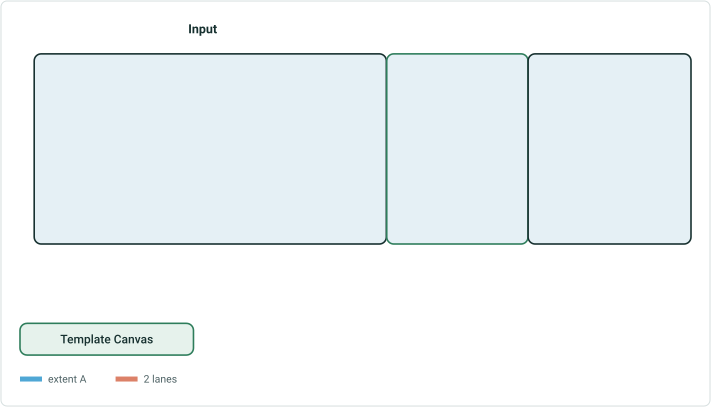

| Summarize by | Length Field (Network/Lanes) |  |  |  |  |
| --- | --- | --- | --- | --- | --- |
| Network | Rural Miles | Urban Miles | 6 lanes | 4 lanes | 2 lanes |

 Save a  SQL query for Lane miles (no of lanes *mileage(ToMeasure - FromMeasure) in template.
CSV from GP Tool
RH Sample Report(similar ones with/without the same length fields)

| RouteID | Rural Miles | Urban Miles | 6 lanes | 4 lanes | 2 lanes |
| --- | --- | --- | --- | --- | --- |
| I-16 | 4.000 | 8.000 | 3.000 | 3.000 | 1.000 |

## Slide 27

Test Case 22  - Time Sliced Scenario

| Summarize by/ summary field | Length Field |  |
| --- | --- | --- |
| Functional Class/Class | Toll Miles | Guardrail Miles |

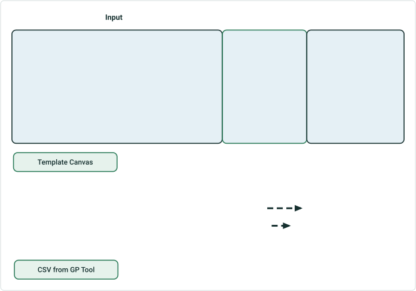

| R1 | 1/1/2000 - Null |
| --- | --- |
| Functional Class | 1/1/2005 – Null |
| Toll | 1/1/2010 – Null |
| Guard Rail | 1/1/2005 -1/1/2020 |

CSV from GP Tool

| Class | Toll Miles | Guardrail Miles |
| --- | --- | --- |

1. Effective Date : 1/1/2003 (warning empty csv )
2. Effective Date : 1/1/2006

| Class | Toll Miles | Guardrail Miles |
| --- | --- | --- |
| Interstate | 5.000 | 2.000 |
| Principal Arterial - Freeway | 1.000 | 2.000 |

| Class | Toll Miles | Guardrail Miles |
| --- | --- | --- |
| Interstate | 0.000 | 2.000 |
| Principal Arterial - Freeway | 0.000 | 2.000 |

| Class | Toll Miles | Guardrail Miles |
| --- | --- | --- |
| Interstate | 5.000 | 0.000 |
| Principal Arterial - Freeway | 1.000 | 0.000 |

3. Effective Date : 1/1/2015
4. Effective Date : 1/1/2020

## Slide 28

Test Case 23  -Spanning Events – Line Network – Countywise – Pipe material Mileage  (Pipes – spanning event )

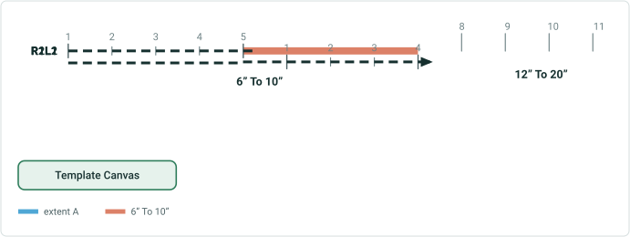

| Summarize by/ summary field | Length Field (Pipes Event – diameter Field) |  |  |  |
| --- | --- | --- | --- | --- |
| Network/Line Name | 2” To 4” | 6” To 10” | 12” To 20” | 24” To 28” |

| Line Name | 2” To 4” | 6” To 10” | 12” To 20” | 24” To 28” |
| --- | --- | --- | --- | --- |
| L1 | 0.000 | 9.000 | 0.000 | 0.000 |
| L2 | 0.000 | 0.000 | 4.000 | 0.000 |

CSV from GP Tool
APR Sample Report(similar ones with/without the same length fields)

## Slide 29

Test Case 24 -Spanning Events – Line Network – Countywise – Pipe material Mileage  (Pipes – spanning event )

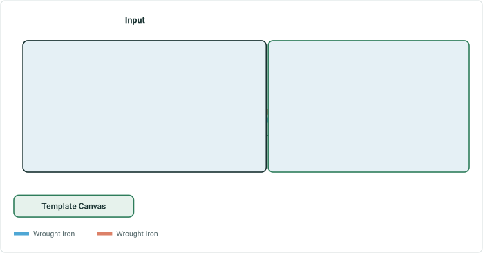

| Summarize by/ summary field | Length Field (Pipes Event – Material Field) |  |  |  |
| --- | --- | --- | --- | --- |
| County /Name | Bare Steel | Coated Steel | Cast Iron or Wrought Iron (Filter expression two unique values) | Copper |

| Name | Bare Steel | Coated Steel | Cast Iron or Wrought Iron | Copper |
| --- | --- | --- | --- | --- |
| Clark | 0.000 | 5.000 | 2.5 | 0.000 |
| Lewis | 0.000 | 0.000 | 5.500 | 0.000 |

CSV from GP Tool

Name, Bare Steel, Coated Steel, Cast Iron/Wrought Iron, Copper
Clark, 0.000, 6.500, 0.000, 0.000
Lewis, 0.000, 0.000, 1.500, 4.000

## Slide 30

Test Case 25  -Spanning Events – Line Network – Countywise – Pipe material Mileage  (Pipes – spanning event) – selecting only route R2L1

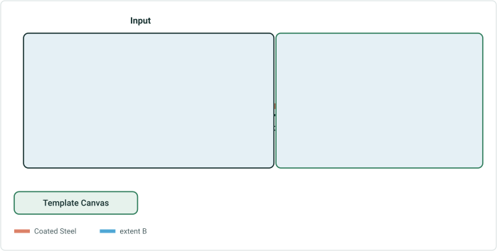

| Summarize by/ summary field | Length Field (Pipes Event – Material Field) |  |  |  |
| --- | --- | --- | --- | --- |
| County /Name | Bare Steel | Coated Steel | Cast Iron | Copper |

| Name | Bare Steel | Coated Steel | Cast Iron | Copper |
| --- | --- | --- | --- | --- |
| Clark | 0.000 | 4.500 | 0.000 | 2.000 |
| Lewis | 0.000 | 3.500 | 2.000 | 0.000 |

CSV from GP Tool

Name, Bare Steel, Coated Steel, Cast Iron/Wrought Iron, Copper
Clark, 0.000, 2.500, 0.000, 0.000
Lewis, 0.000, 0.000, 1.500, 0.000
Only select route R2L1 in the GP tool expand the result to the entire line. For a line network provide for entire line

## Slide 31

Test Case 26  -Spanning Events – Line Network – Countywise – Pipe material Mileage  (Pipes – spanning event) –  selecting only one county.


| Summarize by/ summary field | Length Field (Pipes Event – Material Field) |  |  |  |
| --- | --- | --- | --- | --- |
| County /Name | Bare Steel | Coated Steel | Cast Iron | Copper |
| Clark |  |  |  |  |

| Name | Bare Steel | Coated Steel | Cast Iron | Copper |
| --- | --- | --- | --- | --- |
| Clark | 0.000 | 4.500 | 0.000 | 3.000 |

CSV from GP Tool

Name, Bare Steel, Coated Steel, Cast Iron/Wrought Iron, Copper
Clark, 0.000, 2.500, 0.000, 0.000

## Slide 32

Test Case 26  - Derived Route Network
CSV from GP Tool

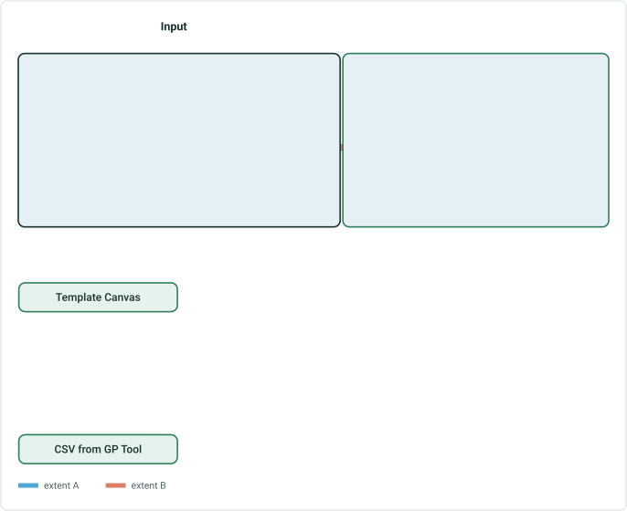

| Summarize by/ summary field | Length Field |
| --- | --- |
| County/Name | Mileage |

| County | Mileage |
| --- | --- |
| Clark | 6.500 |
| Lewis | 5.500 |

## Slide 33

Cases   for multiple summary field user stories

## Slide 34

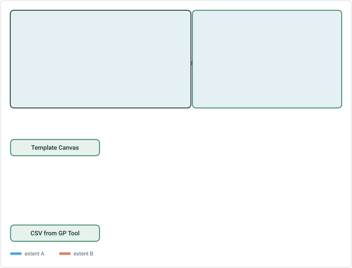

TestCase6 – Summarize by Line Network –  Two Summary Fields from two layers  - County (county boundary), Line name (LRS network)  and  no length field(Not possible for this userstory)
CSV from GP Tool

County ,Line, Length
Clark , L1, 6.508
Lewis ,L1, 1.403
Lewis, L2, 4.000

## Slide 35

TestCase17 – Summarize Functional Class (LRS event)  - Length (State wise , countywise, city wise(nor LRS layers fields)) – Exclude null rows. This is multiple boundary layers   Not possible

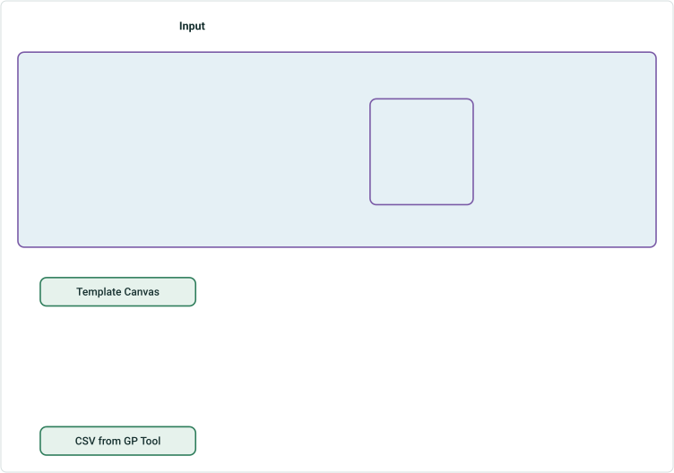

| Summarize by/ summary field | Length Field (Fields from different non LRS layers) |  |  |
| --- | --- | --- | --- |
| Functional Class/Class | Name (State) | Name (County) | Name (City) |


| Functional Class | State | County |  |  | City |
| --- | --- | --- | --- | --- | --- |
|  |  | Clark | Lewis | Placer |  |
| Interstate | 8 | 6.5 | 2.5 |  | 1.25 |
| Principal Arterial - Freeway | 4 | 0 | 2.5 | 2.5 | 1.25 |

CSV from GP Tool

RH Sample Report(similar ones with/without the same length fields)

## Slide 36


These Reports are possible if we have multiple summary fields.

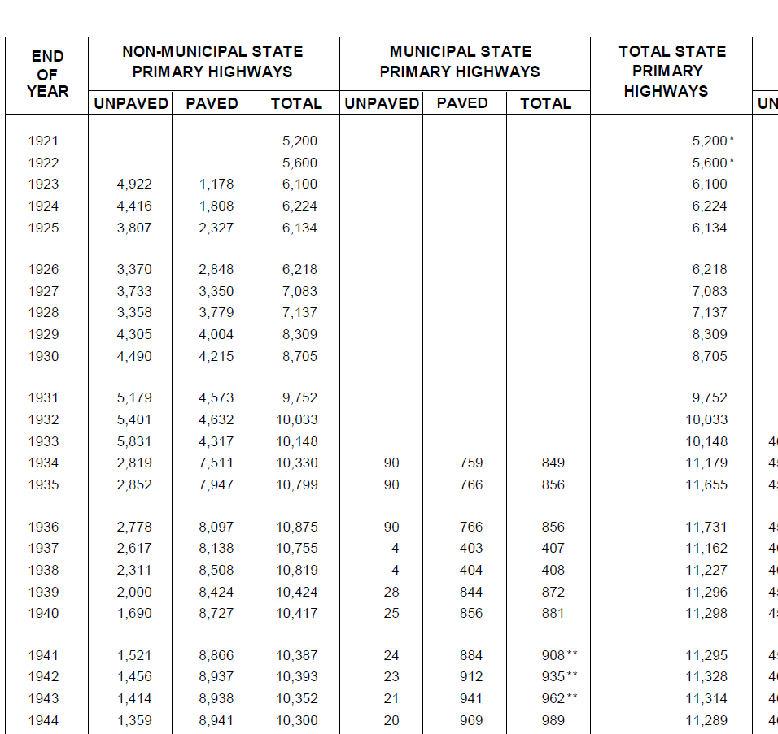

## Slide 37

## Slide 38


 
