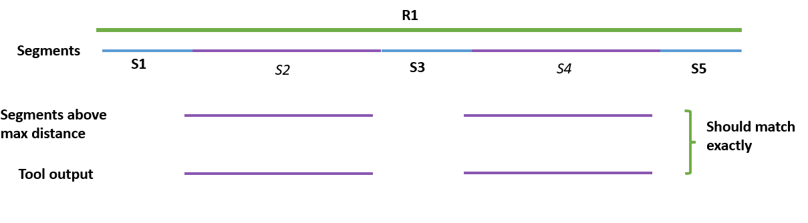

# Identify Routes with Vertex Spacing Issues – Test Plan

|   |   |
| --- | --- |
| **Kind** | Test Plan · Pro |
| **Release** | — |
| **Product** | Roads & Highways · Pipeline Referencing · Utility Network |
| **Source** | [Identify.Routes.with.Vertex.Spacing.Issues_TestPlan.docx](<https://esriis.sharepoint.com/sites/LocationReferencing/Shared%20Documents/General/Test%20Plans/Identify.Routes.with.Vertex.Spacing.Issues_TestPlan.docx>) |
| **Edited** | 2023-05-03 23:25 by Lakshmi Ananthanarayanan |
| **Extracted** | 2026-09-04 · lane `xmlstrip` |

<!-- metadata
```yaml
title: "Identify Routes with Vertex Spacing Issues – Test Plan"
source_file: "Identify.Routes.with.Vertex.Spacing.Issues_TestPlan.docx"
source_url: "https://esriis.sharepoint.com/sites/LocationReferencing/Shared%20Documents/General/Test%20Plans/Identify.Routes.with.Vertex.Spacing.Issues_TestPlan.docx"
doc_id: 571
doc_kind: "Test Plan"
surface: "Pro"
doc_revision: ""
target_release: ""
pe: ""
dev: ""
author: "Lakshmi Ananthanarayanan"
last_edited_by: "Lakshmi Ananthanarayanan"
last_edited: "2023-05-03T23:25:00Z"
extracted: 2026-09-04
extraction_lane: xmlstrip
prompt_version: "v2.0.2"
keywords: ["vertex spacing", "route segmentation", "sparse vertices", "feature class", "pipeline data", "branch versioned", "traditional versioned"]
tools: []
products: ["Roads & Highways", "Pipeline Referencing", "Utility Network"]
issues: []
related: [{"doc":591,"file":"identify-routes-with-vertex-spacing-issues__doc591.md","s":6.065},{"doc":536,"file":"append-routes-sparse-vertex-check-user-story__doc536.md","s":4.71},{"doc":567,"file":"append-routes-load-routes-by-route-name-test-plan__doc567.md","s":3.292},{"doc":137,"file":"append-routes-allow-partial-loading-test-plan__doc137.md","s":3.26},{"doc":468,"file":"densify-and-regenerate-lrs-routes-tool-test-plan__doc468.md","s":2.773}]
```
-->

## Summary

Test plan for identifying routes with sparse vertex spacing issues in various network types and data sources. It includes verification of output logs, feature classes, and error handling for invalid inputs. The plan covers testing in different environments including branch and traditional versioned SDE, file geodatabases, and pipeline data.

## Related documents

<!-- related:begin -->
- [Identify Routes with Vertex Spacing Issues](<https://esriis.sharepoint.com/sites/lrsworkspace/LRS Doc Index/User Stories/identify-routes-with-vertex-spacing-issues__doc591.md>) — similar text 0.28 · 5 title words · 4 filename words · same surface <!-- rel:591 -->
- [Append Routes Sparse Vertex Check User Story](<https://esriis.sharepoint.com/sites/lrsworkspace/LRS%20Doc%20Index/User%20Stories/append-routes-sparse-vertex-check-user-story__doc536.md>) — similar text 0.34 · 2 title words · 2 filename words · same surface <!-- rel:536 -->
- [Append Routes: Load Routes by Route Name Test Plan](<https://esriis.sharepoint.com/sites/lrsworkspace/LRS Doc Index/Test Plans/append-routes-load-routes-by-route-name-test-plan__doc567.md>) — similar text 0.17 · 1 title word · 1 filename word · same kind/surface/folder <!-- rel:567 -->
- [Append Routes: Allow Partial Loading Test Plan](<https://esriis.sharepoint.com/sites/lrsworkspace/LRS Doc Index/Test Plans/append-routes-allow-partial-loading-test-plan__doc137.md>) — similar text 0.07 · 1 title word · 1 filename word · same kind/surface/folder <!-- rel:137 -->
- [Densify and Regenerate LRS Routes Tool – Test Plan](<https://esriis.sharepoint.com/sites/lrsworkspace/LRS Doc Index/Test Plans/densify-and-regenerate-lrs-routes-tool-test-plan__doc468.md>) — similar text 0.23 · 1 title word · same kind/surface/folder <!-- rel:468 -->
<!-- related:end -->

<!-- docs:begin -->
## Esri documentation

[View utility network feature class properties](https://doc.esri.com/en/arcgis-pro/latest/help/production/location-referencing-pipelines/view-utility-network-feature-class-properties.html)
<!-- docs:end -->

---

Identify Routes with Vertex Spacing Issues – Test Plan
Test Data:

- RH, UN, UN+APR
- Branch versioned sde, Traditional versioned sde, Fgdb
- LRS network, Non LRS Feature class
Testing in sde (branch versioned): Pipeline data – Colonial Data
Testing in sde (traditional versioned) Another pipeline data
Testing in sde (branch versioned) – APR+UN (test data)
Testing in Fgdb:  Roads Data

Verification:
Verify the output log file containing information about the number of input records, number of routes having sparse vertices based on current tolerance. It should also contain recommendations based on 1 cm, 2 cm, 3 cm and 10 cm tolerance.
Verify the output file in the same folder as the output gdb /sde.
Verify the output Feature class containing the segments of the input feature class which have sparse vertices.
Verify the output segments are created correctly.
Verify in the output the number of routes in the log file matches with the number of unique routeIDs in the feature class output.
Verify the output FC has the same fields as the input.

Test cases:
Test in different types of networks – line network, nonline network. - completed
Test any non LRS Feature class can be used as an input to this tool. - completed
Test in both Pro 3.1 and 3.2 - completed.
Test the output FC can be created in Fgdb / sde/ can be created in the same input Fgdb or sde - completed.
Test in the python script- completed.
Test in model builder with chaining
Create routes with complex shapes & Z values and verify the tool output.
Negative cases
Wrong input dataset – does not all the point FC as input - completed.
Test in projected data - the tool should not accept the projected data. - completed
Test in FS – Tool does not support FS data. - completed
Verify the error messages in all these cases. - completed
Verify by checking it does not require advanced license of ArcGIS pro. - completed.
Automation not required.
Pro documentation will be done with this issue.
Git hub documentation will be done along with other GCS tools.
Verification of the correctness of the output segmentation
To ensure that the tool has created the output of all the records (route segments) which has segment length more than the maximum distance specified in the output log file.
Segment the entire route network by splitting them at the vertices and figure out the line segments which are above the maximum distance between the vertices mentioned in the log and compare it with the tool output.  Both should match exactly.


