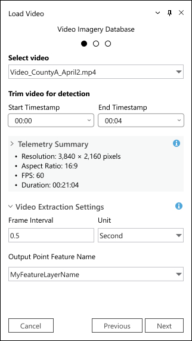
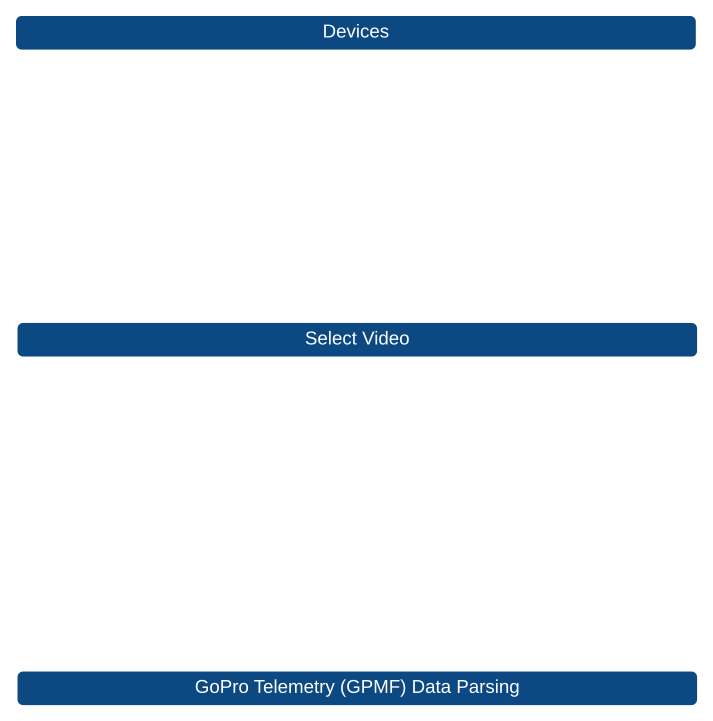
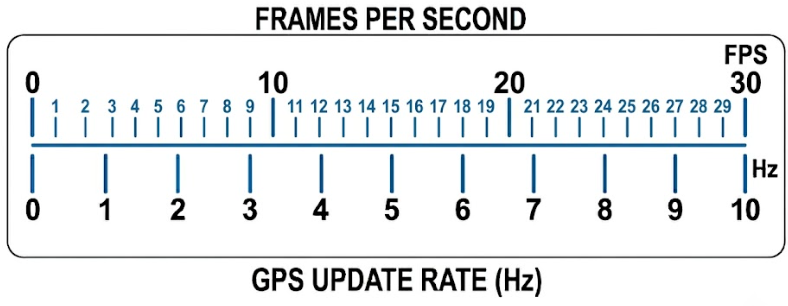
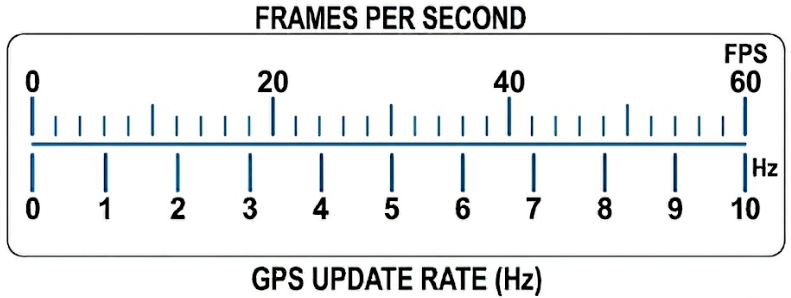
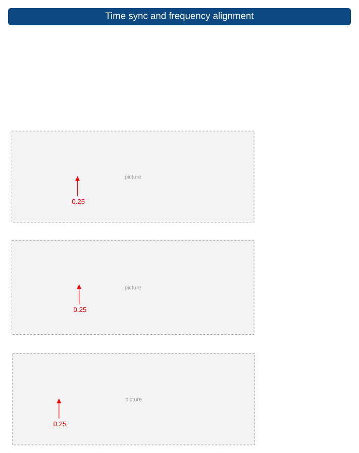
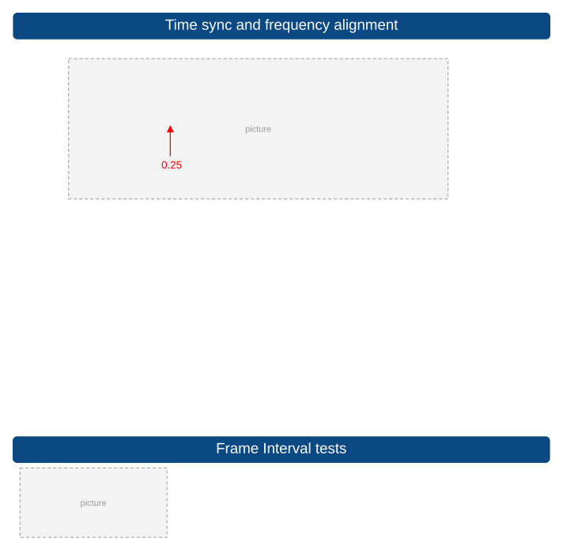
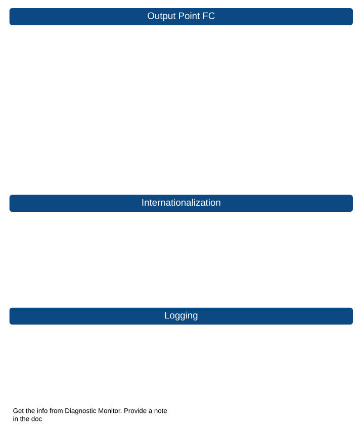

# Load Video Test Plan

| Field | Value |
| --- | --- |
| **Doc** | 19 · Test Plan · Pro |
| **Product** | — |
| **Release** | — |
| **Issues** | — |
| **Source** | [LoadVideo_TestPlan_3126.pptx](<https://esriis.sharepoint.com/sites/LocationReferencing/Shared%20Documents/General/Test%20Plans/LoadVideo_TestPlan_3126.pptx>) |
| **People** | author Rahul Rakshit · PE — · dev — |
| **Edited** | 2026-06-22 23:47 by Rahul Rakshit |
| **Extracted** | 2026-09-04 · lane xmlstrip · format 3.0 · prompt v2.0.2 |
| **Keywords** | load video · mp4 · gopro telemetry · frame timestamp · point feature · telemetry parsing · output schema · error handling |
| **Tools** | — |

## Summary

Test plan for the Load Video tool available on the LRS ribbon that processes a single .mp4 video file with embedded GoPro telemetry. It covers input validation, telemetry parsing, frame timestamp generation, output schema conformance, error handling, performance, and internationalization requirements.

## Related documents

<!-- related:begin -->
- [Detect Objects Test Plan](<https://esriis.sharepoint.com/sites/lrsworkspace/LRS Doc Index/Test Plans/detect-objects.md>) — similar text 0.29 · same kind/surface/folder <!-- rel:10 s=4.836 -->
- [Camera Calibration Test Plan](<https://esriis.sharepoint.com/sites/lrsworkspace/LRS Doc Index/Test Plans/camera-calibration.md>) — similar text 0.31 · same kind/folder <!-- rel:8 s=4.183 -->
- [Transform LRS Data GP tool – Test Plan](<https://esriis.sharepoint.com/sites/lrsworkspace/LRS Doc Index/Test Plans/5742-transform-lrs-data-gp.md>) — similar text 0.06 · same kind/surface/folder <!-- rel:372 s=2.837 -->
- [Transform LRS Data GP tool: Summarize by polygon boundaries – Test Plan](<https://esriis.sharepoint.com/sites/lrsworkspace/LRS Doc Index/Test Plans/5744-transform-lrs-data-gp-summarize-by-polygon-boundaries.md>) — similar text 0.05 · same kind/surface/folder <!-- rel:359 s=2.61 -->
- [Add Point Event to Dominant Route in ArcGIS Pro – Test Plan](<https://esriis.sharepoint.com/sites/lrsworkspace/LRS Doc Index/Test Plans/3916-add-point-event-to-dominant-route-in-pro.md>) — similar text 0.04 · same kind/surface/folder <!-- rel:360 s=2.603 -->
<!-- related:end -->

<!-- docs:begin -->
## Esri documentation

[Event editing using the attribute table](https://doc.esri.com/en/arcgis-pro/latest/help/production/location-referencing-pipelines/event-editing-using-the-attribute-table.html)

_No page matched:_ [experience builder](https://www.google.com/search?q=%22experience%20builder%22+site%3Adoc.esri.com)
<!-- docs:end -->

---

## Slide 1

## Slide 2 — Sanity Testing

- The tool is available only from the LRS ribbon when the user has the required LRS license.
- The tool accepts exactly one .mp4 input file.
- Unsupported file types and multiple file selections are blocked.
- 360/equirectangular videos are detected and rejected.
- GoPro GPMF telemetry is correctly detected, parsed, normalized, and validated.
- Latitude, longitude, timestamp, and optional altitude are correctly extracted.
- Invalid telemetry samples are discarded.
- Frame timestamps are generated using the configured frame interval, start timestamp, and end timestamp.
- Frame locations are calculated deterministically.
- Point features are created with the required schema.
- The workflow fails clearly when outputs cannot be completed for all points.
- Performance, reliability, logging, and localization requirements are met.
Licensing

| Enterprise License with LR | Result |
| --- | --- |
| Professional Plus | Works |
| Professional | Works |
| Creator | Works |

## Slide 3

Select Video

| Input | Output |
| --- | --- |
| Non-video file | Error message |
| Non existing file | Error message |
| No value | Show error |
| Multiple MP4 files selected | Error: Select a single MP4 file |
| Input a `.mov`, `.avi`, or `. mkv ` file (unsupported) | Error: Unsupported file type. Only MP4 is supported |
| 360-degree MP4 | Error: 360 video is not supported |
| Valid Framed MP4 | File Accepted |
| Value provided> Next Page 2>Provide inputs in Page 2>Previous | The inputs provided for video should remain same |
| Network location | works |

Devices

| Device | GPS Data Format |
| --- | --- |
| GoPro Black 13 | GPS9 |
| GoPro Black 11 | GPS9 |
| GoPro Max | GPS9 |
| GoPro Max 2 | GPS9 |
| GoPro Black 10 | GPS5 |
| GoPro 9 | GPS5 |
| GoPro 8 | GPS5 |

GoPro Telemetry (GPMF) Data Parsing

| Input | Output |
| --- | --- |
| Missing Telemetry | Error: No embedded GPS telemetry detected |
| Corrupt Stream | Error: Telemetry could not be read from video |
| MP4 containing non-GoPro embedded telemetry instead of GPMF | Error: Unsupported telemetry format. Only GoPro telemetry is supported. |
| GoPro source file with valid GPMF stream | File Accepted. Non GoPro will error out. |

## Slide 4 — GoPro 13 Black Profiles

| Resolution | Pixel Dimensions | Aspect Ratio | Frame Rate (FPS) |
| --- | --- | --- | --- |
| 5.3K (Full Frame) | 5312×4648 | 8:7 | 30 |
| 5.3K (Full Frame) | 5312×4648 | 8:7 | 25 |
| 5.3K (Full Frame) | 5312×4648 | 8:7 | 24 |
| 5.3K (Widescreen) | 5312×2988 | 16:9 | 60 |
| 5.3K (Widescreen) | 5312×2988 | 16:9 | 50 |
| 5.3K (Widescreen) | 5312×2988 | 16:9 | 30 |
| 5.3K (Widescreen) | 5312×2988 | 16:9 | 25 |
| 5.3K (Widescreen) | 5312×2988 | 16:9 | 24 |
| 4K (Full Frame) | 4000×3000 | 8:7 | 60 |
| 4K (Full Frame) | 4000×3000 | 8:7 | 50 |
| 4K (Full Frame) | 4000×3000 | 8:7 | 30 |
| 4K (Full Frame) | 4000×3000 | 8:7 | 25 |
| 4K (Full Frame) | 4000×3000 | 8:7 | 24 |
| 4K (Widescreen) | 3840×2160 | 16:9 | 120 |
| 4K (Widescreen) | 3840×2160 | 16:9 | 100 |
| 4K (Widescreen) | 3840×2160 | 16:9 | 60 |
| 4K (Widescreen) | 3840×2160 | 16:9 | 50 |
| 4K (Widescreen) | 3840×2160 | 16:9 | 30 |
| 4K (Widescreen) | 3840×2160 | 16:9 | 25 |
| 4K (Widescreen) | 3840×2160 | 16:9 | 24 |
| 4K (Vertical) | 2160×3840 | 9:16 | 60 |
| 4K (Vertical) | 2160×3840 | 9:16 | 50 |
| 4K (Vertical) | 2160×3840 | 9:16 | 30 |
| 4K (Vertical) | 2160×3840 | 9:16 | 25 |
| 2.7K (Tall) | 2704×2028 | 4:3 | 120 |
| 2.7K (Tall) | 2704×2028 | 4:3 | 100 |
| 2.7K (Widescreen) | 2704×1520 | 16:9 | 240 |
| 2.7K (Widescreen) | 2704×1520 | 16:9 | 200 |
| 1080p (Widescreen) | 1920×1080 | 16:9 | 240 |
| 1080p (Widescreen) | 1920×1080 | 16:9 | 200 |
| 1080p (Widescreen) | 1920×1080 | 16:9 | 120 |
| 1080p (Widescreen) | 1920×1080 | 16:9 | 100 |
| 1080p (Widescreen) | 1920×1080 | 16:9 | 60 |
| 1080p (Widescreen) | 1920×1080 | 16:9 | 50 |
| 1080p (Widescreen) | 1920×1080 | 16:9 | 30 |
| 1080p (Widescreen) | 1920×1080 | 16:9 | 25 |
| 1080p (Widescreen) | 1920×1080 | 16:9 | 24 |
| 1080p (Vertical) | 1080×1920 | 9:16 | 60 |
| 1080p (Vertical) | 1080×1920 | 9:16 | 50 |
| 1080p (Vertical) | 1080×1920 | 9:16 | 30 |
| 1080p (Vertical) | 1080×1920 | 9:16 | 25 |

## Slide 5 — Time sync and frequency alignment

| FPS | GPS Frequency Hz | Frame Interval (Sec) |  |
| --- | --- | --- | --- |
| 24 | 10 | 0.25 | Frequency Discrepancy: Video is 24FPS and GoPro GPS sampling is 10Hz |
| 30 | 10 | 0.25 |  |
| 60 | 10 | 0.25 | Dev to provide the info on logic used and PE to test accordingly. X, Y, Z and orientation fields (HFOV, pitch, roll, heading) must interpolate linearly |
| 120 | 10 | 0.25 |  |

0.25
0.25
0.25

## Slide 6 — Time sync and frequency alignment

0.25

| Input | Output |
| --- | --- |
| Execute the same processing pipeline multiple times on identical data. | Verify outputs match bit-for-bit. Calculations must be entirely deterministic. |
| Telemetry dropout between surrounding samples | Verify that the the frame is completely dropped or flagged with `GeoRef quality` as LOW. Workflow must not silently fail |
| Frame timestamp exactly matches telemetry timestamp |  |
| MP4 containing non-GoPro embedded telemetry instead of GPMF | Error: Unsupported telemetry format. Only GoPro telemetry is supported. |
| GoPro Hero 8, 9, 10, 11, or 13 or MAX/ 2 source file with valid GPMF stream | File Accepted |

Frame Interval tests

| Input | Output |
| --- | --- |
| Non numeric value is used | Error message |
| 0 | Every frame extracted |
| No value | Error |
| Interval longer than video length | Error |
| Negative value | Go back to default |
| No usable value | Go back to default |
| Figure out telemetry dropout threshold and do not error out, warning message |  |

## Slide 7 — Frame Interval Tests

| Case | 1 |
| --- | --- |
| Camera | GoPro 13 |
| Resolution | 5.3 K |
| Aspect Ratio | 16:9 |
| FPS | 60 |
| Duration | 01:10:34 |
| Start Timestamp | 00:00:00 |
| End Timestamp | 01:10:34 |
| GPS Version | GPS9 |
| Frame Interval | 0.5 |
| Unit | Second |

| Frame Interval | Units | # FC Points |
| --- | --- | --- |
| 0.5 | Seconds | 8,468 |
| 1 | Seconds | 4,234 |
| 2 | Seconds | 2117 |
| 5 | Minutes | 846 |
| 0.15 | Minutes | 472 |
| 0.5 | Minutes | 141 |
| 1 | Minutes | 71 |
| 2 | Minutes | 32 |

Frame Interval Selection Guide

| Speed (MPH) | Distance covered per sec (ft) | Frame Interval (Sec) | Distance between Frames (ft) |
| --- | --- | --- | --- |
| 65 | 95 | 0.25 | 24 |
| 65 | 95 | 0.5 | 48 |
| 65 | 95 | 1 | 95 |
| 40 | 59 | 0.3 | 18 |
| 40 | 59 | 0.5 | 30 |
| 40 | 59 | 1 | 60 |
| 20 | 30 | 0.5 | 15 |
| 20 | 30 | 1 | 30 |

Also test with walking speeds of 1,2,3 miles per hr

## Slide 8 — Start and End Timestamps

| Input | Output |
| --- | --- |
| The video length is 01:10:34 | By default: Start Timestamp = 00:00:00 and End Timestamp = 01:10:34 |
| Non-numeric value | Error |
| Negative value | Error |
| Contains decimal | Error |
| Not in 00:00:00 format | Error |
| Start timestamp is after End Timestamp | Error |
| Start Timestamp missing | Defaults to the start of the video |
| End Timestamp missing | Defaults to the start of the video |
| Set Start/End bounds wider than video length | Throws warning message indicating bounds are outside video length; defaults to processing the full video range. |
| Start Timestamp = End Timestamp | Error |
| Minutes and Seconds > 59 | Error |
| Choose interval that does not divide range evenly | Works |
| Deterministic timestamp generation | Generated frame timestamp list is identical across runs |

| Start 00:00:00 – End 01:10:34 |  | Output |
| --- | --- | --- |
| Start | End |  |
| 00:00:00 | 01:10:34 | Works |
| 00:00:00 | 01:00:00 | Works |
| 00:30:28 | 01:10:34 | Works |
| 00:15:19 | 00:43:19 | Works |

Start and End Timestamp Variations in Range

## Slide 9 — Output schema Conformance

| Field Name | Data Type | Description |
| --- | --- | --- |
| OBJECTID | Object ID | Unique system-generated identifier for each record. |
| Name | Text | Name or label assigned to each frame or record. |
| ImagePath | Text | File path pointing to the source video (.mp4) used to derive frames. |
| AcquisitionDate | Date | Date and time when the imagery was captured (typically in UTC). |
| CameraHeading | Double | Direction the camera is facing horizontally (yaw) in degrees. |
| CameraPitch | Double | Vertical tilt of the camera (up/down angle) in degrees. |
| CameraRoll | Double | Rotation of the camera around its forward axis in degrees. |
| HorizontalFieldOfView | Double | Horizontal extent of the scene captured by the camera in degrees. |
| VerticalFieldOfView | Double | Vertical extent of the scene captured by the camera in degrees. |
| NearDistance | Double | Minimum visible distance from the camera used for rendering footprint. |
| FarDistance | Double | Maximum visible distance from the camera used for rendering footprint. |
| OrientedImageryType | Text | Defines imagery type classification (e.g., terrestrial video frames). |
| OffsetFromStart | Double | Time offset in seconds from the start of the video for the frame. |
| Latitude | Double | Latitude coordinate of the camera position (WGS84). |
| Longitude | Double | Longitude coordinate of the camera position (WGS84). |
| Elevation | Double | Elevation of the camera above ground or sea level in meters. |
| GeorefQuality | Text | Indicates accuracy level of georeferencing (e.g., Unknown, Low, High). |
| FrameWidth | Long | Width of the video frame in pixels. |
| FrameHeight | Long | Height of the video frame in pixels. |
| CameraHeight | Double | Height of the camera above ground in meters. |
| ImageProjection | Text | Type of projection used (e.g., rectilinear or equirectangular). |
| FocalLength | Double | Camera focal length in pixels used for projection calculations. |
| OpticalCenterX | Double | X-coordinate of the optical center in pixel units. |
| OpticalCenterY | Double | Y-coordinate of the optical center in pixel units. |
| LensDistortionModel | Text | Model used to represent lens distortion (e.g., none, gopro-poly). |
| LensDistortionCoefficients | Text | Parameters used for distortion correction, stored as CSV values. |
| SHAPE | Geometry | Spatial geometry representing the location (point) of the camera/platform. |

## Slide 10 — Output Point FC

| Input | Output |
| --- | --- |
| Point to an existing Feature Class name within the target geodatabase that is locked. | Error |
| No name provided | Confirm that d efault is a point feature class with a name matching the MP4 file name in the default project gdb |
| Name too long | Error |
| Name contains non supported characters | Error |
| Default point feature class naming | Confirm sanitization rules when MP4 filename contains spaces or invalid geodatabase characters |
| Name starts with a number | Error |
| Required schema fields exist | Test |
| Change the GDB |  |

Internationalization

| Input | Output |
| --- | --- |
| All user facing strings | Internationalized |
| Error Messages | Internationalized |
| Logging info | Internationalized |
| Telemetry Summary | Internationalized |

Logging

| Verify that |
| --- |
| Telemetry sample count logged |
| Dropped sample count logged |
| Interpolation statistics logged |
| Error details logged |

Get the info from Diagnostic Monitor. Provide a note in the doc

