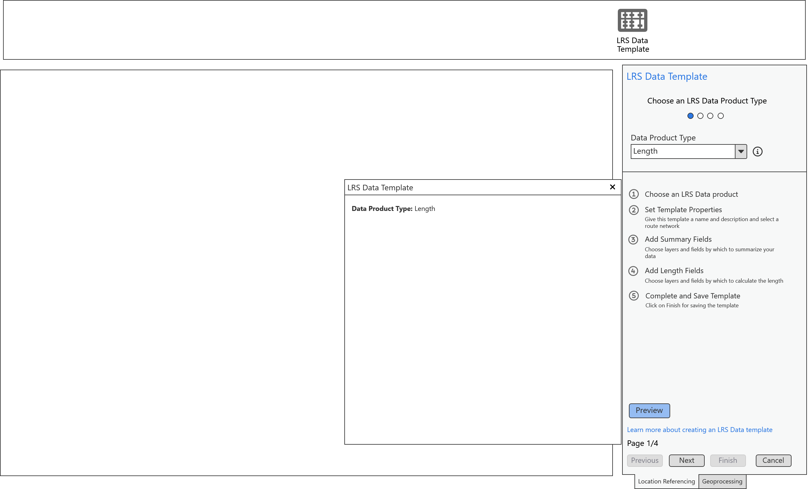

# LRS Data Template Preview – Test Plan

|   |   |
| --- | --- |
| **Kind** | Test Plan · Pro |
| **Release** | — |
| **Product** | Roads & Highways · Pipeline Referencing |
| **Issue** | [ArcGISPro/ps-location-referencing#5814](https://devtopia.esri.com/ArcGISPro/ps-location-referencing/issues/5814) |
| **Source** | [TemplatePreview_Testplan.pptx](<https://esriis.sharepoint.com/sites/LocationReferencing/Shared%20Documents/General/Test%20Plans/TemplatePreview_Testplan.pptx>) |
| **Edited** | 2024-07-02 19:25 by Claire Wang |
| **Extracted** | 2026-09-04 · lane `xmlstrip` |

<!-- metadata
```yaml
title: "LRS Data Template Preview – Test Plan"
source_file: "TemplatePreview_Testplan.pptx"
source_url: "https://esriis.sharepoint.com/sites/LocationReferencing/Shared%20Documents/General/Test%20Plans/TemplatePreview_Testplan.pptx"
doc_id: 355
doc_kind: "Test Plan"
surface: "Pro"
doc_revision: ""
target_release: ""
pe: "Claire"
dev: "Sharon"
author: "Lakshmi Ananthanarayanan"
last_edited_by: "Claire Wang"
last_edited: "2024-07-02T19:25:42Z"
extracted: 2026-09-04
extraction_lane: xmlstrip
prompt_version: "v2.0.2"
keywords: ["data template", "preview window", "template wizard", "geodatabase", "network layer", "error handling", "template creation"]
tools: []
products: ["Roads & Highways", "Pipeline Referencing"]
issues: ["ArcGISPro/ps-location-referencing#5814"]
related: [{"doc":354,"file":"lrs-data-template-wizard-test-plan__doc354.md","s":6.113},{"doc":256,"file":"route-log-data-product-template-test-plan__doc256.md","s":6.039},{"doc":347,"file":"support-a-single-summary-field-in-lrs-data-template-wizard-test-plan__doc347.md","s":5.917},{"doc":323,"file":"support-multiple-summary-fields-in-lrs-data-template-wizard-test-plan__doc323.md","s":5.526},{"doc":322,"file":"support-length-fields-using-unique-values-in-lrs-data-template-wizard-test-plan__doc322.md","s":4.814}]
```
-->

## Summary

Test plan for the LRS Data Template preview feature in the Location Referencing wizard. Covers verification of preview button behavior, modeless window content updates, error handling, and testing across different geodatabases and network configurations. Includes positive and negative test cases for template creation, overwriting, and map interactions.

## Related documents

<!-- related:begin -->
- [LRS Data Template wizard – Test Plan](<https://esriis.sharepoint.com/sites/lrsworkspace/LRS Doc Index/Test Plans/lrs-data-template-wizard-test-plan__doc354.md>) — similar text 0.49 · 1 filename word · same kind/surface/pe/dev/folder <!-- rel:354 -->
- [Route Log data product template – Test Plan](<https://esriis.sharepoint.com/sites/lrsworkspace/LRS Doc Index/Test Plans/route-log-data-product-template-test-plan__doc256.md>) — similar text 0.31 · 1 filename word · same kind/surface/pe/dev/folder <!-- rel:256 -->
- [Support a single summary field in LRS Data Template wizard – Test Plan](<https://esriis.sharepoint.com/sites/lrsworkspace/LRS Doc Index/Test Plans/support-a-single-summary-field-in-lrs-data-template-wizard-test-plan__doc347.md>) — similar text 0.42 · 1 filename word · same kind/surface/pe/dev/folder <!-- rel:347 -->
- [Support multiple summary fields in LRS Data Template wizard – Test Plan](<https://esriis.sharepoint.com/sites/lrsworkspace/LRS Doc Index/Test Plans/support-multiple-summary-fields-in-lrs-data-template-wizard-test-plan__doc323.md>) — similar text 0.35 · 1 filename word · same kind/surface/pe/dev/folder <!-- rel:323 -->
- [Support length fields using unique values in LRS Data Template wizard – Test Plan](<https://esriis.sharepoint.com/sites/lrsworkspace/LRS Doc Index/Test Plans/support-length-fields-using-unique-values-in-lrs-data-template-wizard-test-plan__doc322.md>) — similar text 0.36 · 1 filename word · same kind/surface/dev/folder <!-- rel:322 -->
<!-- related:end -->

<!-- docs:begin -->
## Esri documentation

[Create a template for an LRS length data product](https://doc.esri.com/en/arcgis-pro/latest/help/production/roads-highways/create-a-template-for-an-lrs-length-data-product.html)

_No page matched:_ [transform lrs data](https://www.google.com/search?q=%22transform%20lrs%20data%22+site%3Adoc.esri.com)
<!-- docs:end -->

---

## Slide 1 — LRS Data Template Preview – Test Plan

https://devtopia.esri.com/ArcGISPro/ps-location-referencing/issues/5814

PE: Claire
Dev: Sharon

## Slide 2

Verification

- A preview button is on all pages in the LRS Data Template wizard
- Clicking on preview button opens a modeless window of the template
- The modeless window can be closed by clicking on the close button at the top
- Preview closes when the wizard closes
- If the map is closed, the wizard pane do not close, but empty out with the blue banner. Preview button can either be gone or disabled, with the modeless window closed
- The modeless window's contents are dynamically linked to the wizard
  - If the Canvas is open and a change is made, update the canvas upon losing focus from the updated parameter
  - If the Canvas is not open and a change is made, show the updated canvas upon clicking the preview button.
  - Disable the preview button if Canvas is already opened
- The contents of the modeless window are non editable
- When navigating between the wizard's pages, don't alter the contents of the modeless window. The window always displays the most recent information across all of the wizard's pages



## Slide 3

Testing

- Test in fgdb, egdb (oracle + sql), fs - default and child versions
- Test with nonline, Line, Derived network, and Addressing (sanity)
- Test when there are multiple networks in TOC
- Test creating new template and opening and overwriting existing template
- The tool should recognize network layer when it is checked off (invisible) in map
- If there is error in wizard, the field corresponding to that error is empty in the canvas. Canvas can still open.
- Test with different Name and Description
- Test closing wizard – preview should stay open if it’s already opened (After clicking Finish, wizard closes immediately regardless of preview behavior.)
- Test closing map and there is no map at all – the wizard pane do not close, but empty out with the blue banner. Canvas becomes empty. Preview is still enabled but will open up an empty canvas
- Test switching maps – when the network does not exist for the new map, the wizard will error out, canvas is still open but the fields with errors become empty
- Test with dark and light theme
- 508 and i18n compliance
Automation: not yet
Doc: not yet

## Slide 4

– The following cases should already have an error in wizard. Here testing is for the preview window behavior: preview button is disabled whenever there is an error in wizard
Negative cases

| No | Test | Expected Result |
| --- | --- | --- |
| 1 | User selects the wrong file that has invalid fields (or everything is invalid) | Canvas shows empty fields |
| 2 | User selects an existing template json but it’s for a different network | Canvas shows empty network field |

## Slide 5

| No. | Test case | Expected | Observed |
| --- | --- | --- | --- |
| 1 | Create a template for RH. Save it. Run in Transform LRS Data tool. | Preview shows the correct Route Identifier, name and description. |  |
| 2 | Create a template for APR – engineering when 2 networks exist in map. | Preview shows the correct Route Identifier, name and description. |  |
| 3 | Create a template for APR – continuous when 2 networks exist in map. | Preview shows the correct Route Identifier, name and description. |  |
| 4 | Create a template for PoM when multiple networks exist in map. | Preview shows the correct Route Identifier, name and description. |  |
| 5 | Create a template for AM. Save it. Run in Transform LRS Data tool. | Preview shows the correct Route Identifier, name and description. |  |
| 6 | Open a template for RH and overwrite it. | Preview shows the correct, updated Route Identifier, name and description. |  |
| 7 | Open a template for APR-engineering and overwrite it. Run in Transform LRS Data tool. | Preview shows the correct, updated Route Identifier, name and description. |  |
| 8 | Open a template for PoM and overwrite it. | Preview shows the correct, updated Route Identifier, name and description. |  |

Positive cases (test various dbs/FSs; test preview window behavior)

## Slide 6

| No. | Test case | Expected | Observed |
| --- | --- | --- | --- |
| 9 | Close wizard or it’s closed by clicking on finish | Preview should stay open if it’s already opened. |  |
| 10 | Close map and there is no map left | the wizard pane do not close, but empty out with the blue banner. Canvas becomes empty if it’s opened. If it’s closed, preview is still enabled but will open up an empty canvas |  |
| 11. | Switch map (or close current map but there are other maps) – wizard will verify contents in the new map. | If everything is good, canvas is updated. If any field errors out, the corresponding field in canvas is empty. |  |
|  |  |  |  |
