# LRS Identify: Show Coordinates in Results Experience Builder Widget Test Plan

|   |   |
| --- | --- |
| **Kind** | Test Plan · Experience Builder |
| **Release** | Enterprise 12.2 |
| **Product** | Pipeline Referencing |
| **Issue** | [ArcGISPro/ps-location-referencing#26618](https://devtopia.esri.com/ArcGISPro/ps-location-referencing/issues/26618) |
| **Source** | [LRS_Identify_Coordinates_ExB_TestPlan.pptx](<https://esriis.sharepoint.com/sites/LocationReferencing/Shared%20Documents/General/Test%20Plans/LRS_Identify_Coordinates_ExB_TestPlan.pptx>) |
| **Edited** | 2026-08-13 18:23 by Karlie Murray |
| **Extracted** | 2026-09-04 · lane `xmlstrip` |

<!-- metadata
```yaml
title: "LRS Identify: Show Coordinates in Results Experience Builder Widget Test Plan"
source_file: "LRS_Identify_Coordinates_ExB_TestPlan.pptx"
source_url: "https://esriis.sharepoint.com/sites/LocationReferencing/Shared%20Documents/General/Test%20Plans/LRS_Identify_Coordinates_ExB_TestPlan.pptx"
doc_id: 859
doc_kind: "Test Plan"
surface: "Experience Builder"
doc_revision: ""
target_release: "Enterprise 12.2"
pe: "karlie murray"
dev: "prutha shirodkar"
author: "Karlie Murray"
last_edited_by: "Karlie Murray"
last_edited: "2026-08-13T18:23:13Z"
extracted: 2026-09-04
extraction_lane: xmlstrip
prompt_version: "v2.0.2"
keywords: ["coordinates", "identify widget", "experience builder", "regression tests", "multiple routes", "multiple events", "date filter", "data actions"]
tools: ["LRS Identify", "Add Point Event", "Add Line Event", "Dynamic Segmentation", "Table widget", "Date Filter"]
products: ["Pipeline Referencing"]
issues: ["ArcGISPro/ps-location-referencing#26618"]
related: [{"doc":2,"file":"iteration-planning-and-issue-tracking-for-location-referencing-3-8-12-2__doc2.md","s":1001.311},{"doc":908,"file":"test-plan-display-expanded-lrs-and-business-attributes-in-the-sld-hover-tooltip__doc908.md","s":6.729},{"doc":26,"file":"lrs-identify-widget-configurable-coordinate-output__doc26.md","s":5.213},{"doc":905,"file":"lrs-identify-widget__doc905.md","s":4.499},{"doc":375,"file":"data-action-support-for-lrs-identify-widget-test-plan__doc375.md","s":4.419}]
```
-->

## Summary

This document is a test plan for the LRS Identify widget in Experience Builder, focusing on configurable coordinate output in identify results. It covers coordinate configuration, precision, regression tests for multiple routes and events, date filtering, and data actions integration with other widgets. The plan ensures accurate coordinate display, copying functionality, and proper handling of multiple routes, events, and time-slices under various configurations.

## Related documents

<!-- related:begin -->
- [Iteration Planning and Issue Tracking for Location Referencing 3.8/12.2](<https://esriis.sharepoint.com/sites/lrsworkspace/LRS Doc Index/Schedules/iteration-planning-and-issue-tracking-for-location-referencing-3-8-12-2__doc2.md>) — shared issue ArcGISPro/ps-location-referencing#26618 · similar text 0.05 <!-- rel:2 -->
- [Test Plan: Display Expanded LRS and Business Attributes in the SLD Hover Tooltip](<https://esriis.sharepoint.com/sites/lrsworkspace/LRS Doc Index/Test Plans/test-plan-display-expanded-lrs-and-business-attributes-in-the-sld-hover-tooltip__doc908.md>) — similar text 0.21 · same kind/surface/release Enterprise 12.2/pe/dev/folder <!-- rel:908 -->
- [LRS Identify Widget – Configurable Coordinate Output](<https://esriis.sharepoint.com/sites/lrsworkspace/LRS Doc Index/User Stories/lrs-identify-widget-configurable-coordinate-output__doc26.md>) — similar text 0.29 · 2 title words · 2 filename words · same surface <!-- rel:26 -->
- [LRS Identify widget](<https://esriis.sharepoint.com/sites/lrsworkspace/LRS Doc Index/Other/lrs-identify-widget__doc905.md>) — similar text 0.24 · 2 title words · 1 filename word · same surface <!-- rel:905 -->
- [Data Action Support for LRS Identify widget– Test Plan](<https://esriis.sharepoint.com/sites/lrsworkspace/LRS Doc Index/Test Plans/data-action-support-for-lrs-identify-widget-test-plan__doc375.md>) — similar text 0.23 · 2 title words · 1 filename word · same kind/surface/folder <!-- rel:375 -->
<!-- related:end -->

<!-- docs:begin -->
## Esri documentation

[Apply dynamic segmentation](https://doc.esri.com/en/arcgis-pro/latest/help/production/location-referencing-pipelines/apply-dynamic-segmentation.html)

_No page matched:_ [LRS Identify](https://www.google.com/search?q=%22LRS%20Identify%22+site%3Adoc.esri.com) · [Add Point Event](https://www.google.com/search?q=%22Add%20Point%20Event%22+site%3Adoc.esri.com) · [Add Line Event](https://www.google.com/search?q=%22Add%20Line%20Event%22+site%3Adoc.esri.com) · [Table widget](https://www.google.com/search?q=%22Table%20widget%22+site%3Adoc.esri.com) · [Date Filter](https://www.google.com/search?q=%22Date%20Filter%22+site%3Adoc.esri.com)
<!-- docs:end -->

---

## Slide 1

LRS Identify:
Show Coordinates in Results
Experience Builder  |  LRS Identify Widget

User Story: ps-location-referencing #26618

[figure: TEST PLAN · RELEASE: Enterprise 12.2 · SE: prutha shirodkar · PE: karlie murray]

## Slide 2


Out of scope

- No Z / elevation values - X,Y only
- Raw lat/long as a spatial reference option

In scope

- 'Include coordinates in results' toggle in config - default OFF
- Set precision/tolerance in config (how many digits coordinate will have) – default to service precision
- Set Spatial Reference in config - default to LRS
- Coordinates derived from the LRS result location
- Highlight & copy in 'X,Y' format
- Spatial reference shown in results
- No performance degradation or regressions

Scope & Summary
Objective: As an LRS event editor or analyst, I need configurable coordinate output in the LRS Identify widget so that I can interpret and reuse location information accurately across systems.

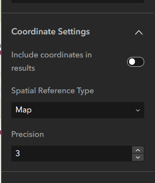

## Slide 3

Test Environments & Data

Environments

- Various ExB Templates
- Test with Date Filter widget
- Test Data Actions with other widgets
- Chrome and Edge browsers

Data

- Line and Non-Line Networks (projected & unprojected)
  - INDOT (non-line)
  - Franklin, Ohio ADM (non-line)
  - APR Sample (line)
  - PostMile (line)
  - APR Data (line) – unprojected
- Different spatial references (Map or LRS)
- Web map with a custom (non-Web Mercator) spatial reference
- Complex routes
- Routes with time-slices
- Attribute Sets

| Feature Service | LRS spatial reference | Web map spatial reference |
| --- | --- | --- |
| INDOT | NAD83 UTM Zone 16N | Web Mercator– WGS84 |
| Franklin County, Ohio | NAD83 State Plane Ohio South | Web Mercator– WGS84 |
| APR Sample | NAD83 Albers Equal Area | Web Mercator– WGS84 |
| PostMile | NAD83 California Albers | Web Mercator – WGS84 |
| APR Data (unprojected) | WGS 1984 (unprojected) | Web Mercator – WGS84 |
| Custom spatial reference ( non-Web Mercator) | TBD | Use a different basemap to configure a nonWGS84 spatial reference |

## Slide 4

Coordinate Configuration Tests

| # | Test | Expected result |
| --- | --- | --- |
| A-1 | ‘Include coordinates in results’ toggle button is present in the LRS Identify widget configuration settings | 'Include coordinates in results' is present and turned OFF by default |
| A-2 | Click the “Include coordinates in results’ toggle button | Toggle button is turned ON or OFF in configuration. Precision and output spatial reference options become available. |
| A-3 | “Include coordinates in results’ toggle button turned ON | Coordinates are shown in LRS Identify Results |
| A- 4 | “Include coordinates in results’ toggle button turned OFF | Coordinates are not shown in LRS Identify Results |
| A-5 | At default, precision is set to the feature service’s precision | Defaults to the service precision when widget is added to ExB (not a hard-coded value) |
| A-6 | Precision value is changed from default value | Coordinates in LRS Identify results reflect the correct precision value |
| A-7 | At default, spatial reference type is set to ‘Map’ | Defaults to ‘Map’ when widget is added to ExB |
| A-8 | Spatial reference is set to ‘Map’ in configuration settings | Coordinates in LRS Identify results are in the Map’s spatial reference. Spatial reference label displays correct spatial reference. |
| A-9 | Spatial reference is set to ‘LRS’ in configuration settings | Coordinates in LRS Identify results are in the LRS spatial reference. Spatial reference label displays correct spatial reference. |
| A-10 | Save, publish, reopen the experience | Toggle, Precision and Spatial Reference selections all persist |

## Slide 5

| # | Test | Expected result |
| --- | --- | --- |
| A-11 | Change Default Network | Identify Results show default network first when the clicked location has more than one network present |
| A-12 | Turn on toggle ‘Show Line Events’ | Identify Results show line events that exist at clicked location |
| A-13 | Turn on toggle ‘Show Point Events’ | Identify Results show point events that exist at clicked location |
| A-14 | Change the Point Attribute Set | Identify Results only show point events that are included in the specified Attribute Set |
| A-15 | Change the Line Attribute Set | Identify Results only show line events that are included in the specified Attribute Set |
| A-16 | When the input network is PoM, configure events to be displayed | No events are displayed for PoM Network in Identify Results |
| A-17 | Hide business fields in the Network layer | Identify Results does not show the hidden fields |
| A-18 | Reorder layers in the layer list | Layers can be dragged and reordered |
| A-19 | Hide layers via the configuration | Identify Results does not show the hidden layers |
| A-20 | Using the Select Layers option, Load Layers and then click the X to select layers to remove in the layers list | Identify Results does not show the removed layers |
| A-21 | Add/Remove a data action | Data Actions for Identify reflect what is configured |
| A-22 | Configure multiple LRS Identify widgets in one experience | Each widget honors its own independent coordinate configuration |

Configuration Tests - Regression

## Slide 6

Precision Tests

| # | Precision setting | Expected result |
| --- | --- | --- |
| B-1 | At default, precision is set to the feature service’s precision (A-5 duplicate) | Digits returned match the service precision - no rounding applied by the widget |
| B-2 | Precision set to 0 | Coordinates are displayed as whole numbers; no decimal separator |
| B-3 | Precision set to a low value (e.g. 2) | Coordinates truncated/rounded consistently to the configured digits |
| B-4 | Precision set to a high value (e.g. 8) | Full digits shown without truncation |
| B-5 | User can adjust precision field with up & down arrow buttons | Precision value responds when up & down buttons are used |
| B-6 | User can adjust precision by typing in field | Precision value can be changed via typing |
| B-7 | User enters a precision greater than 12 | User in not able to enter a precision greater than 12 |
| B-8 | Change precision, republish, re-identify | New precision value is applied to subsequent results |
| B-9 | Precision with negative coordinate values | Negative sign preserved and digit count honored |
| B-10 | Unprojected spatial reference | Decimal degrees respect the configured precision |
| B-11 | Projected spatial reference | Projected units respect the configured precision |
| B-12 | ‘Map’ vs. ‘LRS’ spatial reference | The configured precision is preserved with both spatial reference options |

## Slide 7

Coordinate (Toggle ON) Tests

| # | Test | Expected result |
| --- | --- | --- |
| C-1 | Identify a location on a route | Identify results show route, measure AND coordinates are returned. Green dot appears on map where route was clicked. |
| C-2 | Compare returned X,Y against the LRS result location | Coordinates are derived from the LRS result location |
| C-3 | Identify a location where more than one route exists | Identify results shows all routes: one route per page and the correct coordinate is shown on each page |
| C-4 | Identify route with UTM spatial reference (INDOT) | Identify results return coordinates in correct spatial reference |
| C-5 | Identify route with State Plane spatial reference ( FranklinOH ) | Identify results return coordinates in correct spatial reference |
| C-6 | Identify route with Albers spatial reference (PostMile) | Identify results return coordinates in correct spatial reference (no events show for PoM) |
| C-7 | Identify route with Unprojected spatial reference ( APRData ) | Identify results return coordinates in correct spatial reference |
| C-8 | Identify route with custom spatial reference ( non-Web Mercator) | Identify results return coordinates in correct spatial reference |
| C-9 | Identify route with non-line network (INDOT)(C-5 duplicate) | Identify results return coordinates |
| C-10 | Identify route with line network ( APRSample ) | Identify results return coordinates |
| C-11 | Identify route when the configured spatial reference differs from the web map projection | Identify results return coordinates. Difference from the web map projection is clearly communicated to the user |

## Slide 8

Copy to Clipboard Tests

| # | Test | Expected result |
| --- | --- | --- |
| D-1 | Highlight, right-click, and copy the coordinate result | Clipboard contains exactly 'X,Y' (or 'Coordinate1, Coordinate2') |
| D-2 | Ctrl+C to copy the coordinate result | Clipboard contains exactly 'X,Y' (or 'Coordinate1, Coordinate2') |
| D-3 | Click the copy icon to copy coordinate result | Clipboard contains exactly 'X,Y' (or 'Coordinate1, Coordinate2’) . Copy icon shows check mark. |
| D-4 | Copy coordinate and paste into Excel | Value pastes cleanly in ‘X,Y’ format |
| D-5 | Copy coordinate and paste into Notepad | Value pastes cleanly in ‘X,Y’ format |
| D-6 | Copy coordinate and paste into Add Point or Add Line Event | Value pastes cleanly and is accepted as a valid coordinate input |
| D-7 | Identify and copy/paste multiple different coordinates in a row | Copied value reflects the most recently copied coordinate |

### Notes

Add tests for copy icon

## Slide 9

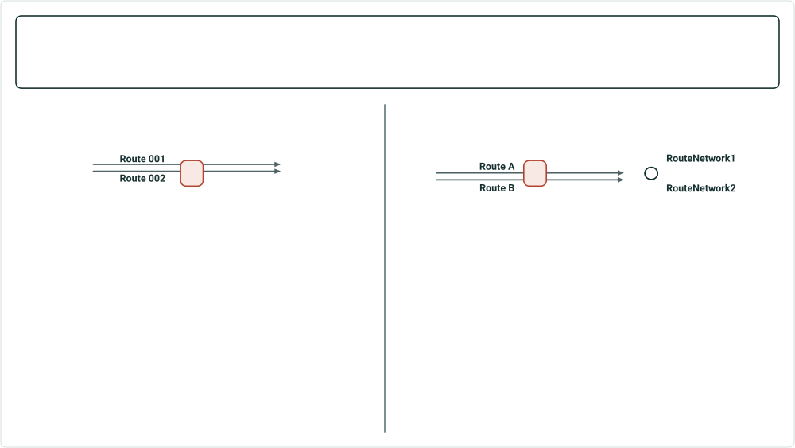


LRS Identify Regression Tests – Multiple Routes
E-1.) Multiple routes exist at the clicked location from the same network
E-2.) Multiple routes with different networks exist at the clicked location

Expected Result:
Identify Results has 2 pages and displays one route per page. Same coordinate is displayed on both pages.

Expected Result:
Network in Identify Results is a dropdown field with options to select different Networks. Default Network displays first. Same coordinate is displayed for both Networks.
With coordinate toggle ON

## Slide 10

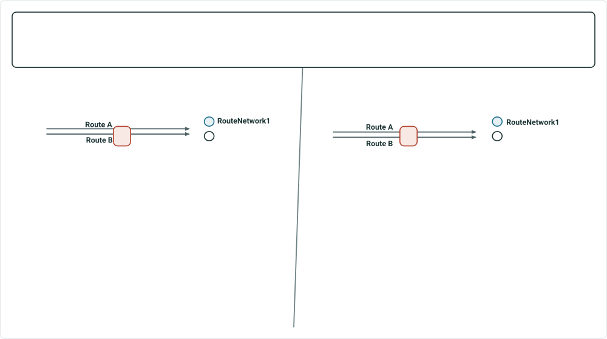


LRS Identify Regression Tests – Multiple Routes
E-3.) Multiple routes with different networks exist at the clicked location, but one network is turned off in the configuration
E-4.) Multiple routes with different networks exist at the clicked location, but one network is turned off in the map
Expected Result:
Identify Results displays the route belonging to the Network that is turned on. Network dropdown menu does not display the Network that is turned off. Coordinate is displayed.

RouteNetwork2 (turned off)
Expected Result:
Identify Results displays the route belonging to the Network that is turned on. Network dropdown menu does not display the Network that is turned off. Coordinate is displayed.

With coordinate toggle ON

RouteNetwork2 (turned off)

## Slide 11

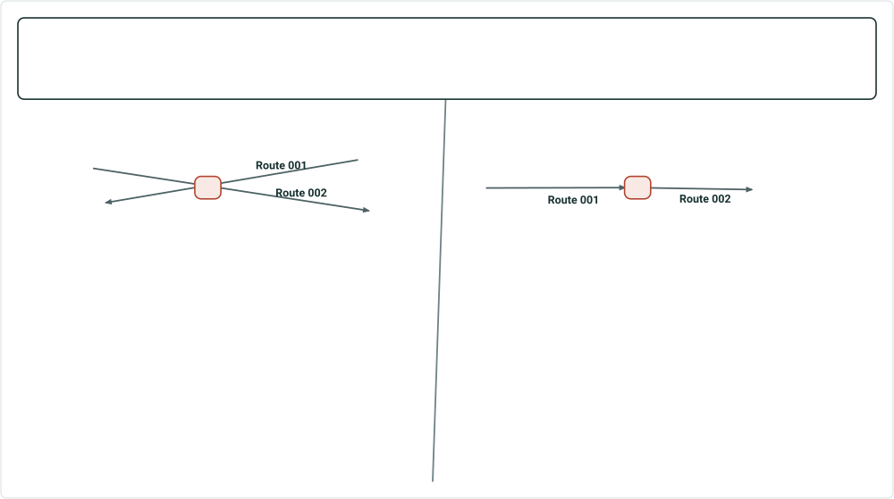


LRS Identify Regression Tests – Multiple Routes
E-5.) Click a location where two routes intersect
E-6.) Click a location where the end of one route meets the start of another route
Expected Result:
Identify Results has 2 pages and displays one route per page. Same coordinate is displayed on both pages.

Expected Result:
Identify Results has 2 pages and displays one route per page. Same coordinate is displayed on both pages.

With coordinate toggle ON

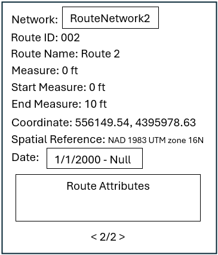

## Slide 12

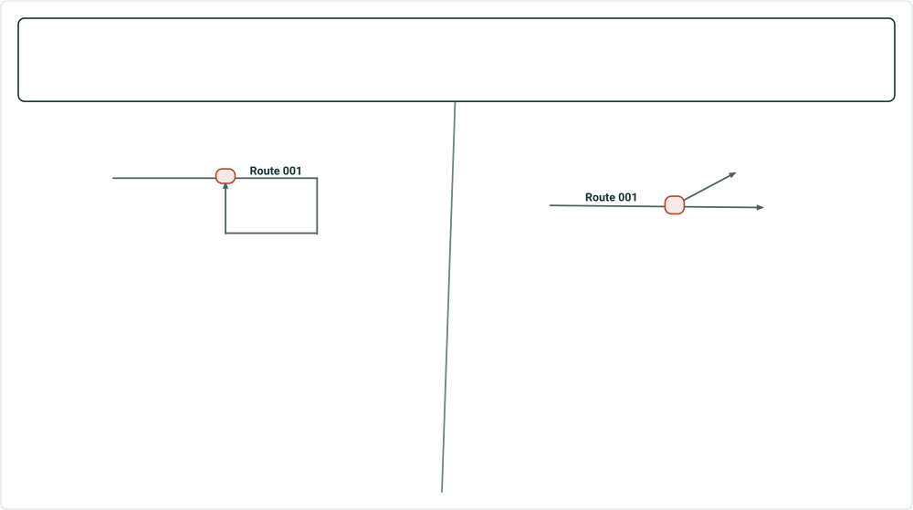


LRS Identify Regression Tests – Self-Intersecting Routes
E-7.) Click the location where a lollipop route self-intersects
E-8.) Click the location where a branch route self-intersects
Route 001
Expected Result:
Identify Results displays route and both measures. Coordinate is displayed.

Expected Result:
Identify Results displays route and both measures. Coordinate is displayed.

With coordinate toggle ON
Route 001

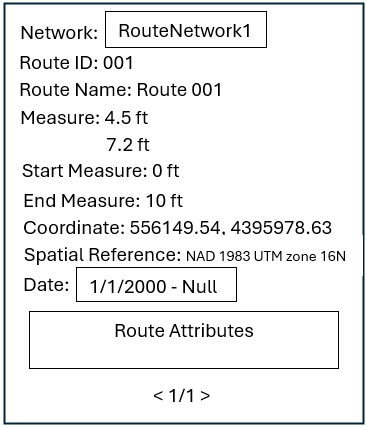 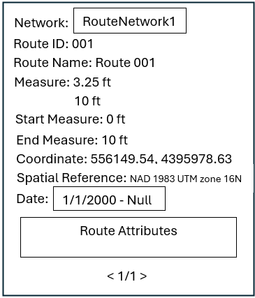

## Slide 13

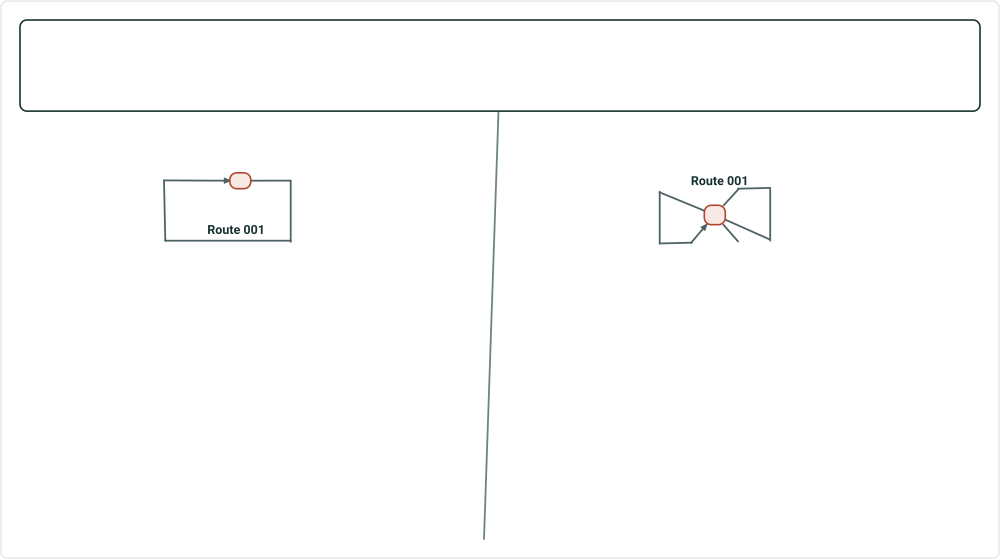

LRS Identify Regression Tests – Self-Intersecting Routes
E-9.) Click the location where a loop route self-intersects
E-10.) Click the location where an infinity route self-intersects
Route 001
Expected Result:
Identify Results displays route and both measures. Coordinate is displayed.

Expected Result:
Identify Results displays route and three measures. Coordinate is displayed.

With coordinate toggle ON
Route 001

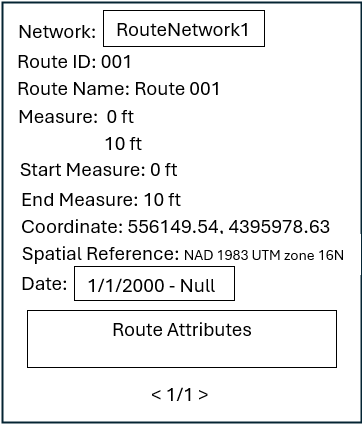 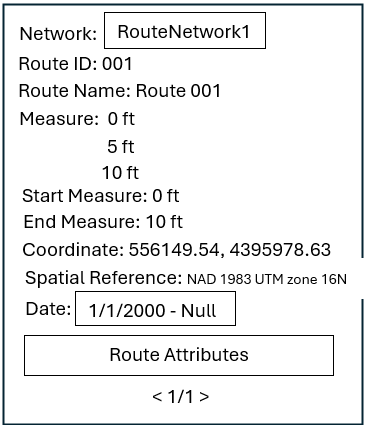

### Notes

Add test for another route at the clicked location

## Slide 14

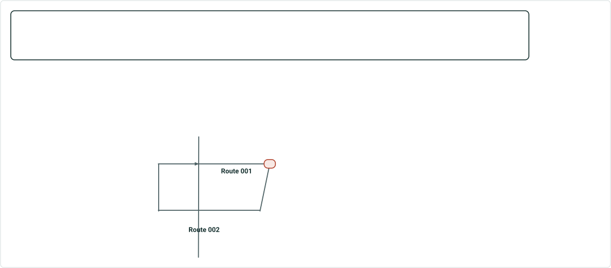
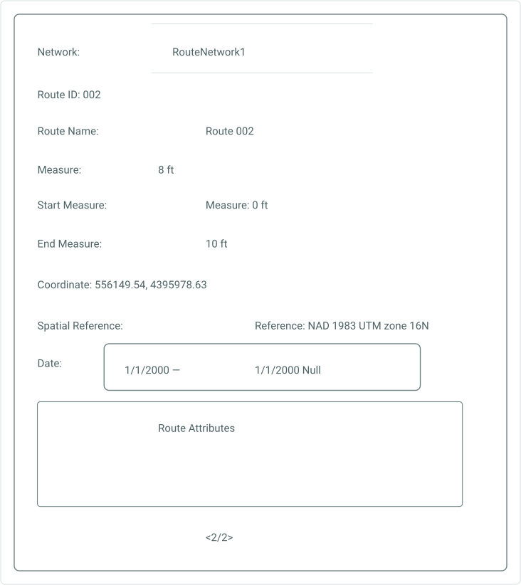

LRS Identify Regression Tests – Self-Intersecting Routes
E-11.) Click the location where a route intersects a loop route. The clicked location is where the loop route self-intersects
Route 001
Expected Result:
Identify Results has 2 pages and displays one route per page. Same coordinate is displayed on both pages.

With coordinate toggle ON

Route 002

 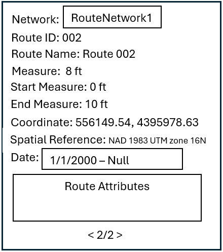 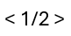

### Notes

Add test for another route at the clicked location

## Slide 15

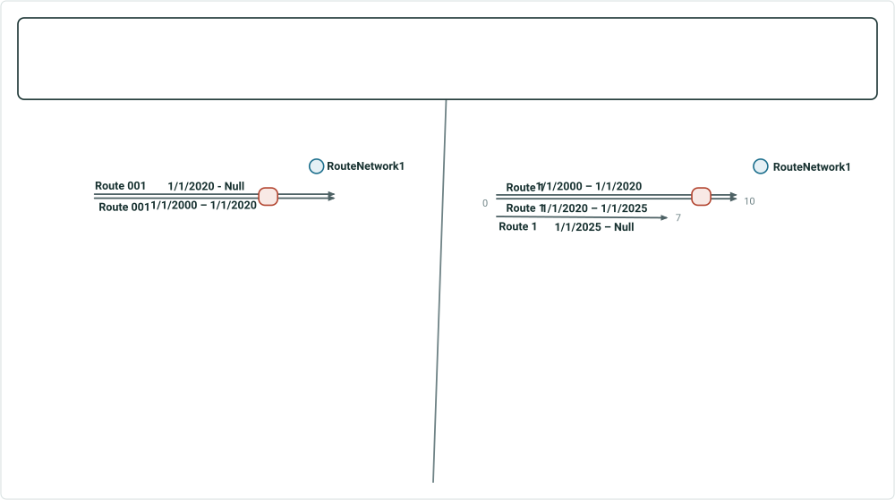


LRS Identify Regression Tests – Multiple Route Time-slices
E-12.) Multiple time-slices exist at the clicked location
E-13.) Multiple time-slices of the route exist, but they do not all exist at the clicked location
Expected Result:
Identify Results displays all time-slices in the date field dropdown. Same coordinate is displayed for all time-slices.

Expected Result:
Identify Results displays all time-slices in the date field dropdown that exist at the clicked location. Same coordinate is displayed for all time-slices.

With coordinate toggle ON

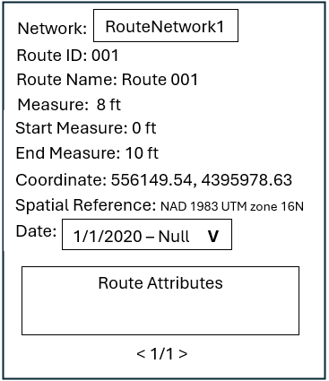 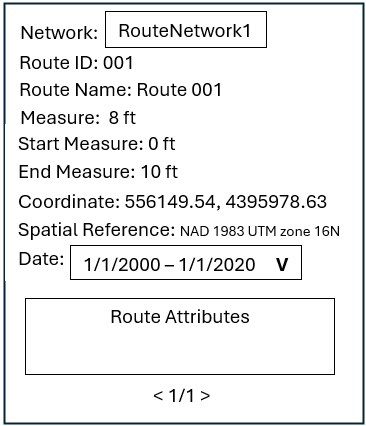 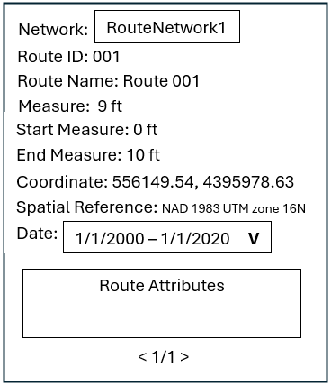 

## Slide 16


LRS Identify Regression Tests
E-14.) Network is configured to not show extra business fields
Expected Result:
Identify Results displays all route attributes except business fields that are configured to be hidden. Coordinate is displayed.
With coordinate toggle ON
RouteNetwork1

Route 001

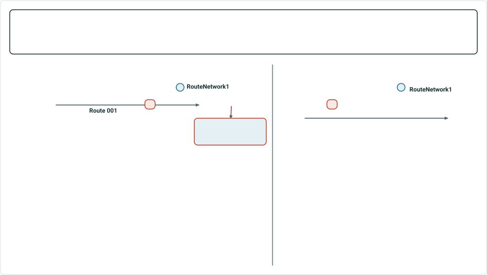

| Network | RouteID | Route Name | From Date | To Date | Status | Updated Date |
| --- | --- | --- | --- | --- | --- | --- |
| RouteNetwork1 | 001 | Route 001 | 1/1/2000 | Null | Active | 4/1/2020 |

Fields configured to be hidden
E-15.) No routes exist at the clicked location
RouteNetwork1

Expected Result:
Identify Results not returned. Identify stays enabled so user does not have to select Identify again before their next click.

## Slide 17

LRS Identify Regression Tests – Multiple Events
E-16.) Multiple line and point events exist at the clicked location
Expected Result:
Identify Results displays all events and their attributes present at the clicked location. Coordinate is displayed.
With coordinate toggle ON + Point and Line Attribute Sets toggle ON


| Network | RouteID | Route Name | From Date | To Date |
| --- | --- | --- | --- | --- |
| RouteNetwork1 | 001 | Route 001 | 1/1/2000 | Null |

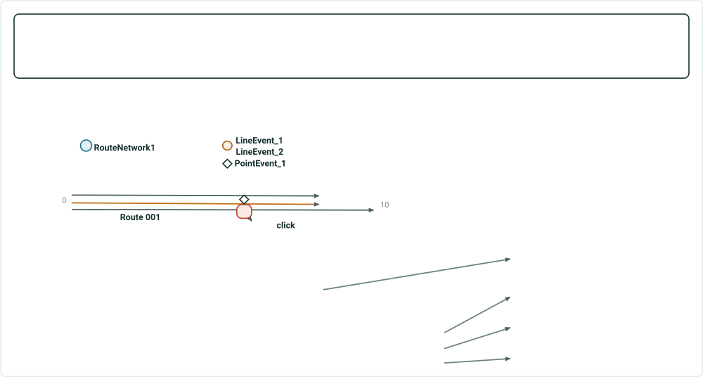

| Event | RouteID | Route Name | From Date | To Date | From Meas | To Meas | Attribute1 |
| --- | --- | --- | --- | --- | --- | --- | --- |
| LineEvent_1 | 001 | Route 001 | 1/1/2000 | Null | 0 | 8 | Open |
| LineEvent_2 | 001 | Route 001 | 1/1/2000 | Null | 0 | 8 | Good |
| PointEvent_1 | 001 | Route 001 | 1/1/2000 | Null | 6 | Null | 2 |

## Slide 18

LRS Identify Regression Tests – Multiple Events
E-17.) Multiple overlapping line events within the same event layer exist at the clicked location
Expected Result:
Identify Results displays route and all events present at the clicked location. Coordinate is displayed.
With coordinate toggle ON + Point and Line Attribute Sets toggle ON


| Network | RouteID | Route Name | From Date | To Date |
| --- | --- | --- | --- | --- |
| RouteNetwork1 | 001 | Route 001 | 1/1/2000 | Null |

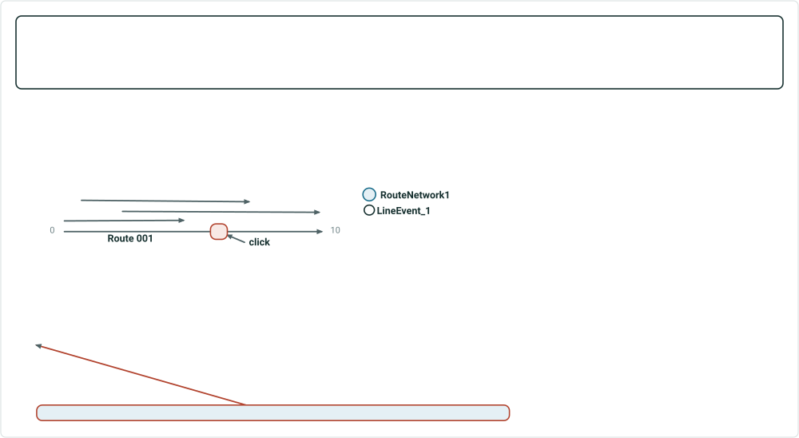

| Event | RouteID | Route Name | From Date | To Date | From Meas | To Meas | Attribute1 |
| --- | --- | --- | --- | --- | --- | --- | --- |
| LineEvent_1 | 001 | Route 001 | 1/1/2000 | Null | 1 | 7 | Open |
| LineEvent_1 | 001 | Route 001 | 1/1/2000 | Null | 3 | 10 | Shut |
| LineEvent_1 | 001 | Route 001 | 1/1/2000 | Null | 0 | 4 | Open |

Time-slice does not exist at clicked location

## Slide 19

LRS Identify Regression Tests – Multiple Events
E-18.) The clicked location is where the start of one event and the end of another event meet (same event layer)
Expected Result:
Identify Results displays route and all events that exist at the clicked measure. Coordinate is displayed.
With coordinate toggle ON + Point and Line Attribute Sets toggle ON

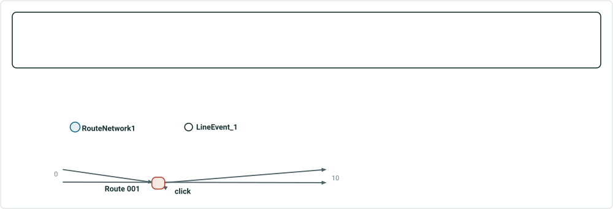

| Network | RouteID | Route Name | From Date | To Date |
| --- | --- | --- | --- | --- |
| RouteNetwork1 | 001 | Route 001 | 1/1/2000 | Null |


| Event | RouteID | Route Name | From Date | To Date | From Meas | To Meas | Attribute1 |
| --- | --- | --- | --- | --- | --- | --- | --- |
| LineEvent_1 | 001 | Route 001 | 1/1/2000 | Null | 0 | 4 | Open |
| LineEvent_1 | 001 | Route 001 | 1/1/2000 | Null | 4 | 10 | Shut |

## Slide 20


LRS Identify Regression Tests – Multiple Events
E-19.) Multiple events exist at the clicked location, but some events are turned off in map
Expected Result:
Identify Results displays route and events. Only events that exist at the clicked location and turned on in the map are shown. Coordinate is displayed.
With coordinate toggle ON + Point and Line Attribute Sets toggle ON

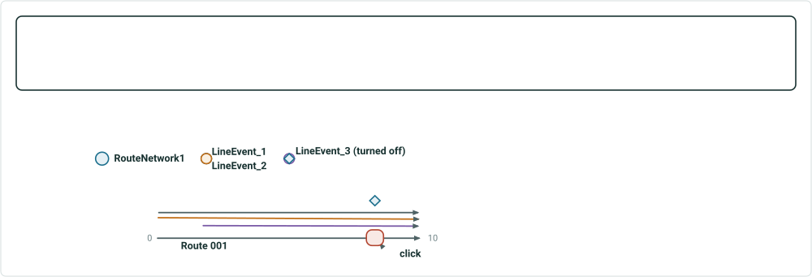

| Network | RouteID | Route Name | From Date | To Date |
| --- | --- | --- | --- | --- |
| RouteNetwork1 | 001 | Route 001 | 1/1/2000 | Null |


| Event | RouteID | Route Name | From Date | To Date | From Meas | To Meas | Attribute1 |
| --- | --- | --- | --- | --- | --- | --- | --- |
| LineEvent_1 | 001 | Route 001 | 1/1/2000 | Null | 0 | 10 | Open |
| LineEvent_2 | 001 | Route 001 | 1/1/2000 | Null | 0 | 10 | Poor |
| LineEvent_3 | 001 | Route 001 | 1/1/2000 | Null | 2 | 10 | 49 |
| PointEvent_A | 001 | Route 001 | 1/1/2000 | Null | 8 | Null | Active |

PointEvent_A (turned off)

## Slide 21

LRS Identify Regression Tests – Attribute Sets
E-20.) Multiple events exist at the clicked location, but all events are not present in the configured attribute set
Expected Result:
Identify Results displays route and events. Only events that exist at the clicked location and are present in the configured attribute set are shown. Coordinate is displayed.
With coordinate toggle ON + Point and Line Attribute Sets toggle ON


| Network | RouteID | Route Name | From Date | To Date |
| --- | --- | --- | --- | --- |
| RouteNetwork1 | 001 | Route 001 | 1/1/2000 | Null |

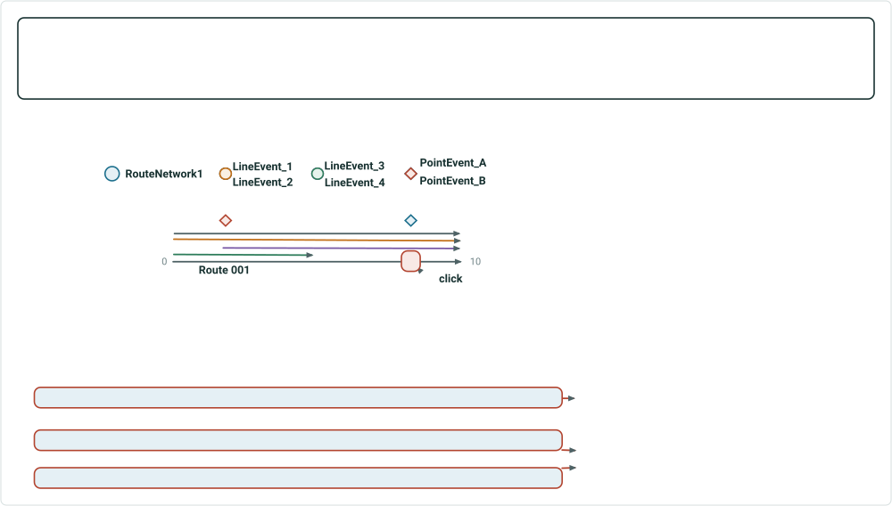

| Event | RouteID | Route Name | From Date | To Date | From Meas | To Meas | Attribute1 |
| --- | --- | --- | --- | --- | --- | --- | --- |
| LineEvent_1 | 001 | Route 001 | 1/1/2000 | Null | 0 | 10 | Open |
| LineEvent_2 | 001 | Route 001 | 1/1/2000 | Null | 0 | 10 | Poor |
| LineEvent_3 | 001 | Route 001 | 1/1/2000 | Null | 2 | 10 | 49 |
| LineEvent_4 | 001 | Route 01 | 1/1/2000 | Null | 0 | 5 |  |
| PointEvent_A | 001 | Route 001 | 1/1/2000 | Null | 8 | Null | Active |
| PointEvent_B | 001 | Route 001 | 1/1/2000 | Null | 2 | Null |  |

Configured Attribute Sets:

Line Events:
LineEvent_1
LineEvent_3
LineEvent_4

Point Events:
PointEvent_A
PointEvent_B

Does not exist at clicked location
Not in Attribute Set

## Slide 22

LRS Identify Regression Tests – Spanning Events
E-21.) The clicked location is where a spanning event exists
Expected Result:
Identify Results displays route and all events that exist at the clicked measure. Coordinate is displayed.
With coordinate toggle ON + Point and Line Attribute Sets toggle ON

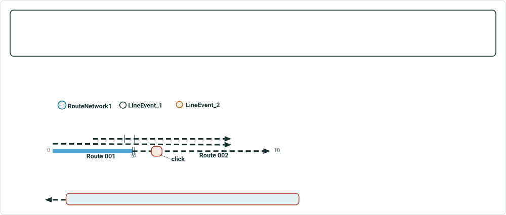

| Network | LineID | RouteID | Route Name | From Date | To Date |
| --- | --- | --- | --- | --- | --- |
| RouteNetwork1 | Line A | 001 | Route 001 | 1/1/2000 | Null |
| RouteNetwork1 | Line A | 002 | Route 002 | 1/1/2000 | Null |


| Event | FromRouteID | From Route Name | To Route ID | To Route Name | From Date | To Date | From Meas | To Meas | Attribute1 |
| --- | --- | --- | --- | --- | --- | --- | --- | --- | --- |
| LineEvent_1 | 001 | Route 001 | 002 | Route 002 | 1/1/2000 | Null | 3 | 6 | Open |
| LineEvent_2 | 001 | Route 001 | 002 | Route 002 | 1/1/2000 | Null | 0 | 6 | Poor |

Route does not exist at clicked location

## Slide 23

LRS Identify Regression Tests – Multiple Event Time-slices
E-22.) Multiple line events exist with multiple time-slices at the clicked location. Route has one time-slice.
Expected Result:
Identify Results displays all route and events present at the clicked location. Only time-slices that exist at clicked location are shown. Coordinate is displayed.
With coordinate toggle ON + Point and Line Attribute Sets toggle ON


| Network | RouteID | Route Name | From Date | To Date |
| --- | --- | --- | --- | --- |
| RouteNetwork1 | 001 | Route 001 | 1/1/2000 | Null |

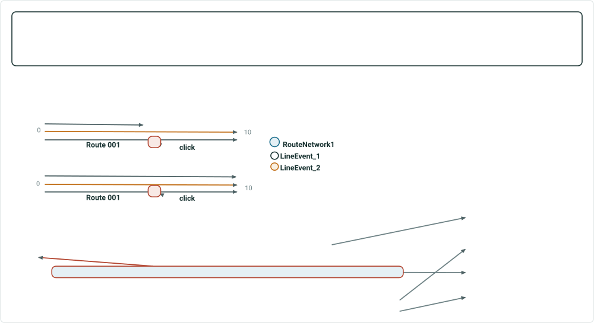

| Event | RouteID | Route Name | From Date | To Date | From Meas | To Meas | Attribute1 |
| --- | --- | --- | --- | --- | --- | --- | --- |
| LineEvent_1 | 001 | Route 001 | 1/1/2000 | 1/1/2010 | 0 | 5 | Open |
| LineEvent_1 | 001 | Route 001 | 1/1/2010 | Null | 0 | 10 | Shut |
| LineEvent_2 | 001 | Route 001 | 1/1/2000 | 1/1/2010 | 0 | 10 | Good |
| LineEvent_2 | 001 | Route 001 | 1/1/2010 | Null | 0 | 10 | Poor |

Events: 1/1/2000 – 1/1/2010
Events: 1/1/2010 – Null

Time-slice does not exist at clicked location

## Slide 24


LRS Identify Regression Tests – Multiple Event Time-slices
E-23.) Multiple time-slices of the route and events exist
Expected Result:
Identify Results displays all route and event time-slices that exist at clicked location. Events are filtered by the route time-slice. Same coordinate is displayed for all time-slices.
With coordinate toggle ON + Point and Line Attribute Sets toggle ON

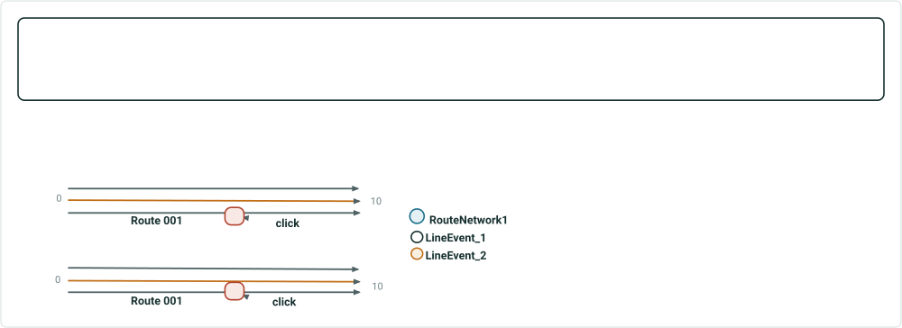

| Network | RouteID | Route Name | From Date | To Date |
| --- | --- | --- | --- | --- |
| RouteNetwork1 | 001 | Route 001 | 1/1/2000 | 1/1/2010 |
| RouteNetwork1 | 001 | Route 001 | 1/1/2010 | Null |


| Event | RouteID | Route Name | From Date | To Date | From Meas | To Meas | Attribute1 |
| --- | --- | --- | --- | --- | --- | --- | --- |
| LineEvent_1 | 001 | Route 001 | 1/1/2000 | 1/1/2010 | 0 | 10 | Open |
| LineEvent_1 | 001 | Route 001 | 1/1/2010 | Null | 0 | 10 | Shut |
| LineEvent_2 | 001 | Route 001 | 1/1/2000 | 1/1/2010 | 0 | 10 | Good |
| LineEvent_2 | 001 | Route 001 | 1/1/2010 | Null | 0 | 10 | Poor |

Route: 1/1/2000 – 1/1/2010
Route: 1/1/2010 – Null

## Slide 25

LRS Identify Regression Tests – Date Filter
E-24.) Date Filter widget is added to ExB and set to a single date.
Expected Result:
Identify Results displays all route and event time-slices that exist on the filtered date and clicked location. Same coordinate is displayed for all time-slices.
With coordinate toggle ON + Point and Line Attribute Sets toggle ON

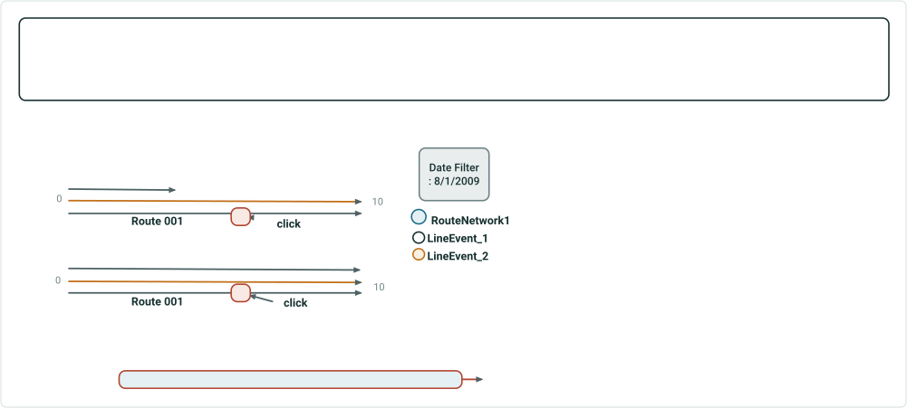

| Network | RouteID | Route Name | From Date | To Date |
| --- | --- | --- | --- | --- |
| RouteNetwork1 | 001 | Route 001 | 1/1/2000 | 1/1/2010 |
| RouteNetwork1 | 001 | Route 001 | 1/1/2010 | Null |


| Event | RouteID | Route Name | From Date | To Date | From Meas | To Meas | Attribute1 |
| --- | --- | --- | --- | --- | --- | --- | --- |
| LineEvent_1 | 001 | Route 001 | 1/1/2000 | 1/1/2010 | 0 | 4 | Open |
| LineEvent_1 | 001 | Route 001 | 1/1/2010 | Null | 0 | 10 | Shut |
| LineEvent_2 | 001 | Route 001 | 1/1/2000 | 1/1/2010 | 0 | 10 | Good |
| LineEvent_2 | 001 | Route 001 | 1/1/2010 | Null | 0 | 10 | Poor |

Route: 1/1/2000 – 1/1/2010
Route: 1/1/2010 – Null

Date Filter:
8/1/2009

Time-slice does not exist on filtered date

## Slide 26


LRS Identify Regression Tests – Date Filter
E-25.) Date Filter widget is added to ExB and set to a date range.
Expected Result:
Identify Results displays all route and event time-slices that exist within the filtered date range and at the clicked location. Same coordinate is displayed for all time-slices.
With coordinate toggle ON + Point and Line Attribute Sets toggle ON

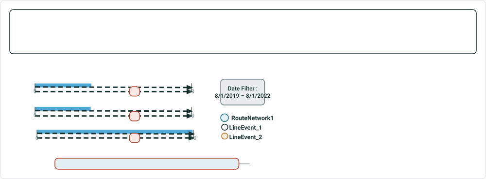

| Network | RouteID | Route Name | From Date | To Date |
| --- | --- | --- | --- | --- |
| RouteNetwork1 | 001 | Route 001 | 1/1/2000 | 1/1/2010 |
| RouteNetwork1 | 001 | Route 001 | 1/1/2010 | 1/1/2020 |
| RouteNetwork1 | 001 | Route 001 | 1/1/2020 | Null |


| Event | RouteID | Route Name | From Date | To Date | From Meas | To Meas | Attribute1 |
| --- | --- | --- | --- | --- | --- | --- | --- |
| LineEvent_1 | 001 | Route 001 | 1/1/2000 | 1/1/2010 | 0 | 4 | Shut |
| LineEvent_1 | 001 | Route 001 | 1/1/2010 | 1/1/2020 | 0 | 4 | Shut |
| LineEvent_1 | 001 | Route 001 | 1/1/2020 | Null | 0 | 10 | Open |
| LineEvent_2 | 001 | Route 001 | 1/1/2000 | 1/1/2010 | 0 | 10 | Good |
| LineEvent_2 | 001 | Route 001 | 1/1/2010 | 1/1/2020 | 0 | 10 | Poor |
| LineEvent_2 | 001 | Route 001 | 1/1/2020 | Null | 0 | 10 | Poor |

Route 001: 1/1/2000 – 1/1/2010
Route 001: 1/1/2020 – Null
Date Filter:
8/1/2019 – 8/1/2022
Route 001: 1/1/2010 – 1/1/2020

Time-slice does not exist within filtered date range

## Slide 27

LRS Identify Regression Tests

| # | Test | Expected result |
| --- | --- | --- |
| F-1 | Multiple routes exist at the clicked location from the same network | Identify Results has 2 pages and displays one route per page. Coordinate is not displayed. |
| F-2 | Multiple routes with different networks exist at the clicked location | Network in Identify Results is a dropdown field with options to select different Networks. Default Network displays first. Coordinate is not displayed. |
| F-3 | Multiple routes with different networks exist at the clicked location, but one network is turned off in the configuration | Identify Results displays the route belonging to the Network that is turned on. Network dropdown menu does not display the Network that is turned off. Coordinate is not displayed. |
| F-4 | Multiple routes with different networks exist at the clicked location, but one network is turned off in the map | Identify Results displays the route belonging to the Network that is turned on. Network dropdown menu does not display the Network that is turned off. Coordinate is not displayed. |
| F-5 | Click a location where two routes intersect | Identify Results has 2 pages and displays one route per page. Coordinate is not displayed. |
| F-6 | Click a location where the end of one route meets the start of another route | Identify Results has 2 pages and displays one route per page. Coordinate is not displayed. |
| F-7 | Click the location where a lollipop route self-intersects | Identify Results displays route and both measures. Coordinate is not displayed. |
| F-8 | Click the location where a branch route self-intersects | Identify Results displays route and both measures. Coordinate is not displayed. |

Repeat all regression tests with coordinate toggle OFF

## Slide 28

LRS Identify Regression Tests

| # | Test | Expected result |
| --- | --- | --- |
| F-9 | Click the location where a loop route self-intersects | Identify Results displays route and both measures. Coordinate is not displayed. |
| F-10 | Click the location where an infinity route self-intersects | Identify Results displays route and three measures. Coordinate is not displayed. |
| F-11 | Click the location where a route intersects a loop route. The clicked location is where the loop route self-intersects | Identify Results has 2 pages and displays one route per page. Coordinate is not displayed. |
| F-12 | Multiple time-slices exist at the clicked location | Identify Results displays all time-slices in the date field dropdown. Coordinate is not displayed. |
| F-13 | Multiple time-slices of the route exist, but they do not all exist at the clicked location | Identify Results displays all time-slices in the date field dropdown that exist at the clicked location. Coordinate is not displayed. |
| F-14 | Network is configured to not show extra business fields | Identify Results displays all route attributes except business fields that are configured to be hidden. Coordinate is not displayed. |
| F-15 | No routes exist at the clicked location | Identify Results not returned. Identify stays enabled so user does not have to select Identify again before their next click. |
| F-16 | Multiple line and point events exist at the clicked location | Identify Results displays all events and their attributes present at the clicked location. Coordinate is not displayed. |
| F-17 | Multiple overlapping line events within the same event layer exist at the clicked location | Identify Results displays route and all events present at the clicked location. Coordinate is not displayed. |

Repeat all regression tests with coordinate toggle OFF

## Slide 29

LRS Identify Regression Tests

| # | Test | Expected result |
| --- | --- | --- |
| F-18 | The clicked location is where the start of one event and the end of another event meet (same event layer) | Identify Results displays route and all events that exist at the clicked measure. Coordinate is not displayed. |
| F-19 | Multiple events exist at the clicked location, but some events are turned off in map | Identify Results displays route and events. Only events that exist at the clicked location and turned on in the map are shown. Coordinate is not displayed. |
| F-20 | Multiple events exist at the clicked location, but all events are not present in the configured attribute set | Identify Results displays route and events. Only events that exist at the clicked location and are present in the configured attribute set are shown. Coordinate is not displayed. |
| F-21 | The clicked location is where a spanning event exists | Identify Results displays route and all events that exist at the clicked measure. Coordinate is not displayed. |
| F-22 | Multiple line events exist with multiple time-slices at the clicked location. Route has one time-slice. | Identify Results displays all route and events present at the clicked location. Only time-slices that exist at clicked location are shown. Coordinate is not displayed. |
| F-23 | Multiple time-slices of the route and events exist | Identify Results displays all route and event time-slices that exist at clicked location. Coordinate is not displayed. |
| F-24 | Date Filter widget is added to ExB and set to a single date | Identify Results displays all route and event time-slices that exist on the filtered date and clicked location. Coordinate is not displayed. |
| F-25 | Date Filter widget is added to ExB and set to a date range | Identify Results displays all route and event time-slices that exist within the filtered date range and at the clicked location. Coordinate is not displayed. |

Repeat all regression tests with coordinate toggle OFF

## Slide 30

LRS Identify Regression Tests – Data Actions

| # | Test | Expected result |
| --- | --- | --- |
| G-1 | Identify a route and then Data Action>Dynamic Segmentation | Identified route opens in the Dynamic Segmentation widget. |
| G-2 | With a route already populating the Dynamic Segmentation widget, identify a route and then Data Action>Dynamic Segmentation | The previous route is cleared, and the identified route opens in the Dynamic Segmentation widget. |
| G-3 | Identify a route and then Data Action>Add Point Event | Identified route is populated in Route ID/Name field and identified measure is populated in Measure field in the Add Point Event widget. |
| G-4 | With a route & measure already populating the Add Point Event widget, identify a route and then Data Action>Add Point Event | The previous route & measure are cleared, and the identified route & measure populates the Add Point Event widget. |
| G-5 | Identify a route and then Data Action>Add Line Event (From) | Identified route is populated in From Route ID/Name field and identified measure is populated in Measure field in the Add Line Event widget. |
| G-6 | With a from route & measure already populating the Add Line Event widget, identify a route and then Data Action>Add Line Event (From) | The previous from route & measure are cleared, and the identified route & measure populates the Add Line Event widget for From Route. |
| G-7 | Identify a route and then Data Action>Add Line Event (To) | Identified route is populated in To Route ID/Name field and identified measure is populated in Measure field in the Add Line Event widget. |
| G-8 | With a to route & measure already populating the Add Line Event widget, identify a route and then Data Action>Add Line Event (To) | The previous from route & measure are cleared, and the identified route & measure populates the Add Line Event widget for To Route. |
| G-9 | Identify a route and then Data Action>View in Table | Identified route is populated in the Table widget |
| G-10 | Identify a location with multiple routes and routes have time-slices. Then Data Action>All data>Add to Table | Identified routes and time-slices are populated in the Table widget |
| G-11 | Identify a route and then Data Action>Pan to | Map pans to the identified location |
| G-12 | Identify a route and then Data Action>Zoom to | Map zooms to the identified location |
| G-13 | Identify a route and then Data Action>Export | Identified routes are exported in the chosen file type |

With LRS Identify, Add Point Event, Add Line Event, Dynamic Segmentation, and Table widget added to ExB
