# LRS Identify Widget Test Plan

|   |   |
| --- | --- |
| **Kind** | Test Plan · Experience Builder |
| **Release** | — |
| **Issue** | [Beijing-R-D-Center/ExperienceBuilder-Web-Extensions#16568](https://devtopia.esri.com/Beijing-R-D-Center/ExperienceBuilder-Web-Extensions/issues/16568) · [Beijing-R-D-Center/ExperienceBuilder-Web-Extensions#16569](https://devtopia.esri.com/Beijing-R-D-Center/ExperienceBuilder-Web-Extensions/issues/16569) |
| **Source** | [16568&16569-LRSIdentify_TestPlanV2.pptx](<https://esriis.sharepoint.com/sites/LocationReferencing/Shared%20Documents/General/Test%20Plans/16568%2616569-LRSIdentify_TestPlanV2.pptx>) |
| **Edited** | 2023-12-18 20:52 by Mac Christmas |
| **Extracted** | 2026-09-04 · lane `xmlstrip` |

<!-- metadata
```yaml
title: "LRS Identify Widget Test Plan"
source_file: "16568&16569-LRSIdentify_TestPlanV2.pptx"
source_url: "https://esriis.sharepoint.com/sites/LocationReferencing/Shared%20Documents/General/Test%20Plans/16568%2616569-LRSIdentify_TestPlanV2.pptx"
doc_id: 452
doc_kind: "Test Plan"
surface: "Experience Builder"
doc_revision: "V2"
target_release: ""
pe: ""
dev: ""
author: "Mac Christmas"
last_edited_by: "Mac Christmas"
last_edited: "2023-12-18T20:52:34Z"
extracted: 2026-09-04
extraction_lane: xmlstrip
prompt_version: "v2.0.2"
keywords: ["identify widget", "routes", "events", "line network", "non line network", "point event", "route identification", "event information", "attribute set", "time slice", "spatial reference", "paging", "overlapping events", "spanning events", "PoM network", "map tolerance", "event attribute", "network layer", "event layer"]
tools: ["LRS Identify"]
products: []
issues: ["Beijing-R-D-Center/ExperienceBuilder-Web-Extensions#16568", "Beijing-R-D-Center/ExperienceBuilder-Web-Extensions#16569"]
related: [{"doc":459,"file":"split-event-widget-test-plan__doc459.md","s":3.394},{"doc":437,"file":"merge-events-widget-test-plan__doc437.md","s":3.169},{"doc":859,"file":"lrs-identify-show-coordinates-in-results-experience-builder-widget-test-plan__doc859.md","s":3.154},{"doc":592,"file":"dynamic-segmentation-merge-option-test-plan__doc592.md","s":3.044},{"doc":457,"file":"experience-builder-add-multiple-line-events-widget-test-plan__doc457.md","s":2.986}]
```
-->

## Summary

Test plan for the LRS Identify widget in Experience Builder covering identification of routes and events on line and non-line networks. Includes positive and negative configuration tests, UI behavior, handling of multiple routes, time slices, overlapping events, and event information display options. Tests cover projected and unprojected data, various spatial references, and different network configurations including PoM and spanning events.

## Related documents

<!-- related:begin -->
- [Split Event Widget Test Plan](<https://esriis.sharepoint.com/sites/lrsworkspace/LRS Doc Index/Test Plans/split-event-widget-test-plan__doc459.md>) — similar text 0.18 · 1 title word · same kind/surface/folder <!-- rel:459 -->
- [Merge Events Widget Test Plan](<https://esriis.sharepoint.com/sites/lrsworkspace/LRS Doc Index/Test Plans/merge-events-widget-test-plan__doc437.md>) — similar text 0.17 · 1 title word · same kind/surface/folder <!-- rel:437 -->
- [LRS Identify: Show Coordinates in Results Experience Builder Widget Test Plan](<https://esriis.sharepoint.com/sites/lrsworkspace/LRS%20Doc%20Index/Test%20Plans/lrs-identify-show-coordinates-in-results-experience-builder-widget-test-plan__doc859.md>) — similar text 0.17 · 2 title words · same kind/surface/folder <!-- rel:859 -->
- [Dynamic Segmentation Merge Option Test Plan](<https://esriis.sharepoint.com/sites/lrsworkspace/LRS Doc Index/Test Plans/dynamic-segmentation-merge-option-test-plan__doc592.md>) — similar text 0.21 · same kind/surface/folder <!-- rel:592 -->
- [Experience Builder: Add Multiple Line Events Widget Test Plan](<https://esriis.sharepoint.com/sites/lrsworkspace/LRS Doc Index/Test Plans/experience-builder-add-multiple-line-events-widget-test-plan__doc457.md>) — similar text 0.17 · 1 title word · same kind/surface/folder <!-- rel:457 -->
<!-- related:end -->

<!-- docs:begin -->
## Esri documentation

[Storing referent and offset information for event location](https://doc.esri.com/en/arcgis-pro/latest/help/production/location-referencing-pipelines/storing-referent-and-offset-information-for-event-location.html) · [Event editing using the attribute table](https://doc.esri.com/en/arcgis-pro/latest/help/production/location-referencing-pipelines/event-editing-using-the-attribute-table.html)

_No page matched:_ [LRS Identify](https://www.google.com/search?q=%22LRS%20Identify%22+site%3Adoc.esri.com)
<!-- docs:end -->

---

## Slide 1

LRS Identify Widget

| Notes |
| --- |
| The user story has been split into Identify Routes and Identify Events. This test plan will cover both functionalities Add Identify Widget to Experience Builder Test on line and non-line networks (including PoM) Test with auto-generated, single-field, and multi-field RouteID configurations Test on spanning and non-spanning line events (point events are excluded for now) Test with projected and unprojected data, including a variety of spatial references Test with networks with and without events Identification of event information is optional Attribute Sets can only be edited/updated in Pro Test with various themes Test in Chrome and Edge (other browsers will be covered in automation) |

Devtopia Issue (Routes)
Devtopia Issue (Events)

 

## Slide 2

| Positive Tests: Configuration |
| --- |
| A map can be chosen If more than one map exists within the app, list all maps in the Select a map dropdown Line event and network layers can be imported from the map (no point events) Missing layers can be added using the New Editable Layer option Layers can be reordered Layers can be removed by clicking the X button Clicking on Clear layers will remove all the imported layers If some layers are removed, clicking on Load layers will only import the missing layers When another web map is chosen, clear the layers from the list A default LRS network layer can be chosen The LRS network layer’s label can be edited By default, LRS network LRS fields and business fields show in the results (hide shape, shape_length, editor tracking fields, etc.) LRS network system fields can be configured to appear in the results LRS network attribute fields can be selected/unselected to show in the UI If the input network is PoM, allow for Show Event Information to be configured, but no events will be displayed All event layer attribute fields will be configured in the chosen Event Attribute Set Use field alias should be enabled by default User can configure whether event information is returned or not |

| Negative Tests: Configuration |
| --- |
| Show error if no LRS enabled layers in the chosen web map when attempting to import layer No line event layers are imported from the map LRS parent network is not within the web map Chosen web map has more than one service No Attribute Set published with map, event information will be unavailable |

## Slide 3

| Positive Tests: UI |
| --- |
| When no route exists at the clicked location, do not have a pop-up and keep cursor experience the same so the user can click again to get a valid location without having to reactivate the tool When a route is clicked, the configured default network is shown in the Network parameter If only one LRS network is configured, the Network dropdown will be disabled If more than one LRS network is configured, the Network dropdown will show other LRS networks Configured Route information will appear when a valid route is picked in the map, including configured LRS network attributes (this includes the Network name, RouteID (and RouteName if configured), Clicked Location Measure, Min Measure, Max Measure, and the time slice information) Depending on the route identifier configuration, show the relevant RouteID vs. RouteName information If the chosen LRS network has a multi-field RouteID, show the concatenated RouteID in the RouteID parameter and show the individual RouteID fields in the attribute section Use the configured map tolerance to determine whether a route is present and the clicked location When Show event information is disabled, only show the Route information and its attributes If time is disabled for the map or multiple time slices are visible in the map, the Time dropdown parameter can be used to select specific time slices of the route If only one time slice exists, disable the dropdown If multiple routes in the same network occur at the clicked location, a paging experience allows the user to switch between picked routes If multiple measures exist on the same route at the clicked location, show the multiple measures in the Measure parameter (like we do in Pro) Add a marker to the clicked location When the widget is closed, remove the marker from the map Marker should update when a new location is clicked Route information in the route table should be highlight-able and copy-able Attributes from the route and event tables should be highlight-able and copy-able Event information can be hidden by clicking Hide Event information accordion arrow Event information will be displayed in the event table as EventName.Field in the first column and its value in the second column If the EventName.Field or Value is too long to fit in the column, what fits will show plus a “…” When hovering over a value that is too long to fit in the column, the hidden information will show If no events occur where the user has clicked along a route, show a message in the events table section that lets the user know that no events occur at the clicked location If only some events within the configured Attribute Set exist at the clicked location, only show the event information for the existing events If overlapping line events occur at the clicked location, show each event in a different row with a (1), (2), (3)… to differentiate between events If the results are too large to fit within the widget to where a scroll bar is needed, make sure the widget is scrollable from Network to the last EventName.Field result in the Event table |

## Slide 4

| Positive Tests |
| --- |
| Network only, event info turned off. Network has all fields configured to display Network only, event info turned off. Network does not have extra business fields configured Network only, event info turned off. No route exists at the clicked location Network only, event info turned off. Multiple routes exist at the clicked location, paging experience allows user to see all events at the clicked location Network only, event info turned off. Multiple time slices of a route exist, time dropdown allows user to see all time slices of route Network and event info turned on. Network and events have all fields configured to display Network and event info turned on. Network and events have some fields configured to display Network and event info turned on. No events exist at the clicked location, only the network info will be returned Network and event info turned on. Some events in the configured Attribute Set exist at the clicked location and only these events will be returned Line network and event info turned on. Spanning events exist at the clicked location PoM network. Only network information is returned Network and event info turned on. Multiple time slices of the same route and its events exist at the clicked location. Adjusting the Time dropdown allows for an accurate view of the route and its events over time Network and event info turned on. Multiple overlapping events within the same event layer exist at the clicked location, different event records are differentiated by a (1), (2), (3)… Network and event info turned on. Clicked location is the exact overlapping measure of two events within the same event layer, each event record is differentiated by a (1) and (2) Network and event info turned on. Multiple measures on the same route exist at the clicked location Network and event info turned on. Multiple routes within different LRS networks exist at the clicked location Network and event info turned on. Clicked location is the intersection of 2 routes Network and event info turned on. Route has single time slice, but events have multiple Network and event info turned on. Clicked location is the end/start of 2 routes Network and event info turned on. Clicked location has concurrent routes of different networks, but one network is not enabled to display in map Network and event info turned on. Multiple measures on the same route exist at the clicked location. Event spans whole route, including the intersecting measures Network and event info turned on. Multiple events exist at the clicked location but only a subset are within the configured Attribute Set Network and event info turned on with time filter set in map. Time filter filters the results of the tool |

## Case 1 <!-- slide 5 -->

### Network Only, Event Info Turned Off. Network Has All Fields

**Network only, event info turned off. Network has all fields configured to display**

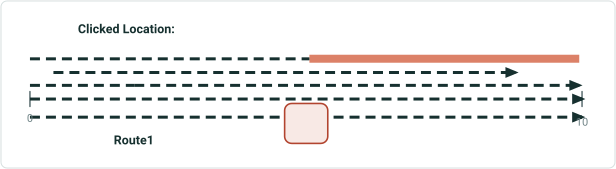

| LRS Identify Results |  |  |  |  |  | X |
| --- | --- | --- | --- | --- | --- | --- |
| Network: | CountyLog |  |  | > |  |  |
| RouteID: | 001 |  |  |  |  |  |
| RouteName: | Route1 |  |  |  |  |  |
| Min Measure: | 0 miles |  |  |  |  |  |
| Max Measure: | 10 miles |  |  |  |  |  |
| Measure: | 5 miles |  |  |  |  |  |
| Time: | 1/1/2000 to <Null> |  |  |  | > |  |
|  |  |  |  |  |  |  |
| Attribute | Value |  |  |  |  |  |
| Jurisdiction | Local |  |  |  |  |  |
| County | Adams |  |  |  |  |  |
| Shape | Polyline ZM |  |  |  |  |  |
| Shape_Length | 52800 |  |  |  |  |  |
| Creation User | User1 |  |  |  |  |  |
| Created Date | 1/1/2000 08:30:10 AM |  |  |  |  |  |
| Last User | User2 |  |  |  |  |  |
| Date Modified | 1/1/2010 09:45:12 AM |  |  |  |  |  |
| GlobalID | {61898661-FCDD-46EB-A83C-1E0E5A6F932A} |  |  |  |  |  |
|  |  |  |  |  |  |  |
| Hide Event Information |  |  | > |  |  |  |
| No event information to display |  |  |  |  |  |  |

| Network Layer | RouteID | Route Name | From Date | ToDate | Jurisdiction | County |
| --- | --- | --- | --- | --- | --- | --- |
| CountyLog | 001 | Route1 | 1/1/2000 | <Null> | Local | Adams |

| Event Layer | RouteID | Route Name | From Date | To Date | From Measure | To Measure | Attribute1 | Attribute2 |
| --- | --- | --- | --- | --- | --- | --- | --- | --- |
| Speed | 001 | Route1 | 1/1/2000 | <Null> | 0 | 10 | 45 MPH | Active |
| Access_Control | 001 | Route1 | 1/1/2000 | <Null> | 0 | 2 | Full Access | Active |
| Access_Control | 001 | Route1 | 1/1/2000 | <Null> | 2 | 10 | No Access | Active |
| Facility_Type | 001 | Route1 | 1/1/2000 | <Null> | 1 | 9 | One-Way | Active |
| Functional_Class | 001 | Route1 | 1/1/2000 | <Null> | 0 | 5 | Minor | Active |
| Pavement_Condition | 001 | Route1 | 1/1/2000 | <Null> | 5 | 10 | 2009 | Retired |

## Case 2 <!-- slide 6 -->

### Network Only, Event Info Turned Off. Network Does Not Have

**Network only, event info turned off. Network does not have extra business fields configured**


| LRS Identify Results |  |  |  |  |  | X |
| --- | --- | --- | --- | --- | --- | --- |
| Network: | CountyLog |  |  | > |  |  |
| RouteID: | 001 |  |  |  |  |  |
| RouteName: | Route1 |  |  |  |  |  |
| Min Measure: | 0 miles |  |  |  |  |  |
| Max Measure: | 10 miles |  |  |  |  |  |
| Measure: | 5 miles |  |  |  |  |  |
| Time: | 1/1/2000 to <Null> |  |  |  | > |  |
|  |  |  |  |  |  |  |
| Attribute | Value |  |  |  |  |  |
| Shape | Polyline ZM |  |  |  |  |  |
| Shape_Length | 52800 |  |  |  |  |  |
| Creation User | User1 |  |  |  |  |  |
| Created Date | 1/1/2000 08:30:10 AM |  |  |  |  |  |
| Last User | User2 |  |  |  |  |  |
| Date Modified | 1/1/2010 09:45:12 AM |  |  |  |  |  |
| GlobalID | {61898661-FCDD-46EB-A83C-1E0E5A6F932A} |  |  |  |  |  |
|  |  |  |  |  |  |  |
| Hide Event Information |  |  | > |  |  |  |
| No event information to display |  |  |  |  |  |  |

| Network Layer | RouteID | Route Name | From Date | ToDate | Jurisdiction | County |
| --- | --- | --- | --- | --- | --- | --- |
| CountyLog | 001 | Route1 | 1/1/2000 | <Null> | Local | Adams |

| Event Layer | RouteID | Route Name | From Date | To Date | From Measure | To Measure | Attribute1 | Attribute2 |
| --- | --- | --- | --- | --- | --- | --- | --- | --- |
| Speed | 001 | Route1 | 1/1/2000 | <Null> | 0 | 10 | 45 MPH | Active |
| Access_Control | 001 | Route1 | 1/1/2000 | <Null> | 0 | 2 | Full Access | Active |
| Access_Control | 001 | Route1 | 1/1/2000 | <Null> | 2 | 10 | No Access | Active |
| Facility_Type | 001 | Route1 | 1/1/2000 | <Null> | 1 | 9 | One-Way | Active |
| Functional_Class | 001 | Route1 | 1/1/2000 | <Null> | 0 | 5 | Minor | Active |
| Pavement_Condition | 001 | Route1 | 1/1/2000 | <Null> | 5 | 10 | 2009 | Retired |

## Case 3 <!-- slide 7 -->

### Network Only, Event Info Turned Off. No Route Exists at the

**Network only, event info turned off. No route exists at the clicked location**

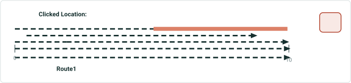

| Network Layer | RouteID | Route Name | From Date | ToDate | Jurisdiction | County |
| --- | --- | --- | --- | --- | --- | --- |
| CountyLog | 001 | Route1 | 1/1/2000 | <Null> | Local | Adams |

| Event Layer | RouteID | Route Name | From Date | To Date | From Measure | To Measure | Attribute1 | Attribute2 |
| --- | --- | --- | --- | --- | --- | --- | --- | --- |
| Speed | 001 | Route1 | 1/1/2000 | <Null> | 0 | 10 | 45 MPH | Active |
| Access_Control | 001 | Route1 | 1/1/2000 | <Null> | 0 | 2 | Full Access | Active |
| Access_Control | 001 | Route1 | 1/1/2000 | <Null> | 2 | 10 | No Access | Active |
| Facility_Type | 001 | Route1 | 1/1/2000 | <Null> | 1 | 9 | One-Way | Active |
| Functional_Class | 001 | Route1 | 1/1/2000 | <Null> | 0 | 5 | Minor | Active |
| Pavement_Condition | 001 | Route1 | 1/1/2000 | <Null> | 5 | 10 | 2009 | Retired |

## Case 4 <!-- slide 8 -->

### Network Only, Event Info Turned Off. Multiple Routes Exist

**Network only, event info turned off. Multiple routes exist at the clicked location, paging experience allows user to see all events at the clicked location**

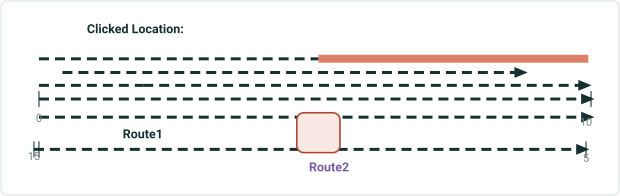

| LRS Identify Results (Page 1) |  |  |  |  |  | X |
| --- | --- | --- | --- | --- | --- | --- |
| Network: | CountyLog |  |  | > |  |  |
| RouteID: | 001 |  |  |  |  |  |
| RouteName: | Route1 |  |  |  |  |  |
| Min Measure: | 0 miles |  |  |  |  |  |
| Max Measure: | 10 miles |  |  |  |  |  |
| Measure: | 5 miles |  |  |  |  |  |
| Time: | 1/1/2000 to <Null> |  |  |  | > |  |
|  |  |  |  |  |  |  |
| Attribute | Value |  |  |  |  |  |
| Jurisdiction | Local |  |  |  |  |  |
| County | Adams |  |  |  |  |  |
| Shape | Polyline ZM |  |  |  |  |  |
| Shape_Length | 52800 |  |  |  |  |  |
| Creation User | User1 |  |  |  |  |  |
| Created Date | 1/1/2000 08:30:10 AM |  |  |  |  |  |
| Last User | User2 |  |  |  |  |  |
| Date Modified | 1/1/2010 09:45:12 AM |  |  |  |  |  |
| GlobalID | {61898661-FCDD-46EB-A83C-1E0E5A6F932A} |  |  |  |  |  |
|  |  |  |  |  |  |  |
| Hide Event Information |  |  | > |  |  |  |
| No event information to display |  |  |  |  |  |  |

| Network Layer | RouteID | Route Name | From Date | ToDate | Jurisdiction | County |
| --- | --- | --- | --- | --- | --- | --- |
| CountyLog | 001 | Route1 | 1/1/2000 | <Null> | Local | Adams |
| CountyLog | 002 | Route2 | 1/1/2000 | <Null> | State | Adams |

| LRS Identify Results (Page 2) |  |  |  |  |  | X |
| --- | --- | --- | --- | --- | --- | --- |
| Network: | CountyLog |  |  | > |  |  |
| RouteID: | 002 |  |  |  |  |  |
| RouteName: | Route2 |  |  |  |  |  |
| Min Measure: | 5 miles |  |  |  |  |  |
| Max Measure: | 15 miles |  |  |  |  |  |
| Measure: | 10 miles |  |  |  |  |  |
| Time: | 1/1/2000 to <Null> |  |  |  | > |  |
|  |  |  |  |  |  |  |
| Attribute | Value |  |  |  |  |  |
| Jurisdiction | State |  |  |  |  |  |
| County | Adams |  |  |  |  |  |
| Shape | Polyline ZM |  |  |  |  |  |
| Shape_Length | 52800 |  |  |  |  |  |
| Creation User | User2 |  |  |  |  |  |
| Created Date | 12/15/1999 3:45:05 PM |  |  |  |  |  |
| Last User | User1 |  |  |  |  |  |
| Date Modified | 1/1/2009 12:36:48 PM |  |  |  |  |  |
| GlobalID | {574FF57A-2FE6-42E0-9998-96CE834468B1} |  |  |  |  |  |
|  |  |  |  |  |  |  |
| Hide Event Information |  |  | > |  |  |  |
| No event information to display |  |  |  |  |  |  |

## Case 5 <!-- slide 9 -->

### Network Only, Event Info Turned Off. Multiple Time Slices of

**Network only, event info turned off. Multiple time slices of a route exist, time dropdown allows user to see all time slices of route**

| LRS Identify Results |  |  |  |  | X |
| --- | --- | --- | --- | --- | --- |
| Network: | CountyLog |  |  | > |  |
| RouteID: | 001 |  |  |  |  |
| RouteName: | Route1 |  |  |  |  |
| Min Measure: | 0 miles |  |  |  |  |
| Max Measure: | 10 miles |  |  |  |  |
| Measure: | 7.5 miles |  |  |  |  |
| Time: | 1/1/2000 to 1/1/2005 |  |  |  | > |
|  |  |  |  |  |  |
| Attribute | Value |  |  |  |  |
| Jurisdiction | Local |  |  |  |  |
| County | Adams |  |  |  |  |
| Shape | Polyline ZM |  |  |  |  |
| Shape_Length | 52800 |  |  |  |  |
| Creation User | User1 |  |  |  |  |
| Created Date | 1/1/2000 08:30:10 AM |  |  |  |  |
| Last User | User2 |  |  |  |  |
| Date Modified | 1/1/2010 09:45:12 AM |  |  |  |  |
| GlobalID | {61898661-FCDD-46EB-A83C-1E0E5A6F932A} |  |  |  |  |
|  |  |  |  |  |  |
| Hide Event Information |  |  | > |  |  |
| No event information to display |  |  |  |  |  |

| Network Layer | RouteID | Route Name | From Date | ToDate | Jurisdiction | County |
| --- | --- | --- | --- | --- | --- | --- |
| CountyLog | 001 | Route1 | 1/1/2000 | 1/1/2005 | Local | Adams |
| CountyLog | 001 | Route1 | 1/1/2005 | 1/1/2010 | County | Adams |
| CountyLog | 001 | Route1 | 1/1/2010 | <Null> | State | Adams |

Route1 (1/1/2000 to 1/1/2005)

| LRS Identify Results |  |  |  |  | X |
| --- | --- | --- | --- | --- | --- |
| Network: | CountyLog |  |  | > |  |
| RouteID: | 002 |  |  |  |  |
| RouteName: | Route2 |  |  |  |  |
| Min Measure: | 0 miles |  |  |  |  |
| Max Measure: | 20 miles |  |  |  |  |
| Measure: | 15 miles |  |  |  |  |
| Time: | 1/1/2005 to 1/1/2010 |  |  |  | > |
|  |  |  |  |  |  |
| Attribute | Value |  |  |  |  |
| Jurisdiction | County |  |  |  |  |
| County | Adams |  |  |  |  |
| Shape | Polyline ZM |  |  |  |  |
| Shape_Length | 105600 |  |  |  |  |
| Creation User | User2 |  |  |  |  |
| Created Date | 10/06/2004 8:32:05 PM |  |  |  |  |
| Last User | User1 |  |  |  |  |
| Date Modified | 1/1/2009 12:36:48 PM |  |  |  |  |
| GlobalID | {574FF57A-2FE6-42E0-9998-96CE834468B1} |  |  |  |  |
|  |  |  |  |  |  |
| Hide Event Information |  |  | > |  |  |
| No event information to display |  |  |  |  |  |

Route1 (1/1/2005 to 1/1/2010)
Route1 (1/1/2010 to <Null>)

| LRS Identify Results |  |  |  |  | X |
| --- | --- | --- | --- | --- | --- |
| Network: | CountyLog |  |  | > |  |
| RouteID: | 002 |  |  |  |  |
| RouteName: | Route2 |  |  |  |  |
| Min Measure: | 15 miles |  |  |  |  |
| Max Measure: | 25 miles |  |  |  |  |
| Measure: | 22.5 miles |  |  |  |  |
| Time: | 1/1/2010 to <Null> |  |  |  | > |
|  |  |  |  |  |  |
| Attribute | Value |  |  |  |  |
| Jurisdiction | State |  |  |  |  |
| County | Adams |  |  |  |  |
| Shape | Polyline ZM |  |  |  |  |
| Shape_Length | 52800 |  |  |  |  |
| Creation User | User3 |  |  |  |  |
| Created Date | 03/08/2011 5:33:58 PM |  |  |  |  |
| Last User | User3 |  |  |  |  |
| Date Modified | 1/1/2012 2:36:58 PM |  |  |  |  |
| GlobalID | {0BD374D0-B6ED-4A2C-A74C-F39577615DDF} |  |  |  |  |
|  |  |  |  |  |  |
| Hide Event Information |  |  | > |  |  |
| No event information to display |  |  |  |  |  |

[figure: 0 · 10 · Clicked Location: · 20 · 15 · 25]

## Case 6 <!-- slide 10 -->

### Network and Event Info Turned On. Network and Events Have

**Network and event info turned on. Network and events have all fields configured to display**


| LRS Identify Results |  |  |  |  |  | X |
| --- | --- | --- | --- | --- | --- | --- |
| Network: | CountyLog |  |  | > |  |  |
| RouteID: | 001 |  |  |  |  |  |
| RouteName: | Route1 |  |  |  |  |  |
| Min Measure: | 0 miles |  |  |  |  |  |
| Max Measure: | 10 miles |  |  |  |  |  |
| Measure: | 5 miles |  |  |  |  |  |
| Time: | 1/1/2000 to <Null> |  |  |  | > |  |
|  |  |  |  |  |  |  |
| Attribute | Value |  |  |  |  |  |
| Jurisdiction | Local |  |  |  |  |  |
| County | Adams |  |  |  |  |  |
| Shape | Polyline ZM |  |  |  |  |  |
| Shape_Length | 52800 |  |  |  |  |  |
| Creation User | User1 |  |  |  |  |  |
| Created Date | 1/1/2000 08:30:10 AM |  |  |  |  |  |
| Last User | User2 |  |  |  |  |  |
| Date Modified | 1/1/2010 09:45:12 AM |  |  |  |  |  |
| GlobalID | {61898661-FCDD-46EB-A83C-1E0E5A6F932A} |  |  |  |  |  |
|  |  |  |  |  |  |  |
| Hide Event Information |  |  | > |  |  |  |
| Speed.Speed_Limit |  | 45 MPH |  |  |  |  |
| Speed.Record_Status |  | Active |  |  |  |  |
| Access_Control.Access |  | No Access |  |  |  |  |
| Access_Control.Record_Status |  | Active |  |  |  |  |
| Facility_Type.Type |  | One-Way |  |  |  |  |
| Facility_Type.Record_Status |  | Active |  |  |  |  |
| Functional_Class.Class |  | Minor |  |  |  |  |
| Functional_Class.Record_Status |  | Active |  |  |  |  |
| Pavement_Condition.Data_Year |  | 2009 |  |  |  |  |
| Pavement_Condition.Record… |  | Retired |  |  |  |  |

| Network Layer | RouteID | Route Name | From Date | ToDate | Jurisdiction | County |
| --- | --- | --- | --- | --- | --- | --- |
| CountyLog | 001 | Route1 | 1/1/2000 | <Null> | Local | Adams |

| Event Layer | RouteID | Route Name | From Date | To Date | From Measure | To Measure | Attribute1 | Attribute2 |
| --- | --- | --- | --- | --- | --- | --- | --- | --- |
| Speed | 001 | Route1 | 1/1/2000 | <Null> | 0 | 10 | 45 MPH | Active |
| Access_Control | 001 | Route1 | 1/1/2000 | <Null> | 0 | 2 | Full Access | Active |
| Access_Control | 001 | Route1 | 1/1/2000 | <Null> | 2 | 10 | No Access | Active |
| Facility_Type | 001 | Route1 | 1/1/2000 | <Null> | 1 | 9 | One-Way | Active |
| Functional_Class | 001 | Route1 | 1/1/2000 | <Null> | 0 | 5 | Minor | Active |
| Pavement_Condition | 001 | Route1 | 1/1/2000 | <Null> | 5 | 10 | 2009 | Retired |

## Case 7 <!-- slide 11 -->

### Network and Event Info Turned On. Network and Events Have

**Network and event info turned on. Network and events have some fields configured to display**

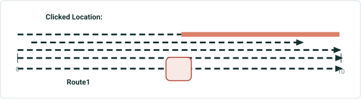

| LRS Identify Results |  |  |  |  |  | X |
| --- | --- | --- | --- | --- | --- | --- |
| Network: | CountyLog |  |  | > |  |  |
| RouteID: | 001 |  |  |  |  |  |
| RouteName: | Route1 |  |  |  |  |  |
| Min Measure: | 0 miles |  |  |  |  |  |
| Max Measure: | 10 miles |  |  |  |  |  |
| Measure: | 5 miles |  |  |  |  |  |
| Time: | 1/1/2000 to <Null> |  |  |  | > |  |
|  |  |  |  |  |  |  |
| Attribute | Value |  |  |  |  |  |
| Jurisdiction | Local |  |  |  |  |  |
| County | Adams |  |  |  |  |  |
|  |  |  |  |  |  |  |
| Hide Event Information |  |  | > |  |  |  |
| Speed.Record_Status |  | Active |  |  |  |  |
| Access_Control.Access |  | No Access |  |  |  |  |
| Facility_Type.Record_Sta… |  | Active |  |  |  |  |
| Functional_Class.Class |  | Minor |  |  |  |  |
| Pavement_Condition.Dat… |  | 2009 |  |  |  |  |

| Network Layer | RouteID | Route Name | From Date | ToDate | Jurisdiction | County |
| --- | --- | --- | --- | --- | --- | --- |
| CountyLog | 001 | Route1 | 1/1/2000 | <Null> | Local | Adams |

| Event Layer | RouteID | Route Name | From Date | To Date | From Measure | To Measure | Attribute1 | Attribute2 |
| --- | --- | --- | --- | --- | --- | --- | --- | --- |
| Speed | 001 | Route1 | 1/1/2000 | <Null> | 0 | 10 | 45 MPH | Active |
| Access_Control | 001 | Route1 | 1/1/2000 | <Null> | 0 | 2 | Full Access | Active |
| Access_Control | 001 | Route1 | 1/1/2000 | <Null> | 2 | 10 | No Access | Active |
| Facility_Type | 001 | Route1 | 1/1/2000 | <Null> | 1 | 9 | One-Way | Active |
| Functional_Class | 001 | Route1 | 1/1/2000 | <Null> | 0 | 5 | Minor | Active |
| Pavement_Condition | 001 | Route1 | 1/1/2000 | <Null> | 5 | 10 | 2009 | Retired |

## Case 8 <!-- slide 12 -->

### Use the Configured Map Tolerance To Determine Whether a

**Use the configured map tolerance to determine whether a route is present and the clicked location**

| LRS Identify Results |  |  |  |  |  | X |
| --- | --- | --- | --- | --- | --- | --- |
| Network: | CountyLog |  |  | > |  |  |
| RouteID: | 001 |  |  |  |  |  |
| RouteName: | Route1 |  |  |  |  |  |
| Min Measure: | 0 miles |  |  |  |  |  |
| Max Measure: | 10 miles |  |  |  |  |  |
| Measure: | 5 miles |  |  |  |  |  |
| Time: | 1/1/2000 to <Null> |  |  |  | > |  |
|  |  |  |  |  |  |  |
| Attribute | Value |  |  |  |  |  |
| Jurisdiction | Local |  |  |  |  |  |
| County | Adams |  |  |  |  |  |
|  |  |  |  |  |  |  |
| Hide Event Information |  |  | > |  |  |  |
| No event information to display |  |  |  |  |  |  |

| Network Layer | RouteID | Route Name | From Date | ToDate | Jurisdiction | County |
| --- | --- | --- | --- | --- | --- | --- |
| CountyLog | 001 | Route1 | 1/1/2000 | <Null> | Local | Adams |

[figure: 0 · 10 · Returned Result: · Clicked Location: · Route1]

## Case 9 <!-- slide 13 -->

### Network and Event Info Turned On. Some Events in the

**Network and event info turned on. Some events in the configured Attribute Set exist at the clicked location and only these events will be returned**

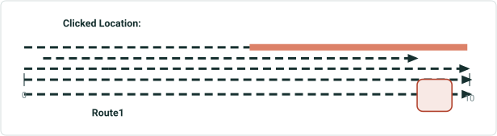

| LRS Identify Results |  |  |  |  |  | X |
| --- | --- | --- | --- | --- | --- | --- |
| Network: | CountyLog |  |  | > |  |  |
| RouteID: | 001 |  |  |  |  |  |
| RouteName: | Route1 |  |  |  |  |  |
| Min Measure: | 0 miles |  |  |  |  |  |
| Max Measure: | 10 miles |  |  |  |  |  |
| Measure: | 5 miles |  |  |  |  |  |
| Time: | 1/1/2000 to <Null> |  |  |  | > |  |
|  |  |  |  |  |  |  |
| Attribute | Value |  |  |  |  |  |
| Jurisdiction | Local |  |  |  |  |  |
| County | Adams |  |  |  |  |  |
| Shape | Polyline ZM |  |  |  |  |  |
| Shape_Length | 52800 |  |  |  |  |  |
| Creation User | User1 |  |  |  |  |  |
| Created Date | 1/1/2000 08:30:10 AM |  |  |  |  |  |
| Last User | User2 |  |  |  |  |  |
| Date Modified | 1/1/2010 09:45:12 AM |  |  |  |  |  |
| GlobalID | {61898661-FCDD-46EB-A83C-1E0E5A6F932A} |  |  |  |  |  |
|  |  |  |  |  |  |  |
| Hide Event Information |  |  | > |  |  |  |
| Speed.Speed_Limit |  | 45 MPH |  |  |  |  |
| Speed.Record_Status |  | Active |  |  |  |  |
| Access_Control.Access |  | No Access |  |  |  |  |
| Access_Control.Record_Status |  | Active |  |  |  |  |
| Pavement_Condition.Data_Year |  | 2009 |  |  |  |  |
| Pavement_Condition.Record… |  | Retired |  |  |  |  |

| Network Layer | RouteID | Route Name | From Date | ToDate | Jurisdiction | County |
| --- | --- | --- | --- | --- | --- | --- |
| CountyLog | 001 | Route1 | 1/1/2000 | <Null> | Local | Adams |

| Event Layer | RouteID | Route Name | From Date | To Date | From Measure | To Measure | Attribute1 | Attribute2 |
| --- | --- | --- | --- | --- | --- | --- | --- | --- |
| Speed | 001 | Route1 | 1/1/2000 | <Null> | 0 | 10 | 45 MPH | Active |
| Access_Control | 001 | Route1 | 1/1/2000 | <Null> | 0 | 2 | Full Access | Active |
| Access_Control | 001 | Route1 | 1/1/2000 | <Null> | 2 | 10 | No Access | Active |
| Facility_Type | 001 | Route1 | 1/1/2000 | <Null> | 1 | 9 | One-Way | Active |
| Functional_Class | 001 | Route1 | 1/1/2000 | <Null> | 0 | 5 | Minor | Active |
| Pavement_Condition | 001 | Route1 | 1/1/2000 | <Null> | 5 | 10 | 2009 | Retired |

## Case 10 <!-- slide 14 -->

### Line Network and Event Info Turned On. Spanning Events Exist

**Line network and event info turned on. Spanning events exist at the clicked location**

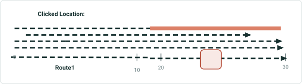

| LRS Identify Results |  |  |  |  |  | X |
| --- | --- | --- | --- | --- | --- | --- |
| Network: | CountyLog |  |  | > |  |  |
| RouteID: | 002 |  |  |  |  |  |
| RouteName: | Route2 |  |  |  |  |  |
| Min Measure: | 20 miles |  |  |  |  |  |
| Max Measure: | 30 miles |  |  |  |  |  |
| Measure: | 25 miles |  |  |  |  |  |
| Time: | 1/1/2000 to <Null> |  |  |  | > |  |
|  |  |  |  |  |  |  |
| Attribute | Value |  |  |  |  |  |
| Location | Midstream |  |  |  |  |  |
| Status | Active |  |  |  |  |  |
| Line ID | 001 |  |  |  |  |  |
| Line Name | Line 1 |  |  |  |  |  |
|  |  |  |  |  |  |  |
| Hide Event Information |  |  | > |  |  |  |
| DOT_Class.Class |  | Class 1 |  |  |  |  |
| DOT_Class.Record_Status |  | Active |  |  |  |  |
| Operating_Pressure.Pre … |  | 200 |  |  |  |  |
| Operating_Pressure.Rec … |  | Active |  |  |  |  |
| Inspection_Range.Type |  | Gas Leak |  |  |  |  |
| Inspection_Range.Record … |  | Active |  |  |  |  |
| Pipe_Crossing.Type |  | Transportation |  |  |  |  |
| Pipe_Crossing.Record_St … |  | Active |  |  |  |  |

| Network Layer | LineID | Line Name | RouteID | Route Name | From Date | ToDate | Location | Status |
| --- | --- | --- | --- | --- | --- | --- | --- | --- |
| Engineering | Line001 | Line1 | 001 | Route1 | 1/1/2000 | <Null> | Upstream | Active |
| Engineering | Line001 | Line1 | 002 | Route2 | 1/1/2000 | <Null> | Midstream | Active |

| Event Layer | From RouteID | From Route Name | To RouteID | ToRoute Name | From Date | To Date | From Measure | To Measure | Attribute1 | Attribute2 |
| --- | --- | --- | --- | --- | --- | --- | --- | --- | --- | --- |
| DOT_Class | 001 | Route1 | 002 | Route2 | 1/1/2000 | <Null> | 0 | 30 | Class 1 | Active |
| Operating_Pressure | 001 | Route1 | 001 | Route1 | 1/1/2000 | <Null> | 0 | 4 | 500 | Active |
| Operating_Pressure | 00 | Route1 | 002 | Route2 | 1/1/2000 | <Null> | 4 | 30 | 200 | Active |
| Inspection_Range | 001 | Route1 | 002 | Route2 | 1/1/2000 | <Null> | 1 | 29 | Gas Leak | Active |
| Consequence_Segment | 001 | Route1 | 001 | Route1 | 1/1/2000 | <Null> | 0 | 10 | Installed | Active |
| Pipe_Crossing | 002 | Route2 | 002 | Route2 | 1/1/2000 | <Null> | 20 | 30 | Transportation | Retired |

## Case 11 <!-- slide 15 -->

### PoM Network. Only Network Information Is Returned

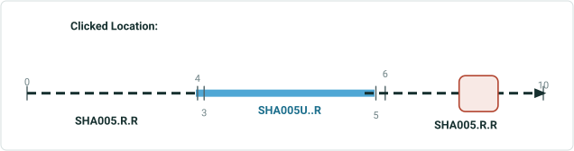

| LRS Identify Results |  |  |  |  |  | X |
| --- | --- | --- | --- | --- | --- | --- |
| Network: | PoM |  |  | > |  |  |
| RouteID: | SHA005.R.R |  |  |  |  |  |
| Min Measure: | 0 miles |  |  |  |  |  |
| Max Measure: | 10 miles |  |  |  |  |  |
| Measure: | 8 miles |  |  |  |  |  |
| Time: | 1/1/2000 to <Null> |  |  |  | > |  |
|  |  |  |  |  |  |  |
| Attribute | Value |  |  |  |  |  |
| County | Shasta |  |  |  |  |  |
| RouteNum | 005 |  |  |  |  |  |
| RouteSuffix | No Route Suffix |  |  |  |  |  |
| PMPrefix | First realignment |  |  |  |  |  |
| PMSuffix | No Suffix |  |  |  |  |  |
| Alignment | Right |  |  |  |  |  |
|  |  |  |  |  |  |  |
| Hide Event Information |  |  | > |  |  |  |
| No event information to display |  |  |  |  |  |  |

| Network Layer | LineID | RouteID | From Date | ToDate | County | Route Num | Route Suffix | PM Prefix | PM Suffix | Alignment |
| --- | --- | --- | --- | --- | --- | --- | --- | --- | --- | --- |
| PoM | 005R | SHA005.R.R | 1/1/2000 | <Null> | Shasta | 005 | No Route Suffix | First realignment | No Suffix | Right |
| PoM | 005L | SHA005U..R | 1/1/2000 | <Null> | Shasta | 005 | Unrelinquished | No Prefix | No Suffix | Right |

## Case 12 <!-- slide 16 -->

### Network and Event Info Turned On. Multiple Time Slices of

**Network and event info turned on. Multiple time slices of the same route and its events exist at the clicked location.**

1/1/2000-1/1/2005 Time Slice

| Network Layer | RouteID | Route Name | From Date | ToDate | Jurisdiction | County |
| --- | --- | --- | --- | --- | --- | --- |
| CountyLog | 001 | Route1 | 1/1/2000 | 1/1/2005 | Local | Shasta |
| CountyLog | 001 | Route1 | 1/1/2005 | 1/1/2010 | State | Lassen |
| CountyLog | 001 | Route1 | 1/1/2010 | <Null> | Federal | Shasta |

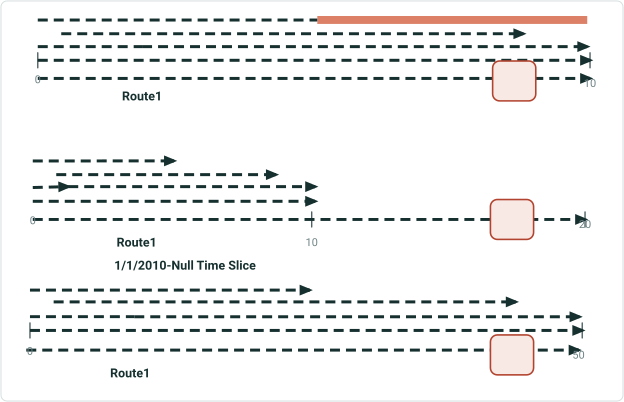

| Event Layer | EventID | RouteID | Route Name | From Date | To Date | From Measure | To Measure | Attribute1 | Attribute2 |
| --- | --- | --- | --- | --- | --- | --- | --- | --- | --- |
| Speed | Speed1 | 001 | Route1 | 1/1/2000 | 1/1/2005 | 0 | 10 | 45 MPH | Retired |
| Speed | Speed1 | 001 | Route1 | 1/1/2005 | 1/1/2010 | 0 | 10 | 45 MPH | Retired |
| Speed | Speed2 | 001 | Route1 | 1/1/2010 | <Null> | 0 | 50 | 65 MPH | Active |
| Access_Control | Access1 | 001 | Route1 | 1/1/2000 | 1/1/2005 | 0 | 2 | Full Access | Retired |
| Access_Control | Access1 | 001 | Route1 | 1/1/2005 | 1/1/2010 | 0 | 2 | Full Access | Retired |
| Access_Control | Access3 | 001 | Route1 | 1/1/2010 | <Null> | 0 | 10 | No Access | Active |
| Access_Control | Access2 | 001 | Route1 | 1/1/2000 | 1/1/2005 | 2 | 10 | No Access | Retired |
| Access_Control | Access2 | 001 | Route1 | 1/1/2005 | 1/1/2010 | 2 | 10 | No Access | Retired |
| Access_Control | Access4 | 001 | Route1 | 1/1/2010 | <Null> | 10 | 50 | Full Access | Active |
| Facility_Type | Facility1 | 001 | Route1 | 1/1/2000 | 1/1/2005 | 1 | 9 | One-Way | Retired |
| Facility_Type | Facility1 | 001 | Route1 | 1/1/2005 | 1/1/2010 | 1 | 9 | One-Way | Retired |
| Facility_Type | Facility2 | 001 | Route1 | 1/1/2010 | <Null> | 5 | 45 | Two-Way | Active |
| Functional_Class | Func1 | 001 | Route1 | 1/1/2000 | 1/1/2005 | 0 | 5 | Minor | Retired |
| Functional_Class | Func1 | 001 | Route1 | 1/1/2005 | 1/1/2010 | 0 | 5 | Minor | Retired |
| Functional_Class | Func2 | 001 | Route1 | 1/1/2010 | <Null> | 0 | 25 | Major | Active |
| Pavement_Condition | Pave1 | 001 | Route1 | 1/1/2000 | 1/1/2005 | 5 | 10 | 2009 | Retired |

1/1/2005-1/1/2010 Time Slice

## Case 12 <!-- slide 17 -->

### Network and Event Info Turned On. Multiple Time Slices of

**Network and event info turned on. Multiple time slices of the same route and its events exist at the clicked location. (Continued)**

1/1/2000-1/1/2005 Time Slice

| LRS Identify Results |  |  |  |  |  | X |
| --- | --- | --- | --- | --- | --- | --- |
| Network: | CountyLog |  |  | > |  |  |
| RouteID: | 001 |  |  |  |  |  |
| RouteName: | Route1 |  |  |  |  |  |
| Min Measure: | 0 miles |  |  |  |  |  |
| Max Measure: | 20 miles |  |  |  |  |  |
| Measure: | 18 miles |  |  |  |  |  |
| Time: | 1/1/2005 to 1/1/2010 |  |  |  | > |  |
|  |  |  |  |  |  |  |
| Attribute | Value |  |  |  |  |  |
| Jurisdiction | State |  |  |  |  |  |
| County | Lassen |  |  |  |  |  |
|  |  |  |  |  |  |  |
| Hide Event Information |  |  | > |  |  |  |
| No event information to display |  |  |  |  |  |  |

1/1/2005-1/1/2010 Time Slice

1/1/2010-<Null> Time Slice

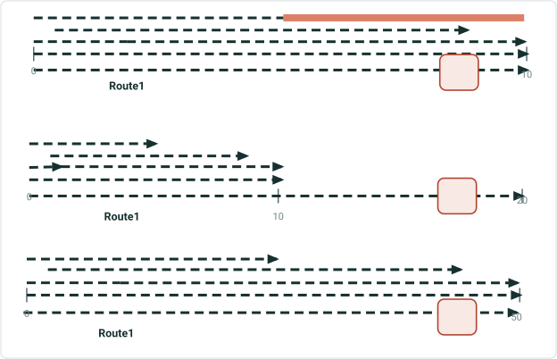

| LRS Identify Results |  |  |  |  |  |  | X |
| --- | --- | --- | --- | --- | --- | --- | --- |
| Network: | CountyLog |  |  |  | > |  |  |
| RouteID: | 001 |  |  |  |  |  |  |
| RouteName: | Route1 |  |  |  |  |  |  |
| Min Measure: | 0 miles |  |  |  |  |  |  |
| Max Measure: | 10 miles |  |  |  |  |  |  |
| Measure: | 9 miles |  |  |  |  |  |  |
| Time: | 1/1/2000-1/1/2005 |  |  |  |  | > |  |
|  |  |  |  |  |  |  |  |
| Attribute | Value |  |  |  |  |  |  |
| Jurisdiction | Local |  |  |  |  |  |  |
| County | Shasta |  |  |  |  |  |  |
|  |  |  |  |  |  |  |  |
| Hide Event Information |  |  |  | > |  |  |  |
| Speed.SpeedLimit |  |  | 45 MPH |  |  |  |  |
| Speed.Record_Status |  |  | Retired |  |  |  |  |
| Access_Control.Access |  |  | Full Access |  |  |  |  |
| Access_Control.Record_S … |  |  | Retired |  |  |  |  |
| Facility_Type.Type |  |  | One-Way |  |  |  |  |
| Facility_Type.Record_Sta… |  |  | Retired |  |  |  |  |
| Pavement_Condition.Dat... |  |  | 2009 |  |  |  |  |
| Pavement_Condition.Rec … |  |  | Retired |  |  |  |  |

| LRS Identify Results |  |  |  |  |  |  | X |
| --- | --- | --- | --- | --- | --- | --- | --- |
| Network: | CountyLog |  |  |  | > |  |  |
| RouteID: | 001 |  |  |  |  |  |  |
| RouteName: | Route1 |  |  |  |  |  |  |
| Min Measure: | 0 miles |  |  |  |  |  |  |
| Max Measure: | 50 miles |  |  |  |  |  |  |
| Measure: | 45 miles |  |  |  |  |  |  |
| Time: | 1/1/2010 to <Null> |  |  |  |  | > |  |
|  |  |  |  |  |  |  |  |
| Attribute | Value |  |  |  |  |  |  |
| Jurisdiction | Federal |  |  |  |  |  |  |
| County | Shasta |  |  |  |  |  |  |
|  |  |  |  |  |  |  |  |
| Hide Event Information |  |  |  | > |  |  |  |
| Speed.SpeedLimit |  |  | 65 MPH |  |  |  |  |
| Speed.Record_Status |  |  | Active |  |  |  |  |
| Access_Control.Access |  |  | No Access |  |  |  |  |
| Access_Control.Record_S … |  |  | Active |  |  |  |  |
| Facility_Type.Type |  |  | Two-Way |  |  |  |  |
| Facility_Type.Record_Sta… |  |  | Active |  |  |  |  |

## Case 13 <!-- slide 18 -->

### Network and Event Info Turned On. Multiple Overlapping


**Network and event info turned on. Multiple overlapping events within the same event layer exist at the clicked location**

| LRS Identify Results |  |  |  |  |  | X |
| --- | --- | --- | --- | --- | --- | --- |
| Network: | CountyLog |  |  | > |  |  |
| RouteID: | 001 |  |  |  |  |  |
| RouteName: | Route1 |  |  |  |  |  |
| Min Measure: | 0 miles |  |  |  |  |  |
| Max Measure: | 10 miles |  |  |  |  |  |
| Measure: | 4 miles |  |  |  |  |  |
| Time: | 1/1/2000 to <Null> |  |  |  | > |  |
|  |  |  |  |  |  |  |
| Attribute | Value |  |  |  |  |  |
| Jurisdiction | Local |  |  |  |  |  |
| County | Adams |  |  |  |  |  |
|  |  |  |  |  |  |  |
| Hide Event Information |  |  | > |  |  |  |
| Speed.Speed_Limit (1) |  | 45MPH |  |  |  |  |
| Speed.Record_Status (1) |  | Active |  |  |  |  |
| Speed.Speed_Limit (2) |  | 55 MPH |  |  |  |  |
| Speed.Record_Status (2) |  | Proposed |  |  |  |  |
| Speed.Speed_Limit (3) |  | 50 MPH |  |  |  |  |
| Speed.Record_Status (3) |  | Proposed |  |  |  |  |

| Network Layer | RouteID | Route Name | From Date | ToDate | Jurisdiction | County |
| --- | --- | --- | --- | --- | --- | --- |
| CountyLog | 001 | Route1 | 1/1/2000 | <Null> | Local | Adams |

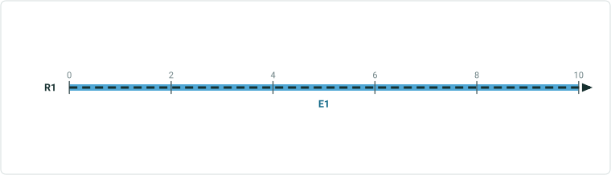

| Event Layer | EventID | RouteID | Route Name | From Date | To Date | From Measure | To Measure | Attribute1 | Attribute2 |
| --- | --- | --- | --- | --- | --- | --- | --- | --- | --- |
| Speed | Speed1 | 001 | Route1 | 1/1/2000 | <Null> | 0 | 10 | 45 MPH | Active |
| Speed | Speed2 | 001 | Route1 | 1/1/2000 | <Null> | 0 | 5 | 55 MPH | Proposed |
| Speed | Speed3 | 001 | Route1 | 1/1/2000 | <Null> | 2 | 10 | 50 MPH | Proposed |

## Case 14 <!-- slide 19 -->

### Network and Event Info Turned On. Clicked Location Is the


**Network and event info turned on. Clicked location is the exact overlapping measure of two events within the same event layer**

| LRS Identify Results |  |  |  |  |  | X |
| --- | --- | --- | --- | --- | --- | --- |
| Network: | CountyLog |  |  | > |  |  |
| RouteID: | 001 |  |  |  |  |  |
| RouteName: | Route1 |  |  |  |  |  |
| Min Measure: | 0 miles |  |  |  |  |  |
| Max Measure: | 10 miles |  |  |  |  |  |
| Measure: | 5 miles |  |  |  |  |  |
| Time: | 1/1/2000 to <Null> |  |  |  | > |  |
|  |  |  |  |  |  |  |
| Attribute | Value |  |  |  |  |  |
| Jurisdiction | Local |  |  |  |  |  |
| County | Adams |  |  |  |  |  |
|  |  |  |  |  |  |  |
| Hide Event Information |  |  | > |  |  |  |
| Speed.Speed_Limit (1) |  | 45MPH |  |  |  |  |
| Speed.Record_Status (1) |  | Active |  |  |  |  |
| Speed.Speed_Limit (2) |  | 55 MPH |  |  |  |  |
| Speed.Record_Status (2) |  | Proposed |  |  |  |  |
| Speed.Speed_Limit (3) |  | 50 MPH |  |  |  |  |
| Speed.Record_Status (3) |  | Proposed |  |  |  |  |

| Network Layer | RouteID | Route Name | From Date | ToDate | Jurisdiction | County |
| --- | --- | --- | --- | --- | --- | --- |
| CountyLog | 001 | Route1 | 1/1/2000 | <Null> | Local | Adams |


| Event Layer | EventID | RouteID | Route Name | From Date | To Date | From Measure | To Measure | Attribute1 | Attribute2 |
| --- | --- | --- | --- | --- | --- | --- | --- | --- | --- |
| Speed | Speed1 | 001 | Route1 | 1/1/2000 | <Null> | 0 | 10 | 45 MPH | Active |
| Speed | Speed2 | 001 | Route1 | 1/1/2000 | <Null> | 0 | 5 | 55 MPH | Proposed |
| Speed | Speed3 | 001 | Route1 | 1/1/2000 | <Null> | 5 | 10 | 50 MPH | Proposed |

## Case 15 <!-- slide 20 -->

### Network and Event Info Turned On. Multiple Measures on the

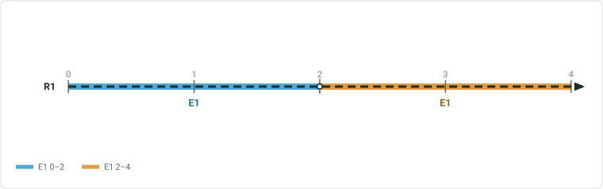

**Network and event info turned on. Multiple measures on the same route exist at the clicked location**

| LRS Identify Results |  |  |  |  |  | X |
| --- | --- | --- | --- | --- | --- | --- |
| Network: | CountyLog |  |  | > |  |  |
| RouteID: | 001 |  |  |  |  |  |
| RouteName: | Route1 |  |  |  |  |  |
| Min Measure: | 0 miles |  |  |  |  |  |
| Max Measure: | 10 miles |  |  |  |  |  |
| Measure: | 2 miles |  |  |  |  |  |
|  | 8 miles |  |  |  |  |  |
| Time: | 1/1/2000 to <Null> |  |  |  | > |  |
|  |  |  |  |  |  |  |
| Attribute | Value |  |  |  |  |  |
| Jurisdiction | Local |  |  |  |  |  |
| County | Adams |  |  |  |  |  |
|  |  |  |  |  |  |  |
| Hide Event Information |  |  | > |  |  |  |
| Speed.Speed_Limit (1) |  | 45 MPH |  |  |  |  |
| Speed.Record_Status (1) |  | Active |  |  |  |  |
| Speed.Speed_Limit (2) |  | 35 MPH |  |  |  |  |
| Speed.Record_Status (2) |  | Active |  |  |  |  |

| Network Layer | RouteID | Route Name | From Date | ToDate | Jurisdiction | County |
| --- | --- | --- | --- | --- | --- | --- |
| CountyLog | 001 | Route1 | 1/1/2000 | <Null> | Local | Adams |

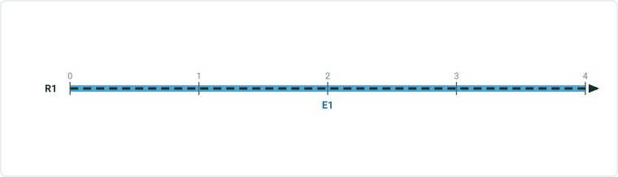

| Event Layer | EventID | RouteID | Route Name | From Date | To Date | From Measure | To Measure | Attribute1 | Attribute2 |
| --- | --- | --- | --- | --- | --- | --- | --- | --- | --- |
| Speed | Speed1 | 001 | Route1 | 1/1/2000 | <Null> | 0 | 4 | 45 MPH | Active |
| Speed | Speed2 | 001 | Route1 | 1/1/2000 | <Null> | 4 | 10 | 35 MPH | Active |

## Case 16 <!-- slide 21 -->

### Network and Event Info Turned On. Multiple Routes Within

**Network and event info turned on. Multiple routes within different LRS networks exist at the clicked location**

Clicked Location Routes and events all overlap):

| Network Layer | RouteID | Route Name | From Date | ToDate | Attribute1 | Attribute2 |
| --- | --- | --- | --- | --- | --- | --- |
| CountyLog | 001 | Route1 | 1/1/2000 | <Null> | Local | Adams |
| StateLog | SR15 | Route15 | 1/1/2000 | <Null> | No Toll | North |
| AllRoads | 045 | Road45 | 1/1/2000 | <Null> | Paved | Year-Round |

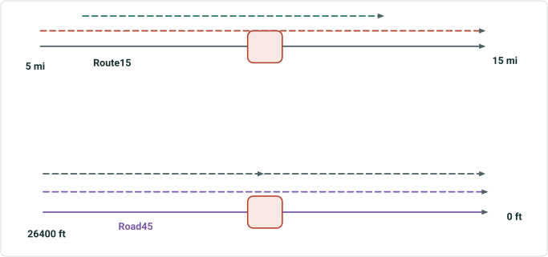

| Event Layer | RouteID | Route Name | From Date | To Date | From Measure | To Measure | Attribute1 | Attribute2 |
| --- | --- | --- | --- | --- | --- | --- | --- | --- |
| Speed | 001 | Route1 | 1/1/2000 | <Null> | 0 | 10 | 45 MPH | Active |
| Access_Control | 001 | Route1 | 1/1/2000 | <Null> | 0 | 2 | Full Access | Active |
| Access_Control | 001 | Route1 | 1/1/2000 | <Null> | 2 | 10 | No Access | Active |
| Facility_Type | 001 | Route1 | 1/1/2000 | <Null> | 1 | 9 | One-Way | Active |
| Functional_Class | 001 | Route1 | 1/1/2000 | <Null> | 0 | 5 | Minor | Active |

| Event Layer | RouteID | Route Name | From Date | To Date | From Measure | To Measure | Attribute1 | Attribute2 |
| --- | --- | --- | --- | --- | --- | --- | --- | --- |
| Inspection | SR15 | Route15 | 1/1/2000 | <Null> | 5 | 15 | Inspected | Active |
| State_Budget | SR15 | Route15 | 1/1/2000 | <Null> | 7 | 12 | $500,000 | Active |

| Event Layer | RouteID | Route Name | From Date | To Date | From Measure | To Measure | Attribute1 | Attribute2 |
| --- | --- | --- | --- | --- | --- | --- | --- | --- |
| Drainage | 045 | Road45 | 1/1/2000 | <Null> | 0 | 26400 | Partial Flooding | Active |
| Shoulder | 045 | Road45 | 1/1/2000 | <Null> | 0 | 13200 | None | Active |
| Shoulder | 045 | Road45 | 1/1/2000 | <Null> | 13200 | 26400 | Low | Proposed |

## Case 16 <!-- slide 22 -->

### Network and Event Info Turned On. Multiple Routes Within

**Network and event info turned on. Multiple routes within different LRS networks exist at the clicked location (Continued)**
Returned Result:

| LRS Identify Results |  |  |  |  |  | X |
| --- | --- | --- | --- | --- | --- | --- |
| Network: | CountyLog |  |  | > |  |  |
| RouteID: | 001 |  |  |  |  |  |
| RouteName: | Route1 |  |  |  |  |  |
| Min Measure: | 0 miles |  |  |  |  |  |
| Max Measure: | 10 miles |  |  |  |  |  |
| Measure: | 5 miles |  |  |  |  |  |
| Time: | 1/1/2000 to <Null> |  |  |  | > |  |
|  |  |  |  |  |  |  |
| Attribute | Value |  |  |  |  |  |
| Jurisdiction | Local |  |  |  |  |  |
| County | Adams |  |  |  |  |  |
|  |  |  |  |  |  |  |
| Hide Event Information |  |  | > |  |  |  |
| Speed.Speed_Limit |  | 45 MPH |  |  |  |  |
| Speed.Record_Status |  | Retired |  |  |  |  |
| Access_Control.Access |  | Full Access |  |  |  |  |
| Access_Control.Recor … |  | Retired |  |  |  |  |
| Facility_Type.Type |  | One-Way |  |  |  |  |
| Facility_Type.Record … |  | Retired |  |  |  |  |

| LRS Identify Results |  |  |  |  |  | X |
| --- | --- | --- | --- | --- | --- | --- |
| Network: | StateLog |  |  | > |  |  |
| RouteID: | SR15 |  |  |  |  |  |
| RouteName: | Route15 |  |  |  |  |  |
| Min Measure: | 5 miles |  |  |  |  |  |
| Max Measure: | 15 miles |  |  |  |  |  |
| Measure: | 10 miles |  |  |  |  |  |
| Time: | 1/1/2000 to <Null> |  |  |  | > |  |
|  |  |  |  |  |  |  |
| Attribute | Value |  |  |  |  |  |
| Toll_Status | No Toll |  |  |  |  |  |
| Direction | North |  |  |  |  |  |
|  |  |  |  |  |  |  |
| Hide Event Information |  |  | > |  |  |  |
| Inspection.Status |  | Inspected |  |  |  |  |
| Inspection.Record_St … |  | Active |  |  |  |  |
| State_Budget.Amount |  | $500,000 |  |  |  |  |
| State_Budget.Record … |  | Active |  |  |  |  |

| LRS Identify Results |  |  |  |  |  | X |
| --- | --- | --- | --- | --- | --- | --- |
| Network: | AllRoads |  |  | > |  |  |
| RouteID: | 045 |  |  |  |  |  |
| RouteName: | Road45 |  |  |  |  |  |
| Min Measure: | 0 feet |  |  |  |  |  |
| Max Measure: | 26400 ft |  |  |  |  |  |
| Measure: | 13200 ft |  |  |  |  |  |
| Time: | 1/1/2000 to <Null> |  |  |  | > |  |
|  |  |  |  |  |  |  |
| Attribute | Value |  |  |  |  |  |
| Surface | Paved |  |  |  |  |  |
| Seasonality | Year-Round |  |  |  |  |  |
|  |  |  |  |  |  |  |
| Hide Event Information |  |  | > |  |  |  |
| Drainage.Drainage |  | Partial Flooding |  |  |  |  |
| Drainage.Record_Sta … |  | Active |  |  |  |  |
| Shoulder.Type (1) |  | None |  |  |  |  |
| Shoulder.Record_S … (1) |  | Active |  |  |  |  |
| Shoulder.Type (2) |  | Low |  |  |  |  |
| Shoulder.Record_S … (2) |  | Proposed |  |  |  |  |

## Case 17 <!-- slide 23 -->

### Network and Event Info Turned On. Clicked Location Is the


**Network and event info turned on. Clicked location is the intersection of 2 routes**

| Network Layer | RouteID | Route Name | From Date | ToDate | Attribute1 | Attribute2 |
| --- | --- | --- | --- | --- | --- | --- |
| CountyLog | 001 | Route1 | 1/1/2000 | <Null> | Local | Adams |
| StateLog | SR15 | Route15 | 1/1/2000 | <Null> | No Toll | North |


| Event Layer | RouteID | Route Name | From Date | To Date | From Measure | To Measure | Attribute1 | Attribute2 |
| --- | --- | --- | --- | --- | --- | --- | --- | --- |
| Speed | 001 | Route1 | 1/1/2000 | <Null> | 0 | 10 | 45 MPH | Active |
| Access_Control | 001 | Route1 | 1/1/2000 | <Null> | 0 | 2 | Full Access | Active |
| Access_Control | 001 | Route1 | 1/1/2000 | <Null> | 2 | 10 | No Access | Active |
| Facility_Type | 001 | Route1 | 1/1/2000 | <Null> | 1 | 9 | One-Way | Active |
| Functional_Class | 001 | Route1 | 1/1/2000 | <Null> | 0 | 5 | Minor | Active |

| Event Layer | RouteID | Route Name | From Date | To Date | From Measure | To Measure | Attribute1 | Attribute2 |
| --- | --- | --- | --- | --- | --- | --- | --- | --- |
| Inspection | SR15 | Route15 | 1/1/2000 | <Null> | 5 | 15 | Inspected | Active |
| State_Budget | SR15 | Route15 | 1/1/2000 | <Null> | 7 | 12 | $500,000 | Active |

## Case 17 <!-- slide 24 -->

### Network and Event Info Turned On. Clicked Location Is the

**Network and event info turned on. Clicked location is the intersection of 2 routes (Continued)**
Returned Result:

| LRS Identify Results |  |  |  |  |  | X |
| --- | --- | --- | --- | --- | --- | --- |
| Network: | CountyLog |  |  | > |  |  |
| RouteID: | 001 |  |  |  |  |  |
| RouteName: | Route1 |  |  |  |  |  |
| Min Measure: | 0 miles |  |  |  |  |  |
| Max Measure: | 10 miles |  |  |  |  |  |
| Measure: | 5 miles |  |  |  |  |  |
| Time: | 1/1/2000 to <Null> |  |  |  | > |  |
|  |  |  |  |  |  |  |
| Attribute | Value |  |  |  |  |  |
| Jurisdiction | Local |  |  |  |  |  |
| County | Adams |  |  |  |  |  |
|  |  |  |  |  |  |  |
| Hide Event Information |  |  | > |  |  |  |
| Speed.Speed_Limit |  | 45 MPH |  |  |  |  |
| Speed.Record_Status |  | Retired |  |  |  |  |
| Access_Control.Access |  | Full Access |  |  |  |  |
| Access_Control.Recor … |  | Retired |  |  |  |  |
| Facility_Type.Type |  | One-Way |  |  |  |  |
| Facility_Type.Record … |  | Retired |  |  |  |  |

| LRS Identify Results |  |  |  |  |  | X |
| --- | --- | --- | --- | --- | --- | --- |
| Network: | StateLog |  |  | > |  |  |
| RouteID: | SR15 |  |  |  |  |  |
| RouteName: | Route15 |  |  |  |  |  |
| Min Measure: | 5 miles |  |  |  |  |  |
| Max Measure: | 15 miles |  |  |  |  |  |
| Measure: | 10 miles |  |  |  |  |  |
| Time: | 1/1/2000 to <Null> |  |  |  | > |  |
|  |  |  |  |  |  |  |
| Attribute | Value |  |  |  |  |  |
| Toll_Status | No Toll |  |  |  |  |  |
| Direction | North |  |  |  |  |  |
|  |  |  |  |  |  |  |
| Hide Event Information |  |  | > |  |  |  |
| Inspection.Status |  | Inspected |  |  |  |  |
| Inspection.Record_St … |  | Active |  |  |  |  |
| State_Budget.Amount |  | $500,000 |  |  |  |  |
| State_Budget.Record … |  | Active |  |  |  |  |

## Case 18 <!-- slide 25 -->

### Network and Event Info Turned On. Route Has Single Time

**Network and event info turned on. Route has single time slice, but events have multiple**

1/1/2000-1/1/2005 Events Time Slice

| Network Layer | RouteID | Route Name | From Date | ToDate | Jurisdiction | County |
| --- | --- | --- | --- | --- | --- | --- |
| CountyLog | 001 | Route1 | 1/1/2000 | <Null> | Local | Shasta |


| Event Layer | EventID | RouteID | Route Name | From Date | To Date | From Measure | To Measure | Attribute1 | Attribute2 |
| --- | --- | --- | --- | --- | --- | --- | --- | --- | --- |
| Speed | Speed1 | 001 | Route1 | 1/1/2000 | 1/1/2005 | 0 | 10 | 45 MPH | Retired |
| Speed | Speed1 | 001 | Route1 | 1/1/2005 | 1/1/2010 | 0 | 5 | 45 MPH | Retired |
| Speed | Speed2 | 001 | Route1 | 1/1/2010 | <Null> | 0 | 10 | 65 MPH | Active |
| Access_Control | Access1 | 001 | Route1 | 1/1/2000 | 1/1/2005 | 0 | 1 | Full Access | Retired |
| Access_Control | Access1 | 001 | Route1 | 1/1/2005 | 1/1/2010 | 0 | 1 | Full Access | Retired |
| Access_Control | Access3 | 001 | Route1 | 1/1/2010 | <Null> | 0 | 10 | No Access | Active |
| Access_Control | Access2 | 001 | Route1 | 1/1/2000 | 1/1/2005 | 2 | 5 | No Access | Retired |
| Access_Control | Access2 | 001 | Route1 | 1/1/2005 | 1/1/2010 | 2 | 5 | No Access | Retired |
| Access_Control | Access4 | 001 | Route1 | 1/1/2010 | <Null> | 2 | 10 | Full Access | Active |
| Facility_Type | Facility1 | 001 | Route1 | 1/1/2000 | 1/1/2005 | 1 | 9 | One-Way | Retired |
| Facility_Type | Facility1 | 001 | Route1 | 1/1/2005 | 1/1/2010 | 1 | 4 | One-Way | Retired |
| Facility_Type | Facility2 | 001 | Route1 | 1/1/2010 | <Null> | 1 | 9 | Two-Way | Active |
| Functional_Class | Func1 | 001 | Route1 | 1/1/2000 | 1/1/2005 | 0 | 5 | Minor | Retired |
| Functional_Class | Func1 | 001 | Route1 | 1/1/2005 | 1/1/2010 | 0 | 3 | Minor | Retired |
| Functional_Class | Func2 | 001 | Route1 | 1/1/2010 | <Null> | 0 | 5 | Major | Active |
| Pavement_Condition | Pave1 | 001 | Route1 | 1/1/2000 | 1/1/2005 | 5 | 10 | 2009 | Retired |

1/1/2005-1/1/2010 Events Time Slice

1/1/2010-Null Events Time Slice

## Case 18 <!-- slide 26 -->

### Network and Event Info Turned On. Route Has Single Time

**Network and event info turned on. Route has single time slice, but events have multiple (Continued)**

| LRS Identify Results |  |  |  |  |  | X |
| --- | --- | --- | --- | --- | --- | --- |
| Network: | CountyLog |  |  | > |  |  |
| RouteID: | 001 |  |  |  |  |  |
| RouteName: | Route1 |  |  |  |  |  |
| Min Measure: | 0 miles |  |  |  |  |  |
| Max Measure: | 10 miles |  |  |  |  |  |
| Measure: | 9 miles |  |  |  |  |  |
| Time: | 1/1/2005 to 1/1/2010 |  |  |  | > |  |
|  |  |  |  |  |  |  |
| Attribute | Value |  |  |  |  |  |
| Jurisdiction | Local |  |  |  |  |  |
| County | Shasta |  |  |  |  |  |
|  |  |  |  |  |  |  |
| Hide Event Information |  |  | > |  |  |  |
| No event information to display |  |  |  |  |  |  |


| LRS Identify Results |  |  |  |  |  |  | X |
| --- | --- | --- | --- | --- | --- | --- | --- |
| Network: | CountyLog |  |  |  | > |  |  |
| RouteID: | 001 |  |  |  |  |  |  |
| RouteName: | Route1 |  |  |  |  |  |  |
| Min Measure: | 0 miles |  |  |  |  |  |  |
| Max Measure: | 10 miles |  |  |  |  |  |  |
| Measure: | 9 miles |  |  |  |  |  |  |
| Time: | 1/1/2000-1/1/2005 |  |  |  |  | > |  |
|  |  |  |  |  |  |  |  |
| Attribute | Value |  |  |  |  |  |  |
| Jurisdiction | Local |  |  |  |  |  |  |
| County | Shasta |  |  |  |  |  |  |
|  |  |  |  |  |  |  |  |
| Hide Event Information |  |  |  | > |  |  |  |
| Speed.SpeedLimit |  |  | 45 MPH |  |  |  |  |
| Speed.Record_Status |  |  | Retired |  |  |  |  |
| Access_Control.Access |  |  | Full Access |  |  |  |  |
| Access_Control.Record_S … |  |  | Retired |  |  |  |  |
| Facility_Type.Type |  |  | One-Way |  |  |  |  |
| Facility_Type.Record_Sta… |  |  | Retired |  |  |  |  |
| Pavement_Condition.Dat... |  |  | 2009 |  |  |  |  |
| Pavement_Condition.Rec … |  |  | Retired |  |  |  |  |

| LRS Identify Results |  |  |  |  |  |  | X |
| --- | --- | --- | --- | --- | --- | --- | --- |
| Network: | CountyLog |  |  |  | > |  |  |
| RouteID: | 001 |  |  |  |  |  |  |
| RouteName: | Route1 |  |  |  |  |  |  |
| Min Measure: | 0 miles |  |  |  |  |  |  |
| Max Measure: | 10 miles |  |  |  |  |  |  |
| Measure: | 9 miles |  |  |  |  |  |  |
| Time: | 1/1/2010 to <Null> |  |  |  |  | > |  |
|  |  |  |  |  |  |  |  |
| Attribute | Value |  |  |  |  |  |  |
| Jurisdiction | Local |  |  |  |  |  |  |
| County | Shasta |  |  |  |  |  |  |
|  |  |  |  |  |  |  |  |
| Hide Event Information |  |  |  | > |  |  |  |
| Speed.SpeedLimit |  |  | 65 MPH |  |  |  |  |
| Speed.Record_Status |  |  | Active |  |  |  |  |
| Access_Control.Access |  |  | No Access |  |  |  |  |
| Access_Control.Record_S … |  |  | Active |  |  |  |  |
| Facility_Type.Type |  |  | Two-Way |  |  |  |  |
| Facility_Type.Record_Sta… |  |  | Active |  |  |  |  |

1/1/2000-1/1/2005 Events Time Slice

1/1/2005-1/1/2010 Events Time Slice

1/1/2010-Null Events Time Slice

## Case 19 <!-- slide 27 -->

### Network and Event Info Turned On. Clicked Location Is the

**Network and event info turned on. Clicked location is the respective end/start of 2 routes**

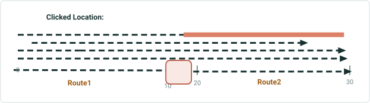

| LRS Identify Results |  |  |  |  |  | X |
| --- | --- | --- | --- | --- | --- | --- |
| Network: | CountyLog |  |  | > |  |  |
| RouteID: | 001 |  |  |  |  |  |
| RouteName: | Route1 |  |  |  |  |  |
| Min Measure: | 0 miles |  |  |  |  |  |
| Max Measure: | 10 miles |  |  |  |  |  |
| Measure: | 10 miles |  |  |  |  |  |
| Time: | 1/1/2000 to <Null> |  |  |  | > |  |
|  |  |  |  |  |  |  |
| Attribute | Value |  |  |  |  |  |
| Location | Upstream |  |  |  |  |  |
| Status | Active |  |  |  |  |  |
|  |  |  |  |  |  |  |
| Hide Event Information |  |  | > |  |  |  |
| DOT_Class.Class |  | Class 1 |  |  |  |  |
| DOT_Class.Record_Status |  | Active |  |  |  |  |
| Operating_Pressure.Pre … |  | 200 |  |  |  |  |
| Operating_Pressuire.Rec … |  | Active |  |  |  |  |
| Inspection_Range.Type |  | Gas Leak |  |  |  |  |
| Inspection_Range.Record … |  | Active |  |  |  |  |

| Network Layer | LineID | Line Name | RouteID | Route Name | From Date | ToDate | Location | Status |
| --- | --- | --- | --- | --- | --- | --- | --- | --- |
| Engineering | Line001 | Line1 | 001 | Route1 | 1/1/2000 | <Null> | Upstream | Active |
| Engineering | Line001 | Line1 | 002 | Route2 | 1/1/2000 | <Null> | Midstream | Active |

| Event Layer | From RouteID | From Route Name | To RouteID | ToRoute Name | From Date | To Date | From Measure | To Measure | Attribute1 | Attribute2 |
| --- | --- | --- | --- | --- | --- | --- | --- | --- | --- | --- |
| DOT_Class | 001 | Route1 | 002 | Route2 | 1/1/2000 | <Null> | 0 | 30 | Class 1 | Active |
| Operating_ Pressure | 001 | Route1 | 001 | Route1 | 1/1/2000 | <Null> | 0 | 4 | 500 | Active |
| Operating_ Pressure | 00 | Route1 | 002 | Route2 | 1/1/2000 | <Null> | 4 | 30 | 200 | Active |
| Inspection_Range | 001 | Route1 | 002 | Route2 | 1/1/2000 | <Null> | 1 | 29 | Gas Leak | Active |
| Consequence_ Segment | 001 | Route1 | 001 | Route1 | 1/1/2000 | <Null> | 0 | 10 | Installed | Active |
| Pipe_Crossing | 002 | Route2 | 002 | Route2 | 1/1/2000 | <Null> | 20 | 30 | Transportation | Retired |

| LRS Identify Results |  |  |  |  |  | X |
| --- | --- | --- | --- | --- | --- | --- |
| Network: | CountyLog |  |  | > |  |  |
| RouteID: | 002 |  |  |  |  |  |
| RouteName: | Route2 |  |  |  |  |  |
| Min Measure: | 20 miles |  |  |  |  |  |
| Max Measure: | 30 miles |  |  |  |  |  |
| Measure: | 20 miles |  |  |  |  |  |
| Time: | 1/1/2000 to <Null> |  |  |  | > |  |
|  |  |  |  |  |  |  |
| Attribute | Value |  |  |  |  |  |
| Location | Midstream |  |  |  |  |  |
| Status | Active |  |  |  |  |  |
|  |  |  |  |  |  |  |
| Hide Event Information |  |  | > |  |  |  |
| DOT_Class.Class |  | Class 1 |  |  |  |  |
| DOT_Class.Record_St … |  | Active |  |  |  |  |
| Operating_Pressure.P … |  | 200 |  |  |  |  |
| Operating_Pressure … |  | Active |  |  |  |  |
| Inspection_Range.Type |  | Gas Leak |  |  |  |  |
| Inspection_Range.Rec … |  | Active |  |  |  |  |
| Pipe_Crossing.Type |  | Transportation |  |  |  |  |
| Pipe_Crossing.Record … |  | Active |  |  |  |  |

## Case 20 <!-- slide 28 -->

### Network and Event Info Turned On. Clicked Location Has


**Network and event info turned on. Clicked location has concurrent routes of different networks, but one network is not enabled to display in map**

| Network Layer | Enabled in Map? | RouteID | Route Name | From Date | ToDate | Attribute1 | Attribute2 |
| --- | --- | --- | --- | --- | --- | --- | --- |
| CountyLog | Yes | 001 | Route1 | 1/1/2000 | <Null> | Local | Adams |
| StateLog | No | SR15 | Route15 | 1/1/2000 | <Null> | No Toll | North |


| Event Layer | RouteID | Route Name | From Date | To Date | From Measure | To Measure | Attribute1 | Attribute2 |
| --- | --- | --- | --- | --- | --- | --- | --- | --- |
| Speed | 001 | Route1 | 1/1/2000 | <Null> | 0 | 10 | 45 MPH | Active |
| Access_Control | 001 | Route1 | 1/1/2000 | <Null> | 0 | 2 | Full Access | Active |
| Access_Control | 001 | Route1 | 1/1/2000 | <Null> | 2 | 10 | No Access | Active |
| Facility_Type | 001 | Route1 | 1/1/2000 | <Null> | 1 | 9 | One-Way | Active |
| Functional_Class | 001 | Route1 | 1/1/2000 | <Null> | 0 | 5 | Minor | Active |

| Event Layer | RouteID | Route Name | From Date | To Date | From Measure | To Measure | Attribute1 | Attribute2 |
| --- | --- | --- | --- | --- | --- | --- | --- | --- |
| Inspection | SR15 | Route15 | 1/1/2000 | <Null> | 5 | 15 | Inspected | Active |
| State_Budget | SR15 | Route15 | 1/1/2000 | <Null> | 7 | 12 | $500,000 | Active |

## Case 20 <!-- slide 29 -->

### Network and Event Info Turned On. Clicked Location Has

**Network and event info turned on. Clicked location has concurrent routes of different networks, but one network is not enabled to display in map (continued)**
Returned Result:

| LRS Identify Results |  |  |  |  |  | X |
| --- | --- | --- | --- | --- | --- | --- |
| Network: | CountyLog |  |  | > |  |  |
| RouteID: | 001 |  |  |  |  |  |
| RouteName: | Route1 |  |  |  |  |  |
| Min Measure: | 0 miles |  |  |  |  |  |
| Max Measure: | 10 miles |  |  |  |  |  |
| Measure: | 5 miles |  |  |  |  |  |
| Time: | 1/1/2000 to <Null> |  |  |  | > |  |
|  |  |  |  |  |  |  |
| Attribute | Value |  |  |  |  |  |
| Jurisdiction | Local |  |  |  |  |  |
| County | Adams |  |  |  |  |  |
|  |  |  |  |  |  |  |
| Hide Event Information |  |  | > |  |  |  |
| Speed.Speed_Limit |  | 45 MPH |  |  |  |  |
| Speed.Record_Status |  | Retired |  |  |  |  |
| Access_Control.Access |  | Full Access |  |  |  |  |
| Access_Control.Recor … |  | Retired |  |  |  |  |
| Facility_Type.Type |  | One-Way |  |  |  |  |
| Facility_Type.Record … |  | Retired |  |  |  |  |

## Case 21 <!-- slide 30 -->

### Network and Event Info Turned On. Multiple Measures on the


**Network and event info turned on. Multiple measures on the same route exist at the clicked location**

| LRS Identify Results |  |  |  |  |  | X |
| --- | --- | --- | --- | --- | --- | --- |
| Network: | CountyLog |  |  | > |  |  |
| RouteID: | 001 |  |  |  |  |  |
| RouteName: | Route1 |  |  |  |  |  |
| Min Measure: | 0 miles |  |  |  |  |  |
| Max Measure: | 10 miles |  |  |  |  |  |
| Measure: | 2 miles |  |  |  |  |  |
|  | 8 miles |  |  |  |  |  |
| Time: | 1/1/2000 to <Null> |  |  |  | > |  |
|  |  |  |  |  |  |  |
| Attribute | Value |  |  |  |  |  |
| Jurisdiction | Local |  |  |  |  |  |
| County | Adams |  |  |  |  |  |
|  |  |  |  |  |  |  |
| Hide Event Information |  |  | > |  |  |  |
| Speed.Speed_Limit |  | 45 MPH |  |  |  |  |
| Speed.Record_Status |  | Active |  |  |  |  |

| Network Layer | RouteID | Route Name | From Date | ToDate | Jurisdiction | County |
| --- | --- | --- | --- | --- | --- | --- |
| CountyLog | 001 | Route1 | 1/1/2000 | <Null> | Local | Adams |


| Event Layer | EventID | RouteID | Route Name | From Date | To Date | From Measure | To Measure | Attribute1 | Attribute2 |
| --- | --- | --- | --- | --- | --- | --- | --- | --- | --- |
| Speed | Speed1 | 001 | Route1 | 1/1/2000 | <Null> | 0 | 10 | 45 MPH | Active |

## Case 22 <!-- slide 31 -->

### Network and Event Info Turned On. Multiple Events Exist at

**Network and event info turned on. Multiple events exist at the clicked location but only a subset are within the configured Attribute Set**


| LRS Identify Results |  |  |  |  |  | X |
| --- | --- | --- | --- | --- | --- | --- |
| Network: | CountyLog |  |  | > |  |  |
| RouteID: | 001 |  |  |  |  |  |
| RouteName: | Route1 |  |  |  |  |  |
| Min Measure: | 0 miles |  |  |  |  |  |
| Max Measure: | 10 miles |  |  |  |  |  |
| Measure: | 5 miles |  |  |  |  |  |
| Time: | 1/1/2000 to <Null> |  |  |  | > |  |
|  |  |  |  |  |  |  |
| Attribute | Value |  |  |  |  |  |
| Jurisdiction | Local |  |  |  |  |  |
| County | Adams |  |  |  |  |  |
|  |  |  |  |  |  |  |
| Hide Event Information |  |  | > |  |  |  |
| Speed.Speed_Limit |  | 45 MPH |  |  |  |  |
| Speed.Record_Status |  | Active |  |  |  |  |
| Facility_Type.Type |  | One-Way |  |  |  |  |

| Network Layer | RouteID | Route Name | From Date | ToDate | Jurisdiction | County |
| --- | --- | --- | --- | --- | --- | --- |
| CountyLog | 001 | Route1 | 1/1/2000 | <Null> | Local | Adams |

| Event Layer | RouteID | Route Name | From Date | To Date | From Measure | To Measure | Attribute1 | Attribute2 |
| --- | --- | --- | --- | --- | --- | --- | --- | --- |
| Speed | 001 | Route1 | 1/1/2000 | <Null> | 0 | 10 | 45 MPH | Active |
| Access_Control | 001 | Route1 | 1/1/2000 | <Null> | 0 | 2 | Full Access | Active |
| Access_Control | 001 | Route1 | 1/1/2000 | <Null> | 2 | 10 | No Access | Active |
| Facility_Type | 001 | Route1 | 1/1/2000 | <Null> | 1 | 9 | One-Way | Active |
| Functional_Class | 001 | Route1 | 1/1/2000 | <Null> | 0 | 5 | Minor | Active |
| Pavement_Condition | 001 | Route1 | 1/1/2000 | <Null> | 5 | 10 | 2009 | Retired |

## Case 23 <!-- slide 32 -->

### Network and Event Info Turned on with Time Filter Set in

**Network and event info turned on with time filter set in map. Time filter filters the results of the tool**

1/1/2000-1/1/2005 Time Slice

| Network Layer | RouteID | Route Name | From Date | ToDate | Jurisdiction | County |
| --- | --- | --- | --- | --- | --- | --- |
| CountyLog | 001 | Route1 | 1/1/2000 | 1/1/2005 | Local | Shasta |
| CountyLog | 001 | Route1 | 1/1/2005 | 1/1/2010 | State | Lassen |
| CountyLog | 001 | Route1 | 1/1/2010 | <Null> | Federal | Shasta |


| Event Layer | EventID | RouteID | Route Name | From Date | To Date | From Measure | To Measure | Attribute1 | Attribute2 |
| --- | --- | --- | --- | --- | --- | --- | --- | --- | --- |
| Speed | Speed1 | 001 | Route1 | 1/1/2000 | 1/1/2005 | 0 | 10 | 45 MPH | Retired |
| Speed | Speed1 | 001 | Route1 | 1/1/2005 | 1/1/2010 | 0 | 10 | 45 MPH | Retired |
| Speed | Speed2 | 001 | Route1 | 1/1/2010 | <Null> | 0 | 50 | 65 MPH | Active |
| Access_Control | Access1 | 001 | Route1 | 1/1/2000 | 1/1/2005 | 0 | 2 | Full Access | Retired |
| Access_Control | Access1 | 001 | Route1 | 1/1/2005 | 1/1/2010 | 0 | 2 | Full Access | Retired |
| Access_Control | Access3 | 001 | Route1 | 1/1/2010 | <Null> | 0 | 10 | No Access | Active |
| Access_Control | Access2 | 001 | Route1 | 1/1/2000 | 1/1/2005 | 2 | 10 | No Access | Retired |
| Access_Control | Access2 | 001 | Route1 | 1/1/2005 | 1/1/2010 | 2 | 10 | No Access | Retired |
| Access_Control | Access4 | 001 | Route1 | 1/1/2010 | <Null> | 10 | 50 | Full Access | Active |
| Facility_Type | Facility1 | 001 | Route1 | 1/1/2000 | 1/1/2005 | 1 | 9 | One-Way | Retired |
| Facility_Type | Facility1 | 001 | Route1 | 1/1/2005 | 1/1/2010 | 1 | 9 | One-Way | Retired |
| Facility_Type | Facility2 | 001 | Route1 | 1/1/2010 | <Null> | 5 | 45 | Two-Way | Active |
| Functional_Class | Func1 | 001 | Route1 | 1/1/2000 | 1/1/2005 | 0 | 5 | Minor | Retired |
| Functional_Class | Func1 | 001 | Route1 | 1/1/2005 | 1/1/2010 | 0 | 5 | Minor | Retired |
| Functional_Class | Func2 | 001 | Route1 | 1/1/2010 | <Null> | 0 | 25 | Major | Active |
| Pavement_Condition | Pave1 | 001 | Route1 | 1/1/2000 | 1/1/2005 | 5 | 10 | 2009 | Retired |

1/1/2005-1/1/2010 Time Slice

Time filter in map is set to 1/1/2003-1/1/2008

## Case 23 <!-- slide 33 -->

### Network and Event Info Turned on with Time Filter Set in

**Network and event info turned on with time filter set in map. Time filter filters the results of the tool (continued)**

1/1/2000-1/1/2005 Time Slice

1/1/2005-1/1/2010 Time Slice
Time filter in map is set to 1/1/2003-1/1/2008

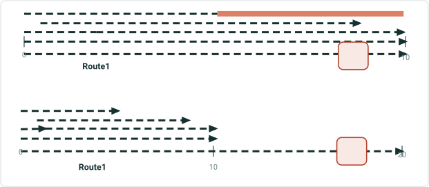

| LRS Identify Results |  |  |  |  |  | X |
| --- | --- | --- | --- | --- | --- | --- |
| Network: | CountyLog |  |  | > |  |  |
| RouteID: | 001 |  |  |  |  |  |
| RouteName: | Route1 |  |  |  |  |  |
| Min Measure: | 0 miles |  |  |  |  |  |
| Max Measure: | 10 miles |  |  |  |  |  |
| Measure: | 9 miles |  |  |  |  |  |
| Time: | 1/1/2005 to 1/1/2008 |  |  |  | > |  |
|  |  |  |  |  |  |  |
| Attribute | Value |  |  |  |  |  |
| Jurisdiction | Local |  |  |  |  |  |
| County | Shasta |  |  |  |  |  |
|  |  |  |  |  |  |  |
| Hide Event Information |  |  | > |  |  |  |
| No event information to display |  |  |  |  |  |  |

| LRS Identify Results |  |  |  |  |  |  | X |
| --- | --- | --- | --- | --- | --- | --- | --- |
| Network: | CountyLog |  |  |  | > |  |  |
| RouteID: | 001 |  |  |  |  |  |  |
| RouteName: | Route1 |  |  |  |  |  |  |
| Min Measure: | 0 miles |  |  |  |  |  |  |
| Max Measure: | 10 miles |  |  |  |  |  |  |
| Measure: | 9 miles |  |  |  |  |  |  |
| Time: | 1/1/2003-1/1/2005 |  |  |  |  | > |  |
|  |  |  |  |  |  |  |  |
| Attribute | Value |  |  |  |  |  |  |
| Jurisdiction | Local |  |  |  |  |  |  |
| County | Shasta |  |  |  |  |  |  |
|  |  |  |  |  |  |  |  |
| Hide Event Information |  |  |  | > |  |  |  |
| Speed.SpeedLimit |  |  | 45 MPH |  |  |  |  |
| Speed.Record_Status |  |  | Retired |  |  |  |  |
| Access_Control.Access |  |  | Full Access |  |  |  |  |
| Access_Control.Record_S … |  |  | Retired |  |  |  |  |
| Facility_Type.Type |  |  | One-Way |  |  |  |  |
| Facility_Type.Record_Sta… |  |  | Retired |  |  |  |  |
| Pavement_Condition.Dat... |  |  | 2009 |  |  |  |  |
| Pavement_Condition.Rec … |  |  | Retired |  |  |  |  |
