# Merge Events Pro Test Plan

|   |   |
| --- | --- |
| **Kind** | Test Plan · Pro |
| **Release** | — |
| **Issue** | [ArcGISPro/ps-location-referencing#3921](https://devtopia.esri.com/ArcGISPro/ps-location-referencing/issues/3921) |
| **Source** | [3921-MergeEventsToolProTestPlan_V5.pptx](<https://esriis.sharepoint.com/sites/LocationReferencing/Shared%20Documents/General/Test%20Plans/3921-MergeEventsToolProTestPlan_V5.pptx>) |
| **Edited** | 2022-08-10 22:31 by Mac Christmas |
| **Extracted** | 2026-09-04 · lane `xmlstrip` |

<!-- metadata
```yaml
title: "Merge Events Pro Test Plan"
source_file: "3921-MergeEventsToolProTestPlan_V5.pptx"
source_url: "https://esriis.sharepoint.com/sites/LocationReferencing/Shared%20Documents/General/Test%20Plans/3921-MergeEventsToolProTestPlan_V5.pptx"
doc_id: 647
doc_kind: "Test Plan"
surface: "Pro"
doc_revision: "V5"
target_release: ""
pe: ""
dev: ""
author: "Mac Christmas"
last_edited_by: "Mac Christmas"
last_edited: "2022-08-10T22:31:08Z"
extracted: 2026-09-04
extraction_lane: xmlstrip
prompt_version: "v2.0.2"
keywords: ["merge events", "event merging", "event attributes", "gap calibration", "referents", "conflict prevention", "event retirement", "measure validation"]
tools: ["Merge Events"]
products: []
issues: ["ArcGISPro/ps-location-referencing#3921"]
related: [{"doc":437,"file":"merge-events-widget-test-plan__doc437.md","s":6.051},{"doc":675,"file":"merge-events-user-story__doc675.md","s":5.151},{"doc":491,"file":"splitting-events-in-arcgis-pro-test-plan__doc491.md","s":3.881},{"doc":638,"file":"add-point-event-tool-add-multipoint-events-tool-coordinate-offset-method-test__doc638.md","s":3.843},{"doc":466,"file":"merge-events-in-experience-builder__doc466.md","s":3.827}]
```
-->

## Summary

This test plan covers positive and negative test cases for the Merge Events tool in ArcGIS Pro. It includes scenarios for merging events with various date and measure configurations, gap calibration methods, referent preservation, conflict prevention, and error conditions related to event selection and measure validity.

## Related documents

<!-- related:begin -->
- [Merge Events Widget Test Plan](<https://esriis.sharepoint.com/sites/lrsworkspace/LRS Doc Index/Test Plans/merge-events-widget-test-plan__doc437.md>) — similar text 0.65 · 2 title words · 1 filename word · same kind/folder <!-- rel:437 -->
- [Merge Events User Story](<https://esriis.sharepoint.com/sites/lrsworkspace/LRS Doc Index/User Stories/merge-events-user-story__doc675.md>) — similar text 0.61 · 2 title words · 2 filename words · same surface <!-- rel:675 -->
- [Splitting Events in ArcGIS Pro - Test Plan](<https://esriis.sharepoint.com/sites/lrsworkspace/LRS Doc Index/Test Plans/splitting-events-in-arcgis-pro-test-plan__doc491.md>) — similar text 0.19 · 2 title words · 1 filename word · same kind/surface/folder <!-- rel:491 -->
- [Add Point Event tool/ Add Multipoint Events tool Coordinate offset method – Test Plan](<https://esriis.sharepoint.com/sites/lrsworkspace/LRS Doc Index/Test Plans/add-point-event-tool-add-multipoint-events-tool-coordinate-offset-method-test__doc638.md>) — similar text 0.22 · 1 title word · 2 filename words · same kind/surface/folder <!-- rel:638 -->
- [Merge Events in Experience Builder](<https://esriis.sharepoint.com/sites/lrsworkspace/LRS Doc Index/User Stories/merge-events-in-experience-builder__doc466.md>) — similar text 0.48 · 2 title words · 2 filename words <!-- rel:466 -->
<!-- related:end -->

<!-- docs:begin -->
## Esri documentation

[Merge events](https://doc.esri.com/en/arcgis-pro/latest/help/production/roads-highways/merge-events.html) · [Event editing using the attribute table](https://doc.esri.com/en/arcgis-pro/latest/help/production/location-referencing-pipelines/event-editing-using-the-attribute-table.html) · [Storing referent and offset information for event location](https://doc.esri.com/en/arcgis-pro/latest/help/production/location-referencing-pipelines/storing-referent-and-offset-information-for-event-location.html) · [Conflict prevention](https://doc.esri.com/en/arcgis-pro/latest/help/production/location-referencing-pipelines/conflict-prevention.html) · [Event behavior for route retirement](https://doc.esri.com/en/arcgis-pro/latest/help/production/location-referencing-pipelines/event-behavior-for-route-retirement.html)
<!-- docs:end -->

---

## Slide 1

Merge Events Pro Test Plan

| Positive Tests |
| --- |
| Merge events without changing the To Date or the From and To Measures. Merge events with changed From/To Dates. Merge events shortening/lengthening the output merged event using the From Measure value. Merge events shortening/lengthening the output merged event using the To Measure value. Merge events shortening/lengthening the output merged event using both the From and To Measure values. Merge events with different gap calibration configurations (stepping increment, adding increment, or Euclidean distance). Merge events with referents present for both the location of first event and the last event. The referent information will remain intact if the resultant event’s From and/or To Measures are not changed. Merge events with overlaps. Merge non co-incident events. The gap between the events will be filled for the resultant event. Upon running the tool, all input events are retired correctly, populating the To Date of input events with the entered From Date within the Merge Events tool. Conflict Prevention is applied correctly, with event locks being checked for and acquired (if no existing lock) once the merge button is clicked. Merge events with many input events. Merge events with different From/To Dates. Merge events with different route From/To Dates. Merge events with the output event having the same From Date as the input events. Merge events with the output event having the same From Date as one of the input events. |

| Notes |
| --- |
| Test with line and non-line networks. Test with spanning and non-spanning line events. Test with gapped and normal routes. Test with projected and unprojected data. Only feature service data is supported. Same workflow as Event Editor. REST call will go through LRS apply edits. Verify core tools that result in a merge don’t work with LRS event layers (in both Pro and REST). |

## Slide 2

| Positive Tests: Tool UI |
| --- |
| Only feature service line events are within the Event parameter drop-down menu. An event is selected by default within the Event parameter drop-down menu when Merge Events is opened. If there are already event features selected within the map, an event is not selected by default from the Event parameter drop-down menu. Once a valid event is chosen, the mouse pointer will become a rectangle feature selector by default. Selection type drop-down menu shows the same options as the choose centerline tool (rectangle, polygon, lasso, etc.). Once an event is selected from the specified event feature class, the events will become highlighted on the map and within the event’s attribute table. Only events from the chosen event feature class can be selected by the Merge Events selection tool. Once an event is selected from the specified event feature class, the Events to Merge section appears. Once the tool is executed, the form collapses to its initial state and provides a successful execution message at the top of the tool pane. Once the tool is executed and the output merged event is created successfully, refresh the layer on the map and flash the output merged event 3 times. Input event feature’s Object IDs are the identifiers within the Events to Merge section. Input events are sorted by the order of increasing calibration along a line/route in the Events to Merge section. The first input event on the list is selected to preserve by default in the Events to Merge section. The delete key removes input events from the list in the Events to Merge section. Clicking the “x” on input events will remove them from the Events to Merge section. If there are more than 5 input events, a vertical scroll bar appears. The list of input events selected is dynamically updated as the selection changes through the attribute table/map. The selection within the map is updated when input events are added/removed from Events to Merge. The event feature selected from the Events to Merge section has “(preserve)” and its Event ID will be used for the resultant merged event. Only one input event feature at a time can be selected to preserve within the Events to Merge section. When an input event feature is selected to preserve within the Events to Merge Section, ensure that it is flashed 3 times within the map. If an input event has already been selected before opening the Merge Events tool, selecting the event feature class from the Event parameter drop-down menu will populate the Events to Merge section with the selected input events. Upon opening the attribute table of an event feature class where input events have been selected within the Merge Events tool, the event feature’s attribute table will show the same selection. |

## Slide 3

| Positive Tests: Tool UI (Continued) |
| --- |
| The From Date is populated with the current date as default and can be edited by the user. For non-line spanning events, a checkbox appears to choose the route’s start date for the resultant merged event’s From Date. For non-line spanning events, a checkbox appears to use the route’s end date for the resultant merged event’s To Date. Within the Merged Event Attributes section, the fields OID, Shape_Length, Loc_Error , Referent, Global ID, and all editor tracking fields are not shown. Fields Event ID and Route ID/Name are not editable. Event ID is populated from the selected (preserve) input event. From Route and To Route are provided if the event is spanning and if the Route Name field is configured for the network. Route Name for non-spanning events is provided if Route Name is configured for the network. Route ID is provided for non-spanning events if no Route Name is configured for the network. From Measure of the resultant merged event is equal to the first event in the increasing order of calibration of the line/route. To Measure of the resultant merged event is equal to the last event in the increasing order of calibration of the line/route. Domains, subtypes, contingent values, attribute rules, and non-nullable fields are supported within the editing grid. Required fields are denoted within the Merged Event Attributes section. If there are many editable fields, a vertical scroll bar appears. |

| Negative Tests: Error |
| --- |
| Only one line event is selected. From Date/To Date is changed to dates outside the time extent. Resultant merged event’s From Date is after the From/To Route’s To Date. Resultant merged event’s To Date is before the From/To Route’s From Date. Type no value From/To Measure or a From/To Measure that is invalid for the route. From Measure is equal to the To Measure when merging on the same route. From Measure is greater than the To Measure when merging on the same route. The resultant merged event’s To Date is before the resultant merged event’s From Date. The resultant merged event’s To Date is the same date as the resultant merged event’s From Date. Select input events that belong to multiple lines on a line network. Select input events that belong to multiple routes for a non-spanning event. Conflict Prevention locks on a route with input events (from a user in another version) prevents the merge. |

## Slide 4

| Negative Tests: Error |
| --- |
| Conflict Prevention locks on events being edited (from a user in another version) prevents the merge. A reconcile with the default version is required before acquiring locks. For cases 10-14, despite no lock acquired, the input events will remain selected. Number of decimals in the measure fields exceed from that allowed for the event feature class. Route on a line network with input events is reversed. |

## Slide 5

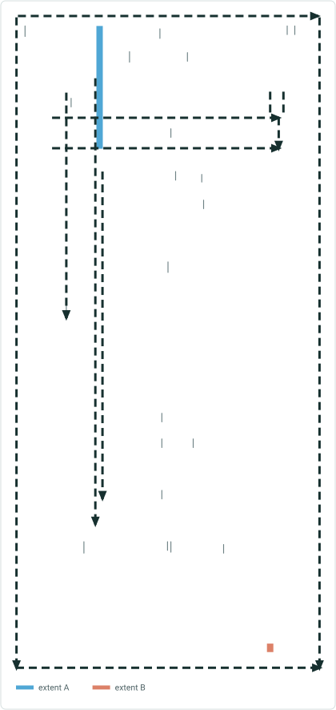


## Slide 6

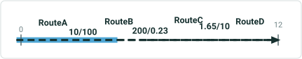

| RouteID | From Date | To Date | From Measure | To Measure |
| --- | --- | --- | --- | --- |
| RouteA | 1/1/2000 | Null | 0 | 10 |
| RouteB | 1/1/2000 | Null | 100 | 200 |
| RouteC | 1/1/2000 | Null | 0.23 | 1.65 |
| RouteD | 1/1/2000 | Null | 10 | 12 |

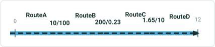

| EventID | From Date | To Date | From Route | From Measure | To Route | To Measure | Attribute |
| --- | --- | --- | --- | --- | --- | --- | --- |
| Event1 | 1/1/2001 | Null | RouteA | 0 | RouteB | 150 | X |
| Event2 | 1/1/2001 | Null | RouteB | 150 | RouteD | 12 | Y |

| EventID | From Date | To Date | From Route | From Measure | To Route | To Measure | Attribute |
| --- | --- | --- | --- | --- | --- | --- | --- |
| Event1 | 1/1/2005 | Null | RouteA | 0 | RouteD | 12 | X |

- Merge events without changing To Date or From/To Measures

| EventID | From Date | To Date | From Route | From Measure | To Route | To Measure | Attribute |
| --- | --- | --- | --- | --- | --- | --- | --- |
| Event1 | 1/1/2001 | 1/1/2005 | RouteA | 0 | RouteB | 150 | X |
| Event2 | 1/1/2001 | 1/1/2005 | RouteB | 150 | RouteD | 12 | Y |

## Case 2 <!-- slide 7 -->

### Merge Events with Changed To Date

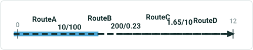

| RouteID | From Date | To Date | From Measure | To Measure |
| --- | --- | --- | --- | --- |
| RouteA | 1/1/2000 | Null | 0 | 10 |
| RouteB | 1/1/2000 | Null | 100 | 200 |
| RouteC | 1/1/2000 | Null | 0.23 | 1.65 |
| RouteD | 1/1/2000 | Null | 10 | 12 |


| EventID | From Date | To Date | From Route | From Measure | To Route | To Measure | Attribute |
| --- | --- | --- | --- | --- | --- | --- | --- |
| Event1 | 1/1/2001 | Null | RouteA | 0 | RouteB | 150 | X |
| Event2 | 1/1/2001 | Null | RouteB | 150 | RouteD | 12 | Y |

| EventID | From Date | To Date | From Route | From Measure | To Route | To Measure | Attribute |
| --- | --- | --- | --- | --- | --- | --- | --- |
| Event1 | 1/1/2005 | 1/1/2020 | RouteA | 0 | RouteD | 12 | X |

| EventID | From Date | To Date | From Route | From Measure | To Route | To Measure | Attribute |
| --- | --- | --- | --- | --- | --- | --- | --- |
| Event1 | 1/1/2001 | 1/1/2005 | RouteA | 0 | RouteB | 150 | X |
| Event2 | 1/1/2001 | 1/1/2005 | RouteB | 150 | RouteD | 12 | Y |

## Slide 8

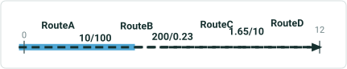

| RouteID | From Date | To Date | From Measure | To Measure |
| --- | --- | --- | --- | --- |
| RouteA | 1/1/2000 | Null | 0 | 10 |
| RouteB | 1/1/2000 | Null | 100 | 200 |
| RouteC | 1/1/2000 | Null | 0.23 | 1.65 |
| RouteD | 1/1/2000 | Null | 10 | 12 |

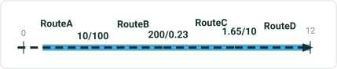

| EventID | From Date | To Date | From Route | From Measure | To Route | To Measure | Attribute |
| --- | --- | --- | --- | --- | --- | --- | --- |
| Event1 | 1/1/2001 | Null | RouteA | 0 | RouteB | 150 | X |
| Event2 | 1/1/2001 | Null | RouteB | 150 | RouteD | 12 | Y |

| EventID | From Date | To Date | From Route | From Measure | To Route | To Measure | Attribute |
| --- | --- | --- | --- | --- | --- | --- | --- |
| Event1 | 1/1/2005 | Null | RouteA | 5 | RouteD | 12 | X |

3A. Merge events shortening the output merged event using the From Measure value.

| EventID | From Date | To Date | From Route | From Measure | To Route | To Measure | Attribute |
| --- | --- | --- | --- | --- | --- | --- | --- |
| Event1 | 1/1/2001 | 1/1/2005 | RouteA | 0 | RouteB | 150 | X |
| Event2 | 1/1/2001 | 1/1/2005 | RouteB | 150 | RouteD | 12 | Y |

## Slide 9

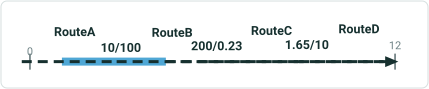

| RouteID | From Date | To Date | From Measure | To Measure |
| --- | --- | --- | --- | --- |
| RouteA | 1/1/2000 | Null | 0 | 10 |
| RouteB | 1/1/2000 | Null | 100 | 200 |
| RouteC | 1/1/2000 | Null | 0.23 | 1.65 |
| RouteD | 1/1/2000 | Null | 10 | 12 |

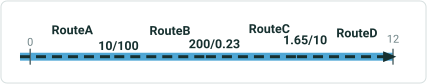

| EventID | From Date | To Date | From Route | From Measure | To Route | To Measure | Attribute |
| --- | --- | --- | --- | --- | --- | --- | --- |
| Event1 | 1/1/2001 | Null | RouteA | 5 | RouteB | 150 | X |
| Event2 | 1/1/2001 | Null | RouteB | 150 | RouteD | 12 | Y |

| EventID | From Date | To Date | From Route | From Measure | To Route | To Measure | Attribute |
| --- | --- | --- | --- | --- | --- | --- | --- |
| Event1 | 1/1/2005 | Null | RouteA | 0 | RouteD | 12 | X |

3B. Merge events lengthening the output merged event using the From Measure value.

| EventID | From Date | To Date | From Route | From Measure | To Route | To Measure | Attribute |
| --- | --- | --- | --- | --- | --- | --- | --- |
| Event1 | 1/1/2001 | 1/1/2005 | RouteA | 5 | RouteB | 150 | X |
| Event2 | 1/1/2001 | 1/1/2005 | RouteB | 150 | RouteD | 12 | Y |

## Slide 10

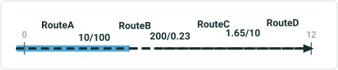

| RouteID | From Date | To Date | From Measure | To Measure |
| --- | --- | --- | --- | --- |
| RouteA | 1/1/2000 | Null | 0 | 10 |
| RouteB | 1/1/2000 | Null | 100 | 200 |
| RouteC | 1/1/2000 | Null | 0.23 | 1.65 |
| RouteD | 1/1/2000 | Null | 10 | 12 |

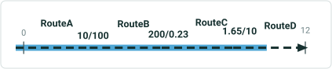

| EventID | From Date | To Date | From Route | From Measure | To Route | To Measure | Attribute |
| --- | --- | --- | --- | --- | --- | --- | --- |
| Event1 | 1/1/2001 | Null | RouteA | 0 | RouteB | 150 | X |
| Event2 | 1/1/2001 | Null | RouteB | 150 | RouteD | 12 | Y |

| EventID | From Date | To Date | From Route | From Measure | To Route | To Measure | Attribute |
| --- | --- | --- | --- | --- | --- | --- | --- |
| Event1 | 1/1/2005 | Null | RouteA | 0 | RouteD | 11 | X |

4A. Merge events shortening the output merged event using the To Measure value.

| EventID | From Date | To Date | From Route | From Measure | To Route | To Measure | Attribute |
| --- | --- | --- | --- | --- | --- | --- | --- |
| Event1 | 1/1/2001 | 1/1/2005 | RouteA | 5 | RouteB | 150 | X |
| Event2 | 1/1/2001 | 1/1/2005 | RouteB | 150 | RouteD | 12 | Y |

## Slide 11

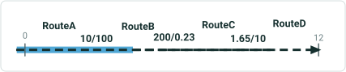

| RouteID | From Date | To Date | From Measure | To Measure |
| --- | --- | --- | --- | --- |
| RouteA | 1/1/2000 | Null | 0 | 10 |
| RouteB | 1/1/2000 | Null | 100 | 200 |
| RouteC | 1/1/2000 | Null | 0.23 | 1.65 |
| RouteD | 1/1/2000 | Null | 10 | 12 |

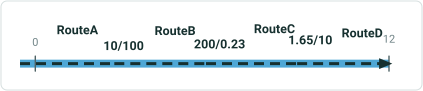

| EventID | From Date | To Date | From Route | From Measure | To Route | To Measure | Attribute |
| --- | --- | --- | --- | --- | --- | --- | --- |
| Event1 | 1/1/2001 | Null | RouteA | 0 | RouteB | 150 | X |
| Event2 | 1/1/2001 | Null | RouteB | 150 | RouteD | 11 | Y |

| EventID | From Date | To Date | From Route | From Measure | To Route | To Measure | Attribute |
| --- | --- | --- | --- | --- | --- | --- | --- |
| Event1 | 1/1/2005 | Null | RouteA | 0 | RouteD | 12 | X |

4B. Merge events lengthening the output merged event using the To Measure value.

| EventID | From Date | To Date | From Route | From Measure | To Route | To Measure | Attribute |
| --- | --- | --- | --- | --- | --- | --- | --- |
| Event1 | 1/1/2001 | 1/1/2005 | RouteA | 0 | RouteB | 150 | X |
| Event2 | 1/1/2001 | 1/1/2005 | RouteB | 150 | RouteD | 11 | Y |

## Case 5 <!-- slide 12 -->

### Merge Events Altering the Output Merged Event Using Both the

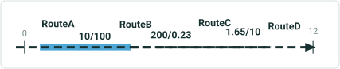

| RouteID | From Date | To Date | From Measure | To Measure |
| --- | --- | --- | --- | --- |
| RouteA | 1/1/2000 | Null | 0 | 10 |
| RouteB | 1/1/2000 | Null | 100 | 200 |
| RouteC | 1/1/2000 | Null | 0.23 | 1.65 |
| RouteD | 1/1/2000 | Null | 10 | 12 |

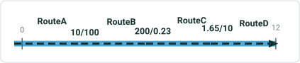

| EventID | From Date | To Date | From Route | From Measure | To Route | To Measure | Attribute |
| --- | --- | --- | --- | --- | --- | --- | --- |
| Event1 | 1/1/2001 | Null | RouteA | 5 | RouteB | 150 | X |
| Event2 | 1/1/2001 | Null | RouteB | 150 | RouteD | 11 | Y |

| EventID | From Date | To Date | From Route | From Measure | To Route | To Measure | Attribute |
| --- | --- | --- | --- | --- | --- | --- | --- |
| Event1 | 1/1/2005 | Null | RouteA | 0 | RouteD | 12 | X |

**Merge events altering the output merged event using both the From and To Measure values.**

| EventID | From Date | To Date | From Route | From Measure | To Route | To Measure | Attribute |
| --- | --- | --- | --- | --- | --- | --- | --- |
| Event1 | 1/1/2001 | 1/1/2005 | RouteA | 5 | RouteB | 150 | X |
| Event2 | 1/1/2001 | 1/1/2005 | RouteB | 150 | RouteD | 11 | Y |

## Slide 13

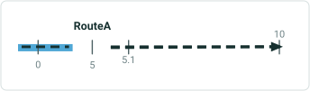

| RouteID | From Date | To Date | From Measure | To Measure |
| --- | --- | --- | --- | --- |
| RouteA | 1/1/2000 | Null | 0 | 10 |

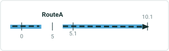

| EventID | From Date | To Date | From Measure | To Measure | Attribute |
| --- | --- | --- | --- | --- | --- |
| Event1 | 1/1/2001 | Null | 0 | 5 | X |
| Event2 | 1/1/2001 | Null | 5.1 | 10 | Y |

| EventID | From Date | To Date | From Measure | To Measure | Attribute |
| --- | --- | --- | --- | --- | --- |
| Event1 | 1/1/2005 | Null | 0 | 5 | X |
| Event2 | 1/1/2005 | Null | 5.1 | 10 |  |

6A. Merge events with different gap calibration configurations	 (stepping increment of 0.1)

| EventID | From Date | To Date | From Measure | To Measure | Attribute |
| --- | --- | --- | --- | --- | --- |
| Event1 | 1/1/2001 | 1/1/2005 | 0 | 5 | X |
| Event2 | 1/1/2001 | 1/1/2005 | 5.1 | 10 | Y |

## Slide 14

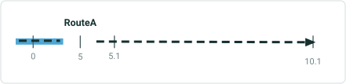

| RouteID | From Date | To Date | From Measure | To Measure |
| --- | --- | --- | --- | --- |
| RouteA | 1/1/2000 | Null | 0 | 10.1 |

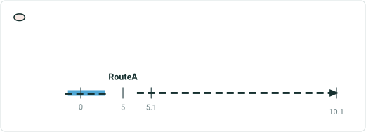

| EventID | From Date | To Date | From Measure | To Measure | Attribute |
| --- | --- | --- | --- | --- | --- |
| Event1 | 1/1/2001 | Null | 0 | 5 | X |
| Event2 | 1/1/2001 | Null | 5.1 | 10.1 | Y |

| EventID | From Date | To Date | From Measure | To Measure | Attribute |
| --- | --- | --- | --- | --- | --- |
| Event1 | 1/1/2005 | Null | 0 | 5 | X |
| Event1 | 1/1/2005 | Null | 5.1 | 10.1 | X |

6B. Merge events with different gap calibration configurations	 (adding increment of 0.1)

| EventID | From Date | To Date | From Measure | To Measure | Attribute |
| --- | --- | --- | --- | --- | --- |
| Event1 | 1/1/2001 | 1/1/2005 | 0 | 5 | X |
| Event2 | 1/1/2001 | 1/1/2005 | 5.1 | 10.1 | Y |

## Slide 15

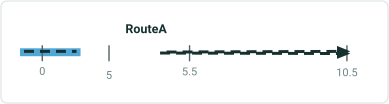

| RouteID | From Date | To Date | From Measure | To Measure |
| --- | --- | --- | --- | --- |
| RouteA | 1/1/2000 | Null | 0 | 10.1 |

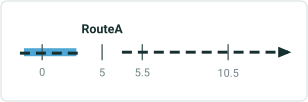

| EventID | From Date | To Date | From Measure | To Measure | Attribute |
| --- | --- | --- | --- | --- | --- |
| Event1 | 1/1/2001 | Null | 0 | 5 | X |
| Event2 | 1/1/2001 | Null | 5.5 | 10.5 | Y |

| EventID | From Date | To Date | From Measure | To Measure | Attribute |
| --- | --- | --- | --- | --- | --- |
| Event1 | 1/1/2005 | Null | 0 | 5 | X |
| Event1 | 1/1/2005 | Null | 5.5 | 10.5 | X |

6C. Merge events with different gap calibration configurations	 (Euclidean distance)
Physical gap of 0.5

| EventID | From Date | To Date | From Measure | To Measure | Attribute |
| --- | --- | --- | --- | --- | --- |
| Event1 | 1/1/2001 | 1/1/2005 | 0 | 5 | X |
| Event2 | 1/1/2001 | 1/1/2005 | 5.5 | 10.5 | Y |

## Case 7 <!-- slide 16 -->

### Merge Events with Referents Present for Both the Location of

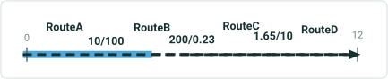

| RouteID | From Date | To Date | From Measure | To Measure |
| --- | --- | --- | --- | --- |
| RouteA | 1/1/2000 | Null | 0 | 10 |
| RouteB | 1/1/2000 | Null | 100 | 200 |
| RouteC | 1/1/2000 | Null | 0.23 | 1.65 |
| RouteD | 1/1/2000 | Null | 10 | 12 |

| EventID | From Date | To Date | From Route | From Measure | From Ref Method | From Ref Location | From Ref Offset | To Route | To Measure | To Ref Method | To Ref Location | To Ref Offset |
| --- | --- | --- | --- | --- | --- | --- | --- | --- | --- | --- | --- | --- |
| Event1 | 1/1/2001 | Null | RouteA | 0 | XY | 38.5, 120.5 | 0 | RouteB | 150 | XY | 38.6, 120.5 | 0 |
| Event2 | 1/1/2001 | Null | RouteB | 150 | XY | 38.6, 120.5 | 0 | RouteD | 12 | XY | 38.6, 120.5 | 0 |

**Merge events with referents present for both the location of first event to the last event without changing the From Measure and To Measure. The referent information will remain intact.**

| EventID | From Date | To Date | From Route | From Measure | From Ref Method | From Ref Location | From Ref Offset | To Route | To Measure | To Ref Method | To Ref Location | To Ref Offset |
| --- | --- | --- | --- | --- | --- | --- | --- | --- | --- | --- | --- | --- |
| Event1 | 1/1/2005 | Null | RouteA | 0 | XY | 38.5, 120.5 | 0 | RouteD | 12 | XY | 38.6, 120.5 | 0 |

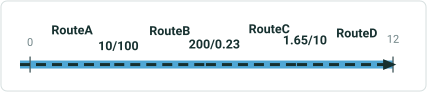

| Attribute |
| --- |
| X |
| Y |

| Attribute |
| --- |
| X |

| EventID | From Date | To Date | From Route | From Measure | From Ref Method | From Ref Location | From Ref Offset | To Route | To Measure | To Ref Method | To Ref Location | To Ref Offset |
| --- | --- | --- | --- | --- | --- | --- | --- | --- | --- | --- | --- | --- |
| Event1 | 1/1/2001 | 1/1/2005 | RouteA | 0 | XY | 38.5, 120.5 | 0 | RouteB | 150 | XY | 38.6, 120.5 | 0 |
| Event2 | 1/1/2001 | 1/1/2005 | RouteB | 150 | XY | 38.6, 120.5 | 0 | RouteD | 12 | XY | 38.6, 120.5 | 0 |

| Attribute |
| --- |
| X |
| Y |

## Case 8 <!-- slide 17 -->

### Merge Events with Overlaps

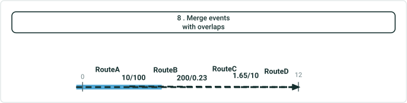

| RouteID | From Date | To Date | From Measure | To Measure |
| --- | --- | --- | --- | --- |
| RouteA | 1/1/2000 | Null | 0 | 10 |
| RouteB | 1/1/2000 | Null | 100 | 200 |
| RouteC | 1/1/2000 | Null | 0.23 | 1.65 |
| RouteD | 1/1/2000 | Null | 10 | 12 |

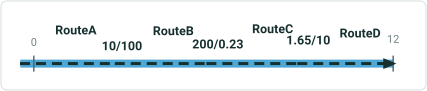

| EventID | From Date | To Date | From Route | From Measure | To Route | To Measure | Attribute |
| --- | --- | --- | --- | --- | --- | --- | --- |
| Event1 | 1/1/2001 | Null | RouteA | 0 | RouteB | 150 | X |
| Event2 | 1/1/2001 | Null | RouteB | 100 | RouteD | 12 | Y |

| EventID | From Date | To Date | From Route | From Measure | To Route | To Measure | Attribute |
| --- | --- | --- | --- | --- | --- | --- | --- |
| Event1 | 1/1/2005 | Null | RouteA | 0 | RouteD | 12 | X |

| EventID | From Date | To Date | From Route | From Measure | To Route | To Measure | Attribute |
| --- | --- | --- | --- | --- | --- | --- | --- |
| Event1 | 1/1/2001 | 1/1/2005 | RouteA | 0 | RouteB | 150 | X |
| Event2 | 1/1/2001 | 1/1/2005 | RouteB | 100 | RouteD | 12 | Y |

## Case 9 <!-- slide 18 -->

### Merge Non Co-incident Events


| RouteID | From Date | To Date | From Measure | To Measure |
| --- | --- | --- | --- | --- |
| RouteA | 1/1/2000 | Null | 0 | 10 |
| RouteB | 1/1/2000 | Null | 100 | 200 |
| RouteC | 1/1/2000 | Null | 10 | 20 |
| RouteD | 1/1/2000 | Null | 10 | 12 |

| EventID | From Date | To Date | From Route | From Measure | To Route | To Measure | Attribute |
| --- | --- | --- | --- | --- | --- | --- | --- |
| Event1 | 1/1/2001 | Null | RouteA | 0 | RouteB | 200 | X |
| Event2 | 1/1/2001 | Null | RouteC | 15 | RouteD | 12 | Y |

| EventID | From Date | To Date | From Route | From Measure | To Route | To Measure | Attribute |
| --- | --- | --- | --- | --- | --- | --- | --- |
| Event2 | 1/1/2005 | Null | RouteA | 0 | RouteD | 12 | Y |

| EventID | From Date | To Date | From Route | From Measure | To Route | To Measure | Attribute |
| --- | --- | --- | --- | --- | --- | --- | --- |
| Event1 | 1/1/2001 | 1/1/2005 | RouteA | 0 | RouteB | 200 | X |
| Event2 | 1/1/2001 | 1/1/2005 | RouteC | 15 | RouteD | 12 | Y |

## Case 10 <!-- slide 19 -->

### Input Events Are Retired Correctly

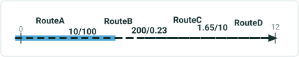

| RouteID | From Date | To Date | From Measure | To Measure |
| --- | --- | --- | --- | --- |
| RouteA | 1/1/2000 | Null | 0 | 10 |
| RouteB | 1/1/2000 | Null | 100 | 200 |
| RouteC | 1/1/2000 | Null | 0.23 | 1.65 |
| RouteD | 1/1/2000 | Null | 10 | 12 |

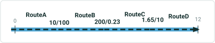

| EventID | From Date | To Date | From Route | From Measure | To Route | To Measure | Attribute |
| --- | --- | --- | --- | --- | --- | --- | --- |
| Event1 | 1/1/2001 | Null | RouteA | 0 | RouteB | 150 | X |
| Event2 | 1/1/2001 | Null | RouteB | 150 | RouteD | 12 | Y |

| EventID | From Date | To Date | From Route | From Measure | To Route | To Measure | Attribute |
| --- | --- | --- | --- | --- | --- | --- | --- |
| Event1 | 1/1/2005 | Null | RouteA | 0 | RouteD | 12 | X |

**Input events are retired correctly, populating the To Date of input events with the entered From Date within the Merge Events tool.**

| EventID | From Date | To Date | From Route | From Measure | To Route | To Measure | Attribute |
| --- | --- | --- | --- | --- | --- | --- | --- |
| Event1 | 1/1/2001 | 1/1/2005 | RouteA | 0 | RouteB | 150 | X |
| Event2 | 1/1/2001 | 1/1/2005 | RouteB | 150 | RouteD | 12 | Y |

## Case 11 <!-- slide 20 -->

### Conflict Prevention Is Applied Correctly

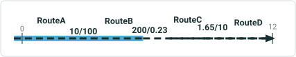

| RouteID | From Date | To Date | From Measure | To Measure |
| --- | --- | --- | --- | --- |
| RouteA | 1/1/2000 | Null | 0 | 10 |
| RouteB | 1/1/2000 | Null | 100 | 200 |
| RouteC | 1/1/2000 | Null | 10 | 20 |
| RouteD | 1/1/2000 | Null | 10 | 12 |

| EventID | From Date | To Date | From Route | From Measure | To Route | To Measure | Attribute |
| --- | --- | --- | --- | --- | --- | --- | --- |
| Event1 | 1/1/2001 | Null | RouteA | 0 | RouteB | 200 | X |
| Event2 | 1/1/2001 | Null | RouteC | 15 | RouteD | 12 | Y |

**Conflict Prevention is applied correctly, with event locks being checked for and acquired (if no existing lock) once the merge button is clicked.**

| EventID | From Date | To Date | From Route | From Measure | To Route | To Measure | Attribute |
| --- | --- | --- | --- | --- | --- | --- | --- |
| Event2 | 1/1/2005 | Null | RouteA | 0 | RouteD | 12 | Y |

| EventID | From Date | To Date | From Route | From Measure | To Route | To Measure | Attribute |
| --- | --- | --- | --- | --- | --- | --- | --- |
| Event1 | 1/1/2001 | 1/1/2005 | RouteA | 0 | RouteB | 200 | X |
| Event2 | 1/1/2001 | 1/1/2005 | RouteC | 15 | RouteD | 12 | Y |


## Case 12 <!-- slide 21 -->

### Merge Events with Many Input Events

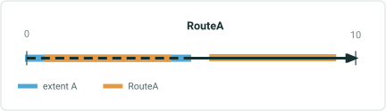

| RouteID | From Date | To Date | From Measure | To Measure |
| --- | --- | --- | --- | --- |
| RouteA | 1/1/2000 | Null | 0 | 10 |

| EventID | From Date | To Date | Route | From Measure | To Measure | Attribute |
| --- | --- | --- | --- | --- | --- | --- |
| Event1 | 1/1/2000 | Null | RouteA | 0 | 5 | X |
| Event2 | 1/1/2010 | Null | RouteA | 5 | 10 | Y |
| Event3 | 1/1/2011 | Null | RouteA | 2 | 4 | Z |
| Event4 | 1/1/2015 | Null | RouteA | 6 | 9 | A |

| EventID | From Date | To Date | Route | From Measure | To Measure | Attribute |
| --- | --- | --- | --- | --- | --- | --- |
| Event1 | 1/1/2016 | Null | RouteA | 0 | 10 | X |

| EventID | From Date | To Date | Route | From Measure | To Measure | Attribute |
| --- | --- | --- | --- | --- | --- | --- |
| Event1 | 1/1/2000 | 1/1/2016 | RouteA | 0 | 5 | X |
| Event2 | 1/1/2010 | 1/1/2016 | RouteA | 5 | 10 | Y |
| Event3 | 1/1/2011 | 1/1/2016 | RouteA | 2 | 4 | Z |
| Event4 | 1/1/2015 | 1/1/2016 | RouteA | 6 | 9 | A |

## Case 13 <!-- slide 22 -->

### Merge Events with Different From / To Dates.


| RouteID | From Date | To Date | From Measure | To Measure |
| --- | --- | --- | --- | --- |
| RouteA | 1/1/2000 | Null | 0 | 10 |
| RouteB | 1/1/2000 | Null | 100 | 200 |
| RouteC | 1/1/2000 | Null | 10 | 20 |
| RouteD | 1/1/2000 | Null | 10 | 12 |

| EventID | From Date | To Date | From Route | From Measure | To Route | To Measure | Attribute |
| --- | --- | --- | --- | --- | --- | --- | --- |
| Event1 | 1/1/2005 | Null | RouteA | 0 | RouteB | 200 | X |
| Event2 | 1/1/2003 | Null | RouteC | 15 | RouteD | 12 | Y |

**Merge events with different From/To Dates.**

| EventID | From Date | To Date | From Route | From Measure | To Route | To Measure | Attribute |
| --- | --- | --- | --- | --- | --- | --- | --- |
| Event2 | 1/1/2010 | Null | RouteA | 0 | RouteD | 12 | Y |

| EventID | From Date | To Date | From Route | From Measure | To Route | To Measure | Attribute |
| --- | --- | --- | --- | --- | --- | --- | --- |
| Event1 | 1/1/2005 | 1/1/2010 | RouteA | 0 | RouteB | 200 | X |
| Event2 | 1/1/2003 | 1/1/2010 | RouteC | 15 | RouteD | 12 | Y |

## Case 14 <!-- slide 23 -->

### Merge Events with Different Route From / To Dates.


| RouteID | From Date | To Date | From Measure | To Measure |
| --- | --- | --- | --- | --- |
| RouteA | 1/1/2000 | Null | 0 | 10 |
| RouteB | 1/1/2001 | Null | 100 | 200 |
| RouteC | 1/1/2001 | Null | 10 | 20 |
| RouteD | 1/1/2004 | Null | 10 | 12 |

| EventID | From Date | To Date | From Route | From Measure | To Route | To Measure | Attribute |
| --- | --- | --- | --- | --- | --- | --- | --- |
| Event1 | 1/1/2005 | Null | RouteA | 0 | RouteB | 200 | X |
| Event2 | 1/1/2006 | Null | RouteC | 15 | RouteD | 12 | Y |

**Merge events with different route From/To Dates.**

| EventID | From Date | To Date | From Route | From Measure | To Route | To Measure | Attribute |
| --- | --- | --- | --- | --- | --- | --- | --- |
| Event2 | 1/1/2010 | Null | RouteA | 0 | RouteD | 12 | Y |

| EventID | From Date | To Date | From Route | From Measure | To Route | To Measure | Attribute |
| --- | --- | --- | --- | --- | --- | --- | --- |
| Event1 | 1/1/2005 | 1/1/2010 | RouteA | 0 | RouteB | 200 | X |
| Event2 | 1/1/2003 | 1/1/2010 | RouteC | 15 | RouteD | 12 | Y |

## Case 15 <!-- slide 24 -->

### Merge Events with the Output Event Having the Same From Date

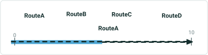

| RouteID | From Date | To Date | From Measure | To Measure |
| --- | --- | --- | --- | --- |
| RouteA | 1/1/2000 | Null | 0 | 10 |

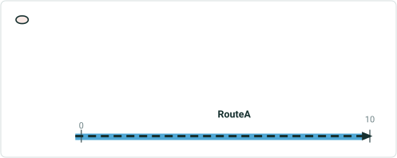

| EventID | From Date | To Date | From Measure | Route | To Measure | Attribute |
| --- | --- | --- | --- | --- | --- | --- |
| Event1 | 1/1/2001 | Null | 0 | RouteA | 5 | X |
| Event2 | 1/1/2001 | Null | 5 | RouteB | 10 | Y |

**Merge events with the output event having the same From Date as the input events.**

| EventID | From Date | To Date | From Measure | Route | To Measure | Attribute |
| --- | --- | --- | --- | --- | --- | --- |
| Event1 | 1/1/2001 | Null | 0 | RouteA | 10 | X |

Input events will be removed with the output event since Event1 and Event2’s From/To Dates are the same date.

## Case 16 <!-- slide 25 -->

### Merge Events with the Output Event Having the Same From Date


| RouteID | From Date | To Date | From Measure | To Measure |
| --- | --- | --- | --- | --- |
| RouteA | 1/1/2000 | Null | 0 | 10 |

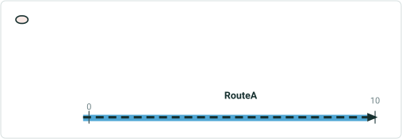

| EventID | From Date | To Date | From Measure | Route | To Measure | Attribute |
| --- | --- | --- | --- | --- | --- | --- |
| Event1 | 1/1/2002 | Null | 0 | RouteA | 5 | X |
| Event2 | 1/1/2001 | Null | 5 | RouteB | 10 | Y |

**Merge events with the output event having the same From Date as one of the input events.**

| EventID | From Date | To Date | From Measure | Route | To Measure | Attribute |
| --- | --- | --- | --- | --- | --- | --- |
| Event1 | 1/1/2002 | Null | 0 | RouteA | 10 | X |

Retired input events (Event1 is removed):

| EventID | From Date | To Date | From Measure | Route | To Measure | Attribute |
| --- | --- | --- | --- | --- | --- | --- |
| Event2 | 1/1/2001 | 1/1/2002 | 5 | RouteB | 10 | Y |

## Case 1 <!-- slide 26 -->

### Only One Line Event Is Selected.

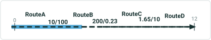

| RouteID | From Date | To Date | From Measure | To Measure |
| --- | --- | --- | --- | --- |
| RouteA | 1/1/2000 | Null | 0 | 10 |
| RouteB | 1/1/2000 | Null | 100 | 200 |
| RouteC | 1/1/2000 | Null | 0.23 | 1.65 |
| RouteD | 1/1/2000 | Null | 10 | 12 |

| EventID | From Date | To Date | From Route | From Measure | To Route | To Measure | Attribute |
| --- | --- | --- | --- | --- | --- | --- | --- |
| Event1 | 1/1/2001 | Null | RouteA | 0 | RouteB | 150 | X |

Only one event is selected.  The tools requires 2 minimum input events.

## Case 2 <!-- slide 27 -->

### From Date / To Date Is Changed To Dates Outside the Time

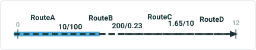

| RouteID | From Date | To Date | From Measure | To Measure |
| --- | --- | --- | --- | --- |
| RouteA | 1/1/2000 | Null | 0 | 10 |
| RouteB | 1/1/2000 | Null | 100 | 200 |
| RouteC | 1/1/2000 | Null | 0.23 | 1.65 |
| RouteD | 1/1/2000 | Null | 10 | 12 |

| EventID | From Date | To Date | From Route | From Measure | To Route | To Measure | Attribute |
| --- | --- | --- | --- | --- | --- | --- | --- |
| Event1 | 1/1/2001 | Null | RouteA | 0 | RouteB | 150 | X |
| Event2 | 1/1/2001 | Null | RouteB | 150 | RouteD | 12 | Y |

| EventID | From Date | To Date | From Route | From Measure | To Route | To Measure | Attribute |
| --- | --- | --- | --- | --- | --- | --- | --- |
| Event1 | 1/1/1600 | 1/1/3500 | RouteA | 0 | RouteD | 12 | X |

**From Date/To Date is changed to dates outside the time extent.**
The From and To Date values are not within the time extent of the map’s data.

## Slide 28

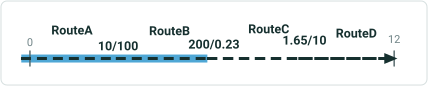

| RouteID | From Date | To Date | From Measure | To Measure |
| --- | --- | --- | --- | --- |
| RouteA | 1/1/2000 | 1/1/2015 | 0 | 10 |
| RouteB | 1/1/2000 | Null | 100 | 200 |
| RouteC | 1/1/2010 | Null | 0.23 | 1.65 |
| RouteD | 1/1/2010 | Null | 10 | 12 |

| EventID | From Date | To Date | From Route | From Measure | To Route | To Measure | Attribute |
| --- | --- | --- | --- | --- | --- | --- | --- |
| Event1 | 1/1/2001 | Null | RouteA | 0 | RouteB | 200 | X |
| Event2 | 1/1/2001 | Null | RouteC | 0.23 | RouteD | 12 | Y |

3A. Resultant merged event’s From Date is after the From Route’s To Date.
The From Route does not exist in the selected time frame.

| EventID | From Date | To Date | From Route | From Measure | To Route | To Measure | Attribute |
| --- | --- | --- | --- | --- | --- | --- | --- |
| Event1 | 1/1/2020 | Null | RouteA | 0 | RouteD | 12 | X |

## Slide 29

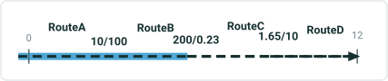

| RouteID | From Date | To Date | From Measure | To Measure |
| --- | --- | --- | --- | --- |
| RouteA | 1/1/2000 | Null | 0 | 10 |
| RouteB | 1/1/2000 | Null | 100 | 200 |
| RouteC | 1/1/2010 | Null | 0.23 | 1.65 |
| RouteD | 1/1/2010 | 1/1/2015 | 10 | 12 |

| EventID | From Date | To Date | From Route | From Measure | To Route | To Measure | Attribute |
| --- | --- | --- | --- | --- | --- | --- | --- |
| Event1 | 1/1/2001 | Null | RouteA | 0 | RouteB | 200 | X |
| Event2 | 1/1/2010 | Null | RouteC | 0.23 | RouteD | 12 | Y |

3B. Resultant merged event’s From Date is after the To Route’s To Date.
The To Route does not exist in the selected time frame.

| EventID | From Date | To Date | From Route | From Measure | To Route | To Measure | Attribute |
| --- | --- | --- | --- | --- | --- | --- | --- |
| Event1 | 1/1/2020 | Null | RouteA | 0 | RouteD | 12 | X |

## Slide 30

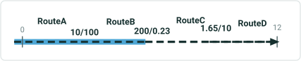

| RouteID | From Date | To Date | From Measure | To Measure |
| --- | --- | --- | --- | --- |
| RouteA | 1/1/2000 | Null | 0 | 10 |
| RouteB | 1/1/2000 | Null | 100 | 200 |
| RouteC | 1/1/2010 | Null | 0.23 | 1.65 |
| RouteD | 1/1/2010 | Null | 10 | 12 |

| EventID | From Date | To Date | From Route | From Measure | To Route | To Measure | Attribute |
| --- | --- | --- | --- | --- | --- | --- | --- |
| Event1 | 1/1/2001 | Null | RouteA | 0 | RouteB | 200 | X |
| Event2 | 1/1/2010 | Null | RouteC | 0.23 | RouteD | 12 | Y |

4A. Resultant merged event’s To Date is before the From Route’s From Date.
The From Route does not exist in the selected time frame.

| EventID | From Date | To Date | From Route | From Measure | To Route | To Measure | Attribute |
| --- | --- | --- | --- | --- | --- | --- | --- |
| Event1 | 1/1/1995 | Null | RouteA | 0 | RouteD | 12 | X |

## Slide 31


| RouteID | From Date | To Date | From Measure | To Measure |
| --- | --- | --- | --- | --- |
| RouteA | 1/1/2000 | Null | 0 | 10 |
| RouteB | 1/1/2000 | Null | 100 | 200 |
| RouteC | 1/1/2010 | Null | 0.23 | 1.65 |
| RouteD | 1/1/2010 | Null | 10 | 12 |

| EventID | From Date | To Date | From Route | From Measure | To Route | To Measure | Attribute |
| --- | --- | --- | --- | --- | --- | --- | --- |
| Event1 | 1/1/2001 | Null | RouteA | 0 | RouteB | 200 | X |
| Event2 | 1/1/2010 | Null | RouteC | 0.23 | RouteD | 12 | Y |

4B. Resultant merged event’s To Date is before the To Route’s From Date.
The To Route does not exist in the selected time frame.

| EventID | From Date | To Date | From Route | From Measure | To Route | To Measure | Attribute |
| --- | --- | --- | --- | --- | --- | --- | --- |
| Event1 | 1/1/1990 | Null | RouteA | 0 | RouteD | 12 | X |

## Slide 32


| RouteID | From Date | To Date | From Measure | To Measure |
| --- | --- | --- | --- | --- |
| RouteA | 1/1/2000 | Null | 0 | 10 |
| RouteB | 1/1/2000 | Null | 100 | 200 |
| RouteC | 1/1/2010 | Null | 0.23 | 1.65 |
| RouteD | 1/1/2010 | Null | 10 | 12 |

| EventID | From Date | To Date | From Route | From Measure | To Route | To Measure | Attribute |
| --- | --- | --- | --- | --- | --- | --- | --- |
| Event1 | 1/1/2000 | Null | RouteA | 0 | RouteB | 200 | X |
| Event2 | 1/1/2010 | Null | RouteC | 0.23 | RouteD | 12 | Y |

5A. Type a From Measure that is invalid for the route.
The output event’s From Measure is invalid.

| EventID | From Date | To Date | From Route | From Measure | To Route | To Measure | Attribute |
| --- | --- | --- | --- | --- | --- | --- | --- |
| Event1 | 1/1/2010 | Null | RouteA | 11 | RouteD | 12 | X |

## Slide 33

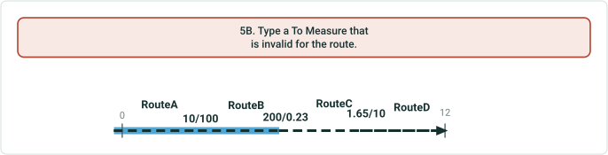

| RouteID | From Date | To Date | From Measure | To Measure |
| --- | --- | --- | --- | --- |
| RouteA | 1/1/2000 | Null | 0 | 10 |
| RouteB | 1/1/2000 | Null | 100 | 200 |
| RouteC | 1/1/2010 | Null | 0.23 | 1.65 |
| RouteD | 1/1/2010 | Null | 10 | 12 |

| EventID | From Date | To Date | From Route | From Measure | To Route | To Measure | Attribute |
| --- | --- | --- | --- | --- | --- | --- | --- |
| Event1 | 1/1/2000 | Null | RouteA | 0 | RouteB | 200 | X |
| Event2 | 1/1/2010 | Null | RouteC | 0.23 | RouteD | 12 | Y |

5B. Type a To Measure that is invalid for the route.
The output event’s To Measure is invalid.

| EventID | From Date | To Date | From Route | From Measure | To Route | To Measure | Attribute |
| --- | --- | --- | --- | --- | --- | --- | --- |
| Event1 | 1/1/2010 | Null | RouteA | 0 | RouteD | 15 | X |

## Case 6 <!-- slide 34 -->

### From Measure Is Equal To the To Measure When Merging on the

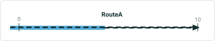

| RouteID | From Date | To Date | From Measure | To Measure |
| --- | --- | --- | --- | --- |
| RouteA | 1/1/2000 | Null | 0 | 10 |

| EventID | From Date | To Date | Route | From Measure | To Measure | Attribute |
| --- | --- | --- | --- | --- | --- | --- |
| Event1 | 1/1/2000 | Null | RouteA | 0 | 5 | X |
| Event2 | 1/1/2010 | Null | RouteA | 5 | 10 | Y |

**From Measure is equal to the To Measure when merging on the same route.**
The output event’s From and To Measure Values cannot be the same value.

| EventID | From Date | To Date | Route | From Measure | To Measure | Attribute |
| --- | --- | --- | --- | --- | --- | --- |
| Event1 | 1/1/2010 | Null | RouteA | 5 | 5 | X |

## Case 7 <!-- slide 35 -->

### From Measure Is Greater Than the To Measure When Merging on


| RouteID | From Date | To Date | From Measure | To Measure |
| --- | --- | --- | --- | --- |
| RouteA | 1/1/2000 | Null | 0 | 10 |

| EventID | From Date | To Date | Route | From Measure | To Measure | Attribute |
| --- | --- | --- | --- | --- | --- | --- |
| Event1 | 1/1/2000 | Null | RouteA | 0 | 5 | X |
| Event2 | 1/1/2010 | Null | RouteA | 5 | 10 | Y |

**From Measure is greater than the To Measure when merging on the same route.**
The output event’s From Measure is greater than the To Measure.

| EventID | From Date | To Date | Route | From Measure | To Measure | Attribute |
| --- | --- | --- | --- | --- | --- | --- |
| Event1 | 1/1/2010 | Null | RouteA | 10 | 5 | X |

## Case 8 <!-- slide 36 -->

### The Resultant Merged Event’s To Date Is Before the Resultant


| RouteID | From Date | To Date | From Measure | To Measure |
| --- | --- | --- | --- | --- |
| RouteA | 1/1/2000 | Null | 0 | 10 |

| EventID | From Date | To Date | Route | From Measure | To Measure | Attribute |
| --- | --- | --- | --- | --- | --- | --- |
| Event1 | 1/1/2000 | Null | RouteA | 0 | 5 | X |
| Event2 | 1/1/2010 | Null | RouteA | 5 | 10 | Y |

**The resultant merged event’s To Date is before the resultant merged event’s From Date.**
The output event’s To Date value is before the From Date value.

| EventID | From Date | To Date | From Measure | To Measure | Attribute |
| --- | --- | --- | --- | --- | --- |
| Event1 | 1/1/2020 | 1/1/2005 | 0 | 10 | X |

## Case 9 <!-- slide 37 -->

### The Resultant Merged Event’s To Date Is the Same Date as the

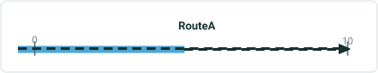

| RouteID | From Date | To Date | From Measure | To Measure |
| --- | --- | --- | --- | --- |
| RouteA | 1/1/2000 | Null | 0 | 10 |

| EventID | From Date | To Date | Route | From Measure | To Measure | Attribute |
| --- | --- | --- | --- | --- | --- | --- |
| Event1 | 1/1/2000 | Null | RouteA | 0 | 5 | X |
| Event2 | 1/1/2010 | Null | RouteA | 5 | 10 | Y |

**The resultant merged event’s To Date is the same date as the resultant merged event’s From Date.**
The output event’s From and To Dates are the same value.

| EventID | From Date | To Date | From Measure | To Measure | Attribute |
| --- | --- | --- | --- | --- | --- |
| Event1 | 1/1/2015 | 1/1/2015 | 0 | 10 | X |

## Case 10 <!-- slide 38 -->

### Select Input Events That Belong To Multiple Lines on a Line

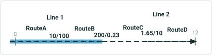

| RouteID | From Date | To Date | From Measure | To Measure |
| --- | --- | --- | --- | --- |
| RouteA | 1/1/2000 | Null | 0 | 10 |
| RouteB | 1/1/2000 | Null | 100 | 200 |
| RouteC | 1/1/2010 | Null | 0.23 | 1.65 |
| RouteD | 1/1/2010 | Null | 10 | 12 |

| EventID | From Date | To Date | From Route | From Measure | To Route | To Measure | Attribute |
| --- | --- | --- | --- | --- | --- | --- | --- |
| Event1 | 1/1/2000 | Null | RouteA | 0 | RouteB | 200 | X |
| Event2 | 1/1/2010 | Null | RouteC | 0.23 | RouteD | 12 | Y |

**Select input events that belong to multiple lines on a line network.**
The input events belong to different line.

## Case 11 <!-- slide 39 -->

### Select Input Events That Belong To Multiple Routes for a

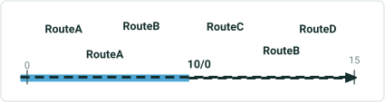

| RouteID | From Date | To Date | From Measure | To Measure |
| --- | --- | --- | --- | --- |
| RouteA | 1/1/2000 | Null | 0 | 10 |
| RouteB | 1/1/2000 | Null | 0 | 15 |

| EventID | From Date | To Date | From Measure | Route | To Measure | Attribute |
| --- | --- | --- | --- | --- | --- | --- |
| Event1 | 1/1/2000 | Null | 0 | RouteA | 10 | X |
| Event2 | 1/1/2010 | Null | 0 | RouteB | 15 | Y |

**Select input events that belong to multiple routes for a non-spanning event.**
The input events belong to a non-spanning event.  The output event cannot be spanning.

## Case 12 <!-- slide 40 -->

### Conflict Prevention Locks on a Route with Input Events (from

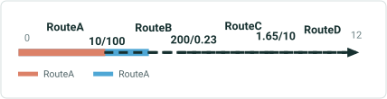

| RouteID | From Date | To Date | From Measure | To Measure |
| --- | --- | --- | --- | --- |
| RouteA | 1/1/2000 | Null | 0 | 10 |
| RouteB | 1/1/2000 | Null | 100 | 200 |
| RouteC | 1/1/2000 | Null | 0.23 | 1.65 |
| RouteD | 1/1/2000 | Null | 10 | 12 |

| EventID | From Date | To Date | From Route | From Measure | To Route | To Measure | Attribute |
| --- | --- | --- | --- | --- | --- | --- | --- |
| Event1 | 1/1/2000 | Null | RouteA | 0 | RouteB | 150 | X |
| Event2 | 1/1/2000 | Null | RouteB | 150 | RouteD | 12 | Y |

**Conflict Prevention locks on a route with input events (from a user in another version) prevents the merge.**
Locked in another version
Unable to acquire lock. RouteA has a lock due to another user editing the route  feature in another version.

## Slide 41

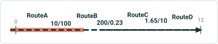

| RouteID | From Date | To Date | From Measure | To Measure |
| --- | --- | --- | --- | --- |
| RouteA | 1/1/2000 | Null | 0 | 10 |
| RouteB | 1/1/2000 | Null | 100 | 200 |
| RouteC | 1/1/2000 | Null | 0.23 | 1.65 |
| RouteD | 1/1/2000 | Null | 10 | 12 |

| EventID | From Date | To Date | From Route | From Measure | To Route | To Measure | Attribute |
| --- | --- | --- | --- | --- | --- | --- | --- |
| Event1 | 1/1/2000 | Null | RouteA | 0 | RouteB | 150 | X |
| Event2 | 1/1/2000 | Null | RouteB | 150 | RouteD | 12 | Y |

13A. Conflict Prevention locks on events being edited from a user in another version prevents the merge.
Locked in another version
Unable to acquire lock. Event1 has a lock due to another user editing the event feature in another version.

## Slide 42

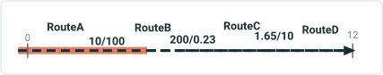

| RouteID | From Date | To Date | From Measure | To Measure |
| --- | --- | --- | --- | --- |
| RouteA | 1/1/2000 | Null | 0 | 10 |
| RouteB | 1/1/2000 | Null | 100 | 200 |
| RouteC | 1/1/2000 | Null | 0.23 | 1.65 |
| RouteD | 1/1/2000 | Null | 10 | 12 |

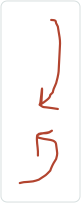

| EventID | From Date | To Date | From Route | From Measure | To Route | To Measure | Attribute |
| --- | --- | --- | --- | --- | --- | --- | --- |
| Event1 | 1/1/2000 | Null | RouteA | 0 | RouteB | 150 | X |
| Event2 | 1/1/2000 | Null | RouteB | 150 | RouteD | 12 | Y |

13B. Conflict Prevention locks on events being edited from a user in another version prevents the merge.
Locked in another version
Unable to acquire locks. Event1 and Event2 have locks due to other users editing the event features in other versions.

Locked in another version

## Case 16 <!-- slide 43 -->

### Number of Decimals in the Measure Fields Exceed From That

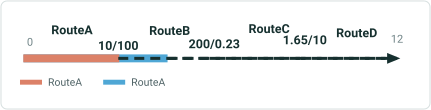

| RouteID | From Date | To Date | From Measure | To Measure |
| --- | --- | --- | --- | --- |
| RouteA | 1/1/2000 | Null | 0 | 10 |
| RouteB | 1/1/2000 | Null | 100 | 200 |
| RouteC | 1/1/2000 | Null | 0.23 | 1.65 |
| RouteD | 1/1/2000 | Null | 10 | 12 |

| EventID | From Date | To Date | From Route | From Measure | To Route | To Measure | Attribute |
| --- | --- | --- | --- | --- | --- | --- | --- |
| Event1 | 1/1/2000 | Null | RouteA | 0 | RouteB | 150 | X |
| Event2 | 1/1/2000 | Null | RouteB | 150 | RouteD | 12 | Y |

**Number of decimals in the measure fields exceed from that allowed for the event feature class.**
The output event’s From Measure exceeds the number of decimals allowed for the feature class.
New From Measure for output event: 1.

## Case 17 <!-- slide 44 -->

### Route on Line Network with Input Events Is Reversed.

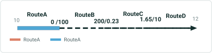

| RouteID | From Date | To Date | From Measure | To Measure |
| --- | --- | --- | --- | --- |
| RouteA | 1/1/2000 | Null | 10 | 0 |
| RouteB | 1/1/2000 | Null | 100 | 200 |
| RouteC | 1/1/2000 | Null | 0.23 | 1.65 |
| RouteD | 1/1/2000 | Null | 10 | 12 |

| EventID | From Date | To Date | From Route | From Measure | To Route | To Measure | Attribute |
| --- | --- | --- | --- | --- | --- | --- | --- |
| Event1 | 1/1/2000 | Null | RouteA | 0 | RouteA | 10 | X |
| Event2 | 1/1/2000 | Null | RouteB | 100 | RouteD | 12 | Y |

One route that houses an input event is reversed.  All input routes must be increase in calibration.
