# Merge Events Widget Test Plan

|   |   |
| --- | --- |
| **Kind** | Test Plan · Experience Builder |
| **Release** | — |
| **Issue** | [Beijing-R-D-Center/ExperienceBuilder-Web-Extensions#16934](https://devtopia.esri.com/Beijing-R-D-Center/ExperienceBuilder-Web-Extensions/issues/16934) |
| **Source** | [16934-ExBMergeEvents_TestPlanV3.pptx](<https://esriis.sharepoint.com/sites/LocationReferencing/Shared%20Documents/General/Test%20Plans/16934-ExBMergeEvents_TestPlanV3.pptx>) |
| **Edited** | 2024-01-08 23:58 by Mac Christmas |
| **Extracted** | 2026-09-04 · lane `xmlstrip` |

<!-- metadata
```yaml
title: "Merge Events Widget Test Plan"
source_file: "16934-ExBMergeEvents_TestPlanV3.pptx"
source_url: "https://esriis.sharepoint.com/sites/LocationReferencing/Shared%20Documents/General/Test%20Plans/16934-ExBMergeEvents_TestPlanV3.pptx"
doc_id: 437
doc_kind: "Test Plan"
surface: "Experience Builder"
doc_revision: "V3"
target_release: ""
pe: ""
dev: ""
author: "Mac Christmas"
last_edited_by: "Mac Christmas"
last_edited: "2024-01-08T23:58:50Z"
extracted: 2026-09-04
extraction_lane: xmlstrip
prompt_version: "v2.0.2"
keywords: ["merge events", "event merging", "experience builder", "line event", "non spanning event", "route", "referent", "date handling", "event attributes"]
tools: ["Merge Events"]
products: []
issues: ["Beijing-R-D-Center/ExperienceBuilder-Web-Extensions#16934"]
related: [{"doc":647,"file":"merge-events-pro-test-plan__doc647.md","s":6.051},{"doc":459,"file":"split-event-widget-test-plan__doc459.md","s":5.581},{"doc":466,"file":"merge-events-in-experience-builder__doc466.md","s":4.61},{"doc":457,"file":"experience-builder-add-multiple-line-events-widget-test-plan__doc457.md","s":4.527},{"doc":675,"file":"merge-events-user-story__doc675.md","s":4.407}]
```
-->

## Summary

Test plan for the Merge Events widget in Experience Builder covering configuration, UI behavior, positive and negative test cases, and event merging scenarios including spanning, non-spanning, overlapping, complex, and vertical events. Includes tests for route and event attributes, date handling, referent preservation, and error conditions.

## Related documents

<!-- related:begin -->
- [Merge Events Pro Test Plan](<https://esriis.sharepoint.com/sites/lrsworkspace/LRS Doc Index/Test Plans/merge-events-pro-test-plan__doc647.md>) — similar text 0.65 · 2 title words · 1 filename word · same kind/folder <!-- rel:647 -->
- [Split Event Widget Test Plan](<https://esriis.sharepoint.com/sites/lrsworkspace/LRS Doc Index/Test Plans/split-event-widget-test-plan__doc459.md>) — similar text 0.32 · 1 title word · same kind/surface/folder <!-- rel:459 -->
- [Merge Events in Experience Builder](<https://esriis.sharepoint.com/sites/lrsworkspace/LRS Doc Index/User Stories/merge-events-in-experience-builder__doc466.md>) — similar text 0.60 · 2 title words · 1 filename word · same surface <!-- rel:466 -->
- [Experience Builder: Add Multiple Line Events Widget Test Plan](<https://esriis.sharepoint.com/sites/lrsworkspace/LRS Doc Index/Test Plans/experience-builder-add-multiple-line-events-widget-test-plan__doc457.md>) — similar text 0.22 · 2 title words · 1 filename word · same kind/surface/folder <!-- rel:457 -->
- [Merge Events User Story](<https://esriis.sharepoint.com/sites/lrsworkspace/LRS Doc Index/User Stories/merge-events-user-story__doc675.md>) — similar text 0.59 · 2 title words · 1 filename word <!-- rel:675 -->
<!-- related:end -->

<!-- docs:begin -->
## Esri documentation

[Merge events](https://doc.esri.com/en/arcgis-pro/latest/help/production/roads-highways/merge-events.html) · [Storing referent and offset information for event location](https://doc.esri.com/en/arcgis-pro/latest/help/production/location-referencing-pipelines/storing-referent-and-offset-information-for-event-location.html) · [Event editing using the attribute table](https://doc.esri.com/en/arcgis-pro/latest/help/production/location-referencing-pipelines/event-editing-using-the-attribute-table.html)
<!-- docs:end -->

---

## Slide 1

Merge Events Widget

| Notes |
| --- |
| Add the Merge Events widget in Experience Builder Test with line and non-line networks (excluding PoM) Test with spanning and non-spanning line events (point events cannot be merged) Test auto-generated, single-field, and multi-field RouteID configurations Test with events with RouteID vs. RouteName configured Test on simple and complex route shapes, including vertical routes Test with projected and unprojected data, including a variety of spatial references Test with different themes Test in Chrome and Edge (other browsers will be covered in automation) Test based on the Pro Merge Events test plan test cases (cases are attached at end of test plan) Test i18n and accessibility testing Test in Web, Tablet, and Mobile configurations Time slice events correctly when merging Retire/time slice input events based on the input date info If input events are non-coincident, merge the space between events in the output event Merge overlapping events Preserve referent info for the merged events Restrict merging of non-adjacent events. Map widget must have selection enabled for events to be selected. If selection is not enabled for the Map widget, then provide error message that it needs to be enabled |

Devtopia Issue

## Slide 2


## Slide 3


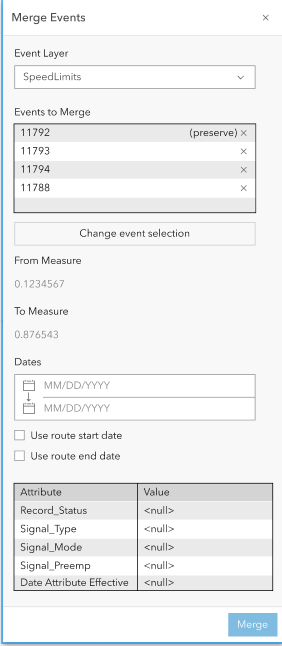 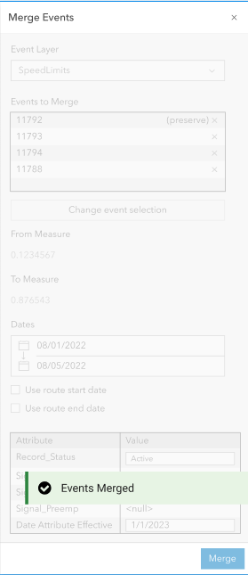

## Slide 4

| Positive Tests: Configuration |
| --- |
| A map can be chosen If more than one map exists within the app, list all maps in the Select a map dropdown Line event and network layers can be imported from the map Missing layers can be added using the New Editable Layer option Layers can be reordered Layers can be removed by clicking the X button Clicking on Clear layers will remove all the imported layers If some layers are removed, clicking on Load layers will only import the missing layers Only line event layers should appear in the Event dropdown When another web map is chosen, clear the layers from the list A default event layer can be chosen The event layer’s label can be edited Attribute fields can be configured and show only business fields. No LRS or system fields should appear Attribute fields can be selected/unselected to show in the UI Attribute fields an be enabled/disabled for editing Use field alias should be enabled by default A field description can be added for each field |

| Negative Tests: Configuration |
| --- |
| Show error if no LRS enabled layers in the chosen web map when attempting to import layer No line event layers are imported from the map LRS parent network is not within the web map Chosen web map has more than one service |

| Positive Tests: UI |
| --- |
| Configured default event layer appears as the chosen event when the UI is launched A different event layer can be chosen if configured If only one event layer is configured, then disable the Event Layer parameter drop down and show the parameter as a label or disable it if the checkbox is unchecked The event layer drop down should include all configured event layers The event layer drop down should list configured event layers in their configured order Allow merging of more than 2 events Clicking the change event selection button changes the mouse to a selector Clicking a different event record in the Events to Merge grid updates which EventID will be preserved When a different event record is clicked, flash the event in the map 3 times The first event in the list will be selected by default to be the preserved event and its attribute values will populate the merged event’s attributes The display field will be used to differentiate between event records in the Events to Merge grid Clicking the x on each event record will remove the event from the Events to Merge grid |

## Slide 5

| Positive Tests: UI (Continued) |
| --- |
| When an event record is double-clicked, zoom to the event’s extent Clicking the Use route start date or Use route end date checkboxes populates the From/To Date of the resultant merged event with the respective route date info The date checkboxes will only be available for non-spanning line events When these checkboxes are checked, the From/To Date of the resultant merged event cannot be edited until the checkboxes are unchecked If events are already selected prior to opening the tool, upon selecting the event layer in the widget, the selected events will populate in the widget The from and to RouteID/RouteName info for the resultant merged event will be populated based on the event’s start and end locations From/To Measure of resultant merged event is populated based upon the measure location of the first/last event in calibration along a route/line and cannot be edited manually Support Subtypes, Domains, Attribute Rules, Ranges, Contingent Values, non-nullable fields, etc. When the above are violated, provide an error message that is helpful for the user Denote required fields Show vertical scroll if needed Once successfully merged, show a message and return the widget to its initial stage Flash the merged event on the map 3 times after successful merge and unselect the merged event Ensure calendar date picker works as expected Default resultant merged event’s Start Date is today’s date Preserved event will not change when events are added/removed from the selection if the preserved event is not removed |

| Negative Tests: UI |
| --- |
| Input non-spanning line events to merge are not on the same route Input spanning line events to merge are not on the same line Only one event is selected to merge Selected events are not in the same time slice, but overlapping time slice events will be merged Resultant merged event’s From/To Dates are altered to not be in the route(s) time slices Resultant merged event’s From/To Date are the same date Typed date has invalid characters (non-number characters) Events are not adjacent or coincident Selection is not enabled on the Map widget, events cannot be selected |

## Slide 6 — Test Cases from Pro Test Plan:

## Slide 7

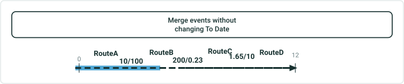

| RouteID | From Date | To Date | From Measure | To Measure |
| --- | --- | --- | --- | --- |
| RouteA | 1/1/2000 | Null | 0 | 10 |
| RouteB | 1/1/2000 | Null | 100 | 200 |
| RouteC | 1/1/2000 | Null | 0.23 | 1.65 |
| RouteD | 1/1/2000 | Null | 10 | 12 |

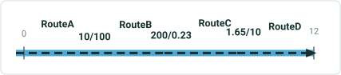

| EventID | From Date | To Date | From Route | From Measure | To Route | To Measure | Attribute |
| --- | --- | --- | --- | --- | --- | --- | --- |
| Event1 | 1/1/2001 | Null | RouteA | 0 | RouteB | 150 | X |
| Event2 | 1/1/2001 | Null | RouteB | 150 | RouteD | 12 | Y |

| EventID | From Date | To Date | From Route | From Measure | To Route | To Measure | Attribute |
| --- | --- | --- | --- | --- | --- | --- | --- |
| Event1 | 1/1/2005 | Null | RouteA | 0 | RouteD | 12 | X |

- Merge events without changing To Date

| EventID | From Date | To Date | From Route | From Measure | To Route | To Measure | Attribute |
| --- | --- | --- | --- | --- | --- | --- | --- |
| Event1 | 1/1/2001 | 1/1/2005 | RouteA | 0 | RouteB | 150 | X |
| Event2 | 1/1/2001 | 1/1/2005 | RouteB | 150 | RouteD | 12 | Y |

## Case 2 <!-- slide 8 -->

### Merge Events with Changed To Date

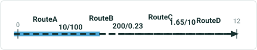

| RouteID | From Date | To Date | From Measure | To Measure |
| --- | --- | --- | --- | --- |
| RouteA | 1/1/2000 | Null | 0 | 10 |
| RouteB | 1/1/2000 | Null | 100 | 200 |
| RouteC | 1/1/2000 | Null | 0.23 | 1.65 |
| RouteD | 1/1/2000 | Null | 10 | 12 |


| EventID | From Date | To Date | From Route | From Measure | To Route | To Measure | Attribute |
| --- | --- | --- | --- | --- | --- | --- | --- |
| Event1 | 1/1/2001 | Null | RouteA | 0 | RouteB | 150 | X |
| Event2 | 1/1/2001 | Null | RouteB | 150 | RouteD | 12 | Y |

| EventID | From Date | To Date | From Route | From Measure | To Route | To Measure | Attribute |
| --- | --- | --- | --- | --- | --- | --- | --- |
| Event1 | 1/1/2005 | 1/1/2020 | RouteA | 0 | RouteD | 12 | X |

| EventID | From Date | To Date | From Route | From Measure | To Route | To Measure | Attribute |
| --- | --- | --- | --- | --- | --- | --- | --- |
| Event1 | 1/1/2001 | 1/1/2005 | RouteA | 0 | RouteB | 150 | X |
| Event2 | 1/1/2001 | 1/1/2005 | RouteB | 150 | RouteD | 12 | Y |

## Case 7 <!-- slide 9 -->

### Merge Events with Referents Present for Both the Location of

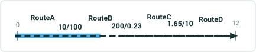

| RouteID | From Date | To Date | From Measure | To Measure |
| --- | --- | --- | --- | --- |
| RouteA | 1/1/2000 | Null | 0 | 10 |
| RouteB | 1/1/2000 | Null | 100 | 200 |
| RouteC | 1/1/2000 | Null | 0.23 | 1.65 |
| RouteD | 1/1/2000 | Null | 10 | 12 |

| EventID | From Date | To Date | From Route | From Measure | From Ref Method | From Ref Location | From Ref Offset | To Route | To Measure | To Ref Method | To Ref Location | To Ref Offset |
| --- | --- | --- | --- | --- | --- | --- | --- | --- | --- | --- | --- | --- |
| Event1 | 1/1/2001 | Null | RouteA | 0 | XY | 38.5, 120.5 | 0 | RouteB | 150 | XY | 38.6, 120.5 | 0 |
| Event2 | 1/1/2001 | Null | RouteB | 150 | XY | 38.6, 120.5 | 0 | RouteD | 12 | XY | 38.6, 120.5 | 0 |

**Merge events with referents present for both the location of first event to the last event without changing the From Measure and To Measure. The referent information will remain intact.**

| EventID | From Date | To Date | From Route | From Measure | From Ref Method | From Ref Location | From Ref Offset | To Route | To Measure | To Ref Method | To Ref Location | To Ref Offset |
| --- | --- | --- | --- | --- | --- | --- | --- | --- | --- | --- | --- | --- |
| Event1 | 1/1/2005 | Null | RouteA | 0 | XY | 38.5, 120.5 | 0 | RouteD | 12 | XY | 38.6, 120.5 | 0 |

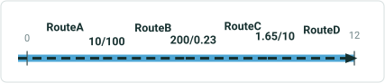

| Attribute |
| --- |
| X |
| Y |

| Attribute |
| --- |
| X |

| EventID | From Date | To Date | From Route | From Measure | From Ref Method | From Ref Location | From Ref Offset | To Route | To Measure | To Ref Method | To Ref Location | To Ref Offset |
| --- | --- | --- | --- | --- | --- | --- | --- | --- | --- | --- | --- | --- |
| Event1 | 1/1/2001 | 1/1/2005 | RouteA | 0 | XY | 38.5, 120.5 | 0 | RouteB | 150 | XY | 38.6, 120.5 | 0 |
| Event2 | 1/1/2001 | 1/1/2005 | RouteB | 150 | XY | 38.6, 120.5 | 0 | RouteD | 12 | XY | 38.6, 120.5 | 0 |

| Attribute |
| --- |
| X |
| Y |

## Case 8 <!-- slide 10 -->

### Merge Events with Overlaps

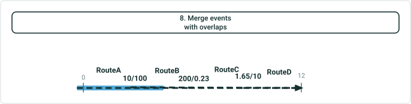

| RouteID | From Date | To Date | From Measure | To Measure |
| --- | --- | --- | --- | --- |
| RouteA | 1/1/2000 | Null | 0 | 10 |
| RouteB | 1/1/2000 | Null | 100 | 200 |
| RouteC | 1/1/2000 | Null | 0.23 | 1.65 |
| RouteD | 1/1/2000 | Null | 10 | 12 |

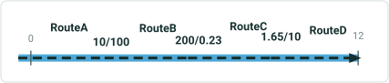

| EventID | From Date | To Date | From Route | From Measure | To Route | To Measure | Attribute |
| --- | --- | --- | --- | --- | --- | --- | --- |
| Event1 | 1/1/2001 | Null | RouteA | 0 | RouteB | 150 | X |
| Event2 | 1/1/2001 | Null | RouteB | 100 | RouteD | 12 | Y |

| EventID | From Date | To Date | From Route | From Measure | To Route | To Measure | Attribute |
| --- | --- | --- | --- | --- | --- | --- | --- |
| Event1 | 1/1/2005 | Null | RouteA | 0 | RouteD | 12 | X |

| EventID | From Date | To Date | From Route | From Measure | To Route | To Measure | Attribute |
| --- | --- | --- | --- | --- | --- | --- | --- |
| Event1 | 1/1/2001 | 1/1/2005 | RouteA | 0 | RouteB | 150 | X |
| Event2 | 1/1/2001 | 1/1/2005 | RouteB | 100 | RouteD | 12 | Y |

## Case 10 <!-- slide 11 -->

### Input Events Are Retired Correctly

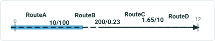

| RouteID | From Date | To Date | From Measure | To Measure |
| --- | --- | --- | --- | --- |
| RouteA | 1/1/2000 | Null | 0 | 10 |
| RouteB | 1/1/2000 | Null | 100 | 200 |
| RouteC | 1/1/2000 | Null | 0.23 | 1.65 |
| RouteD | 1/1/2000 | Null | 10 | 12 |

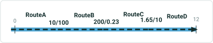

| EventID | From Date | To Date | From Route | From Measure | To Route | To Measure | Attribute |
| --- | --- | --- | --- | --- | --- | --- | --- |
| Event1 | 1/1/2001 | Null | RouteA | 0 | RouteB | 150 | X |
| Event2 | 1/1/2001 | Null | RouteB | 150 | RouteD | 12 | Y |

| EventID | From Date | To Date | From Route | From Measure | To Route | To Measure | Attribute |
| --- | --- | --- | --- | --- | --- | --- | --- |
| Event1 | 1/1/2005 | Null | RouteA | 0 | RouteD | 12 | X |

**Input events are retired correctly, populating the To Date of input events with the entered From Date within the Merge Events tool.**

| EventID | From Date | To Date | From Route | From Measure | To Route | To Measure | Attribute |
| --- | --- | --- | --- | --- | --- | --- | --- |
| Event1 | 1/1/2001 | 1/1/2005 | RouteA | 0 | RouteB | 150 | X |
| Event2 | 1/1/2001 | 1/1/2005 | RouteB | 150 | RouteD | 12 | Y |

## Case 12 <!-- slide 12 -->

### Merge Events with Many Input Events

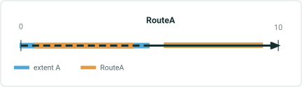

| RouteID | From Date | To Date | From Measure | To Measure |
| --- | --- | --- | --- | --- |
| RouteA | 1/1/2000 | Null | 0 | 10 |

| EventID | From Date | To Date | Route | From Measure | To Measure | Attribute |
| --- | --- | --- | --- | --- | --- | --- |
| Event1 | 1/1/2000 | Null | RouteA | 0 | 5 | X |
| Event2 | 1/1/2010 | Null | RouteA | 5 | 10 | Y |
| Event3 | 1/1/2011 | Null | RouteA | 2 | 4 | Z |
| Event4 | 1/1/2015 | Null | RouteA | 6 | 9 | A |

| EventID | From Date | To Date | Route | From Measure | To Measure | Attribute |
| --- | --- | --- | --- | --- | --- | --- |
| Event1 | 1/1/2016 | Null | RouteA | 0 | 10 | X |

| EventID | From Date | To Date | Route | From Measure | To Measure | Attribute |
| --- | --- | --- | --- | --- | --- | --- |
| Event1 | 1/1/2000 | 1/1/2016 | RouteA | 0 | 5 | X |
| Event2 | 1/1/2010 | 1/1/2016 | RouteA | 5 | 10 | Y |
| Event3 | 1/1/2011 | 1/1/2016 | RouteA | 2 | 4 | Z |
| Event4 | 1/1/2015 | 1/1/2016 | RouteA | 6 | 9 | A |

## Case 15 <!-- slide 13 -->

### Merge Events with the Output Event Having the Same From Date

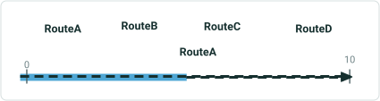

| RouteID | From Date | To Date | From Measure | To Measure |
| --- | --- | --- | --- | --- |
| RouteA | 1/1/2000 | Null | 0 | 10 |

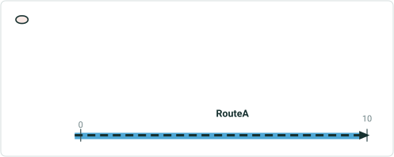

| EventID | From Date | To Date | From Measure | Route | To Measure | Attribute |
| --- | --- | --- | --- | --- | --- | --- |
| Event1 | 1/1/2001 | Null | 0 | RouteA | 5 | X |
| Event2 | 1/1/2001 | Null | 5 | RouteB | 10 | Y |

**Merge events with the output event having the same From Date as the input events.**

| EventID | From Date | To Date | From Measure | Route | To Measure | Attribute |
| --- | --- | --- | --- | --- | --- | --- |
| Event1 | 1/1/2001 | Null | 0 | RouteA | 10 | X |

Input events will be removed with the output event since Event1 and Event2’s From/To Dates are the same date.

## Case 16 <!-- slide 14 -->

### Merge Events with the Output Event Having the Same From Date


| RouteID | From Date | To Date | From Measure | To Measure |
| --- | --- | --- | --- | --- |
| RouteA | 1/1/2000 | Null | 0 | 10 |

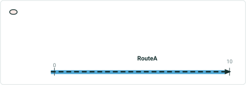

| EventID | From Date | To Date | From Measure | Route | To Measure | Attribute |
| --- | --- | --- | --- | --- | --- | --- |
| Event1 | 1/1/2002 | Null | 0 | RouteA | 5 | X |
| Event2 | 1/1/2001 | Null | 5 | RouteB | 10 | Y |

**Merge events with the output event having the same From Date as one of the input events.**

| EventID | From Date | To Date | From Measure | Route | To Measure | Attribute |
| --- | --- | --- | --- | --- | --- | --- |
| Event1 | 1/1/2002 | Null | 0 | RouteA | 10 | X |

Retired input events (Event1 is removed):

| EventID | From Date | To Date | From Measure | Route | To Measure | Attribute |
| --- | --- | --- | --- | --- | --- | --- |
| Event2 | 1/1/2001 | 1/1/2002 | 5 | RouteB | 10 | Y |

## Case 17 <!-- slide 15 -->

### Merge Complex Events

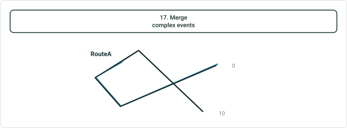

| EventID | From Date | To Date | From Measure | Route | To Measure | Attribute |
| --- | --- | --- | --- | --- | --- | --- |
| Event1 | 1/1/2002 | Null | 0 | RouteA | 5 | X |
| Event2 | 1/1/2001 | Null | 5 | RouteB | 10 | Y |

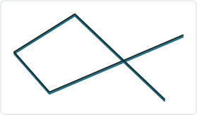

| EventID | From Date | To Date | From Measure | Route | To Measure | Attribute |
| --- | --- | --- | --- | --- | --- | --- |
| Event1 | 1/1/2005 | Null | 0 | RouteA | 10 | X |

| EventID | From Date | To Date | From Measure | Route | To Measure | Attribute |
| --- | --- | --- | --- | --- | --- | --- |
| Event1 | 1/1/2002 | 1/1/2005 | 0 | RouteA | 5 | X |
| Event2 | 1/1/2001 | 1/1/2005 | 5 | RouteB | 10 | Y |

## Case 18 <!-- slide 16 -->

### Merge Vertical Events

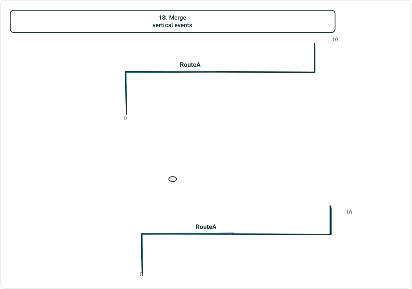

| EventID | From Date | To Date | From Measure | Route | To Measure | Attribute |
| --- | --- | --- | --- | --- | --- | --- |
| Event1 | 1/1/2002 | Null | 0 | RouteA | 5 | X |
| Event2 | 1/1/2001 | Null | 5 | RouteB | 10 | Y |

| EventID | From Date | To Date | From Measure | Route | To Measure | Attribute |
| --- | --- | --- | --- | --- | --- | --- |
| Event1 | 1/1/2005 | Null | 0 | RouteA | 10 | X |

| EventID | From Date | To Date | From Measure | Route | To Measure | Attribute |
| --- | --- | --- | --- | --- | --- | --- |
| Event1 | 1/1/2002 | 1/1/2005 | 0 | RouteA | 5 | X |
| Event2 | 1/1/2001 | 1/1/2005 | 5 | RouteB | 10 | Y |

## Case 1 <!-- slide 17 -->

### Only One Line Event Is Selected.

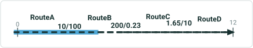

| RouteID | From Date | To Date | From Measure | To Measure |
| --- | --- | --- | --- | --- |
| RouteA | 1/1/2000 | Null | 0 | 10 |
| RouteB | 1/1/2000 | Null | 100 | 200 |
| RouteC | 1/1/2000 | Null | 0.23 | 1.65 |
| RouteD | 1/1/2000 | Null | 10 | 12 |

| EventID | From Date | To Date | From Route | From Measure | To Route | To Measure | Attribute |
| --- | --- | --- | --- | --- | --- | --- | --- |
| Event1 | 1/1/2001 | Null | RouteA | 0 | RouteB | 150 | X |

Only one event is selected.  The tools requires 2 minimum input events.

## Case 2 <!-- slide 18 -->

### From Date / To Date Is Changed To Dates Outside the Time

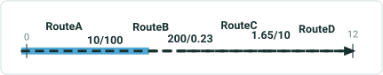

| RouteID | From Date | To Date | From Measure | To Measure |
| --- | --- | --- | --- | --- |
| RouteA | 1/1/2000 | Null | 0 | 10 |
| RouteB | 1/1/2000 | Null | 100 | 200 |
| RouteC | 1/1/2000 | Null | 0.23 | 1.65 |
| RouteD | 1/1/2000 | Null | 10 | 12 |

| EventID | From Date | To Date | From Route | From Measure | To Route | To Measure | Attribute |
| --- | --- | --- | --- | --- | --- | --- | --- |
| Event1 | 1/1/2001 | Null | RouteA | 0 | RouteB | 150 | X |
| Event2 | 1/1/2001 | Null | RouteB | 150 | RouteD | 12 | Y |

| EventID | From Date | To Date | From Route | From Measure | To Route | To Measure | Attribute |
| --- | --- | --- | --- | --- | --- | --- | --- |
| Event1 | 1/1/1600 | 1/1/3500 | RouteA | 0 | RouteD | 12 | X |

**From Date/To Date is changed to dates outside the time extent.**
The From and To Date values are not within the time extent of the map’s data.

## Slide 19

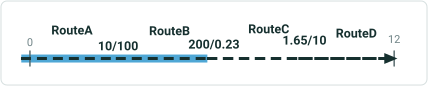

| RouteID | From Date | To Date | From Measure | To Measure |
| --- | --- | --- | --- | --- |
| RouteA | 1/1/2000 | 1/1/2015 | 0 | 10 |
| RouteB | 1/1/2000 | Null | 100 | 200 |
| RouteC | 1/1/2010 | Null | 0.23 | 1.65 |
| RouteD | 1/1/2010 | Null | 10 | 12 |

| EventID | From Date | To Date | From Route | From Measure | To Route | To Measure | Attribute |
| --- | --- | --- | --- | --- | --- | --- | --- |
| Event1 | 1/1/2001 | Null | RouteA | 0 | RouteB | 200 | X |
| Event2 | 1/1/2001 | Null | RouteC | 0.23 | RouteD | 12 | Y |

3A. Resultant merged event’s From Date is after the From Route’s To Date.
The From Route does not exist in the selected time frame.

| EventID | From Date | To Date | From Route | From Measure | To Route | To Measure | Attribute |
| --- | --- | --- | --- | --- | --- | --- | --- |
| Event1 | 1/1/2020 | Null | RouteA | 0 | RouteD | 12 | X |

## Slide 20

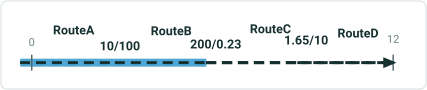

| RouteID | From Date | To Date | From Measure | To Measure |
| --- | --- | --- | --- | --- |
| RouteA | 1/1/2000 | Null | 0 | 10 |
| RouteB | 1/1/2000 | Null | 100 | 200 |
| RouteC | 1/1/2010 | Null | 0.23 | 1.65 |
| RouteD | 1/1/2010 | 1/1/2015 | 10 | 12 |

| EventID | From Date | To Date | From Route | From Measure | To Route | To Measure | Attribute |
| --- | --- | --- | --- | --- | --- | --- | --- |
| Event1 | 1/1/2001 | Null | RouteA | 0 | RouteB | 200 | X |
| Event2 | 1/1/2010 | Null | RouteC | 0.23 | RouteD | 12 | Y |

3B. Resultant merged event’s From Date is after the To Route’s To Date.
The To Route does not exist in the selected time frame.

| EventID | From Date | To Date | From Route | From Measure | To Route | To Measure | Attribute |
| --- | --- | --- | --- | --- | --- | --- | --- |
| Event1 | 1/1/2020 | Null | RouteA | 0 | RouteD | 12 | X |

## Slide 21

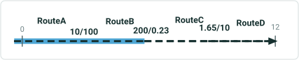

| RouteID | From Date | To Date | From Measure | To Measure |
| --- | --- | --- | --- | --- |
| RouteA | 1/1/2000 | Null | 0 | 10 |
| RouteB | 1/1/2000 | Null | 100 | 200 |
| RouteC | 1/1/2010 | Null | 0.23 | 1.65 |
| RouteD | 1/1/2010 | Null | 10 | 12 |

| EventID | From Date | To Date | From Route | From Measure | To Route | To Measure | Attribute |
| --- | --- | --- | --- | --- | --- | --- | --- |
| Event1 | 1/1/2001 | Null | RouteA | 0 | RouteB | 200 | X |
| Event2 | 1/1/2010 | Null | RouteC | 0.23 | RouteD | 12 | Y |

4A. Resultant merged event’s To Date is before the From Route’s From Date.
The From Route does not exist in the selected time frame.

| EventID | From Date | To Date | From Route | From Measure | To Route | To Measure | Attribute |
| --- | --- | --- | --- | --- | --- | --- | --- |
| Event1 | 1/1/1995 | Null | RouteA | 0 | RouteD | 12 | X |

## Slide 22


| RouteID | From Date | To Date | From Measure | To Measure |
| --- | --- | --- | --- | --- |
| RouteA | 1/1/2000 | Null | 0 | 10 |
| RouteB | 1/1/2000 | Null | 100 | 200 |
| RouteC | 1/1/2010 | Null | 0.23 | 1.65 |
| RouteD | 1/1/2010 | Null | 10 | 12 |

| EventID | From Date | To Date | From Route | From Measure | To Route | To Measure | Attribute |
| --- | --- | --- | --- | --- | --- | --- | --- |
| Event1 | 1/1/2001 | Null | RouteA | 0 | RouteB | 200 | X |
| Event2 | 1/1/2010 | Null | RouteC | 0.23 | RouteD | 12 | Y |

4B. Resultant merged event’s To Date is before the To Route’s From Date.
The To Route does not exist in the selected time frame.

| EventID | From Date | To Date | From Route | From Measure | To Route | To Measure | Attribute |
| --- | --- | --- | --- | --- | --- | --- | --- |
| Event1 | 1/1/1990 | Null | RouteA | 0 | RouteD | 12 | X |

## Case 8 <!-- slide 23 -->

### The Resultant Merged Event’s To Date Is Before the Resultant


| RouteID | From Date | To Date | From Measure | To Measure |
| --- | --- | --- | --- | --- |
| RouteA | 1/1/2000 | Null | 0 | 10 |

| EventID | From Date | To Date | Route | From Measure | To Measure | Attribute |
| --- | --- | --- | --- | --- | --- | --- |
| Event1 | 1/1/2000 | Null | RouteA | 0 | 5 | X |
| Event2 | 1/1/2010 | Null | RouteA | 5 | 10 | Y |

**The resultant merged event’s To Date is before the resultant merged event’s From Date.**
The output event’s To Date value is before the From Date value.

| EventID | From Date | To Date | From Measure | To Measure | Attribute |
| --- | --- | --- | --- | --- | --- |
| Event1 | 1/1/2020 | 1/1/2005 | 0 | 10 | X |

## Case 9 <!-- slide 24 -->

### The Resultant Merged Event’s To Date Is the Same Date as the

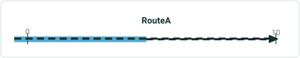

| RouteID | From Date | To Date | From Measure | To Measure |
| --- | --- | --- | --- | --- |
| RouteA | 1/1/2000 | Null | 0 | 10 |

| EventID | From Date | To Date | Route | From Measure | To Measure | Attribute |
| --- | --- | --- | --- | --- | --- | --- |
| Event1 | 1/1/2000 | Null | RouteA | 0 | 5 | X |
| Event2 | 1/1/2010 | Null | RouteA | 5 | 10 | Y |

**The resultant merged event’s To Date is the same date as the resultant merged event’s From Date.**
The output event’s From and To Dates are the same value.

| EventID | From Date | To Date | From Measure | To Measure | Attribute |
| --- | --- | --- | --- | --- | --- |
| Event1 | 1/1/2015 | 1/1/2015 | 0 | 10 | X |

## Case 10 <!-- slide 25 -->

### Select Input Events That Belong To Multiple Lines on a Line

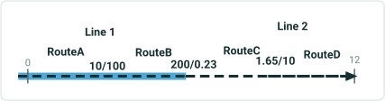

| RouteID | From Date | To Date | From Measure | To Measure |
| --- | --- | --- | --- | --- |
| RouteA | 1/1/2000 | Null | 0 | 10 |
| RouteB | 1/1/2000 | Null | 100 | 200 |
| RouteC | 1/1/2010 | Null | 0.23 | 1.65 |
| RouteD | 1/1/2010 | Null | 10 | 12 |

| EventID | From Date | To Date | From Route | From Measure | To Route | To Measure | Attribute |
| --- | --- | --- | --- | --- | --- | --- | --- |
| Event1 | 1/1/2000 | Null | RouteA | 0 | RouteB | 200 | X |
| Event2 | 1/1/2010 | Null | RouteC | 0.23 | RouteD | 12 | Y |

**Select input events that belong to multiple lines on a line network.**
The input events belong to different line.

## Case 11 <!-- slide 26 -->

### Select Input Events That Belong To Multiple Routes for a

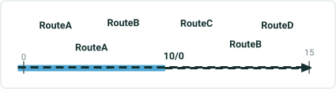

| RouteID | From Date | To Date | From Measure | To Measure |
| --- | --- | --- | --- | --- |
| RouteA | 1/1/2000 | Null | 0 | 10 |
| RouteB | 1/1/2000 | Null | 0 | 15 |

| EventID | From Date | To Date | From Measure | Route | To Measure | Attribute |
| --- | --- | --- | --- | --- | --- | --- |
| Event1 | 1/1/2000 | Null | 0 | RouteA | 10 | X |
| Event2 | 1/1/2010 | Null | 0 | RouteB | 15 | Y |

**Select input events that belong to multiple routes for a non-spanning event.**
The input events belong to a non-spanning event.  The output event cannot be spanning.

## Case 17 <!-- slide 27 -->

### Route on Line Network with Input Events Is Reversed.

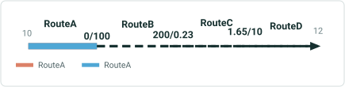

| RouteID | From Date | To Date | From Measure | To Measure |
| --- | --- | --- | --- | --- |
| RouteA | 1/1/2000 | Null | 10 | 0 |
| RouteB | 1/1/2000 | Null | 100 | 200 |
| RouteC | 1/1/2000 | Null | 0.23 | 1.65 |
| RouteD | 1/1/2000 | Null | 10 | 12 |

| EventID | From Date | To Date | From Route | From Measure | To Route | To Measure | Attribute |
| --- | --- | --- | --- | --- | --- | --- | --- |
| Event1 | 1/1/2000 | Null | RouteA | 0 | RouteA | 10 | X |
| Event2 | 1/1/2000 | Null | RouteB | 100 | RouteD | 12 | Y |

One route that houses an input event is reversed.  All input routes must be increase in calibration.

## Case 18 <!-- slide 28 -->

### Selected Events To Merge Are Non-adjacent

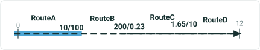

| RouteID | From Date | To Date | From Measure | To Measure |
| --- | --- | --- | --- | --- |
| RouteA | 1/1/2000 | Null | 0 | 10 |
| RouteB | 1/1/2000 | Null | 100 | 200 |
| RouteC | 1/1/2000 | Null | 0.23 | 1.65 |
| RouteD | 1/1/2000 | Null | 10 | 12 |

| EventID | From Date | To Date | From Route | From Measure | To Route | To Measure | Attribute |
| --- | --- | --- | --- | --- | --- | --- | --- |
| Event1 | 1/1/2001 | Null | RouteA | 0 | RouteB | 120 | X |
| Event2 | 1/1/2001 | Null | RouteB | 150 | RouteD | 12 | Y |

The selected events to merge are non-adjacent. Events to merge must be adjacent or coincident.
