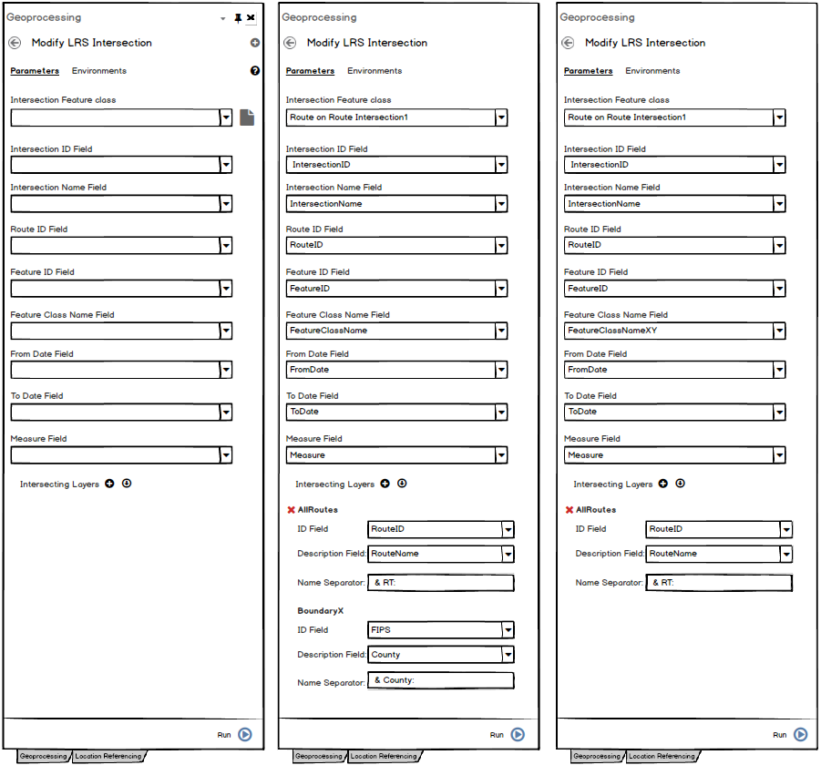
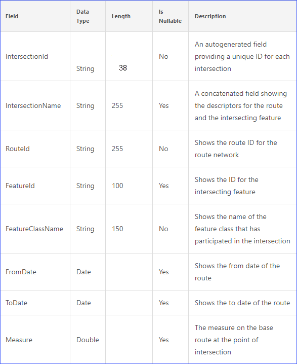

# Modify LRS Intersection Feature Class Geoprocessing Tool

|   |   |
| --- | --- |
| **Kind** | Test Plan · Pro |
| **Release** | — |
| **Product** | Roads & Highways · Pipeline Referencing · Utility Network |
| **Source** | [ModifyLRSIntersection_GP_Tool.pptx](<https://esriis.sharepoint.com/sites/LocationReferencing/Shared%20Documents/General/ModifyLRSIntersection_GP_Tool.pptx>) |
| **Edited** | 2019-10-18 18:01 by Rahul Rakshit |
| **Extracted** | 2026-09-04 · lane `xmlstrip` |

<!-- metadata
```yaml
title: "Modify LRS Intersection Feature Class Geoprocessing Tool"
source_file: "ModifyLRSIntersection_GP_Tool.pptx"
source_url: "https://esriis.sharepoint.com/sites/LocationReferencing/Shared%20Documents/General/ModifyLRSIntersection_GP_Tool.pptx"
doc_id: 878
doc_kind: "Test Plan"
surface: "Pro"
doc_revision: ""
target_release: ""
pe: ""
dev: ""
author: "Rahul Rakshit"
last_edited_by: "Rahul Rakshit"
last_edited: "2019-10-18T18:01:59Z"
extracted: 2026-09-04
extraction_lane: xmlstrip
prompt_version: "v2.0.2"
keywords: ["intersection", "feature class", "geoprocessing tool", "intersecting layers", "sql server", "oracle", "file geodatabase", "branch versioning", "traditional versioning", "error handling", "test cases"]
tools: ["Modify LRS Intersection Feature Class"]
products: ["Roads & Highways", "Pipeline Referencing", "Utility Network"]
issues: []
related: [{"doc":881,"file":"create-lrs-intersection-from-existing-feature-class-geoprocessing-tool__doc881.md","s":5.882},{"doc":882,"file":"create-lrs-intersection-geoprocessing-tool-user-story__doc882.md","s":4.618},{"doc":347,"file":"support-a-single-summary-field-in-lrs-data-template-wizard-test-plan__doc347.md","s":2.981},{"doc":89,"file":"test-plan-registering__doc89.md","s":2.602},{"doc":870,"file":"lr-feature-classes-inside-feature-dataset-housing-lrcd-user-story__doc870.md","s":2.592}]
```
-->

## Summary

This document covers the requirements, interface details, and test cases for the Modify LRS Intersection Feature Class geoprocessing tool. It specifies validation rules for intersection and intersecting feature classes, supported databases and datasets, versioning support, and error handling scenarios. The document also outlines positive and negative test cases and integration with Model Builder and Python.

## Related documents

<!-- related:begin -->
- [Create LRS Intersection From Existing Feature Class Geoprocessing Tool](<https://esriis.sharepoint.com/sites/lrsworkspace/LRS Doc Index/User Stories/create-lrs-intersection-from-existing-feature-class-geoprocessing-tool__doc881.md>) — similar text 0.60 · 5 title words · same surface/folder <!-- rel:881 -->
- [Create LRS Intersection Geoprocessing Tool User Story](<https://esriis.sharepoint.com/sites/lrsworkspace/LRS Doc Index/User Stories/create-lrs-intersection-geoprocessing-tool-user-story__doc882.md>) — similar text 0.63 · 3 title words · same surface/folder <!-- rel:882 -->
- [Support a single summary field in LRS Data Template wizard – Test Plan](<https://esriis.sharepoint.com/sites/lrsworkspace/LRS Doc Index/Test Plans/support-a-single-summary-field-in-lrs-data-template-wizard-test-plan__doc347.md>) — similar text 0.18 · same kind/surface <!-- rel:347 -->
- [Test Plan : Registering](<https://esriis.sharepoint.com/sites/lrsworkspace/LRS Doc Index/Test Plans/test-plan-registering__doc89.md>) — similar text 0.23 · same kind/surface <!-- rel:89 -->
- [LR Feature Classes Inside Feature Dataset Housing LRCD User Story](<https://esriis.sharepoint.com/sites/lrsworkspace/LRS%20Doc%20Index/User%20Stories/lr-feature-classes-inside-feature-dataset-housing-lrcd-user-story__doc870.md>) — similar text 0.13 · 1 title word · same surface/folder <!-- rel:870 -->
<!-- related:end -->

<!-- docs:begin -->
## Esri documentation

[View LRS intersection properties](https://doc.esri.com/en/arcgis-pro/latest/help/production/roads-highways/view-lrs-intersection-properties.html) · [View utility network feature class properties](https://doc.esri.com/en/arcgis-pro/latest/help/production/location-referencing-pipelines/view-utility-network-feature-class-properties.html)

_No page matched:_ [Modify LRS Intersection Feature Class](https://www.google.com/search?q=%22Modify%20LRS%20Intersection%20Feature%20Class%22+site%3Adoc.esri.com)
<!-- docs:end -->

---

## Slide 1

Modify LRS Intersection Feature Class Geoprocessing Tool
As an LRS maintainer, I need the ability to modify the fields and intersecting feature classes of an existing intersection feature class.

## Slide 2


- The Intersection FC should be a registered intersection with the LRS. If not show error.
- Fill all the parameters with the existing values from the intersection FC.
- If the Intersection FC is changed/cleared, then clear out all the parameters.
- In the field drop-down list, show the fields that fulfil the required properties.
- In the field drop-downs, do not list editor tracking or globalID fields.
- In the Intersection FC fields, do not allow to map the same field more than once.
- Should work with DC and not with services.
- Support traditional and branch versioning.
- Do not allow the tool to run unless at least one intersecting layer is present.
- Update the information in the Lrs_Metadata table.
- Shall we allow to run this tool if the routes are getting edited? Or the intersections are getting generated?
style.visibilitystyle.visibilitystyle.visibilitystyle.visibilitystyle.visibilitystyle.visibilitystyle.visibilitystyle.visibilitystyle.visibilitystyle.visibilitystyle.visibilitystyle.visibilitystyle.visibility


## Slide 3


- The ID field and the description field can be same for the intersecting layers.
- The intersecting FC’s should be either polyline or polygon layers.
- Do not allow same FC twice as intersecting layers.
- The intersecting FC’s should reside in the same database as that of the network.
- Tabbing should work.
- Support Internationalization.
- Provide multiple error messages if needed.
- Place the tool in the group named ‘LRS Intersection.
- The intersection FC’s fields should follow the properties provided in the next slide.
- Do not allow to leave any of the Intersection fields as blank.


## Slide 4



## Slide 5

- SQL Server, Oracle and FGDB
- APR, UN, PoM and RH datasets
- Line, Non-Line and PoM Networks
- Intersecting layers = Parent Network
- Intersecting layers = Another Network
- Intersecting layer = Parent Network + Boundary layers
- Test with Model Builder with chaining the tools
- Test inline and standalone python
- Positive tests in Test Complete metadata PY harness
- Negative tests in PY harness
- Intersection FC is not registered as an intersection FC
- PY: Intersection ID field  does not match the requirements
- PY: Intersection Name field does not match the requirements
- PY: RouteID field does not match the requirements
- PY: FeatureID field does not match the requirements
- PY: Feature Class Name field does not match the requirements
- PY: From Date field does not match the requirements
- PY: To Date field does not match the requirements
- PY: Measure field does not match the requirements
- PY: Global ID is provided in the ID field
- PY: Global ID is provided in the Description field
- PY: An editor tracking field is provided in the ID field
- PY: An editor tracking field is provided in the ID field
- Intersecting layer is a point layer
- PY: No intersecting layers are provided
- No ID AND/OR Description field chosen
- The user does not have the permissions to create a FC in the database
- Use the same FC twice as an intersecting layer
- The projection on the intersection layer does not match with that of the network
- The intersecting layer comes from a database that is not the network’s database

  

## Slide 6

- Get the error codes from the Dev and get them added to the excel
- Write GP Doc


## Slide 7

Estimate:
Test plan PE:


