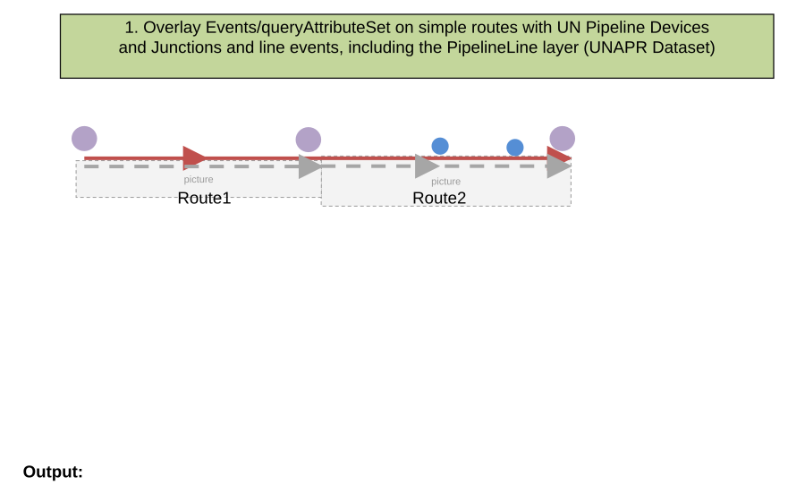
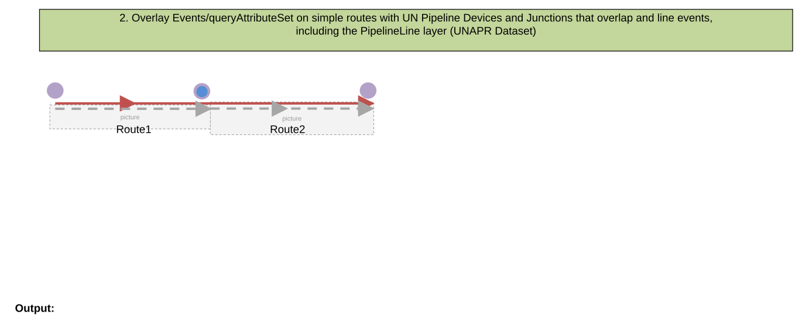
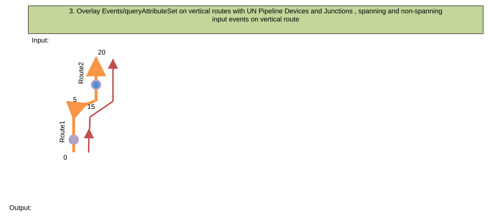
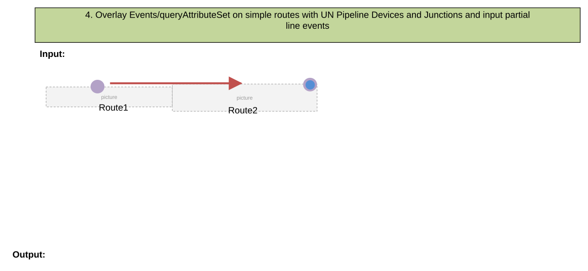
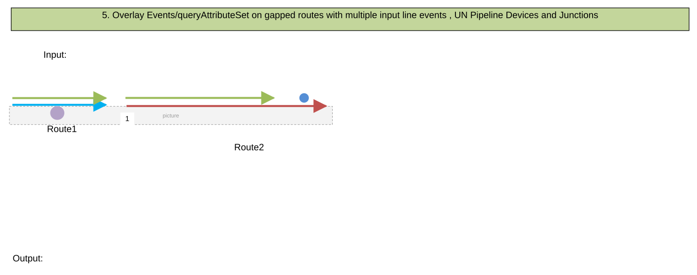
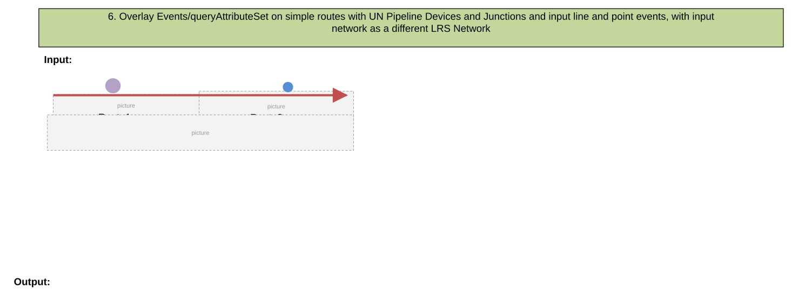
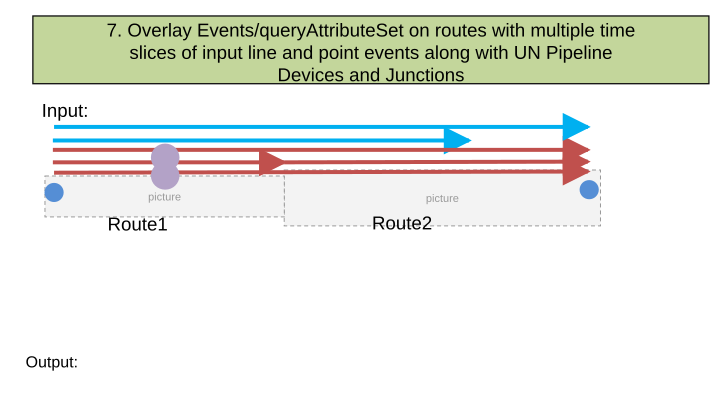
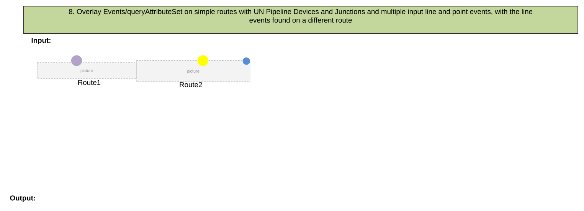
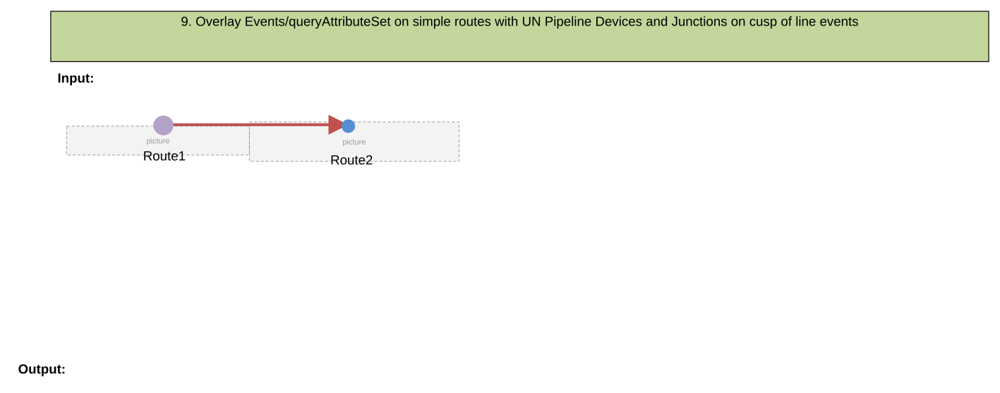
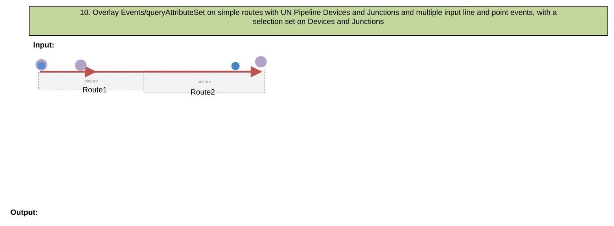

# Overlay Events and queryAttributeSet Support for UN Pipeline Devices and Junctions

| Field | Value |
| --- | --- |
| **Doc** | 79 · Test Plan · Pro |
| **Product** | Pipeline Referencing · Utility Network |
| **Release** | — |
| **Issues** | — |
| **Source** | [OverlayEventsqueryAttributeSet_UNdevice_junctions.pptx](<https://esriis.sharepoint.com/sites/LocationReferencing/Shared%20Documents/General/Test%20Plans/OverlayEventsqueryAttributeSet_UNdevice_junctions.pptx>) |
| **People** | author Mac Christmas · PE — · dev — |
| **Edited** | 2026-01-22 22:20 by Praveen Kumar |
| **Extracted** | 2026-09-04 · lane xmlstrip · format 3.0 · prompt v2.0.2 |
| **Keywords** | pipeline device · pipeline junction · overlay events · query attribute set · line event · point event · route · attribute propagation |
| **Tools** | Overlay Events · queryAttributeSet |

## Summary

This document presents test cases for the Overlay Events and queryAttributeSet functionalities with UN Pipeline Devices and Junctions as inputs. It covers positive and negative tests on various route configurations including simple, overlapping, vertical, gapped, and multi-time slice routes, validating event layering and attribute propagation.

## Related documents

<!-- related:begin -->
- [Overlay Events and queryAttributeSet Point Event Support Test Cases](<https://esriis.sharepoint.com/sites/lrsworkspace/LRS Doc Index/Test Plans/5301-overlay-events-and-queryattributeset-point-event-support.md>) — similar text 0.56 · 4 title words · 4 filename words · same kind/surface/folder <!-- rel:364 s=7.479 -->
- [Support Centerline as Input in queryAttributeSet and Overlay Events Test Plan](<https://esriis.sharepoint.com/sites/lrsworkspace/LRS Doc Index/Test Plans/5196-support-centerline-as-input-in-queryattributeset-and-overlay.md>) — similar text 0.52 · 4 title words · 2 filename words · same kind/surface/folder <!-- rel:461 s=6.044 -->
- [Overlay Events/queryAttributeSet: Update Address Range info via Address Points](<https://esriis.sharepoint.com/sites/lrsworkspace/LRS Doc Index/Test Plans/6178-overlay-events-queryattributeset-update-address-range-info.md>) — similar text 0.06 · 3 title words · 1 filename word · same kind/surface/folder <!-- rel:257 s=4.139 -->
- [Update Address Range Information as Part of Segmentation in Overlay Events & Query Attribute Sets – Test Plan](<https://esriis.sharepoint.com/sites/lrsworkspace/LRS Doc Index/Test Plans/5537-update-address-range-information-as-part-of-segmentation.md>) — similar text 0.09 · 2 title words · 1 filename word · same kind/surface/folder <!-- rel:320 s=3.829 -->
- [Overlay Events (Location Referencing)](<https://esriis.sharepoint.com/sites/lrsworkspace/LRS Doc Index/Other/6379-overlay-events-lr.md>) — similar text 0.05 · 2 title words · 1 filename word · same surface <!-- rel:131 s=2.874 -->
<!-- related:end -->

<!-- docs:begin -->
## Esri documentation

_No page matched:_ [Overlay Events](https://www.google.com/search?q=%22Overlay%20Events%22+site%3Adoc.esri.com) · [queryAttributeSet](https://www.google.com/search?q=%22queryAttributeSet%22+site%3Adoc.esri.com)
<!-- docs:end -->

---

## Overview

### Slide 1 — Overlay Events/ queryAttributeSet UN Devices and Junctions Support <!-- slide 1 -->

**Notes**
- Allow UN Pipeline Devices and Junctions as input in Overlay Events and queryAttributeSet
- Where a Pipeline Devices and Junctions exists, a new record will be created with the same From/To Measure and From/To RouteID.
- Test with UN APR data
- For Overlay Events, test in EGDB, and FS
- For queryAttributeSet, test in FS only
- Test Overlay Events in ModelBuilder and Python with Pipeline Devices and Junctions input

| Positive Tests: Overlay Events UI |
| --- |
| UN Pipeline Devices and Junctions can be input in Event Layers parameter |

| Negative Tests: Overlay Events |
| --- |
| Only UN Pipeline Devices and Junctions into the Event Layers, with no input line event layers |

| Negative Tests: queryAttributeSet |
| --- |
| Only UN Pipeline Devices and Junctions is input into the attributeSet, with no input line event layers |

## Test Cases

### TC-U01 — Overlay Events / QueryAttributeSet on Simple Routes with UN Pipeline Devices (case 1) <!-- src: S1 · slide 2 · case 1 -->

- **Case:** Overlay Events/queryAttributeSet on simple routes with UN Pipeline Devices and Junctions and line events, including the PipelineLine layer (UNAPR Dataset)

Route1
Route2

| Network Name | RouteID | From Date | To Date | PipeType |
| --- | --- | --- | --- | --- |
| Network1 | Route1 | 1/1/2000 | <Null> | Upstream |
| Network1 | Route2 | 1/1/2000 | <Null> | Midstream |

| Input Layer | Event ID | From Date | To Date | From Measure | To Measure | From RouteID | To RouteID | Attribute1 | Attribute2 |
| --- | --- | --- | --- | --- | --- | --- | --- | --- | --- |
| Pipeline Line | N/A | N/A | N/A | 0 | 5 | N/A | N/A | Steel | Active |
| Pipeline Line | N/A | N/A | N/A | 10 | 12.5 | N/A | N/A | Plastic | Active |
| Pipeline Line | N/A | N/A | N/A | 12.5 | 15 | N/A | N/A | Steel | Active |
| Red Event | Red1 | 1/1/2000 | <Null> | 0 | 2.5 | Route1 | Route1 | 450 psi | Active |
| Red Event | Red2 | 1/1/2000 | <Null> | 2.5 | 15 | Route1 | Route2 | 500 psi | Proposed |
| Junction | Tank1 | N/A | N/A | 0 | N/A | Route1 | N/A | Tank | Active |
| Junction | Tee1 | N/A | N/A | 5 | N/A | Route1 | N/A | Tee | Active |
| Junction | Elbow1 | N/A | N/A | 15 | N/A | Route2 | N/A | Elbow | Active |
| Device | Valve1 | N/A | N/A | 12.5 | N/A | Route2 | N/A | Control Valve | Active |
| Device | Valve2 | N/A | N/A | 14 | N/A | Route2 | N/A | Flow Valve | Active |

Output:

| Type | RouteID | From Date | To Date | From Measure | To Measure | Network1. PipeType | PipelineLine. Attribute1 | PipelineLine. Attribute2 | RedEvent . Attribute1 | RedEvent . Attribute2 | Junction. Attribute1 | Junction. Attribute2 | Device. Attribute1 | Device. Attribute2 |
| --- | --- | --- | --- | --- | --- | --- | --- | --- | --- | --- | --- | --- | --- | --- |
| Line | Route1 | 1/1/2000 | <Null> | 0 | 2.5 | Upstream | Steel | Active | 450 psi | Active | <Null> | <Null> | <Null> | <Null> |
| Point | Route1 | 1/1/2000 | <Null> | 0 | 0 | Upstream | Steel | Active | 450psi | Active | Tank | Active | <Null> | <Null> |
| Line | Route1 | 1/1/2000 | <Null> | 2.5 | 5 | Upstream | Steel | Active | 500 psi | Proposed | <Null> | <Null> | <Null> | <Null> |
| Point | Route1 | 1/1/2000 | <Null> | 5 | 5 | Upstream | Steel | Active | 500 psi | Proposed | Tee | Active | <Null> | <Null> |
| Line | Route2 | 1/1/2000 | <Null> | 10 | 12.5 | Midstream | Plastic | Active | 500 psi | Proposed | <Null> | <Null> | <Null> | <Null> |
| Point | Route2 | 1/1/2000 | <Null> | 12.5 | 12.5 | Midstream | Plastic | Active | 500 psi | Proposed | <Null> | <Null> | Control Valve | Active |
| Line | Route2 | 1/1/2000 | <Null> | 12.5 | 14 | Midstream | Steel | Active | 500 psi | Proposed | <Null> | <Null> | <Null> | <Null> |
| Point | Route2 | 1/1/2000 | <Null> | 14 | 14 | Midstream | Steel | Active | 500 psi | Proposed | <Null> | <Null> | Flow Valve | Active |
| Line | Route2 | 1/1/2000 | <Null> | 14 | 15 | Midstream | Steel | Active | 500 psi | Proposed | <Null> | <Null> | <Null> | <Null> |
| Point | Route2 | 1/1/2000 | <Null> | 15 | 15 | Midstream | Steel | Active | 500 psi | Proposed | Elbow | Active | <Null> | <Null> |

### TC-U02 — Overlay Events / QueryAttributeSet on Simple Routes with UN Pipeline Devices (case 2) <!-- src: S1 · slide 3 · case 2 -->

- **Case:** Overlay Events/queryAttributeSet on simple routes with UN Pipeline Devices and Junctions that overlap and line events, including the PipelineLine layer (UNAPR Dataset)

Route1
Route2

| Network Name | RouteID | From Date | To Date | PipeType |
| --- | --- | --- | --- | --- |
| Network1 | Route1 | 1/1/2000 | <Null> | Upstream |
| Network1 | Route2 | 1/1/2000 | <Null> | Midstream |

| Input Layer | Event ID | From Date | To Date | From Measure | To Measure | From RouteID | To RouteID | Attribute1 | Attribute2 |
| --- | --- | --- | --- | --- | --- | --- | --- | --- | --- |
| Pipeline Line | N/A | N/A | N/A | 0 | 5 | N/A | N/A | Steel | Active |
| Pipeline Line | N/A | N/A | N/A | 10 | 12.5 | N/A | N/A | Plastic | Active |
| Pipeline Line | N/A | N/A | N/A | 12.5 | 15 | N/A | N/A | Steel | Active |
| Red Event | Red1 | 1/1/2000 | <Null> | 0 | 2.5 | Route1 | Route1 | 450 psi | Active |
| Red Event | Red2 | 1/1/2000 | <Null> | 2.5 | 15 | Route1 | Route2 | 500 psi | Proposed |
| Junction | Tank1 | N/A | N/A | 0 | N/A | Route1 | N/A | Tank | Active |
| Junction | Tee1 | N/A | N/A | 5 | N/A | Route1 | N/A | Tee | Active |
| Junction | Elbow1 | N/A | N/A | 15 | N/A | Route2 | N/A | Elbow | Active |
| Device | Valve1 | N/A | N/A | 5 | N/A | Route1 | N/A | Control Valve | Active |

Output:

| Type | RouteID | From Date | To Date | From Measure | To Measure | Network1. PipeType | PipelineLine. Attribute1 | PipelineLine. Attribute2 | RedEvent . Attribute1 | RedEvent . Attribute2 | Junction. Attribute1 | Junction. Attribute2 | Device. Attribute1 | Device. Attribute2 |
| --- | --- | --- | --- | --- | --- | --- | --- | --- | --- | --- | --- | --- | --- | --- |
| Line | Route1 | 1/1/2000 | <Null> | 0 | 2.5 | Upstream | Steel | Active | 450 psi | Active | <Null> | <Null> | <Null> | <Null> |
| Point | Route1 | 1/1/2000 | <Null> | 0 | 0 | Upstream | Steel | Active | 450psi | Active | Tank | Active | <Null> | <Null> |
| Line | Route1 | 1/1/2000 | <Null> | 2.5 | 5 | Upstream | Steel | Active | 500 psi | Proposed | <Null> | <Null> | <Null> | <Null> |
| Point | Route1 | 1/1/2000 | <Null> | 5 | 5 | Upstream | Steel | Active | 500 psi | Proposed | Tee | Active | Control Valve | Active |
| Line | Route2 | 1/1/2000 | <Null> | 10 | 12.5 | Midstream | Plastic | Active | 500 psi | Proposed | <Null> | <Null> | <Null> | <Null> |
| Line | Route2 | 1/1/2000 | <Null> | 12.5 | 15 | Midstream | Steel | Active | 500 psi | Proposed | <Null> | <Null> | <Null> | <Null> |
| Point | Route2 | 1/1/2000 | <Null> | 15 | 15 | Midstream | Steel | Active | 500 psi | Proposed | Elbow | Active | <Null> | <Null> |

### TC-U03 — Overlay Events / QueryAttributeSet on Vertical Routes with UN Pipeline Devices <!-- src: S1 · slide 4 · case 3 -->

- **Case:** Overlay Events/queryAttributeSet on vertical routes with UN Pipeline Devices and Junctions , spanning and non-spanning input events on vertical route

| Network Name | RouteID | From Date | To Date | Type |
| --- | --- | --- | --- | --- |
| Network1 | Route1 | 1/1/2000 | <Null> | Upstream |
| Network1 | Route2 | 1/1/2000 | <Null> | Midstream |

| Input Layer | Event ID | From Date | To Date | From Measure | To Measure | From RouteID | To RouteID | Attribute1 | Attribute2 |
| --- | --- | --- | --- | --- | --- | --- | --- | --- | --- |
| Red Event | Red1 | 1/1/2000 | <Null> | 0 | 2.5 | Route1 | Route1 | 450 psi | Active |
| Red Event | Red2 | 1/1/2000 | <Null> | 2.5 | 15 | Route1 | Route2 | 500 psi | Proposed |
| Junction | Tank1 | N/A | N/A | 2 | N/A | Route1 | N/A | Tank | Active |
| Junction | Elbow1 | N/A | N/A | 17.5 | N/A | Route2 | N/A | Elbow | Active |
| Device | Valve1 | N/A | N/A | 17.5 | N/A | Route2 | N/A | Control Valve | Active |

| Type | RouteID | From Date | To Date | From Measure | To Measure | Network1. PipeType | RedEvent . Attribute1 | RedEvent . Attribute2 | Junction. Attribute1 | Junction. Attribute2 | Device. Attribute1 | Device. Attribute2 |
| --- | --- | --- | --- | --- | --- | --- | --- | --- | --- | --- | --- | --- |
| Line | Route1 | 1/1/2000 | <Null> | 0 | 2 | Upstream | 450 psi | Active | <Null> | <Null> | <Null> | <Null> |
| Point | Route1 | 1/1/2000 | <Null> | 2 | 2 | Upstream | 450psi | Active | Tank | Active | <Null> | <Null> |
| Line | Route1 | 1/1/2000 | <Null> | 2 | 2.5 | Upstream | 450 psi | Active | <Null> | <Null> | <Null> | <Null> |
| Line | Route1 | 1/1/2000 | <Null> | 2.5 | 5 | Upstream | 500 psi | Proposed | <Null> | <Null> | <Null> | <Null> |
| Line | Route2 | 1/1/2000 | <Null> | 15 | 17.5 | Midstream | 500 psi | Proposed | <Null> | <Null> | <Null> | <Null> |
| Point | Route2 | 1/1/2000 | <Null> | 17.5 | 17.5 | Midstream | 500 psi | Proposed | Elbow | Active | Control Valve | Active |
| Line | Route2 | 1/1/2000 | <Null> | 17.5 | 20 | Midstream | 500 psi | Proposed | <Null> | <Null> | <Null> | <Null> |

[figure: Input: · Output: · 0 · 20 · 5 · 15 · Route1 · Route2]

### TC-U04 — Overlay Events / QueryAttributeSet on Simple Routes with UN Pipeline Devices (case 4) <!-- src: S1 · slide 5 · case 4 -->

- **Case:** Overlay Events/queryAttributeSet on simple routes with UN Pipeline Devices and Junctions and input partial line events

| Network Name | RouteID | From Date | To Date | PipeType |
| --- | --- | --- | --- | --- |
| Network1 | Route1 | 1/1/2000 | <Null> | Upstream |
| Network1 | Route2 | 1/1/2000 | <Null> | Midstream |

| Input Layer | Event ID | From Date | To Date | From Measure | To Measure | From RouteID | To RouteID | Attribute1 | Attribute2 |
| --- | --- | --- | --- | --- | --- | --- | --- | --- | --- |
| Red Event | Red2 | 1/1/2000 | <Null> | 2.5 | 12.5 | Route1 | Route2 | 500 psi | Proposed |
| Junction | Tank1 | N/A | N/A | 2 | N/A | Route1 | N/A | Tank | Active |
| Junction | Elbow1 | N/A | N/A | 15 | N/A | Route2 | N/A | Elbow | Active |
| Device | Valve1 | N/A | N/A | 15 | N/A | Route2 | N/A | Control Valve | Active |

| Type | RouteID | From Date | To Date | From Measure | To Measure | Network1. PipeType | RedEvent . Attribute1 | RedEvent . Attribute2 | Junction. Attribute1 | Junction. Attribute2 | Device. Attribute1 | Device. Attribute2 |
| --- | --- | --- | --- | --- | --- | --- | --- | --- | --- | --- | --- | --- |
| Line | Route1 | 1/1/2000 | <Null> | 0 | 2 | Upstream | <Null> | <Null> | <Null> | <Null> | <Null> | <Null> |
| Point | Route1 | 1/1/2000 | <Null> | 2 | 2 | Upstream | <Null> | <Null> | Tank | Active | <Null> | <Null> |
| Line | Route1 | 1/1/2000 | <Null> | 2 | 2.5 | Upstream | <Null> | <Null> | <Null> | <Null> | <Null> | <Null> |
| Line | Route1 | 1/1/2000 | <Null> | 2.5 | 5 | Upstream | 500 psi | Proposed | <Null> | <Null> | <Null> | <Null> |
| Line | Route2 | 1/1/2000 | <Null> | 10 | 12.5 | Midstream | 500 psi | Proposed | <Null> | <Null> | <Null> | <Null> |
| Line | Route2 | 1/1/2000 | <Null> | 12.5 | 15 | Midstream | 500 psi | Proposed | <Null> | <Null> | <Null> | <Null> |
| Point | Route2 | 1/1/2000 | <Null> | 15 | 15 | Midstream | 500 psi | Proposed | Elbow | Active | Control Valve | Active |

[figure: Input: · Output: · Route1 · Route2]

### TC-U05 — Overlay Events / QueryAttributeSet on Gapped Routes with Multiple Input Line <!-- src: S1 · slide 6 · case 5 -->

- **Case:** Overlay Events/queryAttributeSet on gapped routes with multiple input line events , UN Pipeline Devices and Junctions

| Network Name | RouteID | From Date | To Date | Type |
| --- | --- | --- | --- | --- |
| Network1 | Route1 | 1/1/2000 | <Null> | Upstream |
| Network1 | Route2 | 1/1/2000 | <Null> | Midstream |

| Input Layer | Event ID | From Date | To Date | From Measure | To Measure | From RouteID | To RouteID | Attribute1 | Attribute2 |
| --- | --- | --- | --- | --- | --- | --- | --- | --- | --- |
| Red Event | Red1 | 1/1/2000 | <Null> | 1 | 15 | Route1 | Route2 | 450 psi | Active |
| Blue Event | Blue1 | 1/1/2000 | <Null> | 0 | 1 | Route1 | Route1 | Low | Active |
| Green Event | Green1 | 1/1/2000 | <Null> | 0 | 1 | Route1 | Route1 | Complete | Active |
| Green Event | Green2 | 1/1/2000 | <Null> | 1 | 12.5 | Route1 | Route2 | Incomplete | Active |
| Junction | Elbow1 | N/A | N/A | 0.5 | N/A | Route1 | N/A | Tank | Active |
| Device | Valve1 | N/A | N/A | 14 | N/A | Route2 | N/A | Control Valve | Active |

| Type | RouteID | From Date | To Date | From Measure | To Measure | Network1. Type | RedEvent . Attribute1 | RedEvent . Attribute2 | BlueEvent . Attribute1 | BlueEvent . Attribute2 | GreenEvent . Attribute1 | GreenEvent . Attribute2 | Junction. Attribute1 | Junction. Attribute2 | Device. Attribute1 | Device. Attribute2 |
| --- | --- | --- | --- | --- | --- | --- | --- | --- | --- | --- | --- | --- | --- | --- | --- | --- |
| Line | Route1 | 1/1/2000 | <Null> | 0 | 0.5 | Upstream | <Null> | <Null> | Low | Active | Complete | Active | <Null> | <Null> | <Null> | <Null> |
| Point | Route1 | 1/1/2000 | <Null> | 0.5 | 0.5 | Upstream | <Null> | <Null> | Low | Active | Complete | Active | Tank | Active | <Null> | <Null> |
| Line | Route1 | 1/1/2000 | <Null> | 0.5 | 1 | Upstream | <Null> | <Null> | Low | Active | Complete | Active | <Null> | <Null> | <Null> | <Null> |
| Line | Route1 | 1/1/2000 | <Null> | 1 | 5 | Upstream | 450 psi | Active | <Null> | <Null> | Incomplete | Active | <Null> | <Null> | <Null> | <Null> |
| Line | Route2 | 1/1/2000 | <Null> | 10 | 12.5 | Midstream | 450 psi | Active | <Null> | <Null> | Incomplete | Active | <Null> | <Null> | <Null> | <Null> |
| Line | Route2 | 1/1/2000 | <Null> | 12.5 | 14 | Midstream | 450 psi | Active | <Null> | <Null> | <Null> | <Null> | <Null> | <Null> | <Null> | <Null> |
| Point | Route2 | 1/1/2000 | <Null> | 14 | 14 | Midstream | 450 psi | Active | <Null> | <Null> | <Null> | <Null> | <Null> | <Null> | Control Valve | Active |
| Line | Route2 | 1/1/2000 | <Null> | 14 | 15 | Midstream | 450 psi | Active | <Null> | <Null> | <Null> | <Null> | <Null> | <Null> | <Null> | <Null> |

[figure: Input: · Output: · Route1 · Route2 · 1]

### TC-U06 — Overlay Events / QueryAttributeSet on Simple Routes with UN Pipeline Devices (case 6) <!-- src: S1 · slide 7 · case 6 -->

- **Case:** Overlay Events/queryAttributeSet on simple routes with UN Pipeline Devices and Junctions and input line and point events, with input network as a different LRS Network

| Network Name | RouteID | From Date | To Date | Attribute |
| --- | --- | --- | --- | --- |
| Network1 | Route1 | 1/1/2000 | <Null> | Upstream |
| Network1 | Route2 | 1/1/2000 | <Null> | Midstream |
| Network2 | RouteX | 1/1/2000 | <Null> | Public |

| Input Layer | Event ID | From Date | To Date | From Measure | To Measure | From RouteID | To RouteID | Attribute1 | Attribute2 |
| --- | --- | --- | --- | --- | --- | --- | --- | --- | --- |
| Red Event | Red1 | 1/1/2000 | <Null> | 0 mi | 10 mi | Route1 | Route1 | 450 psi | Active |
| Junction | Tank1 | N/A | N/A | 0.5 | N/A | Route1 | N/A | Tank | Active |
| Device | Valve1 | N/A | N/A | 14 | N/A | Route2 | N/A | Control Valve | Active |

| Type | RouteID | From Date | To Date | From Measure | To Measure | Network2. Access | RedEvent . Attribute1 | RedEvent . Attribute2 | Junction. Attribute1 | Junction. Attribute2 | Device. Attribute1 | Device. Attribute2 |
| --- | --- | --- | --- | --- | --- | --- | --- | --- | --- | --- | --- | --- |
| Line | RouteX | 1/1/2000 | <Null> | 0 ft | 10560 ft | Public | 450 psi | Active | <Null> | <Null> | <Null> | <Null> |
| Point | RouteX | 1/1/2000 | <Null> | 10560 ft | 10560 ft | Public | 450 psi | Active | Tank | Active | <Null> | <Null> |
| Line | RouteX | 1/1/2000 | <Null> | 10560 ft | 42240 ft | Public | 450 psi | Active | <Null> | <Null> | <Null> | <Null> |
| Point | RouteX | 1/1/2000 | <Null> | 42240 ft | 42240 ft | Public | 450 psi | Active | <Null> | <Null> | Control Valve | Active |
| Line | RouteX | 1/1/2000 | <Null> | 42240 ft | 52800 ft | Public | 450 psi | Active | <Null> | <Null> | <Null> | <Null> |

[figure: Input: · Output: · Route1 · Route2 · RouteX]

### TC-U07 — Overlay Events / QueryAttributeSet on Routes with Multiple Time Slices of Input <!-- src: S1 · slide 8 · case 7 -->

- **Case:** Overlay Events/queryAttributeSet on routes with multiple time slices of input line and point events along with UN Pipeline Devices and Junctions

| Network Name | Route ID | From Date | To Date | Type |
| --- | --- | --- | --- | --- |
| Network1 | Route1 | 1/1/2000 | <Null> | Upstream |
| Network1 | Route2 | 1/1/2000 | <Null> | Midstream |

| Type | Route ID | From Date | To Date | From Measure | To Measure | Network1. Type | RedEvent . Attribute1 | RedEvent. Attribute2 | BlueEvent . Attribute1 | BlueEvent . Attribute2 | PurpleEvent . Attribute1 | PurpleEvent . Attribute2 | Device. Attribute1 | Device. Attribute2 |
| --- | --- | --- | --- | --- | --- | --- | --- | --- | --- | --- | --- | --- | --- | --- |
| Point | Route1 | 1/1/2000 | 1/1/2005 | 0 | 0 | Upstream | 450 psi | Retired | Low | Retired | <Null> | <Null> | Control Valve | Active |
| Line | Route1 | 1/1/2000 | 1/1/2005 | 0 | 2.5 | Upstream | 450 psi | Retired | Low | Retired | <Null> | <Null> | <Null> | <Null> |
| Point | Route1 | 1/1/2000 | 1/1/2005 | 2.5 | 2.5 | Upstream | 450 psi | Retired | Low | Retired | Dent | Retired | <Null> | <Null> |
| Line | Route1 | 1/1/2000 | 1/1/2005 | 2.5 | 5 | Upstream | 450 psi | Retired | Low | Retired | <Null> | <Null> | <Null> | <Null> |
| Line | Route2 | 1/1/2000 | 1/1/2005 | 10 | 13 | Midstream | 450 psi | Retired | Low | Retired | <Null> | <Null> | <Null> | <Null> |
| Line | Route2 | 1/1/2000 | 1/1/2005 | 13 | 15 | Midstream | 450 psi | Retired | <Null> | <Null> | <Null> | <Null> | <Null> | <Null> |
| Point | Route2 | 1/1/2000 | 1/1/2005 | 15 | 15 | Midstream | 450 psi | Retired | <Null> | <Null> | <Null> | <Null> | Flow Valve | Active |
| Point | Route1 | 1/1/2005 | 1/1/2010 | 0 | 0 | Upstream | 450 psi | Retired | Medium | Active | <Null> | <Null> | Control Valve | Active |
| Line | Route1 | 1/1/2005 | 1/1/2010 | 0 | 2.5 | Upstream | 450 psi | Retired | Medium | Active | <Null> | <Null> | <Null> | <Null> |
| Point | Route1 | 1/1/2005 | 1/1/2010 | 2.5 | 2.5 | Upstream | 450 psi | Retired | Medium | Active | Corrosion | Active | <Null> | <Null> |
| Line | Route1 | 1/1/2005 | 1/1/2010 | 2.5 | 5 | Upstream | 450 psi | Retired | Medium | Active | <Null> | <Null> | <Null> | <Null> |
| Line | Route2 | 1/1/2005 | 1/1/2010 | 10 | 15 | Midstream | 500 psi | Retired | Medium | Active | <Null> | <Null> | <Null> | <Null> |
| Point | Route2 | 1/1/2005 | 1/1/2010 | 15 | 15 | Midstream | 500 psi | Retired | Medium | Active | <Null> | <Null> | Flow Valve | Active |
| Line | Route1 | 1/1/2010 | <Null> | 0 | 2.5 | Upstream | 450 psi | Active | Medium | Active | <Null> | <Null> | <Null> | <Null> |
| Point | Route1 | 1/1/2010 | <Null> | 0 | 0 | Upstream | 450 psi | Active | Medium | Active | <Null> | <Null> | Control Valve | Active |
| Point | Route1 | 1/1/2010 | <Null> | 2.5 | 2.5 | Upstream | 450 psi | Active | Medium | Active | Corrosion | Active | <Null> | <Null> |
| Line | Route1 | 1/1/2010 | <Null> | 2.5 | 5 | Upstream | 450 psi | Active | Medium | Active | <Null> | <Null> | <Null> | <Null> |
| Line | Route2 | 1/1/2010 | <Null> | 10 | 15 | Midstream | 450 psi | Active | Medium | Active | <Null> | <Null> | <Null> | <Null> |
| Point | Route2 | 1/1/2010 | <Null> | 15 | 15 | Midstream | 450 psi | Active | Medium | Active | <Null> | <Null> | Flow Valve | Active |

| Input Layer | Event ID | From Date | To Date | From Measure | To Measure | From RouteID | To RouteID | Attribute1 | Attribute2 |
| --- | --- | --- | --- | --- | --- | --- | --- | --- | --- |
| Red Event | Red1 | 1/1/2000 | 1/1/2005 | 0 | 15 | Route1 | Route2 | 450 psi | Retired |
| Red Event | Red1 | 1/1/2005 | 1/1/2010 | 0 | 5 | Route1 | Route1 | 450 psi | Retired |
| Red Event | Red2 | 1/1/2005 | 1/1/2010 | 10 | 15 | Route2 | Route2 | 500 psi | Retired |
| Red Event | Red1 | 1/1/2010 | <Null> | 0 | 15 | Route1 | Route2 | 450 psi | Active |
| Blue Event | Blue1 | 1/1/2000 | 1/1/2005 | 0 | 13 | Route1 | Route2 | Low | Retired |
| Blue Event | Blue2 | 1/1/2005 | <Null> | 0 | 15 | Route1 | Route2 | Medium | Active |
| Purple Event | Purple1 | 1/1/2000 | 1/1/2005 | 2.5 | N/A | Route1 | N/A | Dent | Retired |
| Purple Event | Purple1 | 1/1/2005 | <Null> | 2.5 | N/A | Route1 | N/A | Corrosion | Active |
| Device | Valve1 | N/A | N/A | 0 | N/A | Route1 | N/A | Control Valve | Active |
| Device | Valve2 | N/A | N/A | 15 | N/A | Route2 | N/A | Flow Valve | Active |

[figure: Output: · Input: · Route1 · Route2]

### TC-U08 — Overlay Events / QueryAttributeSet on Simple Routes with UN Pipeline Devices (case 8) <!-- src: S1 · slide 9 · case 8 -->

- **Case:** Overlay Events/queryAttributeSet on simple routes with UN Pipeline Devices and Junctions and multiple input line and point events, with the line events found on a different route

| Network Name | RouteID | From Date | To Date | PipeType |
| --- | --- | --- | --- | --- |
| Network1 | Route1 | 1/1/2000 | <Null> | Upstream |
| Network1 | Route2 | 1/1/2000 | <Null> | Midstream |

| Input Layer | Event ID | From Date | To Date | From Measure | To Measure | From RouteID | To RouteID | Attribute1 | Attribute2 |
| --- | --- | --- | --- | --- | --- | --- | --- | --- | --- |
| Red Event | Red1 | 1/1/2000 | <Null> | 0 | 2.5 | RouteX | RouteX | 450 psi | Active |
| Red Event | Red2 | 1/1/2000 | <Null> | 2.5 | 10 | RouteX | RouteY | 500 psi | Proposed |
| Junction | Tank1 | N/A | N/A | 0.5 | N/A | Route1 | N/A | Tank | Active |
| Yellow Event | Yellow1 | 1/1/2000 | <Null> | 13 | N/A | Route2 | N/A | 1500 | Active |
| Device | Valve2 | N/A | N/A | 15 | N/A | Route2 | N/A | Flow Valve | Active |

| Type | RouteID | From Date | To Date | From Measure | To Measure | Network1. PipeType | RedEvent . Attribute1 | RedEvent . Attribute2 | Junction. Attribute1 | Junction. Attribute2 | YellowEvent . Attribute1 | YellowEvent . Attribute2 | Device. Attribute1 | Device. Attribute2 |
| --- | --- | --- | --- | --- | --- | --- | --- | --- | --- | --- | --- | --- | --- | --- |
| Line | Route1 | 1/1/2000 | <Null> | 0 | 2 | Upstream | <Null> | <Null> | <Null> | <Null> | <Null> | <Null> | <Null> | <Null> |
| Point | Route1 | 1/1/2000 | <Null> | 2 | 2 | Upstream | <Null> | <Null> | Tank | Active | <Null> | <Null> | <Null> | <Null> |
| Line | Route1 | 1/1/2000 | <Null> | 2 | 5 | Upstream | <Null> | <Null> | <Null> | <Null> | <Null> | <Null> | <Null> | <Null> |
| Line | Route2 | 1/1/2000 | <Null> | 10 | 13 | Midstream | <Null> | <Null> | <Null> | <Null> | <Null> | <Null> | <Null> | <Null> |
| Point | Route2 | 1/1/2000 | <Null> | 13 | 13 | Midstream | <Null> | <Null> | <Null> | <Null> | 1500 | Active | <Null> | <Null> |
| Line | Route2 | 1/1/2000 | <Null> | 13 | 15 | Midstream | <Null> | <Null> | <Null> | <Null> | <Null> | <Null> | <Null> | <Null> |
| Point | Route2 | 1/1/2000 | <Null> | 15 | 15 | Midstream | <Null> | <Null> | <Null> | <Null> | <Null> | <Null> | Flow Valve | Active |

[figure: Input: · Output: · Route1 · Route2]

### TC-U09 — Overlay Events / QueryAttributeSet on Simple Routes with UN Pipeline Devices (case 9) <!-- src: S1 · slide 10 · case 9 -->

- **Case:** Overlay Events/queryAttributeSet on simple routes with UN Pipeline Devices and Junctions on cusp of line events

| Network Name | RouteID | From Date | To Date | PipeType |
| --- | --- | --- | --- | --- |
| Network1 | Route1 | 1/1/2000 | <Null> | Upstream |
| Network1 | Route2 | 1/1/2000 | <Null> | Midstream |

| Input Layer | Event ID | From Date | To Date | From Measure | To Measure | From RouteID | To RouteID | Attribute1 | Attribute2 |
| --- | --- | --- | --- | --- | --- | --- | --- | --- | --- |
| Red Event | Red1 | 1/1/2000 | <Null> | 2.5 | 12.5 | Route1 | Route2 | 450 psi | Active |
| Junction | Tank1 | N/A | N/A | 0.5 | N/A | Route1 | N/A | Tank | Active |
| Device | Valve2 | N/A | N/A | 15 | N/A | Route2 | N/A | Flow Valve | Active |

| Type | RouteID | From Date | To Date | From Measure | To Measure | Network1. PipeType | RedEvent . Attribute1 | RedEvent . Attribute2 | Junction. Attribute1 | Junction. Attribute2 | Device. Attribute1 | Device. Attribute2 |
| --- | --- | --- | --- | --- | --- | --- | --- | --- | --- | --- | --- | --- |
| Line | Route1 | 1/1/2000 | <Null> | 0 | 2.5 | Upstream | <Null> | <Null> | <Null> | <Null> | <Null> | <Null> |
| Point | Route1 | 1/1/2000 | <Null> | 2.5 | 2.5 | Upstream | 450 psi | Active | Tank | Active | <Null> | <Null> |
| Line | Route1 | 1/1/2000 | <Null> | 2.5 | 5 | Upstream | 450 psi | Active | <Null> | <Null> | <Null> | <Null> |
| Line | Route2 | 1/1/2000 | <Null> | 10 | 12.5 | Midstream | 450 psi | Active | <Null> | <Null> | <Null> | <Null> |
| Point | Route2 | 1/1/2000 | <Null> | 12.5 | 12.5 | Midstream | 450 psi | Active | <Null> | <Null> | Flow Valve | Active |
| Line | Route2 | 1/1/2000 | <Null> | 12.5 | 15 | Midstream | <Null> | <Null> | <Null> | <Null> | <Null> | <Null> |

[figure: Input: · Output: · Route1 · Route2]

### TC-U10 — Overlay Events / QueryAttributeSet on Simple Routes with UN Pipeline Devices (case 10) <!-- src: S1 · slide 11 · case 10 -->

- **Case:** Overlay Events/queryAttributeSet on simple routes with UN Pipeline Devices and Junctions and multiple input line and point events, with a selection set on Devices and Junctions

| Network Name | RouteID | From Date | To Date | PipeType |
| --- | --- | --- | --- | --- |
| Network1 | Route1 | 1/1/2000 | <Null> | Upstream |
| Network1 | Route2 | 1/1/2000 | <Null> | Midstream |

| Input Layer | Event ID | From Date | To Date | From Measure | To Measure | From RouteID | To RouteID | Attribute1 | Attribute2 |
| --- | --- | --- | --- | --- | --- | --- | --- | --- | --- |
| Red Event | Red1 | 1/1/2000 | <Null> | 0 | 2.5 | Route1 | Route1 | 450 psi | Active |
| Red Event | Red2 | 1/1/2000 | <Null> | 2.5 | 15 | Route1 | Route2 | 500 psi | Proposed |
| Junction | Tank1 | N/A | N/A | 0 | N/A | Route1 | N/A | Tank | Active |
| Junction | Tee1 | N/A | N/A | 2 | N/A | Route1 | N/A | Tee | Active |
| Junction | Elbow1 | N/A | N/A | 15 | N/A | Route2 | N/A | Elbow | Active |
| Device | Valve1 | N/A | N/A | 0 | N/A | Route1 | N/A | Control Valve | Active |
| Device | Valve2 | N/A | N/A | 14 | N/A | Route2 | N/A | Flow Valve | Active |

| Type | RouteID | From Date | To Date | From Measure | To Measure | Network1. PipeType | RedEvent . Attribute1 | RedEvent . Attribute2 | Junction. Attribute1 | Junction. Attribute2 | Device. Attribute1 | Device. Attribute2 |
| --- | --- | --- | --- | --- | --- | --- | --- | --- | --- | --- | --- | --- |
| Point | Route1 | 1/1/2000 | <Null> | 0 | 0 | Upstream | 450psi | Active | Tank | Active | <Null> | <Null> |
| Line | Route1 | 1/1/2000 | <Null> | 0 | 2 | Upstream | 450 psi | Active | <Null> | <Null> | <Null> | <Null> |
| Point | Route1 | 1/1/2000 | <Null> | 2 | 2 | Upstream | 450psi | Active | Tee | Active | <Null> | <Null> |
| Line | Route1 | 1/1/2000 | <Null> | 2 | 2.5 | Upstream | 450psi | Active | <Null> | <Null> | <Null> | <Null> |
| Line | Route1 | 1/1/2000 | <Null> | 2.5 | 5 | Upstream | 500 psi | Proposed | <Null> | <Null> | <Null> | <Null> |
| Line | Route2 | 1/1/2000 | <Null> | 10 | 14 | Midstream | 500 psi | Proposed | <Null> | <Null> | <Null> | <Null> |
| Point | Route2 | 1/1/2000 | <Null> | 14 | 14 | Midstream | 500 psi | Proposed | <Null> | <Null> | Control Valve | Active |
| Line | Route2 | 1/1/2000 | <Null> | 14 | 15 | Midstream | 500 psi | Proposed | Elbow | Active | <Null> | <Null> |

[figure: Input: · Output: · Route1 · Route2]

