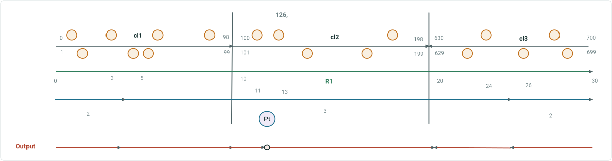
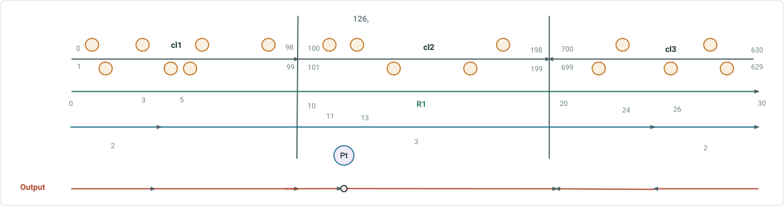
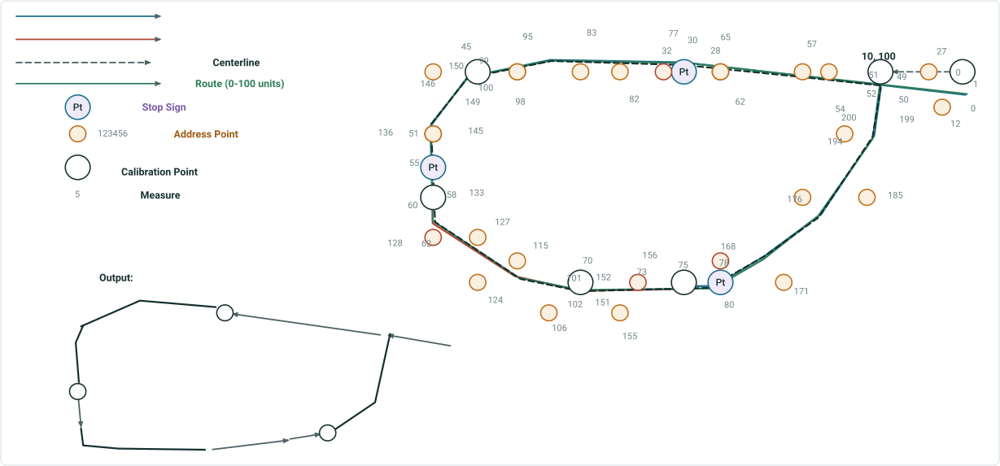
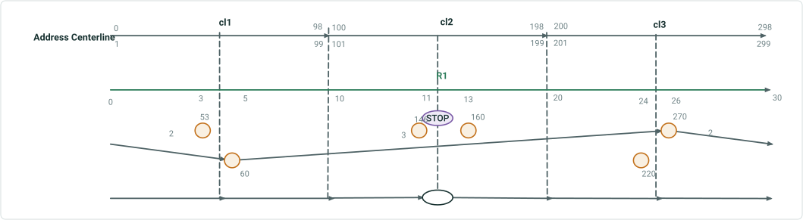
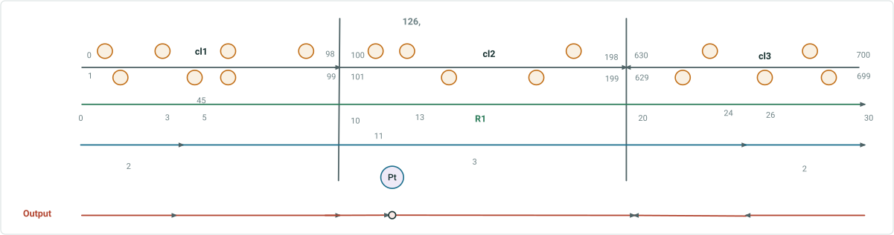
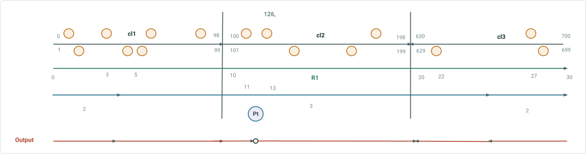

# Overlay Events/queryAttributeSet: Update Address Range info via Address Points

|   |   |
| --- | --- |
| **Kind** | Test Plan · Pro |
| **Release** | — |
| **Product** | Roads & Highways |
| **Issue** | [ArcGISPro/ps-location-referencing#6178](https://devtopia.esri.com/ArcGISPro/ps-location-referencing/issues/6178) |
| **Source** | [6178-OverlayEventsandqASUpdateAddressRangeInfoviaNearestAddressPoints_V2.pptx](<https://esriis.sharepoint.com/sites/LocationReferencing/Shared%20Documents/General/Test%20Plans/6178-OverlayEventsandqASUpdateAddressRangeInfoviaNearestAddressPoints_V2.pptx>) |
| **Edited** | 2025-01-15 21:16 by Mac Christmas |
| **Extracted** | 2026-09-04 · lane `xmlstrip` |

<!-- metadata
```yaml
title: "Overlay Events/queryAttributeSet: Update Address Range info via Address Points"
source_file: "6178-OverlayEventsandqASUpdateAddressRangeInfoviaNearestAddressPoints_V2.pptx"
source_url: "https://esriis.sharepoint.com/sites/LocationReferencing/Shared%20Documents/General/Test%20Plans/6178-OverlayEventsandqASUpdateAddressRangeInfoviaNearestAddressPoints_V2.pptx"
doc_id: 257
doc_kind: "Test Plan"
surface: "Pro"
doc_revision: "V2"
target_release: ""
pe: ""
dev: ""
author: "Mac Christmas"
last_edited_by: "Mac Christmas"
last_edited: "2025-01-15T21:16:01Z"
extracted: 2026-09-04
extraction_lane: xmlstrip
prompt_version: "v2.0.2"
keywords: ["overlay events", "address range", "address points", "proportional option", "nearest address point", "line event", "point event", "route calibration", "time slices", "address block split"]
tools: ["Overlay Events", "queryAttributeSet"]
products: ["Roads & Highways"]
issues: ["ArcGISPro/ps-location-referencing#6178"]
related: [{"doc":294,"file":"update-address-range-via-address-points-in-overlay-events-and-query-attribute__doc294.md","s":6.596},{"doc":320,"file":"update-address-range-information-as-part-of-segmentation-in-overlay-events__doc320.md","s":5.482},{"doc":344,"file":"update-address-range-information-in-overlay-events-and-query-attribute-sets__doc344.md","s":5.24},{"doc":364,"file":"overlay-events-and-queryattributeset-point-event-support-test-cases__doc364.md","s":4.303},{"doc":79,"file":"overlay-events-and-queryattributeset-support-for-un-pipeline-devices-and__doc79.md","s":4.139}]
```
-->

## Summary

Test plan for the Overlay Events and queryAttributeSet functionality focusing on updating address range information via address points. It includes positive and negative tests for proportional and nearest address point options, handling of line and point events, and various route complexities including time slices and multiple addresses at a single location.

## Related documents

<!-- related:begin -->
- [Update Address Range via Address Points in Overlay Events and Query Attribute Sets](<https://esriis.sharepoint.com/sites/lrsworkspace/LRS%20Doc%20Index/User%20Stories/update-address-range-via-address-points-in-overlay-events-and-query-attribute__doc294.md>) — similar text 0.28 · 5 title words · 2 filename words · same surface <!-- rel:294 -->
- [Update Address Range Information as Part of Segmentation in Overlay Events & Query Attribute Sets – Test Plan](<https://esriis.sharepoint.com/sites/lrsworkspace/LRS Doc Index/Test Plans/update-address-range-information-as-part-of-segmentation-in-overlay-events__doc320.md>) — similar text 0.36 · 4 title words · 1 filename word · same kind/surface/folder <!-- rel:320 -->
- [Update Address Range Information in Overlay Events and Query Attribute Sets](<https://esriis.sharepoint.com/sites/lrsworkspace/LRS Doc Index/User Stories/update-address-range-information-in-overlay-events-and-query-attribute-sets__doc344.md>) — similar text 0.28 · 4 title words · 3 filename words · same surface <!-- rel:344 -->
- [Overlay Events and queryAttributeSet Point Event Support Test Cases](<https://esriis.sharepoint.com/sites/lrsworkspace/LRS Doc Index/Test Plans/overlay-events-and-queryattributeset-point-event-support-test-cases__doc364.md>) — similar text 0.08 · 3 title words · 1 filename word · same kind/surface/folder <!-- rel:364 -->
- [Overlay Events and queryAttributeSet Support for UN Pipeline Devices and Junctions](<https://esriis.sharepoint.com/sites/lrsworkspace/LRS Doc Index/Test Plans/overlay-events-and-queryattributeset-support-for-un-pipeline-devices-and__doc79.md>) — similar text 0.06 · 3 title words · 1 filename word · same kind/surface/folder <!-- rel:79 -->
<!-- related:end -->

<!-- docs:begin -->
## Esri documentation

[View site address point properties](https://doc.esri.com/en/arcgis-pro/latest/help/production/roads-highways/view-site-address-point-properties.html)

_No page matched:_ [Overlay Events](https://www.google.com/search?q=%22Overlay%20Events%22+site%3Adoc.esri.com) · [queryAttributeSet](https://www.google.com/search?q=%22queryAttributeSet%22+site%3Adoc.esri.com)
<!-- docs:end -->

---

## Slide 1

Overlay Events/queryAttributeSet: Update Address Range info via Address Points

| Positive Tests: Sanity Tests |
| --- |
| Run Overlay Events/queryAttributeSet with the Proportional option chosen. Ensure proportional functionality continues to perform as expected Run Overlay Events/queryAttributeSet against an address range layer that is not configured with the LRS. Ensure block range fields do not update as part of output |

| Notes |
| --- |
| Add optional parameter “Address Block Split Type” to Overlay Events and queryAttributeSet Values will be Proportional (default) or Nearest address point Proportional option will perform the current proportional behavior Nearest Address Point option will split address ranges (when the configured address range layer is an input layer) in the output based on an interpolation of the nearest upstream and downstream address points Address Range layer can be Centerline or LRS line event Parameter will only appear in Pro UI when the configured address range layer is including in the input layers Support line and point events as input with this option Input line events will have address fields populated based on the Address Block Split Type for the Left From, Left To, Right From, and Right To fields whereas point events will have Null info for these fields If address range layer is Centerline, continue to consider centerline direction in output Test with FGDB, EGDB DC, and FS Test with centerline and line event as address range layer |

Devtopia Issue

| Positive Tests: GP UI |
| --- |
| When configured Address Range layer is input as part of the overlay, Address Block Split Type parameter appears Configured Address Range layer is not input as part of the overlay, Address Block Split Type parameter does not appear Address Block Split Type parameter is optional when it appears (should not have an asterisk) Address Block Split Type is not populated, parameter defaults to “Proportional” |

| Positive Tests: Python/REST |
| --- |
| When ran in Python or REST, when no value is input for the Address Block Split Type parameter, ensure the default of Proportional is honored |

| Negative Tests: Python/REST |
| --- |
| Input dataset is not ADM-RH, Address Block Split Type parameter is populated Input data is ADM-RH, but Address Block Split Type parameter is populated with an invalid value |

| Positive Tests |
| --- |
| Overlay Events/queryAttributeSet on simple route Overlay Events/queryAttributeSet on route with centerline in opposite direction of route calibration Overlay Events/queryAttributeSet on route with line event address range layer Overlay Events/queryAttributeSet on complex route Overlay Events/queryAttributeSet with time slices Overlay Events/queryAttributeSet with multiple addresses found at the same location Overlay Events/queryAttributeSet on simple route, address points are not near split location |

## Case 1 <!-- slide 2 -->

### Overlay Events / QueryAttributeSet on Simple Routes

11                             43     47			                  145                                167                                                           637                               649                     681
**Overlay Events/queryAttributeSet on simple routes**



| CL ID | Left From | Left To | Parity Left | Right From | Right To | Parity Right | Jurisdiction | RID | From M | To M | # Lanes | Sign Type |
| --- | --- | --- | --- | --- | --- | --- | --- | --- | --- | --- | --- | --- |
| 1 | 0 | 40 | Even | 1 | 41 | Odd | Clark | R1 | 0 | 4 | 2 | null |
| 1 | 42 | 98 | Even | 43 | 99 | Odd | Clark | R1 | 4 | 10 | 3 | null |
| 2 | 100 | 120 | Even | 101 | 121 | Odd | Clark | R1 | 10 | 12 | 3 | null |
| 2 | null | null | Even | null | null | Odd | Clark | R1 | 12 | 12 | 3 | Stop |
| 2 | 122 | 198 | Even | 123 | 199 | Odd | Clark | R1 | 12 | 20 | 3 | null |
| 3 | 630 | 644 | Even | 629 | 645 | Odd | Adam | R1 | 20 | 25 | 3 | null |
| 3 | 646 | 700 | Even | 647 | 699 | Odd | Adam | R1 | 25 | 30 | 2 | null |

8                       38                          66                             92                         112        130                                                                   186                                                       642                                      660

| [{"routeId":"TestCase1"}] |
| --- |
| [{"layerId":17,"fields":["toleft","centerlineid","parityleft","munileft","rangeprefixleft","discrpagid","fullname","fedrtetype","rclnguid","fromleft","astrtetype","rangeprefixright","ctyroute","precenterlineid","fromright","toright","parityright","muniright","VALIDATIONSTATUS","fedroute","afedrte","afedrtetype","stroute","strtetype","astrte","onewaydir","roadlevel","roadclass","inwater","countryleft","msagleft","esnleft","countryright","msagright","esnright","stateleft","stateright","countyleft","countyright","zipleft","zipright"]," objectIds ":[1106,1107,1108]},{"layerId":16,"fields":[" SpeedLimit "," MinSpeedLimit "]," objectIds ":[9203,9204,9603]},{"layerId":7,"fields":[" SignType "]," objectIds ":[10]},{"layerId":13,"fields":[" RouteId","FromDate","ToDate","RouteName "]," objectIds ":[7206]}] |
| nearest |
| [,] |
| ROADS.MAC_6178dllVerification1 |
|  |

## Case 2 <!-- slide 3 -->

### Overlay Events / QueryAttributeSet on Route with Centerline in



| CL ID | Left From | Left To | Parity Left | Right From | Right To | Parity Right | Jurisdiction | RID | From M | To M | # Lanes | Sign Type |
| --- | --- | --- | --- | --- | --- | --- | --- | --- | --- | --- | --- | --- |
| 1 | 0 | 40 | Even | 1 | 41 | Odd | Clark | R1 | 0 | 4 | 2 | null |
| 1 | 42 | 98 | Even | 43 | 99 | Odd | Clark | R1 | 4 | 10 | 3 | null |
| 2 | 100 | 120 | Even | 101 | 121 | Odd | Clark | R1 | 10 | 12 | 3 | null |
| 2 | null | null | Even | null | null | Odd | Clark | R1 | 12 | 12 | 3 | Stop |
| 2 | 122 | 198 | Even | 123 | 199 | Odd | Clark | R1 | 12 | 20 | 3 | null |
| 3 | 657 | 699 | Odd | 658 | 700 | Even | Adam | R1 | 25 | 20 | 3 | null |
| 3 | 629 | 655 | Odd | 630 | 656 | Even | Adam | R1 | 30 | 25 | 2 | null |

11                             43     47			                  145                                167                                                           681                               649                     637
8                       38                          66                             92                         112        130                                                                   186                                                       660                                      642
**Overlay Events/queryAttributeSet on route with centerline in opposite direction of route calibration**

| [{"routeId":"TestCase2"}] |
| --- |
| [{"layerId":17,"fields":["toleft","centerlineid","parityleft","munileft","rangeprefixleft","discrpagid","fullname","fedrtetype","rclnguid","fromleft","astrtetype","rangeprefixright","ctyroute","precenterlineid","fromright","toright","parityright","muniright","VALIDATIONSTATUS","fedroute","afedrte","afedrtetype","stroute","strtetype","astrte","onewaydir","roadlevel","roadclass","inwater","countryleft","msagleft","esnleft","countryright","msagright","esnright","stateleft","stateright","countyleft","countyright","zipleft","zipright"],"objectIds":[1907,1908,1909,1910]},{"layerId":16,"fields":["SpeedLimit","MinSpeedLimit"],"objectIds":[12403,12404,12803]},{"layerId":7,"fields":["SignType"],"objectIds":[2010]},{"layerId":13,"fields":["RouteId","FromDate","ToDate","RouteName"],"objectIds":[7606]}] |
| nearest |
| [,] |
| ROADS.MAC_6178dllVerification1 |

## Case 3 <!-- slide 4 -->

### Overlay Event / QueryAttributeSet on Route with Line Event

11                             43     47			                  145                                167                                                           637                               649                     681
**Overlay Event/queryAttributeSet on route with line event address range layer**


| CL ID | Left From | Left To | Parity Left | Right From | Right To | Parity Right | Jurisdiction | RID | From M | To M | # Lanes | Sign Type |
| --- | --- | --- | --- | --- | --- | --- | --- | --- | --- | --- | --- | --- |
| 1 | 0 | 40 | Even | 1 | 41 | Odd | Clark | R1 | 0 | 4 | 2 | null |
| 1 | 42 | 98 | Even | 43 | 99 | Odd | Clark | R1 | 4 | 10 | 3 | null |
| 2 | 100 | 120 | Even | 101 | 121 | Odd | Clark | R1 | 10 | 12 | 3 | null |
| 2 | null | null | Even | null | null | Odd | Clark | R1 | 12 | 12 | 3 | Stop |
| 2 | 122 | 198 | Even | 123 | 199 | Odd | Clark | R1 | 12 | 20 | 3 | null |
| 3 | 630 | 644 | Even | 629 | 645 | Odd | Adam | R1 | 20 | 25 | 3 | null |
| 3 | 646 | 700 | Even | 647 | 699 | Odd | Adam | R1 | 25 | 30 | 2 | null |

8                       38                          66                             92                         112        130                                                                   186                                                       642                                     660

| [{"routeId":"TestCase1"}] |
| --- |
| [{"layerId":6,"fields":["FromLeft","ToLeft","FromRight","ToRight","RoadName"],"objectIds":[801,802,1201]},{"layerId":11,"fields":["SPEEDLIMIT"],"objectIds":[802,803,1202]},{"layerId":2,"fields":["Type"],"objectIds":[401]},{"layerId":8,"fields":["RouteId","FromDate","ToDate","RouteName"],"objectIds":[3096]}] |
| nearest |
| [,] |
| ROADS.MAC_6178Testing1 |
|  |

## Case 4 <!-- slide 5 -->

### Overlay Event / QueryAttributeSet on Complex Route

**Overlay Event/queryAttributeSet on complex route**

35 mph Speed Limit
25 mph Speed Limit



| Type | CL ID | Left From | Left To | Parity Left | Right From | Right To | Parity Right | Jurisdiction | RID | From M | To M | Speed Limit | Sign Type |
| --- | --- | --- | --- | --- | --- | --- | --- | --- | --- | --- | --- | --- | --- |
| Line | 1 | 1 | 49 | Odd | 0 | 50 | Even | Local | Route1 | 0 | 10 | 25 | N/A |
| Line | 2 | 51 | 71 | Odd | 52 | 72 | Even | Local | Route1 | 10 | 30 | 25 | N/A |
| Point | 2 | Null | Null | Odd | Null | Null | Even | Local | Route1 | 30 | 30 | 25 | Stop |
| Line | 2 | 73 | 99 | Odd | 74 | 100 | Even | Local | Route1 | 30 | 45 | 25 | N/A |
| Line | 3 | 134 | 150 | Even | 133 | 149 | Odd | Local | Route1 | 55 | 45 | 25 | N/A |
| Point | 3 | Null | Null | Even | Null | Null | Odd | Local | Route1 | 55 | 55 | 25 | Stop |
| Line | 3 | 130 | 134 | Even | 133 | 147 | Odd | Local | Route1 | 60 | 55 | 25 | N/A |
| Line | 3 | 102 | 128 | Even | 101 | 131 | Odd | Local | Route1 | 70 | 60 | 35 | N/A |
| Line | 4 | 151 | 157 | Odd | 152 | 158 | Even | Local | Route1 | 70 | 75 | 35 | N/A |
| Line | 4 | 159 | 165 | Odd | 158 | 166 | Even | Local | Route1 | 75 | 80 | 25 | N/A |
| Point | 4 | Null | Null | Odd | Null | Null | Even | Local | Route1 | 80 | 80 | 25 | Stop |
| Line | 4 | 167 | 199 | Odd | 168 | 200 | Even | Local | Route1 | 80 | 100 | 25 | N/A |

| [{"routeId":"TestCase4"}] |
| --- |
| [{"layerId":17,"fields":["toleft","centerlineid","parityleft","munileft","rangeprefixleft","discrpagid","fullname","fedrtetype","rclnguid","fromleft","astrtetype","rangeprefixright","ctyroute","precenterlineid","fromright","toright","parityright","muniright","VALIDATIONSTATUS","fedroute","afedrte","afedrtetype","stroute","strtetype","astrte","onewaydir","roadlevel","roadclass","inwater","countryleft","msagleft","esnleft","countryright","msagright","esnright","stateleft","stateright","countyleft","countyright","zipleft","zipright"],"objectIds":[2310,2311,2312,2314]},{"layerId":16,"fields":["SpeedLimit","MinSpeedLimit"],"objectIds":[10804,11204,11205]},{"layerId":7,"fields":["SignType"],"objectIds":[810,811,1210]},{"layerId":13,"fields":["RouteId","FromDate","ToDate","RouteName"],"objectIds":[8406]}] |
| nearest |
| [,] |
| ROADS.MAC_6178dllVerification1 |

## Case 5 <!-- slide 6 -->

### Overlay Events / QueryAttributeSet with Time Slices

**Overlay Events/queryAttributeSet with time slices**



|  | From Date | To Date |
| --- | --- | --- |
| Route | 1/1/2000 | Null |
| Sign | 1/1/2005 | Null |
| Lane | 1/1/2010 | Null |

| From Date | To Date | CL ID | From M | To M | Left From | Left To | Parity Left | Right From | Right To | Parity Right | RID | # Lanes | Sign Type |
| --- | --- | --- | --- | --- | --- | --- | --- | --- | --- | --- | --- | --- | --- |
| 1/1/2000 | 1/1/2005 | cl1 | 0 | 10 | 0 | 98 | Even | 1 | 99 | Odd | R1 | Null | Null |
| 1/1/2000 | 1/1/2005 | cl2 | 10 | 20 | 100 | 198 | Even | 101 | 199 | Odd | R1 | Null | Null |
| 1/1/2000 | 1/1/2005 | cl3 | 20 | 30 | 200 | 298 | Even | 201 | 299 | Odd | R1 | Null | Null |
| 1/1/2005 | 1/1/2010 | cl1 | 0 | 10 | 0 | 98 | Even | 1 | 99 | Odd | R1 | Null | Null |
| 1/1/2005 | 1/1/2010 | cl2 | 10 | 15 | 100 | 152 | Even | 101 | 153 | Odd | R1 | Null | Null |
| 1/1/2005 | 1/1/2010 | cl2 | 15 | 15 | Null | Null | Even | Null | Null | Odd | R1 | Null | Stop |
| 1/1/2005 | 1/1/2010 | cl2 | 15 | 20 | 154 | 198 | Even | 155 | 199 | Odd | R1 | Null | Null |
| 1/1/2005 | 1/1/2010 | cl3 | 20 | 30 | 200 | 298 | Even | 201 | 299 | Odd | R1 | Null | Null |
| 1/1/2010 | Null | cl1 | 0 | 5 | 0 | 56 | Even | 1 | 55 | Odd | R1 | 2 | Null |
| 1/1/2010 | Null | cl1 | 5 | 10 | 58 | 98 | Even | 57 | 99 | Odd | R1 | 3 | Null |
| 1/1/2010 | Null | cl2 | 10 | 15 | 100 | 152 | Even | 101 | 153 | Odd | R1 | 3 | Null |
| 1/1/2010 | Null | cl2 | 15 | 15 | Null | Null | Even | Null | Null | Odd | R1 | 3 | Stop |
| 1/1/2010 | Null | cl2 | 15 | 20 | 154 | 198 | Even | 155 | 199 | Odd | R1 | 3 | Null |
| 1/1/2010 | Null | cl3 | 20 | 25 | 200 | 244 | Even | 201 | 245 | Odd | R1 | 3 | Null |
| 1/1/2010 | Null | cl3 | 25 | 30 | 246 | 298 | Even | 247 | 299 | Odd | R1 | 2 | Null |

| [{"routeId":"TestCase5"}] |
| --- |
| [{"layerId":17,"fields":["toleft","centerlineid","parityleft","munileft","rangeprefixleft","discrpagid","fullname","fedrtetype","rclnguid","fromleft","astrtetype","rangeprefixright","ctyroute","precenterlineid","fromright","toright","parityright","muniright","VALIDATIONSTATUS","fedroute","afedrte","afedrtetype","stroute","strtetype","astrte","onewaydir","roadlevel","roadclass","inwater","countryleft","msagleft","esnleft","countryright","msagright","esnright","stateleft","stateright","countyleft","countyright","zipleft","zipright"],"objectIds":[2706,2707,2708]},{"layerId":16,"fields":["SpeedLimit","MinSpeedLimit"],"objectIds":[11603,11604,12003]},{"layerId":7,"fields":["SignType"],"objectIds":[1610]},{"layerId":13,"fields":["RouteId","FromDate","ToDate","RouteName"],"objectIds":[8806]}] |
| nearest |
| [,] |
| ROADS.MAC_6178dllVerification1 |
|  |

## Case 6 <!-- slide 7 -->

### Overlay Events / QueryAttributeSet with Multiple Addresses

11                         41, 43,      47			                  145                                167                                                           637                               649                     681
**Overlay Events/queryAttributeSet with multiple addresses found at a single location**



| CL ID | Left From | Left To | Parity Left | Right From | Right To | Parity Right | Jurisdiction | RID | From M | To M | # Lanes | Sign Type |
| --- | --- | --- | --- | --- | --- | --- | --- | --- | --- | --- | --- | --- |
| 1 | 0 | 40 | Even | 1 | 39 | Odd | Clark | R1 | 0 | 4 | 2 | null |
| 1 | 42 | 98 | Even | 41 | 99 | Odd | Clark | R1 | 4 | 10 | 3 | null |
| 2 | 100 | 120 | Even | 101 | 121 | Odd | Clark | R1 | 10 | 12 | 3 | null |
| 2 | null | null | Even | null | null | Odd | Clark | R1 | 12 | 12 | 3 | Stop |
| 2 | 122 | 198 | Even | 123 | 199 | Odd | Clark | R1 | 12 | 20 | 3 | null |
| 3 | 630 | 644 | Even | 629 | 645 | Odd | Adam | R1 | 20 | 25 | 3 | null |
| 3 | 646 | 700 | Even | 647 | 699 | Odd | Adam | R1 | 25 | 30 | 2 | null |

8               34, 36, 38                    66                             92                         112        130,                                                                  186                                                       642                                      660

| [{"routeId":"TestCase1"}] |
| --- |
| [{"layerId":17,"fields":["toleft","centerlineid","parityleft","munileft","rangeprefixleft","discrpagid","fullname","fedrtetype","rclnguid","fromleft","astrtetype","rangeprefixright","ctyroute","precenterlineid","fromright","toright","parityright","muniright","VALIDATIONSTATUS","fedroute","afedrte","afedrtetype","stroute","strtetype","astrte","onewaydir","roadlevel","roadclass","inwater","countryleft","msagleft","esnleft","countryright","msagright","esnright","stateleft","stateright","countyleft","countyright","zipleft","zipright"]," objectIds ":[1106,1107,1108]},{"layerId":16,"fields":[" SpeedLimit "," MinSpeedLimit "]," objectIds ":[9203,9204,9603]},{"layerId":7,"fields":[" SignType "]," objectIds ":[10]},{"layerId":13,"fields":[" RouteId","FromDate","ToDate","RouteName "]," objectIds ":[7206]}] |
| nearest |
| [,] |
| ROADS.MAC_6178dllVerification1 |

## Case 7 <!-- slide 8 -->

### Overlay Events / QueryAttributeSet on Simple Route

11                             43     47			                  145                                167                                                    637                                                                  681
**Overlay Events/queryAttributeSet on simple route, address points are not near split location**



| CL ID | Left From | Left To | Parity Left | Right From | Right To | Parity Right | Jurisdiction | RID | From M | To M | # Lanes | Sign Type |
| --- | --- | --- | --- | --- | --- | --- | --- | --- | --- | --- | --- | --- |
| 1 | 0 | 40 | Even | 1 | 41 | Odd | Clark | R1 | 0 | 4 | 2 | null |
| 1 | 42 | 98 | Even | 43 | 99 | Odd | Clark | R1 | 4 | 10 | 3 | null |
| 2 | 100 | 120 | Even | 101 | 121 | Odd | Clark | R1 | 10 | 12 | 3 | null |
| 2 | null | null | Even | null | null | Odd | Clark | R1 | 12 | 12 | 3 | Stop |
| 2 | 122 | 198 | Even | 123 | 199 | Odd | Clark | R1 | 12 | 20 | 3 | null |
| 3 | 630 | 648 | Even | 629 | 649 | Odd | Adam | R1 | 20 | 25 | 3 | null |
| 3 | 650 | 700 | Even | 651 | 699 | Odd | Adam | R1 | 25 | 30 | 2 | null |

8                       38                          66                             92                         112        130                                                                   186                                                                                                   660

| [{"routeId":"TestCase1"}] |
| --- |
| [{"layerId":17,"fields":["toleft","centerlineid","parityleft","munileft","rangeprefixleft","discrpagid","fullname","fedrtetype","rclnguid","fromleft","astrtetype","rangeprefixright","ctyroute","precenterlineid","fromright","toright","parityright","muniright","VALIDATIONSTATUS","fedroute","afedrte","afedrtetype","stroute","strtetype","astrte","onewaydir","roadlevel","roadclass","inwater","countryleft","msagleft","esnleft","countryright","msagright","esnright","stateleft","stateright","countyleft","countyright","zipleft","zipright"]," objectIds ":[1106,1107,1108]},{"layerId":16,"fields":[" SpeedLimit "," MinSpeedLimit "]," objectIds ":[9203,9204,9603]},{"layerId":7,"fields":[" SignType "]," objectIds ":[10]},{"layerId":13,"fields":[" RouteId","FromDate","ToDate","RouteName "]," objectIds ":[7206]}] |
| nearest |
| [,] |
| ROADS.MAC_6178dllVerification1 |
