# Point Events Dynamic Segmentation Test Plan

|   |   |
| --- | --- |
| **Kind** | Test Plan · Pro |
| **Release** | — |
| **Source** | [PointEvents_Dynseg_TestPlan1.pptx](<https://esriis.sharepoint.com/sites/LocationReferencing/Shared%20Documents/General/Test%20Plans/PointEvents_Dynseg_TestPlan1.pptx>) |
| **Edited** | 2024-05-22 18:01 by Rahul Rakshit |
| **Extracted** | 2026-09-04 · lane `xmlstrip` |

<!-- metadata
```yaml
title: "Point Events Dynamic Segmentation Test Plan"
source_file: "PointEvents_Dynseg_TestPlan1.pptx"
source_url: "https://esriis.sharepoint.com/sites/LocationReferencing/Shared%20Documents/General/Test%20Plans/PointEvents_Dynseg_TestPlan1.pptx"
doc_id: 365
doc_kind: "Test Plan"
surface: "Pro"
doc_revision: ""
target_release: ""
pe: ""
dev: ""
author: "Rahul Rakshit"
last_edited_by: "Rahul Rakshit"
last_edited: "2024-05-22T18:01:22Z"
extracted: 2026-09-04
extraction_lane: xmlstrip
prompt_version: "v2.0.2"
keywords: ["point event", "dynamic segmentation", "attribute editing", "conflict prevention", "event editing", "time sliced events", "spanning events"]
tools: ["Save Edits"]
products: []
issues: []
related: [{"doc":364,"file":"overlay-events-and-queryattributeset-point-event-support-test-cases__doc364.md","s":4.004},{"doc":360,"file":"add-point-event-to-dominant-route-in-arcgis-pro-test-plan__doc360.md","s":3.685},{"doc":278,"file":"consider-route-dominance-in-append-events-test-plan__doc278.md","s":3.496},{"doc":491,"file":"splitting-events-in-arcgis-pro-test-plan__doc491.md","s":3.438},{"doc":351,"file":"dynamic-segmentation-table-experience-builder-test-plan__doc351.md","s":3.199}]
```
-->

## Summary

Test plan for verifying the dynamic segmentation functionality for point events in ArcGIS Pro. Covers attribute editing, domain validation, conflict prevention with locks, event editing scenarios including spanning and time-sliced events, and behavior of editable fields in dynamic segmentation feature classes. Includes examples of normal, complex, gapped, and spanning routes with associated event tables and schematics.

## Related documents

<!-- related:begin -->
- [Overlay Events and queryAttributeSet Point Event Support Test Cases](<https://esriis.sharepoint.com/sites/lrsworkspace/LRS Doc Index/Test Plans/overlay-events-and-queryattributeset-point-event-support-test-cases__doc364.md>) — similar text 0.12 · 2 title words · 1 filename word · same kind/surface/folder <!-- rel:364 -->
- [Add Point Event to Dominant Route in ArcGIS Pro – Test Plan](<https://esriis.sharepoint.com/sites/lrsworkspace/LRS Doc Index/Test Plans/add-point-event-to-dominant-route-in-arcgis-pro-test-plan__doc360.md>) — similar text 0.17 · 1 title word · 1 filename word · same kind/surface/folder <!-- rel:360 -->
- [Consider Route Dominance in Append Events Test Plan](<https://esriis.sharepoint.com/sites/lrsworkspace/LRS Doc Index/Test Plans/consider-route-dominance-in-append-events-test-plan__doc278.md>) — similar text 0.27 · 1 title word · 1 filename word · same kind/folder <!-- rel:278 -->
- [Splitting Events in ArcGIS Pro - Test Plan](<https://esriis.sharepoint.com/sites/lrsworkspace/LRS Doc Index/Test Plans/splitting-events-in-arcgis-pro-test-plan__doc491.md>) — similar text 0.26 · 1 title word · same kind/surface/folder <!-- rel:491 -->
- [Dynamic Segmentation Table Experience Builder Test Plan](<https://esriis.sharepoint.com/sites/lrsworkspace/LRS Doc Index/Test Plans/dynamic-segmentation-table-experience-builder-test-plan__doc351.md>) — similar text 0.21 · 2 title words · same kind/folder <!-- rel:351 -->
<!-- related:end -->

<!-- docs:begin -->
## Esri documentation

[Apply dynamic segmentation](https://doc.esri.com/en/arcgis-pro/latest/help/production/location-referencing-pipelines/apply-dynamic-segmentation.html) · [Event editing using the attribute table](https://doc.esri.com/en/arcgis-pro/latest/help/production/location-referencing-pipelines/event-editing-using-the-attribute-table.html) · [Conflict prevention](https://doc.esri.com/en/arcgis-pro/latest/help/production/location-referencing-pipelines/conflict-prevention.html)

_No page matched:_ [Save Edits](https://www.google.com/search?q=%22Save%20Edits%22+site%3Adoc.esri.com)
<!-- docs:end -->

---

## Slide 1


## Slide 2

Verification

- Request time out is 10 mins
- Only the point attribute sets that are present in the Attribute Sets location folder are listed
- Point Event’s attribute fields that hold characteristic values are editable
- The Point Event’s fields are named as <EventName.FieldName>
- The following fields are editable (provided they are the characteristic fields)
  - Coded value domains
  - Range Domains
  - Contingent Values
  - Fields with attribute rules
  - Fields with subtypes
  - Default value set
  - Null not allowed
Verify that non-allowed values are not transferred from the Dynseg table to the event tables. E.g. A value of out range for a field where range domain is set.

- Domains are copied over from the underlying point event tables so that user has them available when editing the data in the dynamic segmentation FC.
- The DynamicSegmentation attribute table can be exported to a new table
- Selecting a row in the table highlights the feature on the map
- The following fields types are supported (provided they are the characteristic fields)
  - Text
  - Numeric
  - Date
  - Guid
- Once a field is edited, the edits can be saved using the ‘Save Edits’ tool in the Pro ribbon.
- Once you make an edit and save, then verify that the individual event’s attribute table is updated, and shape is generated.
- Centerline layer is not allowed as a Dynseg layer for this tool
- A dynseg table is still generated if there exists only point events but no line events for the selected route.
- The type field is non editable

## Slide 3

Conflict Prevention
• Check for locks only when a field is edited. Acquire event locks.
• Release the lock upon a successful run when using the Default version

|  | Scenario | Result |
| --- | --- | --- |
| 1 | Route locked by another user in same version | Unable to edit |
| 2 | Route locked by another user in another version | Unable to edit |
| 3 | Route locked by same user in another version | Unable to edit |
| 4 | Route locked by same user in same version | Editing allowed |
| 5 | No locks present for the route or for the events on the route | Editing allowed |
| 6 | Multiple cells are edited using calculate fields, some of the route locks are not available | Unable to edit |
| 7 | Route locked by another user in same version, but no edits have taken place | Editing allowed provided that the lock is transferred |
| 8 | Event locked by same user in another version | Unable to edit |
| 9 | Line locked by another user in same version | Unable to edit |
| 10 | Line locked by another user in another version | Unable to edit |
| 11 | Line locked by same user in another version | Unable to edit |
| 12 | Event locked by another user in another version | Unable to edit |
| 13 | Event locked by another user in same version | Unable to edit |

## Slide 4

## Slide 5


| Network |  |
| --- | --- |
| RouteID | R1 |
| From Date | 1/1/2000 |
| To Date | Null |

| Line Event1 |  |  |  |  |  |  |
| --- | --- | --- | --- | --- | --- | --- |
| RouteID | EventID | From Date | To Date | From M | To M | Code |
| R1 | 1 | 1/1/2000 | Null | 20 | 70 | A |
| R1 | 2 |  |  | 70 | 110 | B |
| Line Event2 |  |  |  |  |  |  |
| R1 | 1 | 1/1/2000 | Null | 10 | 50 | Y |
| R1 | 2 | 1/1/2000 | Null | 50 | 100 | X |
| Point Event1 |  |  |  |  |  |  |
| R1 | 1 | 1/1/2000 | Null | 18 |  | 1 |
| R1 | 2 | 1/1/2000 | Null | 30 |  | 2 |
| R1 | 3 | 1/1/2000 | Null | 50 |  | 3 |
| R1 | 4 | 1/1/2000 | Null | 100 |  | 1 |
| Point Event2 |  |  |  |  |  |  |
| R1 | 1 | 1/1/2000 | Null | 20 |  | XX |
| R1 | 2 | 1/1/2000 | Null | 70 |  | YY |
| R1 | 3 | 1/1/2000 | Null | 110 |  | XX |

Normal Route

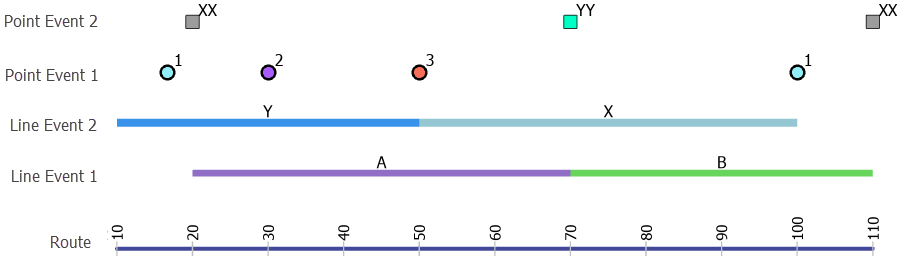

## Slide 6


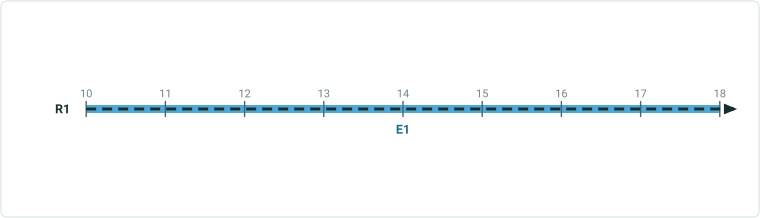

| Type | From Measure | To Measure | Line1 | Line2 | Point1 | Point2 |
| --- | --- | --- | --- | --- | --- | --- |
| Line | 10 | 18 |  | Y |  |  |
| Point | 18 | 18 |  | Y | 1 |  |
| Line | 18 | 20 |  | Y |  |  |
| Point | 20 | 20 | A | Y |  | XX |
| Line | 20 | 30 | A | Y |  |  |
| Point | 30 | 30 | A | Y | 2 |  |
| Line | 30 | 50 | A | Y |  |  |
| Point | 50 | 50 | A | X | 3 |  |
| Line | 50 | 70 | A | X |  |  |
| Point | 70 | 70 | B | X |  | YY |
| Line | 70 | 100 | B | X |  |  |
| Point | 100 | 100 | B | X | 1 |  |
| Line | 100 | 110 | B |  |  |  |
| Point | 110 | 110 | B |  |  | XX |

Only white cells are editable


## Slide 7

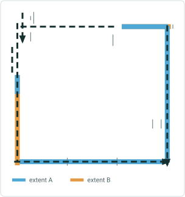

| Network |  |
| --- | --- |
| RouteID | R1 |
| From Date | 1/1/2000 |
| To Date | Null |

| Line Event1 |  |  |  |  |  |  |
| --- | --- | --- | --- | --- | --- | --- |
| RouteID | EventID | From Date | To Date | From M | To M | Code |
| R1 | 1 | 1/1/2000 | Null | 30 | 180 | A |
| Point Event1 |  |  |  |  |  |  |
| R1 | 1 | 1/1/2000 | Null | 10 |  | 11 |
| R1 | 2 | 1/1/2000 | Null | 30 |  | 33 |
| R1 | 3 | 1/1/2000 | Null | 180 |  | 22 |
| Point Event2 |  |  |  |  |  |  |
| R1 | 1 | 1/1/2000 | Null | 200 |  | AA |
| R1 | 2 | 1/1/2000 | Null | 100 |  | BB |

Complex Route

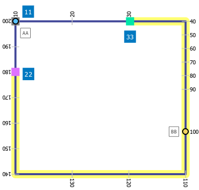

## Slide 8

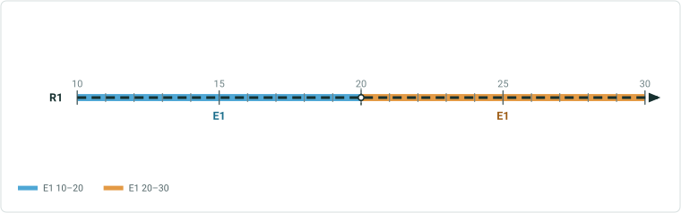

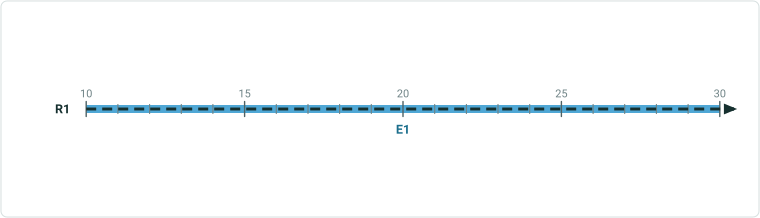

| Type | From Measure | To Measure | Line1 | Point1 | Point2 |
| --- | --- | --- | --- | --- | --- |
| Line | 10 | 30 |  |  |  |
| Point | 10 | 10 |  |  | 11 |
| Point | 30 | 30 | A |  | 33 |
| Line | 30 | 100 | A |  |  |
| Point | 100 | 100 | A | BB |  |
| Line | 100 | 180 | A |  |  |
| Point | 180 | 180 | A |  | 22 |
| Line | 180 | 200 |  |  |  |
| Point | 200 | 200 |  | AA |  |

Only white cells are editable


## Slide 9


| Network |  |
| --- | --- |
| RouteID | R1 |
| From Date | 1/1/2000 |
| To Date | Null |

| Line Event1 |  |  |  |  |  |  |
| --- | --- | --- | --- | --- | --- | --- |
| RouteID | EventID | From Date | To Date | From M | To M | Code |
| R1 | 1 | 1/1/2000 | Null | 12 | 14 | A |
| R1 | 2 | 1/1/2000 | Null | 16 | 21 | A |
| Point Event1 |  |  |  |  |  |  |
| R1 | 1 | 1/1/2000 | Null | 14 |  | 22 |
| R1 | 2 | 1/1/2000 | Null | 15 |  | 33 |
| R1 | 3 | 1/1/2000 | Null | 16 |  | 33 |
| Point Event2 |  |  |  |  |  |  |
| R1 | 2 | 1/1/2000 | Null | 14 |  | BB |

Gapped Route

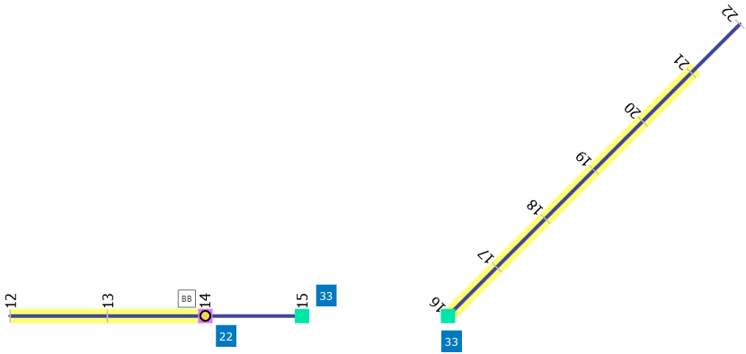

## Slide 10


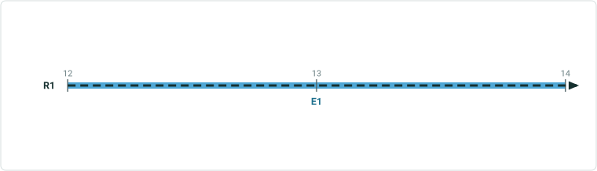

| Type | From Measure | To Measure | Line1 | Point1 | Point2 |
| --- | --- | --- | --- | --- | --- |
| Line | 12 | 14 | A |  |  |
| Point | 14 | 14 | A | 22 | BB |
| Line | 14 | 15 |  |  |  |
| Point | 15 | 15 | A | 33 |  |
| Point | 16 | 16 | A | 33 |  |
| Line | 16 | 21 | A |  |  |
| Line | 21 | 22 |  |  |  |

Only white cells are editable


## Slide 11


| Network |  |
| --- | --- |
| RouteID | R1 |
| From Date | 1/1/2000 |
| To Date | Null |

| Line Event1 |  |  |  |  |  |  |
| --- | --- | --- | --- | --- | --- | --- |
| RouteID | EventID | From Date | To Date | From M | To M | Code |
| R1 | 1 | 1/1/2000 | 12/31/2020 | 16 | 23 | A |
| R1 | 2 | 1/1/2000 | 12/31/2020 | 23 | 30 | B |
| R1 | 1 | 12/31/2020 | Null | 16 | 30 | A |
| Point Event1 |  |  |  |  |  |  |
| R1 | 1 | 1/1/2000 | 12/31/2020 | 16 |  | BB |
| R1 | 2 | 1/1/2000 | 12/31/2020 | 23 |  | BB |
| R1 | 3 | 12/31/2020 | Null | 26.1 |  | BB |
| R1 | 4 | 12/31/2020 | Null | 16 |  | BB |

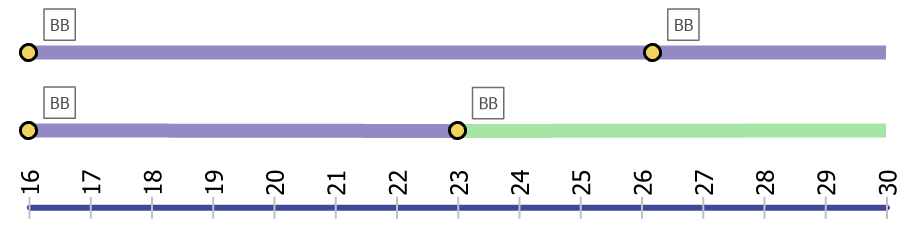

## Slide 12


| Type | From Measure | To Measure | From Date | To Date | Line1 | Point1 |
| --- | --- | --- | --- | --- | --- | --- |
| Point | 16 | 16 | 1/1/2000 | 12/31/2020 | A | BB |
| Line | 16 | 23 | 1/1/2000 | 12/31/2020 | A |  |
| Line | 23 | 30 | 1/1/2000 | 12/31/2020 | B |  |
| Point | 23 | 23 | 1/1/2000 | 12/31/2020 | B | BB |
| Line | 16 | 26.1 | 12/31/2020 | Null | A |  |
| Point | 16 | 16 | 12/31/2020 | Null | A | BB |
| Point | 26.1 | 26.1 | 12/31/2020 | Null | A | BB |
| Line | 26.1 | 30 | 12/31/2020 | Null | A |  |

Only white cells are editable


## Slide 13

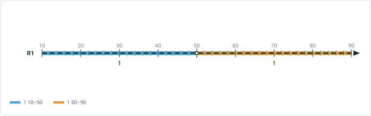

Line Network – Spanning Events


| Network |  |
| --- | --- |
| RouteID | R1 |
| Line ID | L1 |
| From Date | 1/1/2000 |
| To Date | Null |

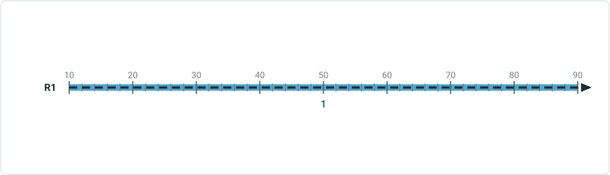

| Line Event1 |  |  |  |  |  |  |  |
| --- | --- | --- | --- | --- | --- | --- | --- |
| From RouteID | From Measure | To Route ID | To Measure | Event ID | From Date | To Date | Code |
| R1 | 10 | R1 | 90 | 1 | 1/1/2000 | Null | A |
| R1 | 90 | R2 | 130 | 2 | 1/1/2000 | Null | B |
| Point Event1 |  |  |  |  |  |  |  |
| R1 | 10 |  |  | 1 | 1/1/2000 | Null | 33 |
| R1 | 90 |  |  | 2 | 1/1/2000 | Null | 22 |
| Point Event2 |  |  |  |  |  |  |  |
| R1 | 90 |  |  | 1 | 1/1/2000 | Null | AA |
| R2 | 50 |  |  | 2 | 1/1/2000 | Null | BB |

| Network |  |
| --- | --- |
| RouteID | R2 |
| Line ID | L1 |
| From Date | 1/1/2000 |
| To Date | Null |

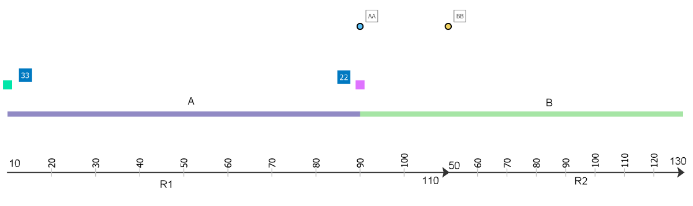

## Slide 14


| Type | Route ID | From Measure | To Measure | Line1 | Point1 | Point2 |
| --- | --- | --- | --- | --- | --- | --- |
| Point | R1 | 10 | 10 | A | 33 |  |
| Line | R1 | 10 | 90 | A |  |  |
| Line | R1 | 90 | 110 | B |  |  |
| Point | R1 | 90 | 90 | B | 22 | AA |
| Line | R2 | 50 | 130 | B |  |  |
| Point | R2 | 50 | 50 | B |  | BB |

Only white cells are editable


## Slide 15

Editing Scenarios


| Network |  |
| --- | --- |
| RouteID | R1 |
| From Date | 1/1/2000 |
| To Date | Null |

| Line Event1 |  |  |  |  |  |  |
| --- | --- | --- | --- | --- | --- | --- |
| RouteID | EventID | From Date | To Date | From M | To M | Code |
| R1 | 1 | 1/1/2000 | Null | 20 | 70 | A |
| R1 | 2 |  |  | 70 | 110 | B |
| Line Event2 |  |  |  |  |  |  |
| R1 | 1 | 1/1/2000 | Null | 10 | 50 | Y |
| R1 | 2 | 1/1/2000 | Null | 50 | 100 | X |
| Point Event1 |  |  |  |  |  |  |
| R1 | 1 | 1/1/2000 | Null | 18 |  | 1 |
| R1 | 2 | 1/1/2000 | Null | 30 |  | 2 |
| R1 | 3 | 1/1/2000 | Null | 50 |  | 3 |
| R1 | 4 | 1/1/2000 | Null | 100 |  | 1 |
| Point Event2 |  |  |  |  |  |  |
| R1 | 1 | 1/1/2000 | Null | 20 |  | XX |
| R1 | 2 | 1/1/2000 | Null | 70 |  | YY |
| R1 | 3 | 1/1/2000 | Null | 110 |  | XX |


## Slide 16


| Type | From Measure | To Measure | Line1 | Line2 | Point1 | Point2 |
| --- | --- | --- | --- | --- | --- | --- |
| Line | 10 | 18 |  | Y |  |  |
| Point | 18 | 18 |  | Y | 1 |  |
| Line | 18 | 20 |  | Y |  |  |
| Point | 20 | 20 | A | Y |  | XX |
| Line | 20 | 30 | A | Y |  |  |
| Point | 30 | 30 | A | Y | 2 |  |
| Line | 30 | 50 | A | Y |  |  |
| Point | 50 | 50 | A | Y | 3 |  |
| Line | 50 | 70 | A | X |  |  |
| Point | 70 | 70 | B | X |  | YY |
| Line | 70 | 100 | B | X |  |  |
| Point | 100 | 100 | B | X | 1 |  |
| Line | 100 | 110 | A |  |  |  |
| Point | 110 | 110 | B |  |  | XX |

Only white cells are editable
Change to PP
Add YY


## Slide 17

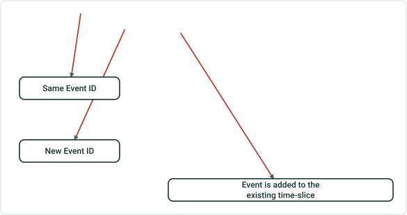


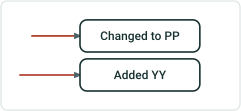

| Point Event2 |  |  |  |  |  |  |
| --- | --- | --- | --- | --- | --- | --- |
| RouteID | EventID | From Date | To Date | From M | To M | Code |
| R1 | 1 | 1/1/2000 | Null | 20 |  | XX |
| R1 | 2 | 1/1/2000 | Null | 70 |  | YY |
| R1 | 3 | 1/1/2000 | Null | 110 |  | PP |
| R1 | 4 | 1/1/2000 | Null | 30 |  | YY |

Event is added to the existing time-slice

 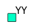

## Slide 18


| Network |  |
| --- | --- |
| RouteID | R1 |
| From Date | 1/1/2000 |
| To Date | Null |

| Line Event1 |  |  |  |  |  |  |
| --- | --- | --- | --- | --- | --- | --- |
| RouteID | EventID | From Date | To Date | From M | To M | Code |
| R1 | 1 | 1/1/2000 | 12/31/2020 | 16 | 23 | A |
| R1 | 2 | 1/1/2000 | 12/31/2020 | 23 | 30 | B |
| R1 | 1 | 12/31/2020 | Null | 16 | 30 | A |
| Point Event1 |  |  |  |  |  |  |
| R1 | 1 | 1/1/2000 | 12/31/2020 | 16 |  | BB |
| R1 | 2 | 1/1/2000 | 12/31/2020 | 23 |  | BB |
| R1 | 3 | 12/31/2020 | Null | 26.1 |  | BB |
| R1 | 4 | 12/31/2020 | Null | 16 |  | BB |


## Slide 19


| Type | From Measure | To Measure | From Date | To Date | Line1 | Point1 |
| --- | --- | --- | --- | --- | --- | --- |
| Point | 16 | 16 | 1/1/2000 | 12/31/2020 | A | BB |
| Line | 16 | 23 | 1/1/2000 | 12/31/2020 | A |  |
| Line | 23 | 30 | 1/1/2000 | 12/31/2020 | B |  |
| Point | 23 | 23 | 1/1/2000 | 12/31/2020 | B | BB |
| Line | 16 | 26.1 | 12/31/2020 | Null | A |  |
| Point | 16 | 16 | 12/31/2020 | Null | A | BB |
| Point | 26.1 | 26.1 | 12/31/2020 | Null | A | BB |
| Line | 26.1 | 30 | 12/31/2020 | Null | A |  |

Only white cells are editable


## Slide 20


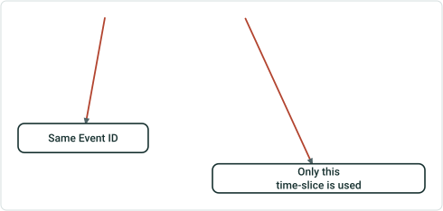

| Point Event1 |  |  |  |  |  |  |
| --- | --- | --- | --- | --- | --- | --- |
| RouteID | EventID | From Date | To Date | From M | To M | Code |
| R1 | 1 | 1/1/2000 | 12/31/2020 | 16 |  | BB |
| R1 | 2 | 1/1/2000 | 12/31/2020 | 23 |  | AA |
| R1 | 3 | 12/31/2020 | Null | 26.1 |  | BB |
| R1 | 4 | 12/31/2020 | Null | 16 |  | BB |

Only this time-slice is used


## Slide 21

Time Sliced Events -2


| Network |  |
| --- | --- |
| RouteID | R1 |
| From Date | 1/1/2000 |
| To Date | Null |

| Line Event1 |  |  |  |  |  |  |
| --- | --- | --- | --- | --- | --- | --- |
| RouteID | EventID | From Date | To Date | From M | To M | Code |
| R1 | 1 | 1/1/2000 | 12/31/2020 | 16 | 30 | B |
| Point Event1 |  |  |  |  |  |  |
| R1 | 1 | 1/1/2000 | 12/31/2020 | 17 |  | 1 |
| R1 | 2 | 12/31/2020 | Null | 17 |  | 2 |

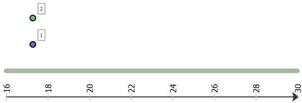

## Slide 22

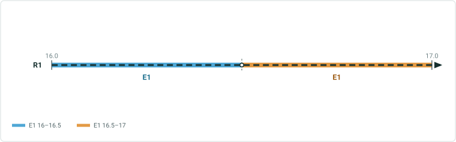


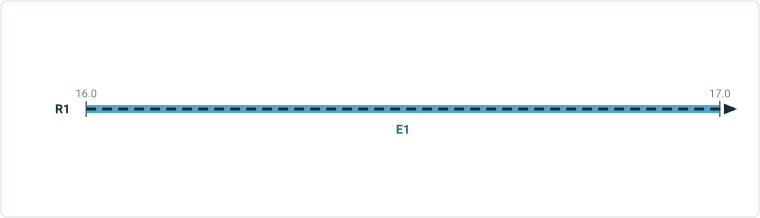

| Type | From Measure | To Measure | From Date | To Date | Line1 | Point1 |
| --- | --- | --- | --- | --- | --- | --- |
| Line | 16 | 17 | 1/1/2000 | 1/1/2010 |  |  |
| Point | 17 | 17 | 1/1/2000 | 1/1/2010 |  | 1 |
| Line | 17 | 30 | 1/1/2000 | 1/1/2010 |  |  |
| Line | 16 | 17 | 1/1/2010 | 12/31/2020 | B |  |
| Point | 17 | 17 | 1/1/2010 | 12/31/2020 | B | 1 |
| Line | 17 | 30 | 1/1/2010 | 12/31/2020 | B |  |
| Line | 16 | 17 | 12/31/2020 | 12/31/2030 |  |  |
| Point | 17 | 17 | 12/31/2020 | 12/31/2030 |  | 1 |
| Line | 17 | 30 | 12/31/2020 | 12/31/2030 |  |  |
| Line | 16 | 17 | 12/31/2030 | Null |  |  |
| Point | 17 | 17 | 12/31/2030 | Null |  | 2 |
| Line | 17 | 30 | 12/31/2030 | Null |  |  |


## Slide 23

Time Sliced Events -3

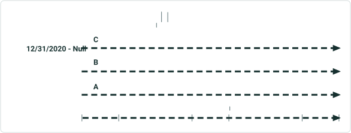

| Network |  |
| --- | --- |
| RouteID | R1 |
| From Date | 1/1/2000 |
| To Date | Null |

| Line Event1 |  |  |  |  |  |  |
| --- | --- | --- | --- | --- | --- | --- |
| RouteID | EventID | From Date | To Date | From M | To M | Code |
| R1 | 1 | 1/1/2000 | 12/31/2010 | 16 | 30 | A |
| R1 | 1 | 12/31/2010 | 12/31/2020 | 16 | 30 | B |
| R1 | 1 | 12/31/2020 | Null | 16 | 30 | C |
| Point Event1 |  |  |  |  |  |  |
| R1 | 1 | 1/1/2000 | 12/31/2010 | 20 |  | 3 |

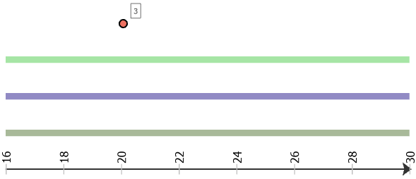

## Slide 24


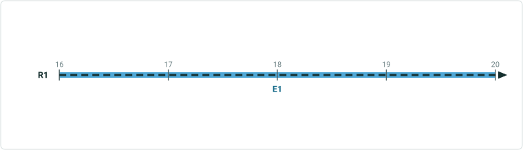

| Type | From Measure | To Measure | From Date | To Date | Line1 | Point1 |
| --- | --- | --- | --- | --- | --- | --- |
| Line | 16 | 20 | 1/1/2000 | 12/31/2010 | A |  |
| Point | 20 | 20 | 1/1/2000 | 12/31/2010 | A | 3 |
| Line | 20 | 30 | 1/1/2000 | 12/31/2010 | A |  |
| Line | 16 | 30 | 12/31/2010 | 12/31/2020 | A |  |
| Line | 16 | 30 | 12/31/2020 | Null | A |  |


## Slide 25

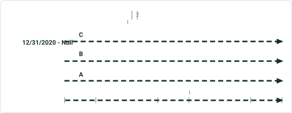

| Point Event1 |  |  |  |  |  |  |
| --- | --- | --- | --- | --- | --- | --- |
| R1 | 1 | 1/1/2000 | 12/31/2010 | 20 |  | 2 |


