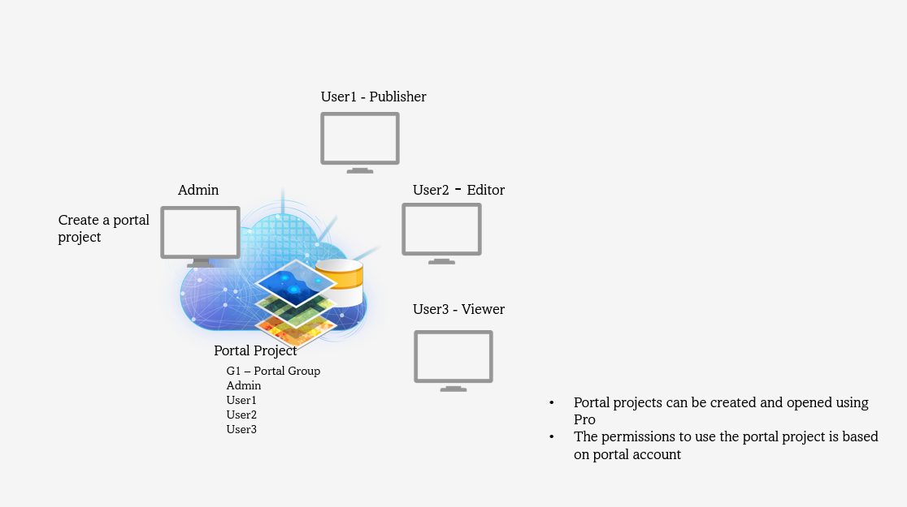
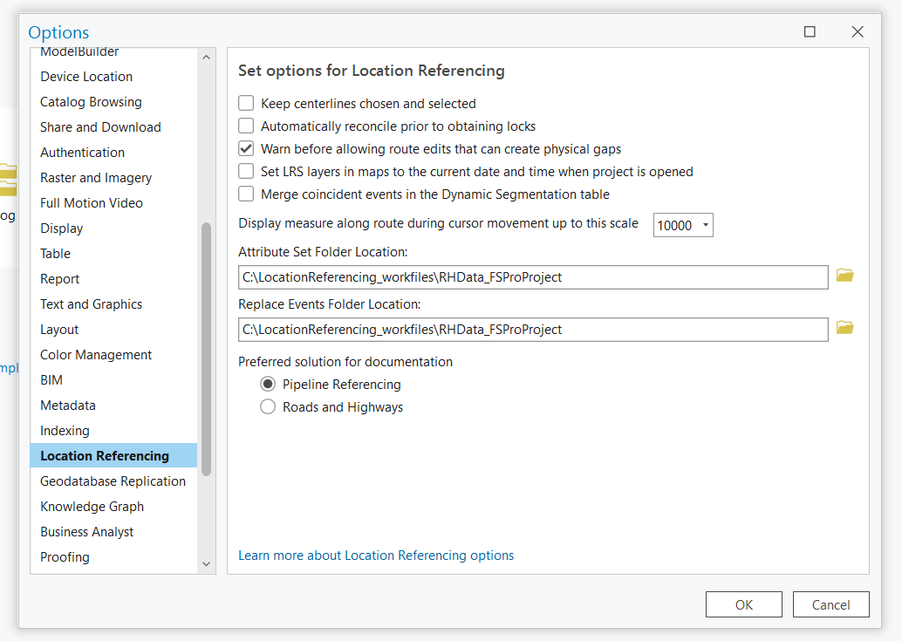

# Portal Projects Test Plan

|   |   |
| --- | --- |
| **Kind** | Test Plan · Pro |
| **Release** | — |
| **Product** | Pipeline Referencing · Utility Network |
| **Source** | [Test.plan.for.Portal.Projects (1).docx](<https://esriis.sharepoint.com/sites/LocationReferencing/Shared%20Documents/General/Test%20Plans/Test.plan.for.Portal.Projects%20(1).docx>) |
| **Edited** | 2024-02-01 00:35 by Lakshmi Ananthanarayanan |
| **Extracted** | 2026-09-04 · lane `xmlstrip` |

<!-- metadata
```yaml
title: "Portal Projects Test Plan"
source_file: "Test.plan.for.Portal.Projects (1).docx"
source_url: "https://esriis.sharepoint.com/sites/LocationReferencing/Shared%20Documents/General/Test%20Plans/Test.plan.for.Portal.Projects%20(1).docx"
doc_id: 432
doc_kind: "Test Plan"
surface: "Pro"
doc_revision: ""
target_release: ""
pe: ""
dev: ""
author: "Lakshmi Ananthanarayanan"
last_edited_by: "Lakshmi Ananthanarayanan"
last_edited: "2024-02-01T00:35:00Z"
extracted: 2026-09-04
extraction_lane: xmlstrip
prompt_version: "v2.0.2"
keywords: ["portal project", "arcgis pro", "project sharing", "sde", "feature service", "conflict prevention", "location referencing"]
tools: []
products: ["Pipeline Referencing", "Utility Network"]
issues: []
related: [{"doc":32,"file":"ai-assistant-reverse-route-test-plan__doc32.md","s":2.302},{"doc":192,"file":"spike-investigate-portal-token-in-experience-builder__doc192.md","s":2.055},{"doc":562,"file":"migrate-attribute-sets-to-map-cim-service-test-plan__doc562.md","s":1.984},{"doc":875,"file":"esri-roads-and-highways-tutorial__doc875.md","s":1.741},{"doc":228,"file":"sql-server-setup-notes__doc228.md","s":1.595}]
```
-->

## Summary

This document outlines a test plan for managing and sharing ArcGIS Pro projects through an ArcGIS Enterprise portal. It covers creating portal projects with different data types, sharing projects with users, handling project access and conflicts, verifying project properties, and testing location referencing workflows and license behavior.

## Related documents

<!-- related:begin -->
- [AI Assistant Reverse Route Test Plan](<https://esriis.sharepoint.com/sites/lrsworkspace/LRS Doc Index/Test Plans/ai-assistant-reverse-route-test-plan__doc32.md>) — similar text 0.08 · same kind/surface/folder <!-- rel:32 -->
- [Spike Investigate Portal Token in Experience Builder](<https://esriis.sharepoint.com/sites/lrsworkspace/LRS%20Doc%20Index/Design%20Spikes/spike-investigate-portal-token-in-experience-builder__doc192.md>) — similar text 0.04 · 1 title word · 1 filename word <!-- rel:192 -->
- [Migrate Attribute Sets to Map CIM/Service – Test Plan](<https://esriis.sharepoint.com/sites/lrsworkspace/LRS Doc Index/Test Plans/migrate-attribute-sets-to-map-cim-service-test-plan__doc562.md>) — similar text 0.16 · same kind/surface/folder <!-- rel:562 -->
- [Esri Roads and Highways Tutorial](<https://esriis.sharepoint.com/sites/lrsworkspace/LRS Doc Index/Other/esri-roads-and-highways-tutorial__doc875.md>) — similar text 0.18 · same surface <!-- rel:875 -->
- [SQL Server Setup Notes](<https://esriis.sharepoint.com/sites/lrsworkspace/LRS Doc Index/Other/sql-server-setup-notes__doc228.md>) — similar text 0.05 <!-- rel:228 -->
<!-- related:end -->

<!-- docs:begin -->
## Esri documentation

[Edit feature services](https://doc.esri.com/en/arcgis-pro/latest/help/production/location-referencing-pipelines/edit-feature-services.html) · [Conflict prevention](https://doc.esri.com/en/arcgis-pro/latest/help/production/location-referencing-pipelines/conflict-prevention.html) · [Set Location Referencing options](https://doc.esri.com/en/arcgis-pro/latest/help/production/location-referencing-pipelines/set-location-referencing-options.html)
<!-- docs:end -->

---

Portal Projects

Reason for having a portal project:
Projects will be in a central secure storage location and control access of the project can be managed through the portal administration.
Advantages of having the project in Portal:

- Pro Projects in Network location
When many people want to work on the same project, if it is stored in a network location it requires.

- Access to be provided to all the users for that location.
- Only the first person who opens the project has the write access for the Pro project and all others must use Save Project As option and later one must collate all changes into one project.
- Access to the project and location is managed in the operating system.
       2. Project Package shared through ArcGIS online or ArcGIS enterprise:
Pro projects can also be shared as project packages in ArcGIS online or ArcGIS Enterprise. However, to use this package this needs to be downloaded and unpacked locally. Then it becomes a local Pro project and again the entire package must be updated in the portal for any changes.
So, storing projects in an ArcGIS Enterprise portal provides a solution that leverages the portal's inherent capabilities to restrict who can access a project and their privileges with respect to that project. It also doesn’t have the same restrictions or problems as storing projects on the network.
Pro Project will be a JSON portal item. It cannot be created by uploading an APRX file in the portal. It should be created and opened in ArcGIS Pro. As you work in a shared project you are not notified in ArcGIS Pro when other people open the same project or save changes to it. 
I am going to create a portal project with multiple users in a VM and it can be accessed across multiple machines by various portal users. Since it is going to be used by many users, the default database that is stored in the project should be a sde. It is recommended to have a default sde with OS authentication as the database. Though the database with DB authentication works it is not recommended since Map layers store username and passwords to access data as part of their layer definition (security risk) and multiple users need to input credentials on their own machines.

TEST PLAN

- Create three Portal Projects (for fgdb, direct connect, FS) and share them with the team.
- Ensure projects contain data to publish, another project with the published FS data and the third one contains UN+APR data.
- Add users to a portal group and share the project in the group.
- Project should be accessible from the portal.
        Verify the projects are accessible from the portal by

    - Same portal user in same machine
    - Different portal user in different machine
    - Different portal users in the same machine.
- Open the project from the portal to the local machine and make changes to the project.  – Example of changes – change the symbology of the feature class, change its order, or remove one or more of the FS layers or add a new map.   – These changes should be saved in the portal project.
    - Perform with different users on different machines. Each person saves their changes to portal project without conflicts if they are using different project items or updating in different timeline.
    - Perform with different users in different machine during the same time working on the same portal item.  The first user should save successfully, and the second person should see a conflict (Refer test case 3.)

LR related workflows - Go to the LR options and make changes to the below options, save the project and access the Portal project in another machine as a different user and ensure the options are honored by not only verifying in the options window but also by doing some LR related edit activities.

Check the location folder connections for Attribute Set and Replace Events location.

- In case of conflicts between the changes in the projects between local and portal, the changes should be listed in the project conflicts dialog box and should allow the user to choose how to handle the conflict – pull from the portal or push changes to the portal or keep the changes local only.
The conflicts related to the portal items will be listed.  (Like the changes in the map or symbology etc.)
If you try to save changes to a portal project while another save is in progress, a message indicates the project is locked and you can't save at the current time will be displayed.

- Open a local project and save as to portal. Delete the local cache. Open the portal project and check everything looks correct.
- Publish UN APR FS data project into the Portal and access it as a different portal user than the publisher and ensure the project looks good.
- Access the Portal project for UNAPR data to publish as a publisher user from a different machine, publish and verify the results are as expected.
- Verify in the GeoProject.Json file (extracted from the aprx file) for Map, for changes in the attribute sets.
- Verify the properties of the project are as expected:

Home folder, default gdb and default toolbox. If any changes are made, they should be saved to the portal project.

- Verify the UN+APR ribbon.  Add to the portal project.  Save it and open the project on a different machine and ensure it shows up and works as expected.
- In the Pro remove the LR license and try to open Portal project and verify what happens.
- Verify if conflict prevention works as expected.
- Overwrite a project in portal.
- Verify how the portal user authentication Vs IWA authentication in portal works using the portal project.

Concerns:
To publish a project in portal to be used by different people across different machines, it is required to provide a default sde.  When we try to save a portal project containing FS data, we do not want the sde from which the data is published as a default sde for the project. To solve this problem, we need to change the default after publishing the portal project or provide a different sde as a default sde.
For multiple users it is recommended to have project home folder in  a shared location so they can be accessed by other machines.
If you want to share with all the people in the ArcGIS enterprise it can be shared by checking the option while creating a portal project by checking the enterprise option and nobody can edit it, only within the group you have shared it are able to edit.

 
