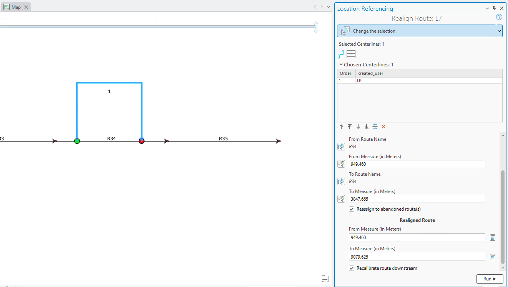
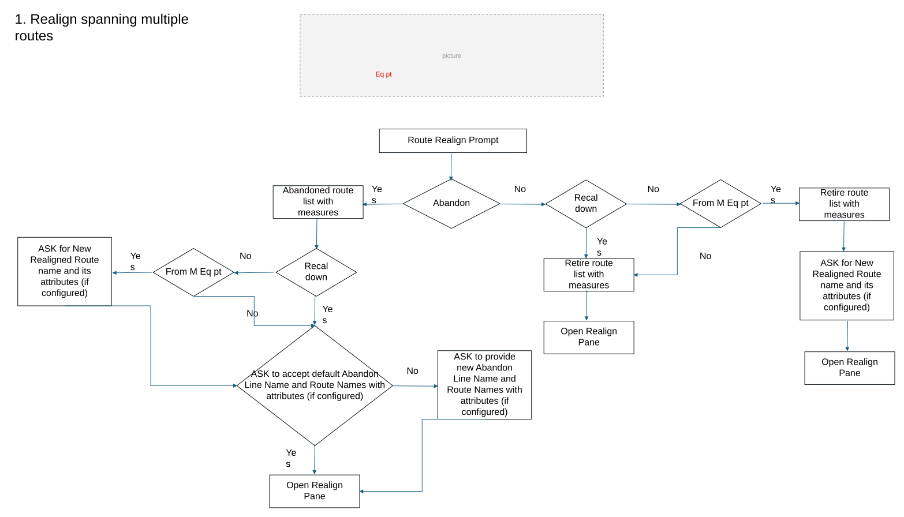
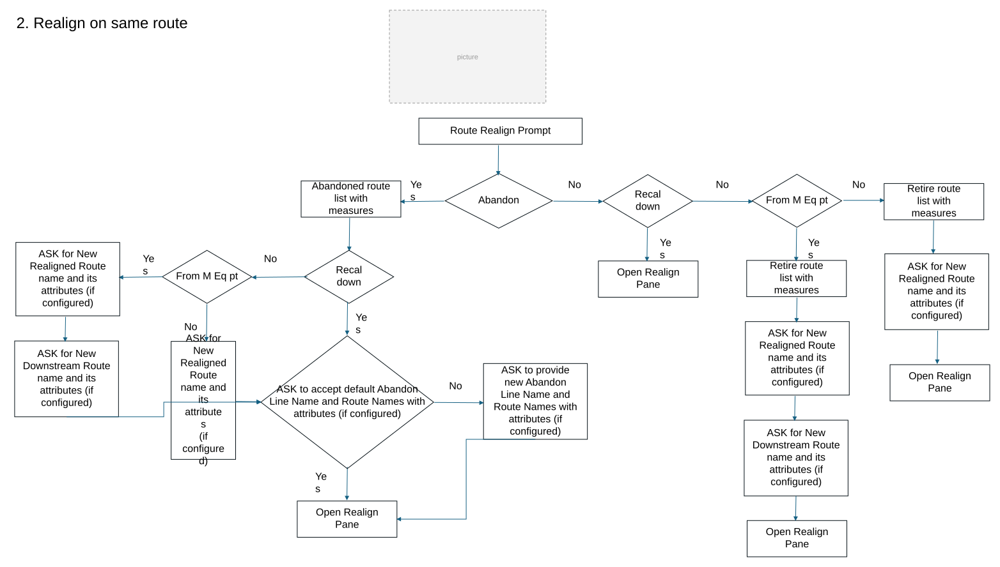
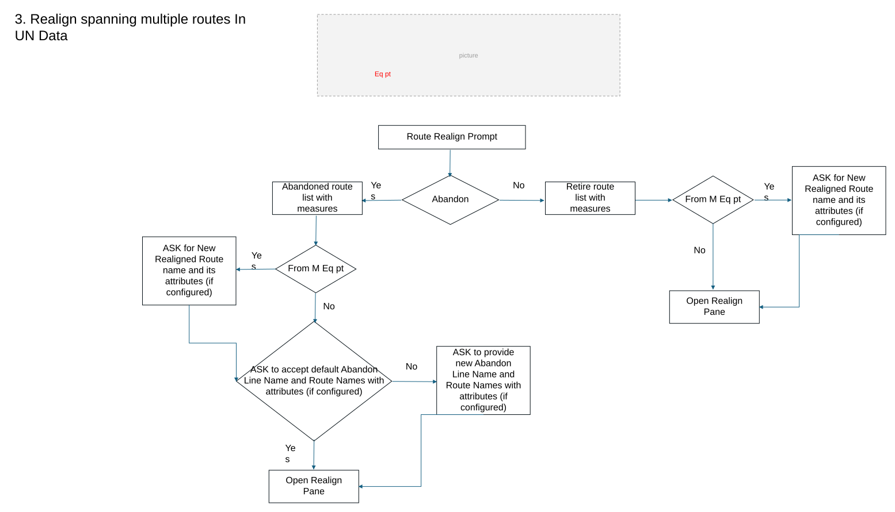
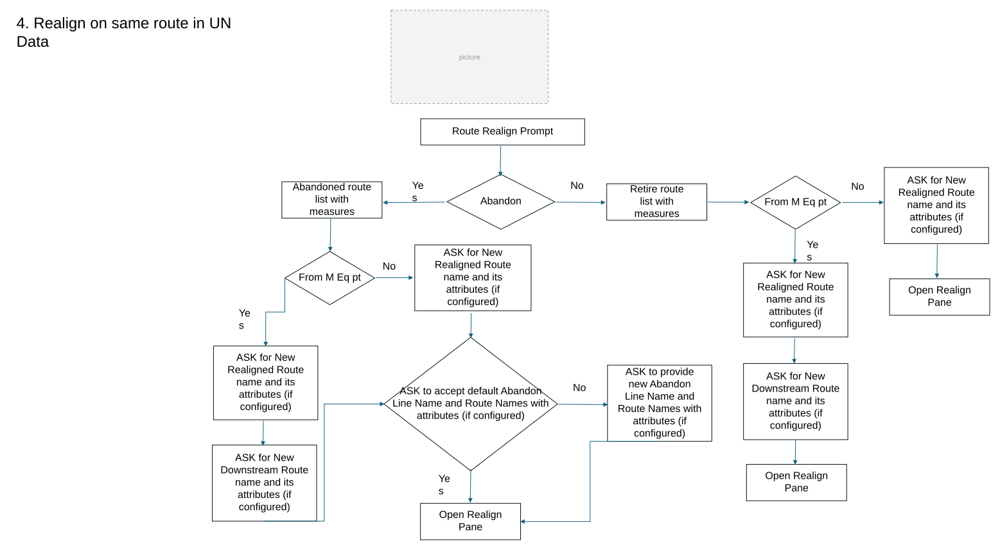

# ArcGIS Pro AI Assistant: Realign Route Subsequent Panes Test Plan

| Field | Value |
| --- | --- |
| **Doc** | 50 · Test Plan · Pro |
| **Product** | Pipeline Referencing · Utility Network |
| **Release** | — |
| **Issues** | — |
| **Source** | [RealignRoute_subsequentpanes_Testplan.pptx](<https://esriis.sharepoint.com/sites/LocationReferencing/Shared%20Documents/General/Test%20Plans/RealignRoute_subsequentpanes_Testplan.pptx>) |
| **People** | author Praveen Kumar · PE — · dev — |
| **Edited** | 2026-03-03 22:42 by Praveen Kumar |
| **Extracted** | 2026-09-04 · lane xmlstrip · format 3.0 · prompt v2.0.2 |
| **Keywords** | realign route · route abandonment · route retirement · line network · engineering network · centerlines · route attributes · measure recalibration |
| **Tools** | Realign Route |

## Summary

Test plan for the Realign Route feature in ArcGIS Pro AI Assistant focusing on line networks. It covers scenarios with APR and UNAPR data, including cases with and without abandonment and equation points. The plan verifies correct population of details in subsequent panes and tests various prompts and expected results for route realignment operations.

## Related documents

<!-- related:begin -->
- [Realign Route AI Assistant Test Plan](<https://esriis.sharepoint.com/sites/lrsworkspace/LRS Doc Index/Test Plans/7067-realign-route-ai-assistant-rh-apr-2026-02.md>) — similar text 0.31 · 3 title words · 2 filename words · same kind/surface/folder <!-- rel:51 s=6.643 -->
- [Realign Route AI Assistant Test Plan](<https://esriis.sharepoint.com/sites/lrsworkspace/LRS Doc Index/Test Plans/7067-realign-route-ai-assistant-rh-apr-v1.md>) — similar text 0.31 · 3 title words · 2 filename words · same kind/surface/folder <!-- rel:80 s=6.355 -->
- [Pro AI Assistant Realign Route](<https://esriis.sharepoint.com/sites/lrsworkspace/LRS%20Doc%20Index/User%20Stories/pro-ai-assistant-realign-route-2025-12-2.md>) — similar text 0.21 · 4 title words · 2 filename words · same surface <!-- rel:102 s=5.997 -->
- [Pro AI Assistant Realign Route User Story](<https://esriis.sharepoint.com/sites/lrsworkspace/LRS%20Doc%20Index/User%20Stories/pro-ai-assistant-realign-route-2025-12.md>) — similar text 0.27 · 4 title words · 2 filename words · same surface <!-- rel:91 s=5.81 -->
- [Reassign Route Subsequent Pane AI Assistant Test Plan](<https://esriis.sharepoint.com/sites/lrsworkspace/LRS%20Doc%20Index/Test%20Plans/7167-reassign-route-subsequent-pane-ai-assistant.md>) — similar text 0.12 · 3 title words · 1 filename word · same kind/surface/folder <!-- rel:11 s=4.9 -->
<!-- related:end -->

<!-- docs:begin -->
## Esri documentation

[Realign routes](https://doc.esri.com/en/arcgis-pro/latest/help/production/location-referencing-pipelines/realign-routes.html) · [Retire routes](https://doc.esri.com/en/arcgis-pro/latest/help/production/location-referencing-pipelines/retire-routes.html) · [Configure continuous measure networks and events to update with an engineering network](https://doc.esri.com/en/arcgis-pro/latest/help/production/location-referencing-pipelines/configure-continuous-measure-networks-and-events-to-update-with-an-engineering-network.html) · [Split a centerline by point](https://doc.esri.com/en/arcgis-pro/latest/help/production/location-referencing-pipelines/split-a-centerline.html)
<!-- docs:end -->

---

## Overview

### Slide 1 — ArcGIS Pro AI Assistant : Realign Route Subsequent panes – Test plan <!-- slide 1 -->

Notes:

- Applicable only to line network
- Test APR, UNAPR data
- Test with line networks with\without abandonment and with\without equation points
- Test with prompts that include all, some, and none of the information needed for the realignment to be completed
- Verify that the details provided in the AI assistant is correctly populated in the subsequent panes of realign route
- Ignore Recalibrate downstream for UN data if its provided in the prompt and always do not recalibrate by default

### Slide 2 <!-- slide 2 -->

## Test Cases

### TC-U01 — Realign spanning multiple routes <!-- src: S2 · slide 3 · case 1 -->

Retire route list with measures
From M Eq pt
Retire route list with measures
ASK for New Realigned Route name and its attributes (if configured)
Abandoned route list with measures
ASK to accept default Abandon
Line Name and Route Names with attributes (if configured)
From M Eq pt
ASK for New Realigned Route name and its attributes (if configured)
ASK to provide new  Abandon
Line Name and Route Names with attributes (if configured)

[figure: Route Realign Prompt · Abandon · No · Open Realign Pane · Yes · Eq pt · Recal down]

[connections: From M Eq pt → Retire route list with measures · ASK to provide new Abandon Line Name and Route … → Open Realign Pane · ASK for New Realigned Route name and its attrib… → ASK to accept default Abandon Line Name and Rou… · From M Eq pt → ASK to accept default Abandon Line Name and Rou…]

### TC-U02 — Realign on same route <!-- src: S2 · slide 4 · case 2 -->

Retire route list with measures
From M Eq pt
Retire route list with measures
ASK for New Realigned Route name and its attributes (if configured)
Abandoned route list with measures
ASK to accept default Abandon
Line Name and Route Names with attributes (if configured)
From M Eq pt
ASK to provide new  Abandon
Line Name and Route Names with attributes (if configured)
ASK for New Realigned Route name and its attributes (if configured)
ASK for New Downstream Route name and its attributes (if configured)
ASK for New Realigned Route name and its attributes (if configured)
ASK for New Realigned Route name and its attributes (if configured)
ASK for New Downstream Route name and its attributes (if configured)

[figure: Route Realign Prompt · Abandon · No · Open Realign Pane · Yes · Recal down]

[connections: ASK to provide new Abandon Line Name and Route … → Open Realign Pane · ASK for New Downstream Route name and its attri… → ASK to accept default Abandon Line Name and Rou…]

### TC-U03 — Realign spanning multiple routes In UN Data <!-- src: S2 · slide 5 · case 3 -->

From M Eq pt
Retire route list with measures
ASK for New Realigned Route name and its attributes (if configured)
Abandoned route list with measures
ASK to accept default Abandon
Line Name and Route Names with attributes (if configured)
From M Eq pt
ASK for New Realigned Route name and its attributes (if configured)
ASK to provide new  Abandon
Line Name and Route Names with attributes (if configured)

[figure: Route Realign Prompt · Abandon · Yes · Eq pt · No · Open Realign Pane]

[connections: ASK to provide new Abandon Line Name and Route … → Open Realign Pane · ASK for New Realigned Route name and its attrib… → Open Realign Pane · ASK for New Realigned Route name and its attrib… → ASK to accept default Abandon Line Name and Rou…]

### TC-U04 — Realign on same route in UN Data <!-- src: S2 · slide 6 · case 4 -->

From M Eq pt
Retire route list with measures
ASK for New Realigned Route name and its attributes (if configured)
Abandoned route list with measures
ASK to accept default Abandon
Line Name and Route Names with attributes (if configured)
From M Eq pt
ASK to provide new  Abandon
Line Name and Route Names with attributes (if configured)
ASK for New Realigned Route name and its attributes (if configured)
ASK for New Downstream Route name and its attributes (if configured)
ASK for New Realigned Route name and its attributes (if configured)
ASK for New Realigned Route name and its attributes (if configured)
ASK for New Downstream Route name and its attributes (if configured)

[figure: Route Realign Prompt · Abandon · Yes · No · Open Realign Pane]

[connections: ASK to provide new Abandon Line Name and Route … → Open Realign Pane · ASK for New Downstream Route name and its attri… → ASK to accept default Abandon Line Name and Rou… · From M Eq pt → ASK for New Realigned Route name and its attrib…]

### TC-U05 — Realign Route (CL selected) (1) <!-- src: S3 · slide 7 · table · 1 -->

- **ID:** 1
- **Expected Result:** List Abandoned routes, ASK to accept default Abandon Line Name and Route Names with attributes (if configured)

### TC-U06 — Realign Route in Engineering Network and do not recalibrate downstream (2) <!-- src: S3 · slide 7 · table · 2 -->

- **ID:** 2
- **Case:** Realign Route in Engineering Network and do not recalibrate downstream (CL selected)
- **Expected Result:** List Abandoned routes,; ASK for New Realigned Route name and its attributes (if configured) ASK to accept default Abandon Line Name and Route Names with attributes (if configured)

### TC-U07 — Realign Route in Engineering Network . The from source measure should be 812.511 (3) <!-- src: S3 · slide 7 · table · 3 -->

- **ID:** 3
- **Case:** Realign Route in Engineering Network . The from source measure should be 812.511 and the source to measure 1898.205 with target from measure of 812.511 and target to measure of 17130.165. Utilize centerlines 2929 valid on 01-01-2010. Do not abandon routes or recalibrate downstream
- **Expected Result:** Open Realign Route pane; Display Success message with details of realignment, retire routes with measures

### TC-U08 — Realign Route in Engineering Network . The from source measure should be 812.511 (4) <!-- src: S3 · slide 7 · table · 4 -->

- **ID:** 4
- **Case:** Realign Route in Engineering Network . The from source measure should be 812.511 and the source to measure 1898.205 with target from measure of 851 and target to measure of 17130.165. Utilize centerlines 2929 valid on 01-01-2010. Do not abandon routes or recalibrate downstream
- **Expected Result:** List Retire routes,; ASK for New Realigned Route name and its attributes (if configured)

### TC-U09 — Realign Route in Engineering Network with default line and route names (5) <!-- src: S3 · slide 7 · table · 5 -->

- **ID:** 5
- **Case:** Realign Route in Engineering Network with default line and route names for abandonment
- **Expected Result:** Open Realign Route pane; Display Success message with details of realignment, abandon routes with measures and attributes if any

### TC-U10 — Realign Route in Engineering Network . The from source measure should be 812.511 (6) <!-- src: S3 · slide 7 · table · 6 -->

- **ID:** 6
- **Case:** Realign Route in Engineering Network . The from source measure should be 812.511 and the source to measure 1898.205 with target from measure of 812.511 and target to measure of 17130.165. Utilize centerlines 2929 valid on 01-01-2010. use ‘L12_Abandon’ as abandoned line name and use ‘R57_Abandon’ , ‘R58_Abandon’, ‘R59_Abandon’ for abandoned route names.
- **Expected Result:** Open Realign Route pane; Display Success message with details of realignment, abandon routes with measures and attributes if any

### TC-U11 — Realign Route in Engineering Network . The from source measure should be 812.511 (7) <!-- src: S3 · slide 7 · table · 7 -->

- **ID:** 7
- **Case:** Realign Route in Engineering Network . The from source measure should be 812.511 and the source to measure 1898.205 with target from measure of 851 and target to measure of 17130.165. Utilize centerlines 2929 valid on 01-01-2010. Do not abandon routes or recalibrate downstream, use ‘NewRouteR100’ for New Realigned Route name
- **Expected Result:** Open Realign Route pane; Display Success message with details of realignment, retire routes with measures, New realigned route name and measures

### TC-U12 — Using the Engineering Network, reorient a route <!-- src: S3 · slide 7 · table · 8 -->

- **ID:** 8
- **Case:** Using the Engineering Network, reorient a route (R56 to R59) starting at measure 812.511 and the source to measure 1898.205 with target from measure of 851 and target to measure of 17130.165. Utilize centerlines 2929 valid on 01-01-2010. Reassign source routes to abandoned routes and do not recalibrate downstream.
- **Expected Result:** List Abandoned routes, ASK to accept default Abandon Line Name and Route Names with attributes (if configured)

### TC-U13 — Process a route realignment request: Route R56 to R59 (9) <!-- src: S3 · slide 7 · table · 9 -->

- **ID:** 9
- **Case:** Process a route realignment request: Route R56 to R59, source measure interval [812.511, 1898.205]. Source centerline features: OID 2929. Target measure interval [812.511, 17130.165]. Network: Engineering Network. Effective date: 2010-01-01. Reassign to abandoned route: Yes. Recalibrate downstream: Yes
- **Expected Result:** List Abandoned routes, ASK to accept default Abandon Line Name and Route Names with attributes (if configured)

### TC-U14 — Process a route realignment request: Route R56 to R59 (10) <!-- src: S3 · slide 7 · table · 10 -->

- **ID:** 10
- **Case:** Process a route realignment request: Route R56 to R59, source measure interval [812.511, 1898.205]. Source centerline features: OID 2929. Target measure interval [800, 17130.165]. Network: Engineering Network. Effective date: 2010-01-01. Reassign to abandoned route: Yes. Recalibrate downstream: No
- **Expected Result:** List Abandoned routes,; ASK for New Realigned Route name and its attributes (if configured); ASK to accept default Abandon Line Name and Route Names with attributes (if configured)

### TC-U15 — Realign Route in Engineering Network using centerline with object id 2929 <!-- src: S3 · slide 7 · table · 11 -->

- **ID:** 11
- **Case:** Realign Route in Engineering Network using centerline with object id 2929, do not recalibrate downstream
- **Expected Result:** List Abandoned routes, ASK to accept default Abandon Line Name and Route Names with attributes (if configured)

### TC-U16 — Realign Route (CL selected) (1) <!-- src: S3 · slide 8 · table · 1 -->

- **ID:** 1
- **Expected Result:** List Abandoned routes, ASK to accept default Abandon Line Name and Route Names with attributes (if configured)

### TC-U17 — Realign Route in Engineering Network and do not recalibrate downstream (2) <!-- src: S3 · slide 8 · table · 2 -->

- **ID:** 2
- **Case:** Realign Route in Engineering Network and do not recalibrate downstream (CL selected)
- **Expected Result:** List Abandoned routes,; ASK for New Realigned Route name and its attributes (if configured) ASK to accept default Abandon Line Name and Route Names with attributes (if configured)

### TC-U18 — Realign Route in Engineering Network and do not abandon (CL selected) <!-- src: S3 · slide 8 · table · 3 -->

- **ID:** 3
- **Expected Result:** Open Realign Route pane; Display Success message with details of realignment

### TC-U19 — Realign Route in Engineering Network . The from source measure should be 949.46 (4) <!-- src: S3 · slide 8 · table · 4 -->

- **ID:** 4
- **Case:** Realign Route in Engineering Network . The from source measure should be 949.46 and the source to measure 3847.665 with target from measure of 949.46 and target to measure of 9079.625. Utilize centerlines 2902 valid on 01-01-2010. Do not abandon routes or recalibrate downstream
- **Expected Result:** List Retire routes,; ASK for New Realigned Route name and its attributes (if configured)

### TC-U20 — Realign Route in Engineering Network . The from source measure should be 949.46 (5) <!-- src: S3 · slide 8 · table · 5 -->

- **ID:** 5
- **Case:** Realign Route in Engineering Network . The from source measure should be 949.46 and the source to measure 3847.665 with target from measure of 950 and target to measure of 9079.625. Utilize centerlines 2902 valid on 01-01-2010. Do not abandon routes or recalibrate downstream
- **Expected Result:** List Retire routes,; ASK for New Realigned Route name and its attributes (if configured); ASK for New Downstream Route name and its attributes (if configured)

### TC-U21 — Realign Route in Engineering Network with default line and route names (6) <!-- src: S3 · slide 8 · table · 6 -->

- **ID:** 6
- **Case:** Realign Route in Engineering Network with default line and route names for abandonment (CL selected)
- **Expected Result:** Open Realign Route pane; Display Success message with details of realignment, abandon routes with measures and attributes if any

### TC-U22 — Realign Route in Engineering Network . The from source measure should be 949.46 (7) <!-- src: S3 · slide 8 · table · 7 -->

- **ID:** 7
- **Case:** Realign Route in Engineering Network . The from source measure should be 949.46 and the source to measure 3847.665 with target from measure of 949.46 and target to measure of 9079.625. Utilize centerlines 2902 valid on 01-01-2010. use ‘L7_Abandon’ as abandoned line name and use ‘R34_Abandon for abandoned route name.
- **Expected Result:** Open Realign Route pane; Display Success message with details of realignment, abandon routes with measures and attributes if any

### TC-U23 — Realign Route in Engineering Network . The from source measure should be 949.46 (8) <!-- src: S3 · slide 8 · table · 8 -->

- **ID:** 8
- **Case:** Realign Route in Engineering Network . The from source measure should be 949.46 and the source to measure 3847.665 with target from measure of 949.46 and target to measure of 9079.625. Utilize centerlines 2902 valid on 01-01-2010. use ‘L7_Abandon’ as abandoned line name and use ‘R34_Abandon for abandoned route name, do not recalibrate and use ‘NewRouteR1000’ for New Realigned Route name
- **Expected Result:** Open Realign Route pane; Display Success message with details of realignment, abandon routes with measures and attributes if any

### TC-U24 — Process a route realignment request: Route R34, source measure interval [949.46 <!-- src: S3 · slide 8 · table · 9 -->

- **ID:** 9
- **Case:** Process a route realignment request: Route R34, source measure interval [949.46, 3847.665]. Source centerline features: OID 2902. Target measure interval [951, 9079.625]. Network: Engineering Network. Effective date: 2010-01-01. Reassign to abandoned route: Yes. Recalibrate downstream: No
- **Expected Result:** List Abandoned routes,; ASK for New Realigned Route name and its attributes (if configured); ASK for New Downstream Route name and its attributes (if configured); ASK to accept default Abandon Line Name and Route Names with attributes (if configured)

### TC-U25 — Realign Route in Engineering Network using centerline with object id 2902 <!-- src: S3 · slide 8 · table · 10 -->

- **ID:** 10
- **Case:** Realign Route in Engineering Network using centerline with object id 2902, do not recalibrate downstream
- **Expected Result:** List Abandoned routes,; ASK for New Realigned Route name and its attributes (if configured) ASK to accept default Abandon Line Name and Route Names with attributes (if configured)

### TC-U26 — Realign Route in Engineering Network . The from source measure should be 949.46 (11) <!-- src: S3 · slide 8 · table · 11 -->

- **ID:** 11
- **Case:** Realign Route in Engineering Network . The from source measure should be 949.46 and the source to measure 3847.665 with target from measure of 999 and target to measure of 9079.625. Utilize centerlines 2902 valid on 01-01-2010. use ‘L7_Abandon’ as abandoned line name and use ‘R34_Abandon for abandoned route name, do not recalibrate and use ‘NewRouteR1000’ for New Realigned Route name, use ‘NewdownstreamR1000’ for new downstream route name
- **Expected Result:** Open Realign Route pane; Display Success message with details of realignment, abandon routes with measures and attributes and details of new realign and downstream routes
