# Realign Route AI Assistant Test Plan

|   |   |
| --- | --- |
| **Kind** | Test Plan · Pro |
| **Release** | — |
| **Product** | Roads & Highways · Pipeline Referencing |
| **Issue** | [ArcGISPro/ps-location-referencing#7067](https://devtopia.esri.com/ArcGISPro/ps-location-referencing/issues/7067) |
| **Source** | [7067-RealignRouteAIAssistant_TestPlanV1.pptx](<https://esriis.sharepoint.com/sites/LocationReferencing/Shared%20Documents/General/Test%20Plans/7067-RealignRouteAIAssistant_TestPlanV1.pptx>) |
| **Edited** | 2026-01-23 22:42 by Mac Christmas |
| **Extracted** | 2026-09-04 · lane `xmlstrip` |

<!-- metadata
```yaml
title: "Realign Route AI Assistant Test Plan"
source_file: "7067-RealignRouteAIAssistant_TestPlanV1.pptx"
source_url: "https://esriis.sharepoint.com/sites/LocationReferencing/Shared%20Documents/General/Test%20Plans/7067-RealignRouteAIAssistant_TestPlanV1.pptx"
doc_id: 80
doc_kind: "Test Plan"
surface: "Pro"
doc_revision: "V1"
target_release: ""
pe: ""
dev: ""
author: "Rahul Rakshit"
last_edited_by: "Mac Christmas"
last_edited: "2026-01-23T22:42:20Z"
extracted: 2026-09-04
extraction_lane: xmlstrip
prompt_version: "v2.0.2"
keywords: ["realign route", "route realignment", "centerlines", "line network", "multifield network", "recalibrate downstream", "route abandonment", "input validation", "ai assistant"]
tools: ["Realign Route"]
products: ["Roads & Highways", "Pipeline Referencing"]
issues: ["ArcGISPro/ps-location-referencing#7067"]
related: [{"doc":51,"file":"realign-route-ai-assistant-test-plan__doc51.md","s":1010.602},{"doc":59,"file":"iteration-planning-and-issue-tracking-for-esri-lrs-development__doc59.md","s":1001.505},{"doc":50,"file":"arcgis-pro-ai-assistant-realign-route-subsequent-panes-test-plan__doc50.md","s":6.355},{"doc":86,"file":"create-route-in-line-network-and-multifield-network-with-additional-attributes__doc86.md","s":5.683},{"doc":18,"file":"extend-route-ai-assistant-test-plan__doc18.md","s":5.572}]
```
-->

## Summary

Test plan for the Realign Route AI Assistant feature focusing on route realignment workflows using centerlines and networks in line and multifield LRS networks. Covers input validation, auto-population of parameters, handling of complex route types, recalibration, reassignment to abandoned routes, and error handling scenarios. Includes tests for projected and unprojected data, 3D support, and various network configurations.

## Related documents

<!-- related:begin -->
- [Realign Route AI Assistant Test Plan](<https://esriis.sharepoint.com/sites/lrsworkspace/LRS Doc Index/Test Plans/realign-route-ai-assistant-test-plan__doc51.md>) — shared issue ArcGISPro/ps-location-referencing#7067 · similar text 0.81 · 3 title words · 3 filename words · same kind/surface/folder <!-- rel:51 -->
- [Iteration Planning and Issue Tracking for Esri LRS Development](<https://esriis.sharepoint.com/sites/lrsworkspace/LRS Doc Index/Schedules/iteration-planning-and-issue-tracking-for-esri-lrs-development__doc59.md>) — shared issue ArcGISPro/ps-location-referencing#7067 · similar text 0.07 · same surface <!-- rel:59 -->
- [ArcGIS Pro AI Assistant: Realign Route Subsequent Panes Test Plan](<https://esriis.sharepoint.com/sites/lrsworkspace/LRS Doc Index/Test Plans/arcgis-pro-ai-assistant-realign-route-subsequent-panes-test-plan__doc50.md>) — similar text 0.31 · 3 title words · 2 filename words · same kind/surface/folder <!-- rel:50 -->
- [Create Route in Line Network and Multifield Network with Additional Attributes Pro AI Assistant Test Plan](<https://esriis.sharepoint.com/sites/lrsworkspace/LRS Doc Index/Test Plans/create-route-in-line-network-and-multifield-network-with-additional-attributes__doc86.md>) — similar text 0.52 · 2 title words · 1 filename word · same kind/surface/folder <!-- rel:86 -->
- [Extend Route AI Assistant Test Plan](<https://esriis.sharepoint.com/sites/lrsworkspace/LRS Doc Index/Test Plans/extend-route-ai-assistant-test-plan__doc18.md>) — similar text 0.59 · 2 title words · same kind/surface/folder <!-- rel:18 -->
<!-- related:end -->

<!-- docs:begin -->
## Esri documentation

[Realign routes](https://doc.esri.com/en/arcgis-pro/latest/help/production/roads-highways/realign-routes.html)
<!-- docs:end -->

---

## Slide 1

Realign Route AI Assistant
(Excluding Subsequent Panes)
Devtopia Issue

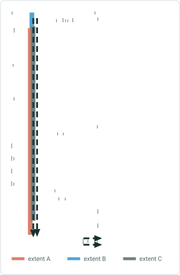

| Notes |
| --- |
| Subsequent realignment panes will be covered in separate user story Test only in feature services Test with RH, APR, and PoM data Projected and unprojected data with 3D Use multiple centerlines to realign a route Test with spelling mistakes Gapped and multiple gapped route realignment Complex routes such as lollipops, loops, alpha, branch, infinity with all the variations using multiple centerlines and gaps Centerlines that are not always in the same direction Test within local scene Verify that the Realign Route form only opens when no error exists in the input parameters Verify relevant info auto-populates when centerlines are touching/partially touching input route(s) Recalibrate downstream and Reassign to abandoned route(s) options are enabled by default. These options will only be disabled when the user specifies I18n/L10n + A11y |

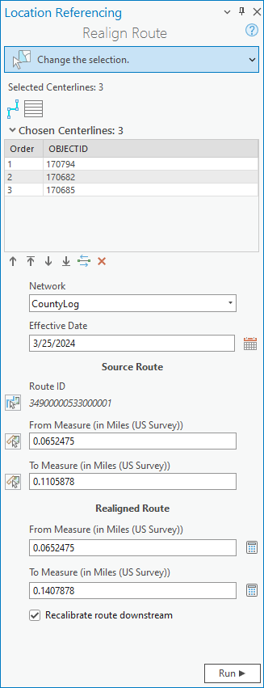 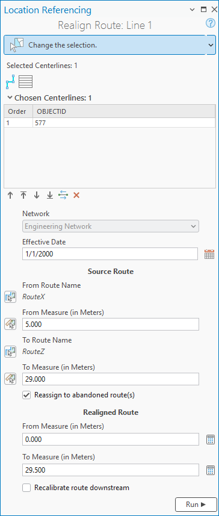

## Slide 2

Nonline Network:
Centerlines
Network
Effective Date
Source RouteID*
Source From Measure*
Source To Measure*
Target From Measure*
Target To Measure*
Recalibrate Downstream option

- Values will be auto-populated based on input centerlines only if the centerlines can get suggested info (must be touching the route)
Line Network:
Centerlines
Network
Effective Date
Source From RouteName*
Source From Measure*
Source To RouteName*
Source To Measure*
Route abandonment option
Target From Measure*
Target To Measure*
Recalibrate Downstream option

To Provide in Prompt:

## Slide 3


Workflow


## Slide 4

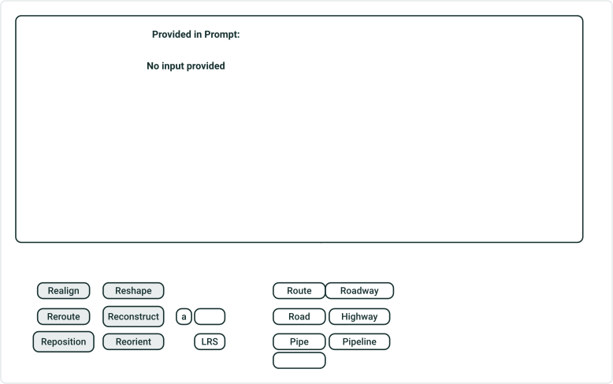

AI Assistant should ask for:

Centerlines, Network, Source Route(s), Source Measures

(input centerlines do not touch route)

## Slide 5


AI Assistant should ask for:

Centerlines, Network

(input centerlines touch route)

## Slide 6

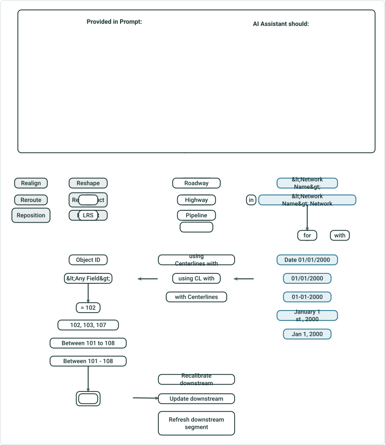

Centerlines, Network, Effective Date
<Network Name> Network
Populate and open the Realign Route form

(input centerlines touch route and will auto-populate source/target parameters)

Can we ask AI to use suggested info without having to be prompted?

From Sharon:
Yes, will only prompt if chosen centerlines cannot give suggested info
January 1st, 2000
Between 101 to 108
Between 101 - 108

Refresh downstream segment
Test also with line networks

## Slide 7

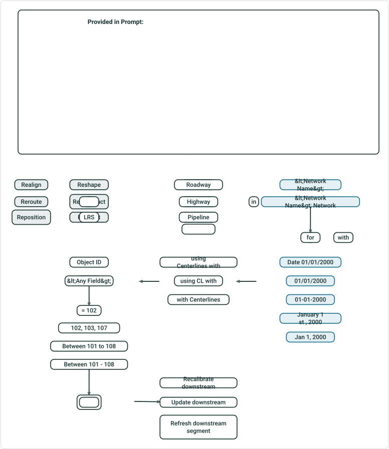

Centerlines, Network, Effective Date
AI Assistant should ask for:
<Network Name> Network
Source Route, Source From/To Measures

(input centerlines do not touch route or overlapping routes occur at touch points)

January 1st, 2000
Between 101 to 108
Between 101 - 108

Refresh downstream segment
Test also with line networks

## Slide 8


Centerlines, Network, Effective Date
AI Assistant should ask for:
<Network Name> Network
Source To Route, Source To Measure

(input centerlines touch only at from location)

January 1st, 2000
Between 101 to 108
Between 101 - 108

Refresh downstream segment
Test also with line networks

## Slide 9


Centerlines, Network, Effective Date
AI Assistant should ask for:
<Network Name> Network
Source From Route, Source From Measure

(input centerlines touch only at to location)

January 1st, 2000
Between 101 to 108
Between 101 - 108

Refresh downstream segment
Test also with line networks

## Slide 10

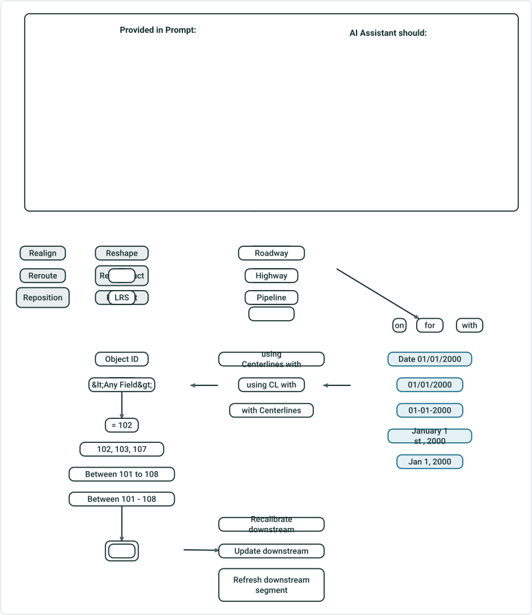

Centerlines, Effective Date
Prompt for Network*
(input centerlines touch route and will auto-populate source/target parameters)

- Test with only one network in map also, network will auto-populate

January 1st, 2000
Between 101 to 108
Between 101 - 108

Refresh downstream segment

## Slide 11

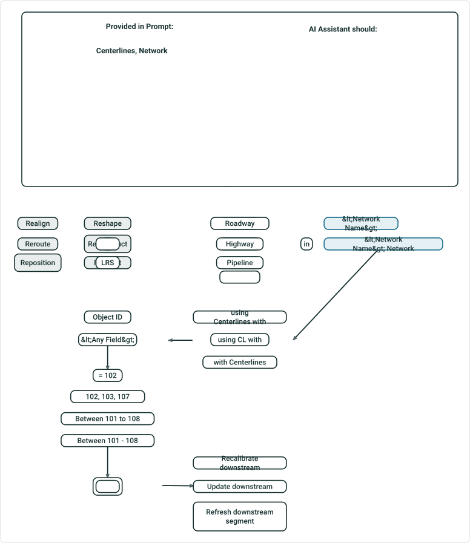

<Network Name> Network
Open Realign Route with today’s date as the effective date

(input centerlines touch route and will auto-populate source/target parameters)

Between 101 to 108
Between 101 - 108

Refresh downstream segment
Test also with line networks

## Slide 12

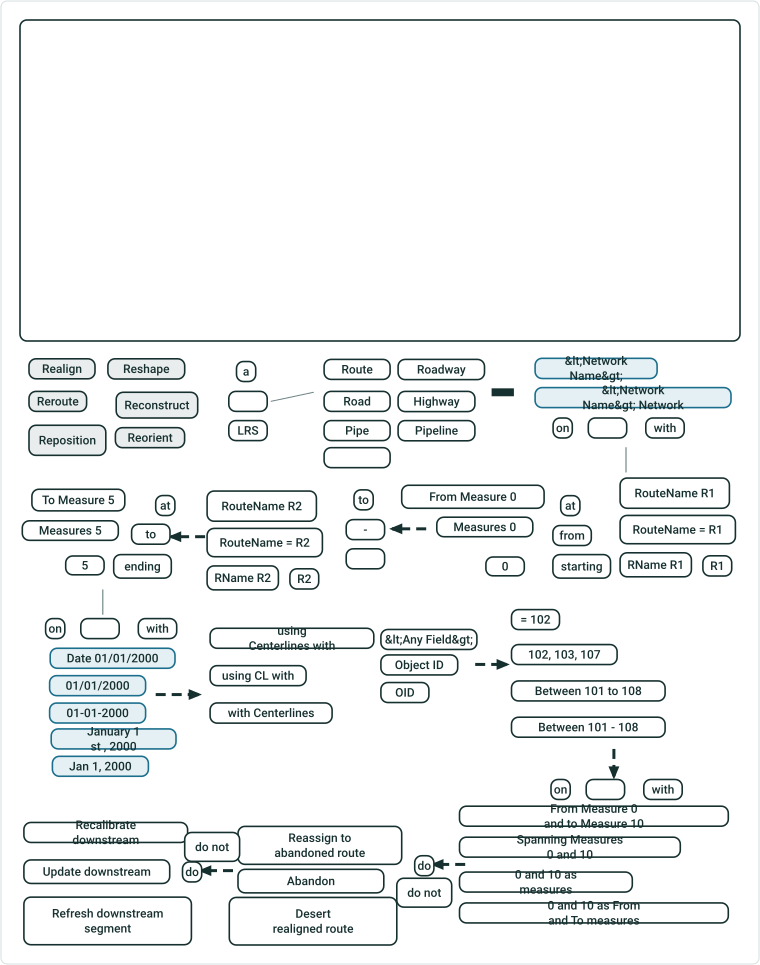

Centerlines, Network*, Effective Date, Source From RouteName, Source From Measure, Source To RouteName, Source To Measure, Route abandonment, Target From Measure, Target To Measure, Recalibrate downstream option
Populate and open the Realign Route form

(input centerlines touch the route, but user has provided specific source/target measure values)

Test also with non-touching centerlines

January 1st, 2000
Between 101 to 108
Between 101 - 108
Refresh downstream segment
<Network Name> Network

Reassign to abandoned route

From Measure 0 and to Measure 10
Spanning Measures 0  and 10
0 and 10 as measures
0 and 10 as From and To measures

## Slide 13

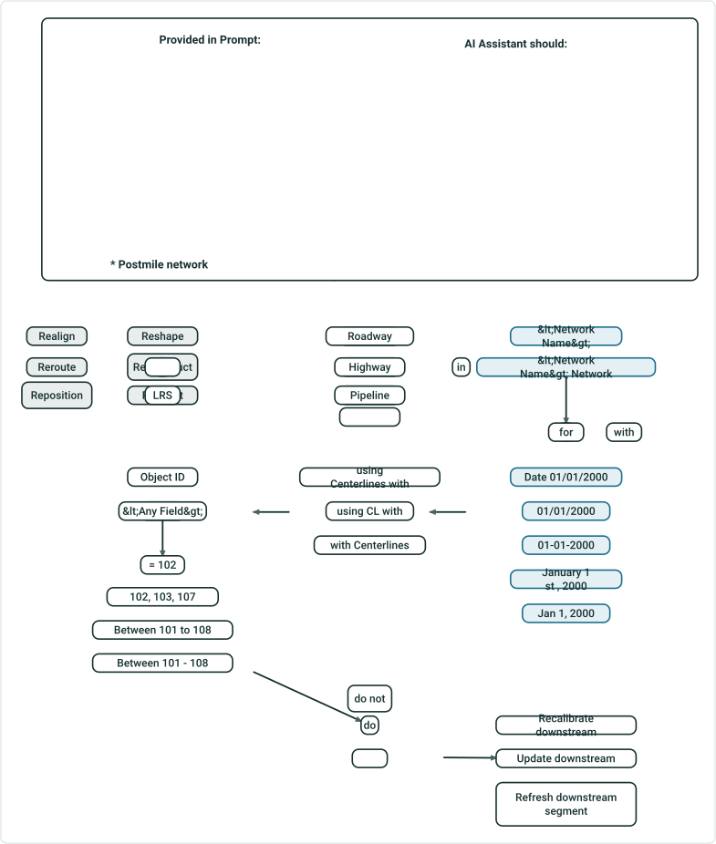

Centerlines, Network*, Effective Date
<Network Name> Network
Prompt for realigned route’s multi-field RouteID

(input centerlines touch route and will auto-populate source/target parameters)

January 1st, 2000
Between 101 to 108
Between 101 - 108

Refresh downstream segment

## Slide 14

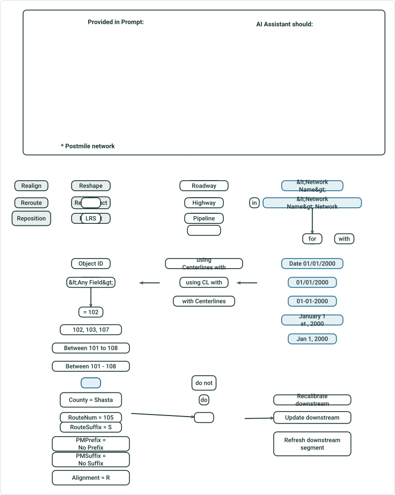

Centerlines, Network*, Effective Date, Realigned Route Multi-field RouteID
<Network Name> Network
Populate and open Realign Route form

(input centerlines touch route and will auto-populate source/target parameters)

January 1st, 2000
Between 101 to 108
Between 101 - 108

Refresh downstream segment

PMPrefix = No Prefix

PMSuffix = No Suffix

## Slide 15


Centerlines, Network*, Effective Date, Partial Realigned Route RouteID
<Network Name> Network
Prompt for missing Realigned Route RouteID attributes
(input centerlines touch route and will auto-populate source/target parameters)

January 1st, 2000
Between 101 to 108
Between 101 - 108

Refresh downstream segment

PMSuffix = No Suffix

## Slide 16

AI Assistant should
Populate and open the Realign Route form
Centerlines, Network, Effective Date, Source RouteID*, Source From Measure*, Source To Measure*, Target From Measure*, Target To Measure*, Route abandonment option, Recalibrate downstream option

- Will be auto-populated unless otherwise specified or centerlines do not touch route

## Slide 17

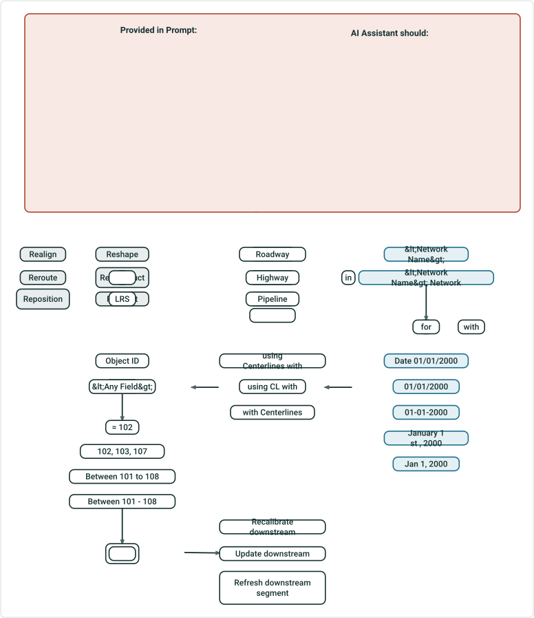

Centerlines, Network, Effective Date, Recalibrate downstream option, but LR license is not available

<Network Name> Network
Not show any info

January 1st, 2000
Between 101 to 108
Between 101 - 108

Refresh downstream segment

## Slide 18

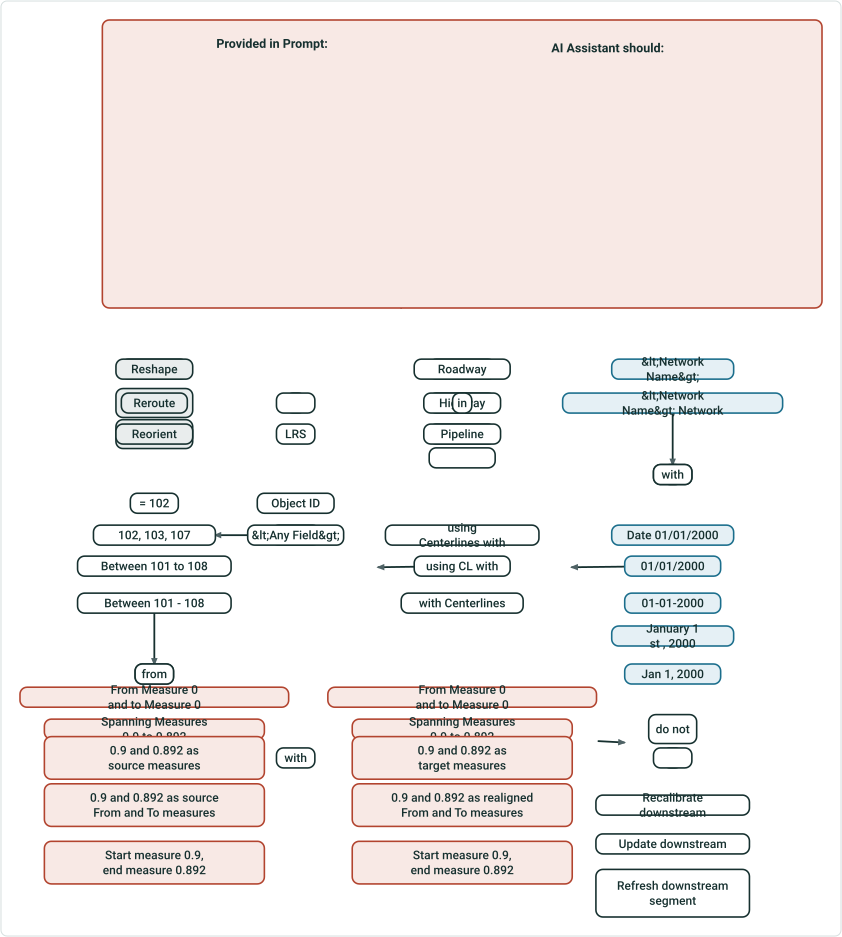

Centerlines, Network, Effective Date, Recalibrate downstream option, but provided Source/Target From Measure => Source/Target To Measure

<Network Name> Network
Inform user about the issue with the measures and ask them to provide valid measures

January 1st, 2000
Between 101 to 108
Between 101 - 108

Refresh downstream segment
From Measure 0 and to Measure 0
Spanning Measures 0.9 to 0.892
0.9 and 0.892 as source measures
0.9 and 0.892 as source From and To measures
From Measure 0 and to Measure 0
Spanning Measures 0.9 to 0.892
0.9 and 0.892 as target measures
0.9 and 0.892 as realigned From and To measures

Start measure 0.9, end measure 0.892
Start measure 0.9, end measure 0.892

## Slide 19

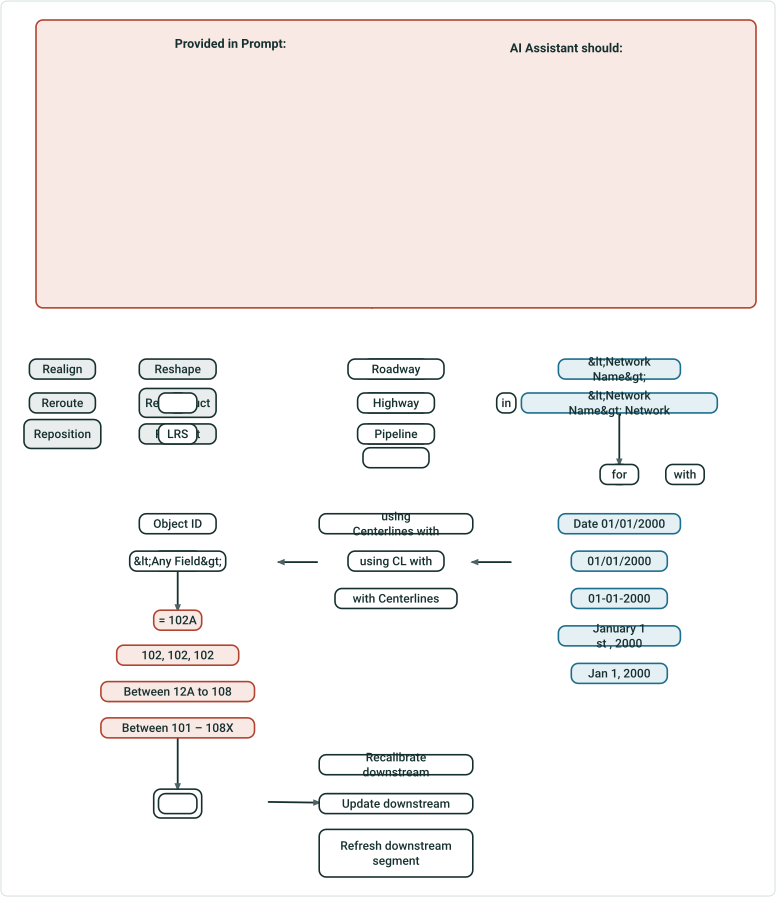

Centerlines, Network, Effective Date, Recalibrate downstream option, but provided centerlines are invalid/duplicates/do not exist/cause non-monotonic route

<Network Name> Network
Inform the user about the issue with the input centerlines and ask them to provide valid centerlines

January 1st, 2000
Between 12A to 108
Between 101 – 108X

Refresh downstream segment

## Slide 20

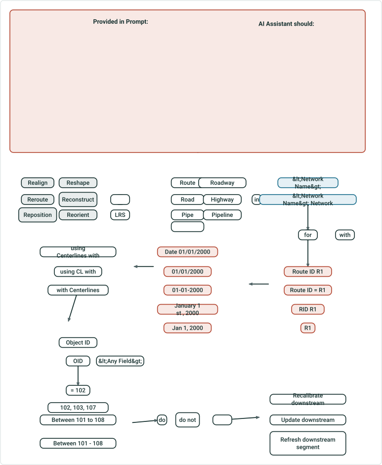

Centerlines, Network, Effective Date, Recalibrate downstream option, but input route does not exist for given effective date/does not exist

<Network Name> Network
Inform the user that the chosen route is not valid and ask them to provide a different route

January 1st, 2000
Between 101 to 108
Between 101 - 108

Refresh downstream segment
Route ID = R1

## Slide 21

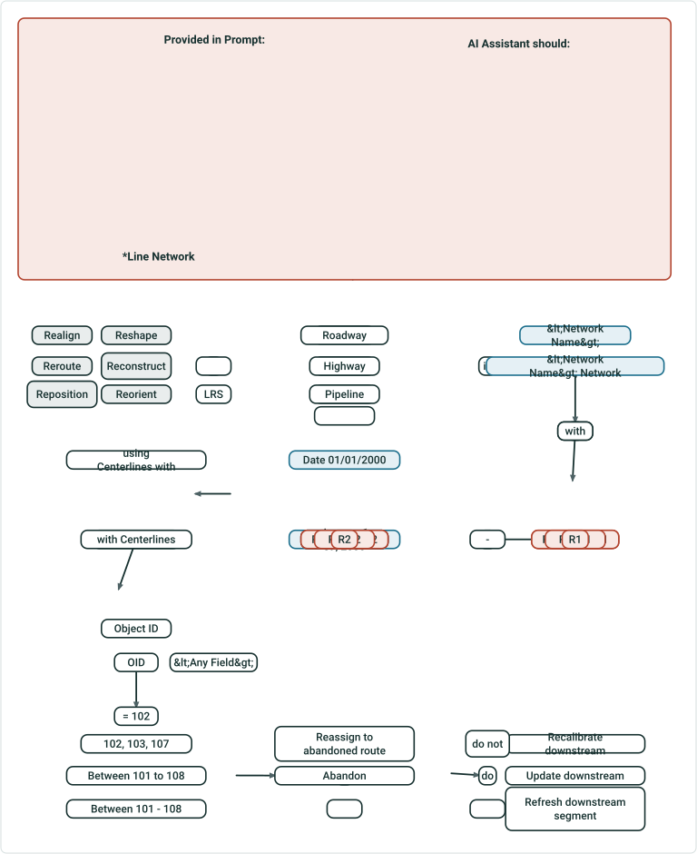

Centerlines, Network*, Effective Date, Recalibrate downstream option, but routes do not belong to the same line/time slice/network

<Network Name> Network
Inform the user that the chosen routes are not valid and ask them to provide  different routes

January 1st, 2000
Between 101 to 108
Between 101 - 108

Refresh downstream segment
Route ID = R1
Route ID = R2
Reassign to abandoned route

## Slide 22

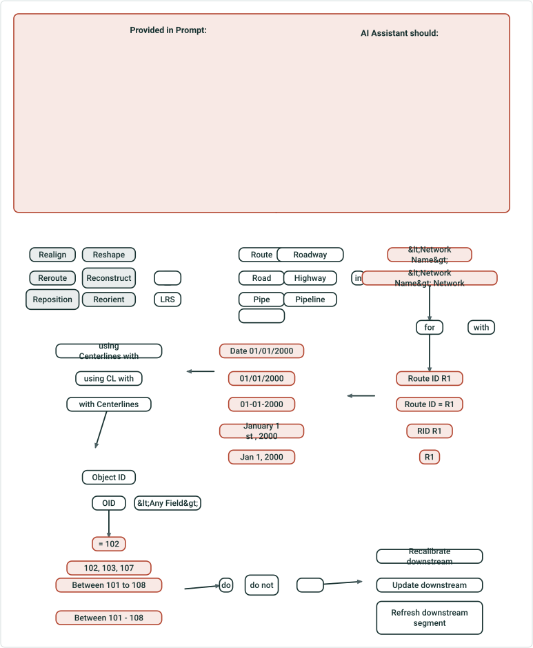

Centerlines, Network, Effective Date, Recalibrate downstream option, but inputs have multiple issues

<Network Name> Network
List the issues that are causing errors one at a time

January 1st, 2000
Between 101 to 108
Between 101 - 108

Refresh downstream segment
Route ID = R1

## Slide 23


Centerlines, Network, Effective Date, Recalibrate downstream option, but LRS Network and centerline layers are not in the map

<Network Name> Network
Ask the user to add the Network and Centerline feature classes to map

January 1st, 2000
Between 101 to 108
Between 101 - 108

Refresh downstream segment

## Slide 24

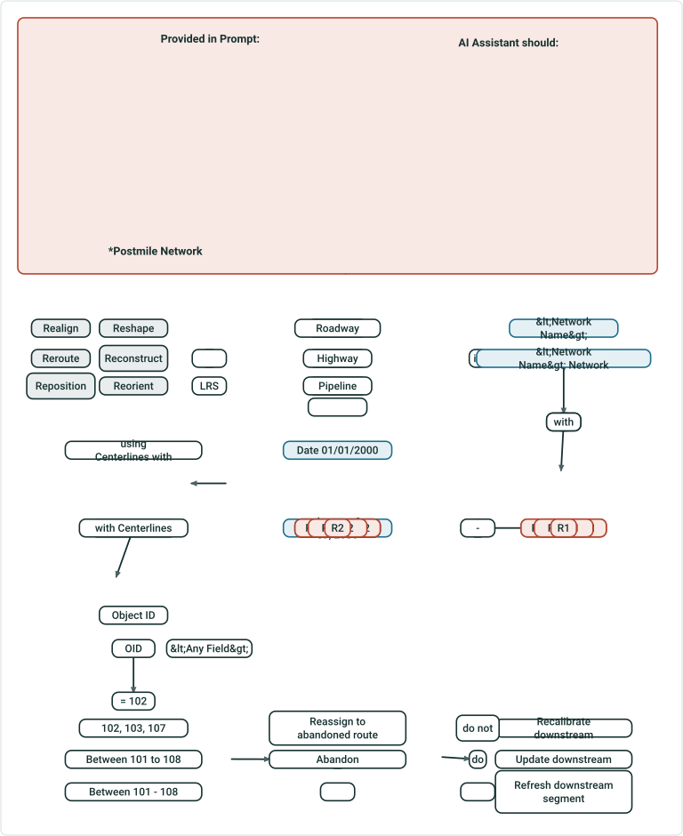

Centerlines, Network*, Effective Date, Recalibrate downstream option, but centerlines touch more than one route

<Network Name> Network
Inform the user that the chosen routes are not valid and ask them to provide  different routes

January 1st, 2000
Between 101 to 108
Between 101 - 108

Refresh downstream segment
Route ID = R1
Route ID = R2
Reassign to abandoned route

## Slide 25

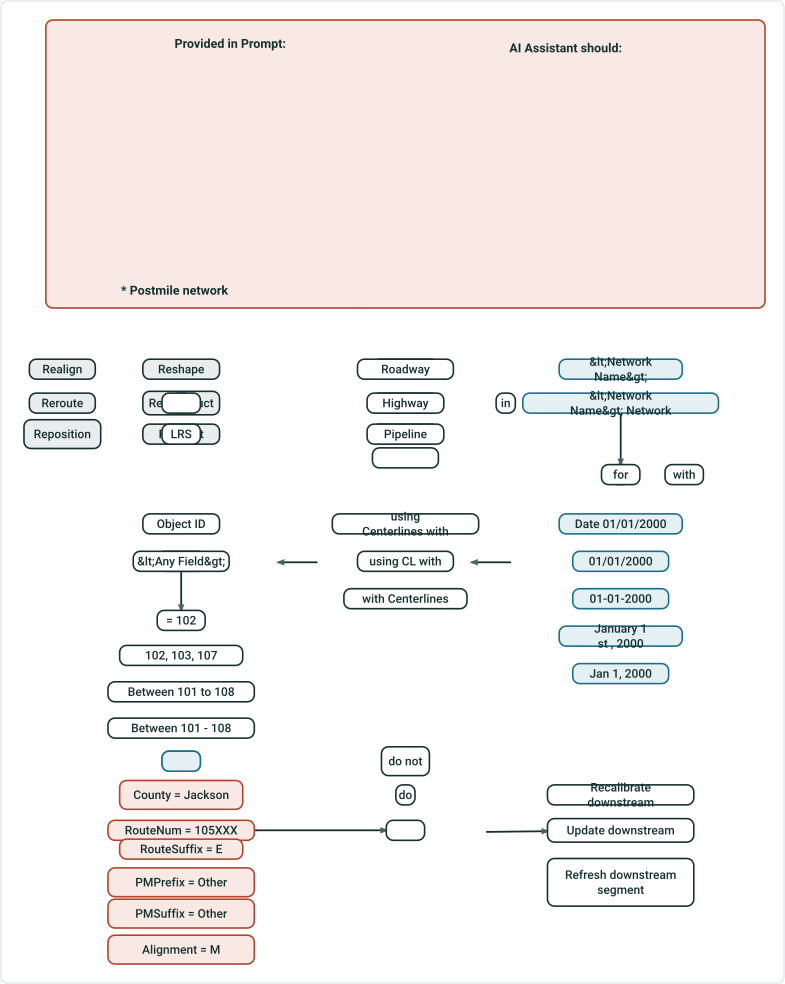

Centerlines, Network, Effective Date, invalid Realigned Route Multi-field RouteID
<Network Name> Network
Inform of invalid RouteID values and ask for valid values

January 1st, 2000
Between 101 to 108
Between 101 - 108

Refresh downstream segment

## Slide 26

- How do I access and activate Realign Route in the line network of pipeline Referencing?
- What are the prerequisite steps before realigning a route in a line network?
- What are the prerequisite steps before realigning a route in a multifield network ?
- What is a line network?
- What is a multi field network?
- Walk me through the full workflow of realigning a route using the LRS Realign Route tool for a line network.
- How are the start and end measures calculated for a route in the create route tool in line network?
- Guide me on the realign route workflow in line network in a versioned environment?
- What does the Recalibrate downstream option do when performing a route realignment?
- What does the Reassign to abandoned routes option doe when realigning a route in a line LRS network?
- What is a realignment in Roads and Highways/Pipeline Referencing/Location Referencing/Linear Referencing?
- How do I reroute my existing LRS routes?
Help Prompts
