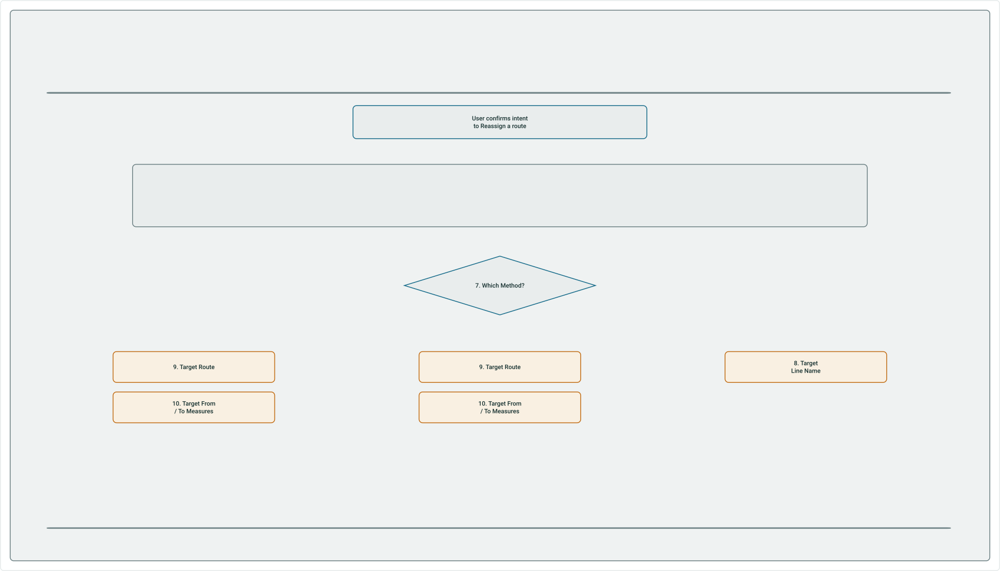

# Reassign Route AI Assistant Test Plan

|   |   |
| --- | --- |
| **Kind** | Test Plan · Pro |
| **Release** | — |
| **Issue** | [ArcGISPro/ps-location-referencing#7039](https://devtopia.esri.com/ArcGISPro/ps-location-referencing/issues/7039) |
| **Source** | [7039_ReassignRouteAIAssistant_TestPlan.pptx](<https://esriis.sharepoint.com/sites/LocationReferencing/Shared%20Documents/General/Test%20Plans/7039_ReassignRouteAIAssistant_TestPlan.pptx>) |
| **Edited** | 2026-05-14 18:53 by Kevin Roper |
| **Extracted** | 2026-09-04 · lane `xmlstrip` |

<!-- metadata
```yaml
title: "Reassign Route AI Assistant Test Plan"
source_file: "7039_ReassignRouteAIAssistant_TestPlan.pptx"
source_url: "https://esriis.sharepoint.com/sites/LocationReferencing/Shared%20Documents/General/Test%20Plans/7039_ReassignRouteAIAssistant_TestPlan.pptx"
doc_id: 34
doc_kind: "Test Plan"
surface: "Pro"
doc_revision: ""
target_release: ""
pe: ""
dev: ""
author: "PptxGenJS"
last_edited_by: "Kevin Roper"
last_edited: "2026-05-14T18:53:59Z"
extracted: 2026-09-04
extraction_lane: xmlstrip
prompt_version: "v2.0.2"
keywords: ["reassign route", "ai assistant", "route reassignment", "merge routes", "form new route", "transfer to another line", "negative tests", "linear referencing"]
tools: []
products: []
issues: ["ArcGISPro/ps-location-referencing#7039"]
related: [{"doc":11,"file":"reassign-route-subsequent-pane-ai-assistant-test-plan__doc11.md","s":7.263},{"doc":100,"file":"pro-ai-assistant-reassign-route-user-story__doc100.md","s":6.2},{"doc":51,"file":"realign-route-ai-assistant-test-plan__doc51.md","s":5.209},{"doc":4,"file":"retire-route-pro-ai-assistant-test-plan__doc4.md","s":5.093},{"doc":550,"file":"reassign-route-ui-dynamic-support-of-existing-methods-test-plan__doc550.md","s":4.963}]
```
-->

## Summary

Test plan for the Reassign Route AI Assistant covering user intent recognition, parameter confirmation, and method-specific workflows for reassigning routes in linear referencing systems. Includes scenarios for forming new routes, merging to adjacent routes, transferring to another line, and negative test cases for error handling and validation. The plan supports multiple network types, licensing checks, and user prompts in ArcGIS Pro maps and local scenes.

## Related documents

<!-- related:begin -->
- [Reassign Route Subsequent Pane AI Assistant Test Plan](<https://esriis.sharepoint.com/sites/lrsworkspace/LRS%20Doc%20Index/Test%20Plans/reassign-route-subsequent-pane-ai-assistant-test-plan__doc11.md>) — similar text 0.32 · 3 title words · 3 filename words · same kind/surface/folder <!-- rel:11 -->
- [Pro AI Assistant Reassign Route User Story](<https://esriis.sharepoint.com/sites/lrsworkspace/LRS%20Doc%20Index/User%20Stories/pro-ai-assistant-reassign-route-user-story__doc100.md>) — similar text 0.41 · 3 title words · 2 filename words · same surface <!-- rel:100 -->
- [Realign Route AI Assistant Test Plan](<https://esriis.sharepoint.com/sites/lrsworkspace/LRS Doc Index/Test Plans/realign-route-ai-assistant-test-plan__doc51.md>) — similar text 0.26 · 2 title words · 2 filename words · same kind/surface/folder <!-- rel:51 -->
- [Retire Route – Pro AI Assistant Test Plan](<https://esriis.sharepoint.com/sites/lrsworkspace/LRS%20Doc%20Index/Test%20Plans/retire-route-pro-ai-assistant-test-plan__doc4.md>) — similar text 0.30 · 2 title words · 2 filename words · same kind/surface/folder <!-- rel:4 -->
- [Reassign Route UI: Dynamic Support of Existing Methods Test Plan](<https://esriis.sharepoint.com/sites/lrsworkspace/LRS Doc Index/Test Plans/reassign-route-ui-dynamic-support-of-existing-methods-test-plan__doc550.md>) — similar text 0.17 · 2 title words · 2 filename words · same kind/folder <!-- rel:550 -->
<!-- related:end -->

<!-- docs:begin -->
## Esri documentation

[Route reassignment](https://doc.esri.com/en/arcgis-pro/latest/help/production/location-referencing-pipelines/reassign-routes.html) · [Merge to adjacent route method](https://doc.esri.com/en/arcgis-pro/latest/help/production/location-referencing-pipelines/merge-to-adjacent-route-method.html) · [Multiple linear referencing methods](https://doc.esri.com/en/arcgis-pro/latest/help/production/location-referencing-pipelines/multiple-linear-referencing-methods.html)
<!-- docs:end -->

---

## Slide 1

TEST PLAN
Reassign Route AI Assistant

## Slide 2



First-Pane Behavior — Decision Tree

User confirms intent to Reassign a route

1. Network    →    2. Effective Date    →    3. Source Route (+ To Route if line network)    →    4. Source From / To Measures    →    5. Transfer Calibration Points    →    6. Recalibrate Source Downstream
MERGE TO AN ADJACENT ROUTE
FORM A NEW ROUTE
TRANSFER TO ANOTHER LINE
10. Target From / To Measures
11. Recalibrate Target Downstream
10. Target From / To Measures
8. Target Line Name
12. Confirm all inputs and transition to the populated Reassign Route UI

Reassign Route AI Assistant  ·  User Story Summary

## Slide 3

Skill Scope & Requirements

Flexible prompt recognition
Trigger from natural variants: “I want to reassign a route,” “split a road,” “merge pipelines in my LRS,” etc. Coverage must include the terms reassign, merge, and split.
Confirm intent before proceeding
Always verify the user actually wants to Reassign a route before walking them through the parameter sequence.
Check Location Referencing licensing
If LR licensing is not enabled, the assistant informs the user and links to the licensing documentation.
Clear failure messaging
If the skill can’t be completed for any other reason, the assistant explains why in a way the user can act on.
Pro maps and local scenes
The skill works in both ArcGIS Pro maps and local scenes.
Feature services only (for now)
Initial release scope is limited to networks edited through feature services.

Reassign Route AI Assistant  ·  User Story Summary
3 / 9

## Slide 4

Parameters by Network Type

NONLINE  (CONTINUOUS)  NETWORK
Source RouteID / Name
Transfer Calibration Points  (option)
Recalibrate Source Downstream  (option)
Method  —  Form a New Route  or  Merge to Adjacent Route
Target RouteID / Name
Form: must be new; multifield prompts per field
Merge: must be existing; composite or per-field
Recalibrate Target Downstream  (only if Merge)

Source From RouteID / Name
Source To RouteID / Name
Transfer Calibration Points  (option)
Recalibrate Source Downstream  (option)
Method  —  Form  /  Merge  /  Transfer to Another Line
Method-specific target info:
Form: new target route, target measures
Merge: existing target route, target measures, recalibrate target
Transfer: target Line Name only

Reassign Route AI Assistant  ·  Parameters by Network Type

[figure: 1 · Network · 2 · Effective Date · 3 · 4 · Source From Measure · 5 · Source To Measure · 6–9 · • · 10 · Target From Measure · 11 · Target To Measure · 12 · LINE NETWORK · 3–5 · 6 · 7–10 · 1 / 1]

## Slide 5

Level 0 — Bare intent

(intent only — no parameters yet)

Prompt the user for all first-pane parameters per the canonical sequence. Confirm all inputs and transition to the populated Reassign Route UI.

Reassign Route Test Plan  ·  Part 1 of 3

[figure: PROMPT · Reassign a route · PROVIDED IN PROMPT · AI ASSISTANT SHOULD · Reassign · Merge · Split · → · a · (space) · LRS · route · Roadway · Road · Highway · Pipe · Pipeline · 6 / 15]

## Slide 6

Level 1 — Network in prompt

Reassign a route in CountyLog

Confirm the network. Prompt for the remaining first-pane parameters per the canonical sequence.
<Network Name> Network

Reassign Route Test Plan  ·  Part 1 of 3

[figure: PROMPT · PROVIDED IN PROMPT · Network (CountyLog) · AI ASSISTANT SHOULD · Reassign · Merge · Split · → · a · (space) · LRS · route · Roadway · Road · Highway · Pipe · Pipeline · in · CountyLog · <Network Name> · 7 / 15 · Rename]

## Slide 7

Level 2 — Network and date in prompt

Reassign a route in CountyLog on 01/01/2025

Network (CountyLog)
Effective Date (01/01/2025)

Confirm the network and date. Prompt for source route, source measures, toggles, method, and target.
<Network Name> Network

Reassign Route Test Plan  ·  Part 1 of 3

[figure: PROMPT · PROVIDED IN PROMPT · AI ASSISTANT SHOULD · Reassign · Merge · Split · → · a · (space) · LRS · route · Roadway · Road · Highway · Pipe · Pipeline · in · CountyLog · <Network Name> · on · for · with · 01/01/2025 · Date 01/01/2000 · …]

## Slide 8

SECTION
Form a New Route — 3F to 8F
9

## Slide 9

Level 3F — Split triggers Form New Route method

Split a route in CountyLog on 01/01/2025

Network (CountyLog)
Effective Date (01/01/2025)
Method (Form a New Route)

Confirm network, date, and method. Prompt for source route, source measures, toggles, target route, and target measures.
<Network Name> Network

Reassign Route Test Plan  ·  Part 1 of 3  ·  Form a New Route

[figure: PROMPT · PROVIDED IN PROMPT · AI ASSISTANT SHOULD · Split · Reassign · Merge · → · a · (space) · LRS · route · Roadway · Road · Highway · Pipe · Pipeline · in · CountyLog · <Network Name> · on · for · with · 01/01/2025 · Date 01/01/2000 · …]

## Slide 10

Level 4F — Source route added

Split RouteX in CountyLog on 01/01/2025

Network (CountyLog)
Effective Date (01/01/2025)
Method (Form a New Route)
Source Route (RouteX)

Confirm provided inputs. Prompt for source measures, toggles, target route, and target measures.
<Network Name> Network

Reassign Route Test Plan  ·  Part 1 of 3  ·  Form a New Route

[figure: PROMPT · PROVIDED IN PROMPT · AI ASSISTANT SHOULD · Split · Reassign · Merge · → · RouteX · <RouteName> · RouteName R1 · R1 · in · CountyLog · <Network Name> · on · for · with · 01/01/2025 · Date 01/01/2000 · 01-01-2000 · Jan 1, 2000 · 11 / 15]

## Slide 11

Level 5F — Source measures added

Split RouteX from 0 to 10 in CountyLog on 01/01/2025

Network (CountyLog)
Effective Date (01/01/2025)
Method (Form a New Route)
Source Route (RouteX)
Source Measures (0 to 10)

Confirm provided inputs. Prompt for toggles, target route, and target measures.
<Network Name> Network

Reassign Route Test Plan  ·  Part 1 of 3  ·  Form a New Route

[figure: PROMPT · PROVIDED IN PROMPT · AI ASSISTANT SHOULD · Split · Reassign · Merge · → · RouteX · <RouteName> · RouteName R1 · R1 · from 0 · From Measure 0 · at · 0 · starting · to · - · 10 · To Measure 10 · Measures 10 · ending · in · CountyLog · …]

## Slide 12

Level 6F — Target route named (Form a New Route)

Split RouteX from 0 to 10 to form Route1 in CountyLog on 01/01/2025

Network (CountyLog)
Effective Date (01/01/2025)
Method (Form a New Route)
Source Route (RouteX)
Source Measures (0 to 10)
Target Route (Route1)

Confirm provided inputs. If multifield, prompt per field. Prompt for toggles and target measures.
<Network Name> Network

Reassign Route Test Plan  ·  Part 1 of 3  ·  Form a New Route

[figure: PROMPT · PROVIDED IN PROMPT · AI ASSISTANT SHOULD · Split · Reassign · Merge · → · RouteX · <RouteName> · RouteName R1 · R1 · from 0 · From Measure 0 · at · 0 · starting · to · - · 10 · To Measure 10 · Measures 10 · ending · to form · into · …]

## Slide 13

Level 7F — Target measures added (Form a New Route)

Split RouteX from 0 to 10 to form Route1 with target measures 0 to 10 in CountyLog on 01/01/2025

Network (CountyLog)
Effective Date (01/01/2025)
Method (Form a New Route)
Source Route (RouteX)
Source Measures (0 to 10)
Target Route (Route1)
Target Measures (0 to 10)

Confirm provided inputs. Prompt for toggles (transfer calibration, recalibrate source downstream).
with target measures 0 to 10
Spanning Measures 0 and 10
0 and 10 as From and To measures
<Network Name> Network

Reassign Route Test Plan  ·  Part 1 of 3  ·  Form a New Route

[figure: PROMPT · PROVIDED IN PROMPT · AI ASSISTANT SHOULD · Split · Reassign · Merge · → · RouteX · <RouteName> · RouteName R1 · R1 · from 0 · From Measure 0 · at · 0 · starting · to · - · 10 · To Measure 10 · Measures 10 · ending · to form · into · …]

## Slide 14

Level 8F — Every Form input supplied

Split RouteX from 0 to 10 to form Route1 with target measures 0 to 10 in EngNetwork on 01/01/2025. Do not recalibrate downstream. Transfer calibration points.

Network (EngNetwork), Effective Date (01/01/2025), Method (Form a New Route), Source Route (RouteX), Source Measures (0 to 10), Target Route (Route1), Target Measures (0 to 10), Recalibrate Source Downstream (NO), Transfer Calibration Points (YES)

Confirm all inputs to the tool. Transition to the populated Reassign Route UI so the user can click run.
with target measures 0 to 10
Spanning Measures 0 and 10
0 and 10 as From and To measures
<Network Name> Network
Refresh downstream segment
transfer calibration points

Reassign Route Test Plan  ·  Part 1 of 3  ·  Form a New Route

[figure: PROMPT · PROVIDED IN PROMPT · AI ASSISTANT SHOULD · Split · Reassign · Merge · → · RouteX · <RouteName> · RouteName R1 · R1 · from 0 · From Measure 0 · at · 0 · starting · to · - · 10 · To Measure 10 · Measures 10 · ending · to form · into · …]

## Slide 15

Form a New Route — Full Prompt Variants

Representative complete-prompt phrasings the AI Assistant must recognize.
Reassign RouteX from 0 to 10 to form Route1 with target measures 0 to 10 in EngNetwork on 01/01/2025
Reassign RouteX from 0 to 10 onto Route1 (target measures 0 to 10) in EngNetwork on 01/01/2025
Form a new route Route1 from RouteX 0 to 10 in EngNetwork effective Jan 1, 2025
In EngNetwork on 01/01/2025, split RouteX (From Measure 0 to To Measure 10) to form Route1 spanning measures 0 and 10
Reassign RouteX 0..10  →  Route1 0..10 in EngNetwork on 01-01-2025. Recalibrate downstream. Transfer calibration points.
I want to Reassign RouteX from 0 to 10 to form a new route called Route1 with target measures 0 to 10 in my EngNetwork LRS as of 01/01/2025
Take RouteX 0 to 10 and form a new route Route1 with measures 0 to 10. Network EngNetwork, effective 01/01/2025. Do not recalibrate.
Form Route1 from RouteX. Source 0 to 10, target 0 to 10. EngNetwork. 01/01/2025. Keep calibration.

Reassign Route AI Assistant  ·  User Story Summary

[figure: 1–8 · 5 / 9]

## Slide 16

SECTION
Merge to Adjacent Route —3M to 8M
2

## Slide 17

Level 3M — Merge triggers Merge to Adjacent Route method

Merge a route in CountyLog on 01/01/2025

Network (CountyLog)
Effective Date (01/01/2025)
Method (Merge to Adjacent Route)

Confirm network, date, and method. Prompt for source route, source measures, toggles, target route, target measures, and recalibrate target downstream.
<Network Name> Network

Reassign Route Test Plan  ·  Part 2 of 3  ·  Merge to Adjacent Route

[figure: PROMPT · PROVIDED IN PROMPT · AI ASSISTANT SHOULD · Merge · Reassign · Split · → · a · (space) · LRS · route · Roadway · Road · Highway · Pipe · Pipeline · in · CountyLog · <Network Name> · on · for · with · 01/01/2025 · Date 01/01/2000 · …]

## Slide 18

Level 4M — Source route added (Merge to Adjacent)

Merge RouteX in CountyLog on 01/01/2025

Network (CountyLog)
Effective Date (01/01/2025)
Method (Merge to Adjacent)
Source Route (RouteX)

Confirm provided inputs. Prompt for source measures, toggles, target route, target measures, and recalibrate target downstream.
<Network Name> Network

Reassign Route Test Plan  ·  Part 2 of 3  ·  Merge to Adjacent Route

[figure: PROMPT · PROVIDED IN PROMPT · AI ASSISTANT SHOULD · Merge · Reassign · Split · → · RouteX · <RouteName> · RouteName R1 · R1 · in · CountyLog · <Network Name> · on · for · with · 01/01/2025 · Date 01/01/2000 · 01-01-2000 · Jan 1, 2000 · 4 / 15]

## Slide 19

Level 5M — Source measures added (Merge to Adjacent)

Merge RouteX from 0 to 20 in CountyLog on 01/01/2025

Network (CountyLog)
Effective Date (01/01/2025)
Method (Merge to Adjacent)
Source Route (RouteX)
Source Measures (0 to 20)

Confirm provided inputs. Prompt for toggles, target route, target measures, and recalibrate target downstream.
<Network Name> Network

Reassign Route Test Plan  ·  Part 2 of 3  ·  Merge to Adjacent Route

[figure: PROMPT · PROVIDED IN PROMPT · AI ASSISTANT SHOULD · Merge · Reassign · Split · → · RouteX · <RouteName> · RouteName R1 · R1 · from 0 · From Measure 0 · at · 0 · starting · to · - · 20 · To Measure 20 · Measures 20 · ending · in · CountyLog · …]

## Slide 20

Level 6M — Target route added (Merge to Adjacent)

Merge RouteX from 0 to 20 into RouteY in CountyLog on 01/01/2025

Network (CountyLog)
Effective Date (01/01/2025)
Method (Merge to Adjacent)
Source Route (RouteX)
Source Measures (0 to 20)
Target Route (RouteY)

Confirm provided inputs. Prompt for toggles, target measures, and recalibrate target downstream.
<Network Name> Network

Reassign Route Test Plan  ·  Part 2 of 3  ·  Merge to Adjacent Route

[figure: PROMPT · PROVIDED IN PROMPT · AI ASSISTANT SHOULD · Merge · Reassign · Split · → · RouteX · <RouteName> · RouteName R1 · R1 · from 0 · From Measure 0 · at · 0 · starting · to · - · 20 · To Measure 20 · into · onto · add to · merge with · …]

## Slide 21

Level 7M — Target measures added (Merge to Adjacent)

Merge RouteX from 0 to 20 into RouteY with target measures 0 to 30 in CountyLog on 01/01/2025

Network (CountyLog)
Effective Date (01/01/2025)
Method (Merge to Adjacent)
Source Route (RouteX)
Source Measures (0 to 20)
Target Route (RouteY)
Target Measures (0 to 30)

Confirm provided inputs. Prompt for toggles and recalibrate target downstream.
with target measures 0 to 30
Spanning Measures 0 and 30
0 and 30 as From and To measures
<Network Name> Network

Reassign Route Test Plan  ·  Part 2 of 3  ·  Merge to Adjacent Route

[figure: PROMPT · PROVIDED IN PROMPT · AI ASSISTANT SHOULD · Merge · Reassign · Split · → · RouteX · <RouteName> · RouteName R1 · R1 · from 0 · From Measure 0 · at · 0 · starting · to · - · 20 · To Measure 20 · into · onto · add to · merge with · …]

## Slide 22

Level 8M — Every Merge parameter supplied

Merge RouteX from 0 to 20 into RouteY with target measures 0 to 30 in EngNetwork on 01/01/2010. Recalibrate source and target downstream. Transfer calibration points.

Network (EngNetwork), Effective Date (01/01/2010), Method (Merge to Adjacent Route), Source Route (RouteX), Source Measures (0 to 20), Target Route (RouteY), Target Measures (0 to 30), Recalibrate Source / Target Downstream (YES / YES), Transfer Calibration Points (YES)

Confirm all inputs to the tool. Transition to the populated Reassign Route UI so the user can click run.
with target measures 0 to 30
Spanning Measures 0 and 30
0 and 30 as From and To measures
<Network Name> Network
Refresh downstream segment
transfer calibration points

Reassign Route Test Plan  ·  Part 2 of 3  ·  Merge to Adjacent Route

[figure: PROMPT · PROVIDED IN PROMPT · AI ASSISTANT SHOULD · Merge · Reassign · Split · → · RouteX · <RouteName> · RouteName R1 · R1 · from 0 · From Measure 0 · at · 0 · starting · to · - · 20 · To Measure 20 · into · onto · add to · merge with · …]

## Slide 23

Merge to Adjacent Route — Full Prompt Variants

Representative complete-prompt phrasings the AI Assistant must recognize.
Merge RouteX from 0 to 20 into RouteY with target measures 0 to 30 in CountyLog on 01/01/2025
Merge RouteX from 0 to 20 onto RouteY (target measures 0 to 30) in CountyLog on 01/01/2025
Merge RouteX 0 to 20 to RouteY 0 to 30 in CountyLog effective 01/01/2025
In CountyLog on 01/01/2025, merge RouteX (0 to 20) with RouteY at measures 0 to 30. Recalibrate target downstream.
Merge RouteX 0 to 20  with  RouteY 0 - 30 in CountyLog on 01-01-2025. Preserve calibration. Update downstream.
I want to merge RouteX (measures 0 to 20) with the adjacent RouteY at measures 0 to 30 in CountyLog as of 01/01/2025
Merge RouteX into RouteY in my LRS CountyLog. Source 0 to 20, target 0 to 30. Date: Jan 1, 2025.
Merge RouteX 0 to 20 onto RouteY at 0 to 30. CountyLog. 01/01/2025. Do not recalibrate. Carry over calibration.

Reassign Route AI Assistant  ·  User Story Summary

[figure: 1–8 · 6 / 9]

## Slide 24

SECTION
Transfer to Another Line —3T to 8T
9

## Slide 25

Level 3T — Reassign triggers Transfer method

Reassign a route to another line in EngNetwork on 01/01/2025

Network (EngNetwork)
Effective Date (01/01/2025)
Method (Transfer to Another Line)

Confirm network, date, and method. Prompt for source route, source measures, toggles, and target Line Name.
<Network Name> Network

Reassign Route Test Plan  ·  Part 2 of 3  ·  Transfer to Another Line

[figure: PROMPT · PROVIDED IN PROMPT · AI ASSISTANT SHOULD · Reassign · Merge · Split · → · a · (space) · LRS · route · Roadway · Road · Highway · Pipe · Pipeline · to · into · onto · over to · another line · existing line · new line · in · …]

## Slide 26

Level 4T — Source route added (Transfer)

Reassign RouteZ to another line in EngNetwork on 01/01/2025

Network (EngNetwork)
Effective Date (01/01/2025)
Method (Transfer to Another Line)
Source Route (RouteZ)

Confirm provided inputs. Prompt for source measures, toggles, and target Line Name.
<Network Name> Network

Reassign Route Test Plan  ·  Part 2 of 3  ·  Transfer to Another Line

[figure: PROMPT · PROVIDED IN PROMPT · AI ASSISTANT SHOULD · Reassign · Merge · Split · → · RouteZ · <RouteName> · RouteName R1 · R1 · to · into · onto · over to · another line · existing line · new line · in · EngNetwork · <Network Name> · on · for · with · …]

## Slide 27

Level 5T — Source measures added (Transfer)

Reassign RouteZ from 50 to 60 to another line in EngNetwork on 01/01/2025

Network (EngNetwork)
Effective Date (01/01/2025)
Method (Transfer to Another Line)
Source Route (RouteZ)
Source Measures (50 to 60)

Confirm provided inputs. Prompt for toggles and target Line Name.
<Network Name> Network

Reassign Route Test Plan  ·  Part 2 of 3  ·  Transfer to Another Line

[figure: PROMPT · PROVIDED IN PROMPT · AI ASSISTANT SHOULD · Reassign · Merge · Split · → · RouteZ · <RouteName> · RouteName R1 · R1 · from 50 · From Measure 50 · at · 50 · starting · to · - · 60 · To Measure 60 · Measures 60 · into · onto · over to · …]

## Slide 28

Level 6T — Target line named (Transfer)

Reassign RouteZ from 50 to 60 to Line1 in EngNetwork on 01/01/2025

Network (EngNetwork)
Effective Date (01/01/2025)
Method (Transfer to Another Line)
Source Route (RouteZ)
Source Measures (50 to 60)
Target Line (Line1)

Confirm provided inputs. Prompt for toggles (transfer calibration, recalibrate source downstream).
<Network Name> Network

Reassign Route Test Plan  ·  Part 2 of 3  ·  Transfer to Another Line

[figure: PROMPT · PROVIDED IN PROMPT · AI ASSISTANT SHOULD · Reassign · Merge · Split · → · RouteZ · <RouteName> · RouteName R1 · R1 · from 50 · From Measure 50 · at · 50 · starting · to · - · 60 · To Measure 60 · Measures 60 · into · onto · over to · …]

## Slide 29

Level 7T — Calibration toggle set (Transfer)

Reassign RouteZ from 50 to 60 to Line1 in EngNetwork on 01/01/2025. Transfer calibration points.

Network (EngNetwork)
Effective Date (01/01/2025)
Method (Transfer to Another Line)
Source Route (RouteZ)
Source Measures (50 to 60)
Target Line (Line1)
Transfer Calibration Points (YES)

Confirm provided inputs. Prompt for recalibrate source downstream.
<Network Name> Network
transfer calibration points

Reassign Route Test Plan  ·  Part 2 of 3  ·  Transfer to Another Line

[figure: PROMPT · PROVIDED IN PROMPT · AI ASSISTANT SHOULD · Reassign · Merge · Split · → · RouteZ · <RouteName> · RouteName R1 · R1 · from 50 · From Measure 50 · at · 50 · starting · to · - · 60 · To Measure 60 · Measures 60 · into · onto · over to · …]

## Slide 30

Level 8T — Every Transfer input supplied

Reassign RouteZ from 50 to 60 to Line1 in EngNetwork on 01/01/2025. Do not recalibrate downstream. Transfer calibration points.

Network (EngNetwork), Effective Date (01/01/2025), Method (Transfer to Another Line), Source Route (RouteZ), Source Measures (50 to 60), Target Line (Line1), Recalibrate Source Downstream (NO), Transfer Calibration Points (YES)

Confirm all inputs to the tool. Transition to the populated Reassign Route UI so the user can click run.
First pane fully specified — transitions directly to populated UI.
<Network Name> Network
Refresh downstream segment
transfer calibration points

Reassign Route Test Plan  ·  Part 2 of 3  ·  Transfer to Another Line

[figure: PROMPT · PROVIDED IN PROMPT · AI ASSISTANT SHOULD · Reassign · Merge · Split · → · RouteZ · <RouteName> · RouteName R1 · R1 · from 50 · From Measure 50 · at · 50 · starting · to · - · 60 · To Measure 60 · into · onto · over to · Line1 · …]

## Slide 31

Transfer to Another Line — Full Prompt Variants

Representative complete-prompt phrasings the AI Assistant must recognize.
Reassign RouteZ from 50 to 60 to Line1 in CountyLog on 01/01/2025
Reassign RouteZ (50 to 60) over to Line1 in CountyLog on 01/01/2025
Reassign RouteZ measures 50 to 60 onto Line1 in CountyLog effective 01/01/2025
In CountyLog on 01/01/2025, transfer RouteZ from 50 to 60 to existing line Line1
Reassign RouteZ 50 to 60  to  Line1 in CountyLog on 01-01-2025. Transfer calibration points.
I want to reassign RouteZ from 50 to 60 to another line — Line1 — in my LRS CountyLog as of 01/01/2025
Take RouteZ measures 50 to 60 and move them onto a new line LineNew. CountyLog. Jan 1, 2025.
Reassign RouteZ  to  Line1. Source measures 50 to 60. CountyLog. 01/01/2025. Recalibrate source downstream.

Reassign Route AI Assistant  ·  User Story Summary

[figure: 1–8 · 7 / 9]

## Negative Tests — Overview <!-- slide 32 -->

### 2

SECTION

## Slide 33

N1 — Wrong tool: user asks to Create

Create a new route in CountyLog

Verb (Create — not a Reassign verb)
Network (CountyLog)

Inform the user the skill can't be completed.
<Network Name> Network

Reassign Route Test Plan  ·  Part 3 of 3  ·  Negative Test

[figure: PROMPT · PROVIDED IN PROMPT · AI ASSISTANT SHOULD · Create · Reassign · Merge · Split · → · a · (space) · LRS · new route · route · Roadway · Road · Highway · Pipe · Pipeline · in · CountyLog · <Network Name> · 3 / 17]

## Slide 34

N2 — Ambiguous verb (Reroute); assistant asks user to confirm intent

Verb (Reroute — ambiguous)
Object (pipe)

Ask the user to verify they want to Reassign a route. Only proceed after explicit confirmation.

Reassign Route Test Plan  ·  Part 3 of 3  ·  Negative Test

[figure: PROMPT · Reroute my pipe · PROVIDED IN PROMPT · AI ASSISTANT SHOULD · Reroute · Reassign · Merge · Split · → · my · a · (space) · LRS · pipe · route · Roadway · Road · Highway · Pipe · Pipeline · 4 / 17]

## Slide 35

N3 — Environmental blocker: Location Referencing license not enabled

Reassign a route in CountyLog on 01/01/2025

Network (CountyLog)
Effective Date (01/01/2025)
Prompt slots are valid — failure is environmental.

Inform the user the skill can't be completed: Location Referencing licensing is not enabled. Link to the licensing documentation.
Precondition: LR licensing is not enabled.
<Network Name> Network

Reassign Route Test Plan  ·  Part 3 of 3  ·  Negative Test

[figure: PROMPT · PROVIDED IN PROMPT · AI ASSISTANT SHOULD · Reassign · Merge · Split · → · a · (space) · LRS · route · Roadway · Road · Highway · Pipe · Pipeline · in · CountyLog · <Network Name> · on · for · with · 01/01/2025 · Date 01/01/2000 · …]

## Slide 36

N4 — Named network missing from current map; assistant asks to add

Reassign a route in NorthNet on 01/01/2025

Network (NorthNet — not in map)
Effective Date (01/01/2025)

Inform the user the skill can't be completed: NorthNet is not in the current map. Ask the user to add it or pick a network present in the map.
<Network Name> Network

Reassign Route Test Plan  ·  Part 3 of 3  ·  Negative Test

[figure: PROMPT · PROVIDED IN PROMPT · AI ASSISTANT SHOULD · Reassign · Merge · Split · → · a · (space) · LRS · route · Roadway · Road · Highway · Pipe · Pipeline · in · NorthNet · <Network Name> · on · for · with · 01/01/2025 · Date 01/01/2000 · …]

## Slide 37

N5 — Branch-versioned network not published with linear referencing capabilities

Reassign RouteX from 0 to 10 in WebNet on 01/01/2025

Network (WebNet — missing LR / VM)
Effective Date (01/01/2025)
Source Route (RouteX)
Source Measures (0 to 10)

Inform the user the skill can't be completed: branch-versioned networks must be published with linear referencing and version management capabilities. Link to relevant documentation.
<Network Name> Network

Reassign Route Test Plan  ·  Part 3 of 3  ·  Negative Test

[figure: PROMPT · PROVIDED IN PROMPT · AI ASSISTANT SHOULD · Reassign · Merge · Split · → · RouteX · <RouteName> · RouteName R1 · R1 · from 0 · From Measure 0 · at · 0 · starting · to · - · 10 · To Measure 10 · Measures 10 · ending · in · WebNet · …]

## Slide 38

N6 — Invalid measure range: From > To; assistant asks for a valid range

Split RouteX from 10 to 0 in CountyLog on 01/01/2025

Network (CountyLog)
Effective Date (01/01/2025)
Method (Form a New Route)
Source Route (RouteX)
Source Measures (10 to 0 — invalid range)

Inform the user the skill can't be completed: the From measure must be less than the To measure. Ask for a valid measure range for RouteX.
<Network Name> Network

Reassign Route Test Plan  ·  Part 3 of 3  ·  Negative Test

[figure: PROMPT · PROVIDED IN PROMPT · AI ASSISTANT SHOULD · Split · Reassign · Merge · → · RouteX · <RouteName> · RouteName R1 · R1 · from 10 · From Measure 0 · Measures 0 · starting · to · - · 0 · To Measure 10 · Measures 10 · ending · in · CountyLog · <Network Name> · …]

## Slide 39

N7 — Source measures exceed the route’s extent

Split RouteX from 0 to 50 in CountyLog on 01/01/2025

Network (CountyLog)
Effective Date (01/01/2025)
Method (Form a New Route)
Source Route (RouteX)
Source Measures (0 to 50)

Inform the user the skill can't be completed: the requested range exceeds RouteX's measure range (0–20). Ask for valid measures within range, or to confirm a different source route.
<Network Name> Network

Reassign Route Test Plan  ·  Part 3 of 3  ·  Negative Test

[figure: PROMPT · PROVIDED IN PROMPT · AI ASSISTANT SHOULD · Split · Reassign · Merge · → · RouteX · <RouteName> · RouteName R1 · R1 · from 0 · From Measure 0 · at · 0 · starting · to · - · 50 · To Measure 10 · Measures 10 · ending · in · CountyLog · …]

## Slide 40

N8 — Source route name not found in the network

Split RouteUnknown from 0 to 10 in CountyLog on 01/01/2025

Network (CountyLog)
Effective Date (01/01/2025)
Method (Form a New Route)
Source Route (RouteUnknown — not in network)
Source Measures (0 to 10)

Inform the user the skill can't be completed: RouteUnknown was not found in CountyLog. Ask to confirm spelling, choose another route, or pick a different network.
<Network Name> Network

Reassign Route Test Plan  ·  Part 3 of 3  ·  Negative Test

[figure: PROMPT · PROVIDED IN PROMPT · AI ASSISTANT SHOULD · Split · Reassign · Merge · → · RouteUnknown · <RouteName> · R1 · from 0 · From Measure 0 · at · 0 · starting · to · - · 10 · To Measure 10 · Measures 10 · ending · in · CountyLog · <Network Name> · …]

## Slide 41

N9 — Effective date precedes route start date

Reassign RouteX from 0 to 10 to form Route1 in CountyLog on 01/01/1990

Network (CountyLog)
Effective Date (01/01/1990 — before RouteX existed)
Method (Form a New Route)
Source Route (RouteX, activated 01/01/2005)
Source Measures (0 to 10)
Target Route (Route1)

Inform the user the skill can't be completed: the effective date is before RouteX existed. Ask for a date within RouteX's active time slice.
<Network Name> Network

Reassign Route Test Plan  ·  Part 3 of 3  ·  Negative Test

[figure: PROMPT · PROVIDED IN PROMPT · AI ASSISTANT SHOULD · Reassign · Merge · Split · → · RouteX · <RouteName> · RouteName R1 · R1 · from 0 · From Measure 0 · at · 0 · starting · to · - · 10 · To Measure 10 · Measures 10 · ending · to form · into · …]

## Slide 42

N10 — Route already exists

Split RouteX from 0 to 10 to form RouteY in CountyLog on 01/01/2025

Network (CountyLog)
Effective Date (01/01/2025)
Method (Form a New Route)
Source Route (RouteX)
Source Measures (0 to 10)
Target Route (RouteY — already exists)

Inform the user the skill can't be completed: RouteY already exists and cannot be the target for Form. Ask for a different (new) name, or switch to Merge to Adjacent Route.
<Network Name> Network

Reassign Route Test Plan  ·  Part 3 of 3  ·  Negative Test

[figure: PROMPT · PROVIDED IN PROMPT · AI ASSISTANT SHOULD · Split · Reassign · Merge · → · RouteX · <RouteName> · RouteName R1 · R1 · from 0 · From Measure 0 · at · 0 · starting · to · - · 10 · To Measure 10 · Measures 10 · ending · to form · into · …]

## Slide 43

N11 — Merge target route missing

Merge RouteX from 0 to 20 into RouteZ with target measures 0 to 30 in CountyLog on 01/01/2025

Network (CountyLog)
Effective Date (01/01/2025)
Method (Merge to Adjacent Route)
Source Route (RouteX)
Source Measures (0 to 20)
Target Route (RouteZ — does not exist)
Target Measures (0 to 30)

Inform the user the skill can't be completed: RouteZ was not found in CountyLog. Ask for an existing adjacent route, or switch to Form a New Route.
with target measures 0 to 30
Spanning Measures 0 and 30
0 and 30 as From and To measures
<Network Name> Network

Reassign Route Test Plan  ·  Part 3 of 3  ·  Negative Test

[figure: PROMPT · PROVIDED IN PROMPT · AI ASSISTANT SHOULD · Merge · Reassign · Split · → · RouteX · <RouteName> · RouteName R1 · R1 · from 0 · From Measure 0 · at · 0 · starting · to · - · 20 · To Measure 20 · into · onto · add to · merge with · …]

## Slide 44

N12 — Merge endpoints not adjacent; assistant asks to verify routes or change method

Merge RouteX from 0 to 20 into RouteY with target measures 0 to 30 in CountyLog on 01/01/2025

Network (CountyLog)
Effective Date (01/01/2025)
Method (Merge to Adjacent Route)
Source Route (RouteX — not adjacent to RouteY)
Source Measures (0 to 20)
Target Route (RouteY — not adjacent to RouteX)
Target Measures (0 to 30)

Inform the user the skill can't be completed: Merge requires the source and target to share an endpoint, and RouteX / RouteY are not adjacent. Ask to confirm the route IDs or pick a different method.
with target measures 0 to 30
Spanning Measures 0 and 30
0 and 30 as From and To measures
<Network Name> Network

Reassign Route Test Plan  ·  Part 3 of 3  ·  Negative Test

[figure: PROMPT · PROVIDED IN PROMPT · AI ASSISTANT SHOULD · Merge · Reassign · Split · → · RouteX · <RouteName> · from 0 · From Measure 0 · at · 0 · starting · to · - · 20 · To Measure 20 · into · onto · add to · merge with · RouteY · in · …]

## Slide 45

N13 — Multifield route ID supplied as composite; assistant prompts per field

Split RouteX from 0 to 10 to form Route1 in MultifieldNet on 01/01/2025

Network (MultifieldNet — multifield route ID)
Effective Date (01/01/2025)
Method (Form a New Route)
Source Route (RouteX)
Source Measures (0 to 10)
Target Route (Route1 — composite, not per-field)

Inform the user MultifieldNet uses a multifield route ID. Prompt for each field (RoutePrefix, RouteNumber, RouteSuffix) since Form is selected.

Reassign Route Test Plan  ·  Part 3 of 3  ·  Negative Test

[figure: PROMPT · PROVIDED IN PROMPT · AI ASSISTANT SHOULD · Split · Reassign · Merge · → · RouteX · <RouteName> · RouteName R1 · R1 · from 0 · From Measure 0 · at · 0 · starting · to · - · 10 · To Measure 10 · Measures 10 · ending · to form · into · …]

## Slide 46

N14 — Multiple LRS networks in map, none named

(intent only — no network specified)

Precondition: map contains three LRS networks (CountyLog, EngNetwork, PipelineRef).

Confirm the user wants to Reassign a route, then ask which network to use. List the networks present in the map. Do not assume or default.
Network slot is missing — multiple networks in map.

Reassign Route Test Plan  ·  Part 3 of 3  ·  Negative Test

[figure: PROMPT · Reassign a route · PROVIDED IN PROMPT · AI ASSISTANT SHOULD · Reassign · Merge · Split · → · a · (space) · LRS · route · Roadway · Road · Highway · Pipe · Pipeline · in · ( missing ) · CountyLog · EngNetwork · PipelineRef · 16 / 17]

## Slide 47

N15 — Line network requires Source To Route

Merge RouteX from 0 to 20 in LineNet on 01/01/2025

Network (LineNet — line network)
Effective Date (01/01/2025)
Method (Merge to Adjacent Route)
Source From Route (RouteX)
Source Measures (0 to 20)
Source To Route — MISSING

Confirm the Source From route (RouteX). Prompt for the Source To route ID/name, then continue the canonical sequence.
Source To Route is required on line networks.

Reassign Route Test Plan  ·  Part 3 of 3  ·  Negative Test

[figure: PROMPT · PROVIDED IN PROMPT · AI ASSISTANT SHOULD · Merge · Reassign · Split · → · RouteX · <RouteName> · RouteName R1 · R1 · from 0 · From Measure 0 · at · 0 · starting · to · - · ( missing ) · RouteName R2 · R2 · 20 · To Measure 20 · in · …]

## • Author CUIT and NVVM tests for the test cases <!-- slide 48 -->

Testing, Automation & Documentation

•  Variety of prompts and interactions for every step
•  Multiple network types and routeID/name compositions
•  All three methods (Merge / Form / Transfer)
•  Split coverage: ≈ 90% action prompts, 10% documentation
•  I18n / L10n
•  Accessibility

•  Author CUIT and NVVM tests for the test cases

•  Document the skill consistently with other Pro AI Assistant skills
•  Add a note in the Reassign Route topic linking to the skill
•  Provide prompt-terminology guidance so users know what to say to trigger Reassign Route

Reassign Route AI Assistant  ·  User Story Summary

[figure: TESTING · AUTOMATION · DOCUMENTATION · 8 / 9]
