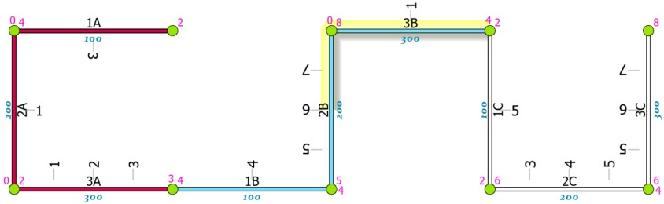
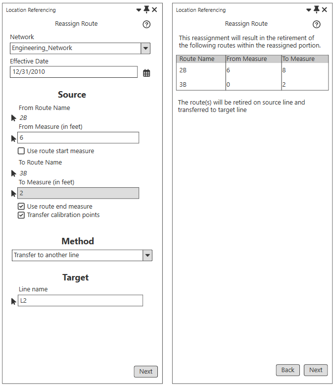
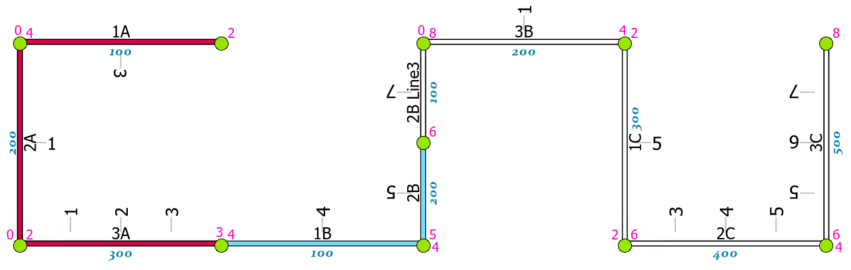
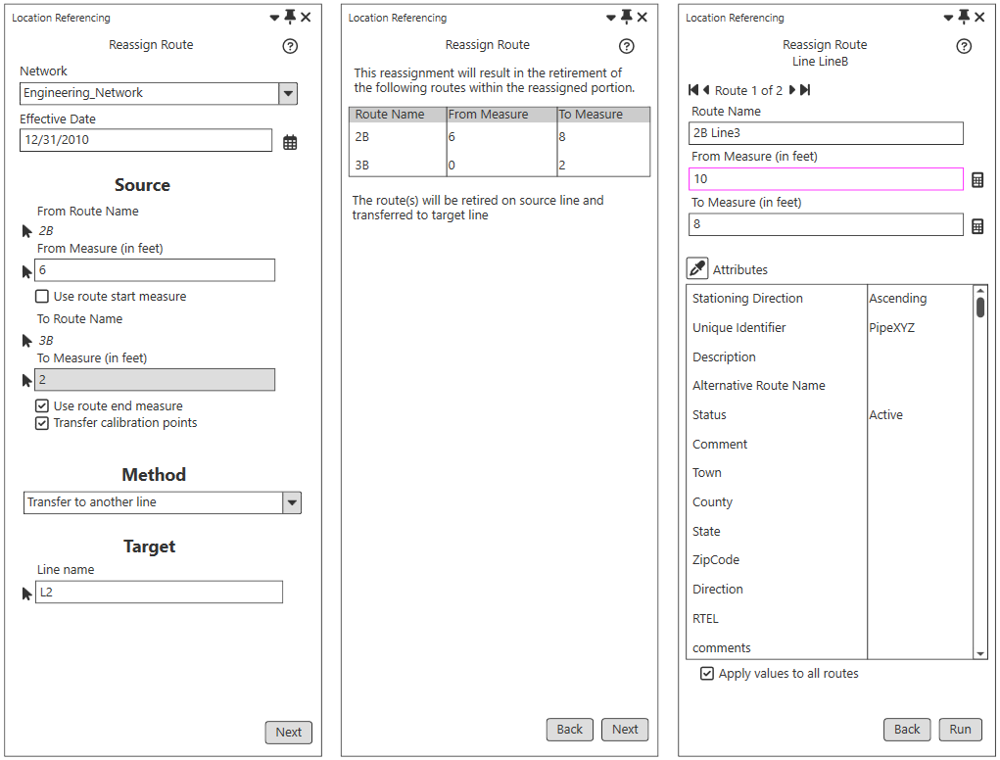

# Reassign Route Supporting Transferring to Another Line - Test Plan

|   |   |
| --- | --- |
| **Kind** | Test Plan · Pro |
| **Release** | — |
| **Source** | [Reassign_UI_NewLine_TestPlan.pptx](<https://esriis.sharepoint.com/sites/LocationReferencing/Shared%20Documents/General/Test%20Plans/Reassign_UI_NewLine_TestPlan.pptx>) |
| **Edited** | 2023-07-14 16:14 by Rahul Rakshit |
| **Extracted** | 2026-09-04 · lane `xmlstrip` |

<!-- metadata
```yaml
title: "Reassign Route Supporting Transferring to Another Line - Test Plan"
source_file: "Reassign_UI_NewLine_TestPlan.pptx"
source_url: "https://esriis.sharepoint.com/sites/LocationReferencing/Shared%20Documents/General/Test%20Plans/Reassign_UI_NewLine_TestPlan.pptx"
doc_id: 538
doc_kind: "Test Plan"
surface: "Pro"
doc_revision: ""
target_release: ""
pe: ""
dev: ""
author: "Rahul Rakshit"
last_edited_by: "Rahul Rakshit"
last_edited: "2023-07-14T16:14:25Z"
extracted: 2026-09-04
extraction_lane: xmlstrip
prompt_version: "v2.0.2"
keywords: ["reassign route", "route transfer", "route reassignment", "route name validation", "measure validation", "partial route", "time slicing", "error handling"]
tools: []
products: []
issues: []
related: [{"doc":535,"file":"reassign-ui-existing-line-test-plan__doc535.md","s":6.347},{"doc":542,"file":"reassign-routes-to-another-line-with-original-route-id-name-maintenance-rest__doc542.md","s":5.947},{"doc":528,"file":"reassign-transfer-to-another-line-with-stayput-and-retire-event-behavior-test__doc528.md","s":4.733},{"doc":583,"file":"support-reassign-transfer-as-new-route-s-to-adjacent-line-method-in-arcgis-pro__doc583.md","s":4.213},{"doc":585,"file":"support-reassign-transfer-to-a-new-line-method-in-arcgis-pro__doc585.md","s":3.852}]
```
-->

## Summary

This document is a test plan for the Reassign Route functionality that supports transferring routes to another line. It includes multiple test cases covering scenarios such as route name length limits, pane input retention, measure and route name changes, error conditions, time slicing, partial route reassignment, and handling of retired routes. The tests verify UI behavior, error messages, attribute propagation, and data integrity during route reassignment operations.

## Related documents

<!-- related:begin -->
- [Reassign UI Existing Line Test Plan](<https://esriis.sharepoint.com/sites/lrsworkspace/LRS Doc Index/Test Plans/reassign-ui-existing-line-test-plan__doc535.md>) — similar text 0.74 · 2 title words · 2 filename words · same kind/surface/folder <!-- rel:535 -->
- [Reassign Routes to Another Line with Original Route ID/Name Maintenance - REST Test Plan](<https://esriis.sharepoint.com/sites/lrsworkspace/LRS%20Doc%20Index/Test%20Plans/reassign-routes-to-another-line-with-original-route-id-name-maintenance-rest__doc542.md>) — similar text 0.35 · 4 title words · 1 filename word · same kind/folder <!-- rel:542 -->
- [Reassign - Transfer to Another Line with StayPut and Retire Event Behavior - Test Plan](<https://esriis.sharepoint.com/sites/lrsworkspace/LRS%20Doc%20Index/Test%20Plans/reassign-transfer-to-another-line-with-stayput-and-retire-event-behavior-test__doc528.md>) — similar text 0.31 · 3 title words · 1 filename word · same kind/surface/folder <!-- rel:528 -->
- [Support Reassign: Transfer as New Route(s) to Adjacent Line Method in ArcGIS Pro](<https://esriis.sharepoint.com/sites/lrsworkspace/LRS Doc Index/User Stories/support-reassign-transfer-as-new-route-s-to-adjacent-line-method-in-arcgis-pro__doc583.md>) — similar text 0.27 · 3 title words · 2 filename words · same surface <!-- rel:583 -->
- [Support Reassign: Transfer to a New Line Method in ArcGIS Pro](<https://esriis.sharepoint.com/sites/lrsworkspace/LRS Doc Index/User Stories/support-reassign-transfer-to-a-new-line-method-in-arcgis-pro__doc585.md>) — similar text 0.28 · 2 title words · 2 filename words · same surface <!-- rel:585 -->
<!-- related:end -->

<!-- docs:begin -->
## Esri documentation

[Route reassignment](https://doc.esri.com/en/arcgis-pro/latest/help/production/location-referencing-pipelines/reassign-routes.html)
<!-- docs:end -->

---

## Slide 1

Reassign Route supporting transferring to another line - New

## Slide 2

Routes’ calibration direction
Each color represents a separate line

[figure: Calibration Points · Source Routes (yellow) · Line Order · Route ID]

## Slide 3


| R Name | L NAME | From Date | To Date | Line Order |
| --- | --- | --- | --- | --- |
| 1A | L0 | 1/1/2000 | Null | 100 |
| 2A | L0 | 1/1/2000 | Null | 200 |
| 3A | L0 | 1/1/2000 | Null | 300 |
| 1B | L1 | 1/1/2000 | Null | 100 |
| 2B | L1 | 1/1/2000 | Null | 200 |
| 3B | L1 | 1/1/2000 | Null | 300 |
| 1C | L2 | 1/1/2000 | Null | 100 |
| 2C | L2 | 1/1/2000 | Null | 200 |
| 3C | L2 | 1/1/2000 | Null | 300 |

| Test ID | 1 | Network Type | Engineering |
| --- | --- | --- | --- |
| Test | Reassign all the routes in a line to a new line, transferring routes. Line name provided exceeds 255 characters. |  |  |

Error message that  the line name exceeds the 255-character length limit.

## Slide 4


| Test ID | 2 | Network Type | Engineering |
| --- | --- | --- | --- |
| Test | Fill Pane1 and Pane3 go back to Pane1 |  |  |

The inputs in Pane1 should be intact

## Slide 5


| Test ID | 3 | Network Type | Engineering |
| --- | --- | --- | --- |
| Test | Fill Pane1 and Pane3 go back to Pane1 and change the from and to source routes’ name |  |  |

The inputs in Pane3 and the derived info in Pane2 should reflect the changes

## Slide 6


| Test ID | 4 | Network Type | Engineering |
| --- | --- | --- | --- |
| Test | Fill Pane1 and Pane3 go back to Pane1 and change the from and to source routes' measures |  |  |

The inputs in Pane3 and the derived info in Pane2 should reflect the changes

## Slide 7


| Test ID | 5 | Network Type | Engineering |
| --- | --- | --- | --- |
| Test | Fill Pane1 and Edit the Route names and Measures in Pane3 go back to Pane1 and then go to Pane3 |  |  |

The inputs in Pane3 should be intact

## Slide 8

| Test ID | 6 | Network Type | Engineering |
| --- | --- | --- | --- |
| Test | Test if the original measures from the source routes are carried over in the 3 rd pane. Here we are transferring to a line in the right. |  |  |

I don’t remember discussing this and don’t think that we should do this. Please tell us which user wants it this way with names and use cases.

Alternate
If the full route is reassigned, then provide its original from and to measures.
If a partial route is reassigned, then provide its original from/to measure and the split measure.

| Recalibrate Source | No |
| --- | --- |
| Recalibrate Target | No |
| Date | 12/31/2010 |
|  |  |


| R Name | L NAME | From Date | To Date | Line Order |
| --- | --- | --- | --- | --- |
| 1A | L0 | 1/1/2000 | Null | 100 |
| 2A | L0 | 1/1/2000 | Null | 200 |
| 3A | L0 | 1/1/2000 | Null | 300 |
| 1B | L1 | 1/1/2000 | Null | 100 |
| 2B | L1 | 1/1/2000 | Null | 200 |
| 3B | L1 | 1/1/2000 | Null | 300 |
| 1C | L2 | 1/1/2000 | Null | 100 |
| 2C | L2 | 1/1/2000 | Null | 200 |
| 3C | L2 | 1/1/2000 | Null | 300 |



## Slide 9


| Test ID | 6 | Network Type | Engineering |
| --- | --- | --- | --- |
| Test | Test if the original measures from the source routes are carried over in the 3 rd pane. Here we are transferring to a line in the right. |  |  |


| R Name | L NAME | From Date | To Date | Line Order |
| --- | --- | --- | --- | --- |
| 1A | L0 | 1/1/2000 | Null | 100 |
| 2A | L0 | 1/1/2000 | Null | 200 |
| 3A | L0 | 1/1/2000 | Null | 300 |
| 1B | L1 | 1/1/2000 | Null | 100 |
| 2B | L1 | 1/1/2000 | 12/31/2010 | 200 |
| 3B | L1 | 1/1/2000 | 12/31/2010 | 300 |
| 1C | L2 | 1/1/2000 | 12/31/2010 | 100 |
| 2C | L2 | 1/1/2000 | 12/31/2010 | 200 |
| 3C | L2 | 1/1/2000 | 12/31/2010 | 300 |
| 2B Line3 | L2 | 12/31/2010 | Null | 100 |
| 3B | L2 | 12/31/2010 | Null | 200 |
| 1C | L2 | 12/31/2010 | Null | 300 |
| 2C | L2 | 12/31/2010 | Null | 400 |
| 3C | L2 | 12/31/2010 | Null | 500 |

   

## Slide 10


| Test ID | 7 | Network Type | Engineering |
| --- | --- | --- | --- |
| Test | Check the Apply values to all routes box and verify that the same attributes have been updated for all routes |  |  |

By Default
Run the tool to verify that the attribute changes have propagated to all the routes

 

## Slide 11


| Test ID | 8 | Network Type | Engineering |
| --- | --- | --- | --- |
| Test | Error: Partial route in the target is given the same name as the source |  |  |

| R Name | L NAME | From Date | To Date | Line Order |
| --- | --- | --- | --- | --- |
| 1A | L0 | 1/1/2000 | Null | 100 |
| 2A | L0 | 1/1/2000 | Null | 200 |
| 3A | L0 | 1/1/2000 | Null | 300 |
| 1B | L1 | 1/1/2000 | Null | 100 |
| 2B | L1 | 1/1/2000 | Null | 200 |
| 3B | L1 | 1/1/2000 | Null | 300 |
| 1C | L2 | 1/1/2000 | Null | 100 |
| 2C | L2 | 1/1/2000 | Null | 200 |
| 3C | L2 | 1/1/2000 | Null | 300 |

Error message to be provided by the dev prior to testing.

  

## Slide 12


| Test ID | 9 | Network Type | Engineering |
| --- | --- | --- | --- |
| Test | Error: Target From M is > To M |  |  |

| R Name | L NAME | From Date | To Date | Line Order |
| --- | --- | --- | --- | --- |
| 1A | L0 | 1/1/2000 | Null | 100 |
| 2A | L0 | 1/1/2000 | Null | 200 |
| 3A | L0 | 1/1/2000 | Null | 300 |
| 1B | L1 | 1/1/2000 | Null | 100 |
| 2B | L1 | 1/1/2000 | Null | 200 |
| 3B | L1 | 1/1/2000 | Null | 300 |
| 1C | L2 | 1/1/2000 | Null | 100 |
| 2C | L2 | 1/1/2000 | Null | 200 |
| 3C | L2 | 1/1/2000 | Null | 300 |

From Measure of Route 2B Line3 is greater than its To Measure.

  

## Slide 13


| Test ID | 10 | Network Type | Engineering |
| --- | --- | --- | --- |
| Test | Error: Target From M is = To M |  |  |

| R Name | L NAME | From Date | To Date | Line Order |
| --- | --- | --- | --- | --- |
| 1A | L0 | 1/1/2000 | Null | 100 |
| 2A | L0 | 1/1/2000 | Null | 200 |
| 3A | L0 | 1/1/2000 | Null | 300 |
| 1B | L1 | 1/1/2000 | Null | 100 |
| 2B | L1 | 1/1/2000 | Null | 200 |
| 3B | L1 | 1/1/2000 | Null | 300 |
| 1C | L2 | 1/1/2000 | Null | 100 |
| 2C | L2 | 1/1/2000 | Null | 200 |
| 3C | L2 | 1/1/2000 | Null | 300 |

From Measure of Route 2B Line3 is equal to its To Measure.

 

## Slide 14


| Test ID | 11 | Network Type | Engineering |
| --- | --- | --- | --- |
| Test | Error: Target Route Name exceeds 255 characters |  |  |

| R Name | L NAME | From Date | To Date | Line Order |
| --- | --- | --- | --- | --- |
| 1A | L0 | 1/1/2000 | Null | 100 |
| 2A | L0 | 1/1/2000 | Null | 200 |
| 3A | L0 | 1/1/2000 | Null | 300 |
| 1B | L1 | 1/1/2000 | Null | 100 |
| 2B | L1 | 1/1/2000 | Null | 200 |
| 3B | L1 | 1/1/2000 | Null | 300 |
| 1C | L2 | 1/1/2000 | Null | 100 |
| 2C | L2 | 1/1/2000 | Null | 200 |
| 3C | L2 | 1/1/2000 | Null | 300 |

Route Name exceeds 255 characters


## Slide 15


| Test ID | 12 | Network Type | Engineering |
| --- | --- | --- | --- |
| Test | Error: More than one error exists in different pages |  |  |

| R Name | L NAME | From Date | To Date | Line Order |
| --- | --- | --- | --- | --- |
| 1A | L0 | 1/1/2000 | Null | 100 |
| 2A | L0 | 1/1/2000 | Null | 200 |
| 3A | L0 | 1/1/2000 | Null | 300 |
| 1B | L1 | 1/1/2000 | Null | 100 |
| 2B | L1 | 1/1/2000 | Null | 200 |
| 3B | L1 | 1/1/2000 | Null | 300 |
| 1C | L2 | 1/1/2000 | Null | 100 |
| 2C | L2 | 1/1/2000 | Null | 200 |
| 3C | L2 | 1/1/2000 | Null | 300 |

Route Name exceeds 255 characters
Route Name not provided


## Slide 16


| Test ID | 13 | Network Type | Engineering |
| --- | --- | --- | --- |
| Test | Error: More than one error exists in the same page |  |  |

| R Name | L NAME | From Date | To Date | Line Order |
| --- | --- | --- | --- | --- |
| 1A | L0 | 1/1/2000 | Null | 100 |
| 2A | L0 | 1/1/2000 | Null | 200 |
| 3A | L0 | 1/1/2000 | Null | 300 |
| 1B | L1 | 1/1/2000 | Null | 100 |
| 2B | L1 | 1/1/2000 | Null | 200 |
| 3B | L1 | 1/1/2000 | Null | 300 |
| 1C | L2 | 1/1/2000 | Null | 100 |
| 2C | L2 | 1/1/2000 | Null | 200 |
| 3C | L2 | 1/1/2000 | Null | 300 |

Route Name exceeds 255 characters
From Measure of Route 2B Line3 is equal to its To Measure.


## Slide 17


| Test ID | 14 | Network Type | Engineering |
| --- | --- | --- | --- |
| Test | Error: Clicked RUN on Page15 in Pane3 but there exists an error in page 3 |  |  |

| R Name | L NAME | From Date | To Date | Line Order |
| --- | --- | --- | --- | --- |
| 1A | L0 | 1/1/2000 | Null | 100 |
| 2A | L0 | 1/1/2000 | Null | 200 |
| 3A | L0 | 1/1/2000 | Null | 300 |
| 1B | L1 | 1/1/2000 | Null | 100 |
| 2B | L1 | 1/1/2000 | Null | 200 |
| 3B | L1 | 1/1/2000 | Null | 300 |
| 1C | L2 | 1/1/2000 | Null | 100 |
| 2C | L2 | 1/1/2000 | Null | 200 |
| 3C | L2 | 1/1/2000 | Null | 300 |

Need to define the experience.


## Slide 18

| Test ID | 15 | Network Type | Engineering |
| --- | --- | --- | --- |
| Test | Error: Several error conditions |  |  |


| R Name | L NAME | From Date | To Date | Line Order |
| --- | --- | --- | --- | --- |
| 1A | L0 | 1/1/2000 | Null | 100 |
| 2A | L0 | 1/1/2000 | Null | 200 |
| 3A | L0 | 1/1/2000 | Null | 300 |
| 1B | L1 | 1/1/2000 | Null | 100 |
| 2B | L1 | 1/1/2000 | Null | 200 |
| 3B | L1 | 1/1/2000 | Null | 300 |
| 1C | L2 | 1/1/2000 | Null | 100 |
| 2C | L2 | 1/1/2000 | Null | 200 |
| 3C | L2 | 1/1/2000 | Null | 300 |

|  | Test | Error Message |
| --- | --- | --- |
| 1 | From Measure not provided | From measure missing |
| 2 | Non-numeric value for the From Measure | Invalid measure |
| 3 | To Measure not provided | To Measure missing |
| 4 | Non-numeric value for the To Measure | Invalid measure |
| 5 | Invalid measure (-) provided | Invalid measure |
| 6 | Same Route Name provided for more than one route | Route <Name> already provided |
| 7 | Two sets of duplicate route names provided | Route <Name> already provided |
| 8 | A route name that already exists in current time slice with another line provided | Route <Name> already exists in Line <Line Name> |
| 9 | The Target route name is a retired route on the same line | Error message to be provided by the dev |

Test with more than one error condition at a time
Verify that If an attribute value has an error, then the top RED  error message displays the error info with the route number


## Slide 19

| Test ID | 16 | Network Type | Engineering |
| --- | --- | --- | --- |
| Test | Error: Line Name is the same name as that of the source routes |  |  |


| R Name | L NAME | From Date | To Date | Line Order |
| --- | --- | --- | --- | --- |
| 1A | L0 | 1/1/2000 | Null | 100 |
| 2A | L0 | 1/1/2000 | Null | 200 |
| 3A | L0 | 1/1/2000 | Null | 300 |
| 1B | L1 | 1/1/2000 | Null | 100 |
| 2B | L1 | 1/1/2000 | Null | 200 |
| 3B | L1 | 1/1/2000 | Null | 300 |
| 1C | L2 | 1/1/2000 | Null | 100 |
| 2C | L2 | 1/1/2000 | Null | 200 |
| 3C | L2 | 1/1/2000 | Null | 300 |

Dev to provide the error message prior to testing.


## Slide 20


| Test ID | 17 | Network Type | Engineering |
| --- | --- | --- | --- |
| Test | Routes in line have different time slices, reassign to a new line. No Change. |  |  |

| R Name | L NAME | From Date | To Date | Line Order |
| --- | --- | --- | --- | --- |
| 1A | L0 | 1/1/2000 | Null | 100 |
| 2A | L0 | 1/1/2010 | Null | 200 |
| 3A | L0 | 1/1/2020 | Null | 300 |
| 1B | L1 | 1/1/2002 | Null | 100 |
| 2B | L1 | 1/1/2005 | Null | 200 |
| 3B | L1 | 1/1/2010 | Null | 300 |
| 1C | L2 | 1/1/2020 | Null | 100 |
| 2C | L2 | 1/1/2020 | Null | 200 |
| 3C | L2 | 1/1/2020 | Null | 300 |

2020

## Slide 21

| Test ID | 17 | Network Type | Engineering |
| --- | --- | --- | --- |
| Test | Routes in line have different time slices, reassign to a new line. No change. |  |  |

| R Name | L NAME | From Date | To Date | Line Order |
| --- | --- | --- | --- | --- |
| 1A | L0 | 1/1/2000 | 12/31/2020 | 100 |
| 2A | L0 | 1/1/2010 | 12/31/2020 | 200 |
| 3A | L0 | 1/1/2020 | 12/31/2020 | 300 |
| 1A | LX | 12/31/2020 | Null | 100 |
| 2A | LX | 12/31/2020 | Null | 200 |
| 3A | LX | 12/31/2020 | Null | 300 |
| 1B | L1 | 1/1/2002 | Null | 100 |
| 2B | L1 | 1/1/2005 | Null | 200 |
| 3B | L1 | 1/1/2010 | Null | 300 |
| 1C | L2 | 1/1/2020 | Null | 100 |
| 2C | L2 | 1/1/2020 | Null | 200 |
| 3C | L2 | 1/1/2020 | Null | 300 |

Verification:

- Each output target route corresponds to the exact input route
- The line orders are updated for the source and target
- The source and target routes are time sliced
- The CPs are time sliced
- The CPs are updated
- The CLS is updated in case a partial route is reassigned
- The CL is split in case a partial route is reassigned
- Edit log entries
- REST call signature
- The non LRS attributes are carried over to the target routes
- REST and UI have same/similar error messages
- The doc link points to the right url
- Dark and light modes work
- I18n compliant
- 508 compliant


## Slide 22


| Test ID | 18 | Network Type | Engineering |
| --- | --- | --- | --- |
| Test | Routes in line have different time slices, reassign to a new line. Change Route Name. |  |  |

| R Name | L NAME | From Date | To Date | Line Order |
| --- | --- | --- | --- | --- |
| 1A | L0 | 1/1/2000 | Null | 100 |
| 2A | L0 | 1/1/2010 | Null | 200 |
| 3A | L0 | 1/1/2020 | Null | 300 |
| 1B | L1 | 1/1/2002 | Null | 100 |
| 2B | L1 | 1/1/2005 | Null | 200 |
| 3B | L1 | 1/1/2010 | Null | 300 |
| 1C | L2 | 1/1/2020 | Null | 100 |
| 2C | L2 | 1/1/2020 | Null | 200 |
| 3C | L2 | 1/1/2020 | Null | 300 |

## Slide 23


| Test ID | 18 | Network Type | Engineering |
| --- | --- | --- | --- |
| Test | Routes in line have different time slices, reassign to a new line. Change Route Name. |  |  |

## Slide 24

| Test ID | 18 | Network Type | Engineering |
| --- | --- | --- | --- |
| Test | Routes in line have different time slices, reassign to a new line. Change Route Name. |  |  |

| R Name | L NAME | From Date | To Date | Line Order |
| --- | --- | --- | --- | --- |
| 1A | L0 | 1/1/2000 | 12/31/2020 | 100 |
| 2A | L0 | 1/1/2010 | 12/31/2020 | 200 |
| 3A | L0 | 1/1/2020 | 12/31/2020 | 300 |
| 1A | LX | 12/31/2020 | Null | 100 |
| 2A | LX | 12/31/2020 | Null | 200 |
| 3A | LX | 12/31/2020 | Null | 300 |
| 1B | L1 | 1/1/2002 | Null | 100 |
| 2B | L1 | 1/1/2005 | Null | 200 |
| 3B | L1 | 1/1/2010 | Null | 300 |
| 1C | L2 | 1/1/2020 | Null | 100 |
| 2C | L2 | 1/1/2020 | Null | 200 |
| 3C | L2 | 1/1/2020 | Null | 300 |


## Slide 25


| Test ID | 19 | Network Type | Engineering |
| --- | --- | --- | --- |
| Test | Reassign the middle route in a line to a new line. Change measures. |  |  |

| R Name | L NAME | From Date | To Date | Line Order |
| --- | --- | --- | --- | --- |
| 1A | L0 | 1/1/2000 | Null | 100 |
| 2A | L0 | 1/1/2010 | Null | 200 |
| 3A | L0 | 1/1/2020 | Null | 300 |
| 1B | L1 | 1/1/2002 | Null | 100 |
| 2B | L1 | 1/1/2005 | Null | 200 |
| 3B | L1 | 1/1/2010 | Null | 300 |
| 1C | L2 | 1/1/2020 | Null | 100 |
| 2C | L2 | 1/1/2020 | Null | 200 |
| 3C | L2 | 1/1/2020 | Null | 300 |

## Slide 26


| Test ID | 19 | Network Type | Engineering |
| --- | --- | --- | --- |
| Test | Reassign the middle route in a line to a new line. Change measures. |  |  |

| R Name | L NAME | From Date | To Date | Line Order |
| --- | --- | --- | --- | --- |
| 1A | L0 | 1/1/2000 | Null | 100 |
| 2A | L0 | 1/1/2010 | 12/31/2010 | 200 |
| 3A | L0 | 1/1/2020 | 12/31/2010 | 300 |
| 3A | L0 | 12/31/2020 | Null | 200 |
| 2A | LX | 12/31/2020 | Null | 100 |
| 1B | L1 | 1/1/2002 | Null | 100 |
| 2B | L1 | 1/1/2005 | Null | 200 |
| 3B | L1 | 1/1/2010 | Null | 300 |
| 1C | L2 | 1/1/2020 | Null | 100 |
| 2C | L2 | 1/1/2020 | Null | 200 |
| 3C | L2 | 1/1/2020 | Null | 300 |

100
100


## Slide 27


| Test ID | 20 | Network Type | Engineering |
| --- | --- | --- | --- |
| Test | Reassign partial routes in a line to a new line. Change names of partial routes. |  |  |

| R Name | L NAME | From Date | To Date | Line Order |
| --- | --- | --- | --- | --- |
| 1A | L0 | 1/1/2000 | Null | 100 |
| 2A | L0 | 1/1/2010 | Null | 200 |
| 3A | L0 | 1/1/2020 | Null | 300 |
| 1B | L1 | 1/1/2002 | Null | 100 |
| 2B | L1 | 1/1/2005 | Null | 200 |
| 3B | L1 | 1/1/2010 | Null | 300 |
| 1C | L2 | 1/1/2020 | Null | 100 |
| 2C | L2 | 1/1/2020 | Null | 200 |
| 3C | L2 | 1/1/2020 | Null | 300 |

## Slide 28


| Test ID | 20 | Network Type | Engineering |
| --- | --- | --- | --- |
| Test | Reassign partial routes in a line to a new line. Change names of partial routes. |  |  |

## Slide 29

| Test ID | 20 | Network Type | Engineering |
| --- | --- | --- | --- |
| Test | Reassign partial routes in a line to a new line. Change names of partial routes. |  |  |

| R Name | L NAME | From Date | To Date | Line Order |
| --- | --- | --- | --- | --- |
| 1A | L0 | 1/1/2000 | Null | 100 |
| 2A | L0 | 1/1/2010 | Null | 200 |
| 3A | L0 | 1/1/2020 | Null | 300 |
| 1B | L1 | 1/1/2002 | Null | 100 |
| 2B | L1 | 1/1/2005 | Null | 200 |
| 3B | L1 | 1/1/2010 | Null | 300 |
| 1C | L2 | 1/1/2020 | 12/31/2030 | 100 |
| 2C | L2 | 1/1/2020 | 12/31/2030 | 200 |
| 3C | L2 | 1/1/2020 | 12/31/2030 | 300 |
| 1C | LX | 12/31/2030 | Null | 100 |
| 2C | LX | 12/31/2030 | Null | 200 |
| 3C LineX | LX | 12/31/2030 | Null | 300 |
| 1C | L2 | 12/31/2030 | Null | 100 |


## Slide 30


| Test ID | 21 | Network Type | Engineering |
| --- | --- | --- | --- |
| Test | Reassign a route to a new line. The Target route name is a retired route on another line. |  |  |

| R Name | L NAME | From Date | To Date | Line Order |
| --- | --- | --- | --- | --- |
| R1 | L0 | 1/1/2000 | Null | 100 |
| RX | L1 | 1/1/2000 | 12/31/2010 | 100 |
| RX | L1 | 12/31/2010 | 12/31/2020 | 100 |

From the user story

## Slide 31

| Test ID | 21 | Network Type | Engineering |
| --- | --- | --- | --- |
| Test | Reassign a route to a new line. The Target route name is a retired route on another line. |  |  |


| R Name | L NAME | From Date | To Date | Line Order |
| --- | --- | --- | --- | --- |
| R1 | L0 | 1/1/2000 | 12/31/2010 | 100 |
| RX | L1 | 1/1/2000 | 12/31/2010 | 100 |
| RX | L1 | 12/31/2010 | 12/31/2020 | 100 |
| RX | L20 | 12/31/2010 | Null | 100 |

From the user story

This case will error out

- add another case where the effective date on 12/31/2020
- add another case where the effective date after 12/31/2020


## Slide 32


| Test ID | 22 | Network Type | PoM |
| --- | --- | --- | --- |
| Test | Reassign a line to a new line. |  |  |

| R Name | L NAME | From Date | To Date | Line Order |
| --- | --- | --- | --- | --- |
| 1A | L0 | 1/1/2000 | Null | 100 |
| 2A | L0 | 1/1/2010 | Null | 200 |

- PoM UI should have Route ID
- Show multi-field route id if configured
- Test multi field route ID that contains leading and/or trailing spaces

## Slide 33


| Test ID | 22 | Network Type | PoM |
| --- | --- | --- | --- |
| Test | Reassign a line to a new line. |  |  |

## Slide 34

| Test ID | 22 | Network Type | PoM |
| --- | --- | --- | --- |
| Test | Reassign a line to a new line. |  |  |

| R Name | L NAME | From Date | To Date | Line Order |
| --- | --- | --- | --- | --- |
| 1A | L0 | 1/1/2000 | 12/31/2023 | 100 |
| 2A | L0 | 1/1/2010 | 12/31/2023 | 200 |
| 1A | LX | 12/31/2023 | Null | 100 |
| 2A | LX | 12/31/2023 | Null | 200 |

For PoM, _reassign suffix will not show up for partial source routes. The user needs to change the route ID manually for the target. Error shows up on the 3rd pane.
If the source route name already has _reassign, then verify that the proposed target gets _reassign added to the source's name


## Slide 35

| Test ID | 23 | Network Type | PoM/Engineering |
| --- | --- | --- | --- |
| Test | Reassign a line to a new line where there are more than 30 routes in a line |  |  |
